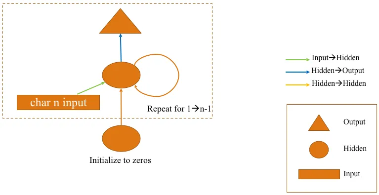

# 深度学习 2：第 2 部分第 12 课

> 原文：[`medium.com/@hiromi_suenaga/deep-learning-2-part-2-lesson-12-215dfbf04a94`](https://medium.com/@hiromi_suenaga/deep-learning-2-part-2-lesson-12-215dfbf04a94)
> 
> 译者：[飞龙](https://github.com/wizardforcel)
> 
> 协议：[CC BY-NC-SA 4.0](http://creativecommons.org/licenses/by-nc-sa/4.0/)

> 来自 [*fast.ai 课程*](http://www.fast.ai/)的个人笔记。随着我继续复习课程以“真正”理解它，这些笔记将继续更新和改进。非常感谢 [*Jeremy*](https://twitter.com/jeremyphoward) 和[*Rachel*](https://twitter.com/math_rachel) 给了我这个学习的机会。

# 生成对抗网络（GANs）

[视频](https://youtu.be/ondivPiwQho) / [论坛](http://forums.fast.ai/t/part-2-lesson-12-in-class/15023)



非常炙手可热的技术，但绝对值得成为课程中前沿深度学习部分的一部分，因为它们并不完全被证明对任何事情都有用，但它们几乎到了那个地步，肯定会成功。我们将专注于那些在实践中肯定会有用的事情，有许多领域可能会被证明有用，但我们还不知道。所以我认为它们在实践中肯定会有用的领域是你在幻灯片左侧看到的那种东西 —— 例如将绘画转化为渲染图片。这来自于[两天前刚刚发布的一篇论文](https://arxiv.org/abs/1804.04732)，所以目前正在进行非常活跃的研究。

**从上一堂课 [**[**1:04**](https://youtu.be/ondivPiwQho?t=1m4s)**]：** 我们的多样性研究员 Christine Payne 拥有斯坦福大学的医学硕士学位，因此她对构建医学语言模型感兴趣。我们在第四课中简要提到过的一件事，但上次并没有详细讨论的是，你实际上可以种子一个生成式语言模型，这意味着你已经在某个语料库上训练了一个语言模型，然后你将从该语言模型生成一些文本。你可以通过输入一些词来开始，告诉它“这是用来创建语言模型中隐藏状态的前几个词，请从这里生成”。Christine 做了一些聪明的事情，她用一个问题作为种子，重复这个问题三次，然后让它从那里生成。她向语言模型输入了许多不同的医学文本，并输入了下面看到的问题：

Jeremy 发现这个有趣的地方是，对于没有医学硕士学位的人来说，这几乎是一个可信的答案。但它与现实完全没有关系。他认为这是一种有趣的伦理和用户体验困境。Jeremy 参与了一个名为 doc.ai 的公司，该公司试图做很多事情，但最终提供一个应用程序供医生和患者使用，可以帮助他们解决医疗问题。他一直在对团队中的软件工程师说，请不要尝试使用 LSTM 或其他东西创建生成模型，因为它们会擅长创造听起来令人印象深刻但实际上是错误建议的东西 —— 就像政治评论员或终身教授可以以极大的权威说废话一样。所以他认为这是一个非常有趣的实验。如果你做了一些有趣的实验，请在论坛、博客、Twitter 上分享。让人们知道并受到了了不起的人的关注。

## CIFAR10 [[5:26](https://youtu.be/ondivPiwQho?t=5m26s)]

让我们谈谈 CIFAR10，原因是今天我们将看一些更基础的 PyTorch 内容，以构建这些生成对抗模型。目前没有关于 GAN 的 fastai 支持 - 很快就会有，但目前还没有，所以我们将从头开始构建许多模型。我们已经有一段时间没有进行严肃的模型构建了。在课程的第一部分中，我们看了 CIFAR10，并构建了一个准确率约为 85%的模型，训练时间约为几个小时。有趣的是，现在正在进行一项竞赛，看看谁能最快地训练 CIFAR10（[DAWN](https://dawn.cs.stanford.edu/benchmark/#cifar10-train-time)），目标是将准确率提高到 94%。看看我们是否能构建一个能够达到 94%准确率的架构，因为这比我们之前的尝试要好得多。希望通过这样做，我们将学到一些关于创建良好架构的东西，这对于今天研究 GANs 将会很有用。此外，这也很有用，因为 Jeremy 在过去几年深入研究了关于不同类型 CNN 架构的论文，并意识到这些论文中的许多见解并没有被广泛利用，显然也没有被广泛理解。因此，他想向您展示如果我们能利用其中一些理解会发生什么。

## [cifar10-darknet.ipynb](https://github.com/fastai/fastai/blob/master/courses/dl2/cifar10-darknet.ipynb) [[7:17](https://youtu.be/ondivPiwQho?t=7m17s)]

这个笔记本被称为[darknet](https://pjreddie.com/darknet/)，因为我们将要查看的特定架构与 darknet 架构非常接近。但在这个过程中，您会发现 darknet 架构并不是整个 YOLO v3 端到端的东西，而只是他们在 ImageNet 上预训练用于分类的部分。这几乎就像您可以想到的最通用的简单架构，因此它是实验的一个很好的起点。因此，我们将其称为“darknet”，但它并不完全是那样，您可以对其进行调整以创建绝对不是 darknet 的东西。它实际上只是几乎任何现代基于 ResNet 的架构的基础。

CIFAR10 是一个相当小的数据集[[8:06](https://youtu.be/ondivPiwQho?t=8m6s)]。图像大小仅为 32x32，这是一个很好的数据集，因为：

+   与 ImageNet 不同，您可以相对快速地对其进行训练

+   相对较少的数据

+   实际上很难识别这些图像，因为 32x32 太小了，很难看清楚发生了什么。

这是一个被低估的数据集，因为它很老。谁愿意使用小而古老的数据集，当他们可以利用整个服务器房间来处理更大的数据时。但这是一个非常好的数据集，值得关注。

继续导入我们通常使用的东西，我们将尝试从头开始构建一个网络来训练这个[[8:58](https://youtu.be/ondivPiwQho?t=8m58s)]。

```py
%matplotlib inline
%reload_ext autoreload
%autoreload 2
from fastai.conv_learner import *
PATH = Path("data/cifar10/")
os.makedirs(PATH,exist_ok=True)
```

对于那些对广播和 PyTorch 基本技能不是 100%自信的人来说，一个非常好的练习是弄清楚 Jeremy 是如何得出这些`stats`数字的。这些数字是 CIFAR10 中每个通道的平均值和标准差。尝试确保您可以重新创建这些数字，并查看是否可以在不超过几行代码的情况下完成（不使用循环！）。

由于这些数据相当小，我们可以使用比通常更大的批量大小，并且这些图像的大小为 32[[9:46](https://youtu.be/ondivPiwQho?t=9m46s)]。

```py
classes = (
    'plane', 'car', 'bird', 
    'cat', 'deer', 'dog', 'frog', 
    'horse', 'ship', 'truck'
)
stats = (
    np.array([ 0.4914 ,  0.48216,  0.44653]), 
    np.array([ 0.24703,  0.24349,  0.26159])
)

num_workers = num_cpus()//2
bs=256
sz=32
```

变换[[9:57](https://youtu.be/ondivPiwQho?t=9m57s)]，通常我们有这一套标准的 side_on 变换，用于普通物体的照片。我们不会在这里使用这个，因为这些图像太小了，尝试将一个 32x32 的图像稍微旋转会引入很多块状失真。人们倾向于使用的标准变换是随机水平翻转，然后我们在每一侧添加 4 个像素（尺寸除以 8）的填充。一个非常有效的方法是，默认情况下 fastai 不会添加黑色填充，而许多其他库会这样做。Fastai 会取现有照片的最后 4 个像素，翻转并反射它，我们发现使用反射填充会得到更好的结果。现在我们有了 40x40 的图像，在训练中，这组变换将随机选择 32x32 的裁剪，所以我们会有一点变化但不会太多。因此我们可以使用正常的`from_paths`来获取我们的数据。

```py
tfms = tfms_from_stats(
    stats, sz, 
    aug_tfms=[RandomFlip()], 
    pad=sz//8
)
data = ImageClassifierData.from_paths(
    PATH, 
    val_name='test', 
    tfms=tfms, 
    bs=bs
)
```

现在我们需要一个架构，我们将创建一个适合在一个屏幕上显示的架构[[11:07](https://youtu.be/ondivPiwQho?t=11m7s)]。这是从头开始的。我们正在使用预定义的`Conv2d`，`BatchNorm2d`，`LeakyReLU`模块，但我们没有使用任何块或其他东西。整个东西都在一个屏幕上，所以如果你曾经想知道我是否能理解一个现代的高质量架构，绝对可以！让我们来学习这个。

```py
def conv_layer(ni, nf, ks=3, stride=1):
    return nn.Sequential(
        nn.Conv2d(
            ni, nf, 
            kernel_size=ks, 
            bias=False, 
            stride=stride,
            padding=ks//2
        ),
        nn.BatchNorm2d(nf, momentum=0.01),
        nn.LeakyReLU(negative_slope=0.1, inplace=True)
    )
class ResLayer(nn.Module):
    def __init__(self, ni):
        super().__init__()
        self.conv1=conv_layer(ni, ni//2, ks=1)
        self.conv2=conv_layer(ni//2, ni, ks=3)

    def forward(self, x): 
        return x.add_(self.conv2(self.conv1(x)))
class Darknet(nn.Module):
    def make_group_layer(self, ch_in, num_blocks, stride=1):
        return [conv_layer(ch_in, ch_in*2,stride=stride)] + \
               [(ResLayer(ch_in*2)) for i in range(num_blocks)]

    def __init__(self, num_blocks, num_classes, nf=32):
        super().__init__()
        layers = [conv_layer(3, nf, ks=3, stride=1)]
        for i,nb in enumerate(num_blocks):
            layers += self.make_group_layer(nf, nb, stride=2-(i==1))
            nf *= 2
        layers += [
            nn.AdaptiveAvgPool2d(1), 
            Flatten(), 
            nn.Linear(nf, num_classes)
        ]
        self.layers = nn.Sequential(*layers)

    def forward(self, x): 
        return self.layers(x)
```

架构的基本起点是说它是一堆堆叠的层，一般来说会有一种层次结构[[11:51](https://youtu.be/ondivPiwQho?t=11m51s)]。在最底层，有像卷积层和批量归一化层这样的东西，但任何时候你有一个卷积，你可能会有一些标准的顺序。通常会是：

1.  卷积

1.  批量归一化

1.  一个非线性激活（例如 ReLU）

我们将从确定我们的基本单元是什么开始，并在一个函数（`conv_layer`）中定义它，这样我们就不必担心保持一致性，这将使一切变得更简单。

**Leaky Relu** [[12:43](https://youtu.be/ondivPiwQho?t=12m43s)]：

Leaky ReLU 的梯度（其中*x* < 0）会有所变化，但通常是 0.1 或 0.01 左右。其背后的想法是，当你处于负区域时，你不会得到一个零梯度，这会使更新变得非常困难。实践中，人们发现 Leaky ReLU 在较小的数据集上更有用，在大数据集上不太有用。但有趣的是，在[YOLO v3](https://pjreddie.com/media/files/papers/YOLOv3.pdf)论文中，他们使用了 Leaky ReLU，并从中获得了很好的性能。它很少会使事情变得更糟，通常会使事情变得更好。所以如果你需要创建自己的架构，Leaky ReLU 可能不错作为默认选择。

你会注意到我们在`conv_layer`中没有定义 PyTorch 模块，我们只是使用`nn.Sequential`[[14:07](https://youtu.be/ondivPiwQho?t=14m7s)]。如果你阅读其他人的 PyTorch 代码，你会发现这是一个被低估的东西。人们倾向于将一切都写成 PyTorch 模块，带有`__init__`和`forward`，但如果你想要的只是一系列按顺序排列的东西，将其作为`Sequential`会更简洁易懂。

**残差块** [[14:40](https://youtu.be/ondivPiwQho?t=14m40s)]：如前所述，大多数现代网络中通常有多个层次的单元，我们现在知道 ResNet 中这个单元层次结构的下一个级别是 ResBlock 或残差块（参见`ResLayer`）。回顾我们上次做 CIFAR10 时，我们过于简化了（有点作弊）。我们将`x`输入，经过一个`conv`，然后将其加回到`x`中输出。在真正的 ResBlock 中，有两个这样的块。当我们说`conv`时，我们将其作为`conv_layer`的快捷方式（卷积，批量归一化，ReLU）。

这里有一个有趣的观点是这些卷积中的通道数量。我们有一些 ni 进来（一些输入通道/滤波器的数量）。Darknet 团队设置的方式是，他们让每一个这些 Res 层输出与进来的相同数量的通道，Jeremy 喜欢这样做，这就是为什么他在`ResLayer`中使用它，因为这样会让生活更简单。第一个卷积将通道数量减半，然后第二个卷积再将其加倍。所以你有一个漏斗效应，64 个通道进来，通过第一个卷积压缩到 32 个通道，然后再次提升到 64 个通道输出。

**问题**：为什么`LeakyReLU`中要使用`inplace=True`？谢谢你的提问！很多人忘记了这一点或者不知道这一点，但这是一个非常重要的内存技巧。如果你想一下，这个`conv_layer`，它是最底层的东西，所以基本上我们的 ResNet 一旦全部组装起来，就会有很多`conv_layer`。如果你没有`inplace=True`，它会为 ReLU 的输出创建一个完全独立的内存块，这样就会分配一大堆完全不必要的内存。另一个例子是`ResLayer`中的原始`forward`看起来像这样：

```py
def forward(self, x): 
    return x + self.conv2(self.conv1(x))
```

希望你们中的一些人记得在 PyTorch 中几乎每个函数都有一个下划线后缀版本，告诉它在原地执行。`+`等同于`add`，`add`的原地版本是`add_`，这样可以减少内存使用量：

```py
def forward(self, x): 
    return x.add_(self.conv2(self.conv1(x)))
```

这些都是非常方便的小技巧。Jeremy 一开始忘记了`inplace=True`，但他不得不将批量大小降低到非常低的数量，这让他发疯了——然后他意识到那个部分缺失了。如果你使用了 dropout，你也可以这样做。以下是需要注意的事项：

+   Dropout

+   所有激活函数

+   任何算术操作

**问题**：在 ResNet 中，为什么`conv_layer`中的偏置通常设置为 False？在`Conv`之后，紧接着是`BatchNorm`。记住，`BatchNorm`对于每个激活有 2 个可学习参数——你要乘以的东西和你要添加的东西。如果我们在`Conv`中有偏置，然后在`BatchNorm`中再添加另一件事，那就是在添加两件事，这完全没有意义——这是两个权重，一个就够了。所以如果在`Conv`之后有一个`BatchNorm`，你可以告诉`BatchNorm`不要包括添加部分，或者更简单的方法是告诉`Conv`不要包括偏置。这没有特别的危害，但是会占用更多内存，因为它需要跟踪更多的梯度，所以最好避免。

另一个小技巧是，大多数人的`conv_layer`都有填充作为参数。但一般来说，你应该能够很容易地计算填充。如果卷积核大小为 3，那么显然每边会有一个单位的重叠，所以我们需要填充 1。或者，如果卷积核大小为 1，那么我们就不需要任何填充。所以一般来说，卷积核大小“整数除以 2”就是你需要的填充。有时会有一些调整，但在这种情况下，这个方法非常有效。再次尝试简化我的代码，让计算机为我计算东西，而不是我自己去做。

另一个关于这两个`conv_layer`的事情：我们有这个瓶颈的想法（减少通道然后再增加），还有要使用的卷积核大小。第一个有 1 乘 1 的`Conv`。1 乘 1 卷积实际上发生了什么？如果我们有一个 4 乘 4 的网格，有 32 个滤波器/通道，我们将进行 1 乘 1 卷积，卷积的核看起来像中间的那个。当我们谈论卷积核大小时，我们从来没有提到最后一部分——但假设它是 1 乘 1 乘 32，因为这是输入和输出的滤波器的一部分。卷积核被放在黄色的第一个单元上，我们得到这 32 个深度位的点积，这给了我们第一个输出。然后我们将其移动到第二个单元并得到第二个输出。所以对于网格中的每个点，都会有一堆点积。这使我们能够以任何我们想要的方式改变通道维度。我们创建了`ni//2`个滤波器，我们将有`ni//2`个点积，基本上是输入通道的不同加权平均值。通过非常少的计算，它让我们添加了这个额外的计算和非线性步骤。这是一个很酷的技巧，利用这些 1 乘 1 卷积，创建这个瓶颈，然后再用 3 乘 3 卷积拉出来——这将充分利用输入的 2D 特性。否则，1 乘 1 卷积根本不利用这一点。

这两行代码，里面没有太多内容，但这是一个对你对正在发生的事情的理解和直觉的很好的测试——为什么它有效？为什么张量秩是对齐的？为什么维度都很好地对齐？为什么这是一个好主意？它到底在做什么？这是一个很好的东西来调整。也许在 Jupyter Notebook 中创建一些小的实例，自己运行一下，看看输入和输出是什么。真正感受一下。一旦你这样做了，你就可以尝试不同的东西。

这篇真正被低估的论文是这篇[Wide Residual Networks](https://arxiv.org/abs/1605.07146)。这篇论文非常简单，但他们做的是围绕这两行代码进行调整：

+   如果我们用`ni*2`代替`ni//2`会怎样？

+   如果我们添加`conv3`呢？

他们提出了一种简单的符号表示来定义这两行代码可能的样子，并展示了许多实验。他们展示的是，在 ResNet 中普遍采用的减少通道数量的瓶颈方法可能不是一个好主意。实际上，根据实验结果，绝对不是一个好主意。因为这样可以创建非常深的网络。创建 ResNet 的人因为创建了 1001 层网络而变得特别有名。但是 1001 层的问题在于，你无法在完成第 1 层之前计算第 2 层。你无法在完成计算第 2 层之前计算第 3 层。所以是顺序的。GPU 不喜欢顺序。所以他们展示的是，如果层数较少但每层计算量更大——一个简单的方法是去掉`//2`，没有其他改变：

在家里试试吧。尝试运行 CIFAR 看看会发生什么。甚至乘以 2 或者摆弄一下。这样可以让你的 GPU 做更多的工作，这非常有趣，因为绝大多数关于不同架构性能的论文实际上从来没有计算运行一个批次需要多长时间。他们说“这个需要每批次 X 个浮点运算”，但他们从来没有真正费心像一个合格的实验者那样运行它，找出它是快还是慢。现在很有名的很多架构结果都很慢，占用大量内存，完全没用，因为研究人员从来没有费心看看它们是否快，实际上看看它们是否适合正常批次大小的内存。所以 Wide ResNet 论文之所以不同在于它实际上计算了运行所需的时间，YOLO v3 论文也做了同样的发现。他们可能错过了 Wide ResNet 论文，因为 YOLO v3 论文得出了很多相同的结论，但 Jeremy 不确定他们是否引用了 Wide ResNet 论文，所以他们可能不知道所有这些工作已经完成。看到人们实际上在计时并注意到什么是有意义的是很好的。

**问题**：你对 SELU（缩放指数线性单元）有什么看法？[[29:44](https://youtu.be/ondivPiwQho?t=29m44s)] SELU 主要用于全连接层，它允许你摆脱批量归一化，基本思想是，如果你使用这种不同的激活函数，它是自归一化的。自归一化意味着它将始终保持单位标准差和零均值，因此你不需要批量归一化。它实际上并没有取得什么进展，原因是因为它非常挑剔 — 你必须使用非常特定的初始化，否则它就不会以完全正确的标准差和均值开始。很难将其用于诸如嵌入之类的东西，如果你这样做，那么你必须使用一种特定类型的嵌入初始化，这对嵌入来说是没有意义的。你做了所有这些工作，很难搞对，最终如果你搞对了，有什么意义呢？好吧，你成功摆脱了一些并没有真正伤害你的批量归一化层。有趣的是 SELU 论文 — 人们注意到它的主要原因是因为它是由 LSTM 的发明者创建的，而且它有一个巨大的数学附录。所以人们认为“一个名人的大量数学 — 必定很棒！”但实际上，Jeremy 没有看到任何人使用它来获得任何最先进的结果或赢得任何比赛。

`Darknet.make_group_layer`包含一堆`ResLayer`[[31:28](https://youtu.be/ondivPiwQho?t=31m28s)]。`group_layer`将会有一些通道/滤波器进入。我们将通过使用标准的`conv_layer`来使进入的通道数量加倍。可选地，我们将通过使用步幅为 2 来减半网格大小。然后我们将做一系列的 ResLayers — 我们可以选择多少个（2、3、8 等），因为记住 ResLayers 不会改变网格大小，也不会改变通道数量，所以你可以添加任意数量而不会造成任何问题。这将使用更多的计算和内存，但除此之外你可以添加任意数量。因此，`group_layer`最终将使通道数量加倍，因为初始卷积使通道数量加倍，取决于我们传入的`stride`，如果我们设置`stride=2`，它也可能减半网格大小。然后我们可以做一系列 Res 块的计算，任意数量。

定义我们的`Darknet`，我们将传入类似这样的东西[[33:13](https://youtu.be/ondivPiwQho?t=33m13s)]：

```py
m = Darknet([1, 2, 4, 6, 3], num_classes=10, nf=32)
m = nn.DataParallel(m, [1,2,3])
```

这意味着创建五个组层：第一个将包含 1 个额外的 ResLayer，第二个将包含 2 个，然后是 4 个，6 个，3 个，我们希望从 32 个滤波器开始。第一个 ResLayers 将包含 32 个滤波器，只会有一个额外的 ResLayer。第二个将会使滤波器数量翻倍，因为每次有一个新的组层时我们都会这样做。所以第二个将有 64 个，然后 128 个，256 个，512 个，就这样。几乎整个网络将由这些层组成，记住，每个组层在开始时也有一个卷积。所以在这之前，我们将在一开始有一个卷积层，在最后我们将执行标准的自适应平均池化，展平，并在最后创建一个线性层来生成最终的类别数量。总结一下，一个端有一个卷积，自适应池化和另一个端有一个线性层，中间是这些组层，每个组层由一个卷积层和`n`个 ResLayers 组成。

**自适应平均池化**：Jeremy 多次提到过这个，但他还没有看到任何代码，任何示例，任何地方使用自适应平均池化。他看到的每一个都像`nn.AvgPool2d(n)`这样写，其中`n`是一个特定的数字-这意味着它现在与特定的图像大小绑定在一起，这绝对不是您想要的。所以大多数人仍然认为特定的架构与特定的大小绑定在一起。当人们认为这样时，这是一个巨大的问题，因为这会严重限制他们使用更小的尺寸来启动建模或使用更小的尺寸进行实验的能力。

**Sequential**：创建架构的一个好方法是首先创建一个列表，在这种情况下，这是一个只有一个`conv_layer`的列表，然后`make_group_layer`返回另一个列表。然后我们可以用`+=`将该列表附加到前一个列表中，并对包含`AdaptiveAvnPool2d`的另一个列表执行相同操作。最后，我们将调用所有这些层的`nn.Sequential`。现在`forward`只是`self.layers(x)`。

这是如何使您的架构尽可能简单的好方法。有很多可以摆弄的地方。您可以将`ni`的除数参数化，使其成为您传入的数字，以传入不同的数字-也许是乘以 2。您还可以传入一些可以改变内核大小或改变卷积层数量的参数。Jeremy 有一个版本，他将为您运行，其中实现了 Wide ResNet 论文中的所有不同参数，因此他可以摆弄看看哪些效果好。

```py
lr = 1.3
learn = ConvLearner.from_model_data(m, data)
learn.crit = nn.CrossEntropyLoss()
learn.metrics = [accuracy]
wd=1e-4
%time learn.fit(
    lr, 1, 
    wds=wd, 
    cycle_len=30, 
    use_clr_beta=(20, 20, 0.95, 0.85)
)
```

一旦我们有了这个，我们可以使用`ConvLearner.from_model_data`来获取我们的 PyTorch 模块和模型数据对象，并将它们转换为一个学习器。给它一个标准，如果我们喜欢，可以添加一个指标，然后我们可以拟合并开始。

**问题**：您能解释一下自适应平均池化吗？将其设置为 1 是如何工作的？当我们进行平均池化时，通常情况下，假设我们有 4x4，然后进行`avgpool((2, 2))`。这将创建一个 2x2 的区域（下方的蓝色），并取这四个的平均值。如果我们传入`stride=1`，下一个是 2x2（绿色），然后取平均值。这就是正常的 2x2 平均池化。如果我们没有填充，那么输出将是 3x3。如果我们想要 4x4，我们可以添加填充。

如果我们想要 1x1 呢？那么我们可以说`avgpool((4,4), stride=1)`，这将在黄色中进行 4x4 并对整体进行平均，结果为 1x1。但这只是一种方法。与其说池化滤波器的大小，为什么不说“我不在乎输入网格的大小。我总是想要一个一个”。这就是你说`adap_avgpool(1)`的地方。在这种情况下，你不说池化滤波器的大小，而是说我们想要的输出大小。我们想要的是一个一个。如果你放一个单独的整数`n`，它会假设你的意思是`n`乘以`n`。在这种情况下，一个 4x4 网格的自适应平均池化与平均池化(4,4)相同。如果是一个 7x7 的网格进来，它将与平均池化(7,7)相同。这是相同的操作，只是以一种方式表达，无论输入是什么，我们都希望得到那个大小的输出。

**DAWNBench**：让我们看看我们的简单网络与这些最新技术结果相比如何。Jeremy 已经准备好命令了。我们已经将所有这些东西放入一个简单的 Python 脚本中，他修改了一些他提到的参数，创建了一个他称之为`wrn_22`网络，它并不存在，但根据 Jeremy 的实验，它对我们讨论的参数进行了一些改变。它有一堆很酷的东西，比如：

+   莱斯利·史密斯的一个周期

+   半精度浮点实现

这将在 AWS p3 上运行，它有 8 个 GPU 和 Volta 架构的 GPU，这些 GPU 对半精度浮点有特殊支持。Fastai 是第一个实际将 Volta 优化的半精度浮点集成到库中的库，所以你只需`learn.half()`就可以自动获得支持。它也是第一个集成一个周期的库。

实际上，这是使用 PyTorch 的多 GPU 支持。由于有八个 GPU，它实际上会启动八个单独的 Python 处理器，每个处理器都会训练一点，然后最后将梯度更新传回主进程，主进程将把它们全部整合在一起。所以你会看到很多进度条一起弹出。

你可以看到这种方式训练三到四秒。而在之前，当 Jeremy 早些时候训练时，他每个时代要花 30 秒。所以用这种方式，我们可以训练东西大约快 10 倍，这很酷。

**检查状态**：

完成了！我们达到了 94%，用时 3 分 11 秒。之前的最新技术是 1 小时 7 分钟。折腾这些参数，学习这些架构实际上是如何工作的，而不仅仅是使用开箱即用的东西，值得吗？哇哦。我们刚刚使用了一个公开可用的实例（我们使用了一个 spot 实例，所以花费了我们每小时 8 美元——3 分钟 40 美分）来从头开始训练，比以往任何人都要快 20 倍。所以这是最疯狂的最新技术结果之一。我们看到了很多，但这个结果真的让人大吃一惊。这在很大程度上要归功于调整这些架构参数，主要是关于使用莱斯利·史密斯的一个周期。提醒一下它在做什么，对于学习率，它创建了一个向上的路径，与向下的路径一样长，所以它是真正的三角形循环学习率（CLR）。像往常一样，你可以选择 x 和 y 的比例（即起始 LR/峰值 LR）。在

在这种情况下，我们选择了 50 作为比率。所以我们从更小的学习率开始。然后它有一个很酷的想法，你可以说你的 epochs 的百分之几是从三角形底部一直下降到几乎为零 - 这是第二个数字。所以 15%的批次花在从我们的三角形底部进一步下降。

这不是一个周期所做的唯一事情，我们还有动量。动量从 0.95 到 0.85。换句话说，当学习率很低时，我们使用很大的动量，当学习率很高时，我们使用很少的动量，这很有道理，但在 Leslie Smith 在论文中展示之前，Jeremy 从未见过有人这样做。这是一个非常酷的技巧。你现在可以通过在 fastai 中使用`use-clr-beta`参数来使用它（Sylvain 的论坛帖子），你应该能够复制最先进的结果。你可以在自己的计算机上或者 paper space 上使用它，唯一得不到的是多 GPU 部分，但这样训练会更容易一些。

**问题**：`make_group_layer`包含步幅等于 2，这意味着第一层的步幅为 1，其他所有层的步幅为 2。背后的逻辑是什么？通常我见过的步幅是奇数。步幅要么是 1，要么是 2。我认为你在考虑卷积核大小。所以步幅=2 意味着我跨越两个，这意味着你的网格大小减半。所以我认为你可能在步幅和卷积核大小之间混淆了。如果步幅为 1，网格大小不会改变。如果步幅为 2，那么会改变。在这种情况下，因为这是 CIFAR10，32x32 很小，我们不会经常减半网格大小，因为很快我们就会用完单元格。这就是为什么第一层的步幅为 1，这样我们不会立即减小网格大小。这是一种很好的做法，因为这就是为什么我们一开始在大网格上没有太多计算`Darknet([1, 2, 4, 6, 3], …)`。我们可以从大网格上开始，然后随着网格变小，逐渐增加更多的计算，因为网格越小，计算所需的时间就越少。

# 生成对抗网络（GAN）[[48:49](https://youtu.be/ondivPiwQho?t=48m49s)]

+   [沃瑟斯坦 GAN](https://arxiv.org/abs/1701.07875)

+   [使用深度卷积生成对抗网络进行无监督表示学习](https://arxiv.org/abs/1511.06434)

我们将讨论生成对抗网络，也称为 GAN，具体来说，我们将专注于沃瑟斯坦 GAN 论文，其中包括后来创建 PyTorch 的 Soumith Chintala。沃瑟斯坦 GAN（WGAN）受到了深度卷积生成对抗网络论文的重大影响，Soumith 也参与其中。这是一篇非常有趣的论文。很多内容看起来像这样：

好消息是你可以跳过那些部分，因为还有一个看起来像这样的部分：

很多论文都有一个理论部分，似乎完全是为了满足审稿人对理论的需求。但 WGAN 论文并非如此。理论部分实际上很有趣 - 你不需要了解它就能使用它，但如果你想了解一些很酷的想法，并看到为什么选择这种特定算法的思考过程，那绝对是迷人的。在这篇论文出来之前，Jeremy 不认识任何研究其基础数学的人，所以每个人都必须学习这些数学知识。这篇论文做了很好的工作，列出了所有的要点（你需要自己阅读一些内容）。所以如果你对深入研究某篇论文背后更深层次的数学感兴趣，想看看学习它是什么感觉，我会选择这篇，因为在那个理论部分结束时，你会说“我现在明白他们为什么要设计这种算法了。”

GAN 的基本思想是它是一个生成模型[[51:23](https://youtu.be/ondivPiwQho?t=51m23s)]。它将创建句子、创建图像或生成一些东西。它将尝试创建一些很难区分生成的东西和真实的东西的东西。因此，生成模型可以用于换脸视频——目前发生的深度伪造和虚假色情非常有争议。它可以用来伪造某人的声音。它可以用来伪造对医学问题的回答——但在这种情况下，它并不是真正的伪造，它可以是对医学问题的生成回答，实际上是一个好的回答，因此你在生成语言。例如，你可以为图像生成标题。因此，生成模型有许多有趣的应用。但一般来说，它们需要足够好，例如，如果你要用它自动为凯丽·费舍尔在下一部星球大战电影中的新场景而她已经不在了，你想尝试生成一个看起来一样的图像，那么它必须欺骗星球大战的观众，让他们认为“好吧，那看起来不像奇怪的凯丽·费舍尔——那看起来像真正的凯丽·费舍尔。或者如果你试图生成对医学问题的回答，你希望生成的英语读起来流畅清晰，并且听起来有权威和意义。生成对抗网络的思想是我们不仅要创建一个生成模型来创建生成的图像，还要创建一个第二个模型，它将尝试挑选哪些是真实的，哪些是生成的（我们将称之为“假的”）。因此，我们有一个生成器，它将创建我们的虚假内容，还有一个鉴别器，它将努力变得擅长识别哪些是真实的，哪些是假的。因此，将有两个模型，它们将是对抗性的，意味着生成器将努力不断提高欺骗鉴别器认为假的是真实的能力，而鉴别器将努力不断提高区分真实和虚假的能力。因此，它们将正面交锋。这基本上就像 Jeremy 刚刚描述的那样[[54:14](https://youtu.be/ondivPiwQho?t=54m14s)]：

+   我们将在 PyTorch 中构建两个模型

+   我们将创建一个训练循环，首先说鉴别器的损失函数是“你能分辨真实和虚假吗，然后更新那个的权重。

+   我们将为生成器创建一个损失函数，即“你能生成一些能欺骗鉴别器的东西并从中更新权重。

+   然后我们将循环几次并看看会发生什么。

## 查看代码[[54:52](https://youtu.be/ondivPiwQho?t=54m52s)]

[笔记本](https://github.com/fastai/fastai/blob/master/courses/dl2/wgan.ipynb)

GAN 有很多不同的用途。我们将做一些有点无聊但易于理解的事情，而且甚至可能的是我们将从无中生成一些图片。我们只是让它画一些图片。具体来说，我们将让它画卧室的图片。希望你有机会在这一周内使用自己的数据集玩耍。如果你选择一个非常多样化的数据集，比如 ImageNet，然后让 GAN 尝试创建 ImageNet 的图片，它往往做得不太好，因为你想要的图片不够清晰。所以最好给它，例如，有一个名为[CelebA](http://mmlab.ie.cuhk.edu.hk/projects/CelebA.html)的数据集，其中包含名人的脸部图片，这对 GAN 非常有效。你可以生成真实但实际上不存在的名人脸。卧室数据集也是一个不错的选择——同一种类型的图片。

有一个叫做 LSUN 场景分类数据集的东西。

```py
from fastai.conv_learner import *
from fastai.dataset import *
import gzip
```

下载 LSUN 场景分类数据集卧室类别，解压缩它，并将其转换为 jpg 文件（脚本文件夹在`dl2`文件夹中）：

```py
curl 'http://lsun.cs.princeton.edu/htbin/download.cgi?tag=latest&category=bedroom&set=train' -o bedroom.zip
unzip bedroom.zip
pip install lmdb
python lsun-data.py {PATH}/bedroom_train_lmdb --out_dir {PATH}/bedroom
```

这在 Windows 上没有经过测试 - 如果不起作用，您可以使用 Linux 框来转换文件，然后复制它们。或者，您可以从 Kaggle 数据集中下载这个 20%的样本。

```py
PATH = Path('data/lsun/')
IMG_PATH = PATH/'bedroom'
CSV_PATH = PATH/'files.csv'
TMP_PATH = PATH/'tmp'
TMP_PATH.mkdir(exist_ok=True)
```

在处理我们的数据时，通过 CSV 路线会更容易。因此，我们生成一个包含我们想要的文件列表和一个虚假标签“0”的 CSV，因为我们实际上根本没有这些标签。一个 CSV 文件包含卧室数据集中的所有内容，另一个包含随机的 10%。这样做很好，因为这样我们在实验时大多数时间可以使用样本，因为即使只是读取列表也需要很长时间，因为有超过一百万个文件。

```py
files = PATH.glob('bedroom/**/*.jpg')

with CSV_PATH.open('w') as fo:
    for f in files: 
        fo.write(f'{f.relative_to(IMG_PATH)},0\n')
        # Optional - sampling a subset of files
CSV_PATH = PATH/'files_sample.csv'
files = PATH.glob('bedroom/**/*.jpg')

with CSV_PATH.open('w') as fo:
    for f in files:
        if random.random()<0.1: 
            fo.write(f'{f.relative_to(IMG_PATH)},0\n')
```

这看起来非常熟悉。这是在 Jeremy 意识到顺序模型更好之前。因此，如果将这与以前的顺序模型的卷积块进行比较，这里有更多的代码行数——但它做的事情是一样的，卷积，ReLU，批量归一化。

```py
class ConvBlock(nn.Module):
    def __init__(self, ni, no, ks, stride, bn=True, pad=None):
        super().__init__()
        if pad is None: 
            pad = ks//2//stride
        self.conv = nn.Conv2d(
            ni, no, 
            ks, stride, 
            padding=pad, 
            bias=False
        )
        self.bn = nn.BatchNorm2d(no) if bn else None
        self.relu = nn.LeakyReLU(0.2, inplace=True)

    def forward(self, x):
        x = self.relu(self.conv(x))
        return self.bn(x) if self.bn else x
```

我们要做的第一件事是构建一个鉴别器。鉴别器将接收一幅图像作为输入，并输出一个数字。如果它认为这幅图像是真实的，那么这个数字应该更低。当然，“它为什么输出一个更低的数字”这个问题不会出现在架构中，这将在损失函数中。所以我们所要做的就是创建一个接收图像并输出数字的东西。这些代码的很多部分都是从这篇论文的原始作者那里借来的，所以一些命名方案与我们习惯的不同。但它看起来与我们之前的很相似。我们从卷积（conv，ReLU，批量归一化）开始。然后我们有一堆额外的卷积层——这不会使用残差，所以它看起来与之前非常相似，有一堆额外的层，但这些将是卷积层而不是残差层。最后，我们需要添加足够的步幅为 2 的卷积层，使网格大小减小到不大于 4x4。所以它将继续使用步幅 2，将大小除以 2，并重复直到我们的网格大小不大于 4。这是一个非常好的方法，可以创建网络中所需的任意数量的层，以处理任意大小的图像并将它们转换为固定的已知网格大小。

**问题**：GAN 是否需要比狗和猫或 NLP 等更多的数据？还是可以相提并论？老实说，我有点尴尬地说我不是 GAN 的专家从业者。我在第一部分教授的东西是我很高兴地说我知道如何做这些事情的最佳方式，所以我可以展示像我们刚刚在 CIFAR10 中所做的那样的最新结果，有一些学生的帮助。我在 GAN 方面一点也不行，所以我不太确定你需要多少。总的来说，似乎需要相当多，但请记住我们在狗和猫方面不需要太多的原因是因为我们有一个预训练模型，我们可以利用预训练的 GAN 模型并微调它们，可能。据我所知，我认为没有人这样做过。这可能是人们考虑和实验的一个非常有趣的事情。也许人们已经这样做了，有一些文献我们还没有接触到。我对 GAN 的主要文献有一些了解，但并不是全部，所以也许我错过了关于 GAN 中迁移学习的一些内容。但这可能是不需要太多数据的诀窍。

问题：是单周期学习率和动量退火加上八个 GPU 并行训练在半精度下的巨大加速？只有消费级 GPU 才能进行半精度计算吗？另一个问题，为什么从单精度到半精度的计算速度提高了 8 倍，而从双精度到单精度只提高了 2 倍？好的，所以 CIFAR10 的结果，从单精度到半精度并不是提高了 8 倍。从单精度到半精度大约快了 2 到 3 倍。NVIDIA 声称张量核心的 flops 性能，在学术上是正确的，但在实践中是没有意义的，因为这真的取决于你需要什么调用来做什么事情——所以半精度大约提高了 2 到 3 倍。所以半精度有所帮助，额外的 GPU 有所帮助，单周期有很大帮助，然后另一个关键部分是我告诉你的参数调整。所以仔细阅读 Wide ResNet 论文，识别他们在那里发现的东西的类型，然后编写一个你刚刚看到的架构的版本，使我们可以轻松地调整参数，整夜不眠地尝试每种可能的不同核大小、核数、层组数、层组大小的组合。记住，我们做了一个瓶颈，但实际上我们更倾向于扩大，所以我们增加了大小，然后减小了，因为这更好地利用了 GPU。所以所有这些结合在一起，我会说单周期也许是最关键的，但每一个都导致了巨大的加速。这就是为什么我们能够在 CIFAR10 的最新技术上取得 30 倍的改进。我们对其他事情有一些想法——在这个 DAWN 基准完成之后，也许我们会尝试更进一步，看看是否可以在某一天打破一分钟。那将很有趣。

```py
class DCGAN_D(nn.Module):
    def __init__(self, isize, nc, ndf, n_extra_layers=0):
        super().__init__()
        assert isize % 16 == 0, "isize has to be a multiple of 16"

        self.initial = ConvBlock(nc, ndf, 4, 2, bn=False)
        csize,cndf = isize/2,ndf
        self.extra = nn.Sequential(*[
            ConvBlock(cndf, cndf, 3, 1)
            for t in range(n_extra_layers)
        ])

        pyr_layers = []
        while csize > 4:
            pyr_layers.append(ConvBlock(cndf, cndf*2, 4, 2))
            cndf *= 2; csize /= 2
        self.pyramid = nn.Sequential(*pyr_layers)

        self.final = nn.Conv2d(cndf, 1, 4, padding=0, bias=False)

    def forward(self, input):
        x = self.initial(input)
        x = self.extra(x)
        x = self.pyramid(x)
        return self.final(x).mean(0).view(1)
```

所以这是我们的鉴别器。关于架构需要记住的重要事情是它除了有一些输入张量大小和秩，以及一些输出张量大小和秩之外，什么也不做。正如你所看到的，最后一个卷积层只有一个通道。这与我们通常的做法不同，因为通常我们的最后一层是一个线性块。但我们这里的最后一层是一个卷积块。它只有一个通道，但它的网格大小大约是 4x4（不超过 4x4）。所以我们将输出（假设是 4x4），4x4x1 张量。然后我们计算平均值。所以它从 4x4x1 变成一个标量。这有点像最终的自适应平均池化，因为我们有一个通道，我们取平均值。这有点不同——通常我们首先进行平均池化，然后通过一个全连接层来得到我们的输出。但这里是得到一个通道，然后取平均值。Jeremy 怀疑如果我们按照正常方式做会更好，但他还没有尝试过，他也没有足够好的直觉来知道是否漏掉了什么——但如果有人想要尝试在自适应平均池化层和一个具有单个输出的全连接层之后添加一个，那将是一个有趣的实验。

这就是一个鉴别器。假设我们已经有了一个生成器——有人说“好的，这里有一个生成卧室的生成器。我希望你建立一个模型，可以找出哪些是真实的，哪些是假的”。我们将拿取数据集，并标记一堆来自生成器的假卧室图像，以及 LSUN 数据集中真实卧室的一堆图像，然后在每个图像上贴上 1 或 0。然后我们将尝试让鉴别器区分出差异。所以这将是足够简单的。但我们还没有得到一个生成器。我们需要建立一个。我们还没有讨论损失函数——我们将假设有一个损失函数可以做到这一点。

## 生成器

生成器也是一种架构，本身不会做任何事情，直到我们有损失函数和数据。但张量的秩和大小是什么？生成器的输入将是一个随机数向量。在论文中，他们称之为“先验”。有多大？我们不知道。这个想法是不同的一堆随机数将生成一个不同的卧室。因此，我们的生成器必须将一个向量作为输入，通过顺序模型，将其转换为一个秩为 4 的张量（没有批量维度的秩为 3）-高度乘以宽度乘以 3。因此，在最后一步，`nc`（通道数）最终将变为 3，因为它将创建一个大小为 3 的通道图像。

```py
class DeconvBlock(nn.Module):
    def __init__(self, ni, no, ks, stride, pad, bn=True):
        super().__init__()
        self.conv = nn.ConvTranspose2d(
            ni, no, 
            ks, stride, 
            padding=pad, bias=False
        )
        self.bn = nn.BatchNorm2d(no)
        self.relu = nn.ReLU(inplace=True)

    def forward(self, x):
        x = self.relu(self.conv(x))
        return self.bn(x) if self.bn else x
class DCGAN_G(nn.Module):
    def __init__(self, isize, nz, nc, ngf, n_extra_layers=0):
        super().__init__()
        assert isize % 16 == 0, "isize has to be a multiple of 16"

        cngf, tisize = ngf//2, 4
        while tisize!=isize: 
            cngf*=2; tisize*=2
        layers = [DeconvBlock(nz, cngf, 4, 1, 0)]

        csize, cndf = 4, cngf
        while csize < isize//2:
            layers.append(DeconvBlock(cngf, cngf//2, 4, 2, 1))
            cngf //= 2; csize *= 2

        layers += [
            DeconvBlock(cngf, cngf, 3, 1, 1) 
            for t in range(n_extra_layers)
        ]
        layers.append(nn.ConvTranspose2d(cngf, nc, 4, 2, 1, bias=False))
        self.features = nn.Sequential(*layers)

    def forward(self, input): 
        return F.tanh(self.features(input))
```

问题：在 ConvBlock 中，为什么批量归一化在 ReLU 之后（即`self.bn(self.relu(...))`）？我通常期望先进行 ReLU，然后批量归一化，这实际上是 Jeremy 认为有意义的顺序。我们在 darknet 中使用的顺序是 darknet 论文中使用的顺序，所以每个人似乎对这些事情有不同的顺序。事实上，大多数人对 CIFAR10 有一个不同的顺序，即批量归一化→ReLU→卷积，这是一种奇特的思考方式，但事实证明，对于残差块来说，这通常效果更好。这被称为“预激活 ResNet”。有一些博客文章中，人们已经尝试了不同顺序的事物，似乎这很大程度上取决于特定数据集以及您正在处理的内容，尽管性能差异很小，除非是为了比赛，否则您不会在意。

## 反卷积

因此，生成器需要从一个向量开始，最终得到一个秩为 3 的张量。我们还不知道如何做到这一点。我们需要使用一种称为“反卷积”的东西，PyTorch 称之为转置卷积-相同的东西，不同的名称。反卷积是一种增加网格大小而不是减小网格大小的东西。因此，像所有事物一样，在 Excel 电子表格中最容易看到。

这是一个卷积。我们开始，假设有一个单通道的 4x4 网格单元。让我们通过一个单输出滤波器的 3x3 核心。所以我们有一个输入通道，一个滤波器核心，如果我们不添加任何填充，最终会得到 2x2。记住，卷积只是核心和适当网格单元的乘积的总和。所以这是我们标准的 3x3 卷积一个通道一个滤波器。

现在的想法是我们想要朝相反的方向发展。我们想要从我们的 2x2 开始，我们想要创建一个 4x4。具体来说，我们想要创建与我们开始的相同的 4x4。我们想通过使用卷积来实现这一点。我们如何做到这一点？

如果我们有一个 3x3 卷积，那么如果我们想要创建一个 4x4 输出，我们将需要创建这么多填充：

因为有这么多填充，我们最终会得到 4x4。所以假设我们的卷积滤波器只是一堆零，那么我们可以通过进行这个减法来计算每个单元格的错误：

然后我们可以通过对这些错误的绝对值求和来获得绝对值之和（L1 损失）：

现在我们可以使用优化，在 Excel 中称为“求解器”来进行梯度下降。所以我们将设置总单元格等于最小值，然后尝试通过改变我们的滤波器来减少我们的损失。你可以看到它提出了一个滤波器，使得结果几乎像数据一样。它并不完美，一般来说，你不能假设反卷积可以完全创建出你想要的完全相同的东西，因为这里没有足够的。因为滤波器中有 9 个东西，结果中有 16 个东西。但它做出了一个相当不错的尝试。所以这就是反卷积的样子 - 在一个 2x2 的网格单元上进行步长为 1 的 3x3 反卷积。

**问题**: 创建一个鉴别器来识别假新闻和真实新闻有多难？你不需要任何特殊的东西 - 那只是一个分类器。所以你可以使用之前课程和第 4 课的 NLP 分类器。在这种情况下，没有生成部分，所以你只需要一个数据集，其中说这些是我们认为是假新闻的东西，这些是我们认为是真实新闻的东西，它应该工作得非常好。据我们所知，如果你尝试，你应该得到和其他人一样好的结果 - 它是否足够实用，Jeremy 不知道。在这个阶段，你能做的最好的事情可能是生成一种分类，说这些东西看起来相当可疑，基于它们的写作方式，然后一些人可以去核实它们。NLP 分类器和 RNN 不能核实事实，但它可以识别这些是以那种高度通俗的风格写成的，通常假新闻就是这样写的，所以也许这些值得关注。这可能是你在不依赖某种外部数据源的情况下所能希望的最好的结果。但重要的是要记住，鉴别器基本上只是一个分类器，你不需要任何特殊的技术，超出我们已经学会的 NLP 分类的范围。

## ConvTranspose2d 

在 PyTorch 中进行反卷积，只需说：

`nn.ConvTranspose2d(ni, no, ks, stride, padding=pad, bias=False)`

+   `ni`: 输入通道的数量

+   `no`: 输出通道的数量

+   `ks`: 卷积核大小

它被称为 ConvTranspose 的原因是因为事实证明这与卷积的梯度计算是相同的。这就是为什么他们这样称呼它。

**可视化** 

[`deeplearning.net/software/theano/tutorial/conv_arithmetic.html`](http://deeplearning.net/software/theano/tutorial/conv_arithmetic.html)

左边的是我们刚刚看到的进行 2x2 反卷积。如果有一个步长为 2，那么你不仅在外面周围有填充，而且你实际上还需要在中间放填充。它们实际上并不是这样实现的，因为这样做很慢。在实践中，你会以不同的方式实现它们，但所有这些都是在幕后发生的，所以你不必担心。我们之前已经讨论过这个[卷积算术教程](http://deeplearning.net/software/theano/tutorial/conv_arithmetic.html)，如果你对卷积仍然不熟悉，并且想要熟悉反卷积，这是一个很好的网站。如果你想看这篇论文，它是[A guide to convolution arithmetic for deep learning](https://arxiv.org/abs/1603.07285)。

`DeconvBlock` 看起来与 `ConvBlock` 几乎相同，只是多了一个 `Transpose`。我们像以前一样进行卷积 → relu → 批量归一化，它有输入滤波器和输出滤波器。唯一的区别是步长为 2 意味着网格大小会加倍而不是减半。

问题：`nn.ConvTranspose2d` 和 `nn.Upsample` 似乎做着相同的事情，即从上一层扩展网格大小（高度和宽度）。我们可以说 `nn.ConvTranspose2d` 总是优于 `nn.Upsample` 吗，因为 `nn.Upsample` 仅仅是调整大小并用零或插值填充未知部分吗？不，不能。在 distill.pub 上有一篇名为 [反卷积和棋盘伪影](https://distill.pub/2016/deconv-checkerboard/) 的出色互动论文指出，我们现在正在做的事情极其不理想，但好消息是其他人都在这样做。

看一下这里，你能看到这些棋盘伪影吗？这些都来自实际论文，基本上他们注意到每一篇关于生成模型的论文都有这些棋盘伪影，他们意识到这是因为当您使用大小为三的内核的步幅 2 卷积时，它们会重叠。因此，一些网格单元会获得两倍的激活。

因此，即使您从随机权重开始，最终也会得到一个棋盘状的伪影。所以你越深入，情况就越糟。他们的建议没有那么直接，Jeremy 发现对于大多数生成模型，上采样更好。如果你使用 `nn.Upsample`，基本上是在做池化的相反操作 —— 它说让我们用四个（2x2）网格单元替换这一个。有许多方法可以进行上采样 —— 一种方法是将所有内容复制到这四个单元格中，另一种方法是使用双线性或双三次插值。有各种技术可以尝试创建平滑的上采样版本，您可以在 PyTorch 中选择任何一种。如果您进行了 2x2 的上采样，然后正常的 3x3 卷积，这是另一种与 ConvTranspose 相同的操作方式 —— 它将网格大小加倍，并对其进行一些卷积运算。对于生成模型，这几乎总是效果更好。在 distil.pub 的出版物中，他们指出也许这是一个好方法，但他们没有直接说出来，而 Jeremy 会直接说出来。话虽如此，对于 GANS，他还没有取得太大的成功，他认为可能需要一些调整才能使其正常工作。问题在于在早期阶段，它没有产生足够的噪音。他尝试过使用上采样的版本，您可以看到噪音看起来并不是很嘈杂。下周当我们研究风格转移和超分辨率时，您将看到 `nn.Upsample` 真正发挥作用。

生成器，我们现在可以从向量开始。我们可以决定并说好，让我们不把它看作一个向量，而实际上是一个 1x1 的网格单元，然后我们可以将其转换为 4x4，然后是 8x8 等等。这就是为什么我们必须确保它是一个合适的倍数，以便我们可以创建出正确大小的东西。正如您所看到的，它正在做与之前完全相反的事情。它每次使单元格大小增加 2，直到达到我们想要的一半大小，然后最后我们再添加 `n` 个，步幅为 1。然后我们再添加一个 ConvTranspose 最终得到我们想要的大小，然后我们完成了。最后我们通过一个 `tanh`，这将强制我们处于零到一的范围内，因为当然我们不希望输出任意大小的像素值。因此，我们有一个生成器架构，它输出一个给定大小的图像，具有正确数量的通道，值在零到一之间。

在这一点上，我们现在可以创建我们的模型数据对象。这些东西需要一段时间来训练，所以我们将其设置为 128x128（只是一个更快的便利方式）。因此，这将是输入的大小，但然后我们将使用转换将其转换为 64x64。

最近有更多的进展，试图将其提高到高分辨率大小，但它们仍然倾向于要求批量大小为 1 或大量的 GPU。所以我们试图做一些可以用单个消费者 GPU 完成的事情。这是一个 64x64 卧室的例子。

```py
bs,sz,nz = 64,64,100
tfms = tfms_from_stats(inception_stats, sz)
md = ImageClassifierData.from_csv(
    PATH, 'bedroom', 
    CSV_PATH, 
    tfms=tfms, 
    bs=128, 
    skip_header=False, 
    continuous=True
)
md = md.resize(128)
x,_ = next(iter(md.val_dl))
plt.imshow(md.trn_ds.denorm(x)[0]);
```

## 将它们全部放在一起

我们将几乎所有事情都手动完成，所以让我们继续创建我们的两个模型 - 我们的生成器和鉴别器，正如你所看到的它们是 DCGAN，换句话说，它们是出现在这篇论文中的相同模块。值得回头看一下 DCGAN 论文，看看这些架构是什么，因为假定当你阅读 Wasserstein GAN 论文时，你已经知道这一点。

```py
netG = DCGAN_G(sz, nz, 3, 64, 1).cuda()
netD = DCGAN_D(sz, 3, 64, 1).cuda()
```

问题：如果我们想要在 0 到 1 之间的值，我们不应该使用 sigmoid 吗？像往常一样，我们的图像已经被归一化为范围从-1 到 1，因此它们的像素值不再在 0 到 1 之间。这就是为什么我们希望值从-1 到 1，否则我们将无法为鉴别器提供正确的输入。

所以我们有一个生成器和一个鉴别器，我们需要一个返回“先验”向量（即一堆噪音）的函数。我们通过创建一堆零来实现这一点。`nz`是`z`的大小 - 在我们的代码中经常看到一个神秘的字母，那是因为那是他们在论文中使用的字母。这里，`z`是我们噪音向量的大小。然后我们使用正态分布生成 0 到 1 之间的随机数。这需要是一个变量，因为它将参与梯度更新。

```py
def create_noise(b): 
   return V(torch.zeros(b, nz, 1, 1).normal_(0, 1))
preds = netG(create_noise(4))
pred_ims = md.trn_ds.denorm(preds)

fig, axes = plt.subplots(2, 2, figsize=(6, 6))
for i,ax in enumerate(axes.flat): 
    ax.imshow(pred_ims[i])
```

这里是创建一些噪音并生成四个不同噪音片段的示例。

```py
def gallery(x, nc=3):
    n,h,w,c = x.shape
    nr = n//nc
    assert n == nr*nc
    return (
        x.reshape(nr, nc, h, w, c)
         .swapaxes(1,2)
         .reshape(h*nr, w*nc, c)
    )
```

我们需要一个优化器来更新我们的梯度。在 Wasserstein GAN 论文中，他们告诉我们使用 RMSProp：

我们可以很容易地在 PyTorch 中做到这一点：

```py
optimizerD = optim.RMSprop(netD.parameters(), lr = 1e-4)
optimizerG = optim.RMSprop(netG.parameters(), lr = 1e-4)
```

在论文中，他们建议使用学习率为 0.00005（`5e-5`），我们发现`1e-4`似乎有效，所以我们将其增加了一点。

现在我们需要一个训练循环：

为了更容易阅读

训练循环将经过我们选择的一些时代（这将是一个参数）。记住，当你手动完成所有事情时，你必须记住所有手动步骤：

1.  当你训练模型时，你必须将模块设置为训练模式，并在评估时将其设置为评估模式，因为在训练模式下，批量归一化更新会发生，丢失会发生，在评估模式下，这两个事情会被关闭。

1.  我们将从我们的训练数据加载器中获取一个迭代器

1.  我们将看看我们需要经过多少步，然后我们将使用`tqdm`给我们提供一个进度条，然后我们将经过那么多步。

论文中算法的第一步是更新鉴别器（在论文中，他们称鉴别器为“评论家”，`w`是评论家的权重）。所以第一步是训练我们的评论家一点点，然后我们将训练我们的生成器一点点，然后我们将回到循环的顶部。论文中的内部`for`循环对应于我们代码中的第二个`while`循环。

现在我们要做的是我们现在有一个随机的生成器。所以我们的生成器将生成看起来像噪音的东西。首先，我们需要教我们的鉴别器区分噪音和卧室之间的区别 - 你希望这不会太难。所以我们只是按照通常的方式做，但有一些小调整：

1.  我们将获取一小批真实卧室照片，这样我们就可以从迭代器中获取下一批，将其转换为变量。

1.  然后我们将计算损失——这将是鉴别器认为这看起来假的程度（“真实的看起来假吗？”）。

1.  然后我们将创建一些假图像，为此我们将创建一些随机噪音，并将其通过我们的生成器，这个阶段它只是一堆随机权重。这将创建一个小批量的假图像。

1.  然后我们将通过与之前相同的鉴别器模块来获取该损失（“假的看起来有多假？”）。记住，当你手动做所有事情时，你必须在循环中将梯度归零（`netD.zero_grad()`）。如果你忘记了这一点，请回到第 1 部分课程，我们从头开始做所有事情。

1.  最后，总鉴别器损失等于真实损失减去假损失。

所以你可以在这里看到：

他们没有谈论损失，实际上他们只谈论了一个梯度更新。

在 PyTorch 中，我们不必担心获取梯度，我们只需指定损失并调用`loss.backward()`，然后鉴别器的`optimizer.step()`。有一个关键步骤，即我们必须将 PyTorch 模块中的所有权重（参数）保持在-0.01 和 0.01 的小范围内。为什么？因为使该算法工作的数学假设仅适用于一个小球。了解为什么这样是有趣的数学是有趣的，但这与这篇论文非常相关，了解它不会帮助你理解其他论文，所以只有在你感兴趣的情况下才去学习。Jeremy 认为这很有趣，但除非你对 GANs 非常感兴趣，否则这不会是你在其他地方会重复使用的信息。他还提到，在改进的 Wasserstein GAN 出现后，有更好的方法来确保你的权重空间在这个紧密球内，即惩罚梯度过高，所以现在有稍微不同的方法来做这个。但这行代码是关键贡献，它是使 Wasserstein GAN 成功的关键：

```py
for p in netD.parameters(): p.data.clamp_(-0.01, 0.01)
```

在这之后，我们有一个可以识别真实卧室和完全随机糟糕生成的图像的鉴别器。现在让我们尝试创建一些更好的图像。所以现在将可训练的鉴别器设置为 false，将可训练的生成器设置为 true，将生成器的梯度归零。我们的损失再次是生成器的`fw`（鉴别器）应用于一些更多的随机噪音。所以这与之前完全相同，我们对噪音进行生成，然后将其传递给鉴别器，但这次，可训练的是生成器，而不是鉴别器。换句话说，在伪代码中，更新的是θ，即生成器的参数。它接受噪音，生成一些图像，尝试弄清楚它们是假的还是真实的，并使用这些梯度来更新生成器的权重，而不是之前我们是根据鉴别器来获取梯度，并使用 RMSProp 和 alpha 学习率来更新我们的权重。

```py
def train(niter, first=True):
    gen_iterations = 0
    for epoch in trange(niter):
        netD.train(); netG.train()
        data_iter = iter(md.trn_dl)
        i,n = 0,len(md.trn_dl)
        with tqdm(total=n) as pbar:
            while i < n:
                set_trainable(netD, True)
                set_trainable(netG, False)
                d_iters = (
                    100 
                    if (first and (gen_iterations < 25) 
                              or  (gen_iterations % 500 == 0)) 
                    else 5
                )
                j = 0
                while (j < d_iters) and (i < n):
                    j += 1; i += 1
                    for p in netD.parameters(): 
                        p.data.clamp_(-0.01, 0.01)
                    real = V(next(data_iter)[0])
                    real_loss = netD(real)
                    fake = netG(create_noise(real.size(0)))
                    fake_loss = netD(V(fake.data))
                    netD.zero_grad()
                    lossD = real_loss-fake_loss
                    lossD.backward()
                    optimizerD.step()
                    pbar.update()

                set_trainable(netD, False)
                set_trainable(netG, True)
                netG.zero_grad()
                lossG = netD(netG(create_noise(bs))).mean(0).view(1)
                lossG.backward()
                optimizerG.step()
                gen_iterations += 1

        print(
            f'Loss_D {to_np(lossD)}; Loss_G {to_np(lossG)}; ' + 
            f'D_real {to_np(real_loss)}; Loss_D_fake {to_np(fake_loss)}'
        )
```

你会发现鉴别器被训练*ncritic*次（上面代码中的 d_iters），他们将其设置为 5，每次我们训练生成器一次。论文中谈到了这一点，但基本思想是如果鉴别器还不知道如何区分，那么让生成器变得更好是没有意义的。这就是为什么我们有第二个 while 循环。这里是 5：

```py
d_iters = (
    100 
    if (first and (gen_iterations < 25) 
              or  (gen_iterations % 500 == 0)) 
    else 5
)
```

实际上，稍后的论文中添加的内容或者可能是补充材料是，不时地在开始时，您应该在鉴别器上执行更多步骤，以确保鉴别器是有能力的。

```py
torch.backends.cudnn.benchmark=True
```

让我们为一个时代进行训练：

```py
train(1, False)0%|          | 0/1 [00:00<?, ?it/s]
100%|██████████| 18957/18957 [19:48<00:00, 10.74it/s]
Loss_D [-0.67574]; Loss_G [0.08612]; D_real [-0.1782]; Loss_D_fake [0.49754]
100%|██████████| 1/1 [19:49<00:00, 1189.02s/it]
```

然后让我们创建一些噪音，这样我们就可以生成一些示例。

```py
fixed_noise = create_noise(bs)
```

但在此之前，将学习率降低 10 倍，并再进行一次训练：

```py
set_trainable(netD, True)
set_trainable(netG, True)
optimizerD = optim.RMSprop(netD.parameters(), lr = 1e-5)
optimizerG = optim.RMSprop(netG.parameters(), lr = 1e-5)
train(1, False)
'''
0%|          | 0/1 [00:00<?, ?it/s]
100%|██████████| 18957/18957 [23:31<00:00, 13.43it/s]
Loss_D [-1.01657]; Loss_G [0.51333]; D_real [-0.50913]; Loss_D_fake [0.50744]
100%|██████████| 1/1 [23:31<00:00, 1411.84s/it]
'''
```

然后让我们使用噪音传递给我们的生成器，然后通过我们的反标准化将其转换回我们可以看到的东西，然后绘制它：

```py
netD.eval(); netG.eval();
fake = netG(fixed_noise).data.cpu()
faked = np.clip(md.trn_ds.denorm(fake),0,1)

plt.figure(figsize=(9,9))
plt.imshow(gallery(faked, 8));
```

我们有一些卧室。这些不是真实的卧室，有些看起来并不像卧室，但有些看起来很像卧室，这就是想法。这就是 GAN。最好的方法是将 GAN 视为一种基础技术，你可能永远不会像这样使用它，但你会以许多有趣的方式使用它。例如，我们将使用它来创建一个循环 GAN。

**问题**：为什么要特别使用 RMSProp 作为优化器，而不是 Adam 等等？我不记得论文中有明确讨论过这个问题。我不知道这是实验性的还是理论上的原因。看看论文中是怎么说的。

[来自论坛](http://forums.fast.ai/t/part-2-lesson-12-wiki/15023/211)

> 通过实验，我发现 Adam 和 WGAN 不仅效果更差 - 它导致生成器训练失败。
> 
> 来自 WGAN 论文：
> 
> *最后，作为一个负面结果，我们报告说当使用基于动量的优化器（如 Adam [8]（具有β1>0））对评论者进行训练时，WGAN 训练有时会变得不稳定，或者当使用高学习率时。由于评论者的损失是非平稳的，基于动量的方法似乎表现更差。我们确定动量可能是一个潜在原因，因为随着损失的增加和样本变得更糟，Adam 步骤和梯度之间的余弦通常变为负值。这种余弦为负值的唯一情况是在这些不稳定的情况下。因此，我们转而使用 RMSProp [21]，它被认为在非平稳问题上表现良好*

**问题**: 在训练过程中，检测过拟合的一个合理方法是什么？或者在训练结束后评估这些 GAN 模型的性能的一个方法是什么？换句话说，训练/验证/测试集的概念如何转化为 GANs [[1:41:57](https://youtu.be/ondivPiwQho?t=1h41m57s)]？这是一个很棒的问题，很多人开玩笑说 GANs 是唯一不需要测试集的领域，人们利用这一点编造东西并说看起来很棒。GANs 存在一些著名的问题，其中之一被称为模式崩溃。模式崩溃发生在你查看卧室时，结果发现只有三种卧室，每个可能的噪声向量都映射到这三种卧室中的一种。你查看画廊，结果发现它们都是相同的东西或者只有三种不同的东西。模式崩溃很容易看到，如果崩溃到一个很小的模式数量，比如 3 或 4。但如果模式崩溃到 10,000 种模式怎么办？因此，只有 10,000 种可能的卧室，所有的噪声向量都崩溃到这些卧室。你不太可能在我们刚刚看到的画廊视图中看到，因为在 10,000 种卧室中很少会有两个相同的卧室。或者如果每个卧室基本上是输入的直接副本 —— 它基本上记住了一些输入。这可能正在发生吗？事实是，大多数论文在检查这些问题方面做得不好，有时甚至根本不检查。因此，我们如何评估 GANs 甚至也许我们应该真正正确地评估 GANs 是一个现在还不够广泛理解的问题。一些人正在努力推动。Ian Goodfellow 是最著名的深度学习书籍的第一作者，也是 GANs 的发明者，他一直在发送持续的推文提醒人们测试 GANs 的重要性。如果你看到一篇声称有异常 GAN 结果的论文，那么这绝对值得关注。他们是否谈到了模式崩溃？他们是否谈到了记忆化？等等。

**问题**: GANs 可以用于数据增强吗 [[1:45:33](https://youtu.be/ondivPiwQho?t=1h45m33s)]？是的，绝对可以使用 GAN 进行数据增强。你应该吗？我不知道。有一些论文尝试使用 GANs 进行半监督学习。我还没有找到任何特别引人注目的论文，在广泛研究的真正有趣的数据集上展示出最先进的结果。我有点怀疑，原因是在我的经验中，如果用合成数据训练模型，神经网络将变得极其擅长识别你合成数据的具体问题，并且最终学到的将是这些问题。还有很多其他方法可以做半监督模型，效果很好。有一些地方可以工作。例如，你可能还记得 Otavio Good 在第一部分的缩放卷积网络中创建的那个奇妙的可视化，其中显示了字母通过 MNIST，他，至少在那个时候，是自动遥控汽车比赛中的第一名，他使用合成增强数据训练了他的模型，基本上是拿真实的汽车绕着赛道行驶的视频，然后添加了虚假的人和虚假的其他汽车。我认为这样做效果很好，因为 A. 他有点天才，B. 因为我认为他有一个明确定义的小子集需要处理。但总的来说，使用合成数据真的很难。我尝试过几十年使用合成数据和模型（显然不包括 GANs，因为它们是相当新的），但总的来说，这很难做到。非常有趣的研究问题。

# Cycle GAN [[1:41:08](https://youtu.be/ondivPiwQho?t=1h41m8s)]

[Paper](https://arxiv.org/abs/1703.10593) / [Notebook](https://github.com/fastai/fastai/blob/master/courses/dl2/cyclegan.ipynb)

我们将使用 cycle GAN 将马变成斑马。您也可以使用它将莫奈的印刷品转变为照片，或将优胜美地夏季的照片转变为冬季。

这将非常简单，因为它只是一个神经网络。我们要做的就是创建一个包含大量斑马照片的输入，并将每个照片与等价的马照片配对，然后训练一个从一个到另一个的神经网络。或者您可以对每幅莫奈的画做同样的事情——创建一个包含该地点照片的数据集……哦等等，这不可能，因为莫奈绘制的地方已经不存在了，也没有确切的斑马版本的马……这将如何运作？这似乎违背了我们对神经网络能做什么以及它们如何做的一切认知。

所以某种方式，这些伯克利的人创造了一个模型，可以将马变成斑马，尽管没有任何照片。除非他们出去画马并拍摄前后照片，但我相信他们没有。那么他们是如何做到的呢？这有点天才。

我知道目前正在进行最有趣的 cycle GAN 实践的人是我们的学生 Helena Sarin。她是我所知道的唯一一位 cycle GAN 艺术家。

以下是她更多令人惊叹的作品，我觉得非常有趣。我在这堂课开始时提到，GANs 属于尚未出现的东西，但它们几乎已经到位了。在这种情况下，世界上至少有一个人正在使用 GANs（具体来说是 cycle GANs）创作美丽而非凡的艺术作品。至少我知道有十几个人正在用神经网络进行有趣的创意工作。创意人工智能领域将会大幅扩展。

这是基本的技巧。这是来自 cycle GAN 论文。我们将有两幅图像（假设我们正在处理图像）。关键是它们不是配对的图像，所以我们没有一组马和等价斑马的数据集。我们有一堆马，一堆斑马。拿一匹马*X*，拿一匹斑马*Y*。我们将训练一个生成器（他们在这里称之为“映射函数”），将马变成斑马。我们将称之为映射函数*G*，并创建一个将斑马变成马的映射函数（也称为生成器），我们将称之为*F*。我们将创建一个鉴别器，就像以前一样，它将尽可能地识别真假马，我们将称之为*Dx*。另一个鉴别器，它将尽可能地识别真假斑马，我们将称之为*Dy*。这是我们的起点。

使这个工作的关键[[1:51:27](https://youtu.be/ondivPiwQho?t=1h51m27s)] - 所以我们在这里生成一个损失函数(*Dx*和*Dy*)。我们将创建一个叫做**循环一致性损失**的东西，它说当你用生成器将你的马变成斑马后，检查我是否能识别它是真实的。我们将我们的马变成斑马，然后尝试将那只斑马再变回我们开始的同一匹马。然后我们将有另一个函数，它将检查这匹马是否与原始马相似，这匹马是完全由这只斑马*Y*生成的，不知道*x*的任何信息。所以想法是，如果你生成的斑马看起来一点也不像原始马，你就没有机会将其变回原始马。因此，将*x-hat*与*x*进行比较的损失会非常糟糕，除非你能进入*Y*再出来，如果你能够创建一个看起来像原始马的斑马，那么你可能能够做到这一点。反之亦然 - 将你的斑马变成一个假马，检查你是否能识别它，然后尝试将其变回原始斑马并检查它是否看起来像原始的。

注意*F*（斑马到马）和*G*（马到斑马）正在做两件事。它们都将原始马变成斑马，然后将斑马再变回原始马。所以只有两个生成器。没有一个单独的生成器用于反向映射。你必须使用用于原始映射的相同生成器。这就是循环一致性损失。我认为这是天才。这种事情甚至可能存在的想法。老实说，当这一点出现时，我从未想过我甚至可以尝试解决这个问题。它似乎如此明显地不可能，然后你可以像这样解决它的想法 - 我只是觉得这太聪明了。

看这篇论文中的方程式是很好的，因为它们是很好的例子 - 它们写得相当简单，不像一些瓦瑟斯坦 GAN 论文那样，那些是很多理论证明和其他东西。在这种情况下，它们只是列出了正在发生的事情的方程式。你真的想要达到一个可以阅读并理解它们的程度。

所以我们有一匹马*X*和一只斑马*Y*。对于一些映射函数*G*，这是我们的马到斑马映射函数，然后有一个 GAN 损失，这是我们已经熟悉的一部分，它说我们有一匹马，一只斑马，一个假斑马识别器和一个马斑马生成器。损失就是我们之前看到的 - 我们能够从我们的斑马中画出一只斑马并识别它是真实的还是假的。然后拿一匹马变成一只斑马并识别它是真实的还是假的。然后做一减另一个（在这种情况下，它们里面有一个对数，但对数并不是非常重要）。这就是我们刚刚看到的东西。这就是为什么我们先做了瓦瑟斯坦 GAN。这只是一个标准的数学形式的 GAN 损失。

问题：所有这些听起来很像将一种语言翻译成另一种语言，然后再翻译回原来的语言。GANs 或任何等效物已经尝试过翻译吗？来自论坛的论文。回到我所知道的 — 通常在翻译中，你需要这种配对的输入（即平行文本 — “这是这个英语句子的法语翻译”）。最近有几篇论文显示了在没有配对数据的情况下创建高质量翻译模型的能力。我还没有实施它们，我不理解我没有实施的任何东西，但它们很可能在做同样的基本想法。我们将在本周内研究一下，并回复您。

循环一致性损失：所以我们有一个 GAN 损失，接下来是循环一致性损失。基本思想是我们从我们的马开始，使用我们的斑马生成器创建一匹斑马，然后使用我们的马生成器创建一匹马，并将其与原始马进行比较。这个双线与 1 是 L1 损失 — 差异的绝对值的和。否则，如果这是 2，那么它将是 L2 损失，即平方差的和。

我们现在知道这个波浪线的想法是从我们的马抓取一匹马。这就是我们所说的从分布中取样。有各种各样的分布，但在这些论文中，我们最常用的是经验分布，换句话说，我们有一些数据行，抓取一行。所以这里，它是说从数据中抓取一些东西，我们将称那个东西为*x*。为了重新概括：

1.  从我们的马图片中，抓取一匹马

1.  将其变成斑马

1.  将其转换回马

1.  将其与原始图像进行比较并求绝对值的和

1.  也对斑马进行同样的操作

1.  然后将两者相加

这就是我们的循环一致性损失。

完整目标

现在我们得到了我们的损失函数，整个损失函数取决于：

+   我们的马生成器

+   一个斑马生成器

+   我们的马识别器

+   我们的斑马识别器（又名鉴别器）

我们将加起来：

+   用于识别马的 GAN 损失

+   用于识别斑马的 GAN 损失

+   我们两个生成器的循环一致性损失

我们这里有一个 lambda，希望我们现在对这个想法有点习惯了，当你有两种不同的损失时，你可以加入一个参数，这样你可以将它们乘以一个相同的比例。我们在定位时也对我们的边界框损失与分类器损失做了类似的事情。

然后对于这个损失函数，我们将尝试最大化鉴别器的辨别能力，同时最小化生成器的辨别能力。因此，生成器和鉴别器将面对面地对抗。当你在论文中看到这个 *min max* 时，基本上意味着在你的训练循环中，一个东西试图让某事变得更好，另一个东西试图让某事变得更糟，有很多方法可以做到，但最常见的是你会在两者之间交替。你经常会在数学论文中看到这个被简称为 min-max。所以当你看到 min-max 时，你应该立即想到对抗训练。

## 实施循环 GAN

让我们看看代码。我们将要做一些几乎闻所未闻的事情，那就是我开始查看别人的代码，但并没有对整个东西感到恶心，然后自己重新做。我实际上说我相当喜欢这个，我喜欢它到足以向我的学生展示。这是代码的来源，这是一个为循环 GAN 创建原始代码的人之一，他们创建了一个 PyTorch 版本。我不得不稍微整理一下，但实际上它还是相当不错的。这个酷的地方是，你现在将看到几乎所有 fast.ai 的部分，或者其他相关的 fast.ai 部分，是由其他人以不同的方式编写的。所以你将看到他们如何处理数据集、数据加载器、模型、训练循环等等。

你会发现有一个`cgan`目录，这基本上几乎是原始的，只是做了一些清理，我希望有一天能提交为 PR。它是以一种不幸地使它与他们作为脚本使用的方式过于连接的方式编写的，所以我稍微整理了一下，以便我可以将其用作模块。但除此之外，它还是相当相似的。

```py
from fastai.conv_learner import *
from fastai.dataset import *
from cgan.options.train_options import *
```

所以`cgan`是他们从 github 仓库复制的代码，做了一些小的改动。`cgan`迷你库的设置方式是，它假设配置选项是被传递到像脚本一样。所以他们有`TrainOptions().parse`方法，我基本上传入一个脚本选项的数组（我的数据在哪里，有多少线程，我想要丢弃吗，我要迭代多少次，我要怎么称呼这个模型，我要在哪个 GPU 上运行）。这给我们一个`opt`对象，你可以看到它包含了什么。你会看到它包含了一些我们没有提到的东西，那是因为它对我们没有提到的其他所有东西都有默认值。

```py
opt = TrainOptions().parse(['--dataroot',    
   '/data0/datasets/cyclegan/horse2zebra', '--nThreads', '8', 
   '--no_dropout', '--niter', '100', '--niter_decay', '100', 
   '--name', 'nodrop', '--gpu_ids', '2'])
```

所以我们不再使用 fast.ai 的东西，我们将主要使用 cgan 的东西。

```py
from cgan.data.data_loader import CreateDataLoader
from cgan.models.models import create_model
```

我们首先需要的是一个数据加载器。这也是一个很好的机会，让你再次练习使用你选择的编辑器或 IDE 浏览代码的能力。我们将从`CreateDataLoader`开始。你应该能够找到符号或在 vim 标签中直接跳转到`CreateDataLoader`，我们可以看到它创建了一个`CustomDatasetDataLoader`。然后我们可以看到`CustomDatasetDataLoader`是一个`BaseDataLoader`。我们可以看到它将使用标准的 PyTorch DataLoader，这很好。我们知道如果要使用标准的 PyTorch DataLoader，你需要传递一个数据集，我们知道数据集是包含长度和索引器的东西，所以当我们查看`CreateDataset`时，它应该会这样做。

这里是`CreateDataset`，这个库不仅仅是循环 GAN - 它处理对齐和不对齐的图像对。我们知道我们的图像对是不对齐的，所以我们要使用`UnalignedDataset`。

正如预期的那样，它有`__getitem__`和`__len__`。对于长度，A 和 B 是我们的马和斑马，我们有两组，所以较长的那个将是`DataLoader`的长度。`__getitem__`将会：

+   随机从我们的两匹马和斑马中抓取一些东西

+   用 Pillow（PIL）打开它们

+   通过一些转换运行它们

+   然后我们可以把马变成斑马，或者把斑马变成马，所以有一些方向

+   返回我们的马、斑马、马的路径和斑马的路径

希望你能看到这看起来与 fast.ai 所做的事情非常相似。当涉及到转换和性能时，fast.ai 显然做了更多，但请记住，这是为这个特定事情的研究代码，他们做了这么多工作，这是相当酷的。

```py
data_loader = CreateDataLoader(opt)
dataset = data_loader.load_data()
dataset_size = len(data_loader)
dataset_size
'''
1334
'''
```

我们有一个数据加载器，所以我们可以将我们的数据加载到其中[[2:06:17](https://youtu.be/ondivPiwQho?t=2h6m17s)]。这将告诉我们其中有多少个小批次（这是 PyTorch 数据加载器的长度）。

下一步是创建一个模型。同样的想法，我们有不同类型的模型，我们将要做一个循环 GAN。

这是我们的`CycleGANModel`。`CycleGANModel`中有相当多的内容，所以让我们逐步找出将要使用的内容。在这个阶段，我们只是调用了初始化器，所以当我们初始化它时，它将会定义两个生成器，一个用于我们的马，一个用于斑马。它有一种方法来生成一组假数据，然后我们将获取我们的 GAN 损失，正如我们所讨论的，我们的循环一致性损失是一个 L1 损失。他们将使用 Adam，显然对于循环 GAN，他们发现 Adam 效果很好。然后我们将为我们的马判别器、斑马判别器和生成器各自创建一个优化器。生成器的优化器将包含马生成器和斑马生成器的参数，所有这些都在一个地方。

因此，初始化器将设置我们需要的所有不同网络和损失函数，并将它们存储在这个`model`中[[2:08:14](https://youtu.be/ondivPiwQho?t=2h8m14s)]。

```py
model = create_model(opt)
```

然后打印出并向我们展示我们拥有的 PyTorch 模型。看到他们正在使用 ResNets，你会发现 ResNets 看起来非常熟悉，所以我们有卷积、批量归一化、Relu。`InstanceNorm`基本上与批量归一化相同，但它是针对一幅图像应用的，区别并不特别重要。你可以看到他们正在做反射填充，就像我们一样。当你尝试像这样从头开始构建所有东西时，这是很多工作，你可能会忘记 fast.ai 自动为你做的一些好事。你必须手动完成所有这些工作，最终只能得到其中的一部分。所以随着时间的推移，希望很快，我们将把所有这些 GAN 内容整合到 fast.ai 中，这将变得简单而容易。

我们有我们的模型，记住模型包含损失函数、生成器、判别器，所有这些都在一个方便的地方[[2:09:32](https://youtu.be/ondivPiwQho?t=2h9m32s)]。我已经复制、粘贴并稍微重构了他们代码中的训练循环，这样我们就可以在笔记本中运行它。所以这个应该看起来很熟悉。一个循环用于遍历每个 epoch，一个循环用于遍历数据。在这之前，我们设置了`dataset`。实际上这不是一个 PyTorch 数据集，我认为这是他们稍微令人困惑地用来谈论他们的组合数据，我们称之为模型数据对象——他们需要的所有数据。用`tqdm`循环遍历它，以获得进度条，这样我们就可以看看模型中发生了什么。

```py
total_steps = 0

for epoch in range(opt.epoch_count, opt.niter + opt.niter_decay+1):
    epoch_start_time = time.time()
    iter_data_time = time.time()
    epoch_iter = 0

    for i, data in tqdm(enumerate(dataset)):
        iter_start_time = time.time()
        if total_steps % opt.print_freq == 0: 
             t_data = iter_start_time - iter_data_time
        total_steps += opt.batchSize
        epoch_iter += opt.batchSize
        model.set_input(data)
        model.optimize_parameters()

        if total_steps % opt.display_freq == 0:
            save_result = total_steps % opt.update_html_freq == 0

        if total_steps % opt.print_freq == 0:
            errors = model.get_current_errors()
            t = (time.time() - iter_start_time) / opt.batchSize

        if total_steps % opt.save_latest_freq == 0:
            print(
                'saving the latest model(epoch %d,total_steps %d)'
                % (epoch, total_steps)
            )
            model.save('latest')

        iter_data_time = time.time()
    if epoch % opt.save_epoch_freq == 0:
        print(
            'saving the model at the end of epoch %d, iters %d' 
            % (epoch, total_steps)
        )
        model.save('latest')
        model.save(epoch)

    print(
        'End of epoch %d / %d \t Time Taken: %d sec' %
        (
            epoch, opt.niter + opt.niter_decay, 
            time.time() - epoch_start_time
        )
    )
    model.update_learning_rate()
```

`set_input`[[2:10:32](https://youtu.be/ondivPiwQho?t=2h10m32s)]：这是一种与 fast.ai 中所做的不同方法。这很巧妙，它相当特定于循环 GAN，但基本上在这个模型内部的想法是，我们将进入我们的数据并获取适当的数据。我们要么将马转换为斑马，要么将斑马转换为马，取决于我们选择的方式，`A`要么是马要么是斑马，反之亦然。如果需要，将其放在适当的 GPU 上，然后获取适当的路径。因此，模型现在有一批马和一批斑马。

现在我们优化参数[[2:11:19](https://youtu.be/ondivPiwQho?t=2h11m19s)]。这样看起来很好。你可以看到每一步。首先，尝试优化生成器，然后尝试优化马判别器，然后尝试优化斑马判别器。`zero_grad()`是 PyTorch 的一部分，以及`step()`。因此，有趣的部分是实际执行生成器反向传播的部分。

这里是[2:12:04]。让我们跳到关键部分。这里有我们刚刚在论文中看到的所有公式。让我们拿一匹马生成一只斑马。现在让我们使用鉴别器来看看我们是否能够判断它是假的还是真的（`pred_fake`）。然后让我们将其放入我们之前设置的损失函数中，以基于该预测获得 GAN 损失。然后让我们以相反的方向做同样的事情，使用相反的鉴别器，然后再次通过损失函数。然后让我们做循环一致性损失。再次，我们拿我们创建的假的东西，尝试将其转回原始状态。让我们使用之前创建的循环一致性损失函数将其与真实原始状态进行比较。这里是那个 lambda - 所以有一些权重我们使用了，实际上我们只是使用了他们在选项中建议的默认值。然后对相反的方向做同样的事情，然后将它们全部加在一起。然后进行反向步骤。就是这样。

所以我们可以为第一个鉴别器做同样的事情[2:13:50]。因为基本上所有的工作现在都已经完成了，这里要做的事情就少得多了。就是这样。我们不会一步步走过来，但基本上是我们已经看到的相同的基本东西。

所以`optimize_parameters()`正在计算损失并执行优化器步骤。不时保存并打印一些结果。然后不时更新学习率，所以他们在这里也有一些学习率退火的机制。有点像 fast.ai，他们有这个调度器的概念，你可以用它来更新你的学习率。

对于那些对更好地理解深度学习 API、更多地为 fast.ai 做贡献，或者在一些不同的后端中创建自己版本的一些东西感兴趣的人，看看第二个 API 是很酷的，它涵盖了一些类似的东西的一些子集，以便了解他们是如何解决这些问题的，以及相似之处/不同之处是什么。

```py
def show_img(im, ax=None, figsize=None):
    if not ax: 
        fig,ax = plt.subplots(figsize=figsize)
    ax.imshow(im)
    ax.get_xaxis().set_visible(False)
    ax.get_yaxis().set_visible(False)
    return ax
def get_one(data):
    model.set_input(data)
    model.test()
    return list(model.get_current_visuals().values())
model.save(201)
test_ims = []
for i,o in enumerate(dataset):
    if i>10: 
        break
    test_ims.append(get_one(o))
def show_grid(ims):
    fig,axes = plt.subplots(2,3,figsize=(9,6))
    for i,ax in enumerate(axes.flat): 
        show_img(ims[i], ax);
    fig.tight_layout()
for i in range(8): 
    show_grid(test_ims[i])
```

我们训练了一段时间，然后我们可以随便拿几个例子，这里有它们[2:15:29]。这里有马、斑马，然后再变回马。

我花了大约 24 小时来训练它，所以它有点慢[2:16:39]。我知道 Helena 经常在 Twitter 上抱怨这些事情花费的时间有多长。我不知道她是如何在这些事情上如此高效的。

```py
# !wget https://people.eecs.berkeley.edu/~taesung_park/CycleGAN/datasets/horse2zebra.zip
```

我还要提到昨天刚出来的另一件事[2:16:54]：

[多模态无监督图像到图像翻译](https://arxiv.org/abs/1804.04732)

现在有一种多模态的无监督图像到图像的翻译。所以你现在基本上可以从这只狗创建不同的猫。

这不仅仅是创建你想要的输出的一个例子，而是创建多个例子。这是昨天或前天才出来的。我觉得这很惊人。所以你可以看到这项技术是如何发展的，我认为在音乐、语音、写作方面，或者为艺术家创造工具方面，可能有很多机会。
