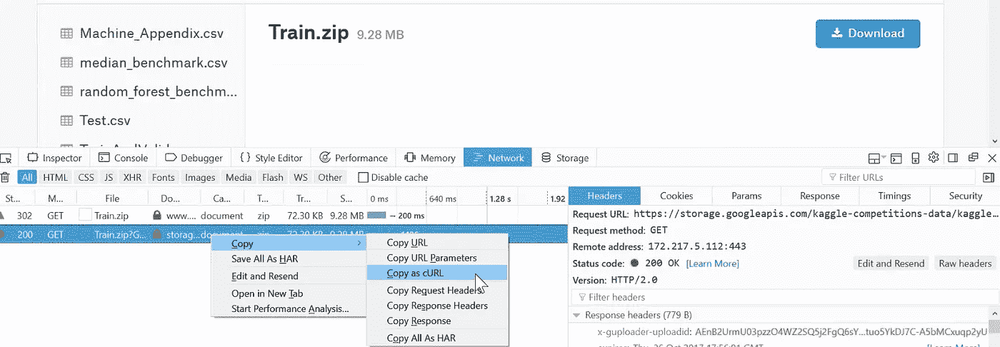
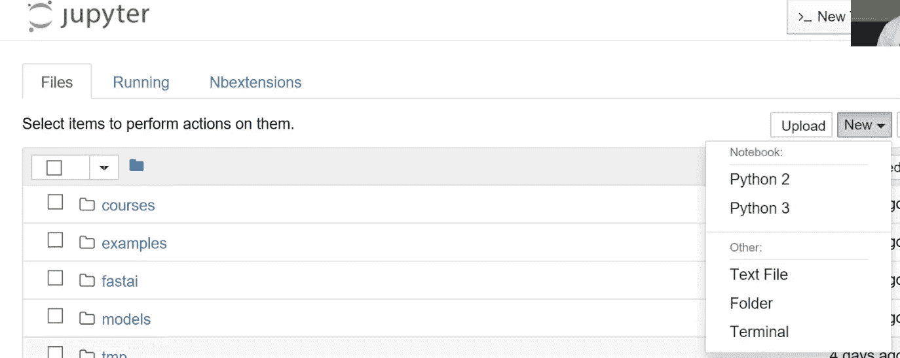
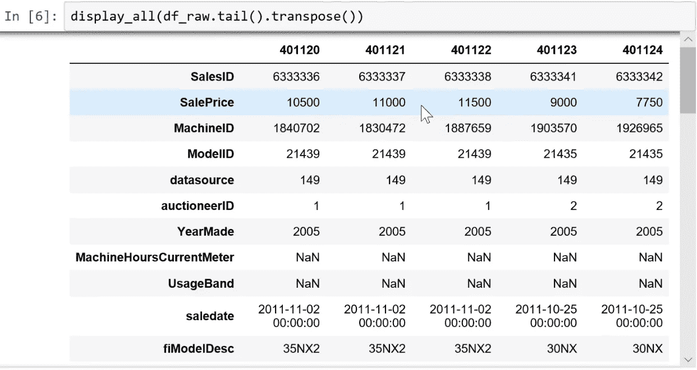
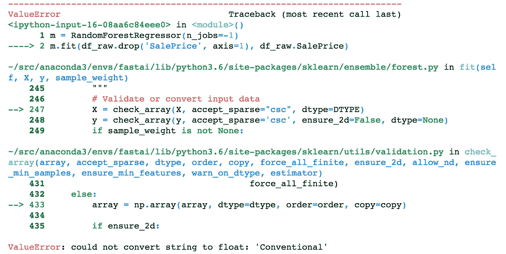
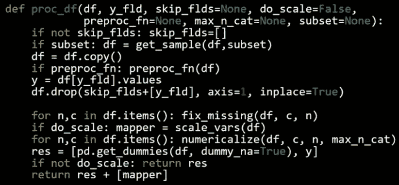
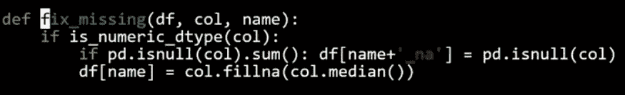
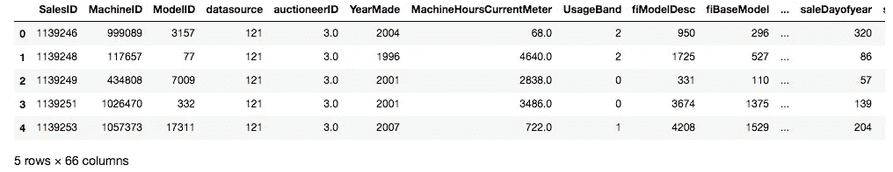
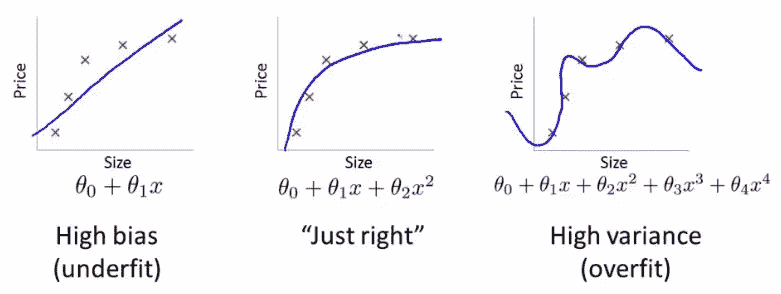

# 机器学习 1：第 1 课

> 原文：[`medium.com/@hiromi_suenaga/machine-learning-1-lesson-1-84a1dc2b5236`](https://medium.com/@hiromi_suenaga/machine-learning-1-lesson-1-84a1dc2b5236)

*来自* [*机器学习课程*](http://forums.fast.ai/t/another-treat-early-access-to-intro-to-machine-learning-videos/6826/1)* 的个人笔记。随着我继续复习课程以“真正”理解它，这些笔记将继续更新和改进。非常感谢* [*Jeremy*](https://twitter.com/jeremyphoward) *和* [*Rachel*](https://twitter.com/math_rachel) *给了我这个学习的机会。*

# 简要课程大纲

根据时间和班级兴趣，我们将涵盖类似以下内容（不一定按照这个顺序）：

训练 vs. 测试

+   有效的验证集构建

树和集成

+   创建随机森林

+   解释随机森林

什么是机器学习？为什么我们使用它？

+   什么构成了一个好的机器学习项目？

+   结构化 vs 非结构化数据

+   失败/错误的例子

特征工程

+   领域特定 — 日期，URL，文本

+   嵌入/潜在因子

使用 SGD 训练的正则化模型

+   广义线性模型，Elasticnet 等（注意：查看 James 讲解的内容）

基本神经网络

+   PyTorch

+   广播，矩阵乘法

+   训练循环，反向传播

KNN

CV / bootstrap（糖尿病数据集？）

伦理考虑

跳过：

+   降维

+   交互

+   监控训练

+   协同过滤

+   动量和学习率退火

# 随机森林：蓝皮书对于推土机

[笔记本](https://github.com/fastai/fastai/blob/master/courses/ml1/lesson1-rf.ipynb) / [Kaggle](https://www.kaggle.com/c/bluebook-for-bulldozers)

```py
%load_ext autoreload
%autoreload 2
%matplotlib inlinefrom fastai.imports import *
from fastai.structured import *from pandas_summary import DataFrameSummary
from sklearn.ensemble import RandomForestRegressor, RandomForestClassifier
from IPython.display import displayfrom sklearn import metrics
```

数据科学 ≠ 软件工程 [[08:43](https://youtu.be/CzdWqFTmn0Y?t=8m43s)]。你会看到一些不符合 PEP 8 的代码和`import *`之类的东西，但暂时跟着走一段时间。我们现在正在做的是原型模型，原型模型有一套完全不同的最佳实践，这些实践在任何地方都没有教授。关键是能够非常互动和迭代地进行操作。Jupyter 笔记本使这变得容易。如果你曾经想知道`display`是什么，你可以做以下三件事之一：

1.  在一个单元格中键入`display`，然后按 shift+enter — 它会告诉你它来自哪里`<function IPython.core.display.display>`

1.  在一个单元格中键入`?display`，然后按 shift+enter — 它会显示文档

1.  在一个单元格中键入`??display`，然后按 shift+enter — 它会显示源代码。这对于 fastai 库特别有用，因为大多数函数都很容易阅读，而且不超过 5 行。

## 下载数据 [[12:05](https://youtu.be/CzdWqFTmn0Y?t=12m5s)]

参加 Kaggle 竞赛将让你知道你是否在这种模型中的这种数据上有竞争力。准确率低是因为数据太嘈杂，你无法做得更好吗？还是实际上是一个简单的数据集，而你犯了错误？当你在自己的项目中使用自己的数据集时，你将得不到这种反馈 — 我们只需要知道我们有良好的有效技术来可靠地构建基线模型。

机器学习应该帮助我们理解数据集，而不仅仅是对其进行预测 [[15:36](https://youtu.be/CzdWqFTmn0Y?t=15m36s)]。因此，选择一个我们不熟悉的领域，这是一个很好的测试，看看我们是否能够建立理解。否则，你的直觉可能会使你很难保持足够开放的心态去看待数据真正的含义。

有几种下载数据的选项：

1.  下载到您的计算机并通过`scp`传输到 AWS

1.  从 Firefox [[17:32](https://youtu.be/CzdWqFTmn0Y?t=17m32s)]，按`ctrl + shift + i`打开 Web 开发者工具。转到`Network`选项卡，点击`Download`按钮，然后取消对话框。它会显示已启动的网络连接。然后右键单击它，选择`Copy as cURL`。粘贴命令并在末尾添加`-o bulldozer.zip`（可能删除 cURL 命令中的`— — 2.0`）



Jupyter 技巧[[21:39](https://youtu.be/CzdWqFTmn0Y?t=21m39s)] - 您可以打开基于 Web 的终端，如下所示：



这个竞赛的目标是使用包含截至 2011 年底的数据的训练集来预测推土机的销售价格。

**让我们看看数据[**[**25:25**](https://youtu.be/CzdWqFTmn0Y?t=25m25s)**]:**

**结构化数据**：代表各种不同类型事物的列，如标识符、货币、日期、大小。

**非结构化数据**：图像

当您处理通常作为`pd`导入的结构化数据时，`pandas`是最重要的库。

```py
df_raw = pd.read_csv(f'{PATH}Train.csv', low_memory=False, 
                     parse_dates=["saledate"])
```

+   `parse_dates` - 包含日期的任何列的列表

+   `low_memory=False` - 强制它读取更多文件以确定类型。

```py
def display_all(df):
    with pd.option_context("display.max_rows", 1000): 
        with pd.option_context("display.max_columns", 1000): 
            display(df)display_all(df_raw.tail().transpose())
```

在 Jupyter Notebook 中，如果您键入一个变量名并按`ctrl+enter`，无论是 DataFrame、视频、HTML 等 - 它通常会找到一种显示方式供您使用[[32:13](https://youtu.be/CzdWqFTmn0Y?t=32m13s)]。



我们想要预测的变量在这种情况下被称为**因变量**，在这种情况下我们的因变量是`SalePrice`。

**问题**：因为过拟合的风险而永远不应查看数据吗？[33:08] 我们至少想知道我们已经成功导入了足够的数据，但在这一点上通常不会真正研究它，因为我们不想对它做太多假设。许多书籍建议首先进行大量的探索性数据分析（EDA）。我们今天将学习机器学习驱动的 EDA。

## **项目目的 - 评估[**[**34:06**](https://youtu.be/CzdWqFTmn0Y?t=34m6s)**]**

均方根对数误差。我们使用对数的原因是因为通常，您更关心的不是差$10，而是差 10%。所以如果是$1000,000 的物品，您差$100,000，或者如果是$10,000 的物品，您差$1,000 - 我们会认为这些是等价的规模问题。

```py
df_raw.SalePrice = np.log(df_raw.SalePrice)
```

+   `np` - Numpy 让我们将数组、矩阵、向量、高维张量视为 Python 变量。

## 什么是随机森林？[[36:37](https://youtu.be/CzdWqFTmn0Y?t=36m37s)]

随机森林是一种通用的机器学习技术。

+   它可以预测任何类型的东西 - 它可以是一个类别（分类），一个连续变量（回归）。

+   它可以预测任何类型的列 - 像素、邮政编码、收入等（即结构化和非结构化数据）。

+   它通常不会过度拟合，而且很容易阻止过度拟合。

+   通常情况下不需要单独的验证集。即使只有一个数据集，它也可以告诉您它的泛化程度如何。

+   它几乎没有任何统计假设。它不假设您的数据是正态分布的，关系是线性的，或者您已经指定了交互作用。

+   它需要非常少的特征工程。对于许多不同类型的情况，您不必对数据取对数或将交互作用相乘。

问题：维度的诅咒是什么？[38:16] 你经常听到两个概念 - 维度的诅咒和没有免费午餐定理。它们两者在很大程度上是毫无意义的，基本上是愚蠢的，然而许多领域的人不仅知道这一点，而且认为相反，因此值得解释。维度的诅咒是这样一个想法，即你拥有的列越多，就会创造出一个越来越空的空间。有这样一个迷人的数学思想，即你拥有的维度越多，所有点就越多地位于该空间的边缘。如果你只有一个随机的维度，那么它们就会分散在各处。另一方面，如果是一个正方形，那么它们在中间的概率意味着它们不能在任一维度的边缘，因此它们不太可能不在边缘。每增加一个维度，点不在至少一个维度的边缘上的可能性就会成倍减少，因此在高维度中，一切都位于边缘。从理论上讲，这意味着点之间的距离变得不那么有意义。因此，如果我们认为这很重要，那么它会暗示当你有很多列并且没有小心删除你不关心的列时，事情将不起作用。出于许多原因，结果并非如此

+   点之间仍然有不同的距离。只是因为它们在边缘上，它们仍然在彼此之间的距离上有所不同，因此这一点在这一点上比在那一点上更相似。

+   所以像 k 最近邻居这样的东西在高维度中实际上表现得非常好，尽管理论家们声称的不同。这里真正发生的是，在 90 年代，理论主导了机器学习。有这样一个概念，支持向量机在理论上得到了很好的证明，极易进行数学分析，你可以证明关于它们的事情 - 我们失去了十年的真正实际发展。所有这些理论变得非常流行，比如维度的诅咒。如今，机器学习的世界变得非常经验主义，事实证明，在实践中，在许多列上构建模型确实效果非常好。

+   没有免费午餐定理[41:08] - 他们声称没有一种模型适用于任何类型的数据集。在数学意义上，任何随机数据集的定义都是随机的，因此不会有一种方法可以查看每个可能的随机数据集，使其在某种程度上比其他方法更有用。在现实世界中，我们看的是不随机的数据。从数学上讲，我们会说它位于某个较低维度的流形上。它是由某种因果结构创建的。其中存在一些关系，因此事实是我们并没有使用随机数据集，因此实际上有一些技术比其他技术在你查看的几乎所有数据集上都要好得多。如今，有经验的研究人员研究哪些技术在大多数情况下效果很好。决策树的集成，其中随机森林是其中最常见的技术之一。Fast.ai 提供了一种标准的方法来适当地预处理它们并设置它们的参数。

## scikit-learn[42:54]

Python 中最受欢迎和重要的机器学习包。它并非在所有方面都是最好的（例如，XGBoost 比梯度提升树更好），但在几乎所有方面都表现得相当不错。

```py
m = RandomForestRegressor(n_jobs=-1)
```

+   RandomForestRegressor - 回归器是一种预测连续变量（即回归）的方法

+   RandomForestClassifier - 分类器是一种预测分类变量（即分类）的方法

```py
m.fit(df_raw.drop('SalePrice', axis=1), df_raw.SalePrice)
```

scikit-learn 中的所有内容都具有相同的形式。

+   为机器学习模型创建一个对象的实例

+   通过传入独立变量（你要用来预测的东西）和因变量（你想要预测的东西）来调用`fit`。

+   `axis=1`表示删除列。

+   在 Jupyter Notebook 中按下`shift + tab`将显示函数的参数检查。

+   “类似列表”意味着任何你可以在 Python 中索引的东西。



以上的代码会导致错误。数据集“Conventional”中有一个值，它不知道如何使用该字符串创建模型。我们必须将大多数机器学习模型和随机森林转换为数字。因此，第一步是将所有内容转换为数字。

这个数据集包含了**连续**和**分类**变量的混合。

+   continuous — 数字，其含义是数值，比如价格。

+   categorical — 要么是数字，其含义不是连续的，比如邮政编码，要么是字符串，比如“大”，“中”，“小”

以下是我们可以从日期中提取的一些信息 — 年份、月份、季度、月中的日期、星期几、一年中的周数、是否是假期？周末？下雨了吗？那天有体育赛事吗？这取决于你在做什么。如果你正在预测 SoMa 地区的苏打销售额，你可能想知道那天是否有旧金山巨人队的比赛。日期中包含的信息是你可以进行的最重要的特征工程之一，没有任何机器学习算法可以告诉你那天巨人队是否在比赛，以及这一点有多重要。因此，这就是你需要进行特征工程的地方。

`add_datepart`方法从完整的日期时间中提取特定的日期字段，以构建分类变量。在处理日期时间时，你应该始终考虑这个特征提取步骤。如果不将日期时间扩展到这些额外字段，你就无法捕捉到任何趋势/周期性行为，作为时间的函数在任何这些粒度上。

```py
def add_datepart(df, fldname, **drop=True**):
    fld = df[fldname]
    if not np.issubdtype(fld.dtype, np.datetime64):
        df[fldname] = fld = pd.to_datetime(fld, 
                                     infer_datetime_format=True)
    targ_pre = re.sub('[Dd]ate$', '', fldname)
    for n in ('Year', 'Month', 'Week', 'Day', 'Dayofweek', 
            'Dayofyear', 'Is_month_end', 'Is_month_start', 
            'Is_quarter_end', 'Is_quarter_start', 'Is_year_end', 
            'Is_year_start'):
        df[targ_pre+n] = **getattr**(fld.dt,n.lower()) df[targ_pre+'Elapsed'] = fld.astype(np.int64) // 10**9
    if drop: df.drop(fldname, axis=1, inplace=True)
```

+   `getattr` — 查找对象内部并找到具有该名称的属性

+   `drop=True` — 除非指定，它将删除日期时间字段，因为我们不能直接使用“saledate”，因为它不是一个数字。

```py
fld = df_raw.saledate
fld.dt.year
```

+   `fld` — Pandas 系列

+   `dt` — `fld`没有“year”，因为它只适用于 Pandas 系列，这些系列是日期时间对象。因此，Pandas 会将不同的方法拆分到特定于它们的属性中。因此，日期时间对象将有`dt`属性定义，那里你会找到所有日期时间特定的属性。

```py
add_datepart(df_raw, 'saledate')
df_raw.saleYear.head()
```

**问题**：[[55:40](https://youtu.be/CzdWqFTmn0Y?t=55m40s)] `df['saleYear']` 和 `df.saleYear` 之间有什么区别？在分配值时最好使用方括号，尤其是在列不存在的情况下。

运行`add_datepart`后，它添加了许多数字列并删除了`saledate`列。这还不足以解决我们之前看到的错误，因为我们仍然有其他包含字符串值的列。Pandas 有一个类别数据类型的概念，但默认情况下它不会将任何内容转换为类别。Fast.ai 提供了一个名为`train_cats`的函数，它会为所有是字符串的内容创建分类变量。在幕后，它创建了一个整数列，并将从整数到字符串的映射存储在其中。`train_cats`被称为“train”，因为它是特定于训练数据的。验证和测试集将使用相同的类别映射（换句话说，如果你在训练数据集中使用 1 表示“高”，那么在验证和测试数据集中 1 也应该表示“高”）。对于验证和测试数据集，使用`apply_cats`。

```py
train_cats(df_raw)
df_raw.UsageBand.cat.categories*Index(['High', 'Low', 'Medium'], dtype='object)*
```

+   `df_raw.UsageBand.cat` — 类似于`fld.dt.year`，`.cat`让你可以访问假设某个东西是一个类别的内容。

顺序并不太重要，但由于我们将创建一个在单个点（即`高` vs. `低` 和 `中`，`高` 和 `低` vs. `中`）分割事物的决策树，这有点奇怪。为了以合理的方式对它们进行排序，您可以执行以下操作：

```py
df_raw.UsageBand.cat.set_categories(['High', 'Medium', 'Low'],
    ordered=True, inplace=True)
```

+   `inplace`将要求 Pandas 更改现有数据框而不是返回一个新的。

有一种称为“有序”的分类变量。有序分类变量具有某种顺序（例如“低” < “中” < “高”）。随机森林对此事实并不敏感，但值得注意。

```py
display_all(df_raw.isnull().sum().sort_index()/len(df_raw))
```

上述操作将为每个系列添加一些空值，我们按索引排序它们（`[pandas.Series.sort_index](https://pandas.pydata.org/pandas-docs/stable/generated/pandas.Series.sort_index.html)`），并除以数据集的数量。

读取 CSV 大约需要 10 秒，处理另外需要 10 秒，因此如果我们不想再等待，最好将它们保存下来。这里我们将以 feather 格式保存。这将以与 RAM 中相同基本格式保存到磁盘。这是迄今为止最快的保存和读取方式。Feather 格式不仅在 Pandas 中成为标准，而且在 Java、Apache Spark 等中也是如此。

```py
os.makedirs('tmp', exist_ok=True)
df_raw.to_feather('tmp/bulldozers-raw')
```

我们可以这样读取它：

```py
df_raw = pd.read_feather('tmp/raw')
```

我们将用它们的数字代码替换类别，处理缺失的连续值，并将因变量拆分为一个单独的变量。

```py
df, y, nas = proc_df(df_raw, 'SalePrice')
```



structured.py 中的 proc_df

+   `df` — 数据框

+   `y_fld` — 依赖变量的名称

+   它会复制数据框，获取依赖变量值（`y_fld`），并从数据框中删除依赖变量。

+   然后它将`fix_missing`（见下文）

+   然后我们将遍历数据框并调用`numericalize`（见下文）。

+   `dummies` — 有少量可能值的列，可以放入虚拟变量而不是数值化它们。但我们现在不会这样做。

**fix_missing**



+   对于数值数据类型，首先我们检查是否有空列。如果有，它将创建一个新列，名称末尾附加`_na`，如果缺失则设置为 1；否则设置为 0（布尔值）。然后将缺失值替换为中位数。

+   我们不需要为分类变量执行此操作，因为 Pandas 会自动处理它们并将它们设置为`-1`。

**numericalize**


+   如果不是数字且是分类类型，我们将用其代码加 1 替换该列。默认情况下，Pandas 对缺失使用`-1`，因此现在缺失将具有 ID 为`0`。

```py
df.head()
```



现在我们有所有的数值值。请注意，布尔值被视为数字。因此我们可以创建一个随机森林。

```py
m = RandomForestRegressor(n_jobs=-1)
m.fit(df, y)
m.score(df,y)
```

随机森林是**极易并行化**的 — 意味着如果您有多个 CPU，可以将数据分配到不同的 CPU 上并且它会线性扩展。因此，您拥有的 CPU 越多，花费的时间就会按照该数字减少（不完全准确，但大致如此）。`n_jobs=-1`告诉随机森林回归器为每个 CPU 创建一个单独的作业/进程。

`m.score`将返回 r²值（1 是好的，0 是坏的）。我们将在下周学习 r²。

哇，r²为 0.98 — 那很棒，对吧？嗯，也许不是...

机器学习中**最重要的想法**之一是拥有单独的训练和验证数据集。作为动机，假设您不将数据分割，而是使用全部数据。假设您有很多参数：



[欠拟合和过拟合](https://datascience.stackexchange.com/questions/361/when-is-a-model-underfitted)

图片中数据点的误差对于最右侧的模型最低（蓝色曲线几乎完美地穿过红色点），但这并不是最佳选择。为什么呢？如果您收集一些新的数据点，它们很可能不会在右侧图表中的那条曲线上，而是会更接近中间图表中的曲线。

这说明如何使用所有数据可能导致**过拟合**。验证集有助于诊断这个问题。

```py
def split_vals(a,n): return a[:n].copy(), a[n:].copy()n_valid = 12000  # same as Kaggle's test set size
n_trn = len(df)-n_valid
raw_train, raw_valid = split_vals(df_raw, n_trn)
X_train, X_valid = split_vals(df, n_trn)
y_train, y_valid = split_vals(y, n_trn)X_train.shape, y_train.shape, X_valid.shape*((389125, 66), (389125,), (12000, 66))*
```

## 基础模型

通过使用验证集，您会发现验证集的 r²为 0.88。

```py
def rmse(x,y): return math.sqrt(((x-y)**2).mean())def print_score(m):
    res = [rmse(m.predict(X_train), y_train),
           rmse(m.predict(X_valid), y_valid),
           m.score(X_train, y_train), m.score(X_valid, y_valid)]
    if hasattr(m, 'oob_score_'): res.append(m.oob_score_)
    print(res)m = RandomForestRegressor(n_jobs=-1)
%time m.fit(X_train, y_train)
print_score(m)*CPU times: user 1min 3s, sys: 356 ms, total: 1min 3s
Wall time: 8.46 s
[0.09044244804386327, 0.2508166961122146,* ***0.98290459302099709****,* ***0.88765316048270615****]*
```

**[训练集 rmse，验证集 rmse，训练集 r²，验证集 r²]*

如果您查看 Kaggle 竞赛的公共榜单，RMSE 为 0.25 的排名将在前 25%左右。随机森林非常强大，这种完全标准化的过程对任何数据集都非常好。

## 下节课之前

请尝试使用这个过程尽可能多地解决 Kaggle 竞赛。您很可能会惊喜地发现，仅仅一小时的讲座您就能做得相当不错。
