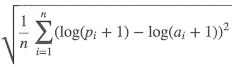
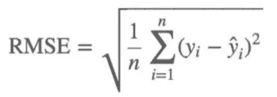
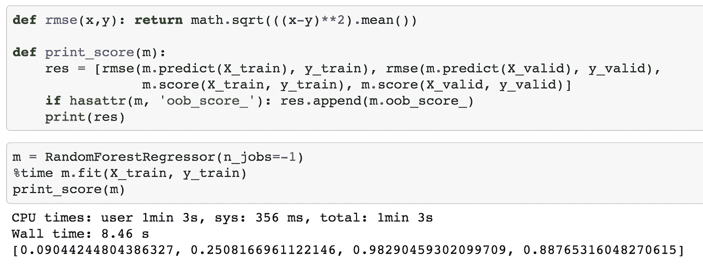
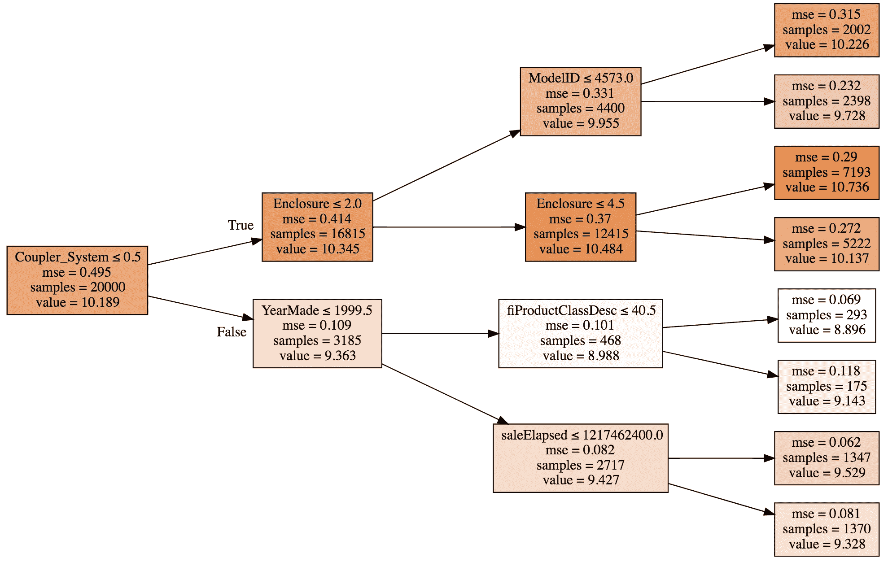
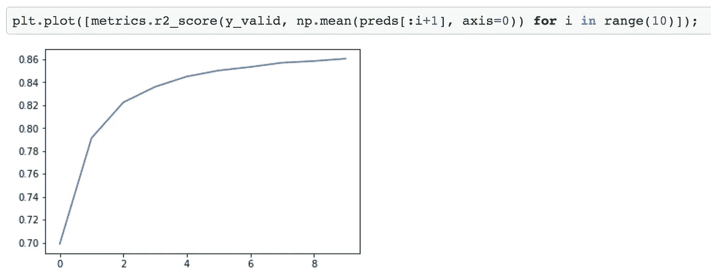
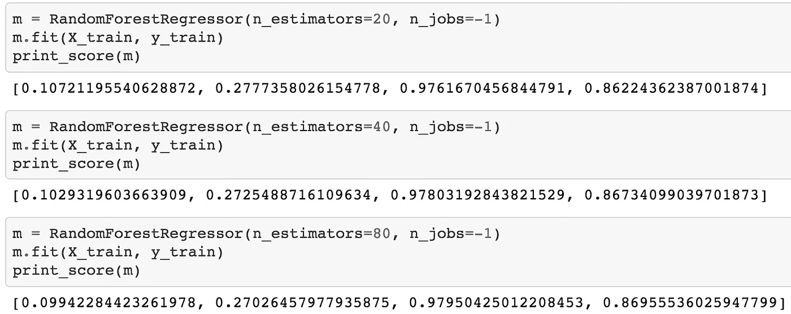
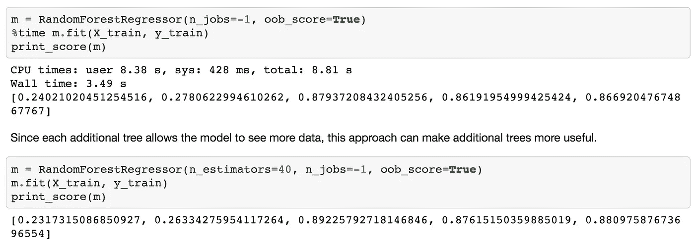
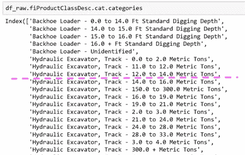

# 机器学习 1：第 2 课

> 原文：[`medium.com/@hiromi_suenaga/machine-learning-1-lesson-2-d9aebd7dd0b0`](https://medium.com/@hiromi_suenaga/machine-learning-1-lesson-2-d9aebd7dd0b0)

*我从* [*机器学习课程*](http://forums.fast.ai/t/another-treat-early-access-to-intro-to-machine-learning-videos/6826/1)* 中的个人笔记。随着我继续复习课程以“真正”理解它，这些笔记将继续更新和改进。非常感谢* [*Jeremy*](https://twitter.com/jeremyphoward) *和* [*Rachel*](https://twitter.com/math_rachel) *给了我这个学习的机会。*

# 随机森林深入研究

[笔记本](https://github.com/fastai/fastai/blob/master/courses/ml1/lesson1-rf.ipynb) / [视频](https://youtu.be/blyXCk4sgEg)

在接下来的几堂课中，我们将研究：

+   随机森林的实际工作原理

+   如果它们不能正常工作该怎么办

+   优缺点是什么

+   我们可以调整什么

+   如何解释结果

Fastai 库是一组实现最先进结果的最佳技术。对于结构化数据分析，scikit-learn 有很多优秀的代码。因此，fastai 的作用是帮助我们将事物转换为 scikit-learn，然后从 scikit-learn 中解释事物。

正如我们所指出的，深入理解评估指标是非常重要的。

均方根对数误差（RMSLE）：



因此，我们取价格的对数并使用均方根误差（RMSE）。

```py
df_raw.SalePrice = np.log(df_raw.SalePrice)
```

然后我们通过以下方式将数据集中的所有内容转换为数字：

+   `add_datepart` — 提取日期时间特征 `Elapsed` 表示自 1970 年 1 月 1 日以来经过的天数。

+   `train_cats` — 将 `string` 转换为 pandas `category` 数据类型。然后我们通过运行 `**proc_df**` 将分类列替换为类别代码。

+   `proc_df` 还用中位数替换连续列的缺失值，并添加名为 `[column name]_na` 的列，并将其设置为 true 以指示它是缺失的。

```py
m = RandomForestRegressor(n_jobs=-1)
m.fit(df, y)
m.score(df, y)
'''
0.98304680998313232
'''
```

## 什么是 R²？

Jeremy 的回答


+   *yi* : 实际/目标数据

+   *ȳ* : 平均值

+   `SStot`: 数据变化的程度

+   上周我们想出的最简单的非愚蠢模型是创建一个平均值的列并将其提交给 Kaggle。在这种情况下，RMSE = `SStot`（即一个天真模型的 RMSE）

+   *fi*: 预测

+   `SSres` 是实际模型的 RMSE

+   如果我们正好像只预测平均值一样有效，`SSres/SStot` = 1 并且 R² = 0

+   如果我们完美（即 *yi* = *fi* 对于所有情况），`SSres/SStot` = 0 并且 R² = 1

## R²的可能范围是多少？

正确答案：任何等于或小于 1 的值。如果你为每一行预测无穷大，R² = 1 −∞

因此，当你的 R²为负数时，这意味着你的模型比预测平均值更差。

R² 不一定是你实际尝试优化的内容，但它是一个你可以用于每个模型的数字，你可以开始感受到 0.8 看起来是什么样子，0.9 看起来是什么样子。你可能会发现有趣的是创建具有不同随机噪声量的合成 2D 数据集，并查看它们在散点图上的样子和它们的 R²，以了解它们与实际值有多接近。

R²是你的模型有多好（RMSE）与天真的平均模型有多好（RMSE）之间的比率。

## 过拟合 [[17:33](https://youtu.be/blyXCk4sgEg?t=17m33s)]

在我们的案例中，R²= 0.98 是一个非常好的模型。然而，可能会出现像右边这样的情况：


它擅长运行我们给定的点，但不会很好地运行我们没有给定的点。这就是为什么我们总是希望有一个验证集的原因。

创建验证集是进行机器学习项目时最重要的事情。您需要做的是提出一个数据集，您的模型在该数据集上的得分将代表您的模型在真实世界中的表现如何。

如果您的数据集中有一个时间部分（如蓝皮书比赛中），您可能希望预测未来的价格/价值等。Kaggle 所做的是在训练集中给我们提供代表特定日期范围的数据，然后测试集呈现了训练集中没有的未来日期集。因此，我们需要创建一个具有相同属性的验证集：

```py
def split_vals(a,n): 
    return a[:n].copy(), a[n:].copy()
n_valid = 12000  # same as Kaggle's test set size
n_trn = len(df)-n_valid
raw_train, raw_valid = split_vals(df_raw, n_trn)
X_train, X_valid = split_vals(df, n_trn)
y_train, y_valid = split_vals(y, n_trn)
X_train.shape, y_train.shape, X_valid.shape
'''
((389125, 66), (389125,), (12000, 66))
'''
```

现在我们有了一个希望看起来像 Kaggle 测试集的东西-足够接近，使用这个将给我们相当准确的分数。我们想要这样做的原因是因为在 Kaggle 上，您只能提交很多次，如果您提交得太频繁，最终您会适应排行榜。在现实生活中，我们希望构建一个在生产中表现良好的模型。

**问题**：您能解释验证集和测试集之间的区别吗[[20:58](https://youtu.be/blyXCk4sgEg?t=20m58s)]？今天我们要学习的一件事是如何设置超参数。超参数是会改变模型行为的调整参数。如果您只有一个保留集（即一个您不用来训练的数据集），并且我们用它来决定使用哪组超参数。如果我们尝试一千种不同的超参数组合，我们可能最终会过拟合到那个保留集。因此，我们要做的是有一个第二个保留集（测试集），在那里我们可以说我已经尽力了，现在就在最后一次，我要看看它是否有效。

您*必须*实际上从数据中删除第二个保留集（测试集），将其交给其他人，并告诉他们在您承诺完成之前不要让您看到它。否则很难不去看它。在心理学和社会学领域，这被称为复制危机或 P-值调整。这就是为什么我们想要有一个测试集。

**问题**：我们已经将分类变量转换为数字，但其他模型使用独热编码将其转换为不同的列-应该使用哪种方法[[22:55](https://youtu.be/blyXCk4sgEg?t=22m55s)]？我们今天将解决这个问题。

## 基础模型[[23:42](https://youtu.be/blyXCk4sgEg?t=23m42s)]



正如您所看到的，训练集上的 R²为 0.982，验证集上仅为 0.887，这让我们认为我们过拟合得相当严重。但并不是太糟糕，因为 RMSE 为 0.25 会让我们进入比赛的前 25%。

**问题**：为什么不选择随机行集作为验证集[[24:19](https://youtu.be/blyXCk4sgEg?t=24m19s)]？因为如果我们这样做，我们将无法复制测试集。如果您实际上查看测试集中的日期，您会发现这些日期比训练集中的任何日期都要新。因此，如果我们使用一个随机样本作为验证集，那将更容易，因为我们正在预测在这一天的工业设备的价值，而我们已经有了那一天的一些观察结果。一般来说，每当您构建具有时间元素的模型时，您希望您的测试集是一个单独的时间段，因此您确实需要您的验证集也是一个单独的时间段。

**问题**：最终不会过拟合验证集吗？[[25:30](https://youtu.be/blyXCk4sgEg?t=25m30s)] 是的，实际上这就是问题所在。最终可能会在验证集上过拟合，当你在测试集上尝试或提交到 Kaggle 时，结果可能并不好。这在 Kaggle 竞赛中经常发生，他们实际上有第四个数据集，称为私人排行榜集。每次提交到 Kaggle 时，你实际上只会得到在公共排行榜集上的表现反馈，你不知道它们是哪些行。在比赛结束时，你将根据完全不同的数据集进行评判，称为私人排行榜集。避免这种情况的唯一方法是成为一个优秀的机器学习从业者，并尽可能有效地设置这些参数，这部分我们今天和未来几周将会做。

## PEP8[[27:09](https://youtu.be/blyXCk4sgEg?t=27m9s)]

```py
def rmse(x,y): 
    return math.sqrt(((x-y)**2).mean())
```

这是一个代码不符合 PEP8 规范的例子。能够用眼睛一次看到某些东西，并随着时间学会立即看出发生了什么具有很大的价值。在数据科学中，始终使用特定的字母或缩写表示特定的含义是有效的。但是如果你在家里面试中测试，要遵循 PEP8 标准。

## 执行时间[[29:29](https://youtu.be/blyXCk4sgEg?t=29m29s)]

如果你加上`%time`，它会告诉你花了多长时间。经验法则是，如果某个操作花费超过 10 秒，那么用它进行交互式分析就太长了。所以我们要确保事情能在合理的时间内运行。然后当我们一天结束时，我们可以说好了，这个特征工程，这些超参数等都运行良好，我们现在将以大慢精确的方式重新运行它。

加快速度的一种方法是将 subset 参数传递给 proc_df，这将随机抽样数据：

```py
df_trn, y_trn, nas = proc_df(
    df_raw, 'SalePrice', 
    subset=30000, 
    na_dict=nas
)
X_train, _ = split_vals(df_trn, 20000)
y_train, _ = split_vals(y_trn, 20000)
```

+   请确保验证集不会改变

+   还要确保训练集与日期不重叠

如上所示，在调用`split_vals`时，我们没有将结果放入验证集。`_`表示我们丢弃了返回值。我们希望保持验证集始终相同。

在将训练集重新采样为 30,000 个子集中的前 20,000 个后，运行时间为 621 毫秒。

## 构建单棵树[[31:50](https://youtu.be/blyXCk4sgEg?t=31m50s)]

我们将建立由树组成的森林。让我们从树开始。在 scikit-learn 中，他们不称之为树，而是**估计器**。

```py
m = RandomForestRegressor(
    n_estimators=1, 
    max_depth=3,
    bootstrap=False, 
    n_jobs=-1
)
m.fit(X_train, y_train)
print_score(m)
```

+   `n_estimators=1` — 创建只有一棵树的森林

+   `max_depth=3` — 使其成为一棵小树

+   `bootstrap=False` — 随机森林会随机化很多东西，我们希望通过这个参数关闭它

这棵小的确定性树在拟合后的 R²为 0.4028，所以这不是一个好模型，但比平均模型好，因为它大于 1，我们实际上可以绘制[[33:00](https://youtu.be/blyXCk4sgEg?t=33m)]：



一棵树由一系列二进制决策组成。

+   第一行表示二进制分割标准

+   根节点的`samples`为 20,000，因为这是我们在拆分数据时指定的。

+   较深的颜色表示较高的`value`

+   `value`是价格的对数的平均值，如果我们构建了一个模型，只使用平均值，那么均方误差`mse`将为 0.495

+   我们能够做出的最佳单一二进制分割结果是`Coupler_system ≤ 0.5`，这将使`mse`在错误路径上提高到 0.109；在正确路径上为 0.414。

我们想要从头开始构建一个随机森林[[36:28](https://youtu.be/blyXCk4sgEg?t=36m28s)]。第一步是创建一棵树。创建树的第一步是创建第一个二进制决策。你打算如何做？

+   我们需要选择一个变量和一个值来分割，使得这两个组尽可能不同

+   对于每个变量，对于该变量的每个可能值，看看哪个更好。

+   如何确定哪个更好？取两个新节点的加权平均值

+   得到的模型将类似于平均模型——我们有一个具有单一二进制决策的模型。对于所有`coupler_system`大于 0.5 的人，我们将填入 10.345，对于其他人，我们将填入 9.363。然后我们将计算这个模型的 RMSE。

现在我们有一个单一数字来表示一个分割有多好，这个数字是创建这两个组的均方误差的加权平均值。我们还有一种找到最佳分割的方法，就是尝试每个变量和每个可能的值，看哪个变量和哪个值给出了最佳得分的分割。

**问题**：是否有情况下最好分成 3 组？在一个级别上永远不需要做多次分割，因为你可以再次分割它们。

这就是创建决策树的全部过程。停止条件：

+   当达到所请求的限制（`max_depth`）

+   当你的叶节点只有一个元素时

## 让我们的决策树更好

现在，我们的决策树的 R²为 0.4。让我们通过去掉`max_depth=3`来使其更好。这样做后，训练 R²变为 1（因为每个叶节点只包含一个元素），验证 R²为 0.73——比浅树好，但不如我们希望的那么好。

```py
m = RandomForestRegressor(
    n_estimators=1, 
    bootstrap=False, 
    n_jobs=-1
)
m.fit(X_train, y_train)
print_score(m)
'''
[6.5267517864504e-17, 0.3847365289469930, 1.0, 0.73565273648797624]
'''
```

为了让这些树更好，我们将创建一个森林。要创建一个森林，我们将使用一种称为**bagging**的统计技术。

## Bagging

迈克尔·乔丹开发了一种称为**小自助袋**的技术，他展示了如何对任何类型的模型使用 bagging，使其更加稳健，并为您提供置信区间。

随机森林——一种 bagging 树的方法。

那么什么是 bagging？Bagging 是一个有趣的想法，即如果我们创建了五个不同的模型，每个模型只是有些预测性，但这些模型给出的预测彼此之间没有相关性。这意味着这五个模型对数据中的关系有着截然不同的见解。如果你取这五个模型的平均值，你实际上是将每个模型的见解带入其中。因此，平均模型的这种想法是一种**集成**技术。

如果我们创建了很多树——大的、深的、过度拟合的树，但每棵树只选择数据的随机 1/10。假设我们这样做了一百次（每次使用不同的随机样本）。它们都过度拟合了，但由于它们都使用不同的随机样本，它们在不同的方面以不同的方式过度拟合。换句话说，它们都有错误，但这些错误是随机的。一堆随机错误的平均值是零。如果我们取这些树的平均值，每棵树都是在不同的随机子集上训练的，那么错误将平均为零，剩下的就是真正的关系——这就是随机森林。

```py
m = RandomForestRegressor(n_jobs=-1) 
m.fit(X_train, y_train) 
print_score(m)
```

`n_estimators`默认为 10（记住，estimators 就是树）。

**问题**：你是在说我们平均了 10 个糟糕的模型，然后得到了一个好模型吗？确实是这样。因为这些糟糕的模型是基于不同的随机子集，它们的错误之间没有相关性。如果错误是相关的，这种方法就行不通。

> 这里的关键见解是构建多个比没有好的模型，而且错误尽可能不相关的模型。

要使用的树的数量是我们要调整的第一个**超参数**，以实现更高的度量。

**问题**：您选择的子集，它们是互斥的吗？是否可以重叠？[[52:27](https://youtu.be/blyXCk4sgEg?t=52m27s)]我们讨论了随机选择 1/10，但 scikit-learn 默认情况下是对*n*行进行替换选择*n*行——这称为**自助法**。如果记忆无误，平均而言，63.2%的行将被表示，其中许多行将多次出现。

机器学习中建模的整个目的是找到一个模型，告诉您哪些变量很重要，它们如何相互作用以驱动您的因变量。在实践中，使用随机森林空间来找到最近邻居与欧几里得空间之间的区别是一个模型做出良好预测和做出无意义预测之间的区别。

有效的机器学习模型能够准确地找到训练数据中的关系，并且能够很好地泛化到新数据[[55:53](https://youtu.be/blyXCk4sgEg?t=55m53s)]。在装袋中，这意味着您希望每个单独的估计器尽可能具有预测性，但希望每棵树的预测尽可能不相关。研究界发现，更重要的事情似乎是创建不相关的树，而不是更准确的树。在 scikit-learn 中，还有另一个称为`ExtraTreeClassifier`的类，它是一种极端随机树模型。它不是尝试每个变量的每个分割，而是随机尝试几个变量的几个分割，这样训练速度更快，可以构建更多的树——更好的泛化。如果您有糟糕的单独模型，您只需要更多的树来获得一个好的最终模型。

## 提出预测[[1:04:30](https://youtu.be/blyXCk4sgEg?t=1h4m30s)]

```py
preds = np.stack([t.predict(X_valid) for t in m.estimators_]) 
preds[:,0], np.mean(preds[:,0]), y_valid[0]
'''
(array([ 9.21034,  8.9872 ,  8.9872 ,  8.9872 ,  8.9872 ,  9.21034,  8.92266,  9.21034,  9.21034,  8.9872 ]),  
9.0700003890739005,  
9.1049798563183568)
'''
preds.shape
'''
(10, 12000)
'''
```

每棵树都存储在名为`estimators_`的属性中。对于每棵树，我们将使用验证集调用`predict`。`np.stack`将它们连接在一起形成一个新轴，因此结果`preds`的形状为`(10, 12000)`（10 棵树，12000 个验证集）。对于第一个数据的 10 个预测的平均值为 9.07，实际值为 9.10。正如你所看到的，没有一个单独的预测接近 9.10，但平均值最终相当不错。



这里是给定前*i*棵树的 R²值的图。随着我们添加更多的树，R²值会提高。但似乎已经趋于平缓。



正如你所看到的，添加更多的树并没有太大帮助。它不会变得更糟，但也不会显著改善事情。这是要学会设置的第一个超参数——估计器的数量。一种设置的方法是，尽可能多地拟合，而且实际上似乎有所帮助。

添加更多的树会减慢速度，但使用更少的树仍然可以获得相同的见解。所以当 Jeremy 构建大部分模型时，他从 20 或 30 棵树开始，项目结束或当天工作结束时，他会使用 1000 棵树并在夜间运行。

## 袋外（OOB）得分[[1:10:04](https://youtu.be/blyXCk4sgEg?t=1h10m4s)]

有时您的数据集会很小，您不想提取验证集，因为这样做意味着您现在没有足够的数据来构建一个好的模型。然而，随机森林有一个非常聪明的技巧，称为*袋外（OOB）误差*，可以处理这种情况（以及更多！）

我们可以意识到，在我们的第一棵树中，一些行没有用于训练。我们可以通过第一棵树传递那些未使用的行，并将其视为验证集。对于第二棵树，我们可以通过未用于第二棵树的行，依此类推。实际上，我们将为每棵树创建一个不同的验证集。为了计算我们的预测，我们将对所有未用于训练的行进行平均。如果您有数百棵树，那么很可能所有行都会在这些袋外样本中多次出现。然后，您可以在这些袋外预测上计算 RMSE、R²等。

```py
m = RandomForestRegressor(
    n_estimators=40, 
    n_jobs=-1, 
    oob_score=True
)
m.fit(X_train, y_train)
print_score(m)
'''
[0.10198464613020647, 0.2714485881623037, 0.9786192457999483, 0.86840992079038759, 0.84831537630038534]
'''
```

将`oob_score`设置为 true 将执行此操作，并为模型创建一个名为`oob_score_`的属性，如您在 print_score 函数中看到的，如果具有此属性，它将在最后打印出来。

**问题**：`oob_score_`难道不总是低于整个森林的分数吗[[1:12:51](https://youtu.be/blyXCk4sgEg?t=1h12m51s)]？准确率往往较低，因为在 OOB 样本中，每行出现的树较少，而在完整树集中出现的次数较多。因此，OOB R²会稍微低估模型的泛化能力，但是您添加的树越多，这种低估就越不严重。

在设置超参数时，OOB 分数会派上用场[[1:13:47](https://youtu.be/blyXCk4sgEg?t=1h13m47s)]。我们将设置相当多的超参数，并希望找到一种自动化的方法来设置它们。一种方法是进行**网格搜索**。Scikit-learn 有一个名为网格搜索的函数，您可以传入要调整的所有超参数的列表以及要尝试的所有这些超参数的值。它将在所有这些超参数的所有可能组合上运行您的模型，并告诉您哪一个是最佳的。OOB 分数是一个很好的选择，可以告诉您哪一个是最佳的。

## 子采样[[1:14:52](https://youtu.be/blyXCk4sgEg?t=1h14m52s)]

之前，我们取了 30,000 行，并创建了使用该 30,000 行不同子集的所有模型。为什么不每次取一个完全不同的 30,000 子集？换句话说，让我们保留全部 389,125 条记录，如果我们想加快速度，每次选择一个不同的 30,000 子集。因此，而不是对整个行集进行自助抽样，只需随机抽取数据的一个子集。

```py
df_trn, y_trn = proc_df(df_raw, 'SalePrice')
X_train, X_valid = split_vals(df_trn, n_trn)
y_train, y_valid = split_vals(y_trn, n_trn)
set_rf_samples(20000)
```

`set_rf_samples`：与之前一样，我们在训练集中使用 20,000 个样本（之前是 30,000，这次是 389,125）。



这将花费与之前相同的时间来运行，但是每棵树都可以访问整个数据集。在使用 40 个估计器后，我们得到了 R²分数为 0.876。

**问题**：这个 OOB 分数是在哪些样本上计算的[[1:18:26](https://youtu.be/blyXCk4sgEg?t=1h18m26s)]？Scikit-learn 不支持这个功能，因此`set_rf_samples`是一个自定义函数。因此，在使用`set_rf_samples`时，需要关闭 OOB 分数，因为它们不兼容。`reset_rf_samples()`将把它恢复到原来的状态。

**最重要的提示[**[**1:20:30**](https://youtu.be/blyXCk4sgEg?t=1h20m30s)**]**：大多数人总是使用最佳参数在所有时间内在所有数据上运行所有模型，这是毫无意义的。如果您想找出哪些特征重要以及它们之间的关系，那么准确度的第四位小数点根本不会改变您的任何见解。在足够大的样本量上运行大多数模型，使得您的准确度合理（在最佳准确度的合理距离内），并且训练时间短，以便您可以交互式地进行分析。

## 另外两个参数[[1:21:18](https://youtu.be/blyXCk4sgEg?t=1h21m18s)]

让我们为这个完整集合建立一个基准来进行比较：

```py
reset_rf_samples()
m = RandomForestRegressor(
    n_estimators=40, 
    n_jobs=-1, 
    oob_score=True
)
m.fit(X_train, y_train)
print_score(m)
'''
[0.07843013746508616, 0.23879806957665775, 0.98490742269867626, 0.89816206196980131, 0.90838819297302553]
'''
```

这里 OOB 高于验证集。这是因为我们的验证集是不同的时间段，而 OOB 样本是随机的。预测不同时间段要困难得多。

## min_sample

```py
m = RandomForestRegressor(
    n_estimators=40, 
    min_samples_leaf=3, 
    n_jobs=-1, 
    oob_score=True
) 
m.fit(X_train, y_train) 
print_score(m)
'''
[0.11595869956476182, 0.23427349924625201, 0.97209195463880227, 0.90198460308551043, 0.90843297242839738]
'''
```

+   `min_sample_leaf=3`：当叶节点具有 3 个或更少的样本时停止训练树（之前我们一直下降到 1）。这意味着将减少一到两个决策级别，这意味着我们需要训练的实际决策标准数量减半（即更快的训练时间）。

+   对于每棵树，我们不仅仅取一个点，而是取至少三个点的平均值，我们期望每棵树都能更好地泛化。但是每棵树本身的能力会稍微减弱。

+   效果很好的数字是 1、3、5、10、25，但相对于您的整体数据集大小而言。

+   通过使用 3 而不是 1，验证 R²从 0.89 提高到 0.90

## max_feature [[1:24:07](https://youtu.be/blyXCk4sgEg?t=1h24m7s)]

```py
m = RandomForestRegressor(
    n_estimators=40, 
    min_samples_leaf=3, 
    max_features=0.5, 
    n_jobs=-1, 
    oob_score=True
) 
m.fit(X_train, y_train) 
print_score(m)
'''
[0.11926975747908228, 0.22869111042050522, 0.97026995966445684, 0.9066000722129437, 0.91144914977164715]
'''
```

+   `max_features=0.5`：这个想法是，树之间的相关性越小，越好。想象一下，如果有一列比其他所有列更好地预测，那么您构建的每棵树总是从那一列开始。但是可能存在一些变量之间的相互作用，其中该相互作用比单个列更重要。因此，如果每棵树总是首次在相同的内容上分裂，那么这些树的变化就不会很大。

+   除了取一部分行之外，在每个单独的分割点，取不同的列子集。

+   对于行抽样，每棵新树都基于一组随机行，对于列抽样，每个单独的二元分割，我们从不同的列子集中选择。

+   0.5 意味着随机选择其中一半。您可以使用特殊值，如`sqrt`或`log2`

+   使用的好值是`1`、`0.5`、`log2`或`sqrt`

0.2286 的 RMSLE 将使我们进入这场比赛的前 20 名——只需使用一些无脑的随机森林和一些无脑的次要超参数调整。这就是为什么随机森林不仅是机器学习的第一步，而且通常是唯一的一步。很难搞砸。

## 为什么随机森林效果如此好[[1:30:21](https://youtu.be/blyXCk4sgEg?t=1h30m21s)]

让我们看看小单树中的一个分割点。

`fiProductClassDesc ≤ 7.5`将分割：



为什么这样做有效呢？想象一下，唯一重要的是`液压挖掘机，履带−0.0 到 2.0 公吨`，其他都不重要。它可以通过首先分割`fiProductClassDesc ≤ 5.5`然后`fiProductClassDesc > 4.5`来选择单个元素。只需两次分割，我们就可以提取出一个单一类别。即使是具有分类变量的树也是无限灵活的。如果有一个具有不同价格水平的特定类别，它可以通过多次分割逐渐缩小到这些组。随机森林非常易于使用，而且非常弹性。

下一课，我们将学习如何分析模型，了解更多关于数据的信息，使其变得更好。
