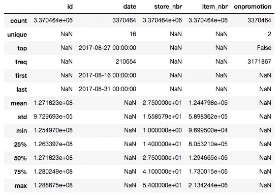
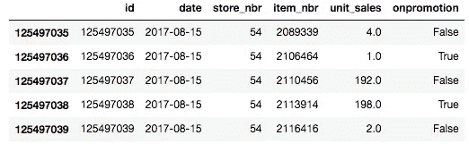
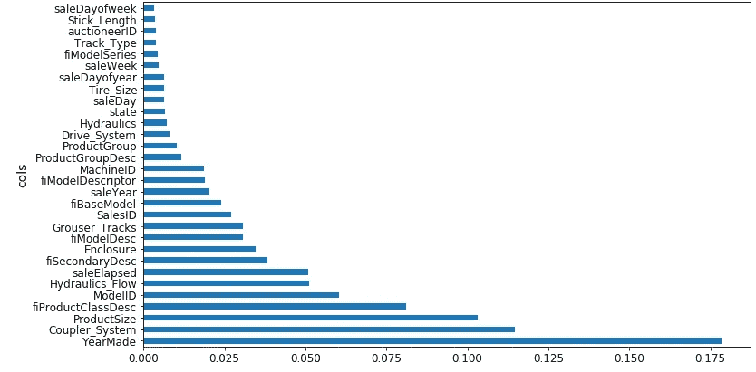

# 机器学习 1：第 3 课

> 原文：[`medium.com/@hiromi_suenaga/machine-learning-1-lesson-3-fa4065d8cb1e`](https://medium.com/@hiromi_suenaga/machine-learning-1-lesson-3-fa4065d8cb1e)

*我从*[*机器学习课程*](http://forums.fast.ai/t/another-treat-early-access-to-intro-to-machine-learning-videos/6826/1)*中的个人笔记。随着我继续复习课程以“真正”理解它，这些笔记将继续更新和改进。非常感谢*[*Jeremy*](https://twitter.com/jeremyphoward)*和*[*Rachel*](https://twitter.com/math_rachel)*给了我这个学习的机会。*

## 今天的课程内容：

[笔记本](https://github.com/fastai/fastai/blob/master/courses/ml1/lesson2-rf_interpretation.ipynb) / [视频](https://youtu.be/YSFG_W8JxBo)

**通过使用机器学习更好地理解数据**

+   这个想法与常见的说法相反，即随机森林等东西是隐藏我们意义的黑匣子。事实恰恰相反。随机森林让我们比传统方法更深入更快地理解我们的数据。

**如何查看更大的数据集**

+   拥有超过 1 亿行的数据集 - [杂货销售预测](https://www.kaggle.com/c/favorita-grocery-sales-forecasting)

**问题**：何时使用随机森林[[2:41](https://youtu.be/YSFG_W8JxBo?t=2m41s)]？我无法想到任何绝对不会至少有些用处的情况。因此，值得一试。真正的问题可能是在什么情况下我们应该尝试其他方法，简短的答案是对于非结构化数据（图像，声音等），您几乎肯定要尝试深度学习。对于协同过滤模型（杂货竞赛属于这种类型），随机森林和深度学习方法都不是您想要的，您需要做一些调整。

## 上周回顾[[4:42](https://youtu.be/YSFG_W8JxBo?t=4m42s)]

读取 CSV 花了一两分钟，我们将其保存为羽毛格式文件。羽毛格式几乎与 RAM 中的格式相同，因此读写速度非常快。我们在第 2 课笔记本中做的第一件事是读取羽毛格式文件。

## proc_df 问题[[5:28](https://youtu.be/YSFG_W8JxBo?t=5m28s)]

在这一周期间提出的一个有趣的小问题是在`proc_df`函数中。`proc_df`函数执行以下操作：

+   查找具有缺失值的数值列，并创建一个额外的布尔列，同时用中位数替换缺失值。

+   将分类对象转换为整数代码。

**问题＃1**：您的测试集中可能有一些列中的缺失值，这些列在训练集中不存在，反之亦然。如果发生这种情况，当您尝试进行随机森林时，您将会出现错误，因为“缺失”布尔列出现在训练集中，但不在测试集中。

**问题＃2**：测试集中数值的中位数可能与训练集不同。因此，它可能将其处理为具有不同语义的内容。

**解决方案**：现在有一个额外的返回变量`nas`从`proc_df`，它是一个字典，其键是具有缺失值的列的名称，字典的值是中位数。可选地，您可以将`nas`作为参数传递给`proc_df`，以确保它添加这些特定列并使用这些特定中位数：

`df, y, nas = proc_df(df_raw, 'SalePrice', nas)`

## Corporación Favorita 杂货销售预测[[9:25](https://youtu.be/YSFG_W8JxBo?t=9m25s)]

让我们走一遍当您处理一个真正大的数据集时的相同过程。几乎相同，但有一些情况下我们不能使用默认值，因为默认值运行速度有点慢。

能够解释您正在处理的问题是很重要的。在机器学习问题中理解的关键事项是：

+   独立变量是什么？

+   什么是因变量（您试图预测的东西）？

在这个比赛中

+   因变量 — 在两周期间每天每个商店销售了多少种产品。

+   自变量 — 过去几年每个产品在每个商店每天销售了多少单位。对于每个商店，它的位置在哪里以及它是什么类型的商店（元数据）。对于每种产品，它是什么类别的产品等。对于每个日期，我们有元数据，比如油价是多少。

这就是我们所说的**关系数据集**。关系数据集是指我们可以将许多不同信息连接在一起的数据集。具体来说，这种关系数据集是我们所说的“星型模式”，其中有一张中心交易表。在这个比赛中，中心交易表是`train.csv`，其中包含了按`日期`、`store_nbr`和`item_nbr`销售的数量。通过这个表，我们可以连接各种元数据（因此称为“星型”模式 — 还有一种叫做[“雪花”模式](https://en.wikipedia.org/wiki/Snowflake_schema)）。

## 读取数据[[15:12](https://youtu.be/YSFG_W8JxBo?t=15m12s)]

```py
types = {'id': 'int64',
         'item_nbr': 'int32',
         'store_nbr': 'int8',
         'unit_sales': 'float32',
         'onpromotion': 'object'}%%time
df_all = pd.read_csv(f'{PATH}train.csv', parse_dates=['date'], 
                     dtype=types, infer_datetime_format=True)*CPU times: user 1min 41s, sys: 5.08s, total: 1min 46s
Wall time: 1min 48s*
```

+   如果设置`low_memory=False`，无论您有多少内存，它都会耗尽内存。

+   为了在读取时限制占用的空间量，我们为每个列名创建一个字典，指定该列的数据类型。您可以通过运行或在数据集上使用`less`或`head`来找出数据类型。

+   通过这些调整，我们可以在不到 2 分钟内读取 125,497,040 行数据。

+   Python 本身并不快，但几乎我们在 Python 中进行数据科学时想要做的一切都已经为我们用 C 或更常见的 Cython 编写好了，Cython 是一种类似 Python 的语言，可以编译成 C。在 Pandas 中，很多代码是用汇编语言编写的，这些代码经过了大量优化。在幕后，很多代码都是调用基于 Fortran 的线性代数库。

**问题**：指定`int64`与`int`是否有任何性能考虑[[18:33](https://youtu.be/YSFG_W8JxBo?t=18m33s)]？这里的关键性能是使用尽可能少的位数来完全表示列。如果我们对`item_nbr`使用`int8`，最大的`item_nbr`大于 255，将无法容纳。另一方面，如果我们对`store_nbr`使用`int64`，它使用的位数比必要的多。鉴于这里的整个目的是避免耗尽 RAM，我们不希望使用比必要多 8 倍的内存。当您处理大型数据集时，很多时候最慢的部分是读取和写入 RAM，而不是 CPU 操作。另外，作为一个经验法则，较小的数据类型通常会运行得更快，特别是如果您可以使用单指令多数据（SIMD）矢量化代码，它可以将更多数字打包到一个单独的矢量中一次运行。

**问题**：我们不再需要对数据进行洗牌了吗[[20:11](https://youtu.be/YSFG_W8JxBo?t=20m11s)]？尽管在这里我已经读取了整个数据，但当我开始时，我从不会一开始就读取整个数据。通过使用 UNIX 命令`shuf`，您可以在命令提示符下获取数据的随机样本，然后您可以直接读取该样本。这是一个很好的方法，例如，找出要使用的数据类型 — 读取一个随机样本，让 Pandas 为您找出。通常情况下，我会尽可能多地在样本上工作，直到我确信我理解了样本后才会继续。

要使用`shuf`从文件中随机选择一行，请使用`-n`选项。这将限制输出为指定的数量。您还可以指定输出文件：

`shuf -n 5 -o sample_training.csv train.csv`

`'onpromotion': ‘object'` [[21:28](https://youtu.be/YSFG_W8JxBo?t=21m28s)]— `object`是一个通用的 Python 数据类型，速度慢且占用内存。原因是它是一个布尔值，还有缺失值，所以我们需要在将其转换为布尔值之前处理它，如下所示：

```py
df_all.onpromotion.fillna(False, inplace=True)
df_all.onpromotion = df_all.onpromotion.map({'False': False, 
                                             'True': True})
df_all.onpromotion = df_all.onpromotion.astype(bool)%time df_all.to_feather('tmp/raw_groceries')
```

+   `fillna(False)`: 我们不会在没有先检查的情况下这样做，但一些探索性数据分析显示这可能是一个合适的做法（即缺失值表示 false）。

+   `map({‘False’: False, ‘True’: True})`：`object`通常读取为字符串，所以用实际的布尔值替换字符串`‘True’`和`‘False’`。

+   `astype(bool)`：最后将其转换为布尔类型。

+   拥有超过 1.25 亿条记录的 feather 文件占用了不到 2.5GB 的内存。

+   现在它以一个很好的快速格式，我们可以在不到 5 秒的时间内将它保存为 feather 格式。

Pandas 通常很快，所以你可以在 20 秒内总结所有 1.25 亿条记录的每一列：

```py
%time df_all.describe(include='all')
```


+   首先要看的是日期。日期很重要，因为你在实践中放入的任何模型，都会在比你训练的日期晚的某个日期放入。所以如果世界上的任何事情发生变化，你需要知道你的预测准确性也会如何变化。所以对于 Kaggle 或你自己的项目，你应该始终确保你的日期不重叠。

+   在这种情况下，训练集从 2013 年到 2017 年 8 月。

```py
df_test = pd.read_csv(f'{PATH}test.csv', parse_dates = ['date'],
                      dtype=types, infer_datetime_format=True)df_test.onpromotion.fillna(False, inplace=True)
df_test.onpromotion = df_test.onpromotion.map({'False': False, 
                                               'True': True})
df_test.onpromotion = df_test.onpromotion.astype(bool)
df_test.describe(include='all')
```



+   在我们的测试集中，它们从第二天开始直到月底。

+   这是一个关键的事情 —— 除非你理解这个基本的部分，否则你无法真正做出任何有用的机器学习。你有四年的数据，你正在尝试预测接下来的两周。在你能够做好这个工作之前，这是你需要理解的基本事情。

+   如果你想使用一个较小的数据集，我们应该使用最近的 —— 而不是随机的集合。

**问题**：四年前大约在同一时间段重要吗（例如在圣诞节左右）？确实。并不是说四年前没有有用的信息，所以我们不想完全抛弃它。但作为第一步，如果你要提交平均值，你不会提交 2012 年销售额的平均值，而可能想要提交上个月销售额的平均值。之后，我们可能希望更高权重最近的日期，因为它们可能更相关。但我们应该进行大量的探索性数据分析来检查。

```py
df_all.tail()
```


这是数据底部的样子。

```py
df_all.unit_sales = np.log1p(np.clip(df_all.unit_sales, 0, None))
```

+   我们必须对销售额取对数，因为我们正在尝试预测根据比率变化的某些东西，而他们告诉我们，在这个比赛中，均方根对数误差是他们关心的事情。

+   `np.clip(df_all.unit_sales, 0, None)`: 有一些代表退货的负销售额，组织者告诉我们在这个比赛中将它们视为零。`clip`截断到指定的最小值和最大值。

+   `np.log1p`：值加 1 的对数。比赛细节告诉你他们将使用均方根对数加 1 误差，因为 log(0)没有意义。

```py
%time add_datepart(df_all, 'date')*CPU times: user 1min 35s, sys: 16.1 s, total: 1min 51s
Wall time: 1min 53s*
```

我们可以像往常一样添加日期部分。这需要几分钟，所以我们应该先在样本上运行所有这些，以确保它有效。一旦你知道一切都是合理的，然后回去在整个集合上运行。

```py
n_valid = len(df_test)
n_trn = len(df_all) - n_valid
train, valid = split_vals(df_all, n_trn)
train.shape, valid.shape*((122126576, 18), (3370464, 18))*
```

这些代码行与我们在推土机比赛中看到的代码行是相同的。我们不需要运行`train_cats`或`apply_cats`，因为所有的数据类型已经是数字的了（记住`apply_cats`将相同的分类代码应用于验证集和训练集）。

```py
%%time
trn, y, nas  = proc_df(train, 'unit_sales')
val, y_val, nas = proc_df(valid, 'unit_sales', nas)
```

调用`proc_df`来检查缺失值等。

```py
def rmse(x,y): return math.sqrt(((x-y)**2).mean())def print_score(m):
    res = [rmse(m.predict(X_train), y_train),
           rmse(m.predict(X_valid), y_valid),
           m.score(X_train, y_train), m.score(X_valid, y_valid)]
    if hasattr(m, 'oob_score_'): res.append(m.oob_score_)
    print(res)
```

这些代码行再次是相同的。然后有两个变化：

```py
**set_rf_samples(1_000_000)**%time x = **np.array(trn, dtype=np.float32)***CPU times: user 1min 17s, sys: 18.9 s, total: 1min 36s
Wall time: 1min 37s*m = RandomForestRegressor(n_estimators=20, min_samples_leaf=100, 
                          n_jobs=8)
%time m.fit(x, y)
```

我们上周学习了`set_rf_samples`。我们可能不想从 1.25 亿条记录中创建一棵树（不确定需要多长时间）。你可以从 10k 或 100k 开始，然后找出你可以运行多少。数据集的大小与构建随机森林所需时间之间没有关系，关系在于估计器数量乘以样本大小。

**问题：** `n_job`是什么？过去，它总是`-1`[[29:42](https://youtu.be/YSFG_W8JxBo?t=29m42s)]。作业数是要使用的核心数。我在一台大约有 60 个核心的计算机上运行这个，如果你尝试使用所有核心，它会花费很多时间来启动作业，速度会变慢。如果你的计算机有很多核心，有时你想要更少（`-1`表示使用每个核心）。

另一个变化是`x = np.array(trn, dtype=np.float32)`。这将数据框转换为浮点数组，然后我们在其上进行拟合。在随机森林代码内部，他们无论如何都会这样做。鉴于我们想要运行几个不同的随机森林，使用几种不同的超参数，自己做一次可以节省 1 分 37 秒。

## `分析器：%prun`[[30:40](https://youtu.be/YSFG_W8JxBo?t=30m40s)]

如果你运行一行需要很长时间的代码，你可以在前面加上`%prun`。

```py
%prun m.fit(x, y)
```

+   这将运行一个分析器，并告诉你哪些代码行花费了最多的时间。这里是 scikit-learn 中将数据框转换为 numpy 数组的代码行。

+   查看哪些事情占用了时间被称为“分析”，在软件工程中是最重要的工具之一。但数据科学家往往低估了它。

+   有趣的是，尝试不时运行`%prun`在需要 10-20 秒的代码上，看看你是否能学会解释和使用分析器输出。

+   Jeremy 在分析器中注意到的另一件事是，当我们使用`set_rf_samples`时，我们不能使用 OOB 分数，因为如果这样做，它将使用其他 124 百万行来计算 OOB 分数。此外，我们希望使用最近日期的验证集，而不是随机的。

```py
print_score(m)*[0.7726754289860,* ***0.7658818632043****, 0.23234198105350, 0.2193243264]*
```

所以这让我们得到了 0.76 的验证均方根对数误差。

```py
m = RandomForestRegressor(n_estimators=20, **min_samples_leaf=10**, 
                          n_jobs=8)
%time m.fit(x, y)
```

这使我们降到了 0.71，尽管花了更长的时间。

```py
m = RandomForestRegressor(n_estimators=20, **min_samples_leaf=3**, 
                          n_jobs=8)
%time m.fit(x, y)
```

这将错误降低到 0.70。`min_samples_leaf=1`并没有真正帮助。所以我们在这里有一个“合理”的随机森林。但是这在排行榜上并没有取得好的结果[[33:42](https://youtu.be/YSFG_W8JxBo?t=33m42s)]。为什么？让我们回头看看数据：



这些是我们必须用来预测的列（以及由`add_datepart`添加的内容）。关于明天预计销售多少的大部分见解可能都包含在关于商店位置、商店通常销售的物品种类以及给定物品的类别是什么的细节中。随机森林除了在诸如星期几、商店编号、物品编号等方面创建二元分割之外，没有其他能力。它不知道物品类型或商店位置。由于它理解正在发生的事情的能力有限，我们可能需要使用整整 4 年的数据才能得到一些有用的见解。但是一旦我们开始使用整整 4 年的数据，我们使用的数据中有很多是非常陈旧的。有一个 Kaggle 内核指出，你可以做的是[[35:54](https://youtu.be/YSFG_W8JxBo?t=35m54s)]：

1.  看看最后两周。

1.  按商店编号、物品编号、促销情况的平均销售额，然后跨日期取平均。

1.  只需提交，你就能排在第 30 名左右🎉

我们将在下一堂课上讨论这个问题，但如果你能找出如何从那个模型开始并使其变得更好一点，你将排在第 30 名以上。

**问题**：您能否尝试通过创建新列来捕捉季节性和趋势效应，比如 8 月份的平均销售额？这是一个很好的主意。要解决的问题是如何做到这一点，因为有一些细节需要正确，这些细节很困难-不是在智力上困难，而是以一种让你在凌晨 2 点撞头的方式困难。

为机器学习编码是非常令人沮丧和非常困难的。如果你弄错了一个细节，很多时候它不会给你一个异常，它只会默默地比原来稍微差一点。如果你在 Kaggle 上，你会知道你的表现不如其他人。但否则，你没有什么可以比较的。你不会知道你的公司模型是否只有它可能的一半好，因为你犯了一个小错误。这就是为什么现在在 Kaggle 上练习是很好的。

> 你将练习找到所有可能令人恼火地搞砸事情的方法，你会感到惊讶。

即使对于 Jeremy 来说，这些验证集也是非常丰富的。当你开始了解它们是什么时，你将开始知道如何在进行时检查它们。你应该假设你按下的每个按钮都会按错按钮。只要你有一种找出来的方法就可以。

不幸的是，没有一套你应该总是做的具体事情，你只需要考虑一下我即将做的事情的结果。这里有一个非常简单的例子。如果你创建了一个基本的条目，其中你按日期、店铺编号、促销状态取平均值，然后提交了它，并得到了一个合理的分数。然后你认为你有一些稍微好一点的东西，你为此做了预测。你可以创建一个散点图，显示你的平均模型预测在一个轴上，与你的新模型预测在另一个轴上。你应该看到它们几乎形成一条直线。如果不是，那么这非常明显地表明你搞砸了什么。

**问题**：您多久从其他来源获取数据来补充您已有的数据集？非常频繁。星型模式的整个重点是你有一个中心表，你有其他表与之相连，提供关于它的元数据。在 Kaggle 上，大多数比赛的规则是你可以使用外部数据，只要在论坛上发布并且是公开可用的（双重检查规则！）。在 Kaggle 之外，你应该始终寻找可能利用的外部数据。

**问题**：如何添加厄瓜多尔的假期来补充数据？这个信息实际上是提供的。一种解决这种问题的一般方法是创建许多新列，其中包含假期销售平均数量，一月和二月之间销售平均百分比变化等。在德国的一个杂货连锁店曾经有一场[先前的比赛](https://www.kaggle.com/c/rossmann-store-sales)，几乎是一样的。[获胜者](http://blog.kaggle.com/2015/12/21/rossmann-store-sales-winners-interview-1st-place-gert/)是一个领域专家，擅长做物流预测。他根据自己的经验创建了许多列，这些列通常对于做预测是有用的。所以这是一个可以奏效的方法。然而，第三名获奖者几乎没有进行特征工程，而且他们也有一个大的疏忽，这可能导致他们失去第一名。随着比赛的进行，我们将学到更多关于如何赢得这场比赛以及类似比赛的知识。

## 好的验证集的重要性

如果你没有一个好的验证集，要创建一个好的模型是困难的，甚至是不可能的。如果你试图预测下个月的销售额，并建立模型。如果你无法知道你建立的模型是否擅长提前一个月预测销售额，那么当你将模型投入生产或在测试集上使用时，你就无法知道它是否真的会很好。你需要一个可靠的验证集，告诉你你的模型是否有可能在投入生产或在测试集上使用时表现良好。

通常情况下，你不应该对测试集做任何其他操作，除非在比赛结束时或项目结束时使用它来查看你的表现。但是有一件事你可以在测试集中使用 —— 那就是**校准你的验证集**[[46:02](https://youtu.be/YSFG_W8JxBo?t=46m2s)]。


Terrance 在这里做的是建立了四种不同的模型，并将这四种模型分别提交到 Kaggle 上，以找出它们的得分。X 轴是 Kaggle 在排行榜上告诉我们的得分，y 轴是他在一个特定的验证集上绘制的得分，他试图看看这个验证集是否会很好。如果你的验证集很好，那么排行榜得分（即测试集得分）之间的关系应该是一条直线。理想情况下，它将位于`y = x`线上，但老实说，这并不太重要，只要相对来说告诉你哪些模型比哪些模型更好，那么你就知道哪个模型是最好的。在这种情况下，Terrance 设法找到了一个看起来能够很好地预测 Kaggle 排行榜得分的验证集。这真的很酷，因为他可以尝试一百种不同类型的模型、特征工程、加权、调整、超参数等等，看看它们在验证集上的表现，而不必提交到 Kaggle。因此，你将得到更多的迭代，更多的反馈。这不仅适用于 Kaggle，而且适用于你做的每一个机器学习项目。一般来说，如果你的验证集没有显示出良好的拟合线，你需要仔细思考[[48:02](https://youtu.be/YSFG_W8JxBo?t=48m2s)]。测试集是如何构建的？我的验证集有什么不同？你将不得不绘制很多图表等等来找出。

**问题：**如何构建一个与测试集尽可能接近的验证集[[48:23](https://youtu.be/YSFG_W8JxBo?t=48m23s)]？以下是 Terrance 的一些建议：

+   日期接近（即最近的）

+   首先看一下测试集的日期范围（16 天），然后看一下描述如何在排行榜上获得 0.58 分的内核的日期范围（14 天）。

+   测试集从发薪日的第二天开始，到下一个发薪日结束。

+   绘制很多图片。即使你不知道今天是发薪日，你也想绘制时间序列图，希望看到每两周有一个高峰，并确保验证集中有与测试集相同数量的高峰。

## 解释机器学习模型[[50:38](https://youtu.be/YSFG_W8JxBo?t=50m38s) / [笔记本](https://github.com/fastai/fastai/blob/master/courses/ml1/lesson2-rf_interpretation.ipynb)]

```py
PATH = "data/bulldozers/"

df_raw = pd.read_feather('tmp/raw')
df_trn, y_trn, nas = proc_df(df_raw, 'SalePrice')
```

我们首先读取蓝色书籍对推土机比赛的 feather 文件。提醒：我们已经读取了 CSV 文件，将其处理为类别，并保存为 feather 格式。接下来我们调用`proc_df`将类别转换为整数，处理缺失值，并提取出因变量。然后创建一个像上周一样的验证集：

```py
**def** split_vals(a,n): **return** a[:n], a[n:]n_valid = 12000
n_trn = len(df_trn)-n_valid
X_train, X_valid = split_vals(df_trn, n_trn)
y_train, y_valid = split_vals(y_trn, n_trn)
raw_train, raw_valid = split_vals(df_raw, n_trn)
```

## 绕道到第 1 课笔记本[[51:59](https://youtu.be/YSFG_W8JxBo?t=51m59s)]

上周，在`proc_df`中有一个 bug，当传入`subset`时会打乱数据框，导致验证集不是最新的 12000 条记录。这个问题已经修复。

```py
## From lesson1-rf.ipynbdf_trn, y_trn, **nas** = proc_df(df_raw, 'SalePrice', subset=30000, 
                             na_dict=**nas**)
X_train, _ = split_vals(df_trn, 20000)
y_train, _ = split_vals(y_trn, 20000)
```

**问题**：为什么`nas`既是该函数的输入又是输出[[53:03](https://youtu.be/YSFG_W8JxBo?t=53m3s)]？`proc_df`返回一个告诉您哪些列丢失以及每个丢失列的中位数的字典。

1.  当您在较大的数据集上调用`proc_df`时，不需要传入`nas`，但您希望保留该返回值。

1.  稍后，当您想要创建一个子集（通过传入`subset`）时，您希望使用相同的丢失列和中位数，因此您传入`nas`。

1.  如果发现子集来自完全不同的数据集并且具有不同的丢失列，它将使用附加键值更新字典。

1.  它会跟踪您在传递给`proc_df`的任何内容中遇到的任何丢失列。

## 回到第 2 课笔记本[[54:40](https://youtu.be/YSFG_W8JxBo?t=54m40s)]

一旦我们完成了`proc_df`，它看起来是这样的。`SalePrice`是销售价格的对数。


我们已经知道如何进行预测。我们在通过每棵树运行特定行后，在每棵树的每个叶节点中取平均值。通常，我们不仅想要一个预测 - 我们还想知道我们对该预测的信心有多大。

如果我们没有看到许多类似这一行的示例，我们对预测会更不自信。在这种情况下，我们不希望任何树都通过 - 这有助于我们预测该行。因此，在概念上，您会期望当您通过不同树传递此不寻常的行时，它会最终出现在非常不同的位置。换句话说，与其只取树的预测平均值并说这是我们的预测，不如我们取树的预测标准差呢？如果标准差很高，这意味着每棵树都为我们提供了对该行预测的非常不同的估计。如果这是一种非常常见的行，树将已经学会为其做出良好的预测，因为它已经看到了许多基于这些行的分割机会。因此，跨树的预测标准差至少让我们相对了解我们对该预测的信心有多大[[56:39](https://youtu.be/YSFG_W8JxBo?t=56m39s)]。这在 scikit-learn 中不存在，因此我们必须创建它。但我们已经有几乎需要的确切代码。

对于模型解释，没有必要使用完整的数据集，因为我们不需要一个非常准确的随机森林 - 我们只需要一个指示所涉及关系性质的随机森林。

只需确保样本大小足够大，以便如果多次调用相同的解释命令，每次都不会得到不同的结果。在实践中，50,000 是一个很高的数字，如果这还不够的话会令人惊讶（而且运行时间只需几秒）。

```py
set_rf_samples(50000)m = RandomForestRegressor(n_estimators=40, min_samples_leaf=3, 
                        max_features=0.5, n_jobs=-1, oob_score=True)
m.fit(X_train, y_train)
print_score(m)
```

这里我们可以做与上次完全相同的列表推导[[58:35](https://youtu.be/YSFG_W8JxBo?t=58m35s)]：

```py
%time preds = np.stack([t.predict(X_valid) **for** t **in** m.estimators_])
np.mean(preds[:,0]), np.std(preds[:,0])*CPU times: user 1.38 s, sys: 20 ms, total: 1.4 s
Wall time: 1.4 s**(9.1960278072006023, 0.21225113407342761)*
```

这是针对一个观察结果的方法。这需要相当长的时间，特别是它没有充分利用我的计算机有很多核心这一事实。列表推导本身是 Python 代码，Python 代码（除非您在做一些特殊的事情）运行在串行模式下，这意味着它在单个 CPU 上运行，不利用您的多 CPU 硬件。如果我们想在更多树和更多数据上运行此代码，执行时间会增加。墙上时间（实际花费的时间）大致等于 CPU 时间，否则如果它在许多核心上运行，CPU 时间将高于墙上时间[[1:00:05](https://youtu.be/YSFG_W8JxBo?t=1h5s)]。

原来 Fast.ai 库提供了一个方便的函数称为`parallel_trees`：

```py
def get_preds(t): return t.predict(X_valid)
%time preds = np.stack(**parallel_trees**(m, get_preds))
np.mean(preds[:,0]), np.std(preds[:,0])*CPU times: user 100 ms, sys: 180 ms, total: 280 ms
Wall time: 505 ms**(9.1960278072006023, 0.21225113407342761)*
```

+   `parallel_trees`接受一个随机森林模型`m`和要调用的某个函数（这里是`get_preds`）。这会并行在每棵树上调用此函数。

+   调用该函数对每棵树应用后返回一个结果列表。

+   这将把墙上的时间缩短到 500 毫秒，并给出完全相同的答案。如果时间允许，我们将讨论更一般的编写并行代码的方法，这对数据科学非常有用，但这里有一种我们可以用于随机森林的方法。

## 绘制[[1:02:02](https://youtu.be/YSFG_W8JxBo?t=1h2m2s)]

我们首先将数据复制一份，并将预测的标准差和预测本身（均值）作为新列添加进去：

```py
x = raw_valid.copy()
x['pred_std'] = np.std(preds, axis=0)
x['pred'] = np.mean(preds, axis=0)
x.Enclosure.value_counts().plot.barh();
```


你可能还记得上一课中我们有一个叫做`Enclosure`的预测变量，这是一个重要的变量，我们稍后会看到。让我们从做一个直方图开始。Pandas 的一个好处是它具有内置的[绘图功能](https://pandas.pydata.org/pandas-docs/stable/visualization.html)。

**问题**：你能提醒我围栏是什么吗[[01:02:50](https://youtu.be/YSFG_W8JxBo?t=1h2m50s)]？我们不知道它的意思，也不重要。这个过程的整个目的是我们将学习关于事物是什么（或者至少重要的事物，然后弄清楚它们是什么以及它们的重要性）。所以我们一开始对这个数据集一无所知。我们只是要看一下一个叫做`Enclosure`的东西，里面有一个叫做`EROPS`和`ROPS`的东西，我们甚至还不知道这是什么。我们只知道在任何大量出现的情况下，只有`OROPS`、`EROPS w AC`和`EROPS`。这在数据科学家中非常常见。你经常发现自己在看一些你不太熟悉的数据，并且你必须弄清楚哪些部分需要更仔细地研究，哪些部分似乎很重要，等等。在这种情况下，至少知道`EROPS AC`、`NO ROPS`和`None or Unspecified`我们真的不关心，因为它们基本上不存在。所以我们将关注`OROPS`、`EROPS w AC`和`EROPS`。

在这里，我们取了我们的数据框，按`Enclosure`分组，然后取了 3 个字段的平均值[[1:04:00](https://youtu.be/YSFG_W8JxBo?t=1h4m)]:

```py
flds = ['Enclosure', 'SalePrice', 'pred', 'pred_std']
enc_summ = x[flds].groupby('Enclosure', as_index=False).mean()
enc_summ
```


我们已经开始在这里学习一点：

+   预测和销售价格平均接近（好迹象）

+   标准差有些变化

```py
enc_summ = enc_summ[~pd.isnull(enc_summ.SalePrice)]
enc_summ.plot('Enclosure', 'SalePrice', 'barh', xlim=(0,11));
```


```py
enc_summ.plot('Enclosure', 'pred', 'barh', xerr='pred_std', 
              alpha=0.6, xlim=(0,11));
```


我们使用了上面预测的标准差来绘制误差线。这将告诉我们是否有一些组或一些行我们并不是很有信心。我们可以对产品尺寸做类似的事情：

```py
raw_valid.ProductSize.value_counts().plot.barh();
```


```py
flds = ['ProductSize', 'SalePrice', 'pred', 'pred_std']
summ = x[flds].groupby(flds[0]).mean()
summ
```


你期望，平均而言，当你预测一个更大的数字时，你的标准差会更高。所以你可以按照预测的标准差与预测本身的比率排序[[1:05:51](https://youtu.be/YSFG_W8JxBo?t=1h5m51s)]。

```py
(summ.pred_std/summ.pred).sort_values(ascending=False)
```


这告诉我们的是产品尺寸`Large`和`Compact`，我们的预测不太准确（相对于总价格的比率）。所以如果我们回头看一下，你会明白为什么。这些是直方图中最小的组。正如你所期望的，在小组中，我们的工作效果不太好。

你可以用这个置信区间做两个主要目的：

1.  你可以按组查看平均置信区间，以找出你似乎不太有信心的组。

1.  也许更重要的是，你可以查看特定行的重要性。当你投入生产时，你可能总是想看到置信区间。例如，如果你正在进行信用评分来决定是否给某人贷款，你可能不仅想知道他们的风险水平，还想知道我们有多大的信心。如果他们想借很多钱，而我们对我们的预测能力毫无信心，我们可能会给他们较小的贷款。

# 特征重要性 [[1:07:20](https://youtu.be/YSFG_W8JxBo?t=1h7m20s)]

> 在实践中，我总是首先查看特征重要性。无论我是在参加 Kaggle 竞赛还是在进行真实世界项目，我都会尽快构建一个随机森林，试图让它达到明显优于随机的水平，但不必比那更好太多。接下来我要做的事情是绘制特征重要性。

特征重要性告诉我们在这个随机森林中，哪些列很重要。在这个数据集中有几十列，而在这里，我们挑选出前十个。`rf_feat_importance` 是 Fast.ai 库的一部分，它接受一个模型 `m` 和一个数据框 `df_trn`（因为我们需要知道列的名称），然后会返回一个 Pandas 数据框，按重要性顺序显示每列的重要性。

```py
fi = rf_feat_importance(m, df_trn); fi[:10]
```


```py
fi.plot('cols', 'imp', figsize=(10,6), legend=False);
```


由于 `fi` 是一个 `DataFrame`，我们可以使用 `DataFrame` 绘图命令 [[1:09:00](https://youtu.be/YSFG_W8JxBo?t=1h9m)]。重要的是要看到一些列真的很重要，而大多数列实际上并不重要。在你在现实生活中使用的几乎每个数据集中，你的特征重要性都会是这个样子。只有少数几列是你关心的，这就是为什么 Jeremy 总是从这里开始的原因。在这一点上，就学习这个重型工业设备拍卖领域，我们只需要关心那些重要的列。我们是否要去了解 `Enclosure`？取决于 `Enclosure` 是否重要。结果表明它出现在前十名，所以我们需要了解 `Enclosure`。

我们也可以将其绘制为条形图：

```py
**def** plot_fi(fi): 
  return fi.plot('cols','imp','barh', figsize=(12,7), legend=False)plot_fi(fi[:30]);
```



现在最重要的事情是和你的客户、数据字典，或者任何你的信息来源坐下来，然后说“好的，告诉我关于 `YearMade`。那是什么意思？它来自哪里？”[[1:10:31](https://youtu.be/YSFG_W8JxBo?t=1h10m31s)] 绘制很多东西，比如 `YearMade` 的直方图和 `YearMade` 与价格的散点图，尽可能学到更多，因为 `YearMade` 和 `Coupler_System` —— 这些才是重要的事情。

在现实项目中经常发生的情况是，你和客户坐在一起，你会说“结果 `Coupler_System` 是第二重要的事情”，而他们可能会说“这毫无意义”。这并不意味着你的模型有问题，而是意味着他们对他们给你的数据的理解有问题。

让我举个例子。我参加了一个 Kaggle 竞赛，目标是预测大学的资助申请哪些会成功。我使用了这种确切的方法，发现了一些几乎完全预测因变量的列。具体来说，当我查看它们是如何预测的时候，结果是它们是否缺失是数据集中唯一重要的事情。由于这一发现，我最终赢得了那场比赛。后来，我听说了发生了什么。原来在那所大学，填写其他数据库是一项行政负担，因此对于很多资助申请，他们没有为那些未被接受的申请者填写数据库。换句话说，数据集中的这些缺失值表明这笔资助没有被接受，因为如果被接受，行政人员会输入那些信息。这就是我们所说的数据泄漏。数据泄漏意味着在我建模时数据集中有信息，而在大学在做决定时实际上并没有这些信息。当他们实际决定哪些资助申请要优先考虑时，他们不知道行政人员将来会添加信息的哪些申请，因为事实证明它们被接受了。

这里你会发现的一个关键问题是数据泄漏问题，这是一个你需要处理的严重问题。另一个问题是你经常会发现共线性的迹象。就像`Coupler_System`发生的情况一样。`Coupler_System`告诉你特定类型的重型工业设备是否具有特定功能。但如果根本不是那种工业设备，它就会缺失。因此，它指示了是否属于某一类重型工业设备。这不是数据泄漏。这是你在正确时间实际拥有的信息。你只需要谨慎解释它。因此，你应该至少查看前 10 个或寻找自然的分界点，并仔细研究这些事情。

为了让生活更轻松，有时候最好抛弃一些数据，看看是否会有任何不同。在这种情况下，我们有一个随机森林，r²为 0.889。在这里，我们筛选出那些重要性等于或小于 0.005 的数据（即只保留重要性大于 0.005 的数据）。

```py
to_keep = fi[fi.imp>0.005].cols; len(to_keep)df_keep = df_trn[to_keep].copy()
X_train, X_valid = split_vals(df_keep, n_trn)m = RandomForestRegressor(n_estimators=40, min_samples_leaf=3, 
                       max_features=0.5, n_jobs=-1, oob_score=True)
m.fit(X_train, y_train)
print_score(m)*[0.20685390156773095, 0.24454842802383558, 0.91015213846294174, 0.89319840835270514, 0.8942078920004991]*
```

r²并没有太大变化 - 实际上略微增加了一点。一般来说，删除多余的列不应该使情况变得更糟。如果情况变得更糟，那么这些列实际上并不多余。这可能会使结果略微好一点，因为当决定要分裂时，它需要考虑的事情更少，不太可能偶然发现一个糟糕的列。因此，有稍微更好的机会创建一个稍微更好的树，使用稍微更少的数据，但不会有太大变化。但这会使速度更快，让我们专注于重要的事情。让我们在这个新结果上重新运行特征重要性。

```py
fi = rf_feat_importance(m, df_keep)
plot_fi(fi);
```

把这个文本翻译成中文。

发生的关键事情是，当你移除冗余列时，你也在移除共线性的来源。换句话说，可能彼此相关的两列。共线性不会使你的随机森林更少预测，但如果 A 列与 B 列稍微相关，而 B 是独立变量的一个强驱动因素，那么重要性将在 A 和 B 之间分配。通过移除一些对结果影响很小的列，使得你的特征重要性图更清晰。之前`YearMade`与`Coupler_System`相当接近。但肯定有一堆与`YearMade`共线的东西，现在你可以看到`YearMade`真的很重要。这个特征重要性图比之前更可靠，因为它减少了很多共线性，不会让我们感到困惑。

## 让我们谈谈这是如何运作的[[1:17:21](https://youtu.be/YSFG_W8JxBo?t=1h17m21s)]

这不仅非常简单，而且是一种你可以用于任何类型的机器学习模型的技术。有趣的是，几乎没有人知道这一点。许多人会告诉你，没有办法解释这种特定类型的模型（模型的最重要解释是知道哪些因素是重要的），这几乎肯定不会是真的，因为我要教给你的技术实际上适用于任何类型的模型。


+   我们拿我们的推土机数据集，我们有一个列`Price`我们正在尝试预测（因变量）。

+   我们有 25 个自变量，其中之一是`YearMade`。

+   我们如何确定`YearMade`有多重要？我们有一个完整的随机森林，我们可以找出我们的预测准确性。因此，我们将把所有这些行通过我们的随机森林，它将输出一些预测。然后我们将它们与实际价格进行比较（在这种情况下，我们得到我们的均方根误差和 r²）。这是我们的起点。

+   让我们做完全相同的事情，但这次，拿`YearMade`列并随机洗牌它（即随机排列只是那一列）。现在`YearMade`与之前完全相同的分布（相同的均值，相同的标准差）。但它与我们的因变量没有任何关系，因为我们完全随机重新排序了它。

+   之前，我们可能发现我们的 r²是 0.89。在我们洗牌`YearMade`之后，我们再次检查，现在 r²是 0.80。当我们破坏那个变量时，得分变得更糟了。

+   好的，让我们再试一次。我们把`YearMade`恢复到原来的状态，这次让我们拿`Enclosure`来洗牌。这次，r²是 0.84，我们可以说`YearMade`得分减少了 0.09，而`Enclosure`的得分减少了 0.05。这将为我们提供每一列的特征重要性。

**问题**：我们不能只排除这一列然后检查性能的下降吗[[1:20:31](https://youtu.be/YSFG_W8JxBo?t=1h20m31s)]？你可以删除该列并训练一个全新的随机森林，但那将会非常慢。而通过这种方式，我们可以保留我们的随机森林，再次测试其预测准确性。因此，相比之下，这种方式更快速。在这种情况下，我们只需将每个洗牌列的每一行再次通过森林运行一遍。

**问题**：如果你想做多重共线性，你会做两个然后随机洗牌，然后三个[[1:21:12](https://youtu.be/YSFG_W8JxBo?t=1h21m12s)]？我认为你不是指多重共线性，我认为你是指寻找交互效应。因此，如果你想知道哪些变量对是最重要的，你可以依次对每对变量做完全相同的事情。实际上，有更好的方法来做到这一点，因为显然这在计算上是非常昂贵的，所以如果可能的话，我们将尝试找时间来做到这一点。

我们现在有一个稍微更准确的模型，我们对它了解更多。所以我们时间不够了，我建议你在下一堂课之前尝试做的是，查看前 5 或 10 个预测变量，尝试学习如何在 Pandas 中绘制图表，并尝试回来带一些关于以下事项的见解：

+   `YearMade`和因变量之间的关系是什么

+   `YearMade`的直方图是什么样的

+   现在你知道`YearMade`非常重要，检查一下这一列中是否有一些噪音，我们可以修复。

+   检查一下这一列中是否有一些奇怪的编码问题，我们可以修复。

+   Jeremy 提出的这个想法，也许`Coupler_System`完全存在是因为它与其他某些东西共线，你可能想要尝试弄清楚这是否属实。如果是这样，你会怎么做呢？

+   `fiProductClassDesc`这个让人警惕的名字——听起来可能是一个高基数分类变量。它可能是一个有很多级别的东西，因为它听起来像是一个型号名称。所以去看看那个型号名称——它有一定的顺序吗？你能把它变成一个有序变量吗？它在字符串中有一些层次结构，我们可以通过连字符拆分它来创建更多的子列。

想一想这个问题。试着让你回来时，你有一些新的，最好是比我刚刚展示的更准确的东西，因为你找到了一些新的见解，或者至少你可以告诉班上一些你学到的有关重型工业设备拍卖的实际工作方式的事情。
