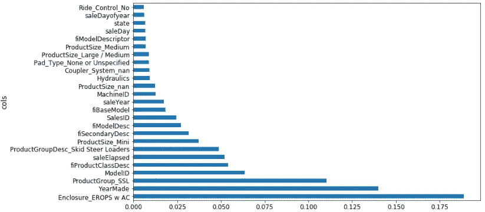

# 机器学习 1：第 4 课

> [`medium.com/@hiromi_suenaga/machine-learning-1-lesson-4-a536f333b20d`](https://medium.com/@hiromi_suenaga/machine-learning-1-lesson-4-a536f333b20d)

*来自* [*机器学习课程*](http://forums.fast.ai/t/another-treat-early-access-to-intro-to-machine-learning-videos/6826/1)* 的个人笔记。随着我继续复习课程以“真正”理解它，这些笔记将继续更新和改进。非常感谢* [*Jeremy*](https://twitter.com/jeremyphoward) *和* [*Rachel*](https://twitter.com/math_rachel) *给了我这个学习的机会。*

在开始之前有一个问题：我们能否总结随机森林的超参数与过拟合、处理共线性等之间的关系？绝对可以。回到[第 1 课笔记本](https://github.com/fastai/fastai/blob/master/courses/ml1/lesson1-rf.ipynb)。

感兴趣的超参数：

1. 设置 _rf_samples

+   确定每棵树中有多少行。因此，在我们开始新树之前，我们要么对整个数据进行自助抽样（即有放回地抽样），要么从中抽取较少行数的子样本，然后从中构建一棵树。

+   第一步是我们有一个完整的大数据集，我们随机抽取几行数据，并将它们转换成一个较小的数据集。然后，我们构建一棵树。


+   假设树在我们生长过程中保持平衡，这棵树将有多少层深（假设我们生长到每个叶子的大小为一）？log2(20000)。树的深度实际上并不会因为样本数量的不同而变化太大，因为它与大小的对数相关。

+   当我们一直走到底部时，会有多少叶节点？20K。叶节点的数量与样本大小之间存在线性关系。因此，当你减少样本大小时，可以做出的最终决策就会减少。因此，树在预测方面会变得不那么丰富，因为它做出的个别决策更少，也做出更少的二元选择来达到这些决策。

+   将 RF 样本设置较低意味着过拟合的可能性较小，但也意味着每个单独的树模型的准确性会降低。随机森林的发明者 Breiman 描述了这一点，即在使用装袋法构建模型时，你要做两件事情。一是确保每个单独的树/估计器尽可能准确（因此每个模型都是一个强预测模型）。但是在估计器之间，相关性要尽可能低，这样当将它们平均在一起时，你会得到一个泛化的模型。通过降低`set_rf_samples`的数量，实际上是降低了估计器的能力并增加了相关性，那么这会对你的验证集结果产生更好还是更差的影响呢？这取决于情况。这就是在进行机器学习模型时必须要考虑的妥协。

关于`oob=True`的问题[[6:46](https://youtu.be/0v93qHDqq_g?t=6m46s)]。`oob=True`的作用就是说，无论你的子样本是什么（可能是一个自助采样或一个子样本），将所有其他行（对于每棵树）放入一个不同的数据集中，并计算这些行的错误。因此，它实际上并不影响训练。它只是给你一个额外的度量，即 OOB 错误。因此，如果你没有验证集，那么这允许你免费获得一种准验证集。

问题：如果我不执行`set_rf_samples`，那会被称为什么？默认情况是，如果你说`reset_rf_samples`，那会导致引导，因此它将对原始数据集进行重新采样，但是会有替换。

`set_rf_samples`的第二个好处是你可以更快地运行。特别是当你在一个非常庞大的数据集上运行，比如一亿行，就不可能在完整的数据集上运行。所以你要么在开始之前自己选择一个子样本，要么使用`set_rf_samples`。

2. `min_samples_leaf` [[8:48](https://youtu.be/0v93qHDqq_g?t=8m48s)]

之前，我们假设`min_samples_leaf=1`，如果设置为 2，树的新深度为`log2(20000)-1`。每次将`min_samples_leaf`加倍，我们都会从树中移除一层，并将叶节点数量减半（即 10k）。增加`min_samples_leaf`的结果是现在每个叶节点中都有多于一个元素，因此我们在每棵树中计算的平均值会更加稳定。我们的深度稍微减少（即我们需要做出的决策更少），叶节点数量也减少。因此，我们预期每个估算器的结果会更少预测性，但估算器之间的相关性也会减少。这可能有助于我们避免过拟合。

问题：我不确定每个叶节点是否一定会有两个节点。不，不一定会有两个。不均匀分裂的例子，比如一个叶节点包含 100 个项目，当它们在因变量方面都相同时（假设是这样，但更有可能是因变量）。所以，如果你到达一个叶节点，每一个都有相同的拍卖价格，或者在分类中每一个都是一只狗，那么你无法进行任何可以改善你的信息的分裂。记住，“信息”是我们在随机森林中使用的一个术语，用来描述我们从分裂中创造的额外信息的差异量，我们通过分裂改善模型的程度。所以你经常会看到这个词“信息增益”，意思是通过添加额外的分裂点，模型变得更好了多少，这可能基于 RMSE 或交叉熵或与标准差的差异等。

这就是我们可以做的第二件事情。这将加快我们的训练速度，因为它少了一组决策要做。尽管少了一组决策，但这些决策的数据量与之前的一样多。因此，树的每一层可能比前一层花费的时间多一倍。因此，它肯定可以加快训练速度并且泛化得更好。

**3.** `max_features` [[12:22](https://youtu.be/0v93qHDqq_g?t=12m22s)]

在每次分裂时，它会随机抽样列（与`set_rf_samples`选择每棵树的行子集相对）。听起来是一个小的区别，但实际上这是一种完全不同的思考方式。我们使用`set_rf_samples`来提取我们的子样本或自举样本，并将其保留整个树中，其中包含所有列。使用`max_features=0.5`，在每次分裂时，我们会选择不同的一半特征。我们这样做的原因是因为我们希望树尽可能丰富。特别是，如果您只做了少量的树（例如 10 棵树），并且在整个树中选择了相同的列集，那么您实际上并没有获得太多不同种类的发现。因此，这种方式，至少在理论上，似乎会通过在每个决策点处选择不同的随机特征子集来给我们提供更好的树集。

max_features 的整体效果是相同的 - 这意味着每棵单独的树可能会更不准确，但树的变化会更多。特别是在这里，这可能是至关重要的，因为想象一下，你有一个特征是非常具有预测性的。它是如此具有预测性，以至于你查看的每个随机子样本总是从相同的特征开始分裂，那么这些树在某种意义上将非常相似，因为它们都具有相同的初始分裂。但可能会有一些其他有趣的初始分裂，因为它们会创建不同的变量交互。因此，有一半的时间该特征甚至不会出现在树的顶部，至少有一半的树会有不同的初始分裂。这绝对可以给我们更多的变化，因此可以帮助我们创建更具一般性的树，这些树之间的相关性更小，即使单独的树可能不会那么具有预测性。


在实践中，当你添加更多的树时，如果你设置`max_features=None`，那么每次都会使用所有的特征。然后在很少的树的情况下，这仍然可以给你一个相当不错的误差。但是随着你创建更多的树，它不会帮助太多，因为它们都很相似，它们都在尝试每一个变量。另外，如果你设置`max_features=sqrt`或`log2`，那么随着我们添加更多的估计器，我们会看到改进，所以这两者之间存在有趣的互动。上面的图表来自 scikit-learn 文档。

**4\.** 完全不影响我们训练的事情

`n_jobs`：简单地指定我们运行在多少个 CPU 或核心上，因此在某种程度上会使其更快。一般来说，将其设置为超过 8 个左右，可能会有递减的回报。-1 表示使用所有核心。默认使用一个核心似乎有点奇怪。通过使用更多核心，您肯定会获得更好的性能，因为现在大多数计算机都有多个核心。

`oob_score=True`: 这只是让我们看到 OOB 得分。如果你将 set_rf_samples 设置得相对较小，而数据集很大，OOB 将需要很长时间来计算。希望在某个时候，我们能够修复库，使其不再发生这种情况。没有理由需要那样，但目前，库就是这样工作的。

所以它们是我们可以更改的关键基本参数。您可以在文档中查看更多内容，或者按`shift+tab`查看它们，但您已经看到的是我发现有用的，可以随意尝试其他参数。一般来说，这些值效果很好。

`max_features`: None, 0.5, sqrt, log2

`min_samples_leaf` : 1, 3, 5, 10, 25, 100… 随着增加，如果你注意到当你达到 10 时，情况已经变得更糟，那么继续下去就没有意义了。如果你达到 100 时情况仍在好转，那么你可以继续尝试。

# 随机森林解释 [[18:50](https://youtu.be/0v93qHDqq_g?t=18m50s)]

随机森林解释是你可以用来创建一些非常酷的 Kaggle 内核的东西。基于树方差的置信度是其他地方不存在的。特征重要性肯定存在，并且已经在许多 Kaggle 内核中。如果你正在看一个竞赛或一个数据集，没有人做过特征重要性，成为第一个这样做的人总是会赢得很多票，因为最重要的是哪些特征是重要的。

## 基于树方差的置信度

正如我所提到的，当我们进行模型解释时，我倾向于将`set_rf_samples`设置为某个子集——足够小，可以在不到 10 秒内运行一个模型，因为运行一个超级准确的模型没有意义。五万个样本已经足够了，每次运行解释时，你会得到相同的结果，只要这是真的，那么你已经在使用足够的数据了。

```py
set_rf_samples(50000)m = RandomForestRegressor(n_estimators=40, min_samples_leaf=3, 
        max_features=0.5, n_jobs=-1, oob_score=**True**)
m.fit(X_train, y_train)
print_score(m)
```

## 特征重要性

我们学到它是通过随机洗牌一列，每次一列，然后看看在将所有数据传递给预训练模型时，当其中一列被洗牌时，模型的准确性如何。

课后我收到的一些问题让我想起，很容易低估这种方法有多么强大和神奇。为了解释，我会提到我听到的一些问题。

一个问题是“如果我们一次只取一列，然后在那一列上创建一棵树会怎样”。然后我们会看到哪一列的树是最具预测性的。为什么这可能会导致关于特征重要性的误导性结果？我们将失去特征之间的相互作用。如果我们只是随机打乱它们，那么会增加随机性，我们就能捕捉到特征之间的相互作用和重要性。这种相互作用的问题并不是一个细枝末节。它非常重要。想想这个推土机数据集，例如，有一个字段叫做“制造年份”，另一个字段叫做“销售日期”。如果我们想一想，很明显重要的是这两者的组合。换句话说，两者之间的区别是设备在售出时的年龄。因此，如果我们只包含其中一个，我们将严重低估该特征的重要性。现在，这里有一个非常重要的观点。如果你事先知道你需要哪些变量，它们如何相互作用，以及它们需要如何转换，那么几乎总是可以创建一个简单的逻辑回归，它和几乎任何随机森林一样好。在这种情况下，例如，我们可以创建一个新字段，它等于销售年份减去制造年份，然后将其输入模型并为我们获取该相互作用。但关键是，我们永远不知道这一点。你可能会猜测 — 我认为其中一些事物是以这种方式相互作用的，我认为这个东西我们需要取对数，等等。但事实是，世界运作的方式，因果结构，有许多许多事物以许多微妙的方式相互作用。这就是为什么使用树，无论是梯度提升机还是随机森林，都能够如此出色地工作。

**Terrance 的评论：** 多年前咬我一口的一件事也是我尝试一次只处理一个变量，认为“哦，好吧，我会弄清楚哪个与因变量最相关”[[24:45](https://youtu.be/0v93qHDqq_g?t=24m45s)]。但它没有分开的是，如果所有变量基本上都是复制的同一个变量，那么它们看起来都同样重要，但实际上只是一个因素。

这在这里也是正确的。如果我们有一列出现两次，那么对该列进行洗牌不会使模型变得更糟。如果你考虑它是如何构建的，特别是如果我们设置了`max_features=0.5`，有时我们会得到列的版本 A，有时我们会得到列的版本 B。因此，一半的时间，对列的版本 A 进行洗牌会使树变得稍微糟糕，一半的时间对列的版本 B 进行洗牌会使其稍微糟糕，因此它将显示这两个特征都有一定重要性。它将在这两个特征之间共享重要性。这就是为什么“共线性”（我写的是共线性，但它意味着它们是线性相关的，所以这不太对）——但这就是为什么拥有两个彼此密切相关的变量或更多彼此密切相关的变量意味着您经常会低估它们在使用这种随机森林技术时的重要性。

问题：一旦我们洗牌并获得一个新模型，这些重要性的单位究竟是什么？这是否是 R²的变化？这取决于我们使用的库。所以这些单位有点像……我从来没有考虑过它们。我只知道在这个特定的库中，0.005 经常是我倾向于使用的一个截止值。但我真正关心的是这张图片（每个变量的特征重要性排序）：


然后放大，将其转换为条形图，然后找到其变平的地方（约 0.005）。


所以我在那时将它们移除，并检查验证分数没有变差。

```py
to_keep = fi[fi.imp>0.005].cols; len(to_keep)
```

如果情况变得更糟，我只需稍微降低截止值，直到情况不再恶化。因此，这个度量单位并不太重要。顺便说一下，我们以后会学习另一种计算变量重要性的方法。

移除它们的目的是什么？在查看我们的特征重要性图后，我们发现小于 0.005 的那些是无聊的长尾。所以我说让我们尝试只选择大于 0.005 的列，创建一个名为`df_keep`的新数据框，其中只包含那些保留的列，创建一个只包含这些列的新训练和验证集，创建一个新的随机森林，并查看验证集得分。验证集的 RMSE 发生了变化，变得更好了一点。所以如果它们大致相同或稍微好一点，那么我的想法是这是一个同样好的模型，但现在更简单。

因此，当我重新进行特征重要性分析时，相关性较小。在这种情况下，我发现制造年份从略优于下一个最好的特征（连接器系统）变得更好了，但现在它更好了。因此，它似乎确实改变了这些特征的重要性，并希望能给我一些更多的见解。


**问题**：那么这如何帮助我们的模型呢？我们现在要深入研究这个问题。基本上，它告诉我们，例如，如果我们正在寻找如何处理缺失值，数据中是否有噪音，如果是高基数分类变量——这些都是我们会采取的不同步骤。例如，如果原来是一个字符串的高基数分类变量，也许在上面的情况下是 fiProductClassDesc，我记得我们前几天看的一个，首先是车辆类型，然后是一个连字符，然后是车辆的大小。我们可能会看到这个并说“好的，这是一个重要的列。让我们尝试在连字符上分割它成两部分，然后取那部分，即它的大小，并解析它并转换为整数。”我们可以尝试进行一些特征工程。基本上，直到你知道哪些是重要的，你就不知道在哪里集中特征工程的时间。你可以与负责创建这些数据的客户或相关人员交谈。如果你实际上在一个推土机拍卖公司工作，你现在可能会去找实际的拍卖人，说“我真的很惊讶，连接器系统似乎对人们的定价决策产生了如此大的影响。你认为这可能是为什么？”他们可能会告诉你“哦，实际上是因为只有这些类别的车辆有连接器系统，或者只有这个制造商有连接器系统。所以实际上这并不是告诉你关于连接器系统的，而是关于其他事情。哦，嘿，这让我想起来，我们实际上还测量了其他东西。它在另一个不同的 CSV 文件中。我去拿给你。”所以它帮助你集中注意力。

**问题**：所以你知道，这个周末我遇到了一个有趣的小问题。我在我的随机森林中引入了一些疯狂的计算，突然间它们就像是哦，这些是最重要的变量，压制了其他所有变量。但是我得到了一个糟糕的分数，那是因为我现在认为我的分数计算正确了吗，我注意到重要性飙升了，但验证集仍然很糟糕，甚至更糟。这是因为某种计算方式让训练几乎像一个标识符映射到了训练答案，但当然这并不能推广到验证集。这就是我观察到的吗？你的验证分数可能不太好的两个原因。


所以我们得到了这五个数字：训练的 RMSE，验证的 RMSE，训练的 R²，验证的 R²和 OOB 的 R²。最终我们关心的是这个 Kaggle 竞赛的验证集的 RMSE，假设我们已经创建了一个好的验证集。Terrance 的情况，他说当我进行一些特征工程时，验证的 RMSE 变糟了。为什么呢？有两个可能的原因。

+   原因一是你过拟合了。如果你过拟合了，那么你的 OOB 也会变得更糟。如果你在一个大数据集上使用了一个小的`set_rf_samples`，以至于无法使用 OOB，那么可以创建一个第二个验证集，这个验证集是一个随机样本。换句话说，如果你的 OOB 或者随机样本验证集变得更糟，那么你一定是过拟合了。我认为在你的情况下，Terrance，这不太可能是问题，因为随机森林不会过拟合得那么严重。除非你使用一些非常奇怪的参数，比如只有一个估计器，否则很难让它们过拟合得那么严重。一旦我们有了十棵树，应该有足够的变化，你肯定可以过拟合，但不会过度到添加一个变量就破坏你的验证分数。所以我认为你会发现这可能不是问题，但很容易检查。如果不是这种情况，那么你会发现你的 OOB 分数或者随机样本验证分数并没有变得更糟。

+   如果您的验证分数变差的第二个原因是，如果您的 OOB 分数没有变差，那么您并没有过拟合，但是您的验证分数变差了，这意味着您在训练集中做了一些在验证集中不成立的事情。因此，这种情况只会发生在您的验证集不是随机抽样的情况下。例如，在这个推土机比赛或者杂货购物比赛中，我们故意制作了一个验证集，该验证集涵盖了不同的日期范围——最近的两周。因此，如果在最近两周发生了与之前几周不同的事情，那么您可能会完全破坏您的验证集。例如，如果有一种在两个日期段中不同的唯一标识符，那么您可能会学会在训练集中使用该标识符来识别事物。但是最近的两周可能有完全不同的 ID 集或不同的行为集，这可能会变得更糟。尽管您所描述的情况并不常见。所以我有点怀疑——这可能是一个错误，但希望您现在有足够的方法来确定是否是一个错误。我们将很乐意听到您学到了什么。

## 线性回归，逻辑回归

这就是特征重要性。我想将其与在机器学习之外的行业和学术界（如心理学、经济学等）通常进行的特征重要性比较一下。一般来说，在这些环境中，人们倾向于使用某种线性回归、逻辑回归、一般线性模型等方法。他们从数据集开始，然后说我要假设我知道自己的自变量和因变量之间的参数关系。所以我要假设这是一个线性关系或者一个带有链接函数（如 sigmoid）的线性关系，从而创建逻辑回归。所以假设我已经知道了这一点，我现在可以将其写成一个方程。所以如果你有 x1、x2 等等。


我可以说我的 y 值等于*ax1 + bx2 = y*，因此我可以通过查看这些系数并看到哪个最高来很容易地找出特征的重要性，特别是如果您首先对数据进行了归一化。有一个常见的误解是，这种方法在某种程度上更准确，更纯粹，更好，但事实并非如此。如果您考虑一下，如果您缺少一个交互作用，如果您缺少所需的转换，或者如果您在任何预处理方面不完美，以至于您的模型是情况的绝对正确真相 - 除非您全部正确，否则您的系数是错误的。您的系数告诉您“在您完全错误的模型中，这些事物有多重要”，这基本上是毫无意义的。而另一方面，随机森林的特征重要性告诉您，在这种极高参数、高度灵活的函数形式中，几乎没有任何统计假设，这是您的特征重要性。所以我会非常谨慎。

再次强调，当您离开这个程序时，您更多地会看到人们谈论逻辑回归系数，而不是随机森林变量重要性。每当您看到这种情况发生时，您应该非常怀疑您所看到的内容。每当您阅读经济学或心理学的论文，或者市场营销部门告诉您这种回归或其他内容时，这些系数都会受到模型中任何问题的严重偏见。此外，如果他们进行了大量的预处理，实际上模型相当准确，那么现在您看到的系数将会像来自 PCA 的某个主成分的系数或某个集群的某个距离的系数。在这种情况下，它们非常难以解释。它们不是实际的变量。所以这是我看到的人们尝试使用经典统计技术来进行等效变量重要性时的两种选择。我认为事情开始慢慢改变。有一些领域开始意识到这完全是错误的做法。但自从随机森林出现以来已经将近 20 年了，所以需要很长时间。人们说，只有当上一代人死去时，知识才会真正进步，这在某种程度上是真的。特别是学者，他们以擅长某个特定子领域而成为职业，通常直到下一代人出现时，人们才会注意到实际上这不再是一个好的做事方式。我认为这就是这里发生的事情。

我们现在有一个模型，从预测准确性的角度来看并没有更好，但我们有一种很好的感觉，似乎有四个主要重要的因素：YearMade，Coupler_System，ProductSize，fiProductClassDesc。

## 一热编码

然而，我们还可以做另一件事，那就是我们可以做一种称为独热编码的东西。这就是我们在谈论分类变量时所说的。记住，分类变量，假设我们有一个字符串高、低、中（我们得到的顺序有点奇怪——默认按字母顺序排列）。所以我们将其映射为 0、1、2。当它进入我们的数据框时，现在它是一个数字，因此随机森林不知道它最初是一个类别——它只是一个数字。因此，当构建随机森林时，它基本上会说它是否大于 1 或不大于 1。或者它是否大于 0 或不大于 0。这基本上是它可以做出的两个可能决定。对于有 5 或 6 个级别的东西，可能只有一个类别级别是有趣的。也许唯一重要的是它是否未知。也许不知道它的大小会以某种方式影响价格。因此，如果我们想要能够识别这一点，特别是如果恰好数字编码的方式是未知的最终出现在中间，那么它将需要两次分割才能看到实际上重要的是未知的事情。因此，这有点低效，我们正在浪费树的计算。浪费树的计算很重要，因为每次我们进行分割时，我们至少要减少一半的数据量来进行更多的分析。因此，如果我们没有以方便它进行所需工作的方式提供数据，那么我们的树将变得不那么丰富和有效。

我们可以做的是为每个类别创建 6 列，每列包含 1 和 0。在我们的数据集中添加了 6 列后，随机森林现在可以选择其中一列并说“哦，让我们看看 is_unknown”。我可以做一个可能的拟合，即 1 对 0。让我们看看这是否有效。因此，它现在可以在一个步骤中提取一个类别级别，并且这种编码称为独热编码。对于许多类型的机器学习模型，这样的东西是必要的。如果你正在进行逻辑回归，你不可能放入一个分类变量，它经过 0 到 5，因为显然它与任何东西之间没有线性关系。因此，许多人错误地认为所有机器学习都需要独热编码。但在这种情况下，我将向您展示如何可以选择使用它，并查看它是否有时可能会改善事情。

**问题**：如果我们有六个类别，就像在这种情况下一样，为每个类别添加一列会有什么问题吗？在线性回归中，如果有六个类别，我们应该只对其中五个进行操作。你当然可以说，让我们不要担心添加`is_medium`，因为我们可以从其他五个中推断出来。我会建议无论如何都要包括它，因为否则，随机森林就必须做出五个决定才能到达那一点。你不包括一个在线性模型中的原因是因为线性模型讨厌共线性，但在这里我们不在乎这个。

因此，我们可以很容易地进行独热编码，我们的做法是向`proc_df`传递一个额外的参数，即最大类别数（`max_n_cat`）。因此，如果我们说是七，那么任何级别少于七的东西都将被转换为一组独热编码的列。

```py
df_trn2, y_trn, nas = proc_df(df_raw, 'SalePrice', max_n_cat=7) X_train, X_valid = split_vals(df_trn2, n_trn) m = RandomForestRegressor(n_estimators=40, min_samples_leaf=3, 
       max_features=0.6, n_jobs=-1, oob_score=**True**) 
m.fit(X_train, y_train) 
print_score(m)*[0.2132925755978791, 0.25212838463780185, 0.90966193351324276, 0.88647501408921581, 0.89194147155121262]*
```

例如邮政编码有超过六个级别，因此将保留为数字。一般来说，您显然不希望对邮政编码进行独热编码，因为这只会创建大量数据、内存问题、计算问题等。因此，这是您可以尝试的另一个参数。

所以如果我尝试一下，像往常一样运行随机森林，你可以看到验证集的 R²和验证集的 RMSE 会发生什么变化。在这种情况下，我发现它变得稍微糟糕了。这并不总是这样，这将取决于你的数据集。这取决于你的数据集是否有单个类别往往相当重要。在这种特殊情况下，它并没有使预测更准确。然而，它所做的是我们现在有了不同的特征。proc_df 将变量的名称、下划线和级别名称放在一起。有趣的是，结果表明以前说围栏是有些重要的。当我们将其进行独热编码时，它实际上说`Enclosure_EROPS w AC`是最重要的事情。所以至少在解释模型的目的上，你应该尝试对你的变量进行独热编码。我经常发现大约 6 或 7 个变量相当不错。你可以尝试将这个数字尽可能地提高，这样计算不会花费太长时间，而且特征重要性不会包括那些不感兴趣的非常小的级别。这取决于你自己去尝试，但在这种情况下，我发现这非常有趣。它清楚地告诉我我需要找出`Enclosure_EROPS w AC`是什么，为什么它很重要，因为现在对我来说毫无意义，但它是最重要的事情。所以我应该去弄清楚。



**问题**：你能解释一下如何改变类别的最大数量吗？因为对我来说，似乎只有五个类别或六个类别[[49:15](https://youtu.be/0v93qHDqq_g?t=49m15s)]。它所做的就是这里有一个叫做邮政编码、使用频段和性别的列，例如。比如说，邮政编码有 5,000 个级别。类别中的级别数量，我们称之为“基数”。所以它的基数是 5,000。使用频段可能有六个基数。性别有两个基数。所以当 proc_df 遍历并说好的时候，这是一个分类变量，我应该进行独热编码吗？它会检查基数与`max_n_cat`进行比较，说 5,000 大于七，所以我不进行独热编码。然后它转到使用频段——6 小于 7，所以我进行独热编码。它转到性别，2 小于 7，所以也进行独热编码。所以它只是为每个变量决定是否进行独热编码。一旦我们决定进行独热编码，它就不会保留原始变量。

如果你确实努力将你的有序变量转换为适当的有序变量，使用 proc_df 可能会破坏这一点。避免这种情况的简单方法是，如果我们知道我们总是想要使用使用频段的代码，你可以直接替换它：


现在它是一个整数。所以它永远不会改变。

## 去除冗余特征[[54:57](https://youtu.be/0v93qHDqq_g?t=54m57s)]

我们已经看到，基本上测量相同事物的变量会混淆我们的变量重要性。它也会使我们的随机森林稍微不那么好，因为需要更多的计算来做同样的事情，还有更多的列要检查。所以我们要做一些额外的工作来尝试去除冗余特征。我做的方法是做一些叫做“**树状图**”的东西。它有点像分层聚类。

**聚类分析**是一种尝试查看对象的方法，它们可以是数据集中的行或列，并找出彼此相似的对象。通常你会看到人们特别谈论聚类分析，他们通常指的是数据的行，并会说“让我们绘制它”并找出聚类。一种常见的聚类分析类型，如果时间允许，我们可能会详细讨论一下，被称为 k 均值。基本上，你假设你根本没有任何标签，然后随机选择几个数据点，逐渐找到靠近它的数据点，并将它们移动到离质心更近的位置，然后再次重复这个过程。这是一种迭代的方法，你告诉它你想要多少个聚类，它会告诉你它认为哪些类别在哪里。

一个真正被低估的技术（20 或 30 年前比今天更受欢迎）是层次聚类，也称为凝聚聚类。在层次或凝聚聚类中，我们查看每对对象，并说哪两个对象最接近。然后我们取最接近的一对，删除它们，并用两者的中点替换它们。然后再重复这个过程。由于我们正在删除点并用它们的平均值替换它们，您逐渐通过成对组合减少了点的数量。很酷的是，您可以绘制出来。

```py
from scipy.cluster import hierarchy as hccorr = np.round(scipy.stats.spearmanr(df_keep).correlation, 4)
corr_condensed = hc.distance.squareform(1-corr)
z = hc.linkage(corr_condensed, method='average')
fig = plt.figure(figsize=(16,10))
dendrogram = hc.dendrogram(z, labels=df_keep.columns, 
      orientation='left', leaf_font_size=16)
plt.show()
```


就像这样。不是看点，而是看变量，我们可以看到哪两个变量最相似。`saleYear`和`saleElapsed`非常相似。因此，这里的横轴是正在比较的两个点有多相似。如果它们更靠近右侧，那意味着它们非常相似。因此，`saleYear`和`saleElapsed`已经被合并，并且它们非常相似。

在这种情况下，我实际上使用了斯皮尔曼相关系数 R。你们已经熟悉相关系数了吗？所以相关性几乎与 R²完全相同，但它是在两个变量之间而不是一个变量和它的预测之间。普通相关性的问题在于，如果你有这样的数据，那么你可以进行相关性分析，你会得到一个好的结果。


但是如果你有这样的数据，并尝试进行相关性分析（假设是线性的），那就不太好了。


因此有一种称为秩相关的东西，这是一个非常简单的想法。用每个点的秩替换它。 


从左到右，我们按照 1、2、…6 的顺序排名。然后你也要对 y 轴做同样的操作。然后你创建一个新的图，不是绘制数据，而是绘制数据的排名。如果你仔细想一想，这个数据集的排名看起来会像一条直线，因为每当 x 轴上的某个值更大时，y 轴上的值也更大。因此，如果我们对排名进行相关性分析，那就是称为排名相关性。

因为我们想要找到那些在某种方式上与随机森林发现它们相似的列（随机森林不关心线性，它们只关心排序），所以秩相关是正确的思考方式。所以斯皮尔曼相关系数是最常见的秩相关的名称。但你可以用数据的秩替换数据，然后将其传递给常规相关性，你将得到基本相同的答案。唯一的区别在于如何处理并列的数据，这是一个相当次要的问题。

一旦我们有了一个相关矩阵，基本上有几个标准步骤可以将其转换为树状图，每次我都必须在 stackoverflow 上查找。你基本上将其转换为一个距离矩阵，然后创建一个告诉你哪些东西在层次上连接到彼此的东西的东西。所以这是你总是必须做的三个标准步骤来创建一个树状图：

```py
**corr_condensed = hc.distance.squareform(1-corr)****z = hc.linkage(corr_condensed, method='average')****dendrogram = hc.dendrogram(z, labels=df_keep.columns, 
      orientation='left', leaf_font_size=16)**
```

然后你可以绘制它[[1:01:30](https://youtu.be/0v93qHDqq_g?t=1h1m30s)]。`saleYear`和`saleElapsed`基本上在衡量相同的东西（至少在排名上），这并不奇怪，因为`saleElapsed`是自我的数据集中的第一天以来的天数，所以显然这两者几乎完全相关。`Grouser_Tracks`、`Hidraulics_Flow`和`Coupler_System`似乎在衡量相同的东西。这很有趣，因为记住，`Coupler_System`被认为非常重要。所以这更支持了我们的假设，这与是否是一个连接器系统无关，而是与它是什么类型的车辆具有这种特征。`ProductGroup`和`ProductGroupDesc`似乎在衡量相同的东西，`fiBaseModel`和`fiModelDesc`也是如此。一旦我们超过这一点，突然之间的距离更远，所以我可能不会担心那些。所以我们将研究那些非常相似的四组。


如果你只想知道这个东西与那个东西有多相似，最好的方法是查看 Spearman's R 相关矩阵[[1:03:43](https://youtu.be/0v93qHDqq_g?t=1h3m43s)]。这里没有使用随机森林。距离度量完全是基于秩相关性进行的。

然后我做的是，我取这些组并创建一个小函数`get_oob`（获取 Out Of Band 分数）[[1:04:29](https://youtu.be/0v93qHDqq_g?t=1h4m29s)]。它为某个数据框执行一个随机森林。我确保已经将该数据框拆分为训练集和验证集，然后调用`fit`并返回 OOB 分数。

```py
def get_oob(df):
    m = RandomForestRegressor(n_estimators=30, min_samples_leaf=5, 
           max_features=0.6, n_jobs=-1, oob_score=True)
    x, _ = split_vals(df, n_trn)
    m.fit(x, y_train)
    return m.oob_score_
```

基本上我要做的是尝试逐个去掉这 9 个左右的变量中的每一个，看看哪些我可以去掉而不会使 OOB 分数变得更糟。

```py
get_oob(df_keep)*0.89019425494301454*
```

每次我运行这个，我得到稍微不同的结果，所以实际上看起来上一次我有 6 个而不是 9 个。所以你可以看到，我只是循环遍历我认为可能可以去掉的每一个东西，因为它是多余的，然后打印出模型的列名和在去掉那个列之后训练的模型的 OOB 分数。

```py
for c in ('saleYear', 'saleElapsed', 'fiModelDesc', 'fiBaseModel', 
          'Grouser_Tracks', 'Coupler_System'):
    print(c, get_oob(df_keep.drop(c, axis=1)))
```

整个数据框的 OOB 分数为 0.89，然后在去掉每一个这些东西之后，基本上没有一个变得更糟。`saleElapsed`比`saleYear`要糟糕得多。但看起来其他几乎所有的东西，我只能去掉一个小数点问题。所以显然，你必须记住树状图。让我们看看 fiModelDesc 和 fiBaseModel，它们非常相似。所以这意味着的不是我可以去掉它们中的两个，而是我可以去掉其中一个，因为它们基本上在衡量同一件事情。

```py
saleYear 0.889037446375
saleElapsed 0.886210803445
fiModelDesc 0.888540591321
fiBaseModel 0.88893958239
Grouser_Tracks 0.890385236272
Coupler_System 0.889601052658
```

然后我尝试了。让我们尝试每组中去掉一个：

```py
to_drop = ['saleYear', 'fiBaseModel', 'Grouser_Tracks']
get_oob(df_keep.drop(to_drop, axis=1))*0.88858458047200739*
```

我们从 0.890 到 0.888，再次，它们之间的差距太小以至于无关紧要。听起来不错。简单就是好。所以我现在要从我的数据框中删除这些列，然后我可以尝试再次运行完整的模型。

```py
df_keep.drop(to_drop, axis=1, inplace=**True**)
X_train, X_valid = split_vals(df_keep, n_trn)np.save('tmp/keep_cols.npy', np.array(df_keep.columns))keep_cols = np.load('tmp/keep_cols.npy')
df_keep = df_trn[keep_cols]
```

`reset_rf_samples`意味着我使用了整个自助采样。有 40 个估计器，我们得到了 0.907。

```py
reset_rf_samples()m = RandomForestRegressor(n_estimators=40, min_samples_leaf=3, max_features=0.5, n_jobs=-1, oob_score=**True**)
m.fit(X_train, y_train)
print_score(m)*[0.12615142089579687, 0.22781819082173235, 0.96677727309424211, 0.90731173105384466, 0.9084359846323049]*
```

现在我有了一个更小更简单的模型，并且得分很好。所以在这一点上，我已经尽可能地去掉了许多列（那些要么没有很好的特征重要性，要么与其他变量高度相关，当我去掉它们时，模型没有显著变差）。

## 部分依赖[[1:07:34](https://youtu.be/0v93qHDqq_g?t=1h7m34s)]

现在我到了想要通过利用模型更好地了解我的数据的阶段。我们将使用一种称为偏依赖的技术。再次强调，这是你可以在 Kaggle 内核中使用的东西，很多人会欣赏这一点，因为几乎没有人知道偏依赖，它是一种非常强大的技术。我们要做的是找出对于重要的特征，它们如何与因变量相关。让我们来看看。

```py
**from** **pdpbox** **import** pdp
**from** **plotnine** **import** *
```

再次，由于我们正在进行解释，我们将设置`set_rf_samples`为 50,000，以便快速运行事务。

```py
set_rf_samples(50000)
```

我们将获取我们的特征重要性，并注意我们正在使用`max_n_cat`，因为我实际上对看到解释的各个级别很感兴趣。

```py
df_trn2, y_trn, nas = proc_df(df_raw, 'SalePrice', **max_n_cat**=7)
X_train, X_valid = split_vals(df_trn2, n_trn)
m = RandomForestRegressor(n_estimators=40, min_samples_leaf=3, 
       max_features=0.6, n_jobs=-1)
m.fit(X_train, y_train);
```

这是前 10 个：

```py
plot_fi(rf_feat_importance(m, df_trn2)[:10]);
```


让我们尝试更多地了解那些前 10 个。`YearMade`是第二重要的。所以一个明显的事情是我们可以做的是绘制`YearMade`与`saleElapsed`的关系，因为正如我们已经讨论过的，它们似乎是重要的，但很可能它们是结合在一起找出产品在销售时的年龄。所以我们可以尝试绘制`YearMade`与`saleElapsed`，看看它们之间的关系。

```py
df_raw.plot('YearMade', 'saleElapsed', 'scatter', alpha=0.01, figsize=(10,8));
```


当我们这样做时，我们得到了这个非常丑陋的图表。它告诉我们`YearMade`实际上有很多是一千。显然，这是我会倾向于回到客户那里并说好的，我猜这些推土机实际上不是在公元 1000 年制造的，他们可能会对我说“是的，这些是我们不知道制造地点的产品”。也许“1986 年之前，我们没有追踪”或者“在伊利诺伊州销售的产品，我们没有提供这些数据”等等——他们会告诉我们一些原因。为了更好地理解这个图，我只是要从分析的解释部分中将它们移除。我们只会获取`YearMade`大于 1930 的数据。

```py
x_all = **get_sample**(df_raw[df_raw.YearMade>1930], 500)ggplot(x_all, aes('YearMade', 'SalePrice'))+stat_smooth(se=**True**, 
       method='loess')
```

现在让我们看一下`YearMade`和`SalePrice`之间的关系。有一个非常棒的包叫做`ggplot`。`ggplot`最初是一个 R 包（GG 代表图形语法）。图形语法是一种非常强大的思考方式，可以以非常灵活的方式生成图表。我在这门课上不会谈论它太多。网上有很多信息可供参考。但我绝对推荐它作为一个很棒的包来使用。`ggplot`可以通过`pip`安装，它已经是 fast.ai 环境的一部分。Python 中的`ggplot`基本上具有与 R 版本相同的参数和 API。R 版本有更好的文档，所以你应该阅读它的文档以了解如何使用它。但基本上你会说“好的，我想为这个数据框（`x_all`）创建一个图。当你创建图时，你使用的大多数数据集都太大而无法绘制。例如，如果你做一个散点图，它会创建很多点，导致一团糟，而且会花费很长时间。记住，当你绘制东西时，你是在看它，所以没有必要绘制一个有一亿个样本的东西，当你只使用十万个时，它们会完全相同。这就是为什么我首先调用`get_sample`。`get_sample`只是抓取一个随机样本。

```py
ggplot(x_all, aes('YearMade', 'SalePrice'))+stat_smooth(se=**True**, 
       method='loess')
```

所以我只是从我的数据框中抓取 500 个点，然后绘制`YearMade`和`SalePrice`。`aes`代表“美学” - 这是你在`ggplot`中设置列的基本方式。然后在`ggplot`中有一个奇怪的东西，“+”表示添加图表元素。所以我要添加一个平滑线。通常你会发现散点图很难看清楚发生了什么，因为有太多的随机性。或者，平滑线基本上为图的每个小子集创建一个小线性回归。这样可以连接起来，让你看到一个漂亮的平滑曲线。这是我倾向于查看单变量关系的主要方式。通过添加`se=True`，它还会显示这个平滑线的置信区间。`loess`代表局部加权回归，这是做许多小型回归的想法。


所以我们可以在这里看到，`YearMade`和`SalePrice`之间的关系非常混乱，这并不是我们所期望的。我本来以为最近卖出的东西可能会更贵，因为通货膨胀和更现代的型号。问题在于，当你看一个像这样的单变量关系时，会有很多共线性发生 - 很多互动被忽略了。例如，价格为什么会下降？是因为 1991 年至 1997 年之间制造的东西价值更低吗？还是因为大部分产品在那个时期也被卖出，那时可能有经济衰退？或者是因为在那个时期卖出的产品，更多人购买了价格更低的车辆类型？有各种各样的原因。所以再次，作为数据科学家，你将会看到的一件事是，在你加入的公司里，人们会拿着这种单变量图来找你，他们会说“哦天啊，我们在芝加哥的销售量消失了。变得很糟糕。”或者“人们不再点击这个广告了”，然后他们会给你看一个看起来像这样的图表，问发生了什么。大多数情况下，你会发现答案是“发生了什么”的问题是有其他原因的。比如，“实际上上周在芝加哥，我们在做一个新的促销活动，这就是为什么我们的收入下降了 - 不是因为人们不再在芝加哥购买东西了；价格更低了”。

所以我们真正想要做的是说“嗯，`SalePrice`和`YearMade`之间的关系是什么，其他所有事情都相等。” “其他所有事情都相等”基本上意味着如果我们在 1990 年和 1980 年卖了同样的东西给同样的人在同样的拍卖会上等等，价格会有什么不同？为了做到这一点，我们做了一个叫做**部分依赖图**的东西。

```py
x = get_sample(X_train[X_train.YearMade>1930], 500)
```

有一个非常好的库，没有人听说过，叫做`pdp`，它可以做这些部分依赖图，发生的情况是这样的。我们有 500 个数据点的样本，我们要做一些非常有趣的事情。我们将对这 500 个随机选择的拍卖会进行处理，然后我们将从中制作一个小数据集。

这是我们的数据集，有 500 个拍卖品，这是我们的列，其中一个是我们感兴趣的事物`YearMade`。我们现在要尝试创建一个图表，在这个图表中我们说在 1960 年，其他所有事物都相等的情况下，拍卖品的成本是多少？我们将用 1960 年替换`YearMade`列。我们将一直复制值 1960，直到最后。现在每一行，制造年份都是 1960，所有其他数据都将完全相同。我们将使用我们的随机森林，将所有这些数据传递给我们的随机森林来预测销售价格。这将告诉我们，对于所有被拍卖的物品，如果那个物品是在 1960 年制造的，我们认为它将被卖出多少钱。这就是我们将在右侧绘制的内容。


我们将为 1961 年做同样的事情。

问题：明确一点，我们已经拟合了随机森林，然后我们只是传递一个新的年份，看看它确定的价格应该是多少？是的，这很像我们做特征重要性的方式。但是，我们不是随机洗牌列，而是用一个常数值替换列。随机洗牌列告诉我们当您不再使用该列时它有多准确。用一个常数值替换整个列为我们估计了如果那个产品是在 1961 年制造的，我们将在那天在那个地方的那个拍卖会上卖出那个产品多少钱。然后我们取所有从那个随机森林计算出的销售价格的平均值。我们在 1961 年这样做，得到这个值：


```py
**def** plot_pdp(feat, clusters=**None**, feat_name=**None**):
    feat_name = feat_name **or** feat
    p = pdp.pdp_isolate(m, x, feat)
    **return** pdp.pdp_plot(p, feat_name, plot_lines=**True**, 
                        cluster=clusters **is** **not** **None**, 
                        n_cluster_centers=clusters)plot_pdp('YearMade')
```


所以这里的部分依赖图（PDP）向我们展示的是每一条浅蓝色线实际上都显示了所有 500 条线。因此，对于我们数据集中的第 1 行，如果我们在 1960 年卖出它，我们将将其索引为零，称之为零。如果在 1970 年卖出那个特定的拍卖品，它将在这里，等等。我们实际上绘制了所有 500 个预测，即如果我们用不同的值替换其`YearMade`，那么这 500 个拍卖品中的每一个将会卖出多少钱。然后这条深色线是平均值。因此，这告诉我们，如果所有这些产品实际上是在 1985 年、1990 年、1993 年等制造的，我们将平均卖出这些拍卖品多少钱。因此，您可以看到，这里发生的情况是，至少在我们有相当多数据的时期，即自 1990 年以来，这基本上是一条完全直线，这是您所期望的。因为如果在同一日期卖出，而且是同一种拖拉机，卖给同一个人在同一个拍卖行，那么您会期望更近期的车辆更昂贵，因为通货膨胀和它们是更新的。您会期望这种关系大致是线性的，这正是我们发现的。通过消除所有这些外部因素，通常能够更清楚地看到真相。

这个部分依赖图是使用随机森林来更清晰地解释我们数据中发生的情况。步骤是：

1.  首先看一下未来的重要性，告诉我们我们认为我们关心哪些事情。

1.  然后使用部分依赖图告诉我们平均情况下发生了什么。

我们可以用 PDP 做另一件很酷的事情，那就是我们可以使用聚类。聚类的作用是利用聚类分析来查看这 500 行中的每一行，并判断这 500 行中是否有一些行以相同的方式移动。我们可以看到似乎有很多行是先下降然后上升，还有一些行是先上升然后趋于平缓。看起来似乎有一些不同类型的行为被隐藏了，所以这里是进行聚类分析的结果：

```py
plot_pdp('YearMade', clusters=5) 
```


我们仍然得到相同的平均值，但这里列出了我们看到的五种最常见的形状。这就是你可以进去并说好吧，看起来有些车辆在 1990 年后，它们的价格相当稳定。在那之前，它们是相当线性的。其他一些车辆则恰恰相反，所以不同种类的车辆有不同的形状。因此，这是你可以深入研究的内容。

**问题**：那么我们要如何处理这些信息呢？解释的目的是为了了解数据集，那么你为什么想要了解一个数据集呢？因为你想要对其进行某些操作。所以在这种情况下，如果你试图赢得 Kaggle 竞赛，这并不是什么大不了的事情——一些洞察可能让你意识到我可以转换这个变量或创建这种互动等等。显然，特征重要性对于 Kaggle 竞赛非常重要。但这更多地是为了现实生活。所以当你与某人交谈时，你对他们说“好的，你一直向我展示的那些图表实际上表明在 1990 年至 1997 年之间基于某些因素价格出现了下降。实际上并没有。实际上它们是在增长，那时发生了其他事情。”这基本上是让你说出，无论我试图在我的业务中推动的结果是什么，这就是某种驱动力。所以如果我在看广告技术，是什么在推动点击，我实际上正在深入研究，看看点击是如何被推动的。这实际上是在推动它的变量。这是它们之间的关系。因此，我们应该以这种方式改变我们的行为。这实际上是任何模型的目标。我想有两个可能的目标：一个模型的目标只是为了获得预测，比如如果你在进行对冲基金交易，你可能想知道那只股票的价格会是多少。如果你在做保险，你可能只想知道那个人会有多少索赔。但大多数情况下，你实际上是在尝试改变你的业务方式——你如何做市场营销，如何做物流，所以你真正关心的是这些事物之间的关系。


问题：你能再解释一下为什么这个下降并不意味着我们所认为的吗？是的。这是一个经典的无聊的单变量图。这只是将所有的点，所有的选项，将制造年份与销售价格进行绘图，并且我们只是通过它们拟合一个粗略的平均值。在我们的数据集中，1992 年至 1997 年制造的产品平均销售价格较低。在商业中，你经常会听到有人看到这样的情况并说“我们应该停止拍卖那些在这些年份制造的设备，因为我们得到的钱更少”，例如。但事实上，可能是在那些年份，人们制造了更多的小型工业设备，你会期望它们的售价更低，而实际上我们的利润也同样高。或者并不是那些年份制造的东西现在会更便宜，而是在那些年份卖东西时，它们更便宜，因为当时正值经济衰退。如果你真的想根据这个采取一些行动，你可能并不只关心那些年份制造的东西平均更便宜，而是这对今天有什么影响。因此，我们采用 PDP 方法，实际上是说让我们尝试消除所有这些外部因素。因此，如果同一天向同一人出售同一种类型的车辆，那么实际上制造年份如何影响价格。这基本上是说，例如，如果我在拍卖会上决定买什么，那么这对我来说意味着平均而言，购买一辆更近期的车辆确实会给你更多的钱，这并不是单变量图所说的。

**评论**：2010 年生产的推土机可能与 1960 年生产的推土机类型不太接近。如果你拿一个非常不同的东西，比如 2010 年的推土机，然后试图说“哦，如果它是 1960 年生产的”，这可能会导致预测不准确，因为它远远超出了训练集的范围。绝对。这是一个很好的观点。然而，这是一个限制，如果你有一个数据点在它以前没有见过的空间中，比如也许 1960 年的推土机没有安装空调，你在说这台带空调的推土机在 1960 年会卖多少钱，你实际上没有任何信息来知道这一点。这仍然是我知道的最好的技术，但并不完美。你希望树仍然能找到一些有用的真相，即使它以前没有见过这些特征的组合。但是，是的，这是需要注意的事情。

```py
feats = ['saleElapsed', 'YearMade']
p = pdp.pdp_interact(m, x, feats)
pdp.pdp_interact_plot(p, feats)
```


您也可以在 PDP 交互图中执行相同的操作[[1:27:36](https://youtu.be/0v93qHDqq_g?t=1h27m36s)]。而我真正想要的 PDP 交互图是，saleElapsed 和 YearMade 如何共同影响价格。如果我做一个 PDP 交互图，它会显示给我 saleElapsed vs. price，YearMade vs. price，以及两者的组合 vs. price。请记住，这里始终是价格的对数。这就是为什么这些价格看起来很奇怪。您可以看到 saleElapsed 和 YearMade 的组合正如您所期望的那样——价格最高的是那些经过的时间最短和最近制造的年份。右上角是 saleElapsed 和价格之间的单变量关系，左下角是 YearMade 和价格之间的单变量关系，右下角是两者的组合。足以清楚地看到这两个因素共同推动价格。您还可以看到这些不是简单的对角线，因此存在一些有趣的交互作用。根据观察这些图，我认为，也许我们应该加入某种交互项并看看会发生什么。所以让我们稍后再回到这个问题，但让我们先看几个例子。

请记住，在这种情况下，我们进行了独热编码——在最开始时，我们说`max_n_cat=7`[[1:29:18](https://youtu.be/0v93qHDqq_g?t=1h29m18s)]。因此，我们有像`Enclosure_EROPS w AC`这样的变量。因此，如果您有独热编码的变量，您可以将它们的数组传递给`plot_pdp`，它将把它们视为一个类别。


因此，在这种情况下，我将创建这三个类别的 PDP 图，并将其命名为“Enclosure”。

```py
plot_pdp(['Enclosure_EROPS w AC', 'Enclosure_EROPS', 
         'Enclosure_OROPS'], 5, 'Enclosure')
```


我可以看到`Enclosure_EROPS w AC`的平均价格要高于`Enclosure_EROPS`或`Enclosure_OROPS`。实际上，后两者看起来相似，或者`Enclosure_EROPS w AC`更高。因此，此时我可能倾向于跳转到 Google 并搜索“erops orops”以了解这些内容，然后我们继续。


事实证明，EROPS 是封闭式翻转保护结构，因此如果您的推土机完全封闭，则可以选择安装空调。因此，这实际上告诉我们它是否有空调。如果是开放式结构，那么显然根本没有空调。这就是这三个级别的含义。因此，我们现在知道，其他条件相同的情况下，同一时间销售，同一时间制造，销售给同一人的推土机，如果有空调，价格会比没有空调的要高得多。因此，我们再次获得了这种很好的解释能力。现在我花了一些时间处理这个数据集，我肯定注意到了知道这一点是最重要的事情，您会注意到现在有更多的带空调的推土机，比过去有更多，因此日期和这之间肯定存在交互作用。

```py
df_raw.YearMade[df_raw.YearMade<1950] = 1950
df_keep['age'] = df_raw['age'] = df_raw.saleYear-df_raw.YearMadeX_train, X_valid = split_vals(df_keep, n_trn)
m = RandomForestRegressor(n_estimators=40, min_samples_leaf=3, 
                          max_features=0.6, n_jobs=-1)
m.fit(X_train, y_train)
plot_fi(rf_feat_importance(m, df_keep));
```


根据之前的交互分析，首先我尝试将 1950 年之前的所有内容设置为 1950 年，因为这似乎是某种缺失值[[1:31:25](https://youtu.be/0v93qHDqq_g?t=1h31m25s)]。我将`age`设置为`saleYear - YearMade`。然后我尝试在此基础上运行随机森林。确实，`age`现在是最重要的因素，saleElapsed 远远落后，YearMade 也落后。因此，我们使用这个找到了一个交互作用。但请记住，随机森林可以通过具有多个分割点来创建交互作用，因此我们不应该假设这实际上会带来更好的结果。实际上，当我查看我的得分和 RMSE 时，我发现添加 age 实际上效果稍差。也许在下一节课中我们会看到更多相关内容。

## 树解释器[[1:32:34](https://youtu.be/0v93qHDqq_g?t=1h32m34s)]

最后一件事是树解释器。这也属于大多数人不知道存在的事物类别，但它非常重要。对于 Kaggle 竞赛几乎毫无意义，但对于现实生活非常重要。这是个想法。假设你是一家保险公司，有人打电话给你，你给他们报价，他们说“哦，比去年贵了 500 美元。为什么？”总的来说，你从某个模型中做出了预测，有人问为什么。这就是我们使用的这种叫做树解释器的方法。树解释器的作用是允许我们取出特定的一行。

```py
**from** **treeinterpreter** **import** treeinterpreter **as** tidf_train, df_valid = split_vals(df_raw[df_keep.columns], n_trn)
```

所以在这种情况下，我们将选择零行。

```py
row = X_valid.values[**None**,0]; row
```

这是零行中的所有列。


我可以用树解释器做的是，我可以调用`ti.predict`，传入我的随机森林和我的行（这将是这个特定客户的保险信息，或者在这种情况下是这个特定拍卖）。它会给我三件事：

+   `预测`: 随机森林的预测

+   `偏差`: 整个原始数据集的平均销售价格

+   `贡献度`: 一列和要拆分的值（即预测器），以及它对预测值的影响有多大。

```py
prediction, bias, contributions = ti.predict(m, row)
```

所以你可以这样想[[1:34:51](https://youtu.be/0v93qHDqq_g?t=1h34m51s)]。整个数据集的平均对数销售价格为 102。那些`联接器系统≤0.5`的数据集平均为 10.3。`联接器系统≤0.5`和`围栏≤2.0`的数据集为 9.9，然后最终我们一直到这里，还有`ModelID≤4573.0`，为 10.2。所以你可以问，为什么我们为这个特定行预测了 10.2？


这是因为我们从 10.19 开始：

+   因为联接器系统小于 0.3，我们增加了大约 0.2（所以我们从 10.19 增加到 10.34）。

+   因为围栏小于 2，我们减去了大约 0.4。

+   然后因为模型 ID 小于 4573，我们增加了大约 0.7

所以你可以看到，通过一棵树，你可以分解为什么我们预测了 10.2。在每一个决策点，我们都会对值进行一点点的加减。然后我们可以对所有树都这样做，然后我们可以取平均值。每次我们看到围栏，我们增加还是减少了值，以及多少？每次我们看到模型 ID，我们增加还是减少了值，以及多少？我们可以取所有这些的平均值，这就是所谓的`贡献度`。

```py
prediction[0], bias[0]*(9.1909688098736275, 10.10606580677884)*idxs = np.argsort(contributions[0])[o **for** o **in** zip(df_keep.columns[idxs], df_valid.iloc[0][idxs], contributions[0][idxs])]
```

这里是我们所有的预测因子和每个值[[1:37:54](https://youtu.be/0v93qHDqq_g?t=1h37m54s)]。

```py
[('ProductSize', 'Mini', -0.54680742853695008),
 ('age', 11, -0.12507089451852943),
 ('fiProductClassDesc',
  'Hydraulic Excavator, Track - 3.0 to 4.0 Metric Tons',
  -0.11143111128570773),
 ('fiModelDesc', 'KX1212', -0.065155113754146801),
 ('fiSecondaryDesc', nan, -0.055237427792181749),
 ('Enclosure', 'EROPS', -0.050467175593900217),
 ('fiModelDescriptor', nan, -0.042354676935508852),
 ('saleElapsed', 7912, -0.019642242073500914),
 ('saleDay', 16, -0.012812993479652724),
 ('Tire_Size', nan, -0.0029687660942271598),
 ('SalesID', 4364751, -0.0010443985823001434),
 ('saleDayofyear', 259, -0.00086540581130196688),
 ('Drive_System', nan, 0.0015385818526195915),
 ('Hydraulics', 'Standard', 0.0022411701338458821),
 ('state', 'Ohio', 0.0037587658190299409),
 ('ProductGroupDesc', 'Track Excavators', 0.0067688906745931197),
 ('ProductGroup', 'TEX', 0.014654732626326661),
 ('MachineID', 2300944, 0.015578052196894499),
 ('Hydraulics_Flow', nan, 0.028973749866174004),
 ('ModelID', 665, 0.038307429579276284),
 ('Coupler_System', nan, 0.052509808150765114),
 ('YearMade', 1999, 0.071829996446492878)]
```

*视频中存在排序问题，因为没有使用索引排序，但上面的示例是已更正的版本。*

```py
contributions[0].sum()*-0.7383536391949419*
```

然后有一个叫做偏差的东西，偏差只是我们在开始进行任何拆分之前的平均值[[1:39:03](https://youtu.be/0v93qHDqq_g?t=1h39m3s)]。如果你从平均对数值开始，然后我们沿着每棵树走，每次看到 YearMade 时，我们有一些影响，联接器系统有一些影响，产品尺寸有一些影响，等等。

我们可能会在下次回到树解释器，但基本思想（这是我们关键解释点的最后一个）是，我们希望不仅能告诉我们关于整个模型以及平均工作原理的信息，还要查看模型如何为单个行进行预测。这就是我们在这里所做的。
