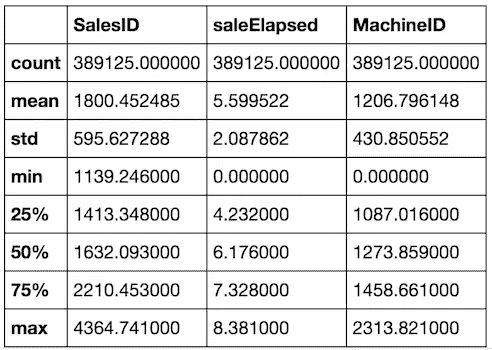

# 机器学习 1：第 5 课

> 原文：[`medium.com/@hiromi_suenaga/machine-learning-1-lesson-5-df45f0c99618`](https://medium.com/@hiromi_suenaga/machine-learning-1-lesson-5-df45f0c99618)
>
> 译者：[飞龙](https://github.com/wizardforcel)
> 
> 协议：[CC BY-NC-SA 4.0](http://creativecommons.org/licenses/by-nc-sa/4.0/)

*我从*[*机器学习课程*](http://forums.fast.ai/t/another-treat-early-access-to-intro-to-machine-learning-videos/6826/1)*中得到的个人笔记。随着我继续复习课程以“真正”理解它，这些笔记将继续更新和改进。非常感谢*[*Jeremy*](https://twitter.com/jeremyphoward) *和*[*Rachel*](https://twitter.com/math_rachel) *给了我这个学习的机会。*

[视频](https://youtu.be/3jl2h9hSRvc)

## 复习

+   测试集，训练集，验证集和 OOB

我们有一个数据集，其中有很多行，我们有一些因变量。机器学习和其他任何工作之间的区别是什么？区别在于，在机器学习中，我们关心的是泛化准确性或泛化错误，而在其他几乎所有情况下，我们只关心我们能够如何将观察结果映射到。所以，泛化是机器学习的关键独特部分。如果我们想知道我们是否做得好，我们需要知道我们是否做得好泛化。如果我们不知道这一点，我们什么也不知道。

**问题**：泛化，你是指缩放吗？能够扩展吗？[[1:26](https://youtu.be/3jl2h9hSRvc?t=1m26s)] 不，我一点也不是指缩放。缩放在许多领域中是重要的。就像好吧，我们有一个在我的电脑上使用 1 万个项目的东西，现在我需要让它每秒处理 1 万个项目。所以缩放很重要，但不仅仅是对于机器学习，而是对于我们投入生产的几乎所有东西都很重要。泛化是我说的，好吧，这是一个可以预测猫和狗的模型。我看了五张猫的图片和五张狗的图片，我建立了一个完美的模型。然后我看了另一组五只猫和狗，结果全都错了。所以在这种情况下，它学到的不是猫和狗之间的区别，而是学到了那五只具体的猫长什么样，那五只具体的狗长什么样。或者我建立了一个预测特定产品的杂货销售模型，比如上个月新泽西的卫生纸销售，然后我把它投入生产，它扩展得很好（换句话说，延迟很低，没有高 CPU 负载），但它无法预测除了新泽西的卫生纸之外的任何东西。事实证明，它只在上个月做得好，而不是下个月。这些都是泛化失败。

人们检查泛化能力最常见的方法是创建一个随机样本。他们会随机选择几行数据并将其提取到一个测试集中。然后他们会在其余的行上构建所有模型，当他们完成时，他们会检查在测试集上获得的准确性（其余的行被称为训练集）。所以在建模过程结束时，在训练集上，他们得到了 99%的准确性，预测猫和狗，最后，他们会将其与测试集进行比较，以确保模型真正泛化。

现在的问题是，如果不行怎么办？嗯，我可以回去改变一些超参数，做一些数据增强，或者尝试创建一个更具泛化性的模型。然后我再次回去，做了所有这些之后，检查结果仍然不好。我会一遍又一遍地这样做，直到最终，在尝试了五十次之后，它泛化了。但它真的泛化了吗？因为也许我所做的一切只是偶然找到了这个恰好适用于那个测试集的模型，因为我尝试了五十种不同的方法。所以如果我有一个东西，巧合地 5%的时间是正确的，那么很可能不会偶然得到一个好的结果。所以我们通常会将第二个数据集（验证集）放在一边。然后，不在验证集或测试集中的所有内容现在都是训练集。我们训练一个模型，对其进行验证以查看其是否泛化，重复几次。然后当我们最终得到了我们认为会根据验证集成功泛化的东西（在项目结束时），我们会对其进行测试。

问题：所以基本上通过制作这两层测试集和验证集，如果一个对了另一个错了，你就是在双重检查你的错误？它检查我们是否过度拟合验证集。所以如果我们一遍又一遍地使用验证集，那么我们最终可能得不到一组适用于训练集和验证集的可泛化的超参数，而只是一组恰好适用于训练集和验证集的超参数。所以如果我们对验证集尝试了 50 种不同的模型，然后在所有这些之后，我们再对测试集进行检查，结果仍然是泛化的，那么我们会说好的，我们实际上已经得到了一个可泛化的模型。如果不是，那么就会说我们实际上现在过度拟合了验证集。在那一点上，你会陷入麻烦。因为你没有留下任何东西。所以想法是在建模过程中使用有效的技术，以防止这种情况发生。但如果它确实发生了，你希望找出原因——你需要那个测试集，否则当你投入生产时，结果却不能泛化，那将是一个非常糟糕的结果。你最终会发现点击你的广告的人会减少，或者销售你的产品会减少，或者为高风险车辆提供汽车保险的人会减少。

问题：所以只是为了确保，我们需要检查验证集和测试集是否一致，还是只保留测试集？如果你像我刚刚做的那样随机抽样，没有特定的原因需要检查，只要它们足够大。但我们将在稍后的不同情境中回答你的问题。

我们学到的另一个随机森林的技巧是一种不需要验证集的方法。我们学到的方法是使用 OOB 分数。这个想法是，每次我们在随机森林中训练一棵树时，都会有一些观察结果被保留，因为这就是我们获得一些随机性的方式。因此，让我们基于这些保留样本计算每棵树的分数，然后通过对每行不参与训练的树进行平均，得到整个森林的分数。因此，OOB 分数给我们提供了与验证分数非常相似的东西，但平均来看，它稍微差一些。为什么？因为每一行都将使用一部分树来进行预测，而树越少，我们知道预测就越不准确。这是一个微妙的问题，如果你没有理解，那就在这一周内考虑一下，直到你明白为什么，因为这是对你对随机森林理解的一个非常有趣的测试。为什么 OOB 分数平均来看比你的验证分数差一些？它们都使用随机保留的子集。

总的来说，这通常足够了。那么在使用随机森林时为什么还要有一个验证集呢？如果是一个随机选择的验证集，严格来说并不是必需的，但你有四个层次的测试——所以你可以在 OOB 上测试，当那个工作良好时，你可以在验证集上测试，希望到检查测试集时不会有什么意外，这将是一个很好的理由。

Kaggle 的做法是相当聪明的。Kaggle 的做法是将测试集分成两部分：一个公共部分和一个私有部分。他们不告诉你哪个是哪个。所以你将你的预测提交给 Kaggle，然后随机选择其中 30%用来告诉你排行榜分数。但是在比赛结束时，这部分将被丢弃，他们将使用另外 70%来计算你的真实分数。这样做的目的是确保你不会持续使用来自排行榜的反馈来找出一组在公共部分表现良好但实际上不具有泛化性的超参数。这是一个很好的测试。这也是为什么在比赛结束时使用 Kaggle 是一个很好的做法的原因之一，因为在比赛的最后一天，当他们使用私有测试集时，你的排名会下降一百名，然后你会明白，这就是过拟合的感觉，练习和获得这种感觉要比在公司中有数亿美元的风险要好得多。

这就像是可能的最简单情况，你可以使用一个随机样本作为你的验证集。为什么我可能无法使用一个随机样本作为我的验证集，或者可能失败呢？我的观点是，通过使用一个随机验证集，我们可能会对我们的模型完全产生错误的看法。要记住的重要事情是，当你构建一个模型时，你总是会有一个系统误差，即你将在比构建模型时晚的时间使用该模型。你将在生产中使用它，到那时，世界已经不同于你现在所处的世界，即使在构建模型时，你使用的数据也比今天的数据旧。因此，在你构建模型的数据和实际使用的数据之间存在一些滞后。大部分时间，如果不是大部分时间，这是很重要的。

因此，如果我们正在预测谁会在新泽西购买卫生纸，而我们需要两周时间将其投入生产，并且我们使用了过去几年的数据进行预测，那时情况可能会大不相同。特别是我们的验证集，如果我们随机抽样，而且是从四年的时间段中抽取的，那么绝大多数数据将是一年多以前的。也许新泽西人的购买习惯可能已经发生了巨大变化。也许他们现在正经历着严重的经济衰退，无法再购买高质量的卫生纸。或者也许他们的造纸工业飞速发展，突然间他们购买更多卫生纸，因为价格便宜。世界在变化，因此如果你为验证集使用随机样本，那么实际上你正在检查你在预测完全过时的事物方面有多好？你有多擅长预测四年前发生的事情？这并不有趣。因此，在实践中，每当有一些时间因素时，我们要做的是假设我们已经按时间排序，我们将使用最新的部分作为我们的验证集。我想，实际上应该正确地执行：


这是我们的验证集，这是我们的测试集。所以剩下的就是我们的训练集，我们使用它并尝试能够建立一个模型，使其仍然适用于比模型建立时更晚的时间。因此，我们不仅仅是在某种抽象意义上测试泛化性能，而是在一个非常具体的时间意义上，即它是否能泛化到未来。

**问题**：正如您所说，数据中存在一些时间顺序，那么在这种情况下，是明智地使用整个数据进行训练，还是只使用最近的一些数据集进行训练？是的，这是一个完全不同的问题。那么如何确保验证集的质量良好呢？我在所有训练数据上构建了一个随机森林。它在训练数据上看起来不错，在 OOB 上也看起来不错。这实际上是有 OOB 的一个很好的原因。如果在 OOB 上看起来不错，那么这意味着你在统计意义上没有过拟合。它在一个随机样本上表现良好。但是然后在验证集上看起来不好。那么发生了什么？嗯，发生的是你在某种程度上未能预测未来。你只是预测了过去，所以 Suraj 有一个关于如何解决这个问题的想法。好吧，也许我们应该只训练，也许我们不应该使用整个训练集。我们应该只尝试最近的一段时间。现在缺点是，我们现在使用的数据更少，因此我们可以创建更少的丰富模型，但好处是，这是更为最新的数据。这是你必须尝试的事情。大多数机器学习函数都有能力为每一行提供一个权重。例如，对于随机森林，你可以在每一行上设置一个权重，并以某种概率随机选择该行。因此，我们可以设置概率，使得最近的行有更高的被选中的概率。这可能非常有效。这是你必须尝试的事情，如果你没有一个代表未来的验证集，与你正在训练的数据相比，你就无法知道哪些技术是有效的。

你如何在数据量和数据新旧之间做出妥协？我倾向于这样做，当我遇到这种时间问题时，也许大部分时间都是这样，一旦我在验证集上找到了一个表现良好的模型，我就不会直接在测试集上使用那个模型，因为测试集比训练集要远得多。所以我会重新构建那个模型，但这次我会将训练和验证集合并起来重新训练模型。在那一点上，你没有办法对验证集进行测试，所以你必须确保你有一个可重现的脚本或笔记本，以确保完全相同的步骤，因为如果你出错了，你会发现在测试集上出现了问题。所以我在实践中所做的是，我需要知道我的验证集是否真正代表了测试集。所以我在训练集上建立了五个模型，并尝试让它们在我认为它们有多好的方面有所不同。然后我在验证集上对我的五个模型进行评分，然后我也在测试集上对它们进行评分。所以我没有作弊，因为我没有使用来自测试集的任何反馈来改变我的超参数——我只是用它来检查我的验证集。所以我从验证集和测试集中得到了五个分数，然后我检查它们是否在一条线上。如果不是，那么你将无法从验证集中获得足够好的反馈。所以继续这个过程，直到你得到一条线，这可能会很棘手。试图创建尽可能接近真实结果的东西是困难的。在现实世界中，创建测试集也是如此——测试集必须尽可能接近生产。那么实际使用这个产品的客户组合是什么样的，你构建模型和投入生产之间实际会有多少时间？你能够多频繁地更新模型？这些都是在构建测试集时需要考虑的事情。

**问题**：所以首先你在训练数据上建立了五个模型，如果没有得到直线关系，就改变你的验证和测试集？通常你不能真正改变测试集，所以这是假设测试集已经给定，你改变验证集。所以如果你开始用一个随机样本验证集，然后结果千奇百怪，你意识到哦，我应该选择最近的两个月。然后你选择了最近的两个月，结果还是千奇百怪，你意识到哦，我应该选择从每个月的第一天到第十五天，然后不断改变验证集，直到找到一个能够反映你的测试集结果的集合。

**问题**：对于五个模型，你可能从随机数据、平均值等开始？也许不是五个糟糕的模型，但你想要一些变化，尤其是你想要一些在时间上可能泛化得更好的模型。一个是在整个训练集上训练的，一个是在最后两周训练的，一个是在最后六周训练的，一个使用了很多列可能会过拟合一些。所以你想要知道如果我的验证集在时间上无法泛化，我想看到这一点，如果在统计上无法泛化，我也想看到这一点。

**问题**：你能详细解释一下你所说的改变验证集以使其表示测试集是什么意思吗？看起来是什么样子？让我们以杂货竞赛为例，我们试图预测接下来两周的杂货销售额。Terrance 和我尝试过的可能的验证集是：

+   随机样本（4 年）

+   最近一个月的数据（7 月 15 日至 8 月 15 日）

+   过去的两周（8 月 1 日至 15 日）

+   一个月前的同一天范围（7 月 15 日至 30 日）

这个比赛中的测试集是 8 月 15 日至 30 日。所以上面是我们尝试的四个不同的验证集。随机的结果是完全不稳定的。上个月的结果不错但也不是很好。过去的两周，有一些看起来不好，但总体上还不错。一个月前的同一天范围内，他们有一个基本完美的线。

**问题**：我们到底是在与测试集中的什么进行比较？我建立了 5 个模型，可能是 1.只是预测平均值，2.对整个数据集进行某种简单的组平均，3.对过去一个月的数据进行某种组平均，4.构建整个数据集的随机森林，5.从过去三周构建随机森林。在每一个上，我计算验证分数。然后我在整个训练集上重新训练模型，并在测试集上进行相同的计算。所以现在每个点告诉我它在验证集上表现如何，它在测试集上表现如何。如果验证集有用，我们会说每次验证分数提高，测试集分数也应该提高。

**问题**：当你说“重新训练”时，你是指在训练和验证集上重新训练模型吗？是的，所以一旦我得到了基于训练集的验证分数，然后在训练和验证集上重新训练，并与测试集进行对比。

**问题**：通过测试集，你是指将其提交到 Kaggle 并检查分数吗？如果是 Kaggle，那么你的测试集就是 Kaggle 的排行榜。在现实世界中，测试集是你放在一边的第三个数据集。这第三个数据集反映真实世界生产差异是机器学习项目中最重要的一步。为什么这是最重要的一步？因为如果你搞砸了其他一切但没有搞砸这个，你会知道你搞砸了。如果你有一个好的测试集，那么你会知道你搞砸了，因为你搞砸了其他东西并测试了它，结果不尽人意，没关系。你不会毁掉公司。如果你搞砸了创建测试集，那将是可怕的。因为那样你就不知道自己是否犯了错误。你尝试构建一个模型，你在测试集上测试它，看起来不错。但测试集并不代表真实世界环境。所以你实际上不知道你是否会毁掉公司。希望你有逐渐将事物投入生产的方式，这样你就不会真的毁掉公司，但至少会毁掉你在工作中的声誉。哦，Jeremy 试图将这个东西投入生产，在第一周我们尝试的队伍中，他们的销售额减半了，我们再也不会让 Jeremy 做机器学习工作了。但如果 Jeremy 使用了适当的测试集，那么他会知道，哦，这只有我的验证集说的一半好，我会继续尝试。现在我不会惹麻烦了。我实际上很喜欢 Jeremy - 他能提前识别出将会出现泛化问题的情况。

这是每个人在机器学习课程中都会谈论一点的事情，但通常停在你学到了 sklearn 中有一个叫做 make `train_test_split`的东西，它返回这些东西，然后你就可以继续了，或者这里是交叉验证函数。这些东西总是给你随机样本的事实告诉你，如果不是大部分时间，你不应该使用它们。随机森林免费提供 OOB，这很有用，但只告诉你这在统计意义上是泛化的，而不是在实际意义上。

## 交叉验证

在课外，你们一直在讨论很多，这让我觉得有人一直在过分强调这种技术的价值。所以我会解释什么是交叉验证，然后解释为什么你大部分时间可能不应该使用它。

交叉验证意味着我们不只是拿出一个验证集，而是拿出五个，例如。所以让我们首先假设我们要随机洗牌数据。这是至关重要的。

1.  随机洗牌数据。

1.  将其分成五组

1.  对于模型 №1，我们将第一个称为验证集，底部四个称为训练集。

1.  我们将训练并检查验证，得到一些 RMSE、R²等。

1.  我们将重复这个过程五次，然后取 RMSE、R²等的平均值，这是交叉验证的平均准确度。

使用交叉验证相比标准验证集的好处是什么？你可以使用所有的数据。你不必留下任何东西。而且你还有一个小小的好处，你现在有了五个模型，可以将它们组合在一起，每个模型使用了 80%的数据。有时这种集成可以很有帮助。

有哪些原因你不会使用交叉验证呢？对于大型数据集，它会花费很长时间。我们必须拟合五个模型而不是一个，所以时间是一个关键的缺点。如果我们在进行深度学习，需要一天的时间来运行，突然之间需要五天，或者我们需要 5 个 GPU。那么关于我之前关于验证集的问题呢？我们之前对为什么随机验证集是一个问题的担忧在这里完全相关。这些验证集是随机的，所以如果一个随机验证集对你的问题不合适，很可能是因为，例如，时间问题，那么这五个验证集都不好。它们都是随机的。所以如果你有像之前一样的时间数据，就没有办法进行交叉验证，或者没有好的方法进行交叉验证。你希望你的验证集尽可能接近测试集，而你不能通过随机抽样不同的东西来做到这一点。你可能不需要进行交叉验证，因为在现实世界中，我们通常并没有那么少的数据 —— 除非你的数据是基于一些非常昂贵的标记过程或一些昂贵的实验。但如今，数据科学家并不经常做这种工作。有些人在做，如果是这样，那么这是一个问题，但我们大多数人不是。所以我们可能不需要。即使我们这样做了，它会花费很多时间，即使我们这样做了并花费了所有的时间，它可能会给我们完全错误的答案，因为随机验证集对我们的问题是不合适的。

我不会花太多时间在交叉验证上，因为我认为它是一个有趣的工具，易于使用（sklearn 有一个可以使用的交叉验证工具），但在我看来，它并不经常是你工具箱中的重要部分。有时会用到。所以这就是验证集。

## 树解释[[38:02](https://youtu.be/3jl2h9hSRvc?t=38m2s)]

树解释器是做什么的，它是如何做到的呢？让我们从树解释器的输出开始[[38:51](https://youtu.be/3jl2h9hSRvc?t=38m51s)]。这里是一棵树：


树的根在任何分割之前。因此，10.189 是我们训练集中所有选项的平均对数价格。然后，如果我选择 `Coupler_System ≤ 0.5`，那么我们得到一个平均值为 10.345（共 16815 个子集）。在 `Coupler_System ≤0.5` 的人中，我们然后取 `Enclosure ≤ 2.0` 的子集，那里的平均对数价格为 9.955。然后最后一步是 `ModelID ≤ 4573.0`，这给我们 10.226。


然后我们可以计算每个额外标准对平均对数价格的变化。我们可以将其绘制为所谓的瀑布图。瀑布图是我知道的最有用的图之一，奇怪的是，Python 中没有任何工具可以绘制它们。这是其中一种情况，管理咨询和商业领域中每个人都经常使用瀑布图，而学术界却不知道这些是什么。每当你有一个起点、一些变化和一个终点时，瀑布图几乎总是展示它们的最佳方式。


在 Excel 2016 中，它是内置的。你只需点击插入瀑布图，它就在那里。如果你想成为一个英雄，为 matplotlib 创建一个瀑布图包，将其放在 pip 上，每个人都会喜欢你的。实际上，这些非常容易构建。你基本上做一个堆叠柱状图，底部全是白色。你可以做到这一点，但如果你能整理好它，把点放在正确的位置并精心着色，那将是非常棒的。我认为你们都有能力做到，这对你的作品集来说将是一件了不起的事情。

一般来说，它们从所有开始，然后逐个变化，然后所有这些的总和将等于最终预测[[43:38](https://youtu.be/3jl2h9hSRvc?t=43m38s)]。所以如果我们只是做一个决策树，有人问“为什么这个特定拍卖的预测是这个特定价格？”，这就是你可以回答“因为这三个事物产生了这三个影响”的方式。

对于随机森林，我们可以在所有树中执行相同的操作。所以每次我们看到联接器时，我们累加那个变化。每次我们看到围栏时，我们累加那个变化，依此类推。然后将它们全部组合在一起，我们就得到了树解释器的功能。所以你可以查看树解释器的源代码，它并不是非常复杂的逻辑。或者你可以自己构建它，看看它是如何做到这一点的。

```py
from treeinterpreter import treeinterpreter as ti
df_train, df_valid = split_vals(df_raw[df_keep.columns], n_trn)
row = X_valid.values[None,0]; row
'''
array([[4364751, 2300944, 665, 172, 1.0, 1999, 3726.0, 3, 3232, 1111, 0, 63, 0, 5, 17, 35, 4, 4, 0, 1, 0, 0,
        0, 0, 0, 0, 0, 0, 0, 0, 12, 0, 0, 0, 0, 0, 3, 0, 0, 0, 2, 19, 29, 3, 2, 1, 0, 0, 0, 0, 0, 2010, 9, 37,
        16, 3, 259, False, False, False, False, False, False, 7912, False, False]], dtype=object)
'''
prediction, bias, contributions = ti.predict(m, row)
```

所以当你使用随机森林模型对某个特定拍卖进行 `treeinterpreter.predict` 时（在这种情况下是零索引行），它告诉你：

+   `prediction`: 与随机森林预测相同

+   `偏差`: 这将始终是相同的 - 这是树中每个随机样本的每个人的平均销售价格

+   `contributions`: 每次我们在树中看到特定列出现时所有贡献的总和。

```py
prediction[0], bias[0]
'''
(9.1909688098736275, 10.10606580677884)
'''
```

上次我犯了一个错误，没有正确排序这个。所以这次 `np.argsort` 是一个非常方便的函数。它实际上并不对 `contributions[0]` 进行排序，它只是告诉你如果对其进行排序，每个项目将移动到哪里。所以现在通过将 `idxs` 传递给每个列、级别和贡献，我可以按正确的顺序打印出所有这些。

```py
idxs = np.argsort(contributions[0])
[
   o for o in zip(
      df_keep.columns[idxs], 
      df_valid.iloc[0][idxs], 
      contributions[0][idxs]
   )
]
'''
[('ProductSize', 'Mini', -0.54680742853695008),
 ('age', 11, -0.12507089451852943),
 ('fiProductClassDesc',
  'Hydraulic Excavator, Track - 3.0 to 4.0 Metric Tons',
  -0.11143111128570773),
 ('fiModelDesc', 'KX1212', -0.065155113754146801),
 ('fiSecondaryDesc', nan, -0.055237427792181749),
 ('Enclosure', 'EROPS', -0.050467175593900217),
 ('fiModelDescriptor', nan, -0.042354676935508852),
 ('saleElapsed', 7912, -0.019642242073500914),
 ('saleDay', 16, -0.012812993479652724),
 ('Tire_Size', nan, -0.0029687660942271598),
 ('SalesID', 4364751, -0.0010443985823001434),
 ('saleDayofyear', 259, -0.00086540581130196688),
 ('Drive_System', nan, 0.0015385818526195915),
 ('Hydraulics', 'Standard', 0.0022411701338458821),
 ('state', 'Ohio', 0.0037587658190299409),
 ('ProductGroupDesc', 'Track Excavators', 0.0067688906745931197),
 ('ProductGroup', 'TEX', 0.014654732626326661),
 ('MachineID', 2300944, 0.015578052196894499),
 ('Hydraulics_Flow', nan, 0.028973749866174004),
 ('ModelID', 665, 0.038307429579276284),
 ('Coupler_System', nan, 0.052509808150765114),
 ('YearMade', 1999, 0.071829996446492878)]
'''
```

所以小型工业设备意味着它更便宜。如果它是最近制造的，那就意味着更昂贵，等等。所以这实际上对 Kaggle 不会有太大帮助，因为你只需要预测。但在生产环境甚至是预生产阶段，这将对你有很大帮助。所以任何一个好的经理应该做的事情是，如果你说这里有一个机器学习模型，我认为我们应该使用它，他们应该离开并抓取一些实际客户或实际拍卖的例子，检查你的模型是否看起来直观。如果它说我的预测是很多人会真的喜欢这部糟糕的电影，而实际上是“哇，那是一部真的糟糕的电影”，那么他们会回来问你“解释一下为什么你的模型告诉我我会喜欢这部电影，因为我讨厌那部电影”。然后你可以回答说，这是因为你喜欢这部电影，因为你是这个年龄段，你是这个性别，平均而言，实际上像你这样的人确实喜欢那部电影。

**问题**：每个元组的第二个元素是什么[[47:25](https://youtu.be/3jl2h9hSRvc?t=47m25s)]？这是说对于这一行，'ProductSize'是'Mini'，它已经 11 岁了，等等。所以它只是反馈并告诉你。因为这实际上就是它的样子：

```py
array([[4364751, 2300944, 665, 172, 1.0, 1999, 3726.0, 3, 3232, 1111, 0, 63, 0, 5, 17, 35, 4, 4, 0, 1, 0, 0,
        0, 0, 0, 0, 0, 0, 0, 0, 12, 0, 0, 0, 0, 0, 3, 0, 0, 0, 2, 19, 29, 3, 2, 1, 0, 0, 0, 0, 0, 2010, 9, 37,
        16, 3, 259, False, False, False, False, False, False, 7912, False, False]], dtype=object)
```

就是这些数字。所以我只是回到原始数据中实际提取出每个描述性版本。

所以如果我们把所有的贡献加在一起，然后加到偏差中，那将给我们最终的预测。

```py
contributions[0].sum()*-0.7383536391949419*
```

这是一个几乎完全未知的技术，这个特定的库也几乎完全未知。所以这是一个展示很多人不知道的东西的绝佳机会。在我看来，这是非常关键的，但很少有人这样做。

所以这基本上是随机森林解释部分的结束，希望你现在已经看到足够多，当有人说我们不能使用现代机器学习技术，因为它们是不可解释的黑匣子时，你有足够的信息来说你是在胡说。它们是非常可解释的，我们刚刚做的事情——试图用线性模型做到这一点，祝你好运。即使你可以用线性模型做类似的事情，试图做到不给你完全错误答案并且你不知道它是错误答案将是一个真正的挑战。

## 外推[[49:23](https://youtu.be/3jl2h9hSRvc?t=49m23s)]

在我们尝试构建自己的随机森林之前，我们要做的最后一步是处理这个棘手的外推问题。所以在这种情况下，如果我们看一下我们最近树的准确性，我们仍然在我们的验证分数和训练分数之间有很大的差异。


实际上，在这种情况下，OOB（0.89420）和验证（0.89319）之间的差异实际上非常接近。所以如果有很大的差异，我会非常担心我们是否正确处理了时间方面的问题。这是最近的模型：


在 Kaggle 上，你需要那个最后的小数点。在现实世界中，我可能会停在这里。但很多时候你会看到你的验证分数和 OOB 分数之间有很大的差异，我想向你展示如何处理这个问题，特别是因为我们知道 OOB 分数应该稍微差一点，因为它使用的树较少，所以这让我感觉我们应该做得更好一点。我们应该能够做得更好一点的方法是更好地处理时间组件。

当涉及外推时，随机森林存在问题。当你有一个包含四年销售数据的数据集时，你创建了你的树，它说如果它在某个特定的商店和某个特定的物品上特价，这里是平均价格。它实际上告诉我们整个训练集上的平均价格，这可能相当古老。所以当你想要向前迈进到下个月的价格时，它从未见过下个月。而线性模型可以找到时间和价格之间的关系，即使我们只有这么多数据，当你预测未来的某事时，它可以外推。但是随机森林做不到这一点。如果你考虑一下，树无法说下个月价格会更高。所以有几种处理这个问题的方法，我们将在接下来的几堂课中讨论，但一个简单的方法就是尽量避免使用时间变量作为预测因子，如果有其他东西可以使用，可以给我们更好或更强的关系，那实际上会在未来起作用[[52:19](https://youtu.be/3jl2h9hSRvc?t=52m19s)]。

因此，在这种情况下，我想要做的第一件事是弄清楚我们的验证集和训练集之间的差异。如果我了解我们的验证集和训练集之间的差异，那么这告诉我哪些预测变量具有强烈的时间成分，因此到了未来时间段可能是无关紧要的。因此，我做了一些非常有趣的事情，我创建了一个随机森林，其中我的因变量是“是否在验证集中”（`is_valid`）。我回去拿到了整个数据框，包括训练和验证全部在一起，然后我创建了一个新列叫做`is_valid`，我将其设置为 1，然后对于所有在训练集中的东西，我将其设置为 0。因此，我有了一个新列，只是这个是否在验证集中，然后我将其用作我的因变量并构建一个随机森林。这是一个随机森林，不是为了预测价格，而是为了预测这是否在验证集中。因此，如果您的变量不是时间相关的，那么应该不可能弄清楚某样东西是否在验证集中。

```py
df_ext = df_keep.copy()
df_ext['is_valid'] = 1
df_ext.is_valid[:n_trn] = 0
x, y, nas = proc_df(df_ext, 'is_valid')
```

这是 Kaggle 中的一个很棒的技巧，因为他们通常不会告诉您测试集是否是随机样本。因此，您可以将测试集和训练集放在一起，创建一个新列叫做`is_test`，看看您是否可以预测它。如果可以，那么您就没有一个随机样本，这意味着您必须弄清楚如何从中创建一个验证集。

```py
m = RandomForestClassifier(
      n_estimators=40, 
      min_samples_leaf=3, 
      max_features=0.5, 
      n_jobs=-1, 
      oob_score=True
)
m.fit(x, y);
m.oob_score_
'''
0.99998753505765037
'''
```

在这种情况下，我可以看到我没有一个随机样本，因为我的验证集可以用 0.9999 的 R²来预测。

因此，如果我查看特征重要性，最重要的是`SalesID`[[54:36](https://youtu.be/3jl2h9hSRvc?t=54m36s)]。这非常有趣。它清楚地告诉我们`SalesID`不是一个随机标识符，而可能是随着时间的推移而连续设置的某些东西——我们只是增加`SalesID`。`saleElapsed`是自我们数据集中第一个日期以来的天数，因此不足为奇，它也是一个很好的预测变量。有趣的是`MachineID`——显然每台机器也被标记为一些连续的标识符，然后重要性大幅下降，所以我们就到此为止。

```py
fi = rf_feat_importance(m, x); fi[:10] 
```


接下来让我们获取前三个，然后我们可以查看它们在训练集和验证集中的值。[[55:22](https://youtu.be/3jl2h9hSRvc?t=55m22s)]

```py
feats='SalesID', 'saleElapsed', 'MachineID'.describe()
```



```py
(X_valid[feats]/1000).describe()
```


例如，我们可以看到，销售 ID 在训练集中平均为 180 万，在验证集中为 580 万（请注意该值已除以 1000）。因此，您可以确认它们是非常不同的。

所以让我们把它们删除。

```py
x.drop(feats, axis=1, inplace=True)
m = RandomForestClassifier(
   n_estimators=40, 
   min_samples_leaf=3, 
   max_features=0.5, 
   n_jobs=-1, 
   oob_score=True
)
m.fit(x, y);
m.oob_score_
'''
0.9789018385789966
'''
```

所以在我删除它们之后，现在让我们看看我是否可以预测某样东西是否在验证集中。我仍然可以用 0.98 的 R²来预测。

```py
fi = rf_feat_importance(m, x); fi[:10]
```


一旦您删除了一些东西，其他东西就会浮现出来，现在显然老年——年龄较大的东西更有可能在验证集中，因为在训练集中的早期阶段，它们还不可能那么老。YearMade 也是同样的原因。因此，我们也可以尝试删除这些——从第一个中删除`SalesID`、`saleElapsed`、`MachineID`，从第二个中删除`age`、`YearMade`和`saleDayofyear`。它们都是与时间有关的特征。如果它们很重要，我仍然希望它们出现在我的随机森林中。但如果它们不重要，那么如果有其他一些非时间相关的变量效果一样好——那将更好。因为现在我将拥有一个更好地泛化时间的模型。

```py
set_rf_samples(50000)
feats=['SalesID', 'saleElapsed', 'MachineID', 'age', 'YearMade', 'saleDayofyear']X_train, X_valid = split_vals(df_keep, n_trn)
m = RandomForestRegressor(
   n_estimators=40, 
   min_samples_leaf=3, 
   max_features=0.5, 
   n_jobs=-1, 
   oob_score=True
)
m.fit(X_train, y_train)
print_score(m)
'''
[0.21136509778791376, 0.2493668921196425, 0.90909393040946562, 0.88894821098056087, 0.89255408392415925]
'''
```

所以在这里，我将逐个查看这些特征并逐个删除，重新训练一个新的随机森林，并打印出分数。在我们做任何这些之前，我们的验证分数是 0.88，OOB 是 0.89。你可以看到，当我删除 SalesID 时，我的分数上升了。这正是我们所希望的。我们删除了一个时间相关的变量，还有其他变量可以找到类似的关系而不依赖于时间。因此，删除它导致我们的验证分数上升。现在 OOB 没有上升，因为这实际上在统计上是一个有用的预测变量，但它是一个时间相关的变量，我们有一个时间相关的验证集。这是非常微妙的，但它可能非常重要。它试图找到能够提供跨时间泛化预测的因素，这里是你可以看到的方式。

```py
for f in feats:
    df_subs = df_keep.drop(f, axis=1)
    X_train, X_valid = split_vals(df_subs, n_trn)
    m = RandomForestRegressor(
         n_estimators=40, 
         min_samples_leaf=3, 
         max_features=0.5, 
         n_jobs=-1, 
         oob_score=True
    )
    m.fit(X_train, y_train)
    print(f)
    print_score(m)
SalesID 
'''
[0.20918653475938534, 0.2459966629213187, 0.9053273181678706, 0.89192968797265737, 0.89245205174299469]
'''
saleElapsed 
'''
[0.2194124612957369, 0.2546442621643524, 0.90358104739129086, 0.8841980790762114, 0.88681881032219145]
'''
MachineID
'''
[0.206612984511148, 0.24446409479358033, 0.90312476862123559, 0.89327205732490311, 0.89501553584754967]
'''
age
'''
[0.21317740718919814, 0.2471719147150774, 0.90260198977488226, 0.89089460707372525, 0.89185129799503315]
'''
YearMade
'''
[0.21305398932040326, 0.2534570148977216, 0.90555219348567462, 0.88527538596974953, 0.89158854973045432]
'''
saleDayofyear
'''
[0.21320711524847227, 0.24629839782893828, 0.90881970943169987, 0.89166441133215968, 0.89272793857941679]
'''
```

我们肯定应该删除`SalesID`，但`saleElapsed`没有变得更好，所以我们不想要。`MachineID`变得更好了-从 0.888 到 0.893，所以实际上好了很多。`age`有点变好了。`YearMade`变得更糟了，`saleDayofyear`有点变好了。

```py
reset_rf_samples()
```

现在我们可以说，让我们摆脱那三个我们知道摆脱它实际上使它变得更好的东西。因此，我们现在达到了 0.915！所以我们摆脱了三个时间相关的因素，现在如我们所料，我们的验证比 OOB 更好。

```py
df_subs = df_keep.drop(
   ['SalesID', 'MachineID', 'saleDayofyear'], 
   axis=1
)
X_train, X_valid = split_vals(df_subs, n_trn)
m = RandomForestRegressor(
   n_estimators=40, 
   min_samples_leaf=3, 
   max_features=0.5, 
   n_jobs=-1, 
   oob_score=True
)
m.fit(X_train, y_train)
print_score(m)
'''
[0.1418970082803121, 0.21779153679471935, 0.96040441863389681, 0.91529091848161925, 0.90918594039522138]
'''
```

所以那是一个非常成功的方法，现在我们可以检查特征的重要性。

```py
plot_fi(rf_feat_importance(m, X_train));
```


```py
np.save('tmp/subs_cols.npy', np.array(df_subs.columns))
```

让我们继续说好吧，那真是相当不错。现在让它静置一段时间，给它 160 棵树，让它消化一下，看看效果如何。

## 我们的最终模型！

```py
m = RandomForestRegressor(
   n_estimators=160, 
   max_features=0.5, 
   n_jobs=-1, 
   oob_score=True
)
%time m.fit(X_train, y_train)
print_score(m)
'''
CPU times: user 6min 3s, sys: 2.75 s, total: 6min 6s
Wall time: 16.7 s
[0.08104912951128229, 0.2109679613161783, 0.9865755186304942, 0.92051576728916762, 0.9143700001430598]
'''
```

正如你所看到的，我们进行了所有的解释，所有的微调基本上都是用较小的模型/子集进行的，最后，我们运行了整个过程。实际上，这只花了 16 秒，所以我们现在的 RMSE 是 0.21。现在我们可以将其与 Kaggle 进行比较。不幸的是，这是一个较旧的比赛，我们不允许再参加，看看我们会取得怎样的成绩。所以我们能做的最好的就是检查它是否看起来我们可能会根据他们的验证集做得很好，所以应该在正确的范围内。根据这一点，我们本来会得第一名。

我认为这是一系列有趣的步骤。所以你可以在你的 Kaggle 项目和更重要的是你的现实世界项目中按照相同的步骤进行。其中一个挑战是一旦你离开这个学习环境，突然间你周围都是从来没有足够时间的人，他们总是希望你赶快，他们总是告诉你这样做然后那样做。你需要找到时间远离一下然后回来，因为这是一个你可以使用的真正的现实世界建模过程。当我说它提供了世界级的结果时，我的意思是真的。赢得这个比赛的人，Leustagos，不幸地去世了，但他是有史以来最顶尖的 Kaggle 竞争者。我相信他赢得了数十个比赛，所以如果我们能够得到一个甚至接近他的分数，那么我们做得真的很好。

**澄清**：这两者之间 R²的变化不仅仅是因为我们删除了这三个预测因子。我们还进行了`reset_rf_samples()`。因此，要真正看到仅仅删除的影响，我们需要将其与之前的最终步骤进行比较。


实际上与 0.907 的验证相比。因此，删除这三个因素使我们的分数从 0.907 提高到 0.915。最终，当然最重要的是我们的最终模型，但只是澄清一下。

# 从头开始编写随机森林！

[笔记本](https://github.com/fastai/fastai/blob/master/courses/ml1/lesson3-rf_foundations.ipynb)

我的原始计划是实时进行，但当我开始做的时候，我意识到那样会很无聊，所以，我们可能会一起更多地走一遍代码。

实现随机森林算法实际上是相当棘手的，不是因为代码很棘手。一般来说，大多数随机森林算法在概念上都很容易。一般来说，学术论文和书籍往往让它们看起来很困难，但从概念上讲并不困难。困难的是把所有细节搞对，知道什么时候是对的。换句话说，我们需要一种好的测试方法。因此，如果我们要重新实现已经存在的东西，比如说我们想在一些不同的框架、不同的语言、不同的操作系统中创建一个随机森林，我总是从已经存在的东西开始。因此，在这种情况下，我们只是把它作为学习练习，用 Python 编写一个随机森林，因此为了测试，我将把它与现有的随机森林实现进行比较。

这是至关重要的。每当你在涉及机器学习中的非平凡量的代码时，知道你是对还是错是最困难的部分。我总是假设在每一步都搞砸了一切，所以我在想，好吧，假设我搞砸了，我怎么知道我搞砸了。然后令我惊讶的是，有时候我实际上做对了，然后我可以继续。但大多数时候，我做错了，所以不幸的是，对于机器学习来说，有很多方法可以让你出错，而不会给你错误。它们只会让你的结果稍微不那么好，这就是你想要发现的。

```py
%load_ext autoreload
%autoreload 2
%matplotlib inline

from fastai.imports import *
from fastai.structured import *
from sklearn.ensemble import RandomForestRegressor, 
                             RandomForestClassifier
from IPython.display import display
from sklearn import metrics
```

因此，考虑到我想要将其与现有实现进行比较，我将使用我们现有的数据集，我们现有的验证集，然后为了简化事情，我只会从两列开始。因此，让我们继续开始编写一个随机森林。

```py
PATH = "data/bulldozers/"

df_raw = pd.read_feather('tmp/bulldozers-raw')
df_trn, y_trn, nas = proc_df(df_raw, 'SalePrice')
def split_vals(a,n): 
   return a[:n], a[n:]
n_valid = 12000
n_trn = len(df_trn)-n_valid
X_train, X_valid = split_vals(df_trn, n_trn)
y_train, y_valid = split_vals(y_trn, n_trn)
raw_train, raw_valid = split_vals(df_raw, n_trn)
x_sub = X_train[['YearMade', 'MachineHoursCurrentMeter']]
```

我写代码的方式几乎都是自顶向下的，就像我的教学一样。因此，从顶部开始，我假设我想要的一切都已经存在。换句话说，我想要做的第一件事是，我将称之为树集合。要创建一个随机森林，我首先要问的问题是我需要传入什么。我需要初始化我的随机森林。我将需要：

+   `x`：一些自变量

+   `y`：一些因变量

+   `n_trees`：选择我想要的树的数量

+   `sample_sz`：我将从一开始使用样本大小参数，因此您希望每个样本有多大

+   `min_leaf`：然后可能是一些可选参数，表示最小叶子大小。

```py
class TreeEnsemble():
    def __init__(self, x, y, n_trees, sample_sz, min_leaf=5):
        np.random.seed(42)
        self.x,self.y,self.sample_sz,self.min_leaf = x,y,sample_sz,min_leaf
        self.trees = [self.create_tree() for i in range(n_trees)]

    def create_tree(self):
        rnd_idxs = np.random.permutation(len(self.y))[:self.sample_sz]
        return DecisionTree(
            self.x.iloc[rnd_idxs], 
            self.y[rnd_idxs],
            min_leaf=self.min_leaf
         )

    def predict(self, x):
        return np.mean([t.predict(x) for t in self.trees], axis=0)
```

对于测试，最好使用一个固定的随机种子，这样每次都会得到相同的结果。`np.random.seed(42)`是设置随机种子的方法。也许值得一提的是，对于那些不熟悉的人来说，计算机上的随机数生成器根本不是随机的。它们实际上被称为伪随机数生成器，它们的作用是在给定一些初始起点（在这种情况下是 42）的情况下，生成一系列确定性（始终相同）的数字，这些数字被设计为：

+   尽可能与前一个数字不相关

+   尽可能不可预测

+   尽可能与具有不同随机种子的东西不相关（因此以 42 开头的序列中的第二个数字应该与以 41 开头的序列中的第二个数字非常不同）

通常，它们涉及使用大素数，取模等等。这是一个有趣的数学领域。如果你想要真正的随机数，唯一的方法就是你可以购买一种叫做硬件随机数生成器的硬件，里面会有一点放射性物质，以及一些检测它输出了多少东西的东西，或者会有一些硬件设备。

**问题**：当前系统时间是否是有效的随机数生成器[[1:09:25](https://youtu.be/3jl2h9hSRvc?t=1h9m25s)]？这可能是一个随机种子（我们用来启动函数的东西）。一个非常有趣的领域是，在您的计算机中，如果您没有设置随机种子，它会被设置为什么。通常，人们会使用当前时间来确保安全性 - 显然，我们在安全方面使用了很多随机数，比如如果您正在生成 SSH 密钥，它需要是随机的。事实证明，人们可以大致确定您创建密钥的时间。他们可以查看`id_rsa`的时间戳，然后尝试在该时间戳周围的所有不同纳秒起始点上尝试随机数生成器，并找出您的密钥。因此，在实践中，许多需要高度随机性的应用程序实际上都有一步说“请移动鼠标并在键盘上输入一段时间的随机内容”，这样就可以让您成为“熵”的来源。另一种方法是他们会查看一些日志文件的哈希值或类似的东西。这是一个非常有趣的领域。

在我们的情况下，我们的目的实际上是消除随机性[[1:10:48](https://youtu.be/3jl2h9hSRvc?t=1h10m48s)]。所以我们说，好吧，生成一系列以 42 开始的伪随机数，所以它应该始终相同。

如果您在 Python 面向对象方面没有做过太多事情，这基本上是标准习语，至少我是这样写的，大多数人不这样写，但是如果您传入五个要保存在此对象内部的东西，那么您基本上必须说`self.x = x`，等等。我们可以从元组中赋值给元组。


这是我的编码方式。大多数人认为这很糟糕，但我更喜欢一次看到所有东西，这样我就知道在我的代码中，每当我看到类似这样的东西时，它总是在方法中设置的所有内容。如果我以不同的方式做，那么现在一半的代码会从页面底部消失，你就看不到了。

这是我考虑的第一件事 - 要创建一个随机森林，您需要哪些信息。然后我需要将该信息存储在我的对象内部，然后我需要创建一些树。随机森林是一些树的集合。因此，我基本上想到使用列表推导来创建一组树。我们有多少棵树？我们有`n_trees`棵树。这就是我们要求的。`range(n_trees)`给我从 0 到`n_trees-1`的数字。因此，如果我创建一个列表推导，循环遍历该范围，每次调用`create_tree`，我现在有了`n_trees`棵树。

为了写这个，我根本不用思考。这一切都是显而易见的。所以我把思考推迟到了这一点，就像好吧，我们没有东西来创建一棵树。好吧，没关系。但让我们假装我们有。如果我们有了，我们现在创建了一个随机森林。我们仍然需要在此基础上做一些事情。例如，一旦我们有了它，我们需要一个预测函数。好的，让我们写一个预测函数。在随机森林中如何进行预测？对于特定的行（或行），遍历每棵树，计算其预测。因此，这里是一个列表推导，它正在为`x`的每棵树计算预测。我不知道`x`是一行还是多行，这并不重要，只要`tree.predict`对其起作用。一旦你有了一系列东西，要知道的一个很酷的事情是你可以传递`numpy.mean`一个常规的非 numpy 列表，它将取平均值 - 你只需要告诉它`axis=0`表示跨列表平均。因此，这将返回每棵树的`.predict()`的平均值。

我发现列表推导允许我按照大脑的方式编写代码[[1:14:24](https://youtu.be/3jl2h9hSRvc?t=1h14m24s)]。你可以将这些单词翻译成这段代码，或者你可以将这段代码翻译成单词。所以当我写代码时，我希望它尽可能像那样。我希望它是可读的，所以希望当你查看 fast.ai 代码时，试图理解 Jeremy 是如何做 x 的，我尽量以一种你可以阅读并在脑海中转化为英语的方式来写东西。

我们几乎已经完成了我们的随机森林的编写，不是吗[[1:15:29](https://youtu.be/3jl2h9hSRvc?t=1h15m29s)]？现在我们只需要编写`create_tree`。我们将从数据的随机样本构建一个决策树（即非随机树）。所以再次，我们在这里延迟了任何实际的思考过程。我们基本上说好吧，我们可以选择一些随机 ID。这是一个很好的技巧要知道。如果你调用`np.random.permutation`传入一个`int`，它会给你一个从零到那个`int`的随机洗牌序列。所以如果你获取那个的前`:n`项，那现在就是一个随机子样本。所以这里不是在这里做引导法（即我们不是在进行有放回的抽样），我认为这是可以接受的。对于我的随机森林，我决定它将是一种我们进行子抽样而不是引导法的情况。


`np.random.permutation(len(self.y))[:self.sample_sz]`

所以这是一个很好的代码行，知道如何编写，因为它经常出现。我发现在机器学习中，我使用的大多数算法都有些随机，所以我经常需要某种随机样本。

就我个人而言，我更喜欢这种方式，而不是引导法，因为我觉得大多数时候，我们拥有的数据比我们一次想要放入树中的数据要多[[1:18:54](https://youtu.be/3jl2h9hSRvc?t=1h18m54s)]。当 Breiman 创建随机森林时，是 1999 年，那是一个非常不同的世界。现在我们有太多的数据。所以人们倾向于启动一个 Spark 集群，当他们没有意义时，他们会在数百台机器上运行它，因为如果他们每次只使用一个子样本，他们可以在一台机器上完成。Spark 的开销是巨大的 I/O 开销。如果你在单台机器上做某事，通常会快上数百倍，因为你没有这种 I/O 开销，而且编写算法也更容易，可视化更容易，更便宜等等。所以我几乎总是避免分布式计算，我一生都是这样。即使在 25 年前我开始学习机器学习时，我也没有使用集群，因为我总觉得无论我现在用集群能做什么，五年后我都可以用一台机器做到。所以为什么不专注于始终尽可能地在一台机器上做得更好呢。这将更具互动性和迭代性。

所以再次，我们延迟思考到必须编写决策树的时候[[1:20:26](https://youtu.be/3jl2h9hSRvc?t=1h20m26s)]。希望你能明白这种自顶向下的方法，目标是我们将不断延迟思考，直到最终我们不知不觉地写完整个东西而不必实际思考。请注意，你永远不必设计任何东西。你只需说，如果有人已经给我提供了我需要的确切 API，我该如何使用它？然后实现下一个阶段，我需要实现的确切 API 是什么？你继续下去，直到最终你注意到哦，这已经存在了。

这假设我们有一个名为`DecisionTree`的类，所以我们将不得不创建它。我们知道我们将不得不传递什么，因为我们刚刚传递了它。所以我们传递了`x`和`y`的随机样本。我们知道决策树将包含决策树，这些决策树本身包含决策树。因此，当我们沿着决策树向下走时，原始数据的某个子集将被包含在内，因此我将传递我们实际上将在这里使用的数据的索引。所以最初，它是整个随机样本。我们还传递`min_leaf`的大小。因此，我们为构建随机森林所做的一切，我们将传递给决策树，除了当然不包括对于决策树无关的`num_tree`。

```py
class DecisionTree():
   def __init__(self, x, y, idxs=None, min_leaf=5):
      if idxs is None: 
         idxs=np.arange(len(y))
      self.x,self.y,self.idxs,self.min_leaf = x,y,idxs,min_leaf
      self.n,self.c = len(idxs), x.shape[1]
      self.val = np.mean(y[idxs])
      self.score = float('inf')
      self.find_varsplit()

   # This just does one decision; we'll make it recursive later
   def find_varsplit(self):
      for i in range(self.c): self.find_better_split(i)

   # We'll write this later!
   def find_better_split(self, var_idx): 
      pass

   @property
   def split_name(self): 
      return self.x.columns[self.var_idx]

   @property
   def split_col(self): 
      return self.x.values[self.idxs,self.var_idx] 
      
   @property
   def is_leaf(self): 
      return self.score == float('inf')

   def __repr__(self):
      s = f'n: {self.n}; val:{self.val}'
      if not self.is_leaf:
         s += f'; score:{self.score}; split:{self.split}; var:{self.split_name}'
      return s
```

+   `self.n`: 这棵树中有多少行（我们给定的索引数量）

+   `self.c`: 我们有多少列（独立变量中有多少列）

+   `self.val`: 对于这棵树，它的预测是什么。这棵树的预测是我们依赖变量的均值。当我们谈论索引时，我们并不是在谈论用于创建树的随机抽样。我们假设这棵树现在有一些随机样本。在决策树内部，整个随机抽样的过程已经消失了。那是由随机森林完成的。所以在这一点上，我们正在构建的只是一棵普通的决策树。它不以任何方式是随机抽样的任何东西。所以索引实际上是我们到目前为止在这棵树中得到的数据的哪个子集。

## 一个快速的面向对象编程入门

我会跳过这部分，但这里有关于`self`的有趣内容：

> 你可以随意命名它。如果你把它命名为除了“self”之外的任何其他名称，每个人都会讨厌你，你是个坏人。
