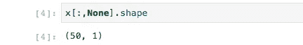
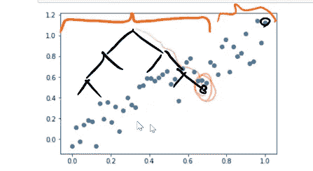

# 机器学习 1：第 6 课

> 原文：[`medium.com/@hiromi_suenaga/machine-learning-1-lesson-6-14bbb8180d49`](https://medium.com/@hiromi_suenaga/machine-learning-1-lesson-6-14bbb8180d49)
>
> 译者：[飞龙](https://github.com/wizardforcel)
> 
> 协议：[CC BY-NC-SA 4.0](http://creativecommons.org/licenses/by-nc-sa/4.0/)


> 来自[*机器学习课程*](http://forums.fast.ai/t/another-treat-early-access-to-intro-to-machine-learning-videos/6826/1)的个人笔记。随着我继续复习课程以“真正”理解它，这些笔记将继续更新和改进。非常感谢 [*Jeremy*](https://twitter.com/jeremyphoward) 和 [*Rachel*](https://twitter.com/math_rachel) 给了我这个学习的机会。

[视频](https://youtu.be/BFIYUvBRTpE) / [幻灯片](https://github.com/fastai/fastai/blob/master/courses/ml1/ppt/ml_applications.pptx)

我们已经看过很多不同的随机森林解释技术，论坛上有一些问题是这些到底有什么用？它们如何帮助我在 Kaggle 上获得更好的分数，我的答案是“它们不一定会”。因此，我想更多地谈谈为什么我们要做机器学习。这有什么意义？为了回答这个问题，我想向你展示一些非常重要的东西，即人们主要在商业中如何使用机器学习的例子，因为这是你们大多数人在结束后可能会在某家公司工作。我将向你展示机器学习的应用，这些应用要么基于我自己亲身参与的事情，要么是我知道直接在做这些事情的人，因此这些都不是假设的——这些都是人们正在做的实际事情，我有直接或间接的了解。

## 两组应用[[1:26](https://youtu.be/BFIYUvBRTpE?t=1m26s)]

+   水平：在商业中，水平意味着跨不同类型的业务进行的事情。即涉及营销的所有事情。

+   垂直：在企业内部或供应链或流程中进行的某些事情。

## 水平应用

几乎每家公司都必须尝试向其客户销售更多产品，因此进行营销。因此，这些框中的每一个都是人们在营销中使用机器学习的一些示例：


让我们举个例子——流失。流失是指试图预测谁会离开的模型。最近在电信领域做了一些流失建模。我们试图弄清楚这家大型手机公司的哪些客户会离开。这本身并不那么有趣。构建一个高度预测性的模型，说 Jeremy Howard 几乎肯定会在下个月离开，可能并不那么有帮助，因为如果我几乎肯定会在下个月离开，你可能无法做任何事情——为了留住我，成本可能太高。

因此，为了理解我们为什么要进行流失建模，我有一个可能对你有帮助的小框架：[设计出色的数据产品](https://www.oreilly.com/ideas/drivetrain-approach-data-products)。几年前我和几位同事一起写了这篇文章，在其中，我描述了我将机器学习模型转化为赚钱的东西的经验。基本技巧是我称之为**驱动器方法**，这是这四个步骤：


## 定义目标[[3:48](https://youtu.be/BFIYUvBRTpE?t=3m48s)]

将机器学习项目转化为实际有用的起点是知道我试图实现什么，这意味着我试图实现高 ROC 曲线下面积或尝试实现类之间的巨大差异。这可能是我试图销售更多的书，或者我试图减少下个月离开的客户数量，或者我试图更早地检测肺癌。这些都是目标。因此，目标是公司或组织实际想要的东西。没有公司或组织是为了创建更准确的预测模型而存在的。这是有原因的。所以这就是你的目标。显然，这是最重要的事情。如果你不知道你为何建模，那么你不可能做好这项工作。希望人们开始在数据科学领域意识到这一点，但有趣的是，很少有人谈论但同样重要的是下一步，即杠杆。

## 杠杆[[5:04](https://youtu.be/BFIYUvBRTpE?t=5m4s)]

杠杆是组织可以实际采取的行动，以推动目标的实现。所以让我们以流失建模为例。组织可以采取什么杠杆来减少离开的客户数量？他们可以打电话给某人，问：“你满意吗？我们能做些什么？”他们可以在下个月购买价值 20 美元的产品时赠送免费的钢笔或其他物品。你可以给他们提供特别优惠。所以这些就是杠杆。当你作为数据科学家工作时，不断回头思考我们试图实现什么（我们指的是组织），以及我们如何实现它，即我们可以做哪些实际的事情来实现这个目标。因此，构建模型绝对不是杠杆，但它可以帮助你使用杠杆。

## 数据[[7:01](https://youtu.be/BFIYUvBRTpE?t=7m1s)]

接下来的步骤是组织拥有哪些数据可能帮助他们设置杠杆以实现目标。这不是指他们在项目开始时给你的数据。而是从第一原则的角度考虑——好吧，我在一家电信公司工作，他们给了我一些特定的数据，但我肯定他们必须知道他们的客户住在哪里，上个月打了多少电话，打了多少次客服电话等等。所以想一想，如果我们试图决定主动给谁提供特别优惠，那么我们想要弄清楚我们有哪些信息可能帮助我们确定谁会对此做出积极或消极的反应。也许更有趣的是，如果我们正在进行欺诈算法。我们试图弄清楚谁不会支付他们从商店拿出的手机，他们正在进行某种 12 个月的付款计划，然后我们再也没有见到他们。在这种情况下，我们可以获得的数据，数据库中有什么并不重要，重要的是当客户在商店时我们可以获得什么数据。因此，我们通常会受到我们实际可以使用的数据的限制。因此，我们需要知道我试图实现什么目标，这个组织实际上可以具体做些什么来改变结果，以及在做出决定时，他们拥有或可以收集到哪些数据。

## 模型[[8:45](https://youtu.be/BFIYUvBRTpE?t=8m45s)]

然后我把所有这些放在一起的方式是通过一个模型。这不是一个预测模型，而是一个模拟模型。我在这篇论文中给出的一个主要例子是，我花了很多年时间建立的一个模型，即如果一个保险公司改变他们的价格，这将如何影响他们的盈利能力。通常你的模拟模型包含了许多预测模型。比如，我有一个叫做弹性模型的预测模型，它说对于一个特定的客户，如果我们为他们的某个产品收取一个特定的价格，他们会在新业务时和一年后续保的概率是多少。然后还有另一个预测模型，即他们会提出索赔的概率以及索赔金额是多少。然后你可以将这些模型结合起来，然后说好，如果我们将我们的定价降低 10%适用于 18 到 25 岁的所有人，然后我们可以通过这些模型运行，将它们结合成一个模拟，那么我们在 10 年后的市场份额的整体影响是 X，我们的成本是 Y，我们的利润是 Z 等等。

实际上，大多数时候，你真的更关心那个模拟的结果，而不是直接关心预测模型。但大多数人目前并没有有效地做到这一点。例如，当我去亚马逊时，我读了道格拉斯·亚当斯的所有书，所以在我读完所有道格拉斯·亚当斯的书之后，下次我去亚马逊，他们说你想买道格拉斯·亚当斯的全部作品吗。这是在我已经买了他的每一本书之后。从机器学习的角度来看，一些数据科学家可能会说，购买道格拉斯·亚当斯的一本书的人通常会继续购买他的全部作品。但向我推荐购买道格拉斯·亚当斯的全部作品并不明智。这实际上在很多方面都不明智。不仅是因为我不太可能购买一个我已经有每一本书的合集，而且这也不会改变我的购买行为。我已经了解道格拉斯·亚当斯，我已经知道我喜欢他，所以占用你宝贵的网页空间来告诉我，嘿，也许你应该购买更多你已经熟悉并多次购买的作者的作品实际上不会改变我的行为。那么，如果亚马逊不是创建一个预测模型，而是建立一个能够模拟的优化模型，然后说如果我们向杰里米展示这个广告，他会有多大可能继续购买这本书，如果我不向他展示这个广告，他会有多大可能继续购买这本书。这就是对立事实。对立事实是否则会发生什么，然后你可以计算差异，然后说我们应该推荐他什么才能最大程度地改变他的行为。所以最大程度地导致更多的书籍，所以你可能会说，哦，他从来没有买过特里·普拉切特的书，他可能不了解特里·普拉切特，但很多喜欢道格拉斯·亚当斯的人确实喜欢特里·普拉切特，所以让我们向他介绍一个新的作者。

因此，一方面是预测模型，另一方面是优化模型之间的区别。所以这两者往往是相辅相成的。首先，我们有一个模拟模型。模拟模型是在说，如果我们把特里·普拉切特的书放在亚马逊的首页上给杰里米·霍华德看，会发生什么。他有 94%的概率会购买。这告诉我们，通过这个杠杆，我今天应该在杰里米的首页上放什么，我们说好，把特里·普拉切特放在首页上的不同设置会产生最高的模拟结果。然后这就是最大化我们从杰里米今天访问亚马逊网站中的利润的事情。

一般来说，你的预测模型会输入到这个模拟模型中，但你必须考虑它们如何共同工作。例如，让我们回到流失问题。结果表明，Jeremy Howard 很可能会在下个月离开他的手机公司。我们该怎么办？让我们给他打电话。我可以告诉你，如果我的手机公司现在给我打电话说“只是打电话告诉你我们爱你”，我会立刻取消。那将是一个糟糕的主意。因此，你会想要一个模拟模型，来说 Jeremy 现在接到电话后改变行为的概率是多少。所以我有一个杠杆是给他打电话。另一方面，如果明天我收到一封信，说每个月你和我们在一起，我们会给你十万美元。那肯定会改变我的行为，对吧？但是将这个输入到模拟模型中，结果是这将是一个不盈利的选择。你看到这是如何相互配合的吗？

所以当我们看流失这样的问题时，我们要考虑我们可以拉动的杠杆是什么。我们可以用什么样的数据构建什么样的模型来帮助我们更好地拉动这些杠杆以实现我们的目标。当你这样思考时，你会意识到这些应用的绝大部分实际上并不是关于预测模型。它们是关于解释的。它们是关于理解“如果发生了什么”。因此，我们可以实际使用我们的随机森林特征重要性告诉我们我们实际上可以做些什么来产生影响。然后我们可以使用部分依赖来构建这种模拟模型，来说如果我们改变了那个，会发生什么。

所以有很多例子，当你思考你正在处理的机器学习问题时，我希望你考虑为什么有人会关心这个问题。对他们来说一个好的答案是什么样的，你如何实际上对这个业务产生积极影响。所以如果你在创建一个 Kaggle 内核，试着从竞赛组织者的角度思考。他们想知道什么，你如何给他们这些信息。另一方面，像欺诈检测，你可能只是想知道谁是欺诈的。所以你可能只关心预测模型。但是你必须仔细考虑这里的数据可用性。所以好吧，我们需要知道在我们即将向他们交付产品时谁是欺诈的。例如，查看一个月后可用的数据是没有意义的。所以你必须考虑你正在工作的实际运营约束。

## 人力资源应用。

在人力资源领域有很多有趣的应用，比如员工流失，这是另一种流失模型，其中发现杰里米·霍华德已经厌倦了讲课，他明天就要离开了。你会怎么做？知道这个事实实际上并不会有帮助。那将会太迟了。你实际上想要一个模型，告诉你什么样的人会离开 USF，结果发现每个去楼下咖啡厅的人都会离开 USF。我猜他们的食物很糟糕或者其他什么原因。或者我们支付不到 50 万美元一年的人都会离开 USF，因为他们无法负担旧金山的基本住房。因此，你可以使用员工流失模型，不是为了知道哪些员工讨厌我们，而是为什么员工离开。再次强调，真正重要的是解释。

**问题**：对于流失模型，听起来你需要预测两个预测因子——一个是流失，另一个是你需要优化你的利润。那么它是如何工作的[[18:30](https://youtu.be/BFIYUvBRTpE?t=18m30s)]？是的，确切地说，这就是模拟模型的全部内容。你找出我们试图最大化的目标，即公司的盈利能力。你可以创建一个相当简单的 Excel 模型或其他模型，它说这是收入，这是成本，成本等于我们雇佣的人数乘以他们的工资等。在这个 Excel 模型中，有一些单元格/输入是随机的或不确定的。但我们可以用模型来预测，这就是我要做的，我要说好，我们需要一个预测模型，来预测如果我们改变他们的工资，某人留下的可能性有多大，如果我现在增加他们的工资，明年他们离开的可能性有多大等。因此，你需要一堆不同的模型，然后你可以用简单的商业逻辑将它们绑定在一起，然后进行优化。然后你可以说，如果我给杰里米·霍华德 50 万美元，那可能是一个非常好的主意，如果我付给他更少，那可能就不是了，或者其他什么。你可以找出整体影响。所以我真的很惊讶，为什么这么少的人这样做。但大多数行业中的人用 AUC 或 RMSE 等来衡量他们的模型，这实际上并不是你真正想要的。

## 更多水平应用...[[22:04](https://youtu.be/BFIYUvBRTpE?t=22m4s)]

潜在客户优先级是一个非常有趣的领域。我展示的每一个方框，通常都可以找到一家或多家公司，他们的唯一工作就是构建该领域的模型。因此，有很多公司销售潜在客户优先级系统，但问题是我们如何利用这些信息。如果我们的最佳潜在客户是杰里米，他是最有可能购买的人。这意味着我应该派一个销售人员去找杰里米，还是不应该？如果他很有可能购买，为什么我要浪费时间呢。因此，你真的需要一种模拟，来告诉你如果我派出最好的销售人员去鼓励他签约，杰里米的行为可能会发生什么变化。我认为今天世界上有很多机会让数据科学家不仅仅局限于预测建模，而是将所有内容整合在一起。

## 垂直应用[[23:29](https://youtu.be/BFIYUvBRTpE?t=23m29s)]

除了这些基本适用于每家公司的横向应用之外，还有许多应用程序是针对世界各地的每个部分特定的。对于那些最终进入医疗保健领域的人，你们中的一些人将成为这些领域的专家之一。比如再入院风险。那么这位患者再次入院的概率是多少呢？根据司法管辖区的细节，当有人再次入院时，这可能对医院造成灾难。如果你发现这位患者有高再入院的可能性，你会怎么做？再次，预测模型本身是有帮助的。它更多地暗示我们不应该立即让他们回家，因为他们会再次入院。但如果我们有树解释器，并且它告诉我们，他们高风险的原因是因为我们没有最近的心电图。没有最近的心电图，我们就无法对他们的心脏健康有高度的信心。在这种情况下，我们不会说让他们在医院呆两周，而是让他们做一个心电图。因此，这是解释和预测准确性之间的互动。

问题：所以我理解你的意思是，预测模型确实很棒，但为了真正回答这些问题，我们确实需要专注于这些模型的可解释性？是的，我想是这样。更具体地说，我正在说我们刚刚学习了一整套随机森林解释技术，所以我正在试图证明为什么。原因是因为我会说大多数时候解释是我们关心的事情。你可以创建一个图表或表格而不需要机器学习，实际上这就是大多数世界的工作方式。大多数经理们在没有任何机器学习的情况下构建各种表格和图表。但他们经常做出糟糕的决定，因为他们不知道他们感兴趣的目标的特征重要性，所以他们创建的表格实际上是那些最不重要的东西。或者他们只是做一个单变量图表，而不是一个部分依赖图，所以他们实际上没有意识到他们认为自己在看的关系完全是由其他因素造成的。所以我在争论数据科学家应该更深入地参与战略，并尝试使用机器学习来真正帮助企业实现所有目标。有一些公司像 dunnhumby 这样的公司，他们什么都不做，只做零售应用的机器学习。我相信有一种 dunnhumby 产品可以帮助你弄清楚，如果我把我的新店放在这个位置而不是那个位置，有多少人会在那里购物。或者如果我把尿布放在商店的这个部分而不是那个部分，这将如何影响购买行为等等。因此，也很重要意识到，在技术媒体或其他地方你经常听到的机器学习应用的子集是这种极其偏见的微小子集，谷歌和 Facebook 做的就是这种。而实际上让世界运转的绝大部分应用是这些实际上帮助人们制造东西、购买东西、销售东西、建造东西等等的应用。

**问题**：关于树的解释，我们看了哪个特征对于特定观察结果更重要。对于企业来说，他们有大量数据，他们希望对很多观察结果进行这种解释，那么他们如何自动化呢？他们设置阈值吗[[27:50](https://youtu.be/BFIYUvBRTpE?t=27m50s)]？绝大多数机器学习模型并不自动化任何东西。它们被设计为向人类提供信息。所以例如，如果你是一个保险公司的客服电话操作员，你的客户问你为什么我的续保费比上次贵了 500 美元，那么希望保险公司在你的终端提供那些显示树解释结果的小屏幕。这样你就可以跳过去告诉客户，去年你住在一个车辆被盗率较低的邮政编码区，而今年你还把车换成了更贵的车。所以这并不是关于阈值和自动化，而是关于让这些模型输出对组织中的决策者可用，无论是在顶层战略层面，比如我们是否要关闭整个产品，还是在操作层面，比如与客户进行个别讨论。

另一个例子是飞机调度和登机口管理。有很多公司在做这个，基本上是有人在机场，他们的工作是告诉每架飞机去哪个登机口，什么时候关闭舱门等等。所以这个想法是给他们一个软件，里面有他们需要做出良好决策所需的信息。所以机器学习模型最终嵌入在那个软件中，比如说，那架目前从迈阿密飞来的飞机，有 48%的概率会晚 5 分钟以上，如果晚了，那么整个航站楼会受到影响，例如。这就是这些东西是如何结合在一起的。

## 其他应用[[31:02](https://youtu.be/BFIYUvBRTpE?t=31m2s)]


有很多应用，我希望你花一些时间去思考它们。和你的朋友坐下来，谈论一些例子。比如说，我们如何进行制造业的故障分析，谁会做这个，为什么会做这个，他们可能会使用什么样的模型，可能会使用什么样的数据。开始练习并获得感觉。然后当你在工作场所和经理们交谈时，你希望能立即认识到你正在交谈的人——他们想要实现什么，他们有哪些杠杆可以拉动，他们有哪些数据可用来拉动这些杠杆以实现那个目标，因此我们如何构建模型来帮助他们做到这一点，他们可能需要做出什么样的预测。这样你就可以与这些人进行深思熟虑的共情对话，然后说“为了减少离开的客户数量，我猜你正在努力找出应该给谁提供更好的定价”等等。

**问题**：社会科学中人们面临的解释问题是否可以使用机器学习或者已经被使用，或者这并不是真正的领域[[32:29](https://youtu.be/BFIYUvBRTpE?t=32m29s)]？我与社会科学领域的人们进行了很多关于这个问题的讨论，目前机器学习在经济学或心理学等领域并没有得到很好的应用。但我相信它可以，原因正如我们所讨论的那样。因此，如果您要尝试进行某种行为经济学研究，并且试图理解为什么有些人的行为与其他人不同，使用具有特征重要性图的随机森林将是一个很好的开始。更有趣的是，如果您尝试进行某种基于大型社交网络数据集的社会学实验或分析，在那里您进行了一项观察性研究，您真的想要尝试提取所有外生变量的来源（即所有外部发生的事情），因此如果您使用具有随机森林的部分依赖图，这将自动发生。几年前，我在麻省理工学院做了一个关于数字实验的第一次会议的演讲，这次会议真正讨论了我们如何在诸如社交网络等数字环境中进行实验，经济学家们都使用经典的统计检验方法，但在这种情况下，我与之交谈的经济学家们对此非常着迷，他们实际上要求我在麻省理工学院为经济学系的各种教员和研究生们举办一个机器学习入门课程。其中一些人已经写了一些相当有名的书籍，希望这对他们有所帮助。现在还处于早期阶段，但这是一个巨大的机会。但正如 Yannet 所说，仍然存在很多怀疑。这种怀疑主要来自对这种完全不同方法的陌生感。因此，如果您花了 20 年时间研究计量经济学，然后有人过来说这是一种完全不同于计量经济学家所做的所有事情的方法，那么您的第一反应自然会是“证明它”。这是公平的，但我认为随着时间的推移，下一代与机器学习一起成长的人们中，一些人将进入社会科学领域，他们将产生前所未有的巨大影响，人们将开始感到惊讶。就像计算机视觉中发生的一样。当计算机视觉花了很长时间的人们说“也许你应该使用深度学习来进行计算机视觉”，而计算机视觉领域的每个人都说“证明它。我们在计算机视觉中有几十年的工作，开发了令人惊叹的特征检测器。”然后在 2012 年，辛顿和克里赞斯基出现了，他们说“我们的模型比你们的好两倍，而我们刚刚开始” ，每个人都被说服了。如今，几乎每个计算机视觉研究人员基本上都使用深度学习。因此，我认为在这个领域也会出现这样的时刻。

# 随机森林解释方法[[37:17](https://youtu.be/BFIYUvBRTpE?t=37m17s)]

在谈论它们为什么重要之后，让我们现在提醒自己它们是什么。

## **基于树方差的置信度**

这告诉我们什么？为什么我们对此感兴趣？它是如何计算的？

树的预测方差。通常预测只是平均值，这是树的方差。

在这里填充一个细节，我们通常只取一行/观察结果，然后找出我们对此有多自信（即树中有多少方差）或者我们可以像我们在这里做的那样为不同的组找出答案[[39:34](https://youtu.be/BFIYUvBRTpE?t=39m34s)]。


我们在这里所做的是看是否有任何我们非常不确定的组（这可能是由于观察很少）。我认为更重要的是当你在操作中使用这个时。比如说你正在做一个信用决策算法。所以我们正在确定 Jeremy 是一个好风险还是一个坏风险。我们应该借给他一百万美元吗。随机森林说“我认为他是一个好风险，但我一点也不自信。” 在这种情况下，我们可能会说好吧，也许我不应该给他一百万美元。而在另一种情况下，如果随机森林说“我认为他是一个好风险，而且我非常确定”，那么我们就更愿意给他一百万美元。而且我是一个非常好的风险。所以请随意给我一百万美元。我之前检查过随机森林——在另一个笔记本中。不在 repo 里 😆

对于我来说，很难给你们直接的经验，因为这种单个观察解释实际上是你需要把它放到前线的那种东西。这不是你在 Kaggle 上可以真正使用的东西，而更像是如果你实际上在发布一些可能会花费很多钱的大决策的算法，你可能不太关心随机森林的平均预测，而更可能是你实际上关心平均值减去几个标准差（即最坏情况的预测）。也许有一个我们不确定的整个组，所以这是基于树方差的置信度。

## 特征重要性 [[42:36](https://youtu.be/BFIYUvBRTpE?t=42m36s)]

学生: 基本上是为了找出哪些特征是重要的。你取每个特征，洗牌特征中的值，然后检查预测如何变化。如果非常不同，那意味着该特征实际上很重要；否则就不那么重要。

Jeremy: 那太棒了。一切都是完全正确的。有一些细节被略过了一点。还有其他人想要详细描述一下它是如何计算的吗？我们如何准确计算特定特征的重要性？

学生: 在构建随机森林模型后，你取每一列并随机洗牌它。然后运行一个预测并检查验证分数。如果在洗牌其中一列后变糟了，那意味着那列很重要，所以它具有更高的重要性。我不太确定我们如何量化特征的重要性。

Jeremy: 好的，很好。你知道我们如何量化特征的重要性吗？那是一个很好的描述。为了量化，我们可以计算 R²或某种得分的差异。所以假设我们有我们的因变量是价格，还有一堆独立变量，包括制造年份。我们使用所有这些来构建一个随机森林，这给我们我们的预测。然后我们可以比较得到 R²、RMSE，或者你对模型感兴趣的任何东西。


现在关键的是我不想重新训练整个随机森林。那太慢又无聊了，所以使用现有的随机森林。我如何找出年份的重要性呢？建议是，让我们随机洗牌整个列。现在那一列完全没用了。它的均值、分布都是一样的。关于它的一切都是一样的，但实际年份制造和现在那一列之间根本没有联系。我已经随机洗牌了。所以现在我把这个新版本放到同一个随机森林中（所以没有重新训练），得到一些新的ŷ（ym）。然后我可以将其与实际值进行比较，得到 RMSE（ym）。所以现在我可以开始创建一个小表，我有原始 RMSE（例如为 3），年份制造混乱的 RMSE 为 2。围栏混乱的 RMSE 为 2.5。然后我只需要取这些差值。对于年份制造，重要性为 1，围栏为 0.5，等等。在我洗牌了那个变量之后，我的模型变得更糟了多少。


问题：所有的重要性加起来会等于一吗？老实说，我从来没有看过单位是什么，所以我不太确定。如果有人感兴趣，我们可以在这周内查看一下。看一下 sklearn 的代码，看看这些度量单位到底是什么，因为我从来没有费心去检查。虽然我不会专门检查度量单位，但我会检查相对重要性。这里有一个例子。


所以，与其只说前十名，昨天一个实习生问我一个特征重要性的问题，他们说“哦，我认为这三个很重要”，我指出排名第一的比第二个重要一千倍。所以看看这里的相对数字。所以在这种情况下，就像“不要看前三名，看那个重要一千倍的，忽略其他所有的。”你的自然倾向是想要准确和小心，但这就是你需要覆盖的地方，要非常实际。这个东西重要一千倍。不要花时间在其他任何事情上。然后你可以去和你的项目经理谈谈，告诉他这个东西重要一千倍。然后他们可能会说“哦，那是个错误。它不应该在那里。我们实际上在决策时没有那个信息，或者由于某种原因我们实际上不能使用那个变量。”那么你可以移除它并查看。或者他们可能会说“天哪，我完全不知道那比其他所有东西加起来都重要得多。所以让我们忘掉这个随机森林的东西，专注于理解如何更好地收集那个变量并更好地使用那个变量。”这是一个经常出现的情况，实际上昨天刚刚发生了另一个地方。另一个实习生问我“我正在做这个医学诊断项目，我的 R²是 0.95，这是一个据说很难诊断的疾病。这是随机森林天才还是出了什么问题？”我说记住，建立随机森林之后你要做的第二件事是进行特征重要性分析，所以进行特征重要性分析，你可能会发现排名第一的列是不应该在那里的。这就是发生的事情。他半小时后回到我这里，他说“是的，我做了特征重要性分析，你是对的。排名第一的列基本上是另一个对因变量的编码。我把它移除了，现在我的 R²是-0.1，这是一个改进。”

我喜欢看的另一件事是这个图表：


基本上它说的是在哪些方面趋于平缓，我应该真正关注哪些方面。这是最重要的。当我在电信行业进行信用评分时，我发现有九个变量基本上可以准确预测谁最终会支付他们的电话费，谁不会。除了最终得到一个每年节省三十亿美元欺诈和信用成本的模型外，它还让他们基本上重新调整了他们的流程，以便更好地收集这九个变量。

## 部分依赖 [[50:46](https://youtu.be/BFIYUvBRTpE?t=50m46s)]

这是一个有趣的问题。非常重要，但在某种程度上有点难以理解。


让我们稍后再来看如何计算这个问题，但首先要意识到的是，绝大多数情况下，当有人向您展示一个图表时，它将是一个单变量图表，只会从数据库中获取数据，然后绘制 X 与 Y。然后管理人员往往希望做出决策。所以可能会是“哦，这里有一个下降，所以我们应该停止处理 1990 年至 1995 年之间制造的设备”。这是一个大问题，因为现实世界的数据中有很多这样的相互作用。也许在那些东西被出售的时候正值经济衰退，或者也许在那个时候，人们更多地购买了不同类型的设备。因此，通常我们实际上想知道的是，在其他所有条件相等的情况下，YearMade 和 SalePrice 之间的关系。因为如果您考虑到驱动器方法的杠杆思想，您真的希望一个模型说如果我改变这个杠杆，它将如何改变我的目标。通过使用部分依赖来分开它们，您可以说实际上这是 YearMade 和 SalePrice 之间的关系，在其他所有条件相等的情况下：


那么我们如何计算呢？

学生：例如，对于变量 YearMade，您保持所有其他变量不变。然后，您将传递 YearMade 的每个值，然后训练模型。因此，对于每个模型，您将有浅蓝色线条，中位数将是黄色线条。

Jeremy：那么让我们尝试绘制出来。通过“保持其他一切不变”，她的意思是将它们保持为数据集中的任何值。就像我们进行特征重要性时一样，我们将保持数据集的其余部分不变。我们将对 YearMade 进行部分依赖图。因此，我们有所有这些其他数据行，我们将保持它们不变。与其随机洗牌 YearMade，我们将用完全相同的东西——1960 来替换每个值。就像以前一样，我们现在将通过我们尚未重新训练或更改的现有随机森林来传递这些数据，以获得一组预测`y1960`。然后我们可以在图表上绘制出来——YearMade 与部分依赖。


现在我们可以为 1961 年、1962 年、1963 年等等做到这一点。我们可以对所有这些平均做到这一点，或者我们可以只对其中一个做到这一点。因此，当我们只对其中一个做到这一点，并且改变它的 YearMade 并将这个单个事物通过我们的模型，这给我们一个这些蓝线中的一个。因此，每一条这些蓝线都是一个单独的行，当我们将其 YearMade 从 1960 年改变到 2008 年。因此，我们可以简单地取所有这些蓝线的中位数，以便平均地说，YearMade 和价格之间的关系是什么，其他所有事物都相等。为什么它有效呢？为什么这个过程告诉我们 YearMade 和价格之间的关系，其他所有事物都相等呢？也许考虑一个非常简化的方法会有帮助。一个非常简化的方法会说什么是平均拍卖？什么是平均销售日期，我们最常见的机器类型是什么？我们主要在哪个地点销售物品？然后我们可以得出一个代表平均拍卖的单行，然后我们可以说，好的，让我们通过随机森林运行这一行，但用 1960 年替换它的 YearMade，然后再用 1961 年再做一次，我们可以在我们的小图表上绘制这些。这将给我们一个 YearMade 和销售价格之间关系的版本，其他所有事物都相等。但是如果拖拉机看起来像那样，而挖掘机看起来像一条平直的线：


然后取平均值会隐藏这些完全不同的关系的事实。因此，我们基本上说，好吧，我们的数据告诉我们我们倾向于销售什么样的东西，我们倾向于向谁销售，以及我们倾向于何时销售，所以让我们利用这一点。然后我们实际上发现，对于每一条蓝线，这里有这些关系的实际例子。因此，我们可以做的是除了绘制中位数之外，我们可以进行聚类分析，找出几种不同的形状。


在这种情况下，它们看起来基本上是同一件事的不同版本，具有不同的斜率，所以我从中得出的主要结论是销售价格与制造年份之间的关系基本上是一条直线。请记住，这是销售价格的对数，因此实际上向我们展示了一个指数。这就是我会引入领域专业知识的地方，比如“好吧，事物随着时间按照一个恒定比率贬值，因此，我会预期较旧的东西制造年份具有这种指数形状。”所以这就是我提到的，我的机器学习项目的开始，我通常尽量避免使用尽可能多的领域专业知识，让数据说话。因此，今天早上我收到的一个问题是“有一个销售 ID 和型号 ID，我应该抛弃它们，对吧？因为它们只是 ID。”不要。不要对数据做任何假设。保留它们，如果它们被证明是非常重要的预测因子，你会想要找出原因。但是，现在我已经完成了我的特征重要性，我已经从那个树状图中提取出了一些东西（即冗余特征），我正在查看部分依赖性，现在我在思考，这种形状是否符合我的预期？因此，更好的做法是，在绘制之前，首先考虑我期望这种形状是什么。因为事后向自己证明，哦，我知道它会看起来像这样，总是很容易。所以你期望什么形状，然后它是那种形状吗？在这种情况下，我会说这是我所期望的。而之前的图表则不符合我的预期。因此，部分依赖性图表真正揭示了潜在的真相。

问题：假设您有 20 个重要特征，您会为每一个特征测量偏依赖性吗？如果有 20 个重要特征，那么我将对所有这些特征进行偏依赖性分析，其中重要意味着它是一个我实际可以控制的杠杆，其大小的幅度与其他十九个特征的差异不大，您知道，基于所有这些因素，这是一个我应该关心的特征，那么我将想要了解它是如何相关的。在我的经验中，拥有这么多在操作和建模角度上都重要的特征是相当不寻常的。

问题：您如何定义重要性？重要意味着它是一个杠杆（即我可以改变的东西），它位于这个尾巴（左侧）的尖端：


或者它可能不是直接的杠杆。也许它像邮政编码一样，我实际上无法告诉我的客户在哪里居住，但我可以将我的新营销注意力集中在不同的邮政编码上。

问题：对于每一对特征组合进行成对洗牌，保持其他所有内容不变，以查看交互作用并比较分数是否有意义？你不会为了偏依赖性而这样做。我认为您的问题实际上是在询问我们是否可以为特征重要性这样做。我认为交互特征重要性是一个非常重要且有趣的问题。但是通过随机洗牌每一对列来做到这一点，如果您有一百列，这听起来计算量很大，可能不可行。所以我要做的是在我们讨论树解释器之后，我将谈论一个有趣但在很大程度上未被探索的方法，这可能会起作用。

## 树解释器

Prince：我认为这更像是特征重要性，但特征重要性是针对完整的随机森林模型，而这个树解释器是针对特定观察的特征重要性。所以让我们说这是关于医院再入院的。如果患者 A 将要再次入院，那么对于该特定患者，哪个特征会产生影响，我们如何改变这种情况。它是从平均预测开始计算，然后看每个特征如何改变该特定患者的行为。

Jeremy：我在微笑，因为这是我很长时间以来听到的最好的技术沟通示例之一，所以思考为什么这么有效是非常有意义的。Prince 所做的是，他尽可能具体地举例说明。人类在理解抽象概念方面要差得多。因此，如果您说“它需要某种特征，然后在该特征的观察中”，而不是医院再入院。因此，我们举了一个具体的例子。他做的另一件非常有效的事情是将类比与我们已经理解的东西联系起来。因此，我们已经理解了数据集中所有行的特征重要性的概念。因此，现在我们将为单个行执行此操作。因此，我真的希望我们从这次经验中学到如何成为有效的技术沟通者。因此，Prince 在使用我们可以利用的所有技巧进行有效的技术沟通方面是一个非常好的榜样。希望您觉得这个解释有用。除了向您展示它是什么样子之外，我没有太多要补充。

使用树解释器，我们挑选出一行：


还记得我们在一开始谈到的置信区间吗（即基于树方差的置信度）？我们说你主要用于一行。所以这也是为一行。就像“为什么这个患者可能会再次入院？”这是我们关于该患者或在这种情况下该拍卖会的所有信息。为什么这个拍卖会这么贵？然后我们调用`ti.predict`，我们得到价格的预测，偏差（即树的根 - 这只是每个人的平均价格，所以这总是一样的），然后是贡献，即这些事情有多重要：


我们计算的方法是说一开始，平均价格是 10。然后我们根据围栏进行分割。对于那些有这个围栏的人，平均价格是 9.5。然后我们根据制造年份小于 1990 进行分割，对于那些有这个制造年份的人，平均价格是 9.7。然后我们根据米数进行分割，对于这个分支，我们得到了 9.4。


然后我们有一个特定的拍卖会，我们通过树传递它。碰巧它走了最顶层的路径。一行只能通过树有一条路径。所以我们最终到了 9.4。然后我们可以创建一个小表格。当我们逐步进行时，我们从顶部开始，我们从 10 开始 - 这是我们的偏差。我们说围栏导致了从 10 变为 9.5（即-0.5）。制造年份将其从 9.5 变为 9.7（即+0.2），然后米数将其从 9.7 降至 9.4（-0.3）。然后如果我们把所有这些加在一起（10-0.5+0.2-0.3），哎呀，那就是预测。


这让我们来到我们的 Excel 电子表格：


上周，我们使用 Excel 进行了这项工作，因为没有一个很好的 Python 库可以制作瀑布图。所以我们看到我们得到了我们的起点这是偏差，然后我们有我们每个贡献，最后我们得到了我们的总数。现在世界变得更美好了，因为 Chris 为我们创建了一个 Python 瀑布图模块，并将其放在 pip 上。所以我们再也不必使用 Excel 了。我想指出，瀑布图至少在我从事业务以来一直在商业沟通中非常重要 - 大约 25 年了。Python 可能已经有几十年的历史了。但尽管如此，Python 世界中没有人真正想到“你知道，我要制作一个瀑布图”，所以直到两天前它们才存在，也就是说这个世界充满了应该存在但不存在的东西。而且并不一定需要花费很多时间来构建。Chris 花了大约 8 个小时，所以数量相当可观但不过分。现在以后，当人们想要 Python 瀑布图时，他们将最终到达 Chris 的 Github 存储库，并希望找到许多其他美国大学的贡献者，他们使其变得更好。

为了帮助改进 Chris 的 Python 瀑布，您需要知道如何做到这一点。因此，您需要提交一个拉取请求。如果您使用一个叫做[hub](https://hub.github.com/)的东西，那么提交拉取请求将变得非常容易。他们建议您将`git`别名为`hub`，因为事实证明，hub 实际上是 git 的一个严格的超集。它让您可以执行`git fork`，`git push`和`git pull-request`，然后您现在已经向 Chris 发送了一个拉取请求。没有 hub，这实际上是一种痛苦，需要像去网站并填写表格之类的事情。因此，这给您没有理由不提交拉取请求。我提到这一点是因为当您面试工作时，我可以向您保证，您正在与之交谈的人将检查您的 github，如果他们看到您有提交经过深思熟虑的拉取请求并被接受到有趣的库，那看起来很棒。这看起来很棒，因为它表明您是一个实际做出贡献的人。它还表明，如果它们被接受，那么您知道如何创建符合人们编码标准、具有适当文档、通过测试和覆盖率等的代码。因此，当人们看着您并说哦，这里是一个有着成功贡献历史的人，接受了开源库的拉取请求，这是您作品集的一个很好的部分。您可以具体引用它。因此，无论是我是构建 Python 瀑布的人，这是我的存储库，还是我是为 Python 瀑布贡献货币数字格式化的人，这是我的拉取请求。每当您在使用任何开源软件时看到某些不正常的东西，这不是问题，而是一个很好的机会，因为您可以修复它并发送拉取请求。所以试一试。第一次有拉取请求被接受时，感觉真的很棒。当然，一个很大的机会是 fastai 库。由于我们的一位学生，我们现在对`fastai.structured`库的大部分文档字符串都有了，这也是通过拉取请求完成的。

有人对如何计算这些随机森林解释方法或为什么我们可能想要使用它们有任何问题吗？在本周末，您将需要能够从头开始构建所有这些。

问题：只是看着树解释器，我注意到一些值是`nan`。我明白为什么要保留它们在树中，但`nan`如何有特征重要性呢？让我把问题传递给你。为什么不呢？换句话说，Pandas 中如何处理`nan`，因此在树中呢？有人记得，注意这些都是分类变量，Pandas 如何处理分类变量中的`nan`，fastai 又是如何处理的？Pandas 将它们设置为-1 类别代码，而 fastai 将所有类别代码加一，因此最终变为零。换句话说，记住，当它到达随机森林时，它只是一个数字，只是零。然后我们将其映射回这里的描述。所以问题实际上是为什么随机森林不能在零上分裂？它只是另一个数字。所以它可以是`nan`，`高`，`中`，`低`= 0，1，2，3。因此，缺失值是通常教得很糟糕的事情之一。通常人们被教导要删除具有缺失值的列或删除具有缺失值的行，或者替换缺失值。这绝不是我们想要的，因为缺失通常是非常非常有趣的。因此，我们实际上从我们的特征重要性中学到，耦合器系统`nan`是最重要的特征之一。出于某种原因，嗯，我可以猜测，对吧？耦合器系统`nan`可能意味着这是一种没有耦合器系统的工业设备。现在我不知道是什么类型，但显然是更昂贵的类型。

我参加了一个为大学拨款研究成功而举办的比赛，迄今为止最重要的预测因素是某些字段是否为空[[1:15:41](https://youtu.be/BFIYUvBRTpE?t=1h15m41s)]。结果表明，这是数据泄漏，这些字段大多数情况下只在研究拨款被接受后填写。所以这让我赢得了那个 Kaggle 比赛，但实际上并没有对大学有太大帮助。

## 外推[[1:16:16](https://youtu.be/BFIYUvBRTpE?t=1h16m16s)]

我要做一些冒险和危险的事情，我们将进行一些现场编码。我们要进行一些现场编码的原因是我想和你一起探索外推，我也想让你感受一下在这个笔记本环境中如何快速编写代码。这是你在现实世界和考试中需要做的事情，快速创建我们将要讨论的代码。

每当我尝试调查某事的行为时，我都非常喜欢创建合成数据集，因为如果我有一个合成数据集，我知道它应该如何表现。

提醒我，我们在做这个之前，我承诺我们会谈论交互重要性，我差点忘了。

## 交互重要性[[1:17:24](https://youtu.be/BFIYUvBRTpE?t=1h17m24s)]

树解释器告诉我们基于树中差异的特定行的贡献。我们可以为数据集中的每一行计算这个值并将它们相加。这将告诉我们特征的重要性。它将以不同的方式告诉我们特征的重要性。评估特征重要性的一种方法是逐个对列进行洗牌。另一种方法是为每一行进行树解释并将它们相加。两种方法都没有更正确的一种。它们实际上都被广泛使用，所以这是一种类型 1 和类型 2 的特征重要性。所以我们可以尝试扩展一下。不仅仅是单变量特征重要性，还有交互特征重要性。现在这里有一点。我要描述的东西很容易描述。当随机森林首次被发明时，Breiman 就描述过这个方法，它也是 Salford 系统商业软件产品的一部分，他们拥有随机森林的商标。但我不知道它是任何开源库的一部分，我从来没有看到过一篇真正研究它的学术论文。所以我要在这里描述的是一个巨大的机会，但也像有很多细节需要完善。但这里是基本思想。

这里的这个特定差异（红色）不仅仅是因为 year made，而是因为 year made 和 enclosure 的组合[[1:19:15](https://youtu.be/BFIYUvBRTpE?t=1h19m15s)]：


这是 9.7 的原因是因为 enclosure 在这个分支中，year made 在这个分支中。换句话说，我们可以说 enclosure 与 year made 的交互作用是-0.3。

那么 9.5 和 9.4 之间的差异呢？那是 year made 和表计上的小时数的交互作用。我在这里使用星号不是表示“乘”，而是表示“与...交互”。这是一种常见的做法，就像 R 的公式也是这样做的。所以 year made 与表计的交互作用贡献了-0.1。


也许我们还可以说从 10 到 9.4，这也显示了仪表和围栏之间的相互作用，中间有一件事。所以我们可以说仪表与围栏的相互作用等于...应该是多少呢？应该是-0.6 吗？有些方式似乎不公平，因为我们还包括了年份的影响。所以也许应该是-0.6，也许我们应该加回这个 0.2（9.5 → 9.7）。这些都是我实际上不知道答案的细节。我们应该如何最好地为这条路径中的每对变量分配贡献？但从概念上来说，我们可以。该路径中的变量对都代表相互作用。

**问题**：为什么你不强制它们在树中相邻[[1:21:47](https://youtu.be/BFIYUvBRTpE?t=1h21m47s)]？我不会说这是错误的方法。但我不认为这是正确的方法。因为在这条路径中，仪表和围栏是相互作用的。所以似乎不承认这种贡献是在丢弃信息。但我不确定。几年前，我在 Kaggle 的员工中有一个实际上对此进行了一些研发，他们确实发现了（我不够接近知道他们如何处理这些细节），但他们做得相当不错。但不幸的是，它从未成为软件产品问世。但也许你们中的一群人可以聚在一起并构建。做一些搜索来检查，但我真的不认为任何开源库中有任何相互作用特征重要性部分。

**问题**：但这样会排除那些在相互作用之前并不重要的变量之间的相互作用吗？所以说，如果你的行永远不选择沿着那条路径分裂，但是那个变量与另一个变量的相互作用成为你最重要的分裂。我不认为会发生这种情况。因为如果有一个相互作用是重要的，只是因为它是一个相互作用（而不是在单变量基础上），它有时会出现，假设你将最大特征设置为小于一，因此它会出现在某些路径中。

**问题**：相互作用是什么意思？是乘法、比率、加法吗？相互作用意味着出现在树的同一路径上。在上面的例子中，由于我们在围栏上分支，然后在年份上分支，所以围栏和年份之间存在相互作用。因此，要达到 9.7，我们必须有某个特定的围栏值和某个特定的年份值。

**问题**：如果你走在你试图观察的两件事之间的中间叶子上，你也会考虑最终的度量是什么吗？我的意思是，如果我们向下延伸树，你会有很多度量，既包括你试图观察的两件事，也包括中间步骤。似乎有一种方法可以在它们之间平均信息吗？也许有。我认为我们应该在论坛上讨论这个。我觉得这很有趣，希望我们能构建出一些伟大的东西，但我需要进行现场编码。这是一个很好的讨论。继续思考并进行一些实验。

## 回到现场编码。

因此，为了尝试这个，你几乎肯定想先创建一个合成数据集。就像 `y = x1 + x2 + x1*x2` 或者其他什么。有一些你知道存在交互效应，有一些你知道不存在交互效应，你想确保最终得到的特征重要性是你期望的。

所以可能第一步是使用树解释器风格的单变量特征重要性。这种方法的一个好处是，你拥有多少数据并不重要。你只需要遍历树来计算特征重要性。所以你应该能够以一种相当快速的方式编写代码，所以即使只用纯 Python 编写，也可能足够快，这取决于你的树的大小。

我们将讨论外推和我想要做的第一件事是创建一个具有简单线性关系的合成数据集。我们将假装它就像一个时间序列。所以我们需要创建一些 x 值。创建这种类型的合成数据的最简单方法是使用`linspace`，它默认创建 50 个观测值在开始和结束之间均匀分布的数据。


然后我们将创建一个因变量，所以让我们假设 x 和 y 之间存在线性关系，并且让我们添加一点随机性。在低和高之间使用`random.uniform`，所以我们可以添加-0.2 到 0.2 之间的某个值，例如。


接下来我们需要一个形状，基本上就是你想要这些随机数的维度是什么，显然我们希望它们与`x`的形状相同。所以我们可以直接说`x.shape`。


换句话说，`(50,)`是`x.shape`。记住，当你看到括号里有逗号的时候，那就是一个只有一个元素的元组。所以这是形状为 50，我们添加了 50 个随机数。现在我们可以绘制这些数值。


好的，这就是我们的数据。当你作为数据科学家工作或在这门课程中做考试时，你需要能够快速地创建一个类似的数据集，将其绘制在图表中而不用考虑太多。正如你所看到的，你不必真的记住太多东西。你只需要知道如何按`shift + tab`来检查参数的名称，搜索一下，或者尝试找到`linspace`如果你忘记了它的名字。

所以让我们假设这是我们的数据。我们现在要构建一个随机森林模型，我想要构建一个随机森林模型，让它像一个时间序列一样运行。所以我将左边部分作为训练集。然后将右边部分作为我们的验证或测试集，就像我们在购物或推土机中所做的那样。


我们可以使用与我们在`split_vals`中使用的完全相同的代码。所以我们可以说： 

```py
x_trn, x_val = x[:40], x[40:]
```

这将数据分为前 40 个和后 10 个。我们可以对 y 做同样的操作。

```py
y_trn, y_val = y[:40], y[40:]
```

接下来要做的是创建一个随机森林并拟合它，这需要 x 和 y。

```py
m = RandomForestRegressor().fit(x, y)
```

这实际上会导致错误，原因是它期望 x 是一个矩阵，而不是一个向量，因为它期望 x 有多列数据。

> 重要的是要知道，只有一列的矩阵和向量不是同一回事。

所以如果我尝试运行这个代码，“预期 2D 数组，实际得到 1D 数组”：


所以我们需要将一维数组转换为二维数组。记住我说过`x.shape`是`(50,)`。所以`x`有一个轴，x 的秩是 1。变量的秩等于它的形状的长度 - 它有多少个轴。我们可以将向量看作是秩为 1 的数组，将矩阵看作是秩为 2 的数组。我很少使用向量和矩阵这样的词，因为它们有点毫无意义 - 它们只是更一般的东西的具体例子，它们都是 N 维张量或 N 维数组。所以 N 维数组可以说是秩为 N 的张量。它们基本上意味着相同的事情。物理学家听到这个会很疯狂，因为对于物理学家来说，张量有一个非常具体的含义，但在机器学习中，我们通常以相同的方式使用它。

那么我们如何将一维数组转换为二维数组。我们可以这样做的方法有几种，但基本上我们是切片。冒号（`:`）表示给我在那个轴上的所有东西。`:, None`表示给我第一个轴上的所有东西（这是我们唯一拥有的轴），然后`None`是一个特殊的索引器，表示在这里添加一个单位轴。所以让我给你看看。 



它的形状是(50, 1)，所以它是秩为 2 的。它有两个轴。其中一个是一个非常无聊的轴 - 它是一个长度为一的轴。所以让我们将`None`移到左边。这是(1, 50)。然后提醒你，原始的是(50,)。


所以你可以看到我可以将`None`作为一个特殊的索引器放在那里引入一个新的单位轴。`x[None, :]`有一行和五十列。`x[:, None]`有五十行和一列 - 这就是我们想要的。在这门课程和深度学习课程中，这种对秩和维度的玩耍将变得越来越重要。所以花很多时间用 None 切片，用其他东西切片，尝试创建三维、四维张量等。我会向你展示两个技巧。

第一个是你永远不需要写`,:`，因为它总是被假定的。所以这些是完全相同的：


你会在代码中一直看到这样的写法，所以你需要认识到它。

第二个技巧是`x[:, None]`是在第二维度（或我猜是索引 1 维度）添加一个轴。如果我总是想把它放在最后一个维度怎么办？通常我们的张量在我们不注意的情况下改变维度，因为你从一个单通道图像变成了一个三通道图像，或者你从一个单个图像变成了一个图像的小批量。突然之间，新的维度出现了。所以为了让事情更一般化，我会说`...`，这意味着你需要多少维度来填充这个。所以在这种情况下（`x[…, None].shape`），它是完全相同的，但我总是尝试以这种方式写，因为这意味着当我得到更高维度的张量时，它将继续工作。

所以在这种情况下，我想要 50 行和一列，所以我会称之为 x1。现在让我们在这里使用它，这样就是一个二维数组，所以我可以创建我的随机森林。


然后我可以绘制出来，这就是你需要打开大脑的地方，因为今天早上的人们非常快地理解了这一点，这是非常令人印象深刻的。我将绘制`y_trn`与`m.predict(x_trn)`。在我开始之前，这会是什么样子？它应该基本上是一样的。我们的预测希望与实际相同。所以这应该落在一条线上，但有一些随机性，所以不会完全相同。


那是容易的。现在让我们做困难的，有趣的那个。那会是什么样子？


想想树的作用，想想右边有一个验证集，左边有一个训练集：


所以想想森林只是一堆树。

Tim: 我猜测由于所有新数据实际上都在原始范围之外，所以它们基本上都是一样的 - 就像一个巨大的群体。

Jeremy: 是的，对。所以忘掉森林，让我们创建一棵树。所以我们可能首先在这里分裂，然后在这里分裂，... 所以我们的最终分裂是最右边的节点。当我们从验证集中取一个时，它会将其通过森林，最终预测最右边的平均值。它无法预测比那更高的任何东西，因为没有更高的东西可以平均。



因此，要意识到随机森林并不是魔法。它只是返回附近观察值的平均值，其中附近在这种“树空间”中。所以让我们运行它，看看 Tim 是不是对的。


天啊，太糟糕了。如果你不知道随机森林是如何工作的，那么这将完全搞砸你。如果你认为它实际上能够对任何它以前没有见过的数据进行外推，尤其是未来的时间段，那就错了。它只是无法做到。它只是对它已经看到的东西进行平均。这就是它能做的全部。

好的，我们将讨论如何避免这个问题。在上一课中，我们稍微谈到通过避免不必要的时间相关变量来避免这个问题。但最终，如果你真的有一个看起来像这样的时间序列，我们实际上必须处理一个问题。我们可以处理这个问题的一种方法是使用神经网络。使用一些实际上具有可以拟合这样的函数或形状的东西，这样它将可以很好地外推：


另一种方法是使用你们在早上课上学到的所有时间序列技术来拟合某种时间序列，然后去趋势化。然后你会得到去趋势化的点，然后使用随机森林来预测这些点。这特别酷，因为想象一下你的随机森林实际上试图预测两种不同状态的数据。所以蓝色的在下面，红色的在上面。


如果你尝试使用随机森林，它将做得相当糟糕，因为时间看起来更加重要。所以它基本上仍然会像这样分裂，然后像那样分裂，最终一旦到达左下角，它会像“哦，好吧，现在我可以看到两种状态之间的差异了。”


换句话说，当你有这么大的时间序列时，直到每棵树都处理时间，你才能看到随机森林中的其他关系。因此，解决这个问题的一种方法是使用梯度提升机（GBM）。GBM 的作用是创建一棵小树，然后通过第一棵小树运行所有内容（可能是时间树），然后计算残差，下一棵小树只是预测残差。所以这有点像去趋势化，对吧？GBM 仍然无法对未来进行外推，但至少它们可以更方便地处理时间相关数据。

在接下来的几周里，我们将更多地讨论这个问题，最终的解决方案将是使用神经网络。但是现在，使用某种时间序列分析，去趋势化，然后在随机森林上使用它并不是一种坏技术。如果你在玩类似厄瓜多尔杂货竞赛之类的东西，那将是一个非常好的东西来尝试。
