# 机器学习 1：第 7 课

> 原文链接：[`medium.com/@hiromi_suenaga/machine-learning-1-lesson-7-69c50bc5e9af`](https://medium.com/@hiromi_suenaga/machine-learning-1-lesson-7-69c50bc5e9af)

*来自* [*机器学习课程*](http://forums.fast.ai/t/another-treat-early-access-to-intro-to-machine-learning-videos/6826/1)* 的个人笔记。随着我继续复习课程以“真正”理解它，这些笔记将继续更新和改进。非常感谢* [*Jeremy*](https://twitter.com/jeremyphoward) *和* [*Rachel*](https://twitter.com/math_rachel) *给了我这个学习的机会。*

[视频](https://youtu.be/O5F9vR2CNYI)

我们将完成从头开始构建我们自己的随机森林！但在此之前，我想解决一些在这一周中出现的问题。

## 随机森林在一般情况下的位置

我们大约花了一半的课程时间来讲解随机森林，然后在今天之后，这门课程的第二半将广义地讲解神经网络。这是因为这两者代表了覆盖几乎所有你可能需要做的技术的两个关键类别。随机森林属于决策树集成技术类别，与梯度提升机是另一种关键类型，还有一些变体，比如极端随机树。它们的好处是它们非常易解释，可扩展，灵活，适用于大多数类型的数据。它们的缺点是它们完全不会对超出你所见范围的数据进行外推，就像我们在上周课程结束时看到的那样。但它们是一个很好的起点。我认为有很多机器学习工具的目录，很多课程和书籍并没有试图筛选出来，说对于这些问题，使用这个，对于那些问题，使用那个，完了。但它们更像是这里有 100 种不同算法的描述，而你根本不需要它们。比如，我不明白为什么今天你会使用支持向量机。我想不出任何理由去做那样的事情。人们在 90 年代喜欢研究它们，因为它们在理论上非常优雅，你可以写很多关于支持向量机的数学，人们确实这样做了，但实际上我认为它们没有任何用武之地。

在详尽的列表中，有很多技术可以包括在人们采用机器学习问题的每一种方式中，但我更愿意告诉你如何实际解决机器学习问题。我们即将结束今天的第一堂课，这是一种决策树集成的一种类型，在第二部分，Yanett 将告诉你另一种关键类型，即梯度提升，我们即将启动下一课程，介绍神经网络，其中包括各种广义线性模型（GLM）、岭回归、弹性网络套索、逻辑回归等都是神经网络的变体。

有趣的是，创造随机森林的 Leo Breiman 在他的晚年才做出了这一成就，不幸的是，他在之后不久就去世了。因此，关于随机森林的学术文献很少，部分原因是因为在那个时候支持向量机（SVM）开始流行，其他人没有关注它们。另一个原因是随机森林在理论层面上相当难以理解（在理论上分析它们），很难撰写关于它们的会议论文或学术论文。因此，关于它们的研究并不多。但近年来出现了一股新的经验机器学习浪潮，关注的是什么实际上有效。Kaggle 是其中的一部分，但也有像亚马逊和谷歌这样的公司利用机器学习赚取大量利润。因此，如今很多人都在写关于决策树集成的文章，并为决策树集成创建更好的软件，如 GBM 和 xgboost，以及 R 的 ranger 和 scikit-learn 等等。但很多这方面的工作是在工业界而不是学术界进行的，但这是令人鼓舞的。当然，目前在学术界进行的深度学习工作比决策树集成要多，但两者都在取得很大进展。如果看看今天用于决策树集成的软件包，排名前五或六名的最好的软件包，我不确定其中有哪个在五年前真的存在，也许除了 sklearn 之外，甚至三年前也没有。这是一个好的现象。但我认为还有很多工作要做。比如，上周我们讨论了找出哪些交互作用最重要的问题。你们中一些人在论坛中指出，实际上已经有一个梯度提升机的项目，这很棒，但似乎还没有类似的项目用于随机森林。随机森林相比 GBM 有一个很好的优势，那就是它们更难出错，更容易扩展。因此，希望这个社区可以帮助解决这个问题。

## 您的验证集大小 [[5:42](https://youtu.be/O5F9vR2CNYI?t=5m42s)]

另一个我在这周期间遇到的问题是关于验证集的大小。它应该有多大呢？所以要回答这个关于验证集需要多大的问题，你首先需要回答这个算法的准确度我需要知道多精确。如果你的验证集显示这是 70%的准确率，如果有人问说，那是 75%还是 65%还是 70%，答案是“我不知道，这个范围内的任何值都足够接近”，那就是一个答案。另一方面，如果是 70%还是 70.01%还是 69.99%呢？那又是另一回事了。所以你需要先问自己，我需要多准确。

例如，在深度学习课程中，我们一直在研究狗和猫的图像，我们所研究的模型在验证集上的准确率大约为 99.4%，99.5%。验证集的大小为 2000。实际上，让我们在 Excel 中做这个，这会更容易一些。因此，错误的数量大约是`(1 - 准确率) * n`。

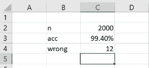

所以我们大约有 12 只错误。我们拥有的猫的数量是一半，所以错误的猫的数量大约是 6 只。然后我们运行了一个新模型，发现准确率提高到了 99.2%。然后就像，好吧，这个模型在找猫方面是否不太好？嗯，它多找错了 2 只猫，所以可能不是。这重要吗？99.4 和 99.2 有关系吗？如果不是关于猫和狗，而是关于发现欺诈，那么 0.6%的错误率和 0.8%的错误率之间的差异就相当于欺诈成本的 25%，这可能是巨大的。

今年早些时候，ImageNet 发布时真的很有趣，新的竞赛结果出来了，错误率从 3%降到了 2%，我看到很多人在互联网上，一些著名的机器学习研究人员都觉得，一些中国人把准确率从 97%提高到了 98% —— 这在统计上甚至不重要，谁在乎呢。但实际上我觉得哇塞，这支中国团队刚刚超越了最先进的图像识别技术，旧技术的准确率比新技术低了 50%。这才是正确的思考方式，不是吗。因为我们试图识别哪些西红柿是成熟的，哪些不是，而旧方法，有 50%的时间多让进了未成熟的西红柿，或者说有 50%的时间，我们接受了欺诈性的客户。这是一个非常大的差异。所以仅仅因为这个特定的验证集，我们看不出 6 和 8 的区别，并不意味着 0.2%的差异不重要。它可能很重要。所以我的经验法则是，你实际上看了多少观察值，我希望这个数字通常要高于 22。为什么是 22？因为 22 是 t-分布大致变成正态分布的魔法数字。所以你可能已经学过，t-分布是小数据集的正态分布。换句话说，一旦我们有了 22 个或更多的东西，它开始在两个意义上表现得有点正常，就像它更加稳定，你可以更好地理解它。所以当有人问我是否有足够的东西时，我通常会说你是否有 22 个感兴趣的事物的观察值。所以如果你在研究肺癌，你有一个数据集，其中有一千个没有肺癌的人和 20 个患有肺癌的人，我会说我非常怀疑我们会取得多少进展，因为我们甚至没有得到你想要的 20 个东西。同样适用于验证集。如果你没有你想要的 20 个东西，那很可能是没有用的，或者说不符合我们需要的准确度水平。这不是加减 20，只是我在考虑时会有点小心。

问题：所以清楚一点，你想要每组样本的数量是 22，就像在验证集、测试集和训练集中一样吗？所以我的意思是，如果任何一组中某个类别的样本少于 22 个，那么在那一点上就会变得非常不稳定。这就像是第一个经验法则。但接下来我会开始练习我们学到的关于二项分布或伯努利分布的知识。那么 n 个样本和概率 p 的二项分布的均值是多少？`n*p`。n 乘以 p 就是均值。所以如果你有 50%的机会抛硬币得到正面，你抛 100 次，平均得到 50 次正面。那么标准差是多少？`n*p*(1-p)`。

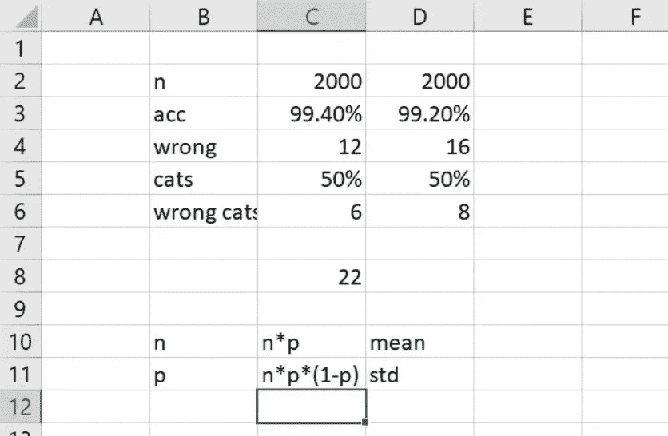

所以第一个数字你不必记住——这是直观明显的。第二个数字是一个你要永远记住的数字，因为它不仅经常出现，你与之合作的人都会忘记，所以你会成为对话中唯一能立即说出“我们不必运行这个 100 次，我可以立即告诉你这是二项式，它将是`n*p*(1-p)`的人。

然后是标准误差。标准误差是指如果你运行一堆试验，每次得到一个平均值，那么平均值的标准偏差是多少。我不认为你们已经涵盖了这个内容。这是非常重要的，因为这意味着如果你训练了一百个模型，每次验证集的准确率就像是一个分布的平均值。因此，验证集准确率的标准偏差可以用标准误差来计算，这等于标准偏差除以 n 的平方根。

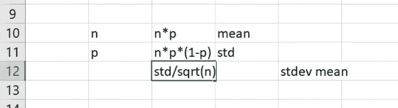

因此，确定我的验证集是否足够大的一种方法是，每次使用完全相同的超参数训练模型 5 次，然后查看每次的验证集准确率，可以计算出 5 个数字的平均值和标准差，或者可以使用最大值和最小值。但为了节省时间，您可以立即确定，我有一个 0.99 的准确率，无论我是否正确地识别了猫。因此，标准差等于 0.99 * 0.01，然后可以得到标准误差。因此，您需要的验证集大小，就像它必须足够大，以便您对准确性的洞察对于您特定的业务问题足够好。因此，简单的方法是选择一个大小为一千的验证集，训练 5 个模型，查看验证集准确率的变化情况，如果它们都足够接近您所需的水平，那么就可以了。如果不是，也许您应该使其更大，或者考虑改用交叉验证。因此，可以看到，这取决于您试图做什么，您的较不常见类别有多常见，以及您的模型有多准确。

问题：关于较少常见的类别，如果你少于 22 个，比如你有一个样本，比如是一个脸，我只有一个来自那个特定国家的代表，我是把它放入训练集并增加多样性，还是完全从数据集中删除，或者我把它放入测试集而不是验证集？所以你肯定不能把它放入测试集或验证集，因为你在问我能否识别我以前从未见过的东西。但实际上，关于我能否识别我以前从未见过的东西，实际上有一个专门用于这个目的的模型类别——它被称为一次性学习，你只能看到一次东西，然后必须再次识别它，或者零次学习，你必须识别你以前从未见过的东西。我们在本课程中不会涵盖它们，但它们对于像人脸识别这样的事情可能会有用，比如这是我以前见过的同一个人吗。所以一般来说，显然，为了使这样的事情起作用，不是你以前从未见过一个脸，而是你以前从未见过 Melissa 的脸。所以你看到 Melissa 的脸一次，然后你必须再次识别它。所以一般来说，你的验证集和测试集需要具有与你将在实际生产中看到的观察频率相同的混合或频率。你的训练集应该每个类别有相等数量，如果没有，只需复制较少常见的类别直到相等。我想我们之前提到过这篇论文，一篇最近发表的论文，他们尝试了许多不同的方法来训练不平衡的数据集，并一直发现，直到较少常见的类别与较常见的类别大小相同为止，过采样较少常见的类别总是正确的做法。所以你可以简单地复制，比如我只有十个患癌症的人的例子，而没有百个，所以我可以再复制这 10 个另外 90 次，这在一定程度上是一种内存效率低下的方式，包括我认为 sklearn 的随机森林有一个类别权重参数，每次你进行自助抽样或重新采样时，我希望你以更高的概率对较少常见的类别进行抽样。或者如果你正在进行深度学习，确保在你的小批量中，不是随机抽样，而是较少常见的类别的分层样本更频繁地被选中。

## 回到完成随机森林的部分 [18:39](https://youtu.be/O5F9vR2CNYI?t=18m39s)

[笔记本](https://github.com/fastai/fastai/blob/master/courses/ml1/lesson3-rf_foundations.ipynb)

让我们回到完成随机森林的工作。今天我们要做的是完成编写我们的随机森林，然后在今天之后，你的作业就是拿这节课并添加我们学到的所有随机森林解释算法。显然，为了能够做到这一点，你需要完全理解这节课的工作原理，所以在我们进行时，请尽可能多地提问。提醒一下，我们再次使用推土机 Kaggle 竞赛数据集。我们将其分为 12,000 个验证集（最后 12,000 条记录），为了更容易跟踪我们的工作，我们将从中挑选两列开始：`YearMade`和`MachineHoursCurrentMeter`。

```py
from fastai.imports import *
from fastai.structured import *
from sklearn.ensemble import RandomForestRegressor, RandomForestClassifier
from IPython.display import display
from sklearn import metricsPATH = "data/bulldozers/"

df_raw = pd.read_feather('tmp/bulldozers-raw')
df_trn, y_trn, nas = proc_df(df_raw, 'SalePrice')def split_vals(a,n): return a[:n], a[n:]
n_valid = 12000
n_trn = len(df_trn)-n_valid
X_train, X_valid = split_vals(df_trn, n_trn)
y_train, y_valid = split_vals(y_trn, n_trn)
raw_train, raw_valid = split_vals(df_raw, n_trn)x_sub = X_train[['YearMade', 'MachineHoursCurrentMeter']]
```

上次我们做的是创建了一个树集合，这个树集合包含了一堆树，实际上是一个包含`n_trees`棵树的列表，每次我们只是调用`create_tree`。`create_tree`包含了一个样本大小（`sample_sz`）的随机索引（`rnd_idxs`）。这里是无重复抽样。所以记住，自助法意味着有放回抽样。通常在 scikit-learn 中，如果有 n 行数据，我们用有放回抽样抽取 n 行数据，这意味着很多行会出现多次。所以每次我们得到一个不同的样本，但它的大小总是与原始数据集相同。然后我们有一个`set_rf_samples`函数，我们可以使用它进行少于 n 行的有放回抽样。`create_tree`再次做的是无重复抽样`sample_sz`行。因为我们对从零到`self.y-1`的数字进行排列，然后抽取其中的前`self.sample_sz`个。实际上有一种更快的方法可以做到这一点。你可以直接使用`np.random.choice`（而不是`np.random.permutation`），这是一种稍微更直接的方法，但这种方法也可以。所以`rnd_idxs`是我们`n_trees`棵树中的一个的随机样本。然后我们将创建一个`DecisionTree`。我们的决策树，我们不会传递所有的`x`，而是传递这些特定的索引，记住 x 是一个 Pandas DataFrame，所以如果我们想用一堆整数对其进行索引，我们使用`iloc`（整数位置），这使得它在索引方面的行为就像 numpy 一样。现在`y`向量是 numpy，所以我们可以直接对其进行索引。然后我们将跟踪最小叶子大小（`min_leaf`）。

```py
class TreeEnsemble():
  def __init__(self, x, y, n_trees, sample_sz, min_leaf=5):
    np.random.seed(42)
    self.x,self.y,self.sample_sz,self.min_leaf = 
                                           x,y,sample_sz,min_leaf
    self.trees = [self.create_tree() for i in range(n_trees)]

  def create_tree(self):
    rnd_idxs = np.random.permutation(len(self.y))[:self.sample_sz]
    return DecisionTree(self.x.iloc[rnd_idxs], self.y[rnd_idxs],
                            min_leaf=self.min_leaf)
```

然后在集成中我们真正需要的另一件事情就是一个地方来进行预测。因此我们只需要对每棵树的预测取平均值。就是这样。

```py
def predict(self, x):
    return np.mean([t.predict(x) for t in self.trees], axis=0)class DecisionTree():
    def __init__(self, x, y, idxs=None, min_leaf=5):
        self.x,self.y,self.idxs,self.min_leaf = x,y,idxs,min_leafm = TreeEnsemble(X_train, y_train, n_trees=10, sample_sz=1000, 
                 min_leaf=3)
```

然后为了能够运行它，我们需要一个决策树类，因为它被`create_tree`调用。所以我们开始吧。这就是起点。接下来我们需要做的是完善我们的决策树。所要记住的重要一点是我们所有的随机性都发生在`TreeEnsemble`中。我们将要创建的 DecisionTree 类中没有随机性。

问题：现在我们正在构建一个随机树回归器，这就是为什么我们要取树输出的平均值。如果我们要处理分类，我们要取最大值吗？就像分类器会给你零或一[[22:36](https://youtu.be/O5F9vR2CNYI?t=22m36s)]？不，我仍然会取平均值。因此，每棵树都会告诉你叶节点中包含猫的百分比和包含狗的百分比。然后我会平均所有这些百分比，并说在所有树上平均，有 19%的猫和 81%的狗。

随机树分类器几乎与随机树回归器相同，或者几乎可以相同。我们今天要使用的技术基本上完全适用于分类。对于二元分类，您可以使用完全相同的代码。对于多类分类，您只需要更改数据结构，使其像一个独热编码矩阵或一个整数列表，您将其视为一个独热编码矩阵。

所以我们的决策树，记住，我们的想法是我们要尽量避免思考，所以我们基本上会写成如果我们需要的一切已经存在的样子。我们知道当我们创建决策树时，我们将传入 x、y 和最小叶子大小。所以在这里我们需要确保在`__init__`中有`x`、`y`和`min_leaf`。还有一件事是，当我们将树分割成子树时，我们需要跟踪哪些行索引进入了树的左侧，哪些进入了树的右侧。所以我们还会有一个叫做`idxs`的东西。起初，我们根本不费心传入`idxs`，所以如果没有传入`idxs`（即`if idxs is None`），那么我们就会将其设置为 y 的整个长度。`np.arange`在 Python 中与`range`相同，但它返回一个 numpy 数组。所以决策树的根包含所有行。这实际上就是决策树根的定义（第 0 行，第 1 行，直到第 y-1 行）。我们将存储我们得到的所有信息。我们将跟踪有多少行，有多少列。

然后树中的每个叶子和每个节点都有一个值/预测。该预测只是等于因变量的平均值。因此，树中的每个节点，用`idxs`索引的`y`是在树的这一分支中的因变量的值，因此这里是平均值。树中的一些节点还有一个分数，这就像这里的分割有多有效。但只有在它不是叶子节点时才会成立。叶子节点没有进一步的分割。在创建树时，我们还没有进行任何分割，因此其分数开始时为无穷大。构建了树的根节点后，我们的下一个任务是找出应该在哪个变量上进行分割，以及应该在该变量的哪个水平上进行分割。因此，让我们假设有一个可以做到这一点的东西——`find_varsplit`。然后我们就完成了。

```py
class DecisionTree():
    def __init__(self, x, y, idxs=None, min_leaf=5):
        if idxs is None: idxs=np.arange(len(y))
        self.x,self.y,self.idxs,self.min_leaf = x,y,idxs,min_leaf
        self.n,self.c = len(idxs), x.shape[1]
        self.val = np.mean(y[idxs])
        self.score = float('inf')
        self.find_varsplit()
```

那么我们如何找到一个变量来分割呢？嗯，我们可以逐个检查每个潜在的变量，所以`c`包含我们拥有的列数，逐个检查并查看是否能在该列上找到比目前更好的分割。现在请注意，这并不是完整的随机森林定义。这是假设最大特征被设置为全部的情况。请记住，我们可以将最大特征设置为 0.5，这样我们就不会检查从零到`c`的所有数字，而是会随机检查从零到`c`的一半数字。因此，如果您想将其转换为支持最大特征的随机森林，您可以轻松添加一行代码来实现。但是在我们今天的实现中，我们不打算这样做。因此，我们只需要找到更好的分割点，由于我们目前不感兴趣，所以现在我们将其留空。

```py
 *# This just does one decision; we'll make it recursive later*
    def find_varsplit(self):
        for i in range(self.c): self.find_better_split(i)

    *# We'll write this later!*
    def find_better_split(self, var_idx): pass

    @property
    def split_name(self): return self.x.columns[self.var_idx]

    @property
    def split_col(self): 
        return self.x.values[self.idxs,self.var_idx]

    @property
    def is_leaf(self): return self.score == float('inf')

    def __repr__(self):
        s = f'n: **{self.n}**; val:**{self.val}**'
        if not self.is_leaf:
            s += f'; score:**{self.score}**; split:**{self.split}**; var:
                   **{self.split_name}**'
        return s
```

在开始编写一个类时，我喜欢做的另一件事是，我想要有一种方法来打印出该类中的内容。如果你输入 print，后面跟着一个对象，或者在 Jupyter Notebook 中，你只需输入对象的名称。目前，它只是打印出`<__main__.DecisionTree at 0x7f645ec22358>`，这并不是很有帮助。所以如果我们想要用有用的东西来替换它，我们必须定义一个特殊的 Python 方法，名为`__repr__`，以获得这个对象的表示。所以当我们在 Jupyter Notebook 单元格中基本上只写出名称时，在幕后，它调用那个函数，而该方法的默认实现只是打印出那些无用的东西。所以我们可以替换它，而不是说让我们创建一个格式化字符串，在这里我们将打印出`f'n: **{self.n}**; val:**{self.val}'**`，所以这个节点中有多少行，以及因变量的平均值是多少。然后，如果它不是叶节点，也就是说如果它有一个分裂，那么我们还应该能够打印出分数，我们分裂出的值，以及我们分裂的变量。现在你会注意到这里，`self.is_leaf`被定义为一个方法，但我后面没有加括号。这是一种特殊类型的方法，称为属性。属性看起来像一个普通的变量，但实际上是动态计算的。所以当我调用`is_leaf`时，实际上调用的是`**def** is_leaf(self)`函数。但我有这个特殊的装饰器`@property`。这意味着当你调用它时，你不必包括括号。所以它会说这是一个叶子还是不是。所以叶子是我们不分裂的东西。如果我们没有对它进行分裂，那么它的分数仍然设置为无穷大，这就是我的逻辑。

这个`@`符号被称为装饰器。基本上是告诉 Python 关于你的方法的更多信息的一种方式。任何之前使用过像 Flask 或类似框架进行过 web 编程的人都必须声明这个方法将响应 URL 的这一部分，要么是 POST，要么是 GET，并将其放在一个特殊的装饰器中。在幕后，这告诉 Python 以一种特殊的方式处理这个方法。所以`@property`是另一个装饰器。如果你在 Python 中变得更加高级，你实际上可以学习如何编写自己的装饰器，就像之前提到的那样，基本上插入一些额外的代码，但现在只需要知道有一堆预定义的装饰器可以用来改变我们的方法的行为，其中之一就是`@property`，这基本上意味着你不再需要加括号，当然这意味着你不能再添加任何参数了，只能是`self`。

问题：如果分数是无穷大，为什么它是叶子？无穷大不是意味着你在根节点吗？不，无穷大意味着你不在根节点。它意味着你在叶子节点。所以根节点将会有一个分裂，假设我们找到一个。一切都会分裂，直到我们到达底部（即叶子节点），所以叶子节点的分数将是无穷大，因为它们不会分裂。

```py
m = TreeEnsemble(X_train, y_train, n_trees=10, sample_sz=1000,
                 min_leaf=3)
m.trees[0]*n: 1000; val:10.079014121552744*
```

这就是我们的决策树。它并没有做太多事情，但至少我们可以创建一个集成。10 棵树，样本量为 1,000，我们可以打印出来。现在当我们输入`m.trees[0]`时，它不会显示`<__main__.DecisionTree at 0x7f645ec22358>`，而是显示我们要求它显示的内容。这是叶子节点，因为我们还没有在其上进行分割，所以我们没有更多要说的。

然后索引是，所有从零到一千的数字，因为树的基础包含了一切。这是随机样本中的所有内容，因为当我们到达决策树的时候，我们不再需要担心随机森林中的任何随机性。

## 给定变量找到最佳分割点

让我们尝试编写找到分割点的函数。因此，我们需要实现`find_better_split`。它将接受一个变量的索引，并找出最佳的分割点，确定它是否比我们目前为止的任何分割更好，对于第一个变量，答案总是肯定的，因为到目前为止最好的分割点是没有分割，这是无穷糟糕的。

所以让我们首先确保我们有东西可以进行比较。我们要进行比较的是 scikit-learn 的随机森林。我们需要确保 scikit-learn 的随机森林获得与我们完全相同的数据，因此我们首先创建集成，从中提取一棵树，然后找出这棵树使用了哪个特定的随机样本`x`和`y`，然后将它们存储起来，以便我们可以将它们传递给 scikit-learn（这样我们就有完全相同的信息）。

```py
ens = TreeEnsemble(x_sub, y_train, 1, 1000)
tree = ens.trees[0]
x_samp,y_samp = tree.x, tree.y
```

所以让我们继续使用 scikit-learn 创建一个随机森林。一个树（`n_estimators`），一个决策（`max_depth`），没有自助采样，所以整个数据集。所以这应该与我们即将创建的东西完全相同。让我们试试看。

```py
m = RandomForestRegressor(n_estimators=1, max_depth=1,
                          bootstrap=False)
m.fit(x_samp, y_samp)
draw_tree(m.estimators_[0], x_samp, precision=2)
```

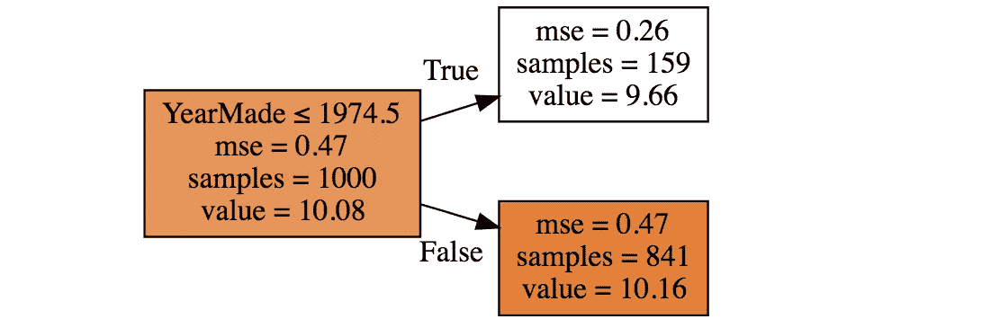

我们需要定义`find_better_split`函数，并且它需要一个变量。让我们定义我们的`x`（即自变量），说好，它是树中的所有内容，但只有在这个节点中的那些索引，而在树的顶部是所有内容，只有这一个变量（`var_idx`）。然后对于我们的`y`，它就是在这个节点中的索引处的因变量。所以这就是我们的`x`和`y`。

让我们现在逐个检查我们独立变量中的每个值。我会告诉你接下来会发生什么。假设我们的独立变量是 YearMade，它不会按顺序排列。所以我们要去到第一行，然后说好，这里的 YearMade 是 3。那么我要做的是尝试计算如果我们决定以数字 3 为分支时的得分。我需要知道哪些行大于 3，哪些行小于或等于 3，它们将成为我的左侧和右侧。然后我们需要一个得分。我们可以使用很多得分，所以在随机森林中，我们称之为信息增益。信息增益就像我们的得分因为我们将数据分成这两组而变得更好了多少。我们可以用很多方法来计算它：基尼系数、交叉熵、均方根误差等等。如果你考虑一下，有一个均方根误差的替代公式，数学上与一个约束尺度内相同，但稍微容易处理一些，那就是我们要找到一个分割点，使得这两组数据的标准差尽可能低。所以我想找到一个分割点，把所有的猫放在这边，所有的狗放在那边。所以如果这些都是猫，那些都是狗，那么这边的标准差为零，那边的标准差也为零。否则，这是一群完全随机混合的猫和狗，那是一群完全随机混合的猫和狗，它们的标准差会高得多。明白了吗？事实证明，如果找到一个最小化这两组标准差或者具体来说是两个标准差的加权平均的分割点，数学上与最小化均方根误差是相同的。如果你想的话，课后你可以自己证明这一点。

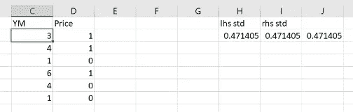

首先，我们需要找到，将其分成两组[[37:29](https://youtu.be/O5F9vR2CNYI?t=37m29s)]。那么所有大于三的东西在哪里？4、6 和 4。所以我们需要它们价格的标准差。

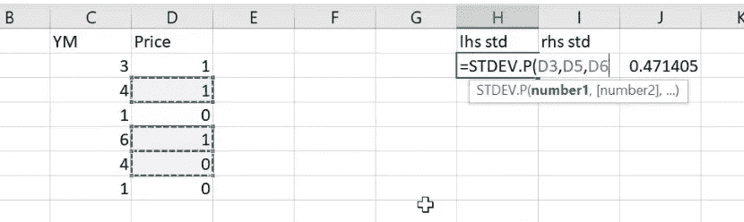

接下来是标准差小于或等于 3，我们只需取这两者的加权平均值，这就是我们的得分。如果我们在 3 上分割，那就是我们的得分。

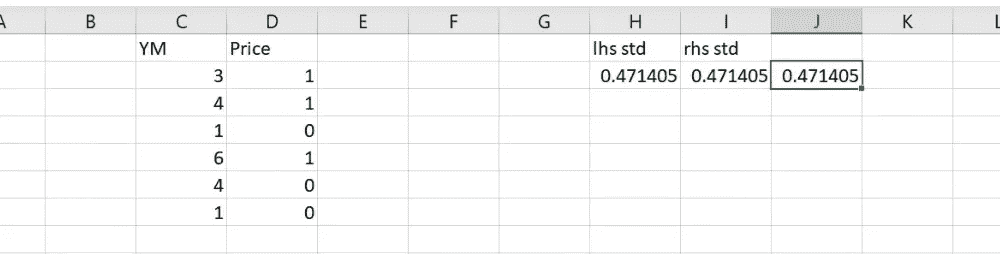

然后下一步是尝试在 4 上分割，尝试在 1 上分割，尝试在 6 上分割，多余地再次尝试在 4 上分割，然后再次在 1 上分割，找出哪个效果最好。这就是我们的代码：

```py
def find_better_split(self, var_idx):
   x,y = self.x.values[self.idxs,var_idx], self.y[self.idxs] for i in range(1,self.n-1):
      lhs = x<=x[i]
      rhs = x>x[i]
      if rhs.sum()==0: continue
      lhs_std = y[lhs].std()
      rhs_std = y[rhs].std()
      curr_score = lhs_std*lhs.sum() + rhs_std*rhs.sum()
      if curr_score<self.score: 
        self.var_idx,self.score,self.split = var_idx,curr_score,x[i]
```

我们将逐行进行，假设左侧是`x`中小于或等于特定值的任何值。右侧是`x`中大于此特定值的每个值。

`lhs` 和 `rhs` 中将包含什么数据类型？它们实际上会包含什么？它们将是布尔数组，我们可以将其视为零和一。因此，`lhs` 将是一个数组，每次它不小于或等于时为 false；否则为 true，而 `rhs` 将是相反的布尔数组。现在我们不能对空集合取标准差，所以如果没有任何大于这个数字 (`x[i]`) 的值，那么 `rhs` 将全部为 false，这意味着总和为零。在这种情况下，让我们不再继续这一步，因为没有什么可以取标准差，显然这不是一个有用的分割。

假设我们已经走到这一步，现在我们可以计算左侧和右侧的标准差，然后取加权平均值或求和，这两者对于一个标量来说是相同的，因此这就是我们的得分。然后我们可以检查这个得分是否比迄今为止的最佳得分更好，我们迄今为止的最佳得分，最初将其初始化为无穷大，因此最初这是更好的。如果更好，让我们存储所有我们需要的信息：哪个变量找到了这个更好的分割，我们找到的得分是多少，以及我们分割的值是多少。就是这样。如果我们运行这个，并且我正在使用`％timeit`，它会看这个命令运行需要多长时间，并试图给出一个统计上有效的度量，这样你就可以看到，它已经运行了 10 次以获得平均值，然后又运行了 7 次以获得运行间的平均值和标准差，所以它花了我 76 毫秒加减 11。

```py
%timeit find_better_split(tree,1)
tree76.6 ms ± 11.8 ms per loop (mean ± std. dev. of 7 runs, 10 loops each)*n: 1000; val:10.079014121552744; score:681.0184057251435; split:3744.0; var:MachineHoursCurrentMeter*
```

所以让我们来检查这是否有效。`find_better_split(tree, 0)`，0 代表`YearMade`，1 代表`MachineHoursCurrentMeter`，所以当我们用 1 时，我们得到了`MachineHoursCurrentMeter`，得分为 681.0184057251435，然后我们再次用零运行，得到了更好的分数（658），并分割了 1974。

```py
find_better_split(tree,0); tree*n: 1000; val:10.079014121552744; score:658.5510186055949; split:1974.0; var:YearMade*
```

所以 1974 年，让我们与上面的 scikit-learn 的随机森林进行比较，是的，这棵树也是这样做的。所以我们确认了这种方法给出了与 sklearn 的随机森林相同的结果。你还可以在这里看到值 10.08 与 sklearn 的根节点的值匹配。所以我们有了一个可以处理一个分割的东西。


**问题**：为什么我们不在 x 上放一个 unique？因为我还没有尝试优化性能。你可以在 Excel 中看到我检查了这个`1`两次，`4`两次，这是不必要的。

好的，Yannet 已经在考虑性能，这是好事。那告诉我这段代码的计算复杂度是多少？

！[](../Images/553d4fdb21654aad9661ce13548e75cc.png)

O(n²) 是因为有一个循环和 `x<=x[i]`，我们必须检查每个值，看它是否小于 `x[i]`。了解如何快速计算计算复杂度是很有用的。我可以保证你做的大多数面试都会要求你即兴计算计算复杂度。而且当你编码时，你希望它成为第二天性。这种技巧基本上是“有循环吗？”如果有，那么显然我们要做这个 `n` 次，所以涉及到一个 `n`。循环里面还有循环吗？如果有，那么你需要将它们两个相乘。在这种情况下，没有。循环里面有任何不是常数时间操作的东西吗？所以你可能会看到一个排序在里面，你只需要知道排序是 `nlog(n)` —— 这应该是第二天性的。如果你看到一个矩阵相乘，你需要知道那是什么。在这种情况下，有一些东西在进行逐元素数组操作，所以要留意任何地方，numpy 在对数组的每个值做一些操作。在这种情况下，它正在检查每个 `x` 的值是否小于一个常数，所以它将不得不这样做 `n` 次。所以要将这个扩展成一个计算复杂度，你只需要将循环中的事物数量乘以循环内部的最高计算复杂度，`n` 次 `n` 是 `n²`。

**问题**：在这种情况下，我们不能只是预先对列表进行排序，然后进行一次`nlog(n)`的计算吗？有很多事情可以做来加快速度，所以在这个阶段我们只关心的是计算复杂度。但绝对可以。当然，它肯定不是最好的。所以接下来我们要做的就是这个。就像好吧，n²不太好，所以让我们试着让它变得更好。

所以这是我尝试改进的地方。首先，标准差的方程式是什么？

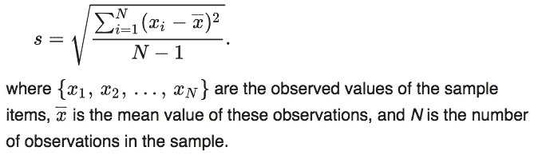

实际上，我们通常不使用那个公式，因为它要求我们多次计算`x`减去平均值。有谁知道只需要 x 和 x²的公式吗？

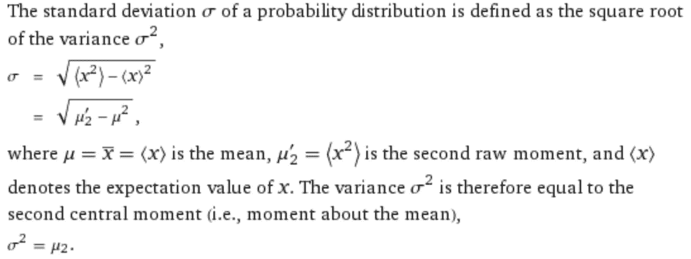

[`www.wolframalpha.com/input/?i=standard+deviation`](http://www.wolframalpha.com/input/?i=standard+deviation)

这是一个非常好的知识点，因为现在你可以计算任何东西的方差或标准偏差。你只需要首先抓取列本身。列的平方。只要你把它们存储在某个地方，你就可以立即计算标准偏差。

所以这对我们有用的原因是，如果我们首先对我们的数据进行排序。然后如果你考虑一下，当我们一步一步地向下走时，每一组都与左边的前一组完全相同，只是多了一件东西，右边则少了一件东西。因此，我们只需要跟踪 x 的总和和 x²的总和，我们只需在左边添加一个东西，x²再添加一个东西，在右边移除一个东西。因此，我们不必每次都遍历整个数据集，因此我们可以将其转化为 O(n)算法。这就是我在这里所做的一切：

```py
tree = TreeEnsemble(x_sub, y_train, 1, 1000).trees[0]def std_agg(cnt, s1, s2): return math.sqrt((s2/cnt) - (s1/cnt)**2)

def find_better_split_foo(self, var_idx):
  x,y = self.x.values[self.idxs,var_idx], self.y[self.idxs]

  sort_idx = np.argsort(x)
  sort_y,sort_x = y[sort_idx], x[sort_idx]
  rhs_cnt,rhs_sum,rhs_sum2 = self.n, sort_y.sum(), (sort_y**2).sum()
  lhs_cnt,lhs_sum,lhs_sum2 = 0,0.,0.

  for i in range(0,self.n-self.min_leaf-1):
    xi,yi = sort_x[i],sort_y[i]
    lhs_cnt += 1; rhs_cnt -= 1
    lhs_sum += yi; rhs_sum -= yi
    lhs_sum2 += yi**2; rhs_sum2 -= yi**2
    if i<self.min_leaf or xi==sort_x[i+1]:
      continue

    lhs_std = std_agg(lhs_cnt, lhs_sum, lhs_sum2)
    rhs_std = std_agg(rhs_cnt, rhs_sum, rhs_sum2)
    curr_score = lhs_std*lhs_cnt + rhs_std*rhs_cnt
    if curr_score<self.score: 
      self.var_idx,self.score,self.split = var_idx,curr_score,xi
```

我对数据进行排序，然后我会跟踪右侧的事物数量（`rhs_cnt`），右侧事物的总和（`rhs_sum`）和右侧的平方和（`rhs_sum2`）。最初所有事物都在右侧。因此最初`n`是计数，`y.sum()`是右侧的总和，y²（`y**2`）的总和是右侧的平方和。然后最初左侧没有任何事物，因此为零。然后我们只需要循环遍历每个观察值：

+   左手计数加一，右手计数减一。

+   将值加到左手总和，从右手总和减去。

+   将值的平方加到左手，从右手减去。

现在我们需要小心，因为如果我们说小于或等于一，例如，我们不会停在第一行，而是必须将该组中的所有内容都包括在内。

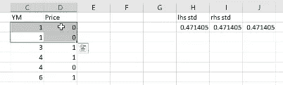

所以我要做的另一件事是确保下一个值不同于这个值。如果是的话，我会跳过它。所以我只是要再次检查这个值和下一个值不相同（`**if** xi==sort_x[i+1]:`）。只要它们不相同，我就可以继续前进，通过传入计数、总和和平方和来计算我的标准偏差。那个公式就在那里：

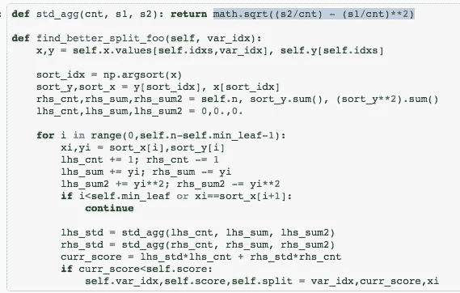

现在我们可以对右侧进行同样的操作，这样我们就可以像之前一样计算加权平均分数，下面的所有行都是一样的。

所以我们把 O(n²)的算法转换成了 O(n)的算法。一般来说，像这样的东西会给你带来比将某些东西推送到 Spark 集群或者更快的 RAM 或者在 CPU 中使用更多核心等更多价值。这是你想要改进你的代码的方式。具体来说，编写代码时不要过多考虑性能。运行它，看看它是否对你的需求足够快。如果是，那么你就完成了。如果不是，进行性能分析。在 Jupyter 中，你可以使用`%prun`，它会告诉你算法中时间花在哪里。然后你可以去看看实际花费时间的部分，思考它在算法上是否尽可能高效。在这种情况下，我们运行它，从 76 毫秒降到不到 2 毫秒。现在一些新手可能会认为“哦，太好了，我节省了 60 多毫秒”，但关键是这将被运行数千万次。所以 76 毫秒版本太慢了，对于实际使用的任何随机森林来说都是不切实际的。而另一方面，我找到的 1 毫秒版本实际上是相当可接受的。

```py
 %timeit find_better_split_foo(tree,1)
tree2.2 ms ± 148 µs per loop (mean ± std. dev. of 7 runs, 100 loops each)n: 1000; val:10.079014121552744; score:658.5510186055565; split:1974.0; var:YearMade
```

然后检查，数字应该与之前完全相同，而且确实如此。

```py
find_better_split_foo(tree,0); treen: 1000; val:10.079014121552744; score:658.5510186055565; split:1974.0; var:YearMade
```

现在我们有了一个函数`find_better_split`，它可以做我们想要的事情，我想把它插入到我的`DecisionTree`类中。这是一个非常酷的 Python 技巧。Python 可以动态执行所有操作，因此我们实际上可以说`DecisionTree`中名为`find_better_split`的方法就是我刚刚创建的那个函数。

```py
DecisionTree.find_better_split = find_better_split_foo
```

将其放在该类中。现在我告诉你这件事稍微令人困惑的地方是，左边的`find_better_split`和右边的`find_better_split`实际上并没有任何关系。它们只是恰好以相同的顺序拥有相同的字母。所以我可以将其命名为`find_better_split_foo`，然后我可以调用它。现在我的函数实际上被称为`find_better_split_foo`，但我期望调用的方法是名为 DecisionTree.find_better_split 的东西。所以在这里，我可以说：

```py
DecisionTree.find_better_split = find_better_split_foo
```

在使用的每种语言中，了解命名空间的工作原理是很重要的。其中最重要的一点是了解它是如何确定名称所指的内容的。所以这里（`DecisionTree.find_varsplit`）意味着`DecisionTree`类内部定义的`find_better_split`，而不是其他地方。右边的这个意味着全局命名空间中的`find_better_split_foo`。许多语言没有全局命名空间，但 Python 有。因此，即使它们恰好以相同的顺序拥有相同的字母，它们也不以任何方式指向相同的内容。就像这边的家庭可能有一个叫 Jeremy 的人，而我的家庭也有一个叫 Jeremy 的人。我们的名字恰好相同，但我们并不是同一个人。

现在我们已经将`find_better_split`方法放入了具有这个新定义的`DecisionTree`中，当我现在调用`TreeEnsemble`构造函数时，决策树集合构造函数会调用`create_tree`，`create_tree`实例化`DecisionTree`，`DecisionTree`调用`find_varsplit`，它会遍历每一列以查看是否可以找到更好的分割点，我们现在已经定义了`find_better_split`，因此当我们创建`TreeEnsemble`时，它已经执行了这个分割点。

```py
tree = TreeEnsemble(x_sub, y_train, 1, 1000).trees[0]; treen: 1000; val:10.079014121552744; score:658.5510186055565; split:1974.0; var:YearMade
```

好的。这很不错，对吧？我们一次只做一点点，测试每一步。当你们实现随机森林解释技术时，你们可能想尝试以这种方式编程，检查每一步是否与 scikit-learn 所做的匹配，或者与你们构建的测试匹配。

## 完整的单棵树[[55:13](https://youtu.be/O5F9vR2CNYI?t=55m13s)]

在这一点上，我们应该尝试更深入地探究。现在让我们将 max_depth 设置为 2。这是 scikit-learn 所做的。在 YearMade 74 处中断后，它接着在 MachineHoursCurrentMeter 2956 处中断。

```py
m = RandomForestRegressor(n_estimators=1, max_depth=2, 
                          bootstrap=False) 
m.fit(x_samp, y_samp) 
draw_tree(m.estimators_[0], x_samp, precision=2)
```

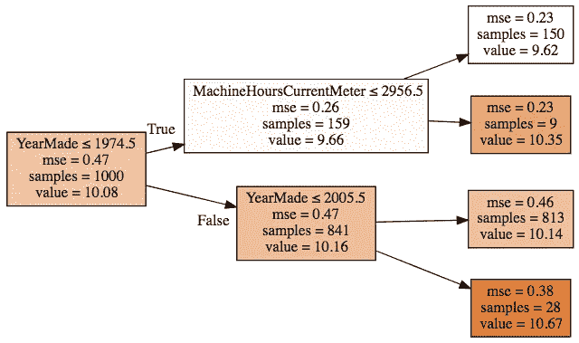

所以我们有一个叫做`find_varsplit`的东西，它只是遍历每一列，尝试看看是否有更好的分割点。但实际上，我们需要再进一步。我们不仅需要遍历每一列，看看这个节点是否有更好的分割点，而且还需要看看我们刚刚创建的左侧和右侧是否有更好的分割点。换句话说，左侧和右侧应该成为决策树本身。

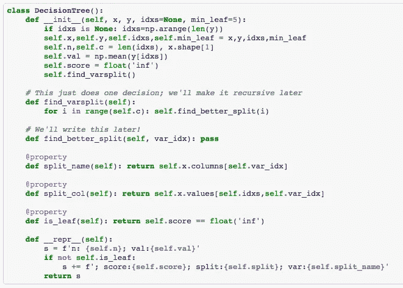

在右侧创建这棵树和在左侧创建这棵树之间没有任何区别，除了左侧包含 159 个样本，右侧包含一千个。

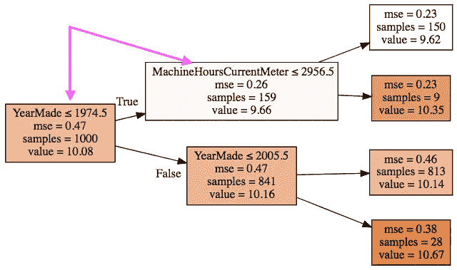

因此，第一行代码与之前完全相同。然后我们检查它是否是叶节点。如果是叶节点，那么我们就没有更多的事情要做了。这意味着我们就在底部，没有进行分割，所以我们不需要做任何进一步的操作。另一方面，如果它不是叶节点，那么我们需要将其分割成左侧和右侧。现在，早些时候，我们创建了一个左侧和右侧的布尔数组。最好是有一个索引数组，因为我们不想在每个节点中都有一个完整的布尔数组。因为请记住，尽管在这个大小的树中看起来似乎没有很多节点，但当它完全展开时，底层（即如果最小叶大小为 1）包含与整个数据集相同数量的节点。因此，如果每个节点都包含整个数据集大小的完整布尔数组，那么内存需求会增加。另一方面，如果我们只存储此节点中所有内容的索引，那么它将变得越来越小。

```py
def find_varsplit(self):
    for i in range(self.c): self.find_better_split(i)
    if self.is_leaf: return
    x = self.split_col
    lhs = np.nonzero(x<=self.split)[0]
    rhs = np.nonzero(x>self.split)[0]
    self.lhs = DecisionTree(self.x, self.y, self.idxs[lhs])
    self.rhs = DecisionTree(self.x, self.y, self.idxs[rhs])
```

np.nonzero 与`x<=self.split`完全相同，它得到布尔数组，但将其转换为`true`的索引[[58:07](https://youtu.be/O5F9vR2CNYI?t=58m7s)]。因此，这个`lhs`现在是左侧和右侧的索引列表。现在我们有了左侧和右侧的索引，我们现在可以继续创建一个决策树。所以`self.lhs`是我们左侧的决策树，`self.rhs`是我们右侧的决策树。我们不需要做其他事情。我们已经写好了这些。我们已经有一个可以创建决策树的构造函数。所以当你真正思考这在做什么时，会有点让人头疼，对吧？因为`find_varsplit`被调用的原因是因为决策树构造函数调用了它。但是`find_varsplit`本身又调用了决策树构造函数。所以我们实际上有循环递归。我并不聪明到足以能够思考递归，所以我选择不去想。我只是写出我的意思，然后不再考虑。我想要什么？找到一个变量分割。我必须遍历每一列，看看是否有更好的东西，如果成功进行了分割，找出左侧和右侧，然后将它们转换为决策树。现在尝试思考这两种方法如何相互调用会让我发疯，但我不需要这样做。我知道我有一个有效的决策树构造函数，我知道我有一个有效的`find_varsplit`，所以就这样。这就是我进行递归编程的方式，就是假装我没有。我只是忽略它。这是我的建议。你们中很多人可能足够聪明，能够比我更好地思考这个问题，那就好。如果你能的话。

```py
DecisionTree.find_varsplit = find_varsplit
```

所以现在我已经写好了，我可以将其打补丁到 DecisionTree 类中，一旦我这样做了，TreeEnsemble 构造函数将会使用它，因为 Python 是动态的。

```py
tree = TreeEnsemble(x_sub, y_train, 1, 1000).trees[0]; treen: 1000; val:10.079014121552744; score:658.5510186055565; split:1974.0; var:YearMade
```

现在我可以检查[1:00:31](https://youtu.be/O5F9vR2CNYI?t=1h31s)。我的左手边应该有 159 个样本和值为 9.66。

```py
tree.lhsn: 159; val:9.660892662981706; score:76.82696888346362; split:2800.0; var:MachineHoursCurrentMeter
```

右手边，841 个样本和 10.15。

```py
tree.rhsn: 841; val:10.158064432982941; score:571.4803525045031; split:2005.0; var:YearMade
```

左手边的左手边，150 个样本和 9.62。

```py
tree.lhs.lhsn: 150; val:9.619280538108496; score:71.15906938383463; split:1000.0; var:YearMade
```

所以你可以看到，因为我并不聪明到足以编写机器学习算法，不仅我第一次写不正确，通常每一行我写的都是错误的。所以我总是从这样的假设开始，我刚刚输入的代码几乎肯定是错误的。我只需要看看为什么以及如何。所以我只是确保。最终我会到达这样一个点，让我很惊讶的是，它不再出错了。所以在这里，我可以感觉到好吧，如果所有这些事情碰巧与 scikit-learn 完全相同，那将是令人惊讶的。所以看起来还不错。

```py
tree.lhs.rhsn: 9; val:10.354428077535193
```

## 预测 [1:01:43]

现在我们有了一个可以构建整个树的东西，我们想要有一个可以计算预测的东西。所以提醒一下，我们已经有了一个可以为`TreeEnsemble`计算预测的东西（通过调用`tree.predict(x)`），但在`DecisionTree`中没有叫做`tree.predict`的东西，所以我们需要写一个。

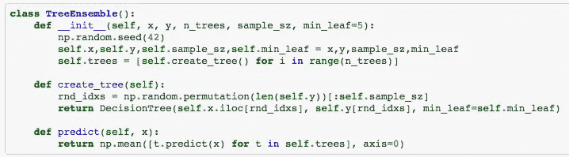

为了让这更有趣，让我们开始增加我们使用的列数。

```py
cols = ['MachineID', 'YearMade', 'MachineHoursCurrentMeter',
        'ProductSize', 'Enclosure','Coupler_System', 'saleYear']
```

让我们再次创建我们的`TreeEnsemble`。

```py
%time tree = TreeEnsemble(X_train[cols], y_train, 1, 1000).trees[0]
x_samp,y_samp = tree.x, tree.yCPU times: user 288 ms, sys: 12 ms, total: 300 ms
Wall time: 297 ms
```

这一次，让我们将最大深度设为 3。

```py
m = RandomForestRegressor(n_estimators=1, max_depth=3, 
                          bootstrap=False)
m.fit(x_samp, y_samp)
draw_tree(m.estimators_[0], x_samp, precision=2, ratio=0.9, size=7)
```

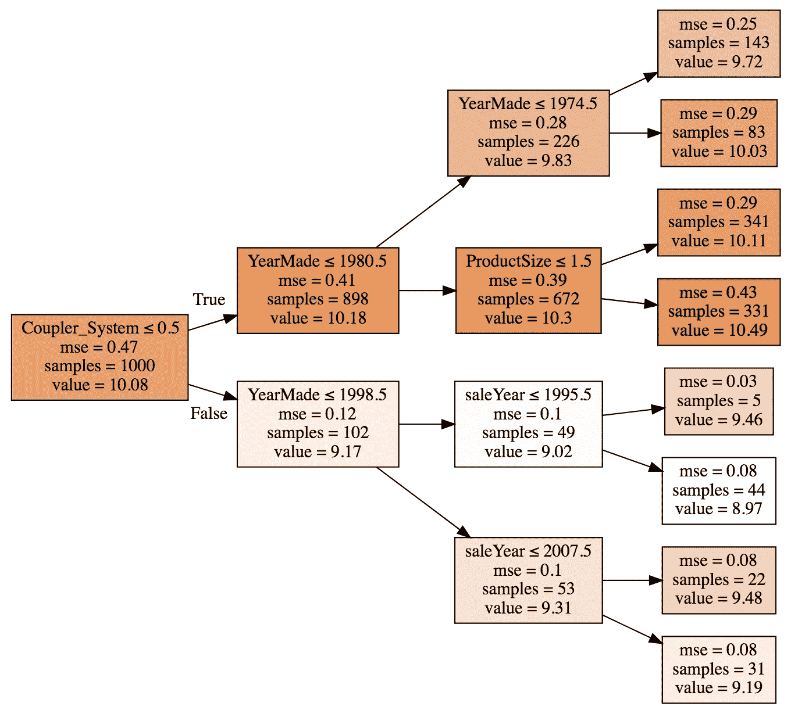

所以现在我们的树变得更加有趣。现在让我们定义如何为树创建一组预测。因此，树的一组预测就是每一行的预测。就是这样。这就是我们的预测。因此，树的预测是数组中每一行的预测。所以再次，我们跳过思考，思考很困难。所以让我们继续推迟。这个`**for** xi **in** x`很方便，对吧？请注意，无论数组的秩如何，您都可以使用 numpy 数组中的`for` blah。无论数组中的轴数是多少。它的作用是遍历主轴。

这些概念在我们进入越来越多的神经网络时将变得非常重要，因为我们将一直在进行张量计算。因此，向量的主轴是向量本身。矩阵的主轴是行。三维张量的主轴是表示切片的矩阵等等。在这种情况下，因为 x 是一个矩阵，这将循环遍历行。如果您以这种方式编写您的张量代码，那么它将很好地推广到更高的维度。在这个 `x` 中有多少维度并不重要。这将循环遍历每个主轴。因此，我们现在可以称之为 `DecisionTree.predict`。

```py
def predict(self, x): 
    return np.array([self.predict_row(xi) for xi in x])
```

所以我需要做的就是编写`predict_row`。我一直在拖延思考，这很好，实际上我需要做工作的地方，现在基本上是微不足道的。如果我们在叶节点，那么预测值就等于我们在原始树构造函数中计算的那个值（即`y`的平均值）。如果不是叶节点，那么我们必须弄清楚是沿左路径还是右路径进行预测。因此，如果这一行中的变量（`xi[self.var_idx]`）小于或等于我们决定拆分的值，则我们沿左路径前进；否则我们沿右路径前进。然后，确定我们想要的路径/树之后，我们只需在其上调用`predict_row`。再次，我们无意中创建了递归的东西。如果是叶节点，则返回该值；否则根据需要返回左侧或右侧的预测值。

```py
def predict_row(self, xi):
    if self.is_leaf: return self.val
    t = self.lhs if xi[self.var_idx]<=self.split else self.rhs
    return t.predict_row(xi)DecisionTree.predict_row = predict_row
```

注意这里的`self.lhs **if** xi[self.var_idx]<=self.split **else** self.rhs`，这个 if 与上面的 if 没有任何关系：

```py
if something:
    x= do1()
else:
    x= do2()
```

上面的这个 if 是一个控制流语句，告诉 Python 沿着这条路径或那条路径进行一些计算。下面的这个 if 是一个返回值的运算符。

```py
x = do1() if something else do2()
```

所以你们做过 C 或 C++的人会认出它与这个是完全相同的（即三元运算符）：

```py
x = something ? do1() : do2()
```

基本上我们要做的是，我们要得到一个值，如果`something`为真，我们会说这个值是(`do1()`)，否则是另一个值(`do2()`)。你可以用冗长的方式来写，但那将需要写 4 行代码来做一件事，而且还需要你编写的代码，如果你自己或向别人阅读时，表达方式并不自然。我想说“我要走的树是左边，如果变量小于分割值，否则是右边。所以我想按照我思考或说代码的方式来编写我的代码。因此，这种三元运算符对此非常有帮助。

所以现在我已经对一行进行了预测，我可以将其放入我的类中：

```py
DecisionTree.predict = predict
```

现在我可以计算预测。

```py
%time preds = tree.predict(X_valid[cols].values)*CPU times: user 156 ms, sys: 4 ms, total: 160 ms
Wall time: 162 ms*
```

现在我可以将我的实际数据与我的预测数据进行对比。当你做散点图时，通常会有很多点重叠在一起，所以一个好的技巧是使用 alpha。Alpha 表示透明度，不仅在 matplotlib 中，在世界上几乎所有的图形包中都是如此。因此，如果将 alpha 设置为小于 1，那么这意味着你需要将 20 个点叠加在一起才能完全显示为蓝色。这是一个很好的方法来看看有多少点重叠在一起 - 散点图的一个好技巧。

```py
plt.scatter(preds, y_valid, alpha=0.05)
```

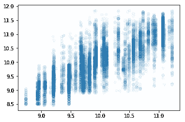

这是我的 R²。

```py
metrics.r2_score(preds, y_valid)0.50371522136882341
```

那么现在让我们继续进行一个没有最大分裂次数的随机森林，我们的树集合也没有最大分裂次数，我们可以将我们的 R²与他们的 R²进行比较。

```py
m = RandomForestRegressor(n_estimators=1, min_samples_leaf=5, bootstrap=False)
%time m.fit(x_samp, y_samp)
preds = m.predict(X_valid[cols].values)
plt.scatter(preds, y_valid, alpha=0.05)
```

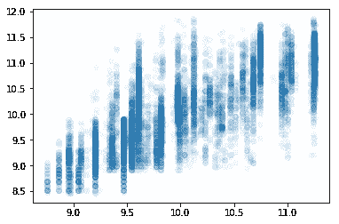

```py
metrics.r2_score(preds, y_valid)0.47541053100694797
```

它们并不相同，但实际上我们的稍微好一点。我不知道我们做了什么不同，但我们会接受它😊 所以现在我们有了一个对于一个只有一棵树的森林，在使用一个真实的实际数据集（推土机的蓝皮书）进行验证时，与 scikit-learn 相比提供了同样好的准确性。

## 把它放在一起

让我们继续完善这个。现在我想要做的是创建一个包含这段代码的包。我通过创建一个方法，再创建一个方法，然后将它们拼接在一起来创建这个包。现在我回到笔记本中，收集了所有实现方法的单元格，然后将它们全部粘贴在一起。

```py
class TreeEnsemble():
  def __init__(self, x, y, n_trees, sample_sz, min_leaf=5):
    np.random.seed(42)
    self.x,self.y,self.sample_sz,self.min_leaf = 
                                        x,y,sample_sz,min_leaf
    self.trees = [self.create_tree() for i in range(n_trees)] def create_tree(self):
    idxs = np.random.permutation(len(self.y))[:self.sample_sz]
    return DecisionTree(self.x.iloc[idxs], self.y[idxs], 
                    idxs=np.array(range(self.sample_sz)), 
                    min_leaf=self.min_leaf)

  def predict(self, x):
    return np.mean([t.predict(x) for t in self.trees], axis=0)def std_agg(cnt, s1, s2): return math.sqrt((s2/cnt) - (s1/cnt)**2)class DecisionTree():
  def __init__(self, x, y, idxs, min_leaf=5):
    self.x,self.y,self.idxs,self.min_leaf = x,y,idxs,min_leaf
    self.n,self.c = len(idxs), x.shape[1]
    self.val = np.mean(y[idxs])
    self.score = float('inf')
    self.find_varsplit()

  def find_varsplit(self):
    for i in range(self.c): self.find_better_split(i)
    if self.score == float('inf'): return
    x = self.split_col
    lhs = np.nonzero(x<=self.split)[0]
    rhs = np.nonzero(x>self.split)[0]
    self.lhs = DecisionTree(self.x, self.y, self.idxs[lhs])
    self.rhs = DecisionTree(self.x, self.y, self.idxs[rhs]) def find_better_split(self, var_idx):
    x,y = self.x.values[self.idxs,var_idx], self.y[self.idxs]
    sort_idx = np.argsort(x)
    sort_y,sort_x = y[sort_idx], x[sort_idx]
    rhs_cnt,rhs_sum,rhs_sum2 = self.n,sort_y.sum(),(sort_y**2).sum()
    lhs_cnt,lhs_sum,lhs_sum2 = 0,0.,0. for i in range(0,self.n-self.min_leaf-1):
      xi,yi = sort_x[i],sort_y[i]
      lhs_cnt += 1; rhs_cnt -= 1
      lhs_sum += yi; rhs_sum -= yi
      lhs_sum2 += yi**2; rhs_sum2 -= yi**2
      if i<self.min_leaf or xi==sort_x[i+1]:
       continue lhs_std = std_agg(lhs_cnt, lhs_sum, lhs_sum2)
      rhs_std = std_agg(rhs_cnt, rhs_sum, rhs_sum2)
      curr_score = lhs_std*lhs_cnt + rhs_std*rhs_cnt
      if curr_score<self.score: 
       self.var_idx,self.score,self.split = var_idx,curr_score,xi @property
  def split_name(self): return self.x.columns[self.var_idx]

  @property
  def split_col(self): return self.x.values[self.idxs,self.var_idx] @property
  def is_leaf(self): return self.score == float('inf')

  def __repr__(self):
    s = f'n: **{self.n}**; val:**{self.val}**'
    if not self.is_leaf:
      s += f'; score:**{self.score}**; split:**{self.split}**; var:
           **{self.split_name}**'
    return s def predict(self, x):
    return np.array([self.predict_row(xi) for xi in x]) def predict_row(self, xi):
    if self.is_leaf: return self.val
    t = self.lhs if xi[self.var_idx]<=self.split else self.rhs
    return t.predict_row(xi)
```

就是这样。这就是我们一起编写的代码。

```py
ens = TreeEnsemble(X_train[cols], y_train, 5, 1000)preds = ens.predict(X_valid[cols].values)plt.scatter(y_valid, preds, alpha=0.1, s=6);
```

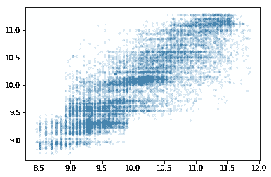

```py
metrics.r2_score(y_valid, preds)*0.71011741571071241*
```

这里我们有一个蓝色推土机的模型，使用了我们完全从头开始编写的随机森林，R²为 71。这很酷。

## 性能和 Cython

当我尝试比较这个与 scikit-learn 的性能时，这个要慢得多，原因是虽然很多工作是由 numpy 完成的，numpy 是优化良好的 C 代码，但想想树的最底层。如果我们有一百万个数据点，树的底层有大约 500,000 个决策点，底下有一百万个叶子。这就像调用了 500,000 个分割方法，其中包含多次调用 numpy，而 numpy 只有一个要计算的项目。这是非常低效的。这是 Python 在性能方面特别不擅长的事情（即多次调用大量函数）。我们可以看到它并不差。对于 15 年前被认为是相当大的随机森林来说，这被认为是相当不错的性能。但是现在，这至少比应该的速度慢了几百倍。

scikit-learn 的开发人员为了避免这个问题所做的是，他们使用了一种叫做 Cython 的东西来实现。Cython 是 Python 的一个超集。所以你写的任何 Python 代码基本上都可以作为 Cython 来使用。但是 Cython 运行方式有所不同。它不是直接传递给 Python 解释器，而是将其转换为 C 语言，编译，然后运行该 C 代码。这意味着，第一次运行时会花费一些时间，因为需要进行翻译和编译，但之后运行会快得多。所以我想快速向你展示一下这是什么样子，因为你肯定会遇到 Cython 可以帮助你工作的情况，而你大部分一起工作的人可能从未使用过它（甚至可能不知道它的存在），所以拥有这种超能力是非常棒的。

在笔记本中使用 Cython，你可以这样说：

```py
%load_ext Cython
```

这里是一个 Python 函数`fib1`：

```py
def fib1(n):
    a, b = 0, 1
    while b < n:
        a, b = b, a + b
```

这里是一个 Cython 函数。它与顶部的`%%cython`完全相同。实际上，它的运行速度大约是`fib1`的两倍，因为它进行了编译。

```py
%%cython
def fib2(n):
    a, b = 0, 1
    while b < n:
        a, b = b, a + b
```

这里是同样的版本，我使用了一个特殊的 Cython 扩展叫做`cdef`，它定义了返回值和每个变量的 C 数据类型。基本上这就是你可以用来开始加快运行速度的技巧。在那一点上，现在它知道它不只是一个名为 T 的 Python 对象。所以 fib3，它和之前完全一样，但我们说我们传递给它的东西的数据类型是什么，然后定义每个变量的数据类型。

```py
%%cython
def fib3(int n):
    cdef int b = 1
    cdef int a = 0
    cdef int t = 0
    while b < n:
        t = a
        a = b
        b = a + b
```

所以如果我们这样做，现在我们有了一个快 10 倍的东西。

```py
%timeit fib1(50)*705 ns ± 62.5 ns per loop (mean ± std. dev. of 7 runs, 1000000 loops each)*%timeit fib2(50)*362 ns ± 26.5 ns per loop (mean ± std. dev. of 7 runs, 1000000 loops each)*%timeit fib3(50)*70.7 ns ± 4.07 ns per loop (mean ± std. dev. of 7 runs, 10000000 loops each)*
```

这并不需要太多额外的工作，只是用一点 Python 和一些标记，所以知道它的存在是很好的，因为如果有一些定制的东西你想要做，实际上要去 C 语言编译并链接回来是很痛苦的。而在这里做起来相当容易。

**问题**：当你在使用 Cython 版本时，对于 numpy 数组，是否有特定的 C 类型[[1:17:16](https://youtu.be/O5F9vR2CNYI?t=1h17m16s)]？是的，有很多特定的内容用于将 Cython 与 numpy 集成，有一个完整的页面介绍了这些内容。所以我们不用担心过多细节，但你可以阅读那个页面，基本上可以了解基本思想。

## 使用 NumPy 与 Cython — Cython 0.29a0 文档

[cython.readthedocs.io](https://cython.readthedocs.io/en/latest/src/tutorial/numpy.html?source=post_page-----69c50bc5e9af--------------------------------)

有这个`cimport`，基本上是将某种类型的 Python 库导入到代码的 C 部分，然后你可以在 Cython 中使用它。这很简单直接。

所以你现在的任务是实现：

+   基于树方差的置信度

+   特征重要性

+   部分依赖

+   树解释器

对于那个随机森林。删除冗余特征根本不使用随机森林，所以你不必担心这个。外推不是一种解释技术，所以你也不必担心这个。所以只是其他的。所以基于树方差的置信度，我们已经编写了那段代码，所以我怀疑我们在笔记本中拥有的完全相同的代码应该继续工作。所以你可以尝试确保让它工作。特征重要性是通过变量洗牌技术实现的，一旦你让它工作，偏依赖只是几行代码之遥，因为你不是洗牌一列，而是用一个常数值替换它。几乎是相同的代码。

然后树解释器，这将需要您编写一些代码并思考。一旦您编写了树解释器，如果您愿意，您就非常接近创建特征重要性的第二种方法 - 即在所有行中累加重要性的方法。这意味着，您将非常接近进行交互重要性。事实证明，xgboost 实际上有一个非常好的交互重要性库，但似乎没有一个适用于随机森林，因此您可以从使其在我们的版本上运行开始（如果您想进行交互重要性），然后您可以使其在原始的 scikit-learn 版本上运行，这将是一个很酷的贡献。有时，针对自己的实现编写代码更好，因为您可以清楚地看到发生了什么。

如果在任何时候遇到困难，请在论坛上提问。关于如何寻求帮助的整个页面都在维基上有。当你在 Slack 上向同事寻求帮助，当你在 Github 或 Discourse 上向技术社区的人寻求帮助时，正确地寻求帮助将有助于让人们愿意帮助你并能够帮助你。

+   搜索你遇到的错误，看看是否已经有人问过。

+   你已经尝试过如何修复它了吗？

+   你认为出了什么问题？

+   你用的是什么样的电脑？它是如何设置的？软件版本是什么？

+   你确切地输入了什么，确切地发生了什么？

你可以通过截屏来做到这一点，所以确保你有一些非常容易使用的截屏软件。所以如果我要截屏，我只需按下一个按钮，选择区域，复制到剪贴板，转到论坛，粘贴进去，然后就完成了（你甚至可以将图像缩小！）。


更好的做法是，如果有几行代码和错误消息需要查看，可以创建一个 Gist。Gist 是一个很方便的 Github 工具，基本上可以让你分享代码。如果我想要创建一个这样的 Gist，我实际上有一个扩展：

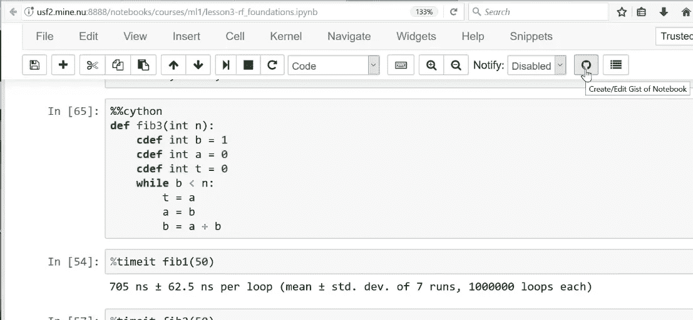

点击那个，给它起个名字，然后点击“公开”。这样就可以将我的 Jupyter 笔记本公开分享。然后我可以复制那个 URL，复制链接位置，然后粘贴到我的论坛帖子中。然后当人们点击它时，他们会立即看到我的笔记本。

现在，这个特定的按钮是一个扩展，所以在 Jupyter 上，您需要点击 Nbextensions，然后点击 Gist-it。当您在那里时，您还应该点击 Collapsible Headings，这是我使用的一个方便的功能，让我可以折叠和展开内容。

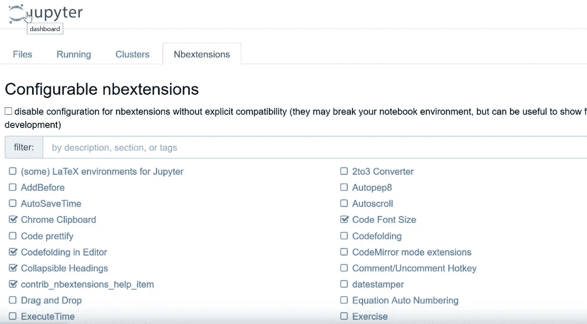

如果您打开 Jupyter 时没有看到这个 Nbextensions 按钮，那么只需搜索 Jupyter Nbextensions — 它会告诉您如何使用 pip 安装并设置它。

## 神经网络广义定义 [[1:23:20](https://youtu.be/O5F9vR2CNYI?t=1h23m20s)]

[笔记本](https://github.com/fastai/fastai/blob/master/courses/ml1/lesson4-mnist_sgd.ipynb)

除了作业之外，我们已经完成了随机森林，直到下一个课程，当你看到 GBMs 时，我们已经完成了决策树集成。我们将转向广义的神经网络。神经网络将使我们能够超越随机森林的最近邻方法。所有随机森林能做的就是对已经看到的数据进行平均。它不能外推或计算。线性回归可以计算和外推，但只能以非常有限的方式。神经网络给我们带来了两全其美的好处。

我们将从将它们应用于非结构化数据开始。非结构化数据指的是像素、声波振幅或单词 - 数据中所有列中的所有内容都是相同类型，而不是数据库表中有收入、成本、邮政编码和州名（结构化数据）。我们也将用它来处理结构化数据，但稍后再做。非结构化数据稍微容易一些，也是更多人长期以来一直在应用深度学习的领域。

如果您也在学习深度学习课程，您会发现我们将从两个不同的方向接近相同的结论。因此，深度学习课程从解决复杂的卷积神经网络开始，使用复杂的优化方案，我们将逐渐深入了解它们的工作原理。而机器学习课程则更多地从随机梯度下降的实际工作原理开始，我们可以用单层来创建逻辑回归等内容。当我们添加正则化时，它如何给我们提供岭回归、弹性网络套索等内容。当我们添加更多层时，它如何让我们处理更复杂的问题。在这个机器学习课程中，我们只会看到全连接层，我认为下个学期与 Yannet 一起，您可能会看到一些更复杂的方法。因此，这个机器学习课程中，我们将更多地关注矩阵的实际运算过程，而深度学习则更多地关注如何以世界级水平解决真实世界的深度学习问题的最佳实践。

下周，我们将研究经典的 MNIST 问题，即如何识别数字。如果你感兴趣，你可以提前尝试使用随机森林来解决这个问题，你会发现效果不错。考虑到随机森林基本上是一种最近邻的类型（它在树空间中找到最近的邻居），那么随机森林绝对可以识别出这个 9，这些像素与我们在其他图像中看到的像素相似，而且平均来说，它们也是 9。因此，它绝对可以使用随机森林解决这类问题。但我们最终会受到数据限制，因为每次我们增加一个决策点，我们的数据大致减半，所以这就限制了我们可以进行的计算量。而神经网络，我们将能够使用大量的参数，通过我们将学习的正则化技巧，我们将能够进行大量的计算，实际上我们几乎没有什么限制可以计算的结果。

祝你在随机森林解释方面好运，下次再见。
