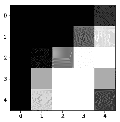
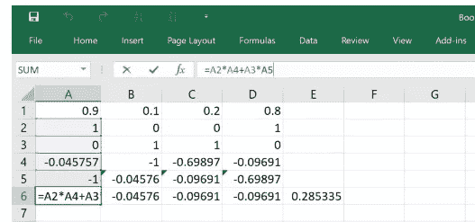
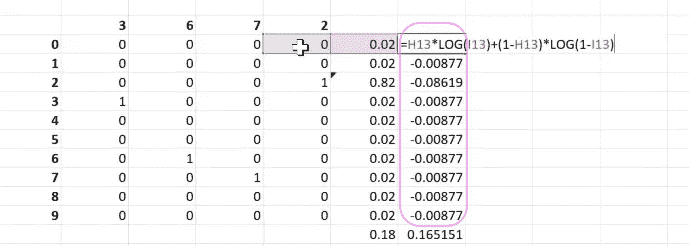

# 机器学习 1：第 8 课

> 原文：[`medium.com/@hiromi_suenaga/machine-learning-1-lesson-8-fa1a87064a53`](https://medium.com/@hiromi_suenaga/machine-learning-1-lesson-8-fa1a87064a53)

*来自*[*机器学习课程*](http://forums.fast.ai/t/another-treat-early-access-to-intro-to-machine-learning-videos/6826/1)*的个人笔记。随着我继续复习课程以“真正”理解它，这些笔记将继续更新和改进。非常感谢*[*Jeremy*](https://twitter.com/jeremyphoward)*和*[*Rachel*](https://twitter.com/math_rachel)*给了我这个学习的机会。*

# 广义定义的神经网络

[视频](https://youtu.be/DzE0eSdy5Hk) / [笔记本](https://github.com/fastai/fastai/blob/master/courses/ml1/lesson4-mnist_sgd.ipynb)

正如我们在上一课结束时讨论的那样，我们正在从决策树集成转向广义定义的神经网络。如你所知，随机森林和决策树受到一个限制，即它们基本上只是在做最近邻。它们所能做的就是返回一堆其他点的平均值。因此，它们无法外推，如果你在考虑如果我将价格提高 20%，而你以前从未定价到那个水平，或者明年的销售情况会发生什么，显然我们以前从未见过明年，外推是非常困难的。它也很难，因为它只能做大约对数 2 的 N 次决策，所以如果有一个时间序列需要拟合，需要 4 步才能到达正确的时间区域，然后突然它没有多少决策可以做了，所以它可以做的计算量有限。因此，它可以建模的关系复杂度有限。

**问题**：我可以问一个关于随机森林的另一个缺点吗？如果我们有一个数据作为分类变量，这些变量不是按顺序排列的，对于随机森林，我们对它们进行编码并将它们视为数字，假设我们有 20 个基数，那么随机森林给出的分割结果可能是小于 5 或小于 6。但如果类别不是按顺序排列（即没有任何顺序），那意味着什么？所以如果你有，比如说，让我们回到推土机，EROPS，带空调的 EROPS，OROPS，N/A 等，我们任意地将它们标记为 0 到 3。实际上我们知道真正重要的是是否有空调。那会发生什么？基本上它会说，如果我将 EROPS w A/C 和 OROPS 组合在一起，将 N/A 和 EROPS 组合在一起，这是一个有趣的分割，因为碰巧所有带空调的都会最终出现在右侧。做完这一步后，它会进一步注意到在 EROPS w A/C 和 OROPS 组中，它还需要将其进一步分成两组。最终它会到达那里。它会提取带有空调的类别。只是它需要更多的分割，比我们理想中希望的要多。所以这有点类似于它要建模一条线，只能通过大量分割并且只是近似地完成。

**后续问题**：那么随机森林对于不是连续的类别也可以吗？是的，它可以。只是在某些方面它不够理想，因为我们需要做比我们想要的更多的分割点，但它可以做到。它做得相当不错。因此，尽管随机森林确实存在一些缺陷，但它们非常强大，特别是因为它们几乎没有假设，所以很难出错。用随机森林赢得 Kaggle 比赛有点困难，但很容易进入前 10%。因此，在现实生活中，通常第三位小数并不是很重要，随机森林通常是你最终会做的事情。但对于像厄瓜多尔杂货比赛这样的事情，用随机森林很难得到好的结果，因为有一个巨大的时间序列组件，几乎所有的东西都是这两个大规模高基数的分类变量，即店铺和商品。因此，甚至没有太多的层可以用随机森林，每对店铺之间的差异在不同方面都是不同的，因此有一些事情即使对于随机森林来说也很难得到相对好的结果。

另一个例子是识别数字。你可以用随机森林得到可以接受的结果，但最终，空间结构之间的关系变得重要。你可能想要能够进行像查找边缘或其他计算一样的计算，这些计算会在计算中继续进行。因此，仅仅做一个聪明的最近邻类似于随机森林的方法并不理想。所以对于这样的事情，神经网络是理想的。神经网络被证明对于像厄瓜多尔杂货比赛（即通过店铺和商品预测销售额）和识别数字这样的事情非常有效。所以在这两个事情之间，神经网络和随机森林，我们覆盖了领域。我很长一段时间以来一直没有使用除了这两个方法之外的任何其他方法。在某个时候，我们将学习如何将这两种方法结合起来，因为你可以以非常酷的方式将它们结合起来。

## MNIST [[6:37](https://youtu.be/DzE0eSdy5Hk?t=6m37s)]


这是 Adam Geitgey 的一张图片。一张图片只是一堆数字，每个数字都是从 0 到 255，暗的接近 255，亮的接近 0。这是来自 MNIST 数据集的一个数字的例子。MNIST 是一个非常古老的，就像神经网络的 hello world 一样。所以这是一个例子。


这里有 28x28 个像素。如果是彩色的话，会有三个 —— 一个红色的，一个绿色的，一个蓝色的。我们的任务是查看数字数组并弄清楚这是一个棘手的数字 8。我们如何做到这一点？

我们将使用一小部分 FastAI 的内容，并逐渐去除更多，直到最后，我们将从头开始实现自己的神经网络，自己的训练循环，以及自己的矩阵乘法。因此，我们将逐渐深入挖掘更多。

## 数据 [[7:54](https://youtu.be/DzE0eSdy5Hk?t=7m54s)]

```py
from fastai.imports import *
from fastai.torch_imports import *
from fastai.io import *path = 'data/mnist/'import os
os.makedirs(path, exist_ok=True)
```

MNIST 的数据，这个非常著名的数据集的名称，可以从这里获取：

```py
URL='http://deeplearning.net/data/mnist/'
FILENAME='mnist.pkl.gz'def load_mnist(filename):
   return pickle.load(gzip.open(filename, 'rb'), encoding='latin-1')
```

我们在 `fastai.io` 中有一个叫做 `get_data` 的东西，它会从 URL 中获取数据并将其存储在你的计算机上，除非它已经存在，否则它将继续使用它。我们这里有一个叫做 `load_mnist` 的小函数，它简单地加载数据。你会看到它是压缩的，所以我们可以使用 Python 的 gzip 来打开它。然后它也被 pickled，所以如果你有任何类型的 Python 对象，你可以使用这个内置的 Python 库叫做 `pickle` 来将其转储到你的磁盘上，分享它，稍后加载它，你会得到与开始时相同的 Python 对象。你已经看到了类似于 Pandas 的 feather 格式的东西。Pickle 不仅仅适用于 Pandas，也不仅仅适用于任何东西，它基本上适用于几乎每个 Python 对象。这可能会引发一个问题，为什么我们不为 Pandas 的 DataFrame 使用 pickle。答案是 pickle 适用于几乎每个 Python 对象，但对于几乎任何 Python 对象来说，它可能不是最佳选择。因此，因为我们正在查看具有超过一亿行的 Pandas DataFrames，我们真的希望快速保存，所以 feather 是专门为此目的设计的格式，因此它会非常快速地完成。如果我们尝试 pickle 它，那将需要更长的时间。另外请注意，pickle 文件仅适用于 Python，因此你不能将它们交给其他人，而 feather 文件可以传递。所以值得知道 pickle 的存在，因为如果你有一些字典或某种对象漂浮在周围，你想要稍后保存或发送给其他人，你总是可以将其 pickle 化。所以在这种特殊情况下，deeplearning.net 的人们很友好地提供了一个 pickled 版本。

Pickle 随着时间的推移有些变化，所以像这样的旧 pickle 文件（这是 Python 2 的一个），你实际上必须告诉它是使用这个特定的 Python 2 字符集编码的。但除此之外，Python 2 和 3，你通常可以打开彼此的 pickle 文件。

```py
get_data(URL+FILENAME, path+FILENAME)
((x, y), (x_valid, y_valid), _) = load_mnist(path+FILENAME)
```

一旦我们加载了这个，我们就像这样加载 `((x, y), (x_valid, y_valid), _)`。所以我们这里正在做的事情叫做解构。解构意味着 `load_mnist` 给我们返回了一个元组的元组。如果在等号的左边有一个元组的元组，我们可以填充所有这些内容。所以我们得到了一个训练数据的元组，一个验证数据的元组，以及一个测试数据的元组。在这种情况下，我不关心测试数据，所以我把它放到一个名为 `_` 的变量中，Python 的人们倾向于认为这是一个特殊的变量，我们把要丢弃的东西放进去。它实际上并不特殊，但非常常见。如果你看到有东西被赋值给下划线，那可能意味着你只是要丢弃它。

顺便说一下，在 Jupyter 笔记本中它确实有一个特殊的含义，即你计算的最后一个单元格始终在下划线中可用。但这是一个独立的问题。

然后元组中的第一件事本身就是一个元组，所以我们将把它放入 x 和 y 中作为我们的训练数据，然后第二个元组放入 x 和 y 中作为我们的验证数据。所以这就是所谓的解构，它在许多语言中都很常见。有些语言不支持它，但那些支持的语言，生活会变得更容易。一旦我看到一些新的数据集，我就会查看我得到了什么。它是什么类型？Numpy 数组。它的形状是什么？50,000 x 784。那么因变量呢？那是一个数组，它的形状是 50,000。

```py
type(x), x.shape, type(y), y.shape(numpy.ndarray, (50000, 784), numpy.ndarray, (50000,))
```

我们之前看到的 8 的图像不是长度为 784，而是大小为 28 乘以 28。所以这里发生了什么？事实证明，他们只是将第二行连接到第一行，将第三行连接到第二行，将第四行连接到第三行。换句话说，他们将整个 28 乘以 28 展平成一个单一的一维数组。这有意义吗？所以它的大小将是 28²。这绝对不是正常的，所以不要认为你看到的一切都会是这样。大多数时候，当人们分享图像时，他们会将它们分享为 JPEG 或 PNG 格式，你加载它们，你会得到一个漂亮的二维数组。但在这种特殊情况下，出于某种原因，他们拿出来的东西被展平成了 784。这个“展平”这个词在处理张量时非常常见，所以当你展平一个张量时，这意味着你将它转换为比你开始的更低秩的张量。在这种情况下，我们为每个图像开始时是一个秩为 2 的张量（即矩阵），然后我们将每个图像转换为一个秩为 1 的张量（即向量）。所以整体来说，整个东西是一个秩为 2 的张量，而不是一个秩为 3 的张量。

所以只是为了提醒我们这里的行话，这在数学中我们会称之为向量。在计算机科学中，我们会称之为一维数组，但是因为深度学习的人们必须表现得比其他人更聪明，我们不得不称之为秩为 1 的张量。它们基本上意思相同，除非你是物理学家——在这种情况下，这意味着其他事情，你会对深度学习的人们感到非常生气，因为你会说“这不是张量”。所以就是这样。不要责怪我。这只是人们说的话。


所以这要么是一个矩阵，要么是一个二维数组，要么是一个秩为 2 的张量。


一旦我们开始进入三维，我们开始用完数学名字，这就是为什么我们开始友好地说秩为 3 的张量。所以实际上，没有什么特别的关于向量和矩阵使它们比秩为 3 或秩为 4 的张量更重要。所以我尽量不使用向量和矩阵这些术语，因为我真的不认为它们比其他秩的张量更特别。所以习惯将`numpy.ndarray (50,000, 784)`看作秩为 2 的张量是很好的。

然后是行和列。如果我们是计算机科学人员，我们会称之为零维和一维。但如果我们是深度学习人员，我们会称之为轴零和轴一。然后为了更加混淆，如果你是一个图像人员，列是第一个轴，行是第二个轴。


所以如果你想到电视，1920 乘以 1080——列乘以行。其他人包括深度学习和数学家，行乘以列。所以如果你使用 Python 图像库，你会得到列乘以行；几乎其他所有情况，行乘以列。所以要小心。[一个学生问“为什么他们这样做？”]因为他们讨厌我们，因为他们是坏人，我猜😆

在深度学习中有很多，许多不同领域汇集在一起，如信息论、计算机视觉、统计学、信号处理，最终形成了深度学习中的这种混杂的命名法。通常，每个版本的事物都会被使用，所以今天，我们将听到一些被称为负对数似然或二项式或分类交叉熵的东西，这取决于你来自哪里。我们已经看到了一些被称为独热编码或虚拟变量的东西，这取决于你来自哪里。实际上，这只是相同的概念在不同领域中有点独立地被发明，最终它们找到了通往机器学习的道路，然后我们不知道该如何称呼它们，所以我们称它们为以上所有的东西——就像这样。所以我认为这就是计算机视觉中的行和列发生的事情。

## 归一化

有这样一个概念，即对数据进行归一化，即减去均值并除以标准差。一个问题给你。通常，归一化数据很重要，这样我们就可以更容易地训练模型。你认为在训练随机森林时，归一化独立变量是否重要呢？

学生：老实说，我不知道为什么我们不需要归一化，我只知道我们不需要。

好的，有人想想为什么吗？真正的关键是，当我们决定在哪里分割时，唯一重要的是顺序。就像唯一重要的是它们是如何排序的，所以如果我们减去均值除以标准差，它们仍然按相同的顺序排序。所以记住当我们实现随机森林时，我们说对它们进行排序，然后完全忽略值。我们只是说现在一次添加一个来自依赖变量的东西。所以随机森林只关心独立变量的排序顺序。它们根本不关心它们的大小。这就是为什么它们对异常值非常免疫的原因，因为它们完全忽略了它是异常值，它们只关心哪个比其他东西更高。所以这是一个重要的概念。它不仅出现在随机森林中。它也出现在一些指标中。例如，ROC 曲线下面积，你会经常遇到，ROC 曲线下面积完全忽略了比例，只关心排序。当我们做树状图时，我们看到了另一种情况。斯皮尔曼相关是一种秩相关——只关心顺序，不关心比例。所以随机森林的许多美好之处之一是我们可以完全忽略许多这些统计分布问题。但是对于深度学习来说不行，因为在深度学习中，我们试图训练一个参数化模型。所以我们需要对数据进行归一化。如果不这样做，那么创建一个有效训练的网络将会更加困难。

所以我们抓取我们训练数据的均值和标准差，减去均值，除以标准差，这给我们一个均值为零，标准差为一的结果。

```py
mean = x.mean()
std = x.std()

x=(x-mean)/std
mean, std, x.mean(), x.std()*(0.13044983, 0.30728981, -3.1638146e-01, 0.99999934)*
```

现在对于我们的验证数据，我们需要使用训练数据的标准差和均值。我们必须以相同的方式对其进行标准化。就像分类变量一样，我们必须确保它们的相同索引映射到随机森林中的相同级别。或者缺失值，我们必须确保在替换缺失值时使用相同的中位数。你需要确保你在训练集中做的任何事情，在测试和验证集中都要完全相同。所以在这里，我减去了训练集的均值并除以训练集的标准差，所以这不是完全是零和一，但它非常接近。总的来说，如果你发现你在验证集或测试集上尝试某些东西，而它比你的训练集差得多得多，那可能是因为你以不一致的方式进行了标准化或编码类别或其他一些不一致的方式。

```py
x_valid = (x_valid-mean)/std
x_valid.mean(), x_valid.std()*(-0.0058509219, 0.99243325)*
```

## 查看数据[[22:03](https://youtu.be/DzE0eSdy5Hk?t=1323)]

让我们来看一下这些数据。所以我们在验证集中有 10,000 张图像，每张图像都是长度为 784 的秩为 1 的张量。

```py
x_valid.shape(10000, 784)
```

为了显示它，我想将它转换为一个 28x28 的秩为 2 的张量。Numpy 有一个 reshape 函数，它接受一个张量并将其重塑为你请求的任何大小的张量。现在如果你考虑一下，你只需要告诉它有*D*个轴，你只需要告诉它你想要的*D-1*个轴，因为最后一个，它可以自己算出来。所以总共，这里一共有 10,000 乘以 784 个数字。所以如果你说我希望我的最后一个轴是 28x28，那么你可以算出（第一个轴）这必须是 10,000，否则它就不会适合。所以如果你放-1，它会说让它尽可能大或尽可能小以使其适合。所以你可以看到，它算出来必须是 10,000。你会看到这种方法在神经网络软件的预处理中经常使用。我可以在这里写 10,000，但我试图养成一种习惯，就是每当我提到输入中有多少项时，我倾向于使用-1，因为这意味着以后我可以使用子样本，这段代码不会出错。如果它是不平衡的，我可以进行一些分层抽样，这段代码不会出错。所以通过在这里使用-1 这种大小，它使得以后的更改更具弹性。这是一个很好的习惯。

```py
x_imgs = np.reshape(x_valid, (-1,28,28)); x_imgs.shape(10000, 28, 28)
```

能够取张量并重新塑形、改变轴线等等的想法是你需要能够完全不假思索地做到的[[23:56](https://youtu.be/DzE0eSdy5Hk?t=1436)]。因为这种情况会经常发生。比如，这里有一个例子。我尝试读取一些图像，它们是扁平化的，我需要将它们重新塑形成一堆矩阵——好的，重新塑形。我用 OpenCV 读取了一些图像，结果发现 OpenCV 按照蓝绿红的顺序排列通道，其他所有的都希望它们是红绿蓝的。我需要颠倒最后一个轴。如何做到这一点？我用 Python 图像库读取了一些图像。它将它们读取为行、列、通道，PyTorch 希望通道、行、列。我该如何转换。所以这些都是你需要能够不假思索地做到的事情，就像立刻就能做到。因为这种情况经常发生，你绝不想坐在那里想了很久。所以确保你在这一周花很多时间练习今天你将看到的所有东西：重新塑形、切片、重新排序维度等等。所以最好的方法是自己创建一些小张量，开始思考，比如我应该尝试什么。

问题：在归一化时，您说许多机器学习算法在数据归一化时表现更好，但您也刚刚说过尺度并不重要？我说对于随机森林来说并不重要。因此，随机森林只会根据顺序输出结果，所以我们喜欢它们。我们喜欢随机森林是因为它们对分布假设不太担心。但我们现在不是在做随机森林，我们在做深度学习。而深度学习确实会在乎尺度。

问题：如果我们有参数化，那么我们应该进行尺度调整。如果我们有非参数化，我们就不需要进行尺度调整？不完全是这样。因为像 k 最近邻是非参数化的，尺度很重要，所以我会说涉及树的事情通常只会在某个点进行分割，所以你可能不在乎尺度，但你可能需要考虑这是一个使用顺序还是使用具体数字的算法。

问题：您能直观解释一下为什么它需要尺度吗，因为这可能会澄清一些问题？直到我们开始进行随机梯度下降时才需要，所以我们会讲到那一点。所以现在，我们只能说相信我的话。

问题：您能解释一下尺度是什么意思吗？因为当我想到尺度时，我认为所有数字应该大致相同大小。在我们进行深度学习时，猫和狗的情况是这样的，你可能有一只小猫和一只大猫，但它仍然知道它们都是猫？我想这是语言被重载的问题之一。在计算机视觉中，当我们对图像进行缩放时，实际上是增加了猫的大小。在这种情况下，我们正在缩放实际的像素值。因此，在这两种情况下，缩放意味着使某物变大和变小。在这种情况下，我们将数字从零到 255，并使它们的平均值为零，标准差为一。

问题：您能解释一下是按列还是按行？一般来说，当您进行缩放时，不仅仅考虑图像，而是输入到机器学习的内容。好的，当然。这有点微妙，但在这种情况下，我只有一个平均值和一个标准差。所以基本上，平均有多少黑色。因此，平均而言，我们有一个平均值和一个标准差跨越所有像素。在计算机视觉中，我们通常会按通道进行操作，所以通常会有一个数字代表红色，一个数字代表绿色，一个数字代表蓝色。一般来说，您需要为每个您希望表现不同的事物准备不同的归一化系数。因此，如果我们像处理一个结构化数据集，其中包括收入、公里数和孩子数量，您需要为这些事物准备三个单独的归一化系数，因为它们是非常不同的事物。因此，在这里有点领域特定。在这种情况下，所有像素都是灰度级别，因此我们只有一个缩放数字。而在其他情况下，如果它们是红色与绿色与蓝色，您需要以不同方式缩放这些通道。

问题：所以我有点难以想象如果在这种情况下不进行归一化会发生什么。我们会讨论到那里。这就是 Yannet 所说的为什么我们要归一化的原因，目前我们正在归一化是因为我说我们必须这样做。当我们开始研究随机梯度下降时，我们基本上会发现，如果你...基本上为了稍微提前一点，我们将会通过一堆权重进行矩阵乘法。我们将以这样一种方式选择这些权重，以便当我们进行矩阵乘法时，我们将尝试保持数字与它们最初的规模相同。这基本上需要我们知道初始数字的规模。因此，如果我们知道它们一直是均值为零，标准差为一，那么就更容易为许多不同类型的输入创建一个单一的神经网络架构。这将是简短的答案。但我们将学到更多关于它的知识，如果在几节课后你仍然不太明白为什么，让我们回过头来讨论，因为这是一个非常有趣的话题。

问题：我试图可视化我们正在使用的坐标轴。所以在绘图中，当你写`x_valid.shape`时，我们得到了 10,000 乘以 784。这意味着我们带入了那个维度的 10,000 张图片吗？是的，确切地说。问题继续：在下一行，当你选择重塑时，为什么将 28、28 作为 Y 或 Z 坐标？或者它们按照那个顺序有什么原因吗？


是的，有的。几乎所有的神经网络库都假设第一个轴相当于一行。就像一个单独的东西，它是一个句子或一幅图像或销售示例。所以我希望每个图像都是第一个轴的单独项目。然后，这样就为图像的行和列留下了另外两个轴。这是完全标准的。我认为我从来没有见过一个不是这样工作的库。

问题：在归一化验证数据时，我看到你使用了 x 数据的均值和标准差（即训练数据）。我们不应该使用验证数据的均值和标准差吗？不，因为你看，那样的话，你将使用不同的数字对验证集进行归一化，因此现在这个像素的值在验证集中的含义与在训练集中的含义不同。这就好像如果我们将一周的天数编码，使得星期一在训练集中是 1，在验证集中是 0。现在我们有了两组不同的数据，其中相同的数字具有不同的含义。

让我举个例子。假设我们正在处理全彩色图像，我们的训练集包含绿色青蛙、绿色蛇和灰色大象。我们正在训练以弄清楚它们各自是什么。然后我们使用每个通道的均值进行了归一化。然后我们有一个验证集和一个测试集，里面只有绿色青蛙和绿色蛇。如果我们使用验证集的统计数据进行归一化，我们最终会说平均而言都是绿色。所以我们会去除所有的绿色，因此我们现在将无法有效地识别绿色青蛙和绿色蛇。所以我们实际上希望使用我们训练时使用的相同的归一化系数。对于那些正在学习深度学习课程的人，我们实际上做得更多。当我们使用预训练的网络时，我们必须使用原始作者训练时使用的相同的归一化系数。因此，这个数字在你使用它的每个数据集中都需要有一致的含义。这意味着当你查看测试集时，你需要根据训练集的均值和标准差对测试集进行归一化。

```py
show(x_imgs[0], y_valid[0])
```


所以验证 y 值只是一个长度为 10,000 的秩为 1 的张量。记住这是一种奇怪的 Python 事情，一个包含这一个东西的元组需要一个尾随逗号。所以这是一个长度为 10,000 的秩为 1 的张量。

```py
y_valid.shape(10000,)
```

这里有一个例子。只是一个数字 3。这就是我们的标签。

```py
y_valid[0]3
```

## 切片

这里是另一件你需要能够做到熟练的事情。切片成一个张量。在这种情况下，我们用 0 切片到第一个轴，这意味着我们正在获取第一个切片。因为这是一个单一数字，这将减少张量的秩一次。它将把一个 3 维张量变成一个 2 维张量。所以你可以看到，这现在只是一个矩阵。然后我们将抓取 10 到 14 行，10 到 14 列，这就是它。所以这是你需要非常熟练的事情——抓取片段，查看数字，查看图片。

```py
x_imgs[0,10:15,10:15]array([[-0.42452, -0.42452, -0.42452, -0.42452,  0.17294],
       [-0.42452, -0.42452, -0.42452,  0.78312,  2.43567],
       [-0.42452, -0.27197,  1.20261,  2.77889,  2.80432],
       [-0.42452,  1.76194,  2.80432,  2.80432,  1.73651],
       [-0.42452,  2.20685,  2.80432,  2.80432,  0.40176]], dtype=float32)
```

这里是第一张图像的一小部分的例子。所以你应该习惯这样的想法，如果你在处理像图片或音频这样的东西，这是你的大脑真的很擅长解释的东西。所以尽可能经常展示你正在做的事情的图片。但也记住在幕后它们是数字，所以如果出现奇怪的情况，打印出一些实际的数字。你可能会发现其中一些变成了无穷大，或者它们全都是零，或者其他什么。所以在探索数据时利用这个交互式环境。

问题：只是一个快速的语义问题。为什么当它是一个秩为 3 的张量时，它被存储为 XYZ 而不是对我来说，将它存储为 2D 张量的列表会更有意义？它不是存储为任何一种。所以让我们把这看作是一个 3D。这里是一个 3D。所以一个 3D 张量被格式化为基本上显示一系列 2D 张量。


问题：但为什么不像`x_imgs[0][10:15][10:15]`那样？哦，因为那有不同的含义。这就是张量和不规则数组之间的区别。所以基本上如果你做类似`a[2][3]`这样的事情，那就是说取第二个列表项，然后从中获取第三个列表项。所以当我们有一个叫做不规则数组的东西时，我们倾向于使用这种方式，其中每个子数组的长度可能不同。而在其他情况下，我们有一个三维的单一对象。所以我们试图说我们想要它的哪一小部分。所以这个想法是一个单一的切片对象去抓取那一部分出来。


```py
show(x_imgs[0,10:15,10:15])
```



```py
plots(x_imgs[:8], titles=y_valid[:8])
```


这里有一些图像及其标签的例子。这种东西，你希望能够用 matplotlib 很快地完成。这将帮助你很多，这样你就可以看看 Rachel 在写`plots`时写的东西。我们可以使用 add_subplot 来创建这些小的独立图。你需要知道`imshow`是我们如何将一个 numpy 数组绘制成图片的。然后我们还添加了顶部的标题。所以就是这样。

```py
def show(img, title=None):
    plt.imshow(img, cmap="gray")
    if title is not None: plt.title(title)def plots(ims, figsize=(12,6), rows=2, titles=None):
    f = plt.figure(figsize=figsize)
    cols = len(ims)//rows
    for i in range(len(ims)):
        sp = f.add_subplot(rows, cols, i+1)
        sp.axis('Off')
        if titles is not None: sp.set_title(titles[i], fontsize=16)
        plt.imshow(ims[i], cmap='gray')
```

## 神经网络

让我们拿这些数据来尝试构建一个神经网络。对于那些已经在进行深度学习的人来说，这将是很多复习。神经网络实际上只是一个特定的数学函数或数学函数类，但它是一个非常重要的类，因为它具有支持所谓的通用逼近定理的属性。这意味着神经网络可以任意接近地逼近任何其他函数。换句话说，理论上，只要我们使它足够大，它就可以做任何事情。这与只能执行一种特定功能的函数如 3*x* + 5 非常不同。或者只能表示不同斜率的线条上下移动不同量的函数类*ax* + *b*。甚至函数*ax² + bx + c + sin d*也只能表示一个非常具体的关系子集。然而，神经网络是一个可以任意接近地表示任何其他函数的函数。

因此，我们要做的是学习如何取一个函数，比如*ax + b*，并学习如何找到其参数（在这种情况下为*a*和*b*），使其尽可能接近一组数据。这里展示了我们将在深度学习课程中查看的笔记本中的示例，基本上展示了当我们使用称为随机梯度下降来尝试设置*a*和*b*时会发生什么。基本上，我们将从一个随机的*a*和一个随机的*b*开始，然后我们基本上要弄清楚我是否需要增加或减少*a*来使线条接近点？我是否需要增加或减少*b*来使线条接近点？然后只需多次增加和减少*a*和*b*。这就是我们要做的，为了回答是否需要增加或减少*a*和*b*的问题，我们将取导数。因此，函数关于*a*和*b*的导数告诉我们当我们改变*a*和*b*时该函数将如何变化。这基本上就是我们要做的。但我们不会仅仅从一条线开始，想法是我们要逐步建立一个实际上具有神经网络的模型，因此这将是完全相同的想法，但由于它是一个无限灵活的函数，我们将能够使用这个完全相同的技术来适应任意复杂的关系。这基本上就是这个想法。


那么你需要知道的是，神经网络实际上是一件非常简单的事情。神经网络实际上是一个以输入为向量的东西，通过该向量进行矩阵乘积。因此，如果向量的大小为*r*，矩阵为*r*乘以*c*，则矩阵乘积将输出大小为*c*的结果。然后我们进行一种称为非线性的操作，基本上是我们要丢弃所有负值（即`max(0, x)`）。然后我们将通过另一个矩阵乘法，再通过另一个`max(0, x)`，再通过另一个矩阵乘法，直到最终得到我们想要的单个向量。换句话说，我们神经网络的每个阶段，关键的事情是进行矩阵乘法，换句话说，是一个线性函数。因此，基本上，深度学习中大部分的计算是大量的线性函数，但在每个线性函数之间，我们将用零替换负数。


问题：为什么我们要丢弃负数？我们将看到。简短的答案是，如果你对一个线性函数应用另一个线性函数，它仍然只是一个线性函数。所以这完全没有用。但是如果你丢弃负数，那实际上是一个非线性转换。结果表明，如果你对我们丢弃的负数应用一个线性函数，然后将其应用于创建神经网络的线性函数，结果就是这个东西可以任意接近任何其他函数。所以这个微小的差异实际上产生了很大的不同。如果你对此感兴趣，请查看我们涵盖这一内容的深度学习视频，因为我实际上展示了一个直观的证明，不是我创造的，而是 Michael Nielsen 创造的。或者，如果你想直接跳转到他的网站，你可以访问 Michael Nielsen 的通用逼近定理，他有一个非常好的步骤指南，其中包含许多动画，您可以看到为什么这样运作。

## 为什么你（是的，你）应该写博客

我觉得在互联网上开始技术写作最困难的事情就是发布你的第一篇文章。在这篇博客中，Rachel 实际上说她给年轻自己的最好建议是尽早开始写博客。她列举了为什么你应该这样做的原因，她写博客的一些地方对她和她的职业都很有帮助，以及一些如何开始的建议。

我记得当我第一次建议 Rachel 考虑写博客时，因为她有很多有趣的事情要说，起初她对自己能写博客这个想法感到有些惊讶。现在人们在会议上走过来对我们说：“你是 Rachel Thomas！我喜欢你的文章！”所以我看到了从“哇，我能写博客吗？”到被认为是一位优秀的技术作者的过渡。所以如果你仍然需要说服，或者想知道如何开始，请查看这篇文章。因为第一篇是最难的，也许你的第一篇应该是对你来说非常容易写的东西。所以可以是这样的，这是我们机器学习课程第 3 课的前 15 分钟的摘要 - 这是有趣的地方，这是我们学到的东西。或者可以是这样的，这是我如何使用随机森林解决实习中的特定问题的摘要。

我经常被问到“哦，我的实习，我的组织，我们有敏感的商业数据” - 没关系。只需找到另一个数据集，然后在那个数据集上进行操作以展示示例，或者对所有值进行匿名化并更改变量的名称等。您可以与雇主或实习合作伙伴交谈，以确保他们对您写的任何内容感到舒适。总的来说，人们喜欢他们的实习生写博客，讲述他们正在做的事情，因为这让他们看起来很酷。就像“嘿，我是在这家公司实习的，我写了这篇关于我所做的酷分析的文章”，然后其他人会说哇，这看起来是一家很棒的公司。一般来说，你会发现人们非常支持。此外，有很多数据集可用，所以即使您不能以您正在进行的工作为基础，您也肯定可以找到类似的东西。

## PyTorch

我们将开始构建我们的神经网络。我们将使用一个叫做 PyTorch 的东西来构建它。PyTorch 是一个基本上看起来很像 numpy 的库。但是当你用 PyTorch 创建一些代码时，你可以在 GPU 上运行它而不是 CPU。所以 GPU 基本上可能会比你为 CPU 编写的代码快至少一个数量级，可能是数百倍，特别是涉及大量线性代数的东西。所以在深度学习、神经网络中，如果你没有 GPU，你可以在 CPU 上做，但会非常慢。Mac 没有我们可以用于这个的 GPU，因为我们需要 NVIDIA GPU。我实际上更希望我们可以使用你的 Mac，因为竞争是很好的。但 NVIDIA 确实是第一个创建支持通用图形编程单元（GPGPU）的 GPU 的公司，换句话说，这意味着使用 GPU 进行除了玩电脑游戏以外的事情。他们创建了一个叫做 CUDA 的框架。这是一个非常好的框架，在深度学习中几乎被普遍使用。如果你没有 NVIDIA GPU，你就不能使用它，目前没有任何 Mac 有 NVIDIA GPU。任何类型的大多数笔记本电脑都没有 NVIDIA GPU。如果你有兴趣在笔记本电脑上进行深度学习，好消息是你需要购买一台非常适合玩电脑游戏的笔记本电脑。有一个地方叫做[XOTIC PC Gaming Laptops](https://www.xoticpc.com/)，你可以去那里购买一台适合进行深度学习的优秀笔记本电脑。你可以告诉你的父母，你需要这笔钱来进行深度学习。你通常会发现一大堆带有 predator 和 viper 等名称的笔记本电脑，上面有机器人和其他东西的图片。无论如何，话虽如此，我不认识很多人在笔记本电脑上做很多深度学习的。大多数人会登录到云环境中。我知道的最容易使用的是[Crestle](https://www.crestle.com/)。使用 Crestle，你基本上可以注册，然后立即得到的第一件事就是你被直接投入到一个 jupyter 笔记本中。它支持 GPU，每小时 60 美分，所有 Fast AI 库和数据都已经可用。这使得生活变得非常容易。它比使用亚马逊网络服务选项的 AWS less 灵活，某些方面也不那么快。它的成本稍微高一点，每小时 90 美分而不是 60 美分。但很可能你的雇主已经在使用它，了解一下也是好的。他们在 GPU 周围有更多不同的选择，这是一个不错的选择。如果你是学生，可以搜索 github 学生包，你可以立即获得 150 美元的信用额度。所以这是一个开始的好方法。

**问题**：我想知道你对英特尔最近发布的一种提升常规软件包的开源方式的看法，他们声称这相当于使用底层 GPU。在你的 CPU 上，如果你使用他们的提升软件包，你可以获得相同的性能。实际上，英特尔制作了一些很棒的数值编程库，特别是这个叫做 MKL 的库，矩阵核心库。它们确实比不使用这些库更快，但如果你看一下性能随时间变化的图表，GPU 在过去 10 年中一直保持着大约每秒 10 次浮点运算，现在也是如此，而且通常价格只有相同性能的 CPU 的 1/5。因此，几乎所有进行深度学习的人基本上都是在 NVIDIA GPU 上进行的，因此使用除了 NVIDIA GPU 之外的任何东西目前都非常烦人——更慢、更昂贵、更烦人。我真的希望在这个领域尤其是在 AMD GPU 周围会有更多的活动，但 AMD 确实需要多年的追赶，所以可能需要一段时间。

**评论**：我只是想指出，你也可以购买一个 GPU 扩展器连接到笔记本电脑，这可能是在购买新笔记本电脑或 AWS 之前的第一步解决方案[[52:46](https://youtu.be/DzE0eSdy5Hk?t=3166)]。是的，我认为大约$300 左右，你可以购买一个插入到你的 Thunderbolt 端口的东西，如果你有一台 Mac，然后再花$500 或$600，你可以购买一个 GPU 插入其中。话虽如此，大约$1000，你就可以创建一个相当不错的基于 GPU 的台式机，所以如果你在考虑这个，Fast AI 论坛有很多帖子，人们在特定价格点上互相帮助。

总之，我建议一开始使用 Crestle，然后当你准备好投入一些额外的时间时，使用 AWS。要使用 AWS，当你到达那里时，去 EC2。AWS 上有很多东西，EC2 是我们可以按小时租用计算机的部分。


现在，我们需要一个基于 GPU 的实例。不幸的是，当你第一次注册 AWS 时，他们不会给你访问权限。所以去到 Limits（左上角）。


我们将使用的主要 GPU 实例称为 p2。所以滚动到 p2.xlarge，你需要确保数字不是零。如果你刚刚注册了一个新账户，它可能是零，这意味着你将无法创建一个。所以你必须去“请求限制增加”，其中的诀窍是当它问你为什么要增加限制时，输入“fast.ai”，因为 AWS 知道要留意，他们知道 fast.ai 的人是好人，所以他们会很快处理。通常需要一两天的时间。


所以一旦你收到批准使用 p2 实例的邮件，你就可以回到这里并点击 Launch Instance：


我们基本上设置了一个拥有一切你需要的东西。所以如果你点击 Community AMIs，AMI 是 Amazon Machine Image 的缩写——它基本上是一个完全设置好的计算机。所以如果你输入 fastai（连在一起），你会在这里找到 fastai DL part 1 v2 for p2。所以一切都准备就绪。


所以如果你点击 Select，它会问你想要什么样的计算机。所以我们必须说我想要一个“GPU 计算”类型，具体来说我想要 p2.xlarge。然后你可以点击“Review and Launch”。


我假设你已经知道如何处理 SSH 密钥和所有这些东西。如果你不知道，可以查看我们在线的入门教程和工作坊视频，或者在网上搜索 SSH 密钥。这是一个非常重要的技能。所以希望你通过所有这些，你可以在 GPU 上运行 Fast AI repo。如果你使用 Crestle，只需`cd fastai2`，repo 已经在那里，`git pull`。AWS，`cd fastai`，repo 已经在那里，`git pull`。如果是你自己的电脑，你只需要`git clone`，然后就可以开始了。

PyTorch 是预安装的，所以 PyTorch 基本上意味着我们可以编写看起来很像 numpy 的代码，但在 GPU 上运行速度非常快。其次，由于我们需要知道参数如何移动以改善我们的损失，我们需要知道函数的导数。PyTorch 有这个神奇的功能，任何你使用 PyTorch 库编写的代码，它都可以自动为你计算导数。所以我们在这门课程中不会涉及任何微积分。我在我的课程中从来没有看过微积分，也从来没有在我的工作中计算过导数，因为这些都是由库来完成的。只要你写好 Python 代码，导数就会被计算出来。所以成为一个有效的从业者，你真正需要了解的微积分只是导数是什么意思。你还需要知道链式法则，我们会讲到。

## PyTorch 中的逻辑回归神经网络[[57:45](https://youtu.be/DzE0eSdy5Hk?t=3465)]

好的，所以我们将从上到下开始，创建一个神经网络，并假设很多东西。然后逐渐我们将深入研究每个部分。所以要创建神经网络，我们需要导入 PyTorch 神经网络库。有趣的是，PyTorch 并不叫 PyTorch——它叫 torch。所以`torch.nn`是负责神经网络的 PyTorch 子部分。我们将称之为 nn。我们将从 Fast AI 中导入一些部分，以使我们的生活变得更容易。

```py
from fastai.metrics import *
from fastai.model import *
from fastai.dataset import *

import torch.nn as nn
```

这里是如何在 PyTorch 中创建神经网络的。最简单的神经网络，你说 Sequential。Sequential 意味着我现在要给你一个我想要在我的神经网络中的层的列表。所以在这种情况下，我的列表中有两个东西。第一件事说我想要一个线性层。现在线性层基本上会执行*y = ax + b*，但是矩阵矩阵相乘，而不是单变量。所以它基本上会执行一个矩阵乘积。矩阵乘积的输入将是一个长度为 28 乘以 28 的向量，因为这是我们有多少像素，输出需要是大小为 10（我们稍后会讨论原因）。目前这就是我们如何定义一个线性层。然后，我们将详细讨论这一点，但是几乎每个神经网络中的线性层之后都必须有一个非线性。然后我们将在一会儿学习这个特定的非线性，它被称为 softmax，如果你已经学过深度学习课程，你已经见过这个。这就是我们如何定义一个神经网络。这是一个两层神经网络。

```py
net = nn.Sequential(
    nn.Linear(28*28, 10),
    nn.LogSoftmax()
).cuda()
```

还有一种隐含的额外第一层，即输入层，但是使用 PyTorch，你不必显式提及输入。但通常我们在概念上认为输入图像也是一种层。因为我们正在相当手动地进行操作，使用 PyTorch 我们没有利用 Fast AI 中构建你的东西的任何便利性，我们必须然后写`.cuda()`，这告诉 PyTorch 将这个神经网络复制到 GPU 上。从现在开始，该网络实际上将在 GPU 上运行。如果我们没有说，它将在 CPU 上运行。这给我们返回了一个神经网络——一个非常简单的神经网络。

## 数据[[1:00:22](https://youtu.be/DzE0eSdy5Hk?t=3622)]

然后我们将尝试将神经网络拟合到一些数据上。所以我们需要一些数据。Fast AI 有一个 ModelData 对象的概念，基本上是将训练数据、验证数据和可选的测试数据包装在一起的东西。所以要创建一个 ModelData 对象，你可以这样说：

+   我想创建一些图像分类器数据（`ImageClassifierData`）

+   我将从一些数组中获取它（`from_arrays`）

+   这是我将保存任何临时文件的路径（`path`）

+   这是我的训练数据数组（`（x，y）`）

+   这是我的验证数据数组（`（x_valid，y_valid）`）

这只是返回一个将所有这些包装起来的对象。所以我们将能够拟合到这些数据上。

```py
md = ImageClassifierData.from_arrays(path, (x,y),(x_valid, y_valid))
```

现在我们有了一个神经网络和一些数据，我们将在一会儿回到这里，但基本上我们说我们想使用什么损失函数，想使用什么优化器，然后说拟合[[1:01:07](https://youtu.be/DzE0eSdy5Hk?t=3667)]。

```py
loss=nn.NLLLoss()
metrics=[accuracy]
opt=optim.Adam(net.parameters())
```

我们说将这个网络`net`拟合到这个数据`md`上，每次遍历每个图像一次（`n_epochs`），使用这个损失函数`loss`，这个优化器`opt`，并打印出这些指标`metrics`。

```py
fit(net, md, n_epochs=1, crit=loss, opt=opt, metrics=metrics)
```


这里说这是 91.8%的准确率。所以这就是最简单的神经网络。它正在创建一个矩阵乘法，然后是一个非线性，它试图找到这个矩阵的值（`nn.Linear(28*28, 10)`），基本上是尽可能好地拟合数据，最终预测这是 1，这是 9，这是 3。

## 损失函数[[1:02:08](https://youtu.be/DzE0eSdy5Hk?t=3728)]

所以我们需要一些关于“尽可能好”的定义。那个东西的一般术语叫做损失函数。所以损失函数是一个函数，如果这个函数更低，那么就更好。就像随机森林一样，我们有信息增益的概念，我们得选择用什么函数来定义信息增益，我们主要看的是均方根误差。大多数机器学习算法我们称之为类似于“损失”的东西。所以损失是我们如何评分我们有多好的东西。最终，我们将计算损失对我们正在乘以的权重矩阵的导数，以找出如何更新它。

我们将使用一种称为负对数似然损失（`NLLLoss`）的东西。负对数似然损失也被称为交叉熵，它们实际上是一样的。有两个版本，一个称为二元交叉熵或二元负对数似然，另一个称为分类交叉熵。它们是一样的，一个是当你只有一个零或一个依赖时，另一个是如果你有猫、狗、飞机或马，或者 0、1、到 9 等等。所以这里我们有交叉熵的二元版本：

```py
def binary_loss(y, p):
    return np.mean(-(y * np.log(p) + (1-y)*np.log(1-p)))
```

所以这里的定义是`-(y * np.log(p) + (1-y)*np.log(1-p))`。我认为理解这个定义的最简单方法可能是看一个例子。假设我们试图预测猫和狗。1 代表猫，0 代表狗。所以这里，我们有猫、狗、狗、猫（`[1, 0, 0, 1]`）。这是我们的预测（`[0.9, 0.1, 0.2, 0.8]`）。我们说 90%确定是猫，90%确定是狗，80%确定是狗，80%确定是猫。所以我们可以通过调用我们的函数来计算二元交叉熵。

对于第一个，我们有*y=1*，*p=0.9*（即`(1 * np.log(0.9)`，因为第二项被跳过了）。对于第二个，第一部分被跳过（乘以 0），第二部分将是`(1-0)*np.log(0.9)`。换句话说，这个的第一部分和第二部分将给出完全相同的数字，这是有道理的，因为第一个我们说我们对是猫 90%有信心，而实际上是，第二个我们说我们对是狗 90%有信心，而实际上是。所以在每种情况下，损失都来自于我们本可以更有信心。所以如果我们说我们 100%有信心，损失将为零。

```py
acts = np.array([1, 0, 0, 1])
preds = np.array([0.9, 0.1, 0.2, 0.8])
binary_loss(acts, preds)*0.164252033486018*
```

所以让我们在 Excel 中看一下。从顶部行开始：

1.  我们的预测

1.  实际/目标值

1.  1 减去实际/目标值

1.  我们的预测的对数

1.  我们的预测的对数的 1 减

1.  总和



如果你仔细想一想，我希望你在这一周内考虑一下，你可以用一个 if 语句来替换这个(`np.mean(-(y * np.log(p) + (1-y)*np.log(1-p)))`)，而不是 y，因为 y 总是 1 或 0，所以它只会使用`np.log(p)`或`(np.log(1-p)`中的一个。所以你可以用一个 if 语句来替换这个。所以我希望你在这一周内尝试用一个 if 语句来重写这个。

然后看看你是否能将其扩展为分类交叉熵。所以分类交叉熵的工作方式是这样的。假设我们试图预测 3、6、7、2。


所以如果我们试图预测 3，而实际上预测了 5，或者试图预测 3，却意外地预测了 9。5 而不是 3 并不比 9 而不是 3 更好。所以我们实际上不会说实际数字有多远。我们会用不同的方式表达它。换句话说，如果我们试图预测猫、狗、马和飞机。猫和马之间有多远？所以我们会稍微不同地表达这些。与其把它看作是一个 3，不如把它看作是一个在第三个位置上有一个 1 的向量：


不要把它看作是一个 6，让我们把它看作是一个零向量，第 6 个位置是 1。换句话说，独热编码。所以让我们对我们的因变量进行独热编码。这样现在，我们不再试图预测一个数字，而是预测十个数字。让我们预测它是 0 的概率，它是 1 的概率，依此类推。


所以让我们假设我们正在预测 2，这里是我们的分类交叉熵[[1:07:50](https://youtu.be/DzE0eSdy5Hk?t=4070)]。所以它只是在说，这个预测是否正确，有多大偏差，依此类推，对每一个进行计算，然后将它们全部加起来。分类交叉熵与二元交叉熵是相同的。我们只需要将它们加起来跨越所有的类别。



所以尝试将 Python 中的二元交叉熵函数转换为 Python 中的分类交叉熵。也许创建带有 if 语句的版本和带有求和和乘积的版本。

这就是为什么在我们的 PyTorch 中，我们将这个矩阵的输出维度设置为 10，因为当我们将一个有 10 列的矩阵相乘时，我们将得到一个长度为 10 的结果，这正是我们想要的[[1:08:35](https://youtu.be/DzE0eSdy5Hk?t=4115)]。我们想要有 10 个预测。


这就是我们正在使用的损失函数。然后我们可以拟合模型，它会遍历每个图像，这么多次（`epochs`）。所以在这种情况下，它只是查看每个图像一次，并且会根据这些梯度稍微更新那个权重矩阵中的值。


所以一旦我们训练好了，我们就可以用这个模型(`net`)在验证集(`md.val_dl`)上进行`predict`。

```py
preds = predict(net, md.val_dl)
```

现在这会输出一个 10,000 乘以 10 的东西。我们有 10,000 张图像进行验证，实际上每张图像进行 10 次预测。换句话说，每一行都是它是 0 的概率，它是 1 的概率，它是 2 的概率，依此类推。

```py
preds.shape*(10000, 10)*
```

## Argmax [[1:10:22](https://youtu.be/DzE0eSdy5Hk?t=4222)]

在数学中，有一个我们经常做的操作叫做`argmax`。当我说它很常见时，很有趣的是在高中，我从来没有见过 argmax。大一，我也从来没有见过 argmax。但不知何故，大学毕业后，一切都与 argmax 有关。所以有些事情在学校里似乎并没有真正教，但实际上它非常关键。argmax 既是数学中的一个东西（它只是完整地写出`argmax`），它在 numpy 中，在 PyTorch 中，非常重要。它的作用是让我们拿这些预测数组，然后在给定的轴上（`axis=1` - 记住，轴 1 是列），就像 Chis 所说的，对于每一行的 10 个预测，让我们找出哪个预测值最高，然后返回不是那个值（如果只是说 max，它会返回值），argmax 返回值的索引。所以通过说`argmax(axis=1)`，它将返回实际上是数字本身的索引。所以让我们取前 5 个：

```py
preds.argmax(axis=1)[:5]*array([3, 8, 6, 9, 6])*
```

这就是我们如何将我们的概率转换回预测的方法。我们保存下来并称之为`preds`。然后我们可以说`preds`何时等于真实值。这将返回一个布尔数组，我们可以将其视为 1 和 0，一堆 1 和 0 的平均值就是平均值。这给了我们 91.8%的准确率。

```py
preds = preds.argmax(1)np.mean(preds == y_valid)0.91820000000000002
```

所以你想要能够复制你看到的数字，这里就是。这里是我们的 91.8%。


所以当我们训练这个模型时，最后一件事告诉我们的是我们要求的任何指标，我们要求的是准确率。然后在此之前，我们得到了训练集的损失。损失又是我们要求的任何损失(`nn.NLLLoss()`)，第二件事是验证集的损失。PyTorch 不使用损失这个词，他们使用准则这个词。所以你会在这里看到`crit`，这就是准则等于损失。这就是我们想要使用的损失函数，他们称之为准则。同样的事情。所以`np.mean(preds == y_valid)`就是我们如何重新创建准确率的方法。

```py
plots(x_imgs[:8], titles=preds[:8])
```


因此，现在我们可以继续绘制八幅图像以及它们的预测。对于我们预测错误的那些，您可以看到它们为什么错误。数字 4 的图像非常接近数字 9。它只是在顶部少了一个小交叉。数字 3 非常接近数字 5。它在顶部有一点额外的部分。所以我们已经开始了。到目前为止，我们实际上还没有创建一个深度神经网络。我们实际上只有一个层。因此，我们实际上所做的是创建了一个逻辑回归。逻辑回归就是我们刚刚构建的内容，您可以尝试使用 sklearn 的逻辑回归包来复制这个过程。当我这样做时，我得到了类似的准确性，但这个版本运行得更快，因为它在 GPU 上运行，而 sklearn 在 CPU 上运行。因此，即使对于像逻辑回归这样的东西，我们也可以使用 PyTorch 非常快速地实现它。

问题：当我们创建我们的网络时，我们必须执行`.cuda()`。如果不这样做会有什么后果？它只是不会快速运行。它将在 CPU 上运行。

问题：为什么我们必须先进行线性操作，然后再进行非线性操作？简短的答案是因为这是通用逼近定理所说的结构，可以为任何函数形式提供任意精确的函数。长答案是通用逼近定理为何有效的细节。另一个简短答案是，这就是神经网络的定义。因此，神经网络的定义是一个线性层，后跟一个激活函数，再后跟一个线性层，再后跟一个激活函数，依此类推。我们在深度学习课程中会更详细地讨论这一点，但就此目的而言，知道它有效就足够了。到目前为止，当然，我们实际上还没有构建一个深度神经网络。我们只是构建了一个逻辑回归。因此，在这一点上，如果你考虑一下，我们所做的就是将每个输入像素乘以每个可能结果的权重。因此，我们基本上是在说，平均而言，数字 1 具有这些像素点亮。数字 2 具有这些像素点亮。这就是为什么它不是非常准确的原因。这不是现实生活中数字识别的工作方式。但到目前为止，这就是我们构建的全部内容。

问题：所以你一直在说这个通用逼近定理。你有定义过吗？是的，但让我们再次讨论一下，因为这值得谈论。因此，Michael Nielsen 有一个名为神经网络与深度学习的优秀网站。他的第四章现在实际上很有名，其中他通过演示神经网络可以以足够大的规模逼近任何其他函数，只要它足够大，来详细介绍这一点。我们在深度学习课程中详细讨论了这一点，但基本的诀窍是，他展示了通过几个不同的数字，您基本上可以使这些事物创建小盒子，您可以将盒子上下移动，您可以将它们移动，您可以将它们连接在一起，最终基本上可以创建像塔一样的连接，您可以用来逼近任何类型的表面。


因此，这基本上就是诀窍。因此，我们所需要做的就是，鉴于此，找到神经网络中每个线性函数的参数。因此，找到每个矩阵中的权重。到目前为止，我们只有一个矩阵，我们只是构建了一个简单的逻辑回归。

**问题**：我只是想确认一下，当你展示被错误分类的图像的例子时，它们看起来是矩形的，所以只是在渲染时，像素被不同地缩放了吗？它们是 28 乘 28 的。我认为它们看起来是矩形的，因为它们顶部有标题。Matplotlib 经常会调整它认为的黑色与白色以及具有不同大小轴等的东西。因此，有时你必须小心一点。

## 自己定义逻辑回归

希望现在这会更有意义，因为我们要深入一层，定义逻辑回归，而不使用`nn.Sequential`、`nn.Linear`或`nn.LogSoftmax`。因此，我们将几乎所有的层定义都从头开始做。为了做到这一点，我们将不得不定义一个 PyTorch 模块。PyTorch 模块基本上是一个神经网络或神经网络中的一层，这实际上是一个强大的概念。基本上，任何可以像神经网络一样行为的东西本身可以成为另一个神经网络的一部分。这就是我们如何构建特别强大的架构，结合了许多其他部分。

```py
def get_weights(*dims): 
    return nn.Parameter(torch.randn(dims)/dims[0])def softmax(x): 
    return torch.exp(x)/(torch.exp(x).sum(dim=1)[:,None])

class LogReg(nn.Module):
    def __init__(self):
        super().__init__()
        self.l1_w = get_weights(28*28, 10)  # Layer 1 weights
        self.l1_b = get_weights(10)         # Layer 1 bias

    def forward(self, x):
        x = x.view(x.size(0), -1)
        x = (x @ self.l1_w) + self.l1_b  # Linear Layer
        x = torch.log(softmax(x)) # Non-linear (LogSoftmax) Layer
        return x
```

因此，要创建一个 PyTorch 模块，只需创建一个 Python 类，但它必须继承自`nn.Module`。因此，除了继承之外，这是我们已经在面向对象中看到的所有概念。基本上，如果你在这里（在类名后面）放入括号中的内容，意味着我们的类会免费获得这个类的所有功能。这被称为子类化。因此，我们将获得 PyTorch 作者提供的神经网络模块的所有功能，然后我们将添加额外的功能。当你创建一个子类时，有一件重要的事情你需要记住，那就是当你初始化你的类时，你首先必须初始化超类。因此，超类是`nn.Module`。因此，在你开始添加你的部分之前，必须先构建`nn.Module`。这就像你可以复制并粘贴到你的每一个模块中的东西。你只需说`super().__init__()`。这意味着首先构造超类。

这样做之后，我们现在可以定义我们的权重和偏差。我们的权重是权重矩阵。这是我们将要用来乘以我们的数据的实际矩阵。正如我们讨论过的，它将有 28 乘 28 行和 10 列。这是因为如果我们取一个我们已经展平成一个 28 乘 28 长度向量的图像，然后我们可以将它乘以这个权重矩阵，得到一个长度为 10 的向量，然后我们可以将其视为一组预测。这就是我们的权重矩阵。现在问题是我们不只是想要*y = ax*。我们想要*y = ax + b*。因此，在神经网络中，*+ b*被称为偏差。因此，除了定义权重，我们还将定义偏差。由于这个`get_weights(28*28, 10)`将为每个图像输出长度为 10 的东西。这意味着我们需要创建一个长度为 10 的向量作为我们的偏差。换句话说，对于每个 0、1、2、3 直到 9，我们将有一个不同的加*b*。因此，我们有我们的数据矩阵，它的长度是 10,000 乘以 28 乘以 28。然后我们有我们的权重矩阵，它是 28 乘以 28 乘以 10。因此，如果我们将它们相乘，我们将得到一个大小为 10,000 乘以 10 的东西。


然后我们想要添加我们的偏差，如下所示：


我们以后会学到更多关于这个的知识，但是当我们像这样添加一个向量时，基本上它会被添加到每一行。因此，那个偏差将被添加到每一行。因此，我们首先定义这些。为了定义它们，我们创建了一个名为`get_weights`的小函数，它基本上只是创建一些正态分布的随机数。`torch.randn`返回一个填充有正态分布随机数的张量。


然而，我们必须要小心。当我们进行深度学习时，比如以后添加更多的线性层。想象一下，如果我们有一个矩阵，平均倾向于增加我们输入的大小。如果我们将其乘以许多相同大小的矩阵，它会使数字变得越来越大，指数级增长。或者如果我们让它们变小一点呢？它会使它们变得越来越小，指数级减小。因为深度网络应用了许多线性层，如果平均而言它们导致的结果比起始值稍微大一点或稍微小一点，那么它将指数级地放大这种差异。因此，我们需要确保权重矩阵的大小适当，使得输入到它的（更具体地说，输入的均值）不会改变。

事实证明，如果你使用正态分布的随机数并除以权重矩阵中的行数，这种随机初始化可以保持你的数字在大约正确的范围内。因此，这个想法是，如果你做过线性代数，基本上如果第一个特征值大于 1 或小于 1，它会导致梯度变得越来越大或越来越小。这就是梯度爆炸。我们将在深度学习课程中更多地讨论这个问题，但如果你感兴趣，你可以查看[Kaiming He 初始化](https://www.jefkine.com/deep/2016/08/08/initialization-of-deep-networks-case-of-rectifiers/)，并阅读有关这个概念的所有内容，但现在，知道如果你使用这种类型的随机数生成（即`torch.randn(dims)/dims[0]`），你将得到行为良好的随机数。你将从均值为 0 标准差为 1 的输入开始。一旦你通过这组随机数，你仍然会得到大约均值为 0 标准差为 1 的东西。这基本上就是目标。

PyTorch 的一个好处是你可以玩弄这些东西[[1:25:44](https://youtu.be/DzE0eSdy5Hk?t=5144)]。所以试一试。每当你看到一个函数被使用时，运行它并查看一下。所以你会发现，它看起来很像 numpy，但它不返回一个 numpy 数组。它返回一个张量。


事实上，现在我在进行 GPU 编程。


调用`.cuda()`，现在它在 GPU 上运行。


我在 GPU 上非常快地将那个矩阵乘以 3！这就是我们如何使用 PyTorch 进行 GPU 编程。

正如我们所说，我们创建了一个 28*28 乘以 10 的权重矩阵，另一个只是 10 的秩 1 偏差[[1:26:29](https://youtu.be/DzE0eSdy5Hk?t=5189)]。我们必须将它们设为参数。这基本上告诉 PyTorch 在执行 SGD 时要更新哪些内容。这是一个非常微小的技术细节。


创建了权重矩阵后，我们定义了一个名为`forward`的特殊方法。这是一个特殊的方法，而在 PyTorch 中，名称 forward 具有特殊含义。在 PyTorch 中，称为 forward 的方法是在计算层时将被调用的方法名称。因此，如果你创建了一个神经网络或一个层，你必须定义 forward，它将传递前一层的数据。我们的定义是对输入数据和权重进行矩阵乘法，并加上偏差。就是这样。这就是我们之前说的`nn.Linear`时发生的事情。它为我们创建了这个东西。

不幸的是，我们并没有得到一个 28 乘以 28 的长向量。我们得到的是一个 28 行乘以 28 列的矩阵，所以我们必须将其展平。不幸的是，在 PyTorch 中，它们倾向于重新命名事物。他们将“resize”拼写为`view`。所以`view`意味着重塑。因此，你可以看到这里`x.view(x.size(0), -1)`，我们最终得到的是一个图像数量（`x.size(0)`）不变。然后我们将行替换为列，形成一个单一轴。再次，`-1`的意思是尽可能长。这就是我们使用 PyTorch 展平的方法。

所以我们将其展平，进行矩阵乘法，最后进行 softmax。所以 softmax 是我们使用的激活函数。如果您查看深度学习存储库，您会发现一个名为熵示例的内容，您将在其中看到 softmax 的示例。Softmax 简单地获取我们最终层的输出，因此我们从线性层获取输出。我们所做的是对每个输出进行*e*的(*e*^)运算。


然后我们取这个数字，除以*e*的幂的总和。


这就是所谓的 softmax。为什么我们这样做？因为我们正在将这个（exp）除以总和，这意味着这些本身的总和必须加起来为一。这就是我们想要的。我们希望所有可能结果的概率总和为一。此外，因为我们使用*e*^，这意味着我们知道这些（softmax）中的每一个都在零和一之间。我们知道概率将在零和一之间。最后，因为我们使用*e*的幂，这意味着输入中稍大的值会变成输出中的更大值。因此，通常情况下，您会看到我的 softmax 中有一个大数和许多小数。这就是我们想要的，因为我们知道输出是一热编码的。换句话说，softmax 激活函数，softmax 非线性，是一种返回类似概率的东西的东西，其中其中一个概率更有可能是高的，其他概率更有可能是低的。我们知道这就是我们想要映射到我们的一热编码的内容，因此 softmax 是一个很好的激活函数，可以帮助神经网络更容易地映射到您想要的输出。这通常是我们想要的。当我们设计神经网络时，我们尝试提出一些小的架构调整，使其尽可能容易地匹配我们想要的输出。

这基本上就是这样。与其使用 Sequential 和`nn.Linear`以及`nn.LogSoftmax`，我们从头开始定义了它。现在我们可以说，就像以前一样，我们的`net2`等于`LogReg().cuda()`，我们可以说`fit`，我们得到了几乎完全相同的输出，只是有轻微的随机偏差。

```py
net2 = LogReg().cuda()
opt=optim.Adam(net2.parameters())fit(net2, md, n_epochs=1, crit=loss, opt=opt, metrics=metrics)*[ 0\.       0.32209  0.28399  0.92088]*
```

所以我希望你在这一周里尝试使用`torch.randn`生成一些随机张量，使用`torch.matmul`开始将它们相乘，相加，尝试确保你可以自己从头开始重写 softmax。尝试玩弄一下重塑、view 等等，这样到下周你回来时就会感觉对 PyTorch 相当舒适。

如果您搜索 PyTorch 教程，您会看到[PyTorch 网站](https://pytorch.org/tutorials/)上有很多很好的材料可以帮助您，向您展示如何创建张量，修改它们以及对它们进行操作。

问题：我看到前向是在每个线性层之后应用的层。

Jeremy：不完全是。前向只是模块的定义，这是我们实现 Linear 的方式。

继续：这是否意味着在每个线性层之后，您必须应用相同的函数？假设我们不能在第一层之后应用 LogSoftmax，然后在第二层之后应用其他函数，如果我们有一个多层神经网络？

Jeremy：所以通常我们这样定义神经网络：


我们只是说这里是我们想要的层的列表。您不必编写自己的前向。我们刚刚做的是说，与其这样做，不如完全不使用这些，而是自己手写所有内容。因此，您可以按任何顺序编写任意数量的层。重点是在这里，我们没有使用任何这些：


我们已经编写了自己的`matmul`加偏置项，自己的 softmax，所以这只是 Python 代码。您可以在 forward 函数内编写任何您喜欢的 Python 代码来定义自己的神经网络。通常情况下，您不会自己这样做。通常您只会使用 PyTorch 提供的层，并使用`.Sequential`将它们组合在一起。或者更有可能的是，您会下载一个预定义的架构并使用它。我们只是为了学习它在幕后是如何工作的。

好的，太棒了。谢谢大家！
