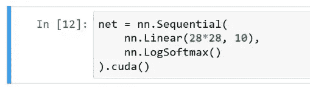

# 机器学习 1：第 9 课

> 原文：[`medium.com/@hiromi_suenaga/machine-learning-1-lesson-9-689bbc828fd2`](https://medium.com/@hiromi_suenaga/machine-learning-1-lesson-9-689bbc828fd2)

*我从*[*机器学习课程*](http://forums.fast.ai/t/another-treat-early-access-to-intro-to-machine-learning-videos/6826/1)*中的个人笔记。随着我继续复习课程以“真正”理解它，这些笔记将继续更新和改进。非常感谢*[*Jeremy*](https://twitter.com/jeremyphoward)*和*[*Rachel*](https://twitter.com/math_rachel)*给了我这个学习的机会。*

# 学生的作品[[0:00](https://youtu.be/PGC0UxakTvM)]

欢迎回到机器学习！我非常兴奋能够分享一些由旧金山大学学生在这一周内构建或撰写的惊人内容。我将向你展示的许多东西已经在互联网上广泛传播：大量的推文和帖子以及各种各样的事情发生。

## [用随机森林着色](http://structuringtheunstructured.blogspot.com/2017/11/coloring-with-random-forests.html)

由[Tyler White](https://twitter.com/Tyler_V_White)提供

他开始说，如果我创建一个合成数据集，其中自变量是 x 和 y，因变量是颜色，会怎样。有趣的是，他向我展示了一个早期版本，那时他没有使用颜色。他只是把实际的数字放在这里。


这个东西一开始根本不起作用。一旦他开始使用颜色，它就开始运行得非常好。所以我想提一下，不幸的是我们在 USF 没有教给你的一件事是人类感知的理论，也许我们应该。因为实际上，当涉及到可视化时，最重要的事情是了解人眼或大脑擅长感知的是什么。关于这个有一个整个学术研究领域。我们最擅长感知的事情之一就是颜色的差异。这就是为什么当我们看这张他创建的合成数据的图片时，你可以立刻看到，哦，这里有四个较浅红色的区域。他所做的是，他说好，如果我们尝试创建一个关于这个合成数据集的机器学习模型，具体来说他创建了一棵树。而酷的事情是你实际上可以绘制这棵树。所以在他创建了这棵树之后，他在 matplotlib 中完成了所有这些。Matplotlib 非常灵活。他实际上绘制了树的边界，这已经是一个相当不错的技巧——能够实际绘制这棵树。


然后他做了更聪明的事情，他说好的，那么树做出了什么预测？嗯，这是每个区域的平均值，所以为了做到这一点，我们实际上可以绘制平均颜色。这实际上相当漂亮。这是树所做的预测。现在这里变得非常有趣。你可以，如你所知，通过重新采样随机生成树，所以这里有通过重新采样生成的四棵树。它们都非常相似但略有不同。


现在我们实际上可以可视化装袋，为了可视化装袋，我们简单地取四张图片的平均值。这就是装袋。就是这样：


这是一个随机森林的模糊决策边界，我觉得这很神奇。因为这就像，我真希望在我开始教你们随机森林的时候有这个，我本来可以跳过几节课的。就像“好的，这就是我们做的”。我们创建决策边界，对每个区域进行平均，然后重复几次并对所有结果进行平均。这就是随机森林的做法，我认为这只是一个通过图片将复杂问题变得简单的很好的例子。所以恭喜 Tyler。事实上，他实际上重新发明了别人已经做过的事情。一个叫 Christian Innie(?)的人，他后来成为了世界上最重要的机器学习研究者之一，实际上在他写的一本关于决策森林的书中几乎完全包含了这个技术。所以 Tyler 最终重新发明了一个世界上最重要的决策森林专家创造的东西，这实际上很酷。我觉得这很有趣。很好，因为当我们在 Twitter 上发布这个时，引起了很多关注，最终有人能够说“哦，你知道吗，这实际上已经存在了”。所以 Tyler 已经开始阅读那本书。

## Parfit - 快速而强大的超参数优化与可视化 [[4:16](https://youtu.be/PGC0UxakTvM?t=256)]

由 Jason Carpenter

另一件很酷的事情是 Jason Carpenter 创建了一个全新的库叫做 Parfit。Parfit 是为了选择超参数而并行拟合多个模型。我真的很喜欢这个。他展示了如何使用它的清晰示例，API 看起来非常类似于其他基于网格搜索的方法，但它使用了 Rachel 写的验证技术，我们几周前学到的使用一个好的验证集。他在介绍它的博客文章中，回顾了什么是超参数，为什么我们必须训练它们，并解释了每一步。然后这个模块本身非常完善。他为其添加了文档，为其添加了一个很好的 README。当你实际看代码时，你会发现它非常简单，这绝对不是坏事，简单是好事。通过编写这段代码并将其打包得如此完美，他使其他人使用这个技术变得非常容易，这很棒。

## [如何使用 parfit 使 SGD 分类器表现得和逻辑回归一样好](https://towardsdatascience.com/how-to-make-sgd-classifier-perform-as-well-as-logistic-regression-using-parfit-cc10bca2d3c4) [[5:40](https://youtu.be/PGC0UxakTvM?t=340)]

由[Vinay Patlolla](https://towardsdatascience.com/@vinnsvinay)

我真的很高兴看到的一件事是 Vinay 继续结合了我们课堂上学到的两件事：一是使用 Parfit，另一是使用我们在上一课中学到的加速 SGD 分类方法，将两者结合起来，说“好的，现在让我们使用 Parfit 来帮助我们找到 SGD 逻辑回归的参数”。我认为这真的是一个很好的主意。

## 随机森林的直观解释 [[6:14](https://youtu.be/PGC0UxakTvM?t=374)]

由 Prince Grover

我认为很棒的另一件事是，Prince 基本上总结了我们在随机森林解释中学到的几乎所有内容。他甚至比那更进一步，因为他描述了随机森林解释的每种不同方法。他描述了如何做到这一点，例如，通过变量置换来计算特征重要性，每个方法都有一个小图片，然后非常酷，这里是从头开始实现它的代码。我认为这是一篇非常好的文章，描述了很多人不理解的东西，并且准确展示了它是如何工作的，既有图片又有实现代码。所以我认为这真的很棒。我在这里真的很喜欢的一件事是，对于树解释器，他实际上展示了如何将树解释器的输出输入到由 USF 学生 Chris 构建的新瀑布图包中，以展示如何实际上在瀑布图中可视化树解释器的贡献。所以再次，这是一种很好的结合我们学习和作为一个团队构建的多种技术。

## [Keras Model for Beginners (0.210 on LB)+EDA+R&D](https://www.kaggle.com/devm2024/keras-model-for-beginners-0-210-on-lb-eda-r-d) [[7:37](https://youtu.be/PGC0UxakTvM?t=457)]

由[Davesh Maheshwari](https://www.kaggle.com/devm2024)提供

有一些有趣的内核分享，下周我会分享更多，Davesh 写了这篇非常好的内核，展示了在检测冰山与船只的 Kaggle 竞赛中的挑战。这是一种很难可视化的奇怪的双通道卫星数据，他实际上通过并基本上描述了这些雷达散射的工作原理的公式，然后实际上设法编写了一个代码，使他能够重新创建实际的 3D 冰山或船只。我以前没有见过这样做。如何可视化这些数据是非常具有挑战性的。然后他继续展示如何构建神经网络来尝试解释这一点，这也非常棒。

# SGD [[9:53](https://youtu.be/PGC0UxakTvM?t=593)]

[笔记本](https://github.com/fastai/fastai/blob/master/courses/ml1/lesson4-mnist_sgd.ipynb)

让我们回到 SGD。所以我们正在回顾这份笔记本，Rachel 基本上带领我们从头开始学习 SGD，目的是进行数字识别。实际上，今天我们看的很多东西都将紧随计算线性代数课程的一部分，你可以在 fast.ai 上找到[MOOCs](https://www.youtube.com/playlist?list=PLtmWHNX-gukIc92m1K0P6bIOnZb-mg0hY)，或者在 USF，它将成为明年的选修课。所以如果你觉得这些东西有趣，我希望你会考虑报名参加选修课或在线观看视频。

所以我们正在构建神经网络。我们假设已经下载了 MNIST 数据，通过减去平均值并除以标准差对其进行了标准化。这些数据略有不同，虽然它们代表图像，但它们被下载为每个图像都是 784 个长的秩为 1 的张量，因此已经被展平。为了绘制它的图片，我们必须将其调整为 28x28。但实际的数据不是 28x28，而是 784 个长的展平数据。

我们要采取的基本步骤是从训练世界上最简单的神经网络开始，基本上是一个逻辑回归。因此没有隐藏层。我们将使用一个名为 Fast AI 的库进行训练，并使用一个名为 PyTorch 的库构建网络。然后我们将逐渐摆脱所有库。首先，我们将摆脱 PyTorch 中的`nn`（神经网络）库，并自己编写。然后我们将摆脱 Fast AI 的`fit`函数，并自己编写。然后我们将摆脱 PyTorch 的优化器，并自己编写。因此，在本笔记本的最后，我们将自己编写所有部分。我们最终依赖的唯一两个 PyTorch 给我们的关键事物是：

+   具有编写 Python 代码并在 GPU 上运行的能力

+   具有编写 Python 代码并使其自动为我们进行微分的能力。

因此，这两件事我们不打算自己尝试编写，因为这很无聊且毫无意义。但除此之外，我们将尝试在这两件事的基础上自己编写其他所有内容。

我们的起点不是自己做任何事情。基本上所有事情都已经为我们完成。因此，PyTorch 有一个`nn`库，其中包含神经网络的内容。您可以通过使用`Sequential`函数创建一个多层神经网络，然后传入您想要的层的列表，我们要求一个线性层，然后是一个 softmax 层，这定义了我们的逻辑回归。

```py
from fastai.metrics import *
from fastai.model import *
from fastai.dataset import *

import torch.nn as nnnet = nn.Sequential(
    nn.Linear(28*28, 10),
    nn.LogSoftmax()
).cuda()
```

我们线性层的输入是 28 乘以 28，输出是 10，因为我们希望为我们的图像中的每个数字 0 到 9 之间的每个数字获得一个概率。`.cuda()`将其放在 GPU 上，然后`fit`拟合模型。

```py
loss=nn.NLLLoss()
metrics=[accuracy]
opt=optim.Adam(net.parameters())
fit(net, md, n_epochs=5, crit=loss, opt=opt, metrics=metrics)
```

因此，我们从一组随机权重开始，然后使用梯度下降进行拟合以使其更好。我们必须告诉拟合函数要使用什么标准，换句话说，什么算作更好，我们告诉它使用负对数似然。我们将在下一课中了解这是什么。我们必须告诉它要使用什么优化器，我们说请使用`optim.Adam`，这方面的细节我们在本课程中不会涉及。我们将构建一个更简单的称为 SGD 的东西。如果您对 Adam 感兴趣，我们刚刚在深度学习课程中涵盖了这一点。您想要打印出什么指标，我们决定打印出准确率。就是这样。所以在我们拟合后，我们通常会得到大约 91、92%的准确率。

## 定义模块

接下来我们要做的是，我们将重复这完全相同的事情，所以我们将重建这个模型 4 到 5 次，逐渐减少使用的库。我们上次做的第二件事是尝试开始自己定义模块。所以我们不再使用那个库，而是尝试从头开始自己定义它。为了做到这一点，我们必须使用面向对象，因为这是我们在 PyTorch 中构建所有东西的方式。我们必须创建一个类，该类继承自`nn.Module`。所以`nn.Module`是一个 PyTorch 类，它接受我们的类并将其转换为神经网络模块，这基本上意味着您从`nn.Module`继承的任何东西，您几乎可以将其插入到神经网络中作为一个层，或者您可以将其视为一个神经网络。它将自动获得作为神经网络的一部分或整个神经网络运行所需的所有内容。现在我们将在今天和下一课中详细讨论这意味着什么。

因此我们需要构建这个对象，这意味着我们需要定义构造函数 dunder init。重要的是，这是一个 Python 的东西，如果你继承自其他对象，那么你首先必须创建你继承的东西。因此当你说`super().__init__()`时，这意味着首先构建那个`nn.Module`部分。如果你不这样做，那么`nn.Module`的东西就永远没有机会被实际构建。因此这就像一个标准的 Python 面向对象子类构造函数。如果其中有任何地方让你感到困惑，那么你知道这就是你绝对需要抓住一个 Python 面向对象的入门，因为这是标准的方法。

```py
def get_weights(*dims): 
    return nn.Parameter(torch.randn(dims)/dims[0])
def softmax(x): 
    return torch.exp(x)/(torch.exp(x).sum(dim=1)[:,None])

class LogReg(nn.Module):
    def __init__(self):
        super().__init__()
        self.l1_w = get_weights(28*28, 10)  # Layer 1 weights
        self.l1_b = get_weights(10)         # Layer 1 bias

    def forward(self, x):
        x = x.view(x.size(0), -1)
        x = (x @ self.l1_w) + self.l1_b  # Linear Layer
        x = torch.log(softmax(x)) # Non-linear (LogSoftmax) Layer
        return x
```

因此，在我们的构造函数中，我们想要做的相当于`nn.Linear`。`nn.Linear`所做的是，它将我们的 28 乘以 28 的向量，即 784 个元素的向量，作为矩阵乘法的输入。因此，现在我们需要创建一个具有 784 行和 10 列的矩阵。因为这个的输入将是一个大小为 64 乘以 784 的小批量数据。因此我们将进行这个矩阵乘法运算。因此当我们在 PyTorch 中说`nn.Linear`时，它将为我们构建一个 784 乘以 10 的矩阵。因此，由于我们没有使用它，我们是从头开始做事情，我们需要自己制作它。为了自己制作它，我们可以说生成具有这种维度的正态随机数`torch.randn(dims)`，我们在这里传入了`28*28, 10`。这样我们就得到了我们随机初始化的矩阵。

然后我们想要添加到这个。我们不只是想要 *y = ax*，我们想要 *y = ax + b*。所以我们需要添加在神经网络中称为偏置向量的东西。因此，我们在这里创建一个长度为 10 的偏置向量 `self.l1_b = get_weights(10)`，同样是随机初始化的，所以现在我们有了两个随机初始化的权重张量。


这就是我们的构造函数。现在我们需要定义前向传播。为什么我们需要定义前向传播？这是一个 PyTorch 特有的东西。当你在 PyTorch 中创建一个模块时，你得到的对象会表现得好像它是一个函数。你可以用括号调用它，我们马上就会这样做。因此，你需要以某种方式定义当你调用它时会发生什么，就好像它是一个函数，答案是 PyTorch 调用一个叫做 forward 的方法。这是他们选择的 PyTorch 方法。所以当它调用 forward 时，我们需要做这个模块或层的输出的实际计算。这就是在逻辑回归中实际计算的东西。基本上我们取得我们的输入 x，它被传递给 forward —— 这基本上是 forward 的工作原理，它接收到小批量数据，并且我们将其与构造函数中定义的第一层权重进行矩阵乘法运算。然后我们加上构造函数中也定义的第一层偏置。实际上，现在我们可以更加优雅地使用 Python 3 的矩阵乘法运算符`@`来定义这个。


当你使用它时，我认为你最终会得到更接近数学符号的样子，所以我觉得这更好看。

好了，这就是我们逻辑回归中的线性层（即我们的零隐藏层神经网络）。然后我们对其进行 softmax。我们得到这个矩阵乘法的输出，它的维度是 64 乘以 10。我们得到这个输出矩阵，然后我们通过 softmax 函数处理它。为什么我们要通过 softmax 函数处理它？我们要通过 softmax 函数处理它是因为最终，对于每个图像，我们希望得到一个概率，它是 0、1、2、3 或 4。所以我们希望得到一堆概率，它们加起来等于 1，其中每个概率都在 0 到 1 之间。所以 softmax 函数正好为我们做到了这一点。

例如，如果我们不是从零到 10 中挑选数字，而是挑选猫、狗、飞机、鱼或建筑物，那么一个特定图像的矩阵乘积的输出可能看起来像这样（输出列）。这些只是一些随机数。为了将其转换为 softmax，我首先对这些数字中的每一个进行*e*的幂运算。我将这些*e*的幂相加。然后我将这些*e*的幂中的每一个除以总和。这就是 softmax。这就是 softmax 的定义。


因为它是*e*的幂，这意味着它始终是正的。因为它被总和除以，这意味着它始终在 0 和 1 之间，并且还意味着它们总是加起来等于 1。因此，通过应用这个 softmax 激活函数，每当我们有一层输出，我们称之为激活，然后我们对其应用一些非线性函数，将一个标量映射到一个标量，比如 softmax（我们称之为激活函数）。因此，softmax 激活函数将我们的输出转换为类似概率的东西。严格来说，我们不需要它。我们仍然可以尝试训练直接输出概率的东西。但是通过使用这个函数，它自动使它们始终表现得像概率，这意味着网络需要学习的内容更少，因此它会学得更好。因此，一般来说，每当我们设计一个架构时，我们都会尽可能地设计它，以便它尽可能地创建我们想要的形式。这就是为什么我们使用 softmax 的原因。

这就是基本步骤。我们有我们的输入，它是一堆图像，它被一个权重矩阵相乘，我们还添加一个偏置以获得线性函数的输出。我们将其通过一个非线性激活函数，这种情况下是 softmax，这给我们带来了我们的概率。

所以这就是全部。PyTorch 也倾向于使用 softmax 的对数，原因并不需要现在困扰我们。基本上是为了数值稳定性的便利。因此，为了使这与我们在上面看到的`nn.LogSoftmax()`版本相同，我也将在这里使用对数。好的，现在我们可以实例化这个类（即创建这个类的对象）。


问题：我有一个关于之前的概率的问题。如果我们有一张照片上有一只猫和一只狗，那会改变它的工作方式吗？或者它的基本工作方式是一样的。这是一个很好的问题。所以如果你有一张照片上有一只猫和一只狗，你希望它同时输出猫和狗，这将是一个非常糟糕的选择。Softmax 是我们专门用于分类预测的激活函数，我们只想预测其中一种东西。因此，部分原因是因为正如你所看到的，因为我们使用*e*的幂，稍微更大的*e*会产生更大的数字。因此，通常我们只有一两个大的东西，其他东西都很小。因此，如果我重新计算这些随机数（在 Excel 表中），你会看到它往往是一堆零和一两个高数字。因此，它真的是设计成试图让预测这一件事变得容易。如果你正在进行多标签预测，所以我只想找到这张图片中的所有东西，而不是使用 softmax，我们将使用 sigmoid。Sigmoid 会导致这些东西中的每一个都在 0 和 1 之间，但它们不再加起来等于 1。


关于最佳实践的许多细节是我们在深度学习课程中涵盖的内容，我们在机器学习课程中不会涵盖大量这些内容。我们更感兴趣的是机制。但是如果它们很快，我们会尝试涵盖它们。

现在我们已经得到了这个，我们可以实例化该类的一个对象[[27:30](https://youtu.be/PGC0UxakTvM?t=1650)]。当然我们想将其复制到 GPU 上。这样我们可以在那里进行计算。再次，我们需要一个优化器，我们很快会讨论这是什么。但你看到这里，我们在我们的类上调用了一个名为`parameters`的函数。但我们从未定义过一个叫做 parameters 的方法，这将会起作用的原因是因为它实际上是在`nn.Module`内部为我们定义的。所以`nn.Module`会自动遍历我们创建的属性，并找到任何我们说这是一个参数的东西。你说某个东西是参数的方式是将它包装在`nn.Parameter`中。这只是告诉 PyTorch 这是我想要优化的东西的方式。所以当我们创建权重矩阵时，我们只是用`nn.Parameter`包装它，这与我们很快要学习的常规 PyTorch 变量完全相同。这只是一个小标志，告诉 PyTorch 你应该优化这个。所以当你在我们创建的`net2`对象上调用`net2.parameters()`时，它会遍历我们在构造函数中创建的所有东西，检查是否有任何一个是`Parameter`类型，如果是，它会将所有这些东西设置为我们要用优化器训练的东西。我们稍后将从头开始实现优化器。

```py
net2 = LogReg().cuda()
opt=optim.Adam(net2.parameters())
```

做完这些，我们可以拟合[[28:51](https://youtu.be/PGC0UxakTvM?t=1731)]。我们应该基本上得到与之前相同的答案（即 91 左右）。看起来不错。

```py
fit(net2, md, n_epochs=1, crit=loss, opt=opt, metrics=metrics)
```

## 数据加载器[[29:05](https://youtu.be/PGC0UxakTvM?t=1745)]

那么我们实际上在这里构建了什么？嗯，正如我所说的，我们实际上构建的是可以像常规函数一样运行的东西。所以我想向你展示如何实际上将其作为一个函数调用。为了能够将其作为一个函数调用，我们需要能够向其传递数据。为了能够向其传递数据，我需要获取一个 MNIST 图像的小批量。为了方便起见，我们使用了 Fast AI 的`ImageClassifierData.from_arrays`方法，它会为我们创建一个 PyTorch DataLoader。PyTorch DataLoader 是一种获取几张图像并将它们放入一个小批量并使其可用的东西。你基本上可以说给我另一个小批量，给我另一个小批量，给我另一个小批量。所以在 Python 中，我们称这些东西为生成器。生成器是一种东西，你基本上可以说我想要另一个，我想要另一个，我想要另一个。迭代器和生成器之间有非常紧密的联系，我现在不打算担心它们之间的区别。但你会看到，为了获得我们可以说请给我另一个的东西，为了获取我们可以用来生成小批量的东西，我们必须取出我们的数据加载器，这样你就可以从我们的模型数据对象中请求训练数据。你会看到有很多不同的数据加载器可以请求：测试数据加载器、训练数据加载器、验证数据加载器、增强图像数据加载器等等。

```py
dl = iter(md.trn_dl)
```

所以我们要获取为我们创建的训练数据加载器。这是一个标准的 PyTorch 数据加载器，稍微被我们优化了一下，但是思路是一样的。然后你可以说这个（`iter`）是一个标准的 Python 东西，我们可以说将其转换为一个迭代器，即我们可以一次从中获取另一个的东西。一旦你这样做了，我们就有了一个可以迭代的东西。你可以使用标准的 Python `next`函数从生成器中获取一个更多的东西。

```py
xmb,ymb = next(dl)
```

所以这是从一个小批量返回 x 和 y。在 Python 中，您可以使用`for`循环来使用生成器和迭代器。我也可以说 x 小批量逗号 y 小批量在数据加载器中，然后做一些事情：


所以当你这样做时，实际上是在幕后，它基本上是调用`next`很多次的语法糖。所以这都是标准的 Python 东西。

所以它返回了一个大小为 64 乘以 784 的张量，这是我们所期望的。我们使用的 Fast AI 库默认使用小批量大小为 64，这就是为什么它这么长。这些都是背景零像素，但它们实际上并不是零。在这种情况下，为什么它们不是零呢？因为它们被标准化了。所以我们减去了平均值，除以标准差。

```py
xmb
'''
-0.4245 -0.4245 -0.4245  ...  -0.4245 -0.4245 -0.4245
-0.4245 -0.4245 -0.4245  ...  -0.4245 -0.4245 -0.4245
-0.4245 -0.4245 -0.4245  ...  -0.4245 -0.4245 -0.4245
          ...             ⋱             ...          
-0.4245 -0.4245 -0.4245  ...  -0.4245 -0.4245 -0.4245
-0.4245 -0.4245 -0.4245  ...  -0.4245 -0.4245 -0.4245
-0.4245 -0.4245 -0.4245  ...  -0.4245 -0.4245 -0.4245
[torch.FloatTensor of size 64x784 (GPU 0)]
'''
```

现在我们要做的是将其传递给我们的逻辑回归。所以我们可能会这样做，我们将使用`vxmb`（变量 x 小批量），我可以取出我的 x 小批量，我可以将其移动到 GPU 上，因为记住我的`net2`对象在 GPU 上，所以我们的数据也必须在 GPU 上。然后我要做的第二件事是，我必须将其包装在`Variable`中。那么变量是做什么的呢？这是我们免费获得自动微分的方式。PyTorch 可以自动微分几乎任何张量。但这需要内存和时间，所以它不会总是跟踪。要进行自动微分，它必须跟踪确切的计算方式。我们将这些东西相加，我们将其乘以那个，然后我们取了这个的符号等等。你必须知道所有的步骤，因为然后要进行自动微分，它必须使用链式法则对每个步骤求导，然后将它们相乘。所以这是缓慢和占用内存的。所以我们必须选择说“好的，这个特定的东西，我们以后会对其进行求导，所以请为我们跟踪所有这些操作。”我们选择的方式是将一个张量包装在`Variable`中。这就是我们的做法。

你会发现它看起来几乎和一个张量一样，但现在它说“包含这个张量的变量”。所以在 PyTorch 中，一个变量的 API 与张量完全相同，或者更具体地说，是张量 API 的超集。我们对张量可以做的任何事情，我们也可以对变量做。但它会跟踪我们做了什么，以便我们以后可以求导。

```py
vxmb = Variable(xmb.cuda())
vxmb
'''
Variable containing:
-0.4245 -0.4245 -0.4245  ...  -0.4245 -0.4245 -0.4245
-0.4245 -0.4245 -0.4245  ...  -0.4245 -0.4245 -0.4245
-0.4245 -0.4245 -0.4245  ...  -0.4245 -0.4245 -0.4245
          ...             ⋱             ...          
-0.4245 -0.4245 -0.4245  ...  -0.4245 -0.4245 -0.4245
-0.4245 -0.4245 -0.4245  ...  -0.4245 -0.4245 -0.4245
-0.4245 -0.4245 -0.4245  ...  -0.4245 -0.4245 -0.4245
[torch.cuda.FloatTensor of size 64x784 (GPU 0)]
'''
```

所以我们现在可以将其传递给我们的`net2`对象。记住我说过你可以将其视为函数。所以请注意，我们没有调用`.forward()`，我们只是将其视为函数。然后记住，我们取了对数，为了撤销这个操作，我正在使用`.exp()`，这将给我概率。所以这是我的概率，它返回的大小是 64 乘以 10，所以对于小批量中的每个图像，我们有 10 个概率。你会看到，大多数概率都非常接近零。而其中一些则要大得多，这正是我们所希望的。就像好吧，它不是零，不是 1，不是 2，它**是**3，不是 4 等等。

```py
preds = net2(vxmb).exp(); preds[:3]
'''
Variable containing:

Columns 0 to 5 
 1.6740e-03  1.0416e-05  2.5454e-05  1.9119e-02  6.5026e-05  9.7470e-01
 3.4048e-02  1.8530e-04  6.6637e-01  3.5073e-02  1.5283e-01  6.4995e-05
 3.0505e-08  4.3947e-08  1.0115e-05  2.0978e-04  9.9374e-01  6.3731e-05

Columns 6 to 9 
 2.1126e-06  1.7638e-04  3.9351e-03  2.9154e-04
 1.1891e-03  3.2172e-02  1.4597e-02  6.3474e-02
 8.9568e-06  9.7507e-06  7.8676e-04  5.1684e-03
[torch.cuda.FloatTensor of size 3x10 (GPU 0)]
'''
```

我们可以调用`net2.forward(vxmb)`，它会做完全相同的事情。但这并不是 PyTorch 的所有机制实际上是如何工作的。他们实际上将其称为函数。这实际上是一个非常重要的想法，因为这意味着当我们定义自己的架构或其他内容时，任何你想要放入函数的地方，你都可以放入一个层；任何你想要放入一个层的地方，你都可以放入一个神经网络；任何你想要放入一个神经网络的地方，你都可以放入一个函数。因为就 PyTorch 而言，它们都只是它将调用的东西，就像它们是函数一样。所以它们是可以互换的，这是非常重要的，因为这就是我们通过混合和匹配许多部分并将它们组合在一起来创建非常好的神经网络的方式。

让我举个例子。这是我的逻辑回归，准确率达到了 91%多一点。我现在要把它转换成一个带有一个隐藏层的神经网络。



我要做的是创建更多的层。我要改变这个，使其输出 100 而不是 10，这意味着这个输入将是 100 而不是 10。现在这样还不能让事情变得更好。为什么这肯定不会比之前更好呢？因为两个线性层的组合只是一个线性层，但参数不同。


所以我们有两个线性层，这只是一个线性层。为了使事情变得有趣，我将用零替换第一层中的所有负数。因为这是一个非线性转换，这个非线性转换被称为修正线性单元（ReLU）。


所以`nn.Sequential`简单地会依次调用每个层对每个小批量进行操作。所以做一个线性层，用零替换所有负数，再做一个线性层，最后做一个 softmax。这现在是一个有一个隐藏层的神经网络。所以让我们尝试训练这个。准确率现在已经提高到 96%。


所以这个想法是，我们在这节课中学习的基本技术在你开始将它们堆叠在一起时变得强大。

**问题**：为什么你选择了 100？没有原因。输入一个额外的零更容易。神经网络层中应该有多少激活是深度学习从业者的规模问题，我们在深度学习课程中讨论过，而不是在这门课程中。

**问题**：在添加额外的层时，如果你做了两个 softmax，这会有影响吗，或者这是你不能做的事情？你绝对可以在那里使用 softmax。但这可能不会给你想要的结果。原因是 softmax 倾向于将大部分激活推向零。激活，只是为了明确，因为在深度学习课程中我收到了很多关于什么是激活的问题，激活是在一个层中计算出来的值。这就是一个激活：


这不是一个权重。权重不是一个激活。它是你从一个层计算出来的值。所以 softmax 会倾向于使大部分激活接近于零，这与你想要的相反。通常你希望你的激活尽可能丰富、多样且被使用。所以没有什么能阻止你这样做，但它可能不会工作得很好。基本上，你的所有层几乎都会跟随非线性激活函数，通常是 ReLU，除了最后一层。

**问题**：在做多层时，比如说 2 或 3 层，你想要改变这些激活层吗？不。所以如果我想要更深，我会直接这样做。


现在这是一个两个隐藏层的网络。

问题：所以我想我听到你说有几种不同的激活函数，比如修正线性单元。有一些例子，为什么会使用每一个呢？是的，很好的问题。所以基本上当你添加更多的线性层时，你的输入进来，你把它通过一个线性层然后一个非线性层，线性层，非线性层，线性层和最终的非线性层。最终的非线性层正如我们讨论过的，如果它是多类别分类但你只选择其中一个，你会使用 softmax。如果是二元分类或多标签分类，你会使用 sigmoid。如果是回归，通常你根本不会有，尽管我们在昨晚的深度学习课程中学到有时你也可以在那里使用 sigmoid。所以它们基本上是最终层的主要选项。对于隐藏层，你几乎总是使用 ReLU，但还有另一个你可以选择的，有点有趣，叫做 leaky ReLU。基本上如果它大于零，它是*y = x*，如果小于零，它就像*y = 0.1x*。所以它与 ReLU 非常相似，但不是等于 0，而是接近于 0。所以它们是主要的两种：ReLU 和 Leaky ReLU。


还有其他一些，但它们有点像那样。例如，有一种叫做 ELU 的东西相当受欢迎，但细节并不太重要。像 ELU 这样的东西有点像 ReLU，但在中间稍微弯曲一些。它通常不是基于数据集选择的东西。随着时间的推移，我们发现了更好的激活函数。所以两三年前，每个人都使用 ReLU。一年前，几乎每个人都使用 Leaky ReLU。今天，我想大多数人开始转向 ELU。但老实说，激活函数的选择实际上并不太重要。人们实际上已经表明，你可以使用相当任意的非线性激活函数，甚至是正弦波，它仍然有效。

所以尽管今天我们要做的是展示如何创建这个没有隐藏层的网络，将其转变为下面这个网络（下面）准确率为 96%左右将会很简单。这是你可能应该在这一周尝试做的事情，创建这个版本。


现在我们有了一个可以传递我们的变量并得到一些预测的网络，这基本上就是我们调用`fit`时发生的事情。所以我们将看看这种方法如何用于创建这种随机梯度下降。需要注意的一件事是将预测的概率转换为预测的数字是，我们需要使用 argmax。不幸的是，PyTorch 并不称之为 argmax。相反，PyTorch 只是称之为 max，并且 max 返回两个东西：它返回给定轴上的实际最大值（所以`max(1)`将返回列的最大值），它返回的第二件事是该最大值的索引。所以 argmax 的等价物是调用 max 然后获取第一个索引的东西：


这就是我们的预测。如果这是 numpy，我们将使用`np.argmax()`。

```py
preds = predict(net2, md.val_dl).argmax(1)
plots(x_imgs[:8], titles=preds[:8])
```


所以这是我们手动创建的逻辑回归的预测，在这种情况下，看起来我们几乎全部正确。

接下来我们要尝试摆脱使用库的是我们将尝试避免使用矩阵乘法运算符。相反，我们将尝试手动编写。

## 广播[[46:58](https://youtu.be/PGC0UxakTvM?t=2818)]

因此，接下来，我们将学习一些似乎是一个小的编程概念的东西。但实际上，至少在我看来，这将是我们在这门课程中教授的最重要的编程概念，也可能是你需要构建机器学习算法的所有重要编程概念。这就是广播的概念。我将通过示例展示这个概念。

如果我们创建一个数组 10、6、-4 和一个数组 2、8、7，然后将它们相加，它会依次添加这两个数组的每个分量——我们称之为“逐元素”。

```py
a = np.array([10, 6, -4])
b = np.array([2, 8, 7]) a + b
'''
array([12, 14,  3])
'''
```

换句话说，我们不必编写循环。在过去，我们必须循环遍历每一个并将它们相加，然后将它们连接在一起。今天我们不必这样做。它会自动为我们发生。因此，在 numpy 中，我们自动获得逐元素操作。我们可以用 PyTorch 做同样的事情。在 Fast AI 中，我们只需添加一个大写 T 来将某物转换为 PyTorch 张量。如果我们将它们相加，结果完全相同。


因此，这些库中的逐元素操作在这种情况下是相当标准的。有趣的不仅仅是因为我们不必编写 for 循环，而且实际上更有趣的是由于这里发生的性能问题。

## 性能

第一个是如果我们在 Python 中进行 for 循环，那将会发生。即使你使用 PyTorch，它仍然在 Python 中执行 for 循环。它没有优化 for 循环的方法。因此，在 Python 中，for 循环的速度大约比在 C 中慢 10,000 倍。这是你的第一个问题。我记不清是 1,000 还是 10,000。

然后，第二个问题是，你不仅希望它在 C 中得到优化，而且你希望 C 利用你所有 CPU 所做的事情，这被称为 SIMD，单指令多数据。你的 CPU 能够一次处理 8 个向量中的 8 个元素，并将它们相加到另一个包含 8 个元素的向量中，在一个 CPU 指令中。因此，如果你能利用 SIMD，你立即就会快 8 倍。这取决于数据类型有多大，可能是 4，可能是 8。

你的计算机中还有多个进程（多个核心）。因此，如果向量相加发生在一个核心中，你可能有大约 4 个核心。因此，如果你使用 SIMD，你会快 8 倍，如果你可以使用多个核心，那么你会快 32 倍。然后如果你在 C 中这样做，你可能会快 32k 倍。

所以好处是当我们执行`a + b`时，它利用了所有这些东西。


更好的是，如果你在 PyTorch 中执行这个操作，并且你的数据是用`.cuda()`创建的，然后将其放在 GPU 上，那么你的 GPU 可以一次执行大约 10,000 个操作。因此，这将比 C 快 100 倍。因此，这对于获得良好的性能至关重要。你必须学会如何通过利用这些逐元素操作来编写无循环的代码。这不仅仅是加号（`+`）。我还可以使用小于号（`<`），这将返回 0，1，1。


或者如果我们回到 numpy，False，True，True。


因此，你可以使用这个来做各种事情而不需要循环。例如，我现在可以将其乘以*a*，这里是所有小于*b*的*a*的值：


或者我们可以取平均值：

```py
(a < b).mean()
'''
0.66666666666666663
'''
```

这是*a*中小于*b*的值的百分比。因此，你可以用这个简单的想法做很多事情。

## 进一步

但要进一步，要进一步超越这种逐元素操作，我们将不得不走到下一步，到一种称为广播的东西。让我们从看一个广播的例子开始。

```py
a
'''
array([10,  6, -4])
'''
```

a 是一个具有一维的数组，也称为秩 1 张量，也称为向量。我们可以说`a`大于零：

```py
a > 0
'''
array([ True,  True, False], dtype=bool)
'''
```

这里，我们有一个秩 1 张量（`a`）和一个秩 0 张量（`0`）。秩 0 张量也称为标量，秩 1 张量也称为向量。我们之间有一个操作：


现在你可能已经做了一千次，甚至没有注意到这有点奇怪。你有不同等级和不同大小的这些东西。那么它实际上在做什么呢？它实际上是将那个标量复制 3 次（即[0, 0, 0]），并实际上逐个元素地给我们三个答案。这就是所谓的广播。广播意味着复制我的张量的一个或多个轴，以使其与另一个张量的形状相同。但它实际上并没有复制。它实际上是存储了一种内部指示器，告诉它假装这是一个三个零的向量，但实际上它不是去下一行或下一个标量，而是回到它来的地方。如果你对这个特别感兴趣，它们将该轴上的步幅设置为零。这对于那些好奇的人来说是一个较为高级的概念。

所以我们可以做 a + 1[[54:52](https://youtu.be/PGC0UxakTvM?t=3292)]。它将广播标量 1 为[1, 1, 1]，然后进行逐元素加法。

```py
a + 1
'''
array([11,  7, -3])
'''
```

我们可以对一个矩阵做同样的操作。这是我们的矩阵。

```py
m = np.array([[1, 2, 3], [4,5,6], [7,8,9]]); m
'''
array([[1, 2, 3],
       [4, 5, 6],
       [7, 8, 9]])
'''
```

那个矩阵的 2 倍将广播 2 为[[2, 2, 2]，[2,2,2]，[2,2,2]]，然后进行逐元素乘法。这就是我们广播的最简单版本。

```py
2*m
'''
array([[ 2,  4,  6],
       [ 8, 10, 12],
       [14, 16, 18]])
'''
```

## 将向量广播到矩阵[[55:27](https://youtu.be/PGC0UxakTvM?t=3327)]

这是广播的一个稍微复杂的版本。这里有一个名为`c`的数组。这是一个秩 1 张量。

```py
c = np.array([10,20,30]); c
'''
array([10, 20, 30])
'''
```

这是之前的矩阵`m`——秩 2 张量。我们可以添加`m + c`。那么这里发生了什么？

```py
m + c
'''
array([[11, 22, 33],
       [14, 25, 36],
       [17, 28, 39]])
'''
```

你可以看到它所做的是将[10, 20, 30]添加到每一行。


所以我们可以想象它似乎做了与广播标量相同类型的想法，就像复制了它。然后将这些视为秩 2 矩阵。现在我们可以进行逐元素加法。


**问题**：通过查看这个例子，它将其复制下来生成新的行。如果我们想要获得新的列，我们应该如何做[[56:50](https://youtu.be/PGC0UxakTvM?t=3410)]？我很高兴你问了。所以我们会这样做：


现在将其视为我们的矩阵。要让 numpy 这样做，我们需要传入一个矩阵而不是一个向量，而是传入一个具有一列的矩阵（即秩 2 张量）。基本上，numpy 会将这个秩 1 张量视为秩 2 张量，表示一行。换句话说，它是 1 乘 3。所以我们想要创建一个 3 乘 1 的张量。有几种方法可以做到这一点。一种方法是使用`np.expand_dims(c,1)`，如果你传入这个参数，它会说“请在这里插入一个长度为 1 的轴”。所以在我们的情况下，我们想将其转换为 3 乘 1，所以如果我们说`expand_dims(c,1)`，它会将形状改变为(3, 1)。所以如果我们看看它是什么样子的，它看起来像一列。

```py
np.expand_dims(c,1).shape
'''
(3, 1)
'''
np.expand_dims(c,1)
'''
array([[10],
       [20],
       [30]])
'''
```

所以如果我们现在加上`m`，你可以看到它确实做了我们希望它做的事情，即将 10、20、30 添加到列[[58:50](https://youtu.be/PGC0UxakTvM?t=3530)]：

```py
m + np.expand_dims(c,1)
'''
array([[11, 12, 13],
       [24, 25, 26],
       [37, 38, 39]])
'''
```

现在由于单位轴的位置是如此重要，所以通过实验创建这些额外的单位轴并知道如何轻松地做到这一点是非常有帮助的。在我看来，`np.expand_dims`并不是最容易的方法。最简单的方法是使用一个特殊的索引`None`来索引张量。`None`的作用是在那个位置创建一个长度为 1 的新轴。因此，这将在开始添加一个新的长度为 1 的轴。

```py
c[None]
'''
array([[10, 20, 30]])
'''
c[None].shape
'''
(1, 3)
'''
```

这将在末尾添加一个新的长度为 1 的轴。

```py
c[:,None]
'''
array([[10],
       [20],
       [30]])
'''
c[:,None].shape
'''
(3, 1)
'''
```

或者为什么不两者都做呢

```py
c[None,:,None].shape
'''
(1, 3, 1)
'''
```

所以如果你考虑一下，一个张量中有 3 个元素，可以是任何你喜欢的阶数，你可以随意添加单位轴。这样，我们可以决定我们希望广播的方式。所以在 numpy 中有一个非常方便的东西叫做`broadcast_to`，它的作用是将我们的向量广播到那个形状，并展示给我们看看那会是什么样子。

```py
np.broadcast_to(c, (3,3))
'''
array([[10, 20, 30],
       [10, 20, 30],
       [10, 20, 30]])
'''
```

所以如果你对某个广播操作中发生的事情感到不确定，你可以使用`broadcast_to`。例如，在这里，我们可以说，而不是(3,3)，我们可以说`m.shape`，看看将会发生什么。

```py
np.broadcast_to(c, m.shape)
'''
array([[10, 20, 30],
       [10, 20, 30],
       [10, 20, 30]])
'''
```

这就是在我们将其添加到`m`之前会发生的事情。所以如果我们说将其转换为列，那就是它的样子：

```py
np.broadcast_to(c[:,None], m.shape)
'''
array([[10, 10, 10],
       [20, 20, 20],
       [30, 30, 30]])
'''
```

所以这就是广播的直观定义。现在希望我们可以回到那个 numpy 文档并理解它的含义。

从[Numpy 文档](https://docs.scipy.org/doc/numpy-1.10.0/user/basics.broadcasting.html) [[1:01:37](https://youtu.be/PGC0UxakTvM?t=3697)]：

> 广播这个术语描述了 numpy 在算术运算期间如何处理具有不同形状的数组。在一定的约束条件下，较小的数组（较低秩的张量）被“广播”到较大的数组上，以便它们具有兼容的形状。广播提供了一种向量化数组操作的方法，使循环发生在 C 而不是 Python 中。它可以在不进行不必要的数据复制的情况下实现这一点，并通常导致高效的算法实现。

“向量化”通常意味着使用 SIMD 等技术，以便多个操作同时进行。它实际上并不会进行不必要的数据复制，只是表现得好像进行了复制。所以这就是我们的定义。

现在在深度学习中，你经常处理 4 阶或更高阶的张量，并且经常将它们与 1 阶或 2 阶的张量结合在一起，仅凭直觉正确地执行这些操作几乎是不可能的。所以你真的需要了解规则。


这里是`m.shape`和`c.shape` [[1:02:45](https://youtu.be/PGC0UxakTvM?t=3765)]。所以规则是我们将逐个元素地比较我们两个张量的形状。我们将一次查看一个，并且我们将从末尾开始向前移动。当这两个条件之一为真时，两个维度将是兼容的。所以让我们检查一下我们的`m`和`c`是否兼容。所以我们将从末尾开始（首先是尾部维度）并检查“它们是否兼容？”如果维度相等，则它们是兼容的。让我们继续下一个。哦，我们缺少了。`c`缺少一些东西。如果有东西缺失会发生什么，我们会插入一个 1。这就是规则。所以现在让我们检查一下——这些是否兼容？其中一个是 1，是的，它们是兼容的。所以现在你可以看到为什么 numpy 将一维数组视为一个代表行的 2 阶张量。这是因为我们基本上在前面插入了一个 1。这就是规则。


在对两个数组进行操作时，Numpy/PyTorch 会逐个元素地比较它们的形状。它从**尾部维度**开始，逐步向前推进。当两个维度**兼容**时

+   它们是相等的，或者

+   其中之一是 1

数组不需要具有相同数量的维度。例如，如果你有一个`256*256*3`的 RGB 值数组，并且你想要按不同的值缩放图像中的每种颜色，你可以将图像乘以一个具有 3 个值的一维数组。根据广播规则对齐这些数组的尾部轴的大小，显示它们是兼容的：

```py
Image  (3d array): 256 x 256 x 3
Scale  (1d array):             3
Result (3d array): 256 x 256 x 3
```

例如，上面是你经常需要做的事情，即你从一幅图像开始，256 像素乘以 256 像素乘以 3 个通道。你想要减去每个通道的平均值。所以你有 256 乘以 256 乘以 3，你想要减去长度为 3 的东西。是的，你可以做到。绝对可以。因为 3 和 3 是兼容的，因为它们是相同的。256 和空是兼容的，因为它会插入一个 1。256 和空是兼容的，因为它会插入一个 1。所以你最终会得到这个（每个通道的平均值）会在所有这个轴（从右边数第二个）上广播，然后整个东西将在这个最左边的轴上广播，所以我们最终会得到一个 256 乘以 256 乘以 3 的有效张量。

有趣的是，数据科学或机器学习社区中很少有人理解广播，大多数时候，例如，当我看到人们为计算机视觉进行预处理时，比如减去平均值，他们总是在通道上写循环。我认为不必这样做非常方便，而且通常不必这样做速度更快。所以如果你擅长广播，你将拥有这种非常少数人拥有的超级有用的技能。这是一种古老的技能。它可以追溯到 APL 的时代。APL 是上世纪 50 年代的，代表着 A Programming Language，肯尼斯·艾弗森写了一篇名为“符号作为思维工具”的论文，他在其中提出了一种新的数学符号。他提出，如果我们使用这种新的数学符号，它会给我们提供新的思维工具，让我们能够思考以前无法思考的事情。他的一个想法就是广播，不是作为计算机编程工具，而是作为数学符号的一部分。因此，他最终将这种符号实现为一种思维工具，作为一种名为 APL 的编程语言。他的儿子继续将其进一步发展为一种名为 J 的软件，这基本上是当你将 60 年来非常聪明的人们致力于这个想法时得到的结果。通过这种编程语言，你可以用一两行代码表达非常复杂的数学思想。我们有 J 是很棒的，但更棒的是这些想法已经进入我们所有人使用的语言中，比如在 Python 中的 numpy 和 PyTorch 库。这些不仅仅是一些小众的想法，它们是思考数学和进行编程的基本方式。

让我举个例子，这种符号作为思维工具的例子。这里我们有 c：


这里我们有 `c[None]`：


注意现在有两个方括号。这有点像一个一行向量张量。这里是一个小列：


这将会做什么呢？


所以从广播规则的角度来看，我们基本上是将这个列（维度为（3，1））和这个行（维度为（1，3））进行操作。为了使这些符合我们的广播规则，列必须被复制 3 次，因为它需要匹配 3。行必须被复制 3 次以匹配 3。所以现在我有两个矩阵可以进行逐元素乘积。


所以正如你所说，这是我们的外积。


现在有趣的是，突然间这不再是一个特殊的数学案例，而只是广播这个一般概念的一个特定版本，我们可以像外加一样：


或者外大于：


或者其他。所以突然间我们有了这个概念，我们可以用它来构建新的想法，然后我们可以开始尝试这些新的想法。

有趣的是，numpy 有时会使用这个方法。例如，如果你想创建一个网格，numpy 就是这样做的：


实际上返回的是 0、1、2、3、4；一个作为列，一个作为行。所以我们可以说好的，这是 x 网格（`xg`）逗号 y 网格（`yg`），现在你可以做类似这样的事情：


所以突然间我们把它扩展成了一个网格。所以有趣的是一些简单的概念是如何被不断地建立和发展的。所以如果你熟悉 APL 或 J，这是一个由许多层层叠加而成的整个环境。虽然在 numpy 中我们没有这样深层次的环境，但你肯定可以看到这种广播的想法在简单的事情中体现出来，比如我们如何在 numpy 中创建一个网格。

## 实现矩阵乘法[[1:12:30](https://youtu.be/PGC0UxakTvM?t=4350)]

这就是广播，现在我们可以使用这个来实现矩阵乘法。那么为什么我们要这样做呢？显然我们不需要。矩阵乘法已经被我们的库完美地处理了。但是很多时候你会发现在各种领域，特别是在深度学习中，会有一些特定类型的线性函数，你想要做的事情并没有完全为你做好。例如，有一个叫做张量回归和张量分解的领域，目前正在得到很大的发展，它们讨论的是如何将高阶张量转化为行、列和面的组合。事实证明，当你这样做时，你基本上可以处理非常高维的数据结构，而不需要太多的内存和计算时间。例如，有一个非常棒的库叫做[TensorLy](https://github.com/tensorly/tensorly)，它为你做了很多这样的事情。所以这是一个非常重要的领域。它涵盖了所有的深度学习，还有很多现代机器学习。所以即使你不会定义矩阵乘法，你很可能会想要找到一些其他略有不同的张量积。所以了解如何做这个是非常有用的。

让我们回过头来看看我们的二维数组和一维数组，秩为 2 的张量和秩为 1 的张量[[1:14:27](https://youtu.be/PGC0UxakTvM?t=4467)]。

```py
m, c
'''
(array([[1, 2, 3],
        [4, 5, 6],
        [7, 8, 9]]), array([10, 20, 30]))
'''
```

记住，我们可以使用@符号或旧方法`np.matmul`进行矩阵乘法。当我们这样做时，实际上我们基本上是在说`1*10 + 2*20 + 3*30 = 140`，所以我们对每一行都这样做，然后我们可以继续对下一行做同样的事情，依此类推以获得我们的结果。

```py
m @ c  # np.matmul(m, c)
'''
array([140, 320, 500])
'''
```

你也可以在 PyTorch 中这样做

```py
T(m) @ T(c)
'''
140
 320
 500
[torch.LongTensor of size 3]
'''
```

但是（`m * c`）这不是矩阵乘法。那是什么？逐元素广播。但请注意，它创建的数字[10, 40, 90]正是我在做矩阵乘法的第一部分时需要计算的三个确切数字（`1*10 + 2*20 + 3*30`）。

```py
m * c
'''
array([[ 10,  40,  90],
       [ 40, 100, 180],
       [ 70, 160, 270]])
'''
```

换句话说，如果我们对列求和，即轴等于 1，我们就得到了矩阵向量乘积：

```py
(m * c).sum(axis=1)
'''
array([140, 320, 500])
'''
```

所以我们可以在不依赖库的特殊帮助下做这些事情。现在让我们将这扩展到矩阵矩阵乘积。


[`matrixmultiplication.xyz/`](http://matrixmultiplication.xyz/)

矩阵矩阵乘积看起来是这样的。有一个很棒的网站叫做[matrixmultiplication.xyz](http://matrixmultiplication.xyz/)，它向我们展示了当我们将两个矩阵相乘时会发生什么。从操作的角度来看，这就是矩阵乘法。换句话说，我们刚刚做的是首先取第一列和第一行相乘得到 15：


然后我们取第二列和第一行得到 27：


所以我们基本上是在做我们刚刚做的事情，矩阵向量乘积，我们只是做了两次。一次用这一列（左边），一次用那一列（右边），然后我们把这两个连接在一起。所以我们现在可以继续这样做：

```py
(m * n[:,0]).sum(axis=1)
'''
array([140, 320, 500])
'''
(m * n[:,1]).sum(axis=1)
'''
array([ 25, 130, 235])
'''
```

这就是我们矩阵乘法的两列。

我不想让我们的代码太乱，所以我不打算真的使用那个，但是现在我们有了它，如果我们想要的话。我们不再需要使用 torch 或 numpy 矩阵乘法。我们有自己的方法可以使用，只使用逐元素操作、广播和求和。

这是我们从头开始的逻辑回归类[[1:18:37](https://youtu.be/PGC0UxakTvM?t=4717)]。我只是把它复制到这里。

```py
class LogReg(nn.Module):
    def __init__(self):
        super().__init__()
        self.l1_w = get_weights(28*28, 10)  # Layer 1 weights
        self.l1_b = get_weights(10)         # Layer 1 bias

    def forward(self, x):
        x = x.view(x.size(0), -1)
        x = x @ self.l1_w + self.l1_b 
        return torch.log(softmax(x))
```

这是我们实例化对象的地方，复制到 GPU。我们创建一个优化器，我们将在稍后学习。然后我们调用 fit。

```py
net2 = LogReg().cuda()
opt=optim.Adam(net2.parameters())

fit(net2, md, n_epochs=1, crit=loss, opt=opt, metrics=metrics)
'''
[ 0\.       0.31102  0.28004  0.92406]
'''
```

## 编写我们自己的训练循环[[1:18:53](https://youtu.be/PGC0UxakTvM?t=4733)]

所以目标是现在重复这一过程，而无需调用 fit。为此，我们需要一个循环，每次抓取一个小批量的数据。对于每个小批量的数据，我们需要将其传递给优化器，并说“请尝试为这个小批量提供稍微更好的预测”。

正如我们学到的，为了一次抓取训练集的一个小批次，我们必须向模型数据对象请求训练数据加载器。我们必须将其包装在`iter`中以创建一个迭代器或生成器。这样就给我们了我们的数据加载器。所以 PyTorch 将其称为数据加载器。我们实际上编写了自己的 Fast AI 数据加载器，但基本上是相同的思路。

```py
dl = iter(md.trn_dl) # Data loader
```

接下来我们要做的是获取 x 和 y 张量，从我们的数据加载器中获取下一个。将其包装在`Variable`中以表明我需要能够对使用此计算的导数进行求导。因为如果我不能求导，那么我就无法得到梯度，也无法更新权重。而且我需要将其放在 GPU 上，因为我的模块在 GPU 上（`net2 = LogReg().cuda()`）。所以现在我们可以将该变量传递给我们实例化的对象（即我们的逻辑回归）。记住，我们的模块，我们可以将其用作函数，因为这就是 PyTorch 的工作原理。这给我们提供了一组预测，就像我们以前看到的那样。

```py
xt, yt = next(dl)
y_pred = net2(Variable(xt).cuda())
```

现在我们可以检查损失[[1:20:41](https://youtu.be/PGC0UxakTvM?t=4841)]。我们定义损失为负对数似然损失对象。我们将在下一课中学习如何计算它，现在，只需将其视为分类问题的均方根误差。所以我们也可以像调用函数一样调用它。所以你可以看到这在 PyTorch 中是一个非常普遍的想法，将一切都理想地视为函数。在这种情况下，我们有一个负对数似然损失对象，我们可以将其视为函数。我们传入我们的预测和实际值。同样，实际值需要转换为变量并放在 GPU 上，因为损失是我们实际想要求导的东西。这给我们带来了我们的损失，就是这样。

```py
l = loss(y_pred, Variable(yt).cuda())
print(l)
'''
Variable containing:
 2.4352
[torch.cuda.FloatTensor of size 1 (GPU 0)]
'''
```

这是我们的损失 2.43。所以它是一个变量，因为它是一个变量，它知道它是如何计算的。它知道它是用这个损失函数（`loss`）计算的。它知道预测是用这个网络（`net2`）计算的。它知道这个网络由这些操作组成：


所以我们可以自动获取梯度。要获取梯度，我们调用`l.backward()`。记住`l`是包含我们损失的东西。所以`l.backward()`是添加到任何变量的东西。然后调用`.backward()`，这表示请计算梯度。这样就计算了梯度并将其存储在内部，基本上对于用于计算的每个权重/参数，现在都存储在`.grad`中，我们稍后会看到，但基本上存储了梯度。然后我们可以调用`optimizer.step()`，我们很快将手动执行这一步。这部分表示请让权重变得更好一点。


## optimizer.step [[1:22:49](https://youtu.be/PGC0UxakTvM?t=4969)]

因此，`optimizer.step()`正在做的是，如果你有一个非常简单的函数像这样，优化器所做的就是说好的，让我们选择一个起始点，计算损失的值，计算导数告诉我们哪个方向是向下的。因此，它告诉我们我们需要朝那个方向走。然后我们迈出一小步。


然后我们再次取导数，采取一个小步骤，并重复，直到最终我们采取的步骤如此之小以至于停止。


这就是梯度下降的作用。小步骤有多大？基本上在这里取导数，所以让我们说导数是 8。然后我们乘以一个小数，比如 0.01，这告诉我们要采取什么步骤大小。这里的这个小数被称为学习率，它是设置的最重要的超参数。如果你选择的学习率太小，那么你的下降步骤将会很小，而且会花费很长时间。学习率太大，你会跳得太远，然后你会跳得太远，最终会发散而不是收敛。


在这节课中我们不会讨论如何选择学习率，但在深度学习课程中，我们实际上向你展示了一种非常可靠地选择一个非常好的学习率的特定技术。

因此，基本上正在发生的是，我们计算导数，我们调用执行`step`的优化器，换句话说，根据梯度和学习率更新权重。

希望在这样做之后，我们的损失比之前更好。因此，我刚刚重新运行了这个，得到了一个 4.16 的损失。


一步之后，现在是 4.03。


所以它按照我们希望的方式运行，基于这个小批量，它更新了我们网络中的所有权重，使它们比之前更好。因此，我们的损失下降了。

## 训练循环

因此，让我们将其转化为一个训练循环。我们将进行一百步：

+   从数据加载器中获取另一个小批量数据

+   从我们的网络中计算预测

+   从预测和实际值计算我们的损失

+   每 10 次，我们将打印出准确率，只需取平均值，看它们是否相等。

+   一个 PyTorch 特定的事情，你必须将梯度清零。基本上，你可以有许多不同的损失函数的网络，你可能想要将所有的梯度加在一起。因此，你必须告诉 PyTorch 何时将梯度设置为零。因此，这只是说将所有的梯度设置为零。

+   计算梯度，这被称为反向传播

+   然后进行一步优化器，使用梯度和学习率更新权重

```py
for t in range(100):
  xt, yt = next(dl)
  y_pred = net2(Variable(xt).cuda())
  l = loss(y_pred, Variable(yt).cuda())

  if t % 10 == 0:
    accuracy = np.mean(to_np(y_pred).argmax(axis=1) == to_np(yt))
    print("loss: ", l.data[0], "\t accuracy: ", accuracy)

  optimizer.zero_grad()
  l.backward()
  optimizer.step()
'''
loss:  2.2104923725128174 	 accuracy:  0.234375
loss:  1.3094730377197266 	 accuracy:  0.625
loss:  1.0296542644500732 	 accuracy:  0.78125
loss:  0.8841525316238403 	 accuracy:  0.71875
loss:  0.6643403768539429 	 accuracy:  0.8125
loss:  0.5525785088539124 	 accuracy:  0.875
loss:  0.43296846747398376 	 accuracy:  0.890625
loss:  0.4388267695903778 	 accuracy:  0.90625
loss:  0.39874207973480225 	 accuracy:  0.890625
loss:  0.4848807752132416 	 accuracy:  0.875
'''
```

一旦我们运行它，你会看到损失下降，准确率上升。所以这是基本的方法。下一课，我们将看到`optimizer.step()`做了什么。我们将详细看一下。我们不会深入研究`l.backward()`，因为我说过我们基本上会将导数的计算视为给定的。但基本上，在任何深度网络中，你有一个类似于线性函数的函数，然后将其输出传递到另一个可能类似于 ReLU 的函数中。然后将其输出传递到可能是另一个线性层的函数中，依此类推：

```py
i( h( g( f(x) ) ) )
```

因此，这些深度网络只是函数的函数的函数。因此，你可以用数学方式写出它们。因此，反向传播所做的就是说（让我们将其简化为深度为二的版本），我们可以说：

```py
g( f(x) )
u = f(x)
```

因此，我们可以用链式法则计算*g(f(x))*的导数：

```py
g'(u) f'(x)
```

所以你可以看到，我们可以对函数的函数的函数做同样的事情。因此，当你将一个函数应用于一个函数的函数时，你可以通过将这些层的导数的乘积来计算导数。在神经网络中，我们称之为反向传播。因此，当你听到反向传播时，它只是意味着使用链式法则来计算导数。

所以当你看到一个神经网络像这样定义时：


如果按顺序定义，字面上，所有这意味着将这个函数应用于输入，将这个函数应用于那个，将这个函数应用于那个，依此类推。因此，这只是定义了一个函数到一个函数到一个函数到一个函数的组合。因此，虽然我们不打算自己计算梯度，但现在你可以看到为什么它可以这样做，只要它内部知道幂函数的导数是什么，正弦函数的导数是什么，加法的导数是什么，依此类推。然后我们在这里的 Python 代码只是将这些东西组合在一起。因此，它只需要知道如何用链式法则将它们组合在一起，然后就可以运行了。

所以我认为我们现在可以把它留在这里，在下一堂课中，我们将看看如何编写我们自己的优化器，然后我们将自己从头解决 MNIST 问题。到时见！
