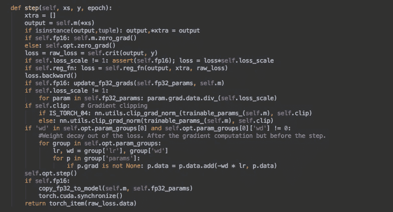
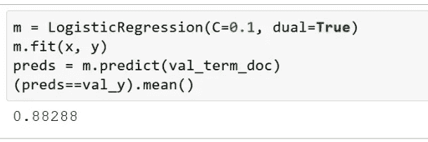

# 机器学习 1：第 10 课

> 原文：[`medium.com/@hiromi_suenaga/machine-learning-1-lesson-10-6ff502b2db45`](https://medium.com/@hiromi_suenaga/machine-learning-1-lesson-10-6ff502b2db45)

*我个人从* [*机器学习课程*](http://forums.fast.ai/t/another-treat-early-access-to-intro-to-machine-learning-videos/6826/1)*中的笔记。随着我继续审查课程以“真正”理解它，这些笔记将继续更新和改进。非常感谢* [*Jeremy*](https://twitter.com/jeremyphoward) *和* [*Rachel*](https://twitter.com/math_rachel) *给了我这个学习的机会。*

## pip 上的 Fast AI [[0:00](https://youtu.be/37sFIak42Sc)]

欢迎回到机器学习！这周最令人兴奋的事情当然是 Fast AI 现在在 pip 上了，所以你可以`pip install fastai`：

[](https://pypi.org/project/fastai/?source=post_page-----6ff502b2db45--------------------------------) [## fastai

### fastai 使得使用 PyTorch 进行深度学习更快、更准确、更容易

pypi.org](https://pypi.org/project/fastai/?source=post_page-----6ff502b2db45--------------------------------)

最简单的方法可能仍然是执行`conda env update`，但有几个地方更方便的是执行`pip install fastai`，如果你在笔记本之外的地方工作，那么这将使你在任何地方都可以访问 Fast AI。他们还向 Kaggle 提交了一个拉取请求，试图将其添加到 Kaggle 内核中。所以希望你很快就能在 Kaggle 内核上使用它。你可以在工作中或其他地方使用它，所以这很令人兴奋。我不会说它已经正式发布了。显然，现在还很早，我们仍在添加（你也在帮助添加）文档和所有这些东西。但很高兴现在有这个。

## Kaggle 内核 [[1:22](https://youtu.be/37sFIak42Sc?t=82)]

这周有几个来自 USF 学生的很酷的内核。我想强调两个都来自文本规范化竞赛的内核，该竞赛旨在尝试将标准英语文本转换为文本，还有一个俄语的。你要尝试识别可能是“第一，第二，第三”之类的东西，并说这是一个基数，或者这是一个电话号码或其他什么。我快速搜索了一下，发现学术界曾尝试使用深度学习来做这个，但他们没有取得太多进展，实际上我注意到[Alvira 的内核](https://www.kaggle.com/alvira12/class-wise-processing-lb-0-992-new-dataset)在这里得到了 0.992 的排名，我认为是前 20 名。这完全是启发式的，是特征工程的一个很好的例子。在这种情况下，整个事情基本上完全是特征工程。基本上是通过查看和使用大量正则表达式来弄清楚每个标记是什么。我认为她在这里做得很好，清楚地列出了所有不同的部分以及它们如何相互配合。她提到她也许希望将这个变成一个库，我认为这将是很好的。你可以使用它来提取文本中的所有部分。这是自然语言处理社区希望能够做到的事情，而不需要像这样大量手写代码。但目前，我很感兴趣看看获胜者到底做了什么，但我还没有看到机器学习被用来做这个特别好。也许最好的方法是将这种特征工程与一些机器学习结合起来。但我认为这是一个有效特征工程的很好例子。

[这位](https://www.kaggle.com/neerjad/class-wise-regex-functions-l-b-0-995)是另一位 USF 的学生，她做了类似的事情，得到了类似的分数，但使用了自己不同的规则。同样，这也会让你在排行榜上获得一个不错的位置。所以我觉得看到我们的一些学生参加比赛并通过基本的手写启发式方法获得前 20 名结果的例子很有趣。这就是，例如，六年前的计算机视觉仍然是这样。基本上最好的方法是大量仔细手写的启发式方法，通常结合一些简单的机器学习。所以我认为随着时间的推移，这个领域肯定在努力向更多自动化方向发展。

## [波尔图塞古罗的安全驾驶员预测获奖者](https://www.kaggle.com/c/porto-seguro-safe-driver-prediction/discussion/44629) [[4:21](https://youtu.be/37sFIak42Sc?t=261)]

实际上有趣的是，在刚刚结束的安全驾驶员预测比赛中，一个 Netflix 奖获得者赢得了这个比赛，他发明了一种处理结构化数据的新算法，基本上不需要任何特征工程。所以他使用了五个深度学习模型和一个梯度提升机获得了第一名。他的基本方法与我们迄今为止在这门课程中学到的以及明天将要学习的内容非常相似，即使用全连接的神经网络和独热编码，特别是我们将要学习的嵌入。但他有一个非常聪明的技巧，就是在这个比赛中有很多未标记的数据。换句话说，他们不知道那个司机是否会提出索赔。所以当你有一些标记和一些未标记的数据时，我们称之为半监督学习。在现实生活中，大多数学习都是半监督学习。在现实生活中，通常有一些被标记的东西和一些未被标记的东西。所以这是最实用的学习方式。而结构化数据是公司日常处理的最常见的数据类型。所以这个比赛是一个半监督的、结构化数据比赛，使其非常实用。

所以他赢得比赛的技巧是进行数据增强，你们在深度学习课程中学到的，基本上就是这样的想法，比如如果你有图片，你会水平翻转它们或者稍微旋转一下。数据增强意味着创建新的数据示例，这些示例是你已经拥有的数据的略微不同的版本。他的做法是对于数据中的每一行，他会随机地用另一行替换 15%的变量。所以现在每一行代表的是原始行的 85%混合，15%是随机选择的另一行。这是一种随机改变数据的方法，然后他使用了一种叫做自动编码器的东西，我们可能要等到深度学习课程的第二部分才会学习，但自动编码器的基本思想是你的因变量与自变量相同。换句话说，你试图预测你的输入，如果你被允许进行恒等变换，例如，显然可以轻松地预测输入，但自动编码器的技巧是至少在一个层中具有比输入更少的激活。所以如果你的输入是一个百维向量，你通过一个 100 乘以 10 的矩阵，创建十个激活，然后必须从中创建原始的 100 维向量。那么你基本上已经有效地对其进行了压缩。事实证明，这种类型的神经网络被迫在数据中找到相关性、特征和有趣的关系，即使数据没有标记。所以他使用了这个而不是进行任何手工工程。这些是一些有趣的方向，如果你继续进行机器学习研究，特别是如果你明年参加深度学习课程的第二部分，你会学到的。你可以看到特征工程正在消失，这就是刚刚一个小时前。所以这确实是非常近期的。但这是我长时间以来看到的最重要的突破之一。

# MNIST 继续[[8:32](https://youtu.be/37sFIak42Sc?t=8m32s)]

[笔记本](https://github.com/fastai/fastai/blob/master/courses/ml1/lesson4-mnist_sgd.ipynb)

这（`LogReg`）是我们创建的那个小手写的`nn.Module`类[[9:15](https://youtu.be/37sFIak42Sc?t=555)]。我们定义了损失。我们定义了学习率，我们定义了优化器。`optim.SGD`是我们接下来要尝试手写的东西。所以`nn.NLLLoss`和`optim.SGD`，我们是从 PyTorch 中借鉴的，但我们自己编写了模块`LogReg`和训练循环。

```py
net2 = LogReg().cuda()
loss=nn.NLLLoss()
learning_rate = 1e-2
optimizer=optim.SGD(net2.parameters(), lr=learning_rate)
for epoch in range(1):
    losses=[]
    dl = iter(md.trn_dl)
    for t in range(len(dl)):
        # Forward pass: compute predicted y and loss by passing x to
        # the model.
        xt, yt = next(dl)
        y_pred = net2(V(xt))
        l = loss(y_pred, V(yt))
        losses.append(l) 
        # Before the backward pass, use the optimizer object to zero
        # all of the gradients for the variables it will update
        # (which are the learnable weights of the model)
        optimizer.zero_grad() 
        # Backward pass: compute gradient of the loss with respect
        # to model parameters
        l.backward() 
        # Calling the step function on an Optimizer makes an update
        # to its parameters
        optimizer.step()

    val_dl = iter(md.val_dl)
    val_scores = [score(*next(val_dl)) for i in range(len(val_dl))]
    print(np.mean(val_scores))
```

所以基本思想是我们将经历一些时期[[9:39](https://youtu.be/37sFIak42Sc?t=579)]，所以让我们经历一个时期。我们将跟踪每个小批次的损失，以便在最后报告。我们将把我们的训练数据加载器转换为迭代器，以便我们可以循环遍历它 - 遍历每个小批次。现在我们可以继续说`for`张量`in`数据加载器的长度，然后我们可以调用`next`来从该迭代器中获取下一个自变量和因变量。

然后记住，我们可以通过调用模型来将 x 张量（`xt`）传递给我们的模型，就好像它是一个函数一样。但首先，我们必须将其转换为一个变量。上周，我们在输入`Variable(blah).cuda()`来将其转换为一个变量，Fast AI 中的一个简写是大写`V`。所以张量的大写`T`，变量的大写`V`。这只是 Fast AI 中的一个快捷方式。这将返回我们的预测。

接下来我们需要做的是计算我们的损失，因为如果我们没有计算损失，就无法计算损失的导数。所以损失接受预测值和实际值。实际值再次是 y 张量，我们必须将其转换为一个变量。变量跟踪所有计算步骤。实际上，在 PyTorch 网站上有一个很棒的教程。

接下来我们需要做的是计算我们的损失，因为如果我们没有计算损失，就无法计算损失的导数。所以损失接受预测值和实际值。实际值再次是 y 张量，我们必须将其转换为一个变量。变量跟踪所有计算步骤。实际上，在 PyTorch 网站上有一个很棒的教程。在 PyTorch 网站上，有一个教程部分，其中有一个关于 Autograd 的教程。Autograd 是随 PyTorch 一起提供的自动微分包的名称，它是自动微分的实现。因此，Variable 类是真正的关键类，因为它可以将张量转换为我们可以跟踪其梯度的东西。基本上在这里他们展示了如何创建一个变量，对变量进行操作，然后可以回头查看 grad 函数（`grad_fn`），这是它跟踪以计算梯度的函数。因此，当我们对这个变量和从该变量计算出的变量进行更多操作时，它会继续跟踪。稍后，我们可以进行`.backward()`，然后打印`.grad`并找出梯度。所以你会注意到我们从未定义过梯度，我们只是定义它为`(x + 2)² * 3`之类的表达式，它可以计算梯度。

这就是为什么我们需要将其转换为一个变量。所以`l`现在是一个包含损失的变量。它包含了这个小批量的损失的单个数字。但它不仅仅是一个数字。它是一个作为变量的数字，所以它是一个知道如何计算的数字。

我们将把这个损失添加到我们的数组中，这样我们以后可以得到它的平均值。现在我们要计算梯度。所以`l.backward()`是一个指令，表示计算梯度。所以记住当我们调用网络时，实际上是调用我们的前向函数。这就像是向前走一遍。然后向后就像是使用链式法则向后计算梯度。

`optimizer.step()`是我们即将编写的内容，即根据梯度和学习率更新权重。`zero_grad()`，我们将在手动编写时解释。


然后最后，我们可以将验证数据加载器转换为迭代器。然后我们可以遍历它的长度，每次取出一个 x 和 y，并询问我们定义的分数，即你预测了哪个，实际上是哪个，并检查它们是否相等。然后这些的平均值将是我们的准确率。

```py
def score(x, y):
    y_pred = to_np(net2(V(x)))
    return np.sum(y_pred.argmax(axis=1) == to_np(y))/len(y_pred)
```

**问题**: 为什么你要将其转换为迭代器而不是使用普通的 Python 循环[[14:53](https://youtu.be/37sFIak42Sc?t=893)]？我们正在使用普通的 Python 循环，所以问题实际上是与什么进行比较。所以，也许你在考虑的替代方案可能是，我们可以使用类似带有索引器的列表。问题在于我们每次获取一个新的小批次时，我们希望它是随机的。我们希望有一个不同的洗牌过的东西。所以这个`for t in range(len(dl))`，你实际上可以无限迭代。你可以循环遍历它任意次数。所以这种想法在不同的语言中被称为不同的东西，但很多语言称之为流处理，这是一种基本的想法，而不是说我想要第三个或第九个东西，而是说我想要下一个东西。这对网络编程非常有用——从网络中获取下一个东西。对于 UI 编程也非常有用——获取下一个事件，比如有人点击了一个按钮。事实证明，这对于这种数值编程也非常有用——就像我只想要下一个数据批次。这意味着数据可以是任意长的，因为我们一次只获取一部分。我想简短的回答是因为这是 PyTorch 的工作方式。PyTorch 的数据加载器被设计为以这种方式调用。所以 Python 有这个生成器的概念，它是一种可以创建行为像迭代器的函数的方式。Python 已经认识到这种流处理编程方法非常方便和有用，并且在各处支持它。所以基本上任何你使用`for ... in`循环的地方，任何你使用列表推导的地方，这些东西都可以是生成器或迭代器。通过这种方式编程，我们获得了很大的灵活性。听起来对吗，Terrence？你是编程语言专家。

**Terrence**: 是的，我的意思是你说的很对。你可能会提到空间的问题，但在这种情况下，所有这些数据都必须在内存中，因为我们有...

**Jeremy**: 不需要在内存中。事实上，大多数情况下，使用 PyTorch，小批次将根据需要从分布在磁盘上的单独图像中读取，所以大多数情况下它不在内存中。

**Terrence**: 但一般来说，你希望尽可能少地一次性保存在内存中。所以流处理的想法也很棒，因为你可以进行组合。你可以将数据传送到另一台机器。

**Jeremy**: 是的，组合很棒。你可以从这里获取下一个东西，然后将其发送到下一个流中，然后你可以获取它并做其他事情。

**Terrence**: 你们都认识到，当然，在命令行管道和 I/O 重定向中。

**Jeremy**: 谢谢，Terrence。与真正知道自己在谈论什么的人一起工作的好处。

## 实现随机梯度下降[[18:24](https://youtu.be/37sFIak42Sc?t=1104)]

现在让我们拿掉优化器。我们唯一剩下的是负对数似然损失函数，实际上我们也可以替换。我们在笔记本中有 Yannet 从头开始编写的实现。正如我们之前学到的那样，只需要一行代码。你可以用一个 if 语句来做到。所以我不知道为什么我如此懒惰，要包括这个。

所以我们要做的是，再次获取我们自己编写的模块（逻辑回归模块）。我们将再次进行一个 epoch。我们将循环遍历迭代器中的每个元素。我们将获取我们的独立和依赖变量用于小批量，将其传递给我们的网络，计算损失。所以这一切和以前一样，但现在我们要摆脱`optimizer.step()`，我们要手动做。所以基本的技巧是，正如我提到的，我们不会手动进行微积分。我们调用`l.backward()`来自动计算梯度，这将填充我们的矩阵。这就是我们构建的模块：


所以线性层权重的权重矩阵，我们称为`l1_w`，偏差我们称为`l1_b`。它们是我们创建的属性。所以我只是把它们放到了叫做`w`和`b`的东西里，基本上是为了节省一些输入。所以 w 是我们的权重，b 是我们的偏差。所以权重，记住权重是一个变量，要从变量中获取张量，我们必须使用`.data`。所以我们想要更新这个变量中的实际张量，所以我们说：

`w.data -= w.grad.data * lr`

+   `-=`我们想要朝着梯度的相反方向前进。梯度告诉我们哪个方向是向上的。我们想要向下。

+   `w.grad.data * lr`当前梯度乘以学习率。

这就是梯度下降的公式。正如你所看到的，这是你可能想象到的最简单的事情。就像更新权重等于它们现在的值减去梯度乘以学习率一样。对偏差也是同样的操作。

```py
net2 = LogReg().cuda()
loss_fn=nn.NLLLoss()
lr = 1e-2
w,b = net2.l1_w,net2.l1_b

for epoch in range(1):
    losses=[]
    dl = iter(md.trn_dl)
    for t in range(len(dl)):
        xt, yt = next(dl)
        y_pred = net2(V(xt))
        l = loss(y_pred, Variable(yt).cuda())
        losses.append(loss)

        # Backward pass: compute gradient of the loss with respect 
        # to model parameters
        l.backward()
        w.data -= w.grad.data * lr
        b.data -= b.grad.data * lr

        w.grad.data.zero_()
        b.grad.data.zero_()   

    val_dl = iter(md.val_dl)
    val_scores = [score(*next(val_dl)) for i in range(len(val_dl))]
    print(np.mean(val_scores))
```

问题：当我们在顶部执行`next`时，当循环结束时，我们如何获取下一个元素？所以这个(`**for** t **in** range(len(dl)):`)是在长度范围内的每个索引进行循环，所以这是 0、1、2...在这个循环结束时，它将打印出验证集的平均值，然后回到 epoch 的开始，在这一点上，它将创建一个新的迭代器。所以基本上在 Python 的后台当你调用`iter(md.trn_dl)`时，它基本上告诉它重置其状态以创建一个新的迭代器。如果你对它是如何工作感兴趣，所有的代码都可以供你查看。`md.trn_dl`是`fastai.dataset.ModelDataLoader`，所以我们可以看一下它的代码，看看它是如何构建的。所以你可以在这里看到，`__next__`函数跟踪了它在`self.i`中经历了多少次，这里是`__iter__`函数，当你创建一个新的迭代器时会调用这个函数。你可以看到它将其传递给另一个类型为 DataLoader 的东西，然后如果你对它是如何实现的感兴趣，你可以查看 DataLoader。


所以我们编写的 DataLoader 基本上使用多线程，允许同时进行多个操作。这非常简单。只有大约一屏的代码，所以如果你对简单的多线程编程感兴趣，这是一个值得一看的好东西。

问题：为什么你把这个包装在`for epoch in range(1)`中，因为这只会运行一次？因为在现实生活中，我们通常会运行多个 epochs。就像在这种情况下，因为这是一个线性模型，它实际上在一个 epoch 内训练到了它能达到的最好状态，所以如果我在这里输入 3，你会看到在第一个 epoch 之后它实际上不会有太大的改进。但当我们回到顶部时，我们将看一些稍微更深入和更有趣的版本，这将需要更多的 epochs。所以如果我要把这个转换成一个函数，我会像这样写`def train_mdl`，你会传入一些 epochs 的数量之类的东西。


要记住的一件事是，当你创建这些神经网络层时，记住这个（`LogReg()`）在 PyTorch 看来只是一个 nn.Module ——我们可以将其用作一个层，我们可以将其用作一个函数，我们可以将其用作一个神经网络。PyTorch 不认为这些是不同的东西。因此，这可能是另一个网络中的一层。那么梯度是如何工作的呢？所以如果你有一个层，我们可以将其看作是激活或通过某些其他非线性/线性激活函数计算出的一些激活。然后从该层，很可能我们会将其通过矩阵乘积来创建一些新层。因此，如果我们抓取像这样的一个激活，实际上会用来计算每一个输出。


因此，如果要计算导数，你必须知道这个权重矩阵如何影响每个输出，并将所有这些加在一起以找到一个激活在所有输出上的总影响。这就是为什么在 PyTorch 中你必须告诉它何时将梯度设置为零。因为想法是你可能有很多不同的损失函数或者下一组激活中的很多不同的输出，所有这些都会增加或减少你的梯度。所以你基本上必须说，好的，这是一个新的计算 — 重置。所以这就是我们这样做的地方：


在我们执行`l.backward()`之前，我们说重置。所以让我们拿出我们的权重，拿出梯度，拿出它们指向的张量，然后`zero_`。在 PyTorch 中，下划线作为后缀意味着“原地”，听起来像一个小技术细节，但记住这一点非常有用。几乎每个函数都有一个下划线版本的后缀，它会原地执行操作。所以通常 zero 返回一个特定大小的零张量，所以 zero_ 意味着用一堆零替换这个内容。

好了，就是这样。这就是从头开始的 SGD。如果我去掉我的菜单栏，我们可以正式说它适合在一个屏幕内。当然，我们还没有得到我们的逻辑回归的定义，那是另外半个屏幕，但基本上没有太多内容。

**问题**：为什么我们需要多个 epochs？简单回答就是，假设我们的学习率很小。那么它就不会走得很远。没有什么规定说通过一个 epoch 就足以让你达到目标。所以这就像是，好吧，让我们增加学习率。当然，我们可以增加学习率，但谁能说最高的学习率是稳定学习的足够多呢。对于大多数数据集和大多数架构来说，一个 epoch 很少能让你达到最好的结果。线性模型的行为非常好。所以你通常可以使用更高的学习率并更快地学习。此外，通常无法获得如此好的准确性，因此也没有太多的提升空间。因此，进行一个 epoch 将是罕见的。

# 向后走

让我们往回走。所以往回走，我们基本上会说让我们不要一遍又一遍地写这些代码（在左侧）。让别人替我们做。


这些版本之间唯一的区别就是，不是我们自己说`.zero_`或`-= gradient * lr`，而是这些操作已经为我们封装好了（在右侧）。

这里还有一个问题，即左侧更新权重的方法实际上效率很低。它没有利用动量和曲率。因此，在深度学习课程中，我们也学习了如何从头开始实现动量。因此，如果我们实际上只是使用普通的 SGD 而不是 Adam，它们实际上是完全相同的，你会看到左侧版本学习得更慢。

让我们自动做更多的事情。考虑到每次训练时，我们必须循环遍历 epoch、batch，进行前向传播，计算损失，梯度清零，反向传播，优化器进行一步操作，让我们把所有这些放在一个函数中。这个函数被称为`fit`：


就是这样。让我们看看 fit：


然后这是步骤：



梯度清零，计算损失（记住，PyTorch 倾向于称之为准则而不是损失），进行反向传播。然后，还有一些我们在这里没有学到的东西，但我们在深度学习课程中学到的，那就是“梯度裁剪”，所以你可以忽略它。所以你可以看到，我们学到的所有东西，当你查看实际框架内部时，那就是你看到的代码。这就是 fit 的作用。

然后下一步就是有一些权重和偏差，进行矩阵乘法和加法，让我们把它放在一个函数中。进行对数 softmax 的操作，让我们把它放在一个函数中。然后首先进行这个操作，然后进行那个操作，将函数链接在一起的想法，让我们把它放在一个函数中。最终我们得到了：


所以 Sequential 简单地意味着通过这个函数执行这个操作，将结果传递给这个函数，依此类推。而 Linear 意味着创建权重矩阵，创建偏差。就是这样。

然后，正如我们开始讨论的那样，通过将其放入 100 个激活中，而不是直接将其发送到 10 个激活中，我们可以将其转换为一个深度神经网络。我们可以选择任何我们喜欢的数字。通过 ReLU 使其非线性化，通过另一个线性层，再通过一个 ReLU，然后通过我们的最终输出和最终激活函数。


现在这是一个深度网络。所以我们可以拟合它。这一次，因为它更深了，我实际上要运行更多的 epochs。你可以看到准确性在增加：


如果你尝试将学习率从 0.1 进一步增加，它实际上开始变得不稳定。

## 学习率退火

我会告诉你一个技巧。这被称为学习率退火，技巧就是这样。当你试图拟合一个函数时，你已经走了几步。当你接近底部时，你的步伐可能会变得更小。否则，通常会发生的情况是你发现自己在同样的地方来回摆动。


你可以在上面的准确性中实际看到它开始变得平坦。这可能是因为它已经做得尽可能好了，或者可能是因为它在前进和后退。所以在训练后期降低学习率并采取更小的步骤是个好主意。这就是所谓的学习率退火。在 Fast AI 中有一个名为`set_lrs`（设置学习率）的函数，你可以传入你的优化器和新的学习率，看看是否有帮助。很多时候确实有帮助。你应该减少大约一个数量级。在深度学习课程中，我们学习了一种比这更好的技术，可以自动进行学习率退火并在更细粒度的级别上进行。但如果你手动操作，一次减少一个数量级是人们通常做的事情。


你会看到论文中谈论学习率调度，这就像一个学习率调度。这个调度让我们达到了 97%。我尝试继续下去，但似乎我们无法比这更好。所以我们得到了一个可以达到 97%准确性的东西。

**问题**：我有一个关于数据加载的问题。我知道这是一个 Fast AI 函数，但你能详细介绍一下它是如何创建批次的，如何完成的，以及如何做出这些决定吗？当然。基本上，PyTorch 中有一个非常好的设计，他们基本上说让我们创建一个叫做数据集的东西。数据集基本上看起来像一个列表。它有一个长度（例如数据集中有多少图像），并且可以像列表一样进行索引。所以如果你有数据集`d`，你可以这样做：

```py
d = Dataset(...)
len(d)
d[i]
```

这基本上就是 PyTorch 关心的数据集。所以你从数据集开始，就像`d[3]`给你第三张图像，等等。所以你拿一个数据集，你可以把它传递给一个数据加载器的构造函数`dl = DataLoader(d)`。这会给你一个现在可迭代的东西。所以你现在可以说`iter(dl)`，这是你可以调用 next 的东西（即`next(iter(dl))`）。当你调用数据加载器的构造函数时，你可以选择打开或关闭洗牌。打开洗牌意味着给我随机的小批量，关闭洗牌意味着按顺序进行。所以当你调用`next`时，假设你说`shuffle=True`并且批量大小是 64，它会在 0 到长度之间抓取 64 个随机整数，并调用这个（`d[i]`）64 次以获取 64 个不同的项目并将它们组合在一起。所以 Fast AI 使用完全相同的术语和完全相同的 API。我们只是以不同的方式处理一些细节。特别是在计算机视觉中，你经常想要做很多数据增强，比如翻转、稍微改变颜色、旋转，这些都是计算密集型的。甚至只是读取 JPEG 文件也是计算密集型的。所以 PyTorch 使用一种方法，即启动多个处理器并行进行处理，而 Fast AI 库则使用一种称为多线程的方法，这可能是更快的方法。

**问题**：在“epoch”中，所有元素都会被返回一次吗？是在 epoch 开始时进行洗牌吗？是的，并非所有库都以相同的方式工作。有些会进行有放回抽样，有些则不会。Fast AI 库实际上将洗牌交给了实际的 PyTorch 版本，我相信 PyTorch 版本实际上会进行洗牌，一个 epoch 会覆盖所有元素，我相信。

现在问题是，当你开始使用这些更大的网络时，潜在地你会得到相当多的参数。我想要求你计算一下有多少参数，但让我们记住这里我们有 28 乘以 28 的输入进入 100 个输出，100 进入 10。然后对于每一个，我们有权重和偏置。


所以我们实际上可以这样做。`net.parameters`返回一个列表，列表中的每个元素都是一个包含参数的张量，不仅仅是那一层，如果是一个既有权重又有偏置的层，那就是两个参数。所以基本上给我们返回了一个包含所有参数的张量的列表。PyTorch 中的`numel`告诉你它有多大。


所以如果我运行这个，这里是每一层中的参数数量。所以我有 784 个输入，第一层有 100 个输出，因此第一个权重矩阵的大小是 78400。第一个偏置向量的大小是 100。然后下一个是 100 乘以 100，有 100。然后下一个是 100 乘以 10，10 是偏置。所以每一层中的元素数量就是这样。我把它们加起来，差不多有十万个。所以我可能有过拟合的风险。所以我们可能需要考虑使用正则化。

# 正则化

在所有机器学习中，一种非常简单常见的正则化方法叫做 L2 正则化。这非常重要，非常方便，你可以将它用于几乎任何东西。基本思想是这样的。通常我们会说我们的损失等于（让我们用 RMSE 来保持简单）我们的预测减去我们的实际值的平方，然后求和，取平均值，再开平方。


如果我们想说，如果我有很多参数，除非它们真的足够有用，否则不要使用它们。如果你有一百万个参数，而你只真正需要 10 个参数来有用，那就只用 10 个。那么我们如何告诉损失函数做到这一点呢？基本上我们想说的是，嘿，如果一个参数是零，那没问题。就好像它根本不存在一样。所以让我们惩罚一个参数不为零。我们如何衡量这一点呢？我们如何计算我们的参数有多不为零？L1 是权重平均值的绝对值。L2 是权重本身的平方。然后我们想要说好，我们想要惩罚不为零的程度有多大？因为如果我们实际上没有那么多参数，我们根本不想要进行正则化。如果我们有很多参数，我们确实想要进行大量正则化。所以我们加入一个参数 a：


除了可能打印出来之外，我们实际上并不关心损失。我们真正关心的是损失的梯度。*aw²*的梯度是*2aw*。所以有两种方法可以做到这一点：

1.  我们实际上可以修改我们的损失函数来添加这个平方惩罚。

1.  我们可以修改我们说的权重等于权重减去梯度乘以学习率的那个东西，也加上*2aw*。

这些基本上是等价的，但它们有不同的名称。第一个称为 L2 正则化，第二个称为权重衰减。第一个版本是最初在神经网络文献中提出的，而第二个版本是在统计文献中提出的，它们是等价的。

正如我们在深度学习课程中讨论的那样，事实证明它们并不完全等价，因为当你有动量和 Adam 等因素时，它们的行为可能会有所不同。两周前，一位研究人员找到了一种方法来在现代优化器中实现正确的权重衰减，我们 Fast AI 的一位学生在 Fast AI 库中实现了这一点，因此 Fast AI 现在是第一个实际支持这一功能的库。

无论如何，现在让我们使用 PyTorch 称为权重衰减的版本，但实际上根据两周前的这篇论文，它实际上是 L2 正则化。这并不完全正确，但足够接近。所以在这里，我们可以说权重衰减是 1e-3。


这将把我们的惩罚乘数 a 设置为 1e-3，并将其添加到损失函数中。让我们复制这些单元格，以便我们可以比较它们的训练方式。你可能会注意到这里有一些反直觉的地方[48:54]。0.23547 是我们的训练误差。你可能会期望我们的带有正则化的训练误差会更糟，因为我们正在惩罚那些可以使其更好的参数。然而实际上，它开始时并不是更糟（之前是 0.29756）。这可能是为什么呢？


这样做的原因是，如果你有一个看起来像这样的函数：


训练可能需要很长时间，否则，如果你有一个看起来更像这样的函数：


它会训练得更快。有些事情你可以做，有时只是可以让一个可怕的函数变得不那么可怕。有时候权重衰减实际上可以使你的函数行为更好，这实际上在这里发生了。所以我只是提到这一点是为了说不要让这使你困惑。权重衰减确实对训练集进行惩罚，严格来说，我们最终得到的训练集的数字不应该更好，但有时候它可以更快地训练。

问题：我不明白。为什么会使它更快？训练时间重要吗？不，这是在一个时代之后。底部是我们没有使用权重衰减的训练，顶部是使用了权重衰减的训练。这与时间无关，只与一个时代有关。在一个时代之后，我的观点是，所有其他条件相同，你会预期使用权重衰减的训练集会有更糟的损失，因为我们在惩罚它。我说“哦，不是这样。这很奇怪。”


原因在于，在一个单独的时代中，重要的是你是在尝试优化一个非常崎岖的东西，还是在尝试优化一个平滑的东西。如果你试图优化一个非常崎岖的东西，想象一下在某个高维空间中，你最终会在所有这些不同的管道和隧道中滚动。而如果它只是平滑的，你只是一下就到了。想象一颗大理石滚下山坡，其中一个是旧金山的隆巴德街 - 前进，后退，前进，后退，需要很长时间才能开到尽头。而如果你骑摩托车直接越过山顶，速度就快得多。因此，损失函数表面的形状定义了优化的难易程度。因此，根据这些结果，似乎在这里使用权重衰减使得这个函数更容易优化。

问题：所以只是为了确保，惩罚会使优化器更有可能达到全局最小值吗？不，我不会这么说。我的观点实际上是，最终，它可能在训练集上表现得不太好，确实看起来是这样。最终，在五个时代之后，我们的训练集现在比使用权重衰减时更糟糕。这是我所期望的。就像我从不使用全局最优这个术语，因为我们对此没有任何保证。我们并不真正关心。我们只关心在经过一定数量的时代之后我们到达了哪里。我们希望我们找到了一个好的解决方案。因此，当我们达到一个好的解决方案时，使用权重衰减的训练集，损失更糟糕，因为它是惩罚。但在验证集上，损失更好，因为我们对训练集进行了惩罚，以便尝试创建一个更好泛化的东西。因此，无用的参数现在为零，泛化更好。所以我们所说的只是在一个时代之后它达到了一个好的点。

问题：这总是真的吗？如果你的意思是权重衰减总是使函数表面更加平滑，那么不，这并不总是真的。但值得记住，如果你在训练一个函数时遇到困难，添加一点点权重衰减可能会有所帮助。

**问题**：通过对参数进行正则化，它的作用是使损失函数表面变得更加平滑？我的意思是，这不是我们这样做的原因。我们这样做的原因是因为我们想惩罚那些不为零的东西，告诉它不要让这个参数变得很大，除非它真的对损失有很大帮助。如果可以的话，将其设置为零，因为将尽可能多的参数设置为零意味着它会更好地泛化。这就像拥有一个更小的网络一样。这就是我们这样做的原因。但它也可以改变学习方式。

我想检查一下我们实际上在这里是怎么做的。所以在第二个时代之后，你可以看到这里确实有帮助。在第二个时代之后，我们之前达到了 97%的准确率，现在我们几乎达到了 98%的准确率。你可以看到损失是 0.08 对 0.13。所以添加正则化使我们能够找到更好的解决方案（3%对 2%）。


**问题**：所以这有两个部分——一个是 L2 正则化和权重衰减？不，我的观点是它们是同一件事。所以权重衰减是 L2 正则化的版本，如果你只是对 L2 正则化求导，你会得到权重衰减。所以你可以通过改变损失函数来实现它，加入平方损失惩罚，或者你可以通过将权重本身添加到梯度中来实现它。

**问题**：我们可以在卷积层中使用正则化吗？当然可以。卷积层只是权重。

**问题**：你能解释一下为什么你认为在这个特定问题中需要权重衰减吗？不容易。我是说，除了说这是我总是会尝试的事情之外。**继续提问**：过拟合？所以如果我的训练损失高于验证损失，那么我就是欠拟合。所以肯定没有必要正则化。那总是不好的。那总是意味着你的模型需要更多的参数。在这种情况下，我是过拟合的。这并不一定意味着正则化会有帮助，但值得一试。


**问题**：你如何选择最佳的时代数？你参加我的深度学习课程😆 这是一个很长的故事。我们没有时间在这堂课上讨论最佳实践。我们将学习基础知识。

## 现代机器学习技术的秘密

在深度学习课程中我们详细讨论的一点是，我认为现代机器学习技术的秘密是对问题的解决方案进行大规模的参数化，就像我们刚刚做的那样。当我们只有少量的 28x28 图像时，我们有大约 10 万个权重，然后使用正则化。这与几十年前几乎所有统计和学习的做法完全相反，大多数大学的大多数领域的高级讲师仍然具有这种背景，他们学习到构建模型的正确方式是尽可能少地使用参数。因此，希望我们迄今已经学到了两件事。一是即使模型有很多参数，我们也可以构建非常准确的模型。随机森林有很多参数，这里的深度网络也有很多参数，它们可以很准确。我们可以通过使用装袋或使用正则化来实现。在神经网络中，正则化意味着权重衰减（也称为“某种程度的” L2 正则化）或者我们在这里不会过多担心的 dropout。这是一种构建有用模型的非常不同的思考方式。我只是想警告你，一旦你离开这个教室，甚至可能当你去听下一个教员的讲座时，甚至在美国旧金山大学也会有完全受过小参数模型训练的人。你的下一个老板可能是在小参数模型的世界中接受过培训的。他们认为这些模型在某种程度上更纯净、更容易、更好、更可解释或者其他什么。我相信这不是真的 - 可能永远不是真的。当然很少是真的。实际上，正如我们从随机森林解释的整个课程中学到的那样，具有大量参数的模型可以非常可解释。你可以使用大部分相同的技术来处理神经网络，但是神经网络更容易。记得我们是如何通过随机化一列来计算特征重要性的吗，以查看该列的变化如何影响输出？嗯，这就像一种愚蠢的计算梯度的方式。改变这个输入会如何改变输出？对于神经网络，我们实际上可以计算其梯度。因此，使用 PyTorch，你实际上可以说输出相对于这一列的梯度是多少？你可以使用相同的方法来使用神经网络进行偏依赖图。对于那些对产生真正影响感兴趣的人，基本上没有人为神经网络编写这些东西。因此，整个领域需要编写库、撰写博客文章。一些论文已经写了，但只在非常狭窄的领域，比如计算机视觉。据我所知，没有人写过关于如何进行结构化数据神经网络解释方法的论文。因此，这是一个非常令人兴奋的大领域。

# NLP [[1:02:04](https://youtu.be/37sFIak42Sc?t=3724)]

然而，我们将从应用简单的线性模型开始。对我来说有点可怕，因为我们将进行 NLP，而我们的 NLP 专家就在房间里。因此，如果我搞砸了，David，请大声告诉我。NLP 指的是我们处理自然语言文本的任何建模。有趣的是，我们将看一个情况，线性模型在解决特定问题时非常接近最先进技术。几周前，我实际上使用递归神经网络超越了最先进技术，但这实际上将向你展示线性模型非常接近最先进技术。

## IMDb

[笔记本](https://github.com/fastai/fastai/blob/master/courses/ml1/lesson5-nlp.ipynb)

我们将使用 IMDb 数据集。这是一个电影评论数据集。您可以按照以下步骤下载它：

```py
To get the dataset, in your terminal run the following commands:wget http://ai.stanford.edu/~amaas/data/sentiment/aclImdb_v1.tar.gzgunzip aclImdb_v1.tar.gztar -xvf aclImdb_v1.tar
```

一旦你下载了它，你会看到你有一个训练和一个测试目录，在你的训练目录中，你会看到有一个负面和一个正面目录。在你的正面目录中，你会看到有一堆文本文件。

```py
PATH='data/aclImdb/'
names = ['neg','pos']
%ls {PATH}
'''
aclImdb_v1.tar.gz  imdbEr.txt  imdb.vocab  models/  README  test/  tmp/  train/
'''
%ls {PATH}train
'''
aclImdb/  all_val/         neg/  tmp/    unsupBow.feat  urls_pos.txt
all/      labeledBow.feat  pos/  unsup/  urls_neg.txt   urls_unsup.txt
'''
%ls {PATH}train/pos | head
'''
0_9.txt
10000_8.txt
10001_10.txt
10002_7.txt
10003_8.txt
10004_8.txt
10005_7.txt
10006_7.txt
10007_7.txt
10008_7.txt
...
'''
```

这里是一个文本文件的例子：

```py
trn[0]
'''
"Story of a man who has unnatural feelings for a pig. Starts out with a opening scene that is a terrific example of absurd comedy. A formal orchestra audience is turned into an insane, violent mob by the crazy chantings of it's singers. Unfortunately it stays absurd the WHOLE time with no general narrative eventually making it just too off putting. Even those from the era should be turned off. The cryptic dialogue would make Shakespeare seem easy to a third grader. On a technical level it's better than you might think with some good cinematography by future great Vilmos Zsigmond. Future stars Sally Kirkland and Frederic Forrest can be seen briefly."
'''
```

所以我们不知何故选出了一个男人对猪有不自然感情的故事作为我们的第一个选择。这并不是故意的，但没关系。

我们将查看这些电影评论，对于每一个，我们将查看它们是积极的还是消极的。所以它们被放入了其中一个文件夹。它们是从 IMDb（电影数据库和评论网站）下载的。那些非常积极的评论放在`/pos`中，非常消极的评论放在`/neg`中，而其余的则没有标签（`/unsup`）。所以只有高度极化的评论。

所以在上面的例子中，我们有一个疯狂的暴力暴民，不幸的是太荒谬了，太令人反感了，那些来自那个时代的人应该被关掉。所以这个的标签是零，即负面的，所以这是一个负面的评论。

```py
trn_y[0]
'''
0
'''
```

在 Fast AI 库中，有很多函数和类可以帮助你处理大多数机器学习的领域。对于自然语言处理，我们有一个简单的东西，就是来自文件夹的文本。

```py
trn,trn_y = texts_labels_from_folders(f'{PATH}train',names)
val,val_y = texts_labels_from_folders(f'{PATH}test',names)
```

这将遍历并找到这里的所有文件夹（第一个参数`f'{PATH}train'`）与这些名称（第二个参数`names`）并创建一个带标签的数据集。不要让这些事情阻止你理解幕后发生的事情。我们可以获取它的源代码，你会看到它很小，就像 5 行。


我不喜欢把这些东西写得很详细，而是把它们隐藏在一些小函数后面，这样你就可以重复使用它们。但基本上，它将遍历每个目录，遍历该目录中的每个文件，然后将其放入一个文本数组中，找出它在哪个文件夹中，并将其放入一个标签数组中。这就是我们最终得到的东西，我们有一个评论数组和一个标签数组。

这就是我们的数据。所以我们的工作将是接受一部电影评论并预测标签。我们将要做的是，我们将丢弃关于语言的所有有趣的东西，即单词的顺序。这通常不是一个好主意，但在这种情况下，它将不会太糟糕。所以让我告诉你我所说的丢弃单词顺序是什么意思。通常，单词的顺序非常重要。如果你在某个单词前面有一个“not”，那么这个“not”就指的是那个东西。但在这种情况下，我们试图预测某物是积极的还是消极的。如果你看到“荒谬”或“神秘”这样的词经常出现，也许这是一个迹象表明这不是很好。所以我们的想法是将其转换为一个称为术语文档矩阵的东西，对于每个文档（即每个评论），我们只是创建一个包含其中的单词列表，而不是它们的顺序。

## 术语文档矩阵示例：

[朴素贝叶斯.xlsx](https://github.com/fastai/fastai/blob/master/courses/ml1/excel/naivebayes.xlsx)


这里有四个我编造的电影评论。所以我将把这些转换成一个术语文档矩阵。我需要做的第一件事是创建一个称为词汇表的东西。词汇表是出现的所有唯一单词的列表。这是我的词汇表：this, movie, is, good, the bad。这就是所有的单词。现在我将把我的每个电影评论转换成一个向量，显示哪些单词出现以及它们出现的频率。在这种情况下，我的单词没有出现两次。所以这被称为术语文档矩阵：


这种表示法，我们称之为**词袋**表示法。所以这里是评论的一个词袋表示。


它不再包含文本的顺序。它只是一袋词（即其中包含哪些词）。它包含“bad”，“is”，“movie”，“this”。所以我们要做的第一件事是将其转换为一种词袋表示。这对于线性模型来说很方便的原因是，这是一个我们可以进行数学运算的漂亮矩阵。具体来说，我们可以进行逻辑回归，这就是我们要做的。我们将达到一个进行逻辑回归的点。不过，在那之前，我们将做另一件事，那就是朴素贝叶斯。sklearn 有一个可以为我们创建术语文档矩阵的东西，叫做[CountVectorizer](http://scikit-learn.org/stable/modules/generated/sklearn.feature_extraction.text.CountVectorizer.html)，所以我们将使用它。

## 标记化 [[1:09:01](https://youtu.be/37sFIak42Sc?t=4141)]

现在在自然语言处理中，你必须将文本转换为单词列表，这就是所谓的标记化。这实际上并不是微不足道的，因为如果这实际上是`This movie is good.`或`This “movie” is good.`，你如何处理标点符号呢？更有趣的是，如果这是`This "movie" isn’t good.`，你如何将一段文本转换为标记列表呢？一个好的标记器会将这个转换为：

之前：`This "movie" isn’t good.`

之后：`This " movie " is n’t good .`

所以你可以看到，在这个版本中，如果我现在按空格分割这个文本，每个标记要么是一个单独的标点符号，要么是这个后缀`n't`，被视为一个单词。这就是我们可能想要对这段文本进行标记化的方式，因为你不希望`good.`成为一个对象。没有`good.`或`"movie"`是一个对象的概念。所以标记化是我们交给标记器的事情。Fast AI 中有一个我们可以使用的标记器，这就是我们如何使用标记器创建我们的术语文档矩阵：

```py
veczr = CountVectorizer(tokenizer=tokenize)
```

sklearn 有一个相当标准的 API，这很好。我相信你以前见过几次。一旦我们建立了某种“模型”，我们可以把`CountVectorizer`看作是一种模型，这只是定义它将要做什么。我们可以调用`fit_transform`来执行这个操作。

```py
trn_term_doc = veczr.fit_transform(trn)
val_term_doc = veczr.transform(val)
```

在这种情况下，`fit_transform`将创建词汇表，并基于训练集创建术语文档矩阵。`transform`有点不同。它表示使用先前拟合的模型，这在这种情况下意味着使用先前创建的词汇表。我们不希望验证集和训练集在矩阵中有不同顺序的单词。因为那样它们会有不同的含义。所以这里说的是使用相同的词汇表为验证集创建一个词袋。

**问题**：如果验证集中有不同于训练集的单词集合怎么办[[1:11:40](https://youtu.be/37sFIak42Sc?t=4300)]？这是一个很好的问题。通常，大多数这些词汇创建方法会为未知单词设定一个特殊标记。有时你也可以说，如果一个单词出现少于三次，就称之为未知。但是，如果你看到了以前没有见过的东西，就称之为未知。所以（即“未知”）只会成为词袋中的一列。

当我们创建这个术语文档矩阵时，训练集有 25,000 行，因为有 25,000 条电影评论，有 75,132 列，这是唯一单词的数量。

```py
trn_term_doc
'''
<25000x75132 sparse matrix of type '<class 'numpy.int64'>'
     with 3749745 stored elements in Compressed Sparse Row format>
'''
```

现在，大多数文档并不包含这 75,132 个单词中的大部分。所以我们不想把它实际存储为内存中的普通数组。因为这样会非常浪费。所以，我们将其存储为稀疏矩阵。稀疏矩阵的作用是将其存储为一种只指示非零值位置的东西。所以它会说，文档编号 1，单词编号 4 出现了 4 次。文档编号 1，术语编号 123 出现了一次，依此类推。

```py
(1, 4) → 4
(1, 123) → 1
```

这基本上就是它的存储方式。实际上有许多不同的存储方式，如果你学习 Rachel 的计算线性代数课程，你将了解不同类型的存储方式以及为什么选择它们，如何转换等等。但它们都类似于这样，你不需要太担心细节。重要的是它是高效的。

所以我们可以拿到第一条评论，这给了我们一个 75,000 个长稀疏的一行长矩阵，其中有 93 个存储元素。换句话说，这些单词中有 93 个实际上在第一个文档中使用。

```py
trn_term_doc[0]
'''
<1x75132 sparse matrix of type '<class 'numpy.int64'>'
	with 93 stored elements in Compressed Sparse Row format>
'''
```

我们可以通过说`veczr.get_feature_names`来查看词汇表，这给我们提供了词汇表。这里是一些特征名称的元素的示例：

```py
vocab = veczr.get_feature_names(); vocab[5000:5005]
'''
['aussie', 'aussies', 'austen', 'austeniana', 'austens']
'''
```

我并没有故意选择那个有澳大利亚的，但那是重要的单词，显然😄我这里没有使用分词器。我只是按空格分割，所以这与矢量化器所做的不完全相同。但为了简化事情，让我们拿到所有小写单词的集合。通过将其设置为集合，我们使它们成为唯一的。所以这大致是可能出现的单词列表。

```py
w0 = set([o.lower() for o in trn[0].split(' ')]); w0
'''
{'a',
 'absurd',
 'an',
 'and',
 'audience',
 'be',
 'better',
 'briefly.',
 'by',
 'can',
 ...
}
'''
len(w0)
'''
91
'''
```

这个长度是 91，与 93 相似，唯一的区别是我没有使用真正的分词器。所以基本上就是这样。创建了这个唯一的单词列表并将它们映射。我们可以通过调用`veczr.vocabulary_`来查找特定单词的 ID。所以这就像`veczr.get_feature_names`的反向映射，它将整数映射到单词，`veczr.vocabulary_`将单词映射到整数。

```py
veczr.vocabulary_['absurd']
'''
1297
'''
```

所以我们看到“荒谬”在第一个文档中出现了两次，所以让我们检查一下：

```py
trn_term_doc[0,1297]
'''
2
'''
```

这就是，这是 2。否则，不幸的是，澳大利亚人没有出现在与猪有不自然关系的电影中，所以这是零：

```py
trn_term_doc[0,5000]
'''
0
'''
```

这就是我们的术语文档矩阵。

问题：它是否关心单词之间的关系，比如单词的顺序？不，我们抛弃了顺序。这就是为什么它是一个词袋。我并不是在声称这一定是一个好主意。我要说的是，在过去几十年里进行的绝大多数自然语言处理工作通常使用这种表示，因为我们并不真正知道更好的方法。如今，我们越来越多地使用递归神经网络，我们将在第 1 部分的最后一个深度学习课程中学习。但有时这种表示方法效果还不错，实际上在这种情况下也会效果不错。

事实上，当我在我的电子邮件公司 FastMail 时，我们做的很多垃圾邮件过滤都使用了下一个技术朴素贝叶斯，这是一种词袋方法。如果你收到很多包含“伟哥”一词的电子邮件，而且它们一直是垃圾邮件，你从来没有收到朋友谈论“伟哥”的电子邮件，那么很可能说“伟哥”的东西无论语言的细节如何，都可能来自垃圾邮件发送者。所以这就是使用术语文档矩阵进行分类的基本理论。

# 朴素贝叶斯

让我们来谈谈朴素贝叶斯。这里是基本思想。我们将从我们的术语文档矩阵开始。前两个是我们的正面评论语料库。接下来两个是我们的负面评论语料库。所以这里是我们所有评论的整个语料库：


我们倾向于更通用地称这些列为“特征”而不是“单词”。`this`是一个特征，`movie`是一个特征，等等。所以现在更像是机器学习语言。一列是一个特征。在朴素贝叶斯中我们称这些为*f*。所以我们基本上可以说，给定类别为 1 时你会看到单词`this`的概率（即积极评论）就是你在积极评论中看到`this`的频率的平均值。现在我们必须要小心一点，因为如果你在某个类别中从未看到某个单词，所以如果我从未收到过朋友发来的提到“伟哥”的电子邮件，这并不意味着朋友给我发送有关伟哥的电子邮件的概率是零。实际上并不是零。我希望明天不会收到 Terrence 发来的电子邮件，说“Jeremy，你可能需要这个关于伟哥的广告”，但这种情况可能发生。我相信这对我有利🤣所以我们说实际上到目前为止我们看到的并不是所有可能发生的一切的完整样本。这更像是迄今为止发生的事情的样本。所以让我们假设你接下来收到的电子邮件实际上提到了伟哥和其他所有可能的单词。所以基本上我们要添加一行 1。


就像包含每个可能单词的电子邮件一样。这样，没有什么是无限不可能的。所以我取我积极语料库中所有`this`出现的平均次数再加上 1：


所以这就像是在文档中`feature = 'this'`出现的概率，假设`class = 1`（即`this`的*p(f|1)*）。

毫不奇怪，这里是相同的概率，即给定`class = 0`时出现`this`的概率：


相同的计算，只是对于零行。显然这些是相同的，因为`this`在积极评论中出现一次，在消极评论中也出现一次。

我们可以为每个特征的每个类别做同样的计算[[1:20:40](https://youtu.be/37sFIak42Sc?t=4840)]


所以我们现在的技巧基本上是使用贝叶斯规则来填充这个。所以我们想要的是在给定这个特定文档的情况下（所以有人给我发送了这封特定的电子邮件，或者我有这个特定的 IMDb 评论），其类别等于积极的概率是多少。所以对于这个特定的电影评论，它的类别是积极的概率是多少。所以我们可以说，嗯，这等于我们得到这个特定电影评论的概率，假设它的类别是积极的，乘以任何电影评论的类别是积极的概率除以得到这个特定电影评论的概率。


这就是贝叶斯规则。所以我们可以计算所有这些东西，但实际上我们真正想知道的是这是类别 0 还是类别 1 更有可能。如果我们实际上计算了类别 1 的概率并除以类别 0 的概率会怎样呢？


好的，如果这个数字大于 1，那么更有可能是类别 1，如果小于 1，更有可能是类别 0。所以在这种情况下，我们可以将整个事情除以类别 0 的相同版本，这等同于乘以倒数。所以好处是现在*p(d)*被取消了，下面是给定类别 0 时得到数据的概率，这里是得到类别 0 的概率。


基本上这意味着我们想要计算的是在类别为 1 的情况下得到这个特定文档的概率乘以类别为 1 的概率除以在类别为 0 的情况下得到这个特定文档的概率乘以类别为 0 的概率：


所以类别为 1 的概率就等于标签的平均值[[1:23:20](https://youtu.be/37sFIak42Sc?t=5000)]。类别为 0 的概率是 1 减去那个值。所以有这两个数字：


我有相同数量的两者，所以都是 0.5。

如果这个文档的类别是 1，获得这个文档的概率是多少？学生：看看所有类别等于 1 的文档，1 除以那个会给你……[1:24:02] Jeremy: 所以记住这将是针对特定文档的。例如，会说这个评论是积极的概率是多少。所以你走在正确的轨道上，但我们要做的是看看它包含的单词，然后将类别等于 1 的概率相乘在一起。所以类别 1 的评论包含`this`的概率是 2/3，包含`movie`的概率是 1，`is`是 1，`good`是 1。所以它包含所有这些的概率是所有这些相乘在一起。有点。Tyler，为什么不是真的？所以很高兴你看起来震惊和怀疑 😄

**Tyler:** 选择不是独立的吗？

**Jeremy:** 谢谢。所以没有人能说 Tyler 天真，因为这是朴素贝叶斯的原因，因为这是如果你以朴素的方式使用贝叶斯定理会发生的事情。而 Tyler 并不天真。完全不是。所以朴素贝叶斯说让我们假设如果你有“这部电影太愚蠢了，我讨厌它”但`讨厌`的概率独立于`愚蠢`的概率独立于`愚蠢`的概率，这显然是不正确的。所以朴素贝叶斯实际上并不是很好，但我教给你们是因为它将成为我们即将学习的某些东西的便利工具。**背景:** 而且它通常效果还不错。**Jeremy:** 还好。我的意思是我永远不会选择它。我不认为它比任何其他同样快速和同样简单的技术更好。但这是你可以做的事情，肯定会成为有用的基础。

所以现在这是计算我们得到这个特定文档的概率，假设它是一个积极的评论[1:26:08]：


这是给定它是负面的概率


这里是比率。比率大于 1，所以我们将说我们认为这可能是一个积极的评论。


这就是 Excel 版本。所以你可以看出我让 Yannet 来处理这个，因为里面有 LaTeX。我们有实际的数学。所以这里是相同的东西；每个特征*f*的对数计数比。


所以这是用 Python 写出来的。我们的自变量是我们的术语文档矩阵，我们的因变量只是`y`的标签。所以使用 numpy，这个`x[y==1]`将抓取因变量为 1 的行。然后我们可以对行求和，以获得该特征在所有文档中的总词数，再加 1 — Terrence 今天肯定会给我发关于伟哥的东西，我能感觉到。就是这样。然后对负面评论做同样的事情。然后当然最好取对数，因为如果我们取对数，那么我们可以将事物相加而不是相乘。一旦你将足够多的这些东西相乘在一起，它将接近零，你可能会用完浮点数。所以我们取这些比率的对数。然后，正如我所说的，我们将将其相乘，或者用对数，将其加到整个类别概率的比率上。

```py
def pr(y_i):
    p = x[y==y_i].sum(0)
    return (p+1) / ((y==y_i).sum()+1)
x=trn_term_doc
y=trn_yp = x[y==1].sum(0)+1 
q = x[y==0].sum(0)+1
r = np.log((p/p.sum())/(q/q.sum()))
b = np.log(len(p)/len(q))
```

为了对每个文档说，将贝叶斯概率乘以计数，我们可以使用矩阵乘法。然后添加类别比率的对数，你可以使用`+ b`。所以我们最终得到的东西看起来很像逻辑回归。但我们并没有学到任何东西。不是从 SGD 的角度来看。我们只是使用这个理论模型进行计算。正如我所说，我们可以将其与零进行比较，看看它是更大还是更小 — 不再是 1，因为我们现在处于对数空间。然后我们可以将其与均值进行比较。这样的准确率约为 81%。所以朴素贝叶斯并不是没有用的。它给了我们一些东西。

```py
pre_preds = val_term_doc @ r.T + b
preds = pre_preds.T>0
(preds==val_y).mean()
'''
0.80691999999999997
'''
```

事实证明，这个版本实际上是在看 a 出现的频率，比如“荒谬”出现了两次，至少对于这个问题来说，通常无论“荒谬”出现了两次还是一次都无关紧要[[1:29:03](https://youtu.be/37sFIak42Sc?t=5343)]。重要的是它出现了。所以人们倾向于尝试的是取术语矩阵文档并使用`.sign()`，它会将任何正数替换为`1`，将任何负数替换为`-1`（显然我们没有负计数）。这样就实现了二值化。它表示我不在乎你看到“荒谬”两次，我只在乎你看到它。所以如果我们对二值化版本做完全相同的事情，那么结果会更好。

```py
pre_preds = val_term_doc.sign() @ r.T + b
preds = pre_preds.T>0
(preds==val_y).mean()
'''
0.82623999999999997
'''
```

# 逻辑回归[[1:30:01](https://youtu.be/37sFIak42Sc?t=5401)]

现在这就是理论和实践之间的区别。理论上，朴素贝叶斯听起来还可以，但是它是朴素的，不像泰勒，它是朴素的。所以泰勒可能会说，与其假设我应该使用这些系数`r`，为什么不让我们学习它们呢？所以让我们学习它们。我们完全可以学习它们。

那么让我们创建一个逻辑回归，并拟合一些系数。这实际上会给我们提供与之前完全相同的功能形式，但现在我们不再使用理论上的`r`和理论上的`b`，而是根据逻辑回归计算这两个值。这样更好。

```py
m = LogisticRegression(C=1e8, dual=True)
m.fit(x, y)
preds = m.predict(val_term_doc)
(preds==val_y).mean()
'''
0.85504000000000002
'''
```

所以这有点像是，为什么要基于某种理论模型进行某些操作呢？因为理论模型几乎永远不会像数据驱动模型那样准确。因为理论模型，除非你在处理某种物理问题或者某种你认为这实际上是世界如何运作的东西，否则没有……我不知道，我们是在真空中工作，有确切的重力等等。但是在现实世界中，事情是这样的——更好的方法是学习你的系数并计算它们。

**Yannet**：这个`dual=True`是什么[[1:31:30](https://youtu.be/37sFIak42Sc?t=5490)]？我希望你会忽略，不会注意到，但你看到了。基本上，在这种情况下，我们的术语文档矩阵比高度更宽。逻辑回归有一个几乎在数学上等价的重新表述，当它比高度更宽时，速度会更快。简短的答案是，每当它比高度更宽时，加上`dual=True`，它会运行得更快。这只需要 2 秒。如果你不在这里加上它，那么需要几分钟。因此，在数学中，有一种问题的双重版本的概念，这些版本在某些情况下可能更适合。

这是二值化版本[[1:32:20](https://youtu.be/37sFIak42Sc?t=5540)]。差不多一样。所以你可以看到我用术语文档矩阵的符号进行了拟合，并用`val_term_doc.sign()`进行了预测。

```py
m = LogisticRegression(C=1e8, dual=True)
m.fit(trn_term_doc.sign(), y)
preds = m.predict(val_term_doc.sign())
(preds==val_y).mean()
'''
0.85487999999999997
'''
```

现在问题是，对于我们词汇表中大约有 75,000 个术语的每个术语都会有一个系数，考虑到我们只有 25,000 条评论，这似乎是很多系数[[1:32:38](https://youtu.be/37sFIak42Sc?t=5558)]。所以也许我们应该尝试对此进行正则化。

所以我们可以使用内置在 sklearn 的 LogisticRegression 类中的正则化，它使用的参数是`C`。这有点奇怪，较小的参数表示更多的正则化。这就是为什么我使用`1e8`基本上关闭了正则化。


所以如果我打开正则化，将其设置为 0.1，那么现在是 88%：

```py
m = LogisticRegression(C=0.1, dual=True)
m.fit(x, y)
preds = m.predict(val_term_doc)
(preds==val_y).mean()
'''
0.88275999999999999
'''
```

这是有道理的。你会认为对于 25,000 个文档的 75,000 个参数，很可能会过拟合。事实上，它确实过拟合了。因此，这是添加 L2 正则化以避免过拟合。

我之前提到过，除了 L2（查看权重的平方）之外，还有 L1（仅查看权重的绝对值）[[1:33:37](https://youtu.be/37sFIak42Sc?t=5617)]。


我之前在措辞上有点粗心，我说 L2 试图将事物变为零。这在某种程度上是正确的，但如果你有两个高度相关的事物，那么 L2 正则化会将它们一起降低。它不会使其中一个变为零，另一个变为非零。因此，L1 正则化实际上具有这样的特性，它会尽可能使尽可能多的事物变为零，而 L2 正则化具有这样的特性，它倾向于使一切变得更小。实际上，在任何现代机器学习中，我们并不关心这种差异，因为我们很少直接尝试解释系数。我们尝试通过我们学到的技术来审查我们的模型。我们关心 L1 与 L2 的原因仅仅是哪一个在验证集上的错误更小。你可以尝试两种方法。使用 sklearn 的 LogisticRegression，L2 实际上会更快，因为你不能使用`dual=True`，除非你使用 L2，而 L2 是默认的。所以我并没有太担心这种差异。

所以你可以看到，如果我们使用正则化和二值化，我们实际上做得相当不错：

```py
m = LogisticRegression(C=0.1, dual=True)
m.fit(trn_term_doc.sign(), y)
preds = m.predict(val_term_doc.sign())
(preds==val_y).mean()
'''
0.88404000000000005
'''
```

**问题**：在我们学习关于类似于组合 L1 和 L2 的 Elastic-net 之前。我们可以这样做吗？是的，你可以这样做，但需要更深层次的模型。我从来没有见过有人发现这有用。

最后我要提到的是，当你做 CountVectorizer 时，你也可以要求 n-gram。默认情况下，我们得到的是单字，也就是单个单词。但是如果我们说`ngram_range=(1,3)`，那也会给我们二元组和三元组。

```py
veczr =  CountVectorizer(
    ngram_range=(1,3), 
    tokenizer=tokenize,
    max_features=800000
)
trn_term_doc = veczr.fit_transform(trn)
val_term_doc = veczr.transform(val)
trn_term_doc.shape
'''
(25000, 800000)
'''
vocab = veczr.get_feature_names()
vocab[200000:200005]
'''
['by vast', 'by vengeance', 'by vengeance .', 'by vera', 'by vera miles']
'''
```

也就是说，如果我现在说好的，让我们继续使用 CountVectorizer，并获取特征名称，现在我的词汇表包括二元组：`'by vast'`，`'by vengeance'`和三元组：`'by vengeance .'`，`'by vera miles'`。所以现在做的事情与之前相同，但在分词之后，它不仅仅是抓取每个单词并说这是你的词汇表的一部分，而是抓取相邻的每两个单词和每三个单词。这实际上对利用词袋方法非常有帮助，因为我们现在可以看到`not good`与`not bad`与`not terrible`之间的区别。甚至像`"good"`这样的词可能是讽刺的。因此，实际上使用三元组特征将使朴素贝叶斯和逻辑回归变得更好。这确实让我们走得更远，使它们变得更有用。

**问题**：我有一个关于分词器的问题。你说`max_features`，那么这些二元组和三元组是如何选择的？由于我使用的是线性模型，我不想创建太多特征。即使没有`max_features`，它实际上也可以正常工作。我想我有大约 7000 万个系数。它仍然有效。但没有必要有 7000 万个系数。所以如果你说`max_features=800,000`，CountVectorizer 将按照所有内容出现的频率对词汇表进行排序，无论是单字、二元组还是三元组，然后在前 800,000 个最常见的 n 元组之后截断。N-gram 只是单字、二元组和三元组的通用词。


所以这就是为什么`train_term_doc.shape`现在是 25,000 乘以 800,000。如果你不确定最大值应该是多少，我只是选择了一个非常大的数字，不太担心，似乎也没问题。这并不是非常敏感的。

好了，我们时间到了，明天我们将看到什么...顺便说一句，我们可以用我们的 PyTorch 版本替换这个 LogisticRegression：



明天，我们实际上会在 Fast AI 库中看到一个可以做到这一点的东西，但明天我们还将看到如何将逻辑回归和朴素贝叶斯结合在一起，以获得比任何一个都更好的结果。然后我们将学习如何从那里开始创建一个更深层的神经网络，以获得几乎是结构化学习的最新结果。好的，到时候见。
