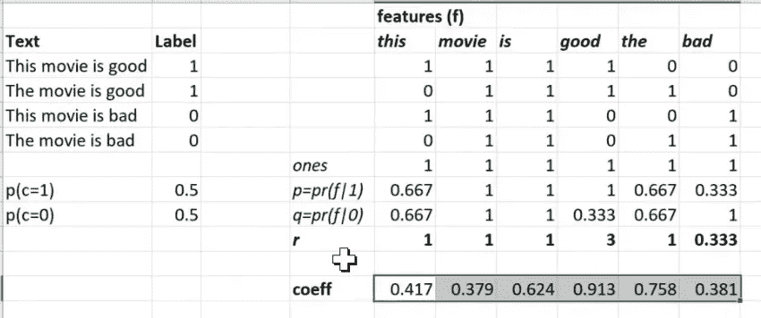
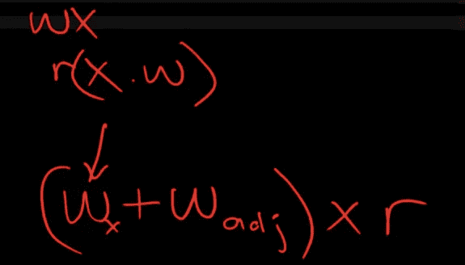

# 机器学习 1：第 11 课

> 原文：[`medium.com/@hiromi_suenaga/machine-learning-1-lesson-11-7564c3c18bbb`](https://medium.com/@hiromi_suenaga/machine-learning-1-lesson-11-7564c3c18bbb)
>
> 译者：[飞龙](https://github.com/wizardforcel)
> 
> 协议：[CC BY-NC-SA 4.0](http://creativecommons.org/licenses/by-nc-sa/4.0/)

> 来自[*机器学习课程*](http://forums.fast.ai/t/another-treat-early-access-to-intro-to-machine-learning-videos/6826/1)的个人笔记。随着我继续复习课程以“真正”理解它，这些笔记将继续更新和改进。非常感谢 [*Jeremy*](https://twitter.com/jeremyphoward) 和 [*Rachel*](https://twitter.com/math_rachel) 给了我这个学习的机会。

## 使用 SGD 优化多层函数的回顾[[0:00](https://youtu.be/XJ_waZlJU8g)]

这个想法是我们有一些数据（*x*），然后我们对这些数据做一些操作，例如，我们用一个权重矩阵乘以它（*f(x)*）。然后我们对这个结果做一些操作，例如，我们通过 softmax 或 sigmoid 函数处理它（*g(f(x))*）。然后我们对这个结果做一些操作，比如计算交叉熵损失或均方根误差损失（*h(g(f(x)))*）。这将给我们一些标量。这里没有隐藏层。这有一个线性层，一个非线性激活函数是 softmax，一个损失函数是均方根误差或交叉熵。然后我们有我们的输入数据。

例如[[1:16](https://youtu.be/XJ_waZlJU8g?t=76)]，如果非线性激活函数是 sigmoid 或 softmax，损失函数是交叉熵，那就是逻辑回归。那么我们如何计算对权重的导数？


为了做到这一点，基本上我们使用链式法则：


因此，为了对权重求导，我们只需使用那个确切的公式计算对 w 的导数[[3:29](https://youtu.be/XJ_waZlJU8g?t=209)]。然后如果我们在这里进一步，有另一个带有权重 w2 的线性层，现在计算对所有参数的导数没有区别。我们仍然可以使用完全相同的链式法则。


所以不要把多层网络想象成在不同时间发生的事情。它只是函数的组合。所以我们只需使用链式法则一次计算所有导数。它们只是在函数的不同部分出现的一组参数，但微积分并没有不同。所以计算对 w1 和 w2 的导数，你现在可以称之为 w，说 w1 就是所有这些权重。

那么你将会得到一个参数列表[[5:26](https://youtu.be/XJ_waZlJU8g?t=326)]。这里是 w1，可能是某种高阶张量。如果是卷积层，它将是一个三阶张量，但我们可以展开它。我们将把它变成一个参数列表。这里是 w2。这只是另一个参数列表。这是我们的损失，是一个单一的数字。因此，我们的导数就是同样长度的向量。改变 w 的值会对损失产生多大影响？你可以把它想象成一个函数，比如*y = ax1 + bx2 + c*，然后问对 a、b 和 c 的导数是多少？你会得到三个数字：对 a、b 和 c 的导数。就是这样。如果对那个权重求导，那个权重，...


为了到达这一点，在链式法则中，我们必须计算像雅可比这样的导数，当你进行矩阵乘法时，你现在得到的是一个权重矩阵和输入向量，这些是来自前一层的激活，还有一些新的输出激活。所以现在你必须说对于这个特定的权重，改变这个特定的权重如何改变这个特定的输出？改变这个特定的权重如何改变这个特定的输出？等等。所以你最终会得到这些更高维度的张量，显示每个权重如何影响每个输出。然后当你到达损失函数时，损失函数将有一个均值或和，所以它们最终会被加起来。


尝试手动计算或逐步考虑这一点让我有点疯狂，因为你倾向于像…你只需要记住，对于每个权重对于每个输出，你都必须有一个单独的梯度。

一个很好的方法是学习使用 PyTorch 的`.grad`属性和`.backward`方法，并手动查阅 PyTorch 教程。这样你就可以开始设置一些具有向量输入和向量输出的计算，然后输入`.backward`，然后输入`grad`并查看它。然后对只有 2 或 3 个项目的输入和输出向量进行一些非常小的操作，比如加 2 或其他操作，看看形状是什么，确保它是有意义的。因为向量矩阵微积分在严格意义上并没有为你在高中学到的任何概念引入新的概念。但是对这些形状如何移动有了一定的感觉需要大量的练习。好消息是，你几乎永远不必担心这个。

## NLP 的朴素贝叶斯和逻辑回归回顾[[9:53](https://youtu.be/XJ_waZlJU8g?t=593)]

[笔记本](https://github.com/fastai/fastai/blob/master/courses/ml1/lesson5-nlp.ipynb) / [Excel](https://github.com/fastai/fastai/blob/master/courses/ml1/excel/naivebayes.xlsx)

我们正在讨论使用这种逻辑回归进行 NLP。在达到这一点之前，我们正在讨论使用朴素贝叶斯进行 NLP。基本思想是我们可以取一个文档（例如电影评论），并将其转换为一个词袋表示，其中包含每个单词出现的次数。我们称单词的唯一列表为词汇表。我们使用 sklearn 的 CountVectorizer 自动生成词汇表，他们称之为“特征”，并创建词袋表示，所有这些袋表示的整体称为术语文档矩阵。

我们有点意识到，我们可以通过简单地平均积极评论中单词“this”出现的次数来计算积极评论包含单词“this”的概率，我们可以对消极评论做同样的事情，然后我们可以取它们的比率，得到一个结果，如果大于一，则表示该单词在积极评论中出现得更频繁，如果小于一，则表示该单词在消极评论中出现得更频繁。

然后我们意识到，使用贝叶斯规则并取对数，我们基本上可以得到一个结果，我们可以将这些（下面突出显示的）的对数加起来，再加上类别 1 与类别 0 的概率比的对数，最终得到一个可以与零进行比较的结果[[11:32](https://youtu.be/XJ_waZlJU8g?t=692)]。如果结果大于零，我们可以预测文档是积极的，如果结果小于零，我们可以预测文档是消极的。这就是我们的贝叶斯规则。


我们从数学的第一原理开始做了这个，我认为我们都同意“朴素”在朴素贝叶斯中是一个很好的描述，因为它假设了独立性，而这显然是不正确的。但这是一个有趣的起点，当我们实际上到达这一点时，我们计算了概率的比率并取了对数，现在不是将它们相乘，当然，我们必须将它们相加。当我们实际写下这个时，我们意识到哦，这只是一个标准的权重矩阵乘积加上一个偏差：


然后我们意识到，如果这不是很好的准确率（80%），为什么不通过说，嘿，我们知道其他计算一堆系数和一堆偏差的方法，即在逻辑回归中学习它们来改进呢？换句话说，这是我们用于逻辑回归的公式，那么为什么我们不只是创建一个逻辑回归并拟合它呢？它会给我们同样的结果，但与基于独立性假设和贝叶斯规则的理论上正确的系数和偏差不同，它们将是实际上在这些数据中最好的系数和偏差。这就是我们的结论。

这里的关键见解是，几乎所有的机器学习最终都变成了一棵树或一堆矩阵乘积和非线性[[13:54](https://youtu.be/XJ_waZlJU8g?t=834)]。一切似乎最终都归结为相同的事情，包括贝叶斯规则。然后事实证明，无论该函数中的参数是什么，它们都比基于理论计算更好地学习。事实上，当我们实际尝试学习这些系数时，我们得到了 85%的准确率。

然后我们注意到，与其采用整个术语文档矩阵，我们可以只取单词存在或不存在的一和零。有时这样做同样有效，但后来我们实际尝试了另一种方法，即添加正则化。通过正则化，二值化方法结果略好一些。

然后正则化是我们取损失函数，再次，让我们从 RMSE 开始，然后我们将讨论交叉熵。损失函数是我们的预测减去我们的实际值，将其相加，取平均再加上一个惩罚。


具体来说，这是 L2 惩罚。如果这是 w 的绝对值，那就是 L1 惩罚。我们还注意到，我们实际上并不关心损失函数本身，我们只关心它的导数，这实际上是更新权重的东西，因此因为这是一个总和，我们可以分别对每个部分求导，所以惩罚的导数只是 2*aw*。因此，我们了解到，尽管这些在数学上是等价的，但它们有不同的名称。这个版本（2*aw*）被称为权重衰减，这个术语在神经网络文献中使用。

## 交叉熵[[16:34](https://youtu.be/XJ_waZlJU8g?t=994)]

[Excel](https://github.com/fastai/fastai/blob/master/courses/dl1/excel/entropy_example.xlsx)

另一方面，交叉熵只是另一个损失函数，就像均方根误差一样，但它专门设计用于分类。这是一个二元交叉熵的例子。假设这是我们的“是猫还是狗？”所以说`isCat`是 1 还是 0。而`Preds`是我们的预测，这是我们神经网络的最终层的输出，一个逻辑回归等等。


然后我们所做的就是说好吧，让我们取实际值乘以预测的对数，然后加上 1 减去实际值乘以 1 减去预测的对数，然后取整个东西的负值。


我建议你们尝试写出这个 if 语句版本，希望你们现在已经做到了，否则我将为你们揭示。所以这是：


我们如何将这写成一个 if 语句？

```py
if y == 1: 
    return -log(ŷ)
else: 
    return -log(1-ŷ)
```

所以关键的洞察是 y 有两种可能性：1 或 0。所以很多时候数学会隐藏关键的洞察，我认为这里发生了，直到你真正思考它可以取什么值。所以这就是它所说的。要么给我：`-log(ŷ)`，要么给我：`-log(1-ŷ)`

好的，那么多类别版本就是同样的事情，但你说的不仅仅是 `y == 1`，而是 `y == 0, 1, 2, 3, 4, 5 . . .` ，例如 [[19:26](https://youtu.be/XJ_waZlJU8g?t=1166)]。所以这个损失函数有一个特别简单的导数，另外一个你可以在家里尝试的东西是想一想在它之前加上一个 sigmoid 或 softmax 之后导数是什么样子。结果会是非常好的导数。

人们使用均方根误差用于回归和交叉熵用于分类的原因有很多，但大部分都可以追溯到最佳线性无偏估计的统计概念，基于可能性函数的结果表明这些函数具有一些良好的统计性质。然而，实际上，尤其是均方根误差的性质可能更多是理论上的而不是实际的，实际上，现在使用绝对偏差而不是平方偏差的和通常效果更好。所以在实践中，机器学习中的一切，我通常都会尝试两种。对于特定的数据集，我会尝试两种损失函数，看哪一个效果更好。当然，如果是 Kaggle 竞赛的话，那么你会被告知 Kaggle 将如何评判，你应该使用与 Kaggle 评估指标相同的损失函数。

所以这真的是关键的洞察 [[21:16](https://youtu.be/XJ_waZlJU8g?t=1276)]。让我们不要使用理论，而是从数据中学习。我们希望我们会得到更好的结果。特别是在正则化方面，我们确实得到了。然后我认为这里的关键正则化洞察是让我们不要试图减少模型中的参数数量，而是使用大量的参数，然后使用正则化来找出哪些实际上是有用的。

## 更多的 n-grams 特征 [[21:41](https://youtu.be/XJ_waZlJU8g?t=1301)]

[笔记本](https://github.com/fastai/fastai/blob/master/courses/ml1/lesson5-nlp.ipynb)

然后我们进一步说，鉴于我们可以通过正则化做到这一点，让我们通过添加二元组和三元组来创建更多。例如 `by vast`、`by vengeance` 这样的二元组，以及 `by vengeance .`、`by vera miles` 这样的三元组。为了让事情运行得更快一些，我们将其限制为 800,000 个特征，但即使使用完整的 70 百万个特征，它的效果也一样好，而且速度并没有慢多少。

```py
veczr =  CountVectorizer(
    ngram_range=(1,3), 
    tokenizer=tokenize, 
    max_features=800000
)
trn_term_doc = veczr.fit_transform(trn)
val_term_doc = veczr.transform(val)
trn_term_doc.shape
'''
(25000, 800000)
'''
vocab = veczr.get_feature_names()
vocab[200000:200005]
'''
['by vast', 'by vengeance', 'by vengeance .', 'by vera', 'by vera miles']
'''
```

所以我们使用了完整的 n-grams 集合为训练集和验证集创建了一个术语文档矩阵。现在我们可以继续说我们的标签是训练集标签如前所述，我们的自变量是二值化的术语文档矩阵如前所述：

```py
y=trn_y
x=trn_term_doc.sign()
val_x = val_term_doc.sign()
p = x[y==1].sum(0)+1
q = x[y==0].sum(0)+1
r = np.log((p/p.sum())/(q/q.sum()))
b = np.log(len(p)/len(q))
```

然后让我们对其进行逻辑回归拟合，并进行一些预测，我们得到了 90% 的准确率：

```py
m = LogisticRegression(C=0.1, dual=True)
m.fit(x, y);

preds = m.predict(val_x)
(preds.T==val_y).mean()
'''
0.90500000000000003
'''
```

所以看起来很不错。

## 回到朴素贝叶斯 [[22:54](https://youtu.be/XJ_waZlJU8g?t=1374)]

让我们回到我们的朴素贝叶斯。在我们的朴素贝叶斯中，我们有这个术语文档矩阵，然后对于每个特征，我们正在计算如果它是类别 1 出现的概率，如果它是类别 0 出现的概率，以及这两者的比率。


在我们实际基于的论文中，他们将 `p(f|1)` 称为 *p*，将 `p(f|0)` 称为 *q*，将比率称为 *r*。


然后我们说让我们不要把这些比率作为矩阵乘法中的系数。而是，尝试学习一些系数。也许开始用一些随机数，然后尝试使用随机梯度下降找到稍微更好的系数。



所以你会注意到这里一些重要的特征。*r*向量是一个秩为 1 的向量，其长度等于特征的数量。当然，我们的逻辑回归系数矩阵也是秩为 1 且长度等于特征数量的。我们说它们是计算相同类型的东西的两种方式：一种基于理论，一种基于数据。所以这里是*r*中的一些数字：

```py
r.shape, r
'''
((1, 800000),
matrix([[-0.05468, -0.161  , -0.24784, ...,  1.09861, -0.69315, -0.69315]]))
'''
```

记住它使用对数，所以这些小于零的数字代表更有可能是负数的东西，而大于零的数字可能是正数。所以这里是 e 的幂次方。所以这些是我们可以与 1 而不是 0 进行比较的数字：

```py
np.exp(r)
'''
matrix([[ 0.94678,  0.85129,  0.78049, ...,  3\.  ,  0.5 ,  0.5  ]])\
'''
```

我要做一些希望看起来很奇怪的事情。首先，我会说我们要做什么，然后我会尝试描述为什么这很奇怪，然后我们会讨论为什么它可能并不像我们最初想的那么奇怪。所以这就是我们要做的事情。我们将取我们的术语文档矩阵，然后将其乘以*r*。这意味着，我可以在 Excel 中做到这一点，我们将说让我们抓取我们的术语文档矩阵中的所有内容，并将其乘以向量*r*中的等值。所以这就像是一个广播的逐元素乘法，而不是矩阵乘法。


所以这是术语文档矩阵乘以*r*的值，换句话说，在术语文档矩阵中出现零的地方，在乘以版本中也出现零。而在术语文档矩阵中每次出现一个的地方，等效的*r*值出现在底部。所以我们并没有真正改变太多。我们只是将一个变成了其他东西，即来自该特征的*r*。所以我们现在要做的是，我们将使用这些独立变量，而不是在我们的逻辑回归中。

所以在这里。`x_nb`（x 朴素贝叶斯版本）是`x`乘以`r`。现在让我们使用这些独立变量进行逻辑回归拟合。然后对验证集进行预测，结果我们得到了一个更好的数字：

```py
x_nb = x.multiply(r)
m = LogisticRegression(dual=True, C=0.1)
m.fit(x_nb, y);

val_x_nb = val_x.multiply(r)
preds = m.predict(val_x_nb)
(preds.T==val_y).mean()
'''
0.91768000000000005
'''
```

让我解释为什么这可能会令人惊讶。这是我们的独立变量（下面突出显示），然后逻辑回归得出了一些系数集（假设这些是它恰好得出的系数）。


现在我们可以说，好吧，让我们不使用这组独立变量（`x_nb`），而是使用原始的二值化特征矩阵。然后将所有系数除以*r*中的值，数学上我们将得到完全相同的结果。

所以我们有了我们的独立变量的 x 朴素贝叶斯版本（`x_nb`），以及一组权重/系数（`w1`），它发现这是一个用于进行预测的好系数集。但是 x_nb 简单地等于`x`乘以（逐元素）`r`。


换句话说，这（`xnb·w1`）等于`x*r·w1`。所以我们可以只改变权重为`r·w1`，得到相同的数字。这应该意味着我们对独立变量所做的更改不应该有任何影响，因为我们可以在不进行这种改变的情况下计算出完全相同的结果。所以问题就在这里。为什么会有所不同呢？为了回答这个问题，你需要考虑哪些数学上不同的事情。为什么它们不完全相同？提出一些假设，也许我们实际上得到了更好的答案的一些原因。要弄清楚这一点，首先我们需要弄清楚为什么会有不同的答案？这是微妙的。

讨论

它们受到正则化的影响是不同的。我们的损失等于基于预测和实际值的交叉熵损失加上我们的惩罚：


所以如果你的权重很大，那么惩罚（`aw²`）就会变大，而且会淹没掉交叉熵部分（`x.e.(xw, y)`）。但那实际上是我们关心的部分。我们实际上希望它是一个很好的拟合。所以我们希望尽可能少地进行正则化。所以我们希望权重更小（我有点把“更少”和“更小”这两个词用得有点等同，这不太公平，我同意，但想法是接近零的权重实际上是不存在的）。

这就是问题所在。我们的*r*值，我不是一个贝叶斯怪胎，但我仍然要使用“先验”这个词。它们有点像一个先验 - 我们认为不同级别的重要性和这些不同特征的积极或消极可能是这样的。我们认为“坏”可能与负面更相关，而不是“好”。所以我们之前的隐含假设是我们没有先验，换句话说，当我们说平方权重（w²）时，我们是在说非零权重是我们不想要的。但实际上我想说的是，与朴素贝叶斯的期望不同是我不想做的事情。除非你有充分的理由相信其他情况，否则只有与朴素贝叶斯先验有所不同。

这实际上就是这样做的。我们最终说我们认为这个值可能是 3。所以如果你要把它变得更大或更小，那将会导致权重的变化，从而使平方项增加。所以如果可以的话，就让所有这些值保持与现在大致相似。这就是现在惩罚项正在做的事情。当我们的输入已经乘以*r*时，它在说惩罚那些与我们的朴素贝叶斯先验有所不同的事物。


问题：为什么只与 r 相乘，而不是像 r²这样，这次方差会高得多呢？因为我们的先验来自一个实际的理论模型。所以我说我不喜欢依赖理论，但如果我有一些理论，那么也许我们应该将其作为我们的起点，而不是假设一切都是相等的。所以我们的先验说，嘿，我们有这个叫做朴素贝叶斯的模型，朴素贝叶斯模型说，如果朴素贝叶斯的假设是正确的，那么*r*就是这个特定公式中的正确系数。这就是我们选择它的原因，因为我们的先验是基于那个理论的。

这是一个非常有趣的见解，我从未真正看到过。这个想法是我们可以使用这些传统的机器学习技术，通过将我们的理论期望纳入我们给模型的数据中，赋予它们这种贝叶斯感。当我们这样做时，这意味着我们就不必那么经常进行正则化了。这很好，因为我们经常进行正则化...让我们试试吧！

记住，在 sklearn 逻辑回归中，`C`是正则化惩罚的倒数。所以我们通过使其变小（`1e-5`）来增加大量的正则化。


这真的会影响我们的准确性，因为现在它非常努力地降低这些权重，损失函数被需要减少权重的需求所压倒。而现在使其具有预测性似乎完全不重要。所以通过开始并说不要推动权重降低，以至于最终忽略这些项，而是推动它们降低，以便尝试消除那些忽略了我们基于朴素贝叶斯公式期望的差异的权重。这最终给我们带来了一个非常好的结果

## 基线和二元组：简单、良好的情感和主题分类

[论文](https://www.aclweb.org/anthology/P12-2018)

这种技术最初是在 2012 年提出的。Chris Manning 是斯坦福大学出色的自然语言处理研究人员，而 Sida Wang 我不认识，但我认为他很棒，因为他的论文很棒。他们基本上提出了这个想法。他们所做的是将其与其他方法在其他数据集上进行比较。其中一件事是他们尝试了 IMDB 数据集。这里是大二元组上的朴素贝叶斯 SVM：


正如你所看到的，这种方法胜过了他们研究的其他基于线性的方法，以及他们研究的一些受限玻尔兹曼机的神经网络方法。如今，有更好的方法来做这个，事实上在深度学习课程中，我们展示了我们在 Fast AI 刚刚开发的最新成果，可以达到 94%以上的准确率。但是特别是对于一种简单、快速、直观的线性技术来说，这还是相当不错的。你会注意到，当他们这样做时，他们只使用了二元组。我猜这是因为我看了他们的代码，发现它相当慢且难看。我找到了一种更优化的方法，正如你所看到的，所以我们能够使用三元组，因此我们得到了更好的结果，我们的准确率是 91.8%，而不是 91.2%，但除此之外，它是相同的。哦，他们还使用了支持向量机，在这种情况下几乎与逻辑回归相同，所以有一些细微的差异。所以我认为这是一个相当酷的结果。

我要提一下，在课堂上你看到的是我经过多周甚至多个月的研究得出的结果。所以我不希望你认为这些东西是显而易见的。完全不是。就像阅读这篇论文，论文中没有描述为什么他们使用这个模型，它与其他模型有何不同，为什么他们认为它有效。我花了一两周的时间才意识到它在数学上等同于普通的逻辑回归，然后又花了几周的时间才意识到区别实际上在于正则化。这有点像机器学习，我相信你从你参加的 Kaggle 竞赛中已经注意到了。就像你提出了一千个好主意，其中 999 个无论你有多么自信它们会很棒，最终都会变成垃圾。然后最终在四周后，其中一个终于奏效，给了你继续度过另外四周的痛苦和挫折的热情。这是正常的。而且我可以确定，我所认识的机器学习领域最优秀的从业者都有一个共同的特点，那就是他们非常顽强，也被称为固执和执着，这绝对是我似乎拥有的声誉，可能是公平的，还有另一点，他们都是非常擅长编码的。他们非常擅长将他们的想法转化为新的代码。对我来说，几个月前通过这个工作是一个非常有趣的经历，试图至少弄清楚为什么这个当时的最新成果存在。

## 更好的版本：NBSVM++ [43:31]

所以一旦我弄清楚了，我实际上能够在此基础上进行改进，并且我会向你展示我做了什么。这就是我非常幸运能够使用 PyTorch 的原因，因为我能够创建出我想要的定制化内容，并且通过使用 GPU 也非常快速。这就是 Fast AI 版本的 NBSVM。实际上，我的朋友 Stephen Merity 是一位在自然语言处理领域出色的研究人员，他将其命名为 NBSVM++，我觉得这很可爱，所以这就是，尽管没有 SVM，但是它是一个逻辑回归，但正如我所说，几乎完全相同。

所以首先让我向你展示代码。一旦我弄清楚这是我能想到的最好的线性词袋模型的方法，我将其嵌入到 Fast AI 中，这样你只需写几行代码就可以了。

```py
sl=2000
# Here is how we get a model from a bag of words
md = TextClassifierData.from_bow(
    trn_term_doc, 
    trn_y, 
    val_term_doc,
    val_y, sl
)
```

所以代码基本上是，嘿，我想为文本分类创建一个数据类，我想从词袋（`from_bow`）中创建它。这是我的词袋（`trn_term_doc`），这是我们的标签（`trn_y`），这是验证集的相同内容，并且每个评论最多使用 2000 个独特的单词，这已经足够了。

然后从那个模型数据中，构建一个学习器，这是 Fast AI 对基于朴素贝叶斯点积的模型的泛化，然后拟合该模型。

```py
learner = md.dotprod_nb_learner()
learner.fit(0.02, 1, wds=1e-6, cycle_len=1)
'''
[ 0\.       0.0251   0.12003  0.91552]
'''
learner.fit(0.02, 2, wds=1e-6, cycle_len=1)
'''
[ 0\.       0.02014  0.11387  0.92012]                         
[ 1\.       0.01275  0.11149  0.92124]
'''
learner.fit(0.02, 2, wds=1e-6, cycle_len=1)
'''
[ 0\.       0.01681  0.11089  0.92129]                           
[ 1\.       0.00949  0.10951  0.92223]
'''
```

经过 5 个时代，我的准确率已经达到了 92.2。所以现在已经远远超过了线性基准（在原始论文中）。所以让我给你展示一下那段代码。


所以代码非常简短。就是这样。这看起来也非常熟悉。这里有一些小调整，假装这个写着`Embedding`的东西实际上写着`Linear`。我马上会展示给你看 embedding。所以我们基本上有一个线性层，特征的数量作为行，记住，sklearn 特征意味着基本上是单词的数量。然后对于每个单词，我们将创建一个权重，这是有道理的——逻辑回归，每个单词有一个权重。然后我们将它乘以*r*值，所以每个单词，我们有一个*r*值每个类。所以我实际上做了这个，这样可以处理不仅仅是正面和负面，还可以找出是哪个作者创作了这个作品——例如可能有五六个作者。

基本上我们使用这些线性层来得到权重和*r*的值，然后我们取权重乘以*r*，然后相加。所以这只是一个简单的点积，就像我们为任何逻辑回归所做的那样，然后进行 softmax。我们为了获得更好的结果所做的非常小的调整是这个`+self.w_adj`：


我添加的东西是，这是一个参数，但我几乎总是使用这个默认值 0.4。那么这是做什么的呢？这再次改变了先验。如果你考虑一下，即使我们将这个*r*乘以文档矩阵作为它们的自变量，你真的想从一个问题开始，好的，惩罚项仍然在将`w`推向零。


那么`w`为零意味着什么？如果我们的系数都是 0 会怎么样？


当我们将这个矩阵与这些系数相乘时，我们仍然得到零。所以权重为零最终会说“我对这个事情是正面还是负面没有意见。”另一方面，如果它们都是 1，那么基本上就是说我的意见是朴素贝叶斯系数是完全正确的。所以我说零几乎肯定不是正确的先验。我们不应该真的说如果没有系数，那就意味着忽略朴素贝叶斯系数。1 可能太高了，因为我们实际上认为朴素贝叶斯只是答案的一部分。所以我尝试了几个不同的数据集，基本上是说取这些权重并加上一些常数。所以零在这种情况下会变成 0.4。换句话说，正则化惩罚将权重推向这个值而不是零。我发现在许多数据集中，0.4 效果非常好且非常稳健。再次，基本思想是在使用简单模型从数据中学习的同时，尽可能地融入我们的先验知识。所以结果是，当你说让权重矩阵的零实际上意味着你应该使用大约一半的*r*值时，这比权重应该全部为零的先验效果更好。

问题：`w`是表示所需正则化量的点吗？`w`是权重。所以`x = ((w+self.w_adj)*r/self.r_adj).sum(1)`正在计算我们的激活。我们计算我们的激活等于权重乘以*r*，然后求和。所以这只是我们的正常线性函数。被惩罚的是我的权重矩阵。这就是受到惩罚的地方。所以通过说，嘿，你知道，不要只使用`w` —— 使用`w+0.4`。0.4（即`self.w_adj`）不受惩罚。它不是权重矩阵的一部分。因此，权重矩阵实际上免费获得了 0.4。

问题：通过这样做，即使经过正则化，每个特征都会获得一些形式的最小权重吗？不一定，因为它最终可能会为一个特征选择一个系数为`-0.4`，这将表示“你知道，即使朴素贝叶斯说对于这个特征*r*应该是什么，我认为你应该完全忽略它”。

休息期间有几个问题。第一个是关于这里正在发生的事情的总结：


这里有`w`加上权重调整乘以*r*：


所以通常，我们所做的是说逻辑回归基本上是`wx`（我将忽略偏差）。然后我们将其更改为`rx·w`。然后我们说让我们先做`x·w`这部分。这里的这个东西，我实际上称之为 w，这可能很糟糕，实际上是`w`乘以`x`：



所以，我没有`r(x·w)`，我有`w·x`加上一个常数乘以*r*。所以这里的关键思想是正则化希望权重为零，因为它试图减少Σ*w*²。所以我们所说的是，好吧，我们希望将权重推向零，因为这是我们的默认起点期望。所以我们希望处于这样一种情况，即如果权重为零，那么我们有一个对我们来说在理论上或直观上有意义的模型。这个模型（`r(x·w)`），如果权重为零，对我们来说没有直观意义。因为它在说，嘿，将所有东西乘以零会消除一切。我们实际上在说“不，我们实际上认为我们的*r*是有用的，我们实际上想保留它。”所以，让我们取`(x·w)`并加上 0.4。所以现在，如果正则化器将权重推向零，那么它将将总和的值推向 0.4。


因此，它将整个模型推向 0.4 倍*r*。换句话说，如果您将所有权重一起正则化到 0.4 倍*r*，那么我们的默认起点是说“是的，您知道，让我们使用一点*r*。这可能是一个好主意。”这就是这个想法。这个想法基本上是当权重为零时会发生什么。您希望那是有意义的，否则正则化权重朝着那个方向移动就不是一个好主意。

第二个问题是关于 n-grams。所以 n-gram 中的 N 可以是 uni，bi，tri，等等。1，2，3，等等个 grams。所以“This movie is good”有四个 unigrams：`This`，`movie`，`is`，`good`。它有三个 bigrams：`This movie`，`movie is`，`is good`。它有两个 trigrams：`This movie is`，`movie is good`。

问题：您介意回到`w_adj`或`0.4`的内容吗？我在想这种调整会不会损害模型的可预测性，因为想象一下极端情况，如果不是 0.4，如果是 4,000，那么所有系数基本上会是...？确切地说。因此，我们的先验需要有意义。这就是为什么它被称为 DotProdNB，因此先验是我们认为朴素贝叶斯是一个好的先验的地方。因此，朴素贝叶斯认为*r = p/q*是一个好的先验，我们不仅认为这是一个好的先验，而且我们认为*rx+b*是一个好的模型。这就是朴素贝叶斯模型。换句话说，我们期望系数为 1 是一个好的系数，而不是 4,000。具体来说，我们认为零可能不是一个好的系数。但我们也认为也许朴素贝叶斯版本有点过于自信。所以也许 1 有点高。因此，我们相当确定，假设朴素贝叶斯模型是适当的，正确的数字在 0 和 1 之间。


**问题继续**：但我在想的是只要不是零，您就会将那些应该为零的系数推到非零的地方，并使高系数与零系数之间的差异变小。嗯，但是您看，它们本来就不应该是零。它们应该是*r*。请记住，这是在我们的前向函数中，所以这是我们正在计算梯度的一部分。所以基本上是说，好吧，您仍然可以将 self.w 设置为您喜欢的任何值。但是正则化器希望它为零。所以我们所说的是，好吧，如果您希望它为零，那么我将尝试使零给出一个合理的答案。

没有人说 0.4 对于每个数据集都是完美的。我尝试了一些不同的数据集，并发现在 0.3 和 0.6 之间有一些最佳值。但我从未发现一个比零更好的数据集，这并不奇怪。我也从未发现一个更好的数据集。因此，这个想法是一个合理的默认值，但这是另一个您可以玩耍的参数，我有点喜欢。这是另一件您可以使用网格搜索或其他方法来找出对您的数据集最佳的东西。实际上，关键在于在这个模型之前的每个模型，据我所知，都隐含地假设它应该为零，因为它们没有这个参数。顺便说一句，我实际上还有第二个参数（`r_adj=10`），它是我对 r 做的相同的事情，实际上是通过一个参数除以 r，我现在不会太担心，但这是另一个您可以用来调整正则化性质的参数。最终，我是一个实证主义者，而不是一个理论家。我认为这似乎是一个好主意。几乎所有我认为是一个好主意的事情最终都被证明是愚蠢的。这个特定的想法在这个数据集上给出了良好的结果，也在其他一些数据集上给出了良好的结果。

**问题：**我仍然对`w + w_adj`感到困惑。你提到我们执行`w + w_adj`是为了不让系数设为零，我们对先验赋予了一些重要性。但你也说过学习的效果可能是`w`被设为负值，这可能会使`w + w_adj`为零。所以如果我们允许学习过程确实将系数设为零，那为什么这与只有`w`不同呢？因为正则化。因为我们通过Σ*w*²对其进行惩罚。换句话说，我们在说，你知道，如果忽略*r*是最好的选择，那将会花费你（Σ*w*²）。你将不得不将`w`设为负数。所以只有在这显然是一个好主意的情况下才这样做。除非这显然是一个好主意，否则你应该将其保留在原处。这是唯一的原因。今天我们所做的所有事情基本上都是为了最大化我们从正则化中获得的优势，并且说正则化将我们推向某种默认假设，几乎所有的机器学习文献都假设默认假设是所有事物都是零。我在说的是，从理论上讲这是有道理的，而从经验上讲，事实证明你应该决定你的默认假设是什么，这将给你带来更好的结果。

**问题继续：**那么可以这样说，在某种程度上你是在前往将所有系数设为零的过程中设置了一个额外的障碍，如果确实值得的话，它将能够做到这一点吗？是的，确实如此。所以我会说，没有这个默认障碍，使系数非零是障碍。现在我要说的是，不，障碍是使系数不等于 0.4*r*。

**问题：**所以这是 w²乘以某个常数的总和。如果常数是，比如说 0.1，那么权重可能不会趋向于零。那么我们可能就不需要权重衰减了？如果常数的值为零，那么就没有正则化。但如果这个值大于零，那么就会有一些惩罚。而且可以推测，我们将其设置为非零是因为我们过拟合了。所以我们想要一些惩罚。所以如果有一些惩罚，那么我的观点是我们应该惩罚那些与我们的先验不同的事物，而不是惩罚那些与零不同的事物。我们的先验是事物应该大致等于*r*。

# 嵌入[[1:05:17](https://youtu.be/XJ_waZlJU8g?t=3917)]

我想谈谈嵌入。我说假装它是线性的，实际上我们可以假装它是线性的。让我向你展示我们可以多么地假装它是线性的，就像`nn.Linear`，创建一个线性层。

这是我们的数据矩阵，这是我们的系数*r*如果我们正在进行*r*版本。所以如果我们将*r*放入列向量中，那么我们可以通过系数对数据矩阵进行矩阵乘法。


因此，这个自变量矩阵乘以这个系数矩阵的矩阵乘法将给我们一个答案。所以问题是，好吧，为什么 Jeremy 没有写`nn.Linear`？为什么 Jeremy 写了`nn.Embedding`？原因是，如果你回忆一下，我们实际上并不是这样存储的。因为这实际上是宽度为 800,000，高度为 25,000。所以我们实际上是这样存储的：


我们的存储方式是，这个词袋包含哪些单词索引。这是一种稀疏的存储方式。它只列出每个句子中的索引。鉴于此，我现在想要执行我刚刚向你展示的那种矩阵乘法，以创建相同的结果。但我想要从稀疏表示中执行。这基本上是一种独热编码：


这有点像一个虚拟矩阵版本。它有一个单词“this”吗？它有一个单词“movie”吗？等等。所以如果我们采用简单版本的有没有单词“this”（即 1, 0, 0, 0, 0, 0），然后我们将其乘以*r*，那么它只会返回第一个项目：


总的来说，一个独热编码向量乘以一个矩阵等同于查找该矩阵中的第 n 行。 所以这只是说找到第 0、第一个、第二个和第五个系数：


它们完全相同。 在这种情况下，每个特征只有一个系数，但实际上我这样做的方式是为每个类别的每个特征都有一个系数。 所以在这种情况下，类别是正面和负面。 所以我实际上有 *r* 正面 (*p/q*)，*r* 负面 (*q/r*)：


在二进制情况下，显然同时拥有两者是多余的。 但是如果是像这个文本的作者是谁？ 是 Jeremy，Savannah 还是 Terrence？ 现在我们有三个类别，我们想要三个 `r` 的值。 所以做这个稀疏版本的好处是，你可以查找第 0、第一个、第二个和第五个。


再次强调，从数学上讲，这与乘以一个独热编码矩阵是相同的。 但是，当输入稀疏时，效率显然要高得多。 因此，这个计算技巧在数学上与乘以一个独热编码矩阵是相同的，而不是概念上类似于。 这被称为嵌入。 我相信大多数人可能已经听说过嵌入，比如词嵌入：Word2Vec，GloVe 等。 人们喜欢把它们说成是这种令人惊叹的新复杂神经网络东西。 但事实并非如此。 嵌入意味着通过简单的数组查找来加快乘以一个独热编码矩阵的过程。 这就是为什么我说你可以把这个想象成说 `self.w = nn.Linear(nf+1, 1)`：


因为它实际上做的是相同的事情。 它实际上是一个具有这些维度的矩阵。 这是一个线性层，但它期望我们要给它的输入实际上不是一个独热编码矩阵，而是一个整数列表 —— 每个项目的每个单词的索引。 所以你可以看到 Fast AI 中的 `forward` 函数自动获取（对于 DotProdNB leaner）特征索引（`feature_idx`）：


所以它们自动来自稀疏矩阵。 Numpy 使得很容易只需抓取这些索引。 换句话说，我们在这里（`feat_idx`）有一个包含这个文档中的 800,000 个单词索引的列表。 所以这里（`self.w(feat_idx)`）说的是查找我们的嵌入矩阵中的每一个，该矩阵有 800,000 行，并返回你找到的每一个东西。 从数学上讲，这与乘以一个独热编码矩阵是相同的。 这就是所有嵌入的含义。 这意味着我们现在可以处理构建任何类型的模型，比如任何类型的神经网络，其中我们的输入可能是非常高基数的分类变量。 然后我们只需将它们转换为介于零和级别数之间的数字代码，然后我们可以学习一个线性层，就好像我们已经对其进行了独热编码，而实际上并没有构建独热编码版本，也没有进行矩阵乘法。 相反，我们将只存储索引版本并简单地进行数组查找。 因此，回流的梯度基本上是在独热编码版本中，所有为零的东西都没有梯度，因此回流的梯度只会更新我们使用的嵌入矩阵的特定行。 这对于自然语言处理非常重要，就像在这里一样，我想创建一个 PyTorch 模型，该模型将实现这个非常简单的方程。


如果没有这个技巧，那意味着我要输入一个 25,000 x 80,000 元素的数组，这将有点疯狂。 所以这个技巧让我写下了这个。 我只是用 Embedding 替换了 Linear，用一些只输入索引而不是输入独热编码的东西来替换那个，就这样。 然后它继续工作，所以现在每个时代的训练时间大约是一分钟。

现在我们可以把这个想法应用到不仅仅是语言，而是任何东西上。 例如，预测杂货店商品的销售情况。

问题：我们实际上并没有查找任何东西，对吧？我们只是看到了那个带有索引的数组表示？所以我们正在查找。现在存储的词袋的表示不再是 1 1 1 0 0 1，而是 0 1 2 5。因此，我们实际上必须进行矩阵乘法。但是我们不是进行矩阵乘法，而是查找第零个东西，第一个东西，第二个东西和第五个东西。

问题继续：这意味着我们仍然保留了独热编码矩阵吗？不，我们没有。这里没有使用独热编码矩阵。目前没有突出显示独热编码矩阵。我们目前突出显示的是索引列表和权重矩阵中的系数列表：


所以现在我们要做的是更进一步，我们要说根本不使用线性模型，让我们使用一个多层神经网络。让我们的输入可能包括一些分类变量。这些分类变量，我们将只将其作为数值索引。因此，这些的第一层不会是一个普通的线性层，它们将是一个嵌入层，我们知道在数学上它的行为与线性层完全相同。因此，我们的希望是现在我们可以使用这个来为任何类型的数据创建一个神经网络。

# 罗斯曼竞赛

[笔记本](https://github.com/fastai/fastai/blob/master/courses/dl1/lesson3-rossman.ipynb)

几年前在 Kaggle 上有一个名为 Rossmann 的竞赛，这是一个德国的杂货连锁店，他们要求预测他们商店中商品的销售情况。这包括分类和连续变量的混合。在 Guo/Berkhahn 的[这篇论文](https://arxiv.org/abs/1604.06737)中，他们描述了他们的第三名作品，这比第一名作品简单得多，但几乎一样好，但简单得多，因为他们利用了这个所谓的实体嵌入的想法。在论文中，他们认为他们发明了这个，实际上早些时候由 Yoshua Bengio 和他的合著者在另一个 Kaggle 竞赛中写过。尽管如此，我觉得 Guo 在描述这个如何在许多其他方面使用上走得更远，所以我们也会谈论这个。

笔记本在深度学习存储库中，因为我们在深度学习课程中讨论了一些深度学习特定方面，在这门课程中，我们主要将讨论特征工程，我们还将讨论这个嵌入的想法。


让我们从数据开始。所以数据是，2015 年 7 月 31 日，第 1 号店开业。他们正在进行促销活动。有学校假期。不是国家假期，他们卖出了 5263 件商品。这是他们提供的关键数据。所以目标显然是在没有销售信息的测试集中预测销售额。他们还告诉你，对于每家商店，它是某种特定类型的，销售某种特定种类的商品，其最近的竞争对手距离一定距离，竞争对手在 2008 年 9 月开业，还有一些关于促销的更多信息，我不知道这意味着什么。就像许多 Kaggle 竞赛一样，他们允许您下载外部数据集，只要您与其他竞争者分享。他们还告诉您每家商店所在的州，因此人们下载了德国不同州的名称，他们为德国每周下载了一些谷歌趋势数据。我不知道他们得到了什么具体的谷歌趋势，但是有的。对于每个日期，他们下载了一堆温度信息。就是这样。

这里一个有趣的见解是，Rossmann 可能在某种程度上犯了一个错误，设计这个比赛是一个可以使用外部数据的比赛。因为实际上，你并不能知道下周的天气或下周的谷歌趋势。但当你参加 Kaggle 比赛时，你并不在乎这些。你只是想赢，所以你会利用一切可以得到的。

## 数据清理

首先让我们谈谈数据清理。在这个获得第三名的参赛作品中，实际上并没有进行太多的特征工程，特别是按照 Kaggle 的标准，通常每一个细节都很重要。这是一个很好的例子，展示了使用神经网络可以取得多大的成就，这让我想起了昨天我们谈到的索赔预测比赛，获胜者没有进行任何特征工程，完全依赖深度学习。房间里的笑声，我猜，是来自那些在比赛中进行了一点点特征工程的人们😄

顺便提一下，我发现在比赛中努力工作，然后比赛结束了你没有赢得比赛。然后获胜者出来说这就是我赢得比赛的方法。这是你学到最多的时候。有时候这种情况发生在我身上，我会想，哦，我想到了那个，我试过了，然后我回去发现我那里有个 bug，我没有正确测试，然后我意识到，哦，好吧，我真的需要学会以不同的方式测试这个东西。有时候就像，哦，我想到了那个，但我假设它不会起作用，我真的要记住在做任何假设之前检查一切。你知道，有时候就像，哦，我没有想到那个技术，哇，现在我知道它比我刚刚尝试的一切都要好。否则，如果有人说，嘿，你知道这是一个非常好的技术，你会说好的。但是当你花了几个月的时间尝试做某事，然后别人用那个技术做得更好时，那就相当有说服力了。所以这有点困难，我站在你面前说这里有一堆我用过的技术，我赢得了一些 Kaggle 比赛，我得到了一些最先进的结果。但是当这些信息传达给你时，已经是二手信息了。所以尝试一些东西真的很棒。而且尤其是在深度学习课程中，我注意到，我的一些学生尝试了我说的这个技术，他们第二天就进入了 Kaggle 比赛的前十名，他们说，好的，这算是非常有效。Kaggle 比赛有很多原因是有帮助的。但其中一个最好的方式是比赛结束后发生的事情，所以对于现在即将结束的比赛，确保你观看论坛，看看人们在分享解决方案方面分享了什么，如果你想了解更多，可以自由地问问获胜者，嘿，你能告诉我更多关于这个或那个吗。人们通常很乐意解释。然后最好是尝试自己复制一下。这可以变成一个很棒的博客文章或很棒的内核，可以说，某某说他们使用了这个技术，这里是这个技术的一个非常简短的解释，这里是一点代码展示它是如何实现的，这里是结果展示你可以得到相同的结果。这也可以是一个非常有趣的写作。

数据尽可能易于理解总是很好的。因此，在这种情况下，来自 Kaggle 的数据使用各种整数表示假期。我们可以只使用一个布尔值来表示是否是假期。所以只需清理一下：

```py
train.StateHoliday = train.StateHoliday!='0'
test.StateHoliday = test.StateHoliday!='0'
```

我们有很多不同的表需要将它们全部合并在一起。我有一种用 Pandas 合并事物的标准方法。我只是使用了 Pandas 的合并函数，具体来说我总是进行左连接。左连接是保留左表中的所有行，你有一个关键列，将其与右侧表中的关键列匹配，然后合并那些也存在于右表中的行。

```py
def join_df(left, right, left_on, right_on=None, suffix='_y'):
    if right_on is None: 
        right_on = left_on
    return left.merge(
        right, 
        how='left', 
        left_on=left_on,
        right_on=right_on, 
        suffixes=("", suffix)
    )
```

我总是进行左连接的关键原因是，在进行连接之后，我总是检查右侧是否有现在为空的内容：

```py
store = join_df(store, store_states, "Store")
len(store[store.State.isnull()])
```

因为如果是这样，那就意味着我漏掉了一些东西。我没有在这里展示，但我也检查了行数在之前和之后是否有变化。如果有变化，那就意味着右侧表不是唯一的。所以即使我确定某件事是真的，我也总是假设我搞砸了。所以我总是检查。

我可以继续将州名合并到天气中：

```py
weather = join_df(weather, state_names, "file", "StateName")
```

如果你看一下谷歌趋势表，它有这个周范围，我需要将其转换为日期以便加入它：


在 Pandas 中这样做的好处是，Pandas 让我们可以访问所有的 Python。例如，在系列对象内部，有一个`.str`属性，可以让你访问所有的字符串处理函数。就像`.cat`让你访问分类函数一样，`.dt`让你访问日期时间函数。所以现在我可以拆分该列中的所有内容。

```py
googletrend['Date']=googletrend.week.str.split(' - ',expand=True)[0]
googletrend['State']=googletrend.file.str.split('_', expand=True)[2]
googletrend.loc[googletrend.State=='NI', "State"] = 'HB,NI'
```

使用这些 Pandas 函数非常重要，因为它们将被向量化，加速，通常通过 SIMD 至少通过 C 代码，以便运行得又快又顺利。

和往常一样，让我们为我们的日期添加日期元数据：

```py
add_datepart(weather, "Date", drop=False)
add_datepart(googletrend, "Date", drop=False)
add_datepart(train, "Date", drop=False)
add_datepart(test, "Date", drop=False)
```

最后，我们基本上是在对所有这些表进行去规范化。我们将把它们全部放入一个表中。因此，在谷歌趋势表中，它们主要是按州划分的趋势，但也有整个德国的趋势，所以我们将整个德国的趋势放入一个单独的数据框中，以便我们可以加入它：

```py
trend_de = googletrend[googletrend.file == 'Rossmann_DE']
```

因此，我们将有这个州的谷歌趋势和整个德国的谷歌趋势。

现在我们可以继续为训练集和测试集同时加入。然后检查两者都没有空值。

```py
store = join_df(store, store_states, "Store")
len(store[store.State.isnull()])
'''
0
'''
joined = join_df(train, store, "Store")
joined_test = join_df(test, store, "Store")
len(joined[joined.StoreType.isnull()]),len(joined_test[joined_test.StoreType.isnull()])
'''
(0, 0)
'''
joined = join_df(joined, googletrend, ["State","Year", "Week"])
joined_test = join_df(joined_test, googletrend, ["State","Year", "Week"])
len(joined[joined.trend.isnull()]),len(joined_test[joined_test.trend.isnull()])
'''
(0, 0)
'''
joined = joined.merge(trend_de, 'left', ["Year", "Week"], suffixes=('', '_DE'))
joined_test = joined_test.merge(trend_de, 'left', ["Year", "Week"], suffixes=('', '_DE'))
len(joined[joined.trend_DE.isnull()]),len(joined_test[joined_test.trend_DE.isnull()])
'''
(0, 0)
'''
joined = join_df(joined, weather, ["State","Date"])
joined_test = join_df(joined_test, weather, ["State","Date"])
len(joined[joined.Mean_TemperatureC.isnull()]),len(joined_test[joined_test.Mean_TemperatureC.isnull()])
'''
(0, 0)
'''
```

我的合并函数，如果有两列是相同的，我将左侧的后缀设置为空，这样它就不会影响名称，右侧设置为`_y`。


在这种情况下，我不想要任何重复的内容，所以我只是浏览并删除了它们：

```py
for df in (joined, joined_test):
    for c in df.columns:
        if c.endswith('_y'):
            if c in df.columns: 
                df.drop(c, inplace=True, axis=1)
for df in (joined,joined_test):
    df['CompetitionOpenSinceYear'] = \
        df.CompetitionOpenSinceYear.fillna(1900).astype(np.int32)
    df['CompetitionOpenSinceMonth'] = \
        df.CompetitionOpenSinceMonth.fillna(1).astype(np.int32)
    df['Promo2SinceYear'] = \
        df.Promo2SinceYear.fillna(1900).astype(np.int32)
    df['Promo2SinceWeek'] = \
        df.Promo2SinceWeek.fillna(1).astype(np.int32)
```

这家商店的主要竞争对手自某个日期以来一直开业。因此，我们可以使用 Pandas 的`to_datetime`，我传入年、月和日。所以这将给我们一个错误，除非它们都有年和月，所以我们将缺失的部分填充为 1900 年和 1 月（见上文）。而我们真正想知道的是这家商店在这个特定记录时已经开业多久了，所以我们可以进行日期相减：

```py
for df in (joined,joined_test):
    df["CompetitionOpenSince"] = \
        pd.to_datetime(dict(
            year=df.CompetitionOpenSinceYear,
            month=df.CompetitionOpenSinceMonth, 
            day=15
        ))
    df["CompetitionDaysOpen"] = \
          df.Date.subtract(df.CompetitionOpenSince).dt.days
```

现在如果你考虑一下，有时竞争对手的开业时间晚于这一行，所以有时会是负数。而且可能没有意义有负数（即将在 x 天后开业）。现在话虽如此，我绝不会在没有先运行包含它和不包含它的模型的情况下放入这样的东西。因为我们对数据的假设往往是不正确的。在这种情况下，我没有发明任何这些预处理步骤。我写了所有的代码，但它都是基于第三名获奖者的 GitHub 存储库。因此，知道在 Kaggle 竞赛中获得第三名需要做什么，我相当肯定他们会检查每一个这些预处理步骤，并确保它实际上提高了他们的验证集分数。

```py
for df in (joined,joined_test):
    df.loc[df.CompetitionDaysOpen<0, "CompetitionDaysOpen"] = 0
    df.loc[df.CompetitionOpenSinceYear<1990,"CompetitionDaysOpen"]=0
```

[[1:30:44](https://youtu.be/XJ_waZlJU8g?t=5444)]

因此，我们将创建一个神经网络，其中一些输入是连续的，而另一些是分类的。这意味着在我们的神经网络中，我们基本上会有这种初始权重矩阵。我们将有这个输入特征向量。一些输入将只是普通的连续数字（例如最高温度，到最近商店的公里数），而另一些将被有效地独热编码。但我们实际上不会将其存储为独热编码。我们实际上会将其存储为索引。


因此，神经网络模型需要知道这些列中的哪些应该基本上创建一个嵌入（即哪些应该被视为独热编码），哪些应该直接输入到线性层中。当我们到达那里时，我们将告诉模型哪个是哪个，但实际上我们需要提前考虑哪些我们想要视为分类变量，哪些是连续变量。特别是，我们要将其视为分类的东西，我们不希望创建比我们需要的更多的类别。让我告诉你我的意思。

这次比赛的第三名决定将比赛开放的月数作为一个他们要用作分类变量的东西。为了避免创建比需要的更多的类别，他们将其截断到 24 个月。他们说，超过 24 个月的任何东西，截断到 24 个。因此，这里是比赛开放的唯一值，从零到 24。这意味着将会有一个嵌入矩阵，基本上会有一个嵌入向量，用于尚未开放的事物（0），用于一个月开放的事物（1），依此类推。

```py
for df in (joined,joined_test):
    df["CompetitionMonthsOpen"] = df["CompetitionDaysOpen"]//30
    df.loc[df.CompetitionMonthsOpen>24,"CompetitionMonthsOpen"] = 24
joined.CompetitionMonthsOpen.unique()
'''
array([24,  3, 19,  9,  0, 16, 17,  7, 15, 22, 11, 13,  2, 23, 12,  4, 10,  1, 14, 20,  8, 18,  6, 21,  5]
'''
```

现在，他们绝对可以将其作为一个连续变量来处理[[1:33:14](https://youtu.be/XJ_waZlJU8g?t=5594)]。他们本可以只是在这里放一个数字，表示开放了多少个月，然后将其视为连续变量，直接输入到初始权重矩阵中。但我发现，显然这些竞争对手也发现了，尽可能地将事物视为分类变量是最好的。这样做的原因是，当你通过一个嵌入矩阵传递一些内容时，意味着每个级别可以被完全不同地处理。例如，在这种情况下，某物是否开放了零个月或一个月是非常不同的。因此，如果你将其作为连续变量输入，神经网络将很难找到具有这种巨大差异的功能形式。这是可能的，因为神经网络可以做任何事情。但如果你不让它变得容易。另一方面，如果你使用嵌入，将其视为分类变量，那么零和一将有完全不同的向量。因此，尤其是在你有足够的数据时，尽可能地将列视为分类变量是一个更好的主意。当我说尽可能时，基本上意味着基数不要太高。因此，如果这是每一行上唯一不同的销售 ID 号码，你不能将其视为分类变量。因为那将是一个巨大的嵌入矩阵，而且每样东西只出现一次，或者是距离最近商店的公里数到小数点后两位，你也不会将其作为分类变量。

这是他们在这次比赛中都使用的经验法则。事实上，如果我们滚动到他们的选择，这是他们的做法：


他们的连续变量是真正连续的东西，比如到竞争对手的公里数，温度等。而其他一切，基本上，他们都视为分类变量。

今天就到这里。下次，我们将结束这个话题。我们将看看如何将这个转化为神经网络，并总结一下。到时见！
