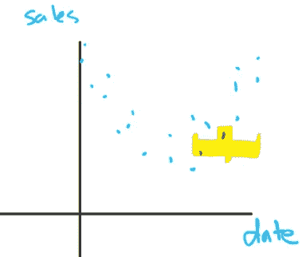
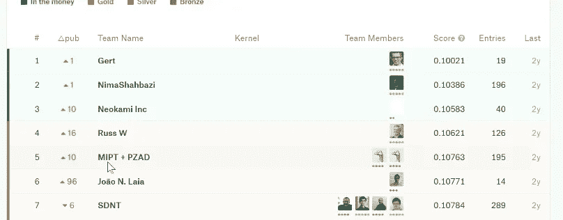

# 机器学习 1：第 12 课

> 原文：[`medium.com/@hiromi_suenaga/machine-learning-1-lesson-12-6c2512e005a3`](https://medium.com/@hiromi_suenaga/machine-learning-1-lesson-12-6c2512e005a3)

*我从* [*机器学习课程*](http://forums.fast.ai/t/another-treat-early-access-to-intro-to-machine-learning-videos/6826/1)*中的个人笔记。随着我继续复习课程以“真正”理解它，这些笔记将继续更新和改进。非常感谢* [*Jeremy*](https://twitter.com/jeremyphoward) *和* [*Rachel*](https://twitter.com/math_rachel) *给了我这个学习的机会。*

[视频](https://youtu.be/5_xFdhfUnvQ) / [笔记本](https://github.com/fastai/fastai/blob/master/courses/dl1/lesson3-rossman.ipynb)

我想今天我们可以完成在这个 Rossmann 笔记本中的工作，看一下时间序列预测和结构化数据分析。然后我们可能会对我们学到的一切进行一个小小的复习，因为信不信由你，这就是结尾。关于机器学习没有更多需要知道的东西，只有你将在下个学期和余生中学到的一切。但无论如何，我没有别的要教的了。所以我会做一个小小的复习，然后我们将涵盖课程中最重要的部分，那就是思考如何正确、有效地使用这种技术，以及如何让它对社会产生积极影响的方式。

上次，我们谈到了这样一个想法，当我们试图构建这个 CompetitionMonthsOpen 派生变量时，实际上我们将其截断为不超过 24 个月，我们谈到了原因，因为我们实际上希望将其用作分类变量，因为分类变量，由于嵌入，具有更多的灵活性，神经网络可以如何使用它们。所以这就是我们离开的地方。

```py
for df in (joined,joined_test):
    df["CompetitionMonthsOpen"] = df["CompetitionDaysOpen"]//30
    df.loc[df.CompetitionMonthsOpen>24, "CompetitionMonthsOpen"]= 24
joined.CompetitionMonthsOpen.unique()*array([24,  3, 19,  9,  0, 16, 17,  7, 15, 22, 11, 13,  2, 23, 12,  4, 10,  1, 14, 20,  8, 18,  6, 21,  5])*
```

让我们继续进行下去。因为这个笔记本中发生的事情可能适用于你处理的大多数时间序列数据集。正如我们所讨论的，虽然我们在这里使用了`df.apply`，但这是在每一行上运行一段 Python 代码，速度非常慢。所以只有在找不到可以一次对整列进行操作的矢量化 pandas 或 numpy 函数时才这样做。但在这种情况下，我找不到一种方法可以在不使用任意 Python 的情况下将年份和周数转换为日期。

还值得记住这个 lambda 函数的概念。每当你尝试将一个函数应用到某个东西的每一行或张量的每个元素时，如果没有已经存在的矢量化版本，你将不得不调用像`DataFrame.apply`这样的东西，它将运行你传递给每个元素的函数。所以这基本上是函数式编程中的映射，因为很多时候你想要传递给它的函数是你只会使用一次然后丢弃的东西。使用这种 lambda 方法非常常见。所以这个 lambda 是为了告诉`df.apply`要使用什么而创建的函数。

```py
for df in (joined,joined_test):
    df["Promo2Since"] = pd.to_datetime(df.apply(lambda x: Week(
        x.Promo2SinceYear, x.Promo2SinceWeek).monday(), 
            axis=1).astype(pd.datetime))
    df["Promo2Days"] = df.Date.subtract(df["Promo2Since"]).dt.days
```

我们也可以用不同的方式来写这个 [[3:16](https://youtu.be/5_xFdhfUnvQ?t=196)]。以下两个单元格是相同的：


一种方法是定义函数（`create_promo2since(x)`），然后通过名称传递它，另一种方法是使用 lambda 在现场定义函数。所以如果你不熟悉创建和使用 lambda，练习和玩弄`df.apply`是一个很好的练习方法。

## 持续时间 [[4:32](https://youtu.be/5_xFdhfUnvQ?t=272)]

让我们来谈谈这个持续时间部分，起初可能看起来有点具体，但实际上并不是。我们要做的是看三个字段：`“促销”`、`“州假期”`、`“学校假期”`

所以基本上我们有一个表格：

+   对于每个商店，对于每个日期，那个商店在那天有促销活动

+   那个地区的那家店铺在那天有学校假期吗

+   那个地区的那家店铺在那天有州假期吗

这些事情是事件。带有事件的时间序列非常常见。如果你正在查看石油和天然气钻探数据，你试图说的是通过这根管道的流量，这里是一个代表何时触发了某个警报的事件，或者这里是一个钻头卡住的事件，或者其他。所以像大多数时间序列一样，某种程度上会倾向于代表一些事件。事件发生在某个时间点本身就很有趣，但很多时候时间序列也会显示事件发生前后的情况。例如，在这种情况下，我们正在进行杂货销售预测。如果即将到来一个假期，销售额在假期前后很可能会更高，在假期期间会更低，如果这是一个城市店铺的话。因为你要在离开前备货带东西，然后回来时，你就得重新填满冰箱，例如。虽然我们不必进行这种特征工程来专门创建关于假期前后的特征，但是神经网络，我们能够给神经网络提供它需要的信息，它就不必学习这些信息。它学习的越少，我们就能够利用我们已有的数据做更多事情，利用我们已有的规模架构做更多事情。因此，即使对于神经网络这样的东西，特征工程仍然很重要，因为这意味着我们将能够利用我们拥有的有限数据取得更好的结果，利用我们拥有的有限计算能力取得更好的结果。

因此，这里的基本思想是，当我们的时间序列中有事件时，我们希望为每个事件创建两个新列[[7:20](https://youtu.be/5_xFdhfUnvQ?t=440)]：

1.  还有多久这个事件再次发生。

1.  上次那个事件发生已经多久了。

换句话说，距离下一个州假期还有多久，距离上一个州假期已经多久了。所以这不是我知道存在的库或任何其他东西。所以我手工写在这里。

```py
def get_elapsed(fld, pre):
    day1 = np.timedelta64(1, 'D')
    last_date = np.datetime64()
    last_store = 0
    res = []

    for s,v,d in zip(df.Store.values,df[fld].values, 
                     df.Date.values):
        if s != last_store:
            last_date = np.datetime64()
            last_store = s
        if v: last_date = d
        res.append(((d-last_date).astype('timedelta64[D]') / day1))
    df[pre+fld] = res
```

因此，重要的是，我需要按店铺来做这个。所以我想说，对于这家店铺，上次促销是什么时候（即自上次促销以来多长时间），下次促销还有多长时间，例如。

我要做的是这样的。我将创建一个小函数，它将接受一个字段名，然后我将依次传递`Promo`、`StateHoliday`和`SchoolHoliday`。让我们以学校假期为例。所以我们说字段等于学校假期，然后我们说`get_elapsed('SchoolHoliday', 'After')`。让我告诉你这将会做什么。我们首先按店铺和日期排序。现在当我们循环遍历时，我们将在店铺内循环遍历。所以店铺＃1，1 月 1 日，1 月 2 日，1 月 3 日，依此类推。

```py
fld = 'SchoolHoliday'
df = df.sort_values(['Store', 'Date'])
get_elapsed(fld, 'After')
df = df.sort_values(['Store', 'Date'], ascending=[True, False])
get_elapsed(fld, 'Before')
```

当我们循环遍历每家店铺时，我们基本上会说这一行是学校假期还是不是[[8:56](https://youtu.be/5_xFdhfUnvQ?t=536)]。如果是学校假期，那么我们将跟踪名为`last_date`的变量，表示我们看到学校假期的最后日期。然后我们将追加到我们的结果中自上次学校假期以来的天数。


## 使用`zip`的重要性[[9:26](https://youtu.be/5_xFdhfUnvQ?t=566)]

有一些有趣的特性。其中一个是使用[zip](https://docs.python.org/3/library/functions.html#zip)。我实际上可以通过编写`for row in df.iterrows():`然后从每行中获取我们想要的字段来更简单地编写这个。结果表明，这比我现在的版本慢 300 倍。基本上，遍历 DataFrame 并从行中提取特定字段具有很多开销。更快的方法是遍历 numpy 数组。因此，如果您取一个 Series（例如`df.Store`），然后在其后添加`.values`，那么就会获取该系列的 numpy 数组。


这里有三个 numpy 数组。一个是商店 ID，一个是`fld`是什么（在这种情况下，那是学校假期），还有日期。因此，现在我想要循环遍历每个列表的第一个、第二个和第三个。这是一个非常常见的模式。我基本上在我写的每个笔记本中都需要做类似的事情。而要做到这一点的方法就是使用 zip。因此，`zip`意味着逐个循环遍历这些列表。然后这里是我们可以从第一个列表、第二个列表和第三个列表中获取元素的地方：


因此，如果您还没有使用 zip 进行过多尝试，那么这是一个非常重要的函数需要练习。就像我说的，我几乎在我写的每个笔记本中都使用它——每次您都必须同时循环遍历一堆列表。

因此，我们将循环遍历每个商店、每个学校假期和每个日期。

**问题**：它是否循环遍历了所有可能的组合？不是。只有 111、222 等。

因此，在这种情况下，我们基本上想要说让我们获取第一个商店、第一个学校假期和第一个日期。因此，对于商店 1，1 月 1 日，学校假期是真还是假。因此，如果是学校假期，我会通过记录上次看到学校的日期来跟踪这一事实，并附加自上次学校假期以来的时间长度。如果商店 ID 与上一个商店 ID 不同，那么我现在已经到了一个全新的商店，这种情况下，我基本上必须重置一切。

**问题**：对于我们没有最后一个假期的第一个点会发生什么？是的，所以我只是将其设置为一些任意的起始点（`np.datetime64()`），最终会得到，我记不清了，要么是最大的日期，要么是最小的日期。您可能需要在之后用缺失值或零替换它。不过好处是，由于 ReLU 的存在，神经网络很容易截断极端值。因此，在这种情况下，我没有对其做任何特殊处理。我最终得到了这些像负十亿日期时间戳，但仍然可以正常工作。

接下来要注意的是，我需要对训练集和测试集进行一些处理。在前一节中，我实际上添加了一个循环，对训练 DataFrame 和测试 DataFrame 进行以下操作：


对于每个数据框中的每个单元格，我都进行了以下操作：


接下来，有一系列单元格我首先要为训练集和测试集运行。在这种情况下，我有两个不同的单元格：一个将 df 设置为训练集，一个将其设置为测试集。


我使用的方法是，我只运行第一个单元格（即跳过 `df=test[columns]`），然后运行下面的所有单元格，这样就可以对训练集进行全部操作。然后我回来运行第二个单元格，然后运行下面的所有单元格。因此，这个笔记本不是设计为从头到尾顺序运行的。但是它被设计为以这种特定方式运行。我提到这一点是因为这可能是一个有用的技巧。当然，你可以将下面的所有内容放在一个函数中，将数据框传递给它，并在测试集上调用一次，在训练集上调用一次。但我更喜欢有点实验，更交互地看着每一步。因此，这种方式是在不将其转换为函数的情况下在不同数据框上运行某些内容的简单方法。

如果我按店铺和日期排序，那么这就是在追踪上次发生某事的时间[[15:11](https://youtu.be/5_xFdhfUnvQ?t=911)]。因此 `d - last_date` 最终会告诉我距离上次学校假期有多少天：


现在如果我按日期降序排列并调用完全相同的函数，那么它会告诉我距离下一个假期还有多久：


所以这是一个很好的技巧，可以将任意事件时间添加到你的时间序列模型中。例如，如果你现在正在进行厄瓜多尔杂货比赛，也许这种方法对其中的各种事件也会有用。

为了国家假期，为了促销，我们来做一下：

```py
fld = 'StateHoliday'
df = df.sort_values(['Store', 'Date'])
get_elapsed(fld, 'After')
df = df.sort_values(['Store', 'Date'], ascending=[True, False])
get_elapsed(fld, 'Before')fld = 'Promo'
df = df.sort_values(['Store', 'Date'])
get_elapsed(fld, 'After')
df = df.sort_values(['Store', 'Date'], ascending=[True, False])
get_elapsed(fld, 'Before')
```

## 滚动函数[[16:11](https://youtu.be/5_xFdhfUnvQ?t=971)]

我们在这里看的下一件事是滚动函数。在 pandas 中，滚动是我们创建所谓的窗口函数的方式。假设我有这样的一些数据。我可以说好，让我们在这个点周围创建一个大约 7 天的窗口。



然后我可以取得那七天窗口内的平均销售额。然后我可以在这里做同样的事情，取得那七天窗口内的平均销售额。


所以如果对每个点都这样做，并连接起那些平均值，你最终会得到一个移动平均值：


移动平均值的更通用版本是窗口函数，即将某个函数应用于每个点周围的一些数据窗口。很多时候，我在这里展示的窗口实际上并不是你想要的。如果你试图构建一个预测模型，你不能将未来作为移动平均的一部分。因此，通常你实际上需要一个在某个点结束的窗口（而不是点位于窗口中间）。那就是我们的窗口函数：


Pandas 允许你使用这里的滚动来创建任意窗口函数：

```py
bwd = df[['Store']+columns].sort_index().groupby("Store"
                  ).rolling(7, min_periods=1).sum()fwd = df[['Store']+columns].sort_index(ascending=False
                  ).groupby("Store").rolling(7, min_periods=1).sum()
```

第一个参数表示我想将函数应用到多少个时间步。第二个参数表示如果我处于边缘，换句话说，如果我处于上图的左边缘，你应该将其设置为缺失值，因为我没有七天的平均值，或者要使用的最小时间段数是多少。所以这里，我设置为 1。然后你还可以选择设置窗口在周期的开始、结束或中间。然后在其中，你可以应用任何你喜欢的函数。所以这里，我有我的按店铺每周求和。所以有一个很简单的方法来得到移动平均值或其他内容。

我应该提到，如果你去 [Pandas 的时间序列页面](https://pandas.pydata.org/pandas-docs/stable/timeseries.html)，左侧有一个很长的索引列表。这是因为 Wes McKinney 创造了这个，他最初是在对冲基金交易中，我相信。他的工作都是关于时间序列的。所以我认为 Pandas 最初非常专注于时间序列，而且现在它可能仍然是 Pandas 最强大的部分。所以如果你在处理时间序列计算，你绝对应该尝试学习整个 API。关于时间戳、日期偏移、重采样等方面有很多概念性的内容需要理解。但这绝对值得，否则你将手动编写这些循环。这将比利用 Pandas 已经做的事情花费更多时间。当然，Pandas 将为你使用高度优化的向量化 C 代码，而你的版本将在 Python 中循环。所以如果你在处理时间序列的工作，学习完整的 Pandas 时间序列 API 是绝对值得的。它们几乎和其他任何时间序列 API 一样强大。

好的，经过所有这些，你可以看到这些起始值，我提到的 —— 稍微偏向极端。所以你可以看到，9 月 17 日，商店 1 距上次学校假期 13 天。16 日是 12，11，10，依此类推。


我们目前处于促销期。这里，这是促销前一天：


在它的左边，我们在上次促销之后有 9 天等等。这就是我们如何可以向我们的时间序列添加事件计数器的方式，当你在处理时间序列时，这通常是一个好主意。

## 分类与连续 [[21:46](https://youtu.be/5_xFdhfUnvQ?t=1306)]

现在我们已经做到了，我们的数据集中有很多列，所以我们将它们分成分类和连续列。我们将在回顾部分更多地讨论这一点，但这些将是我将为其创建嵌入的所有内容：


而 `contin_vars` 是我将直接输入模型的所有东西。例如，我们有 `CompetitionDistance`，这是到最近竞争对手的距离，最高温度，以及我们有一个分类值 `DayOfWeek`。所以这里，我们有最高温度，可能是 22.1，因为德国使用摄氏度，我们有到最近竞争对手的距离，可能是 321.7 公里。然后我们有星期几，也许星期六是 6。前两个数字将直接进入我们要输入神经网络的向量中。我们将在稍后看到，但实际上我们会对它们进行归一化，或多或少。但这个分类变量，我们不会。我们需要将它通过一个嵌入层。所以我们将有一个 7x4 的嵌入矩阵（例如，维度为 4 的嵌入）。这将查找第 6 行以获取四个项目。所以星期六将变成长度为 4 的向量，然后添加到这里。


这就是我们的连续和分类变量将如何工作。

然后我们将所有的分类变量转换为 Pandas 的分类变量，方式与之前相同：

```py
for v in cat_vars: 
    joined[v] = joined[v].astype('category').cat.as_ordered()
```

然后我们将应用相同的映射到测试集。如果在训练集中星期六是 6，`apply_cats` 确保在测试集中星期六也是 6：

```py
apply_cats(joined_test, joined)
```

对于连续变量，确保它们都是浮点数，因为 PyTorch 期望所有东西都是浮点数。

```py
for v in contin_vars:
    joined[v] = joined[v].fillna(0).astype('float32')
    joined_test[v] = joined_test[v].fillna(0).astype('float32')
```

然后这是我使用的另一个小技巧。

```py
idxs = get_cv_idxs(n, val_pct=150000/n)
joined_samp = joined.iloc[idxs].set_index("Date")
samp_size = len(joined_samp); samp_size150000
```

这两个单元格（上面和下面）都定义了一个叫做`joined_samp`的东西。其中一个将它们定义为整个训练集，另一个将它们定义为一个随机子集。所以我的想法是，我在样本上做所有的工作，确保一切都运行良好，尝试不同的超参数和架构。然后当我对此满意时，我会回过头来运行下面这行代码，说，好，现在让整个数据集成为样本，然后重新运行它。

```py
samp_size = n
joined_samp = joined.set_index("Date")
```

这是一个很好的方法，与我之前向您展示的类似，它让您可以在笔记本中使用相同的单元格首先在样本上运行，然后稍后回来并在完整数据集上运行。

## 数据标准化

现在我们有了`joined_samp`，我们可以像以前一样将其传递给 proc_df 来获取因变量以处理缺失值。在这种情况下，我们传递了一个额外的参数`do_scale=True`。这将减去均值并除以标准差。

```py
df, y, nas, mapper = proc_df(joined_samp, 'Sales', do_scale=True)
yl = np.log(y)
```

这是因为如果我们的第一层只是一个矩阵乘法。这是我们的权重集。我们的输入大约是 0.001 和另一个是 10⁶，例如，然后我们的权重矩阵已经初始化为 0 到 1 之间的随机数。然后基本上 10⁶的梯度将比 0.001 大 9 个数量级，这对优化不利。因此，通过将所有内容标准化为均值为零标准差为 1 开始，这意味着所有的梯度将在同一种规模上。


我们在随机森林中不需要这样做，因为在随机森林中，我们只关心排序。我们根本不关心值。但是对于线性模型和由线性模型层构建而成的东西，即神经网络，我们非常关心规模。因此，`do_scale=True`为我们归一化我们的数据。现在，由于它为我们归一化了数据，它会返回一个额外的对象`mapper`，其中包含了每个连续变量被归一化时的均值和标准差。原因是我们将不得不在测试集上使用相同的均值和标准差，因为我们需要我们的测试集和训练集以完全相同的方式进行缩放；否则它们将具有不同的含义。


因此，确保您的测试集和训练集具有相同的分类编码、相同的缺失值替换和相同的缩放归一化的细节非常重要，因为如果您没有做对，那么您的测试集根本不会起作用。但是如果您按照这些步骤操作，它将正常工作。我们还对因变量取对数，这是因为在这个 Kaggle 竞赛中，评估指标是均方根百分比误差。均方根百分比误差意味着我们根据我们的答案和正确答案之间的比率受到惩罚。我们在 PyTorch 中没有一个叫做均方根百分比误差的损失函数。我们可以编写一个，但更简单的方法是对因变量取对数，因为对数之间的差异与比率相同。因此，通过取对数，我们可以轻松地得到这个效果。

你会注意到 Kaggle 上绝大多数的回归竞赛要么使用均方根百分比误差，要么使用对数的均方根误差作为他们的评估指标。这是因为在现实世界的问题中，大多数时候，我们更关心比率而不是原始差异。因此，如果您正在设计自己的项目，很可能您会考虑使用因变量的对数。

然后我们创建一个验证集，正如我们之前学到的，大多数情况下，如果你的问题涉及时间因素，你的验证集可能应该是最近的时间段，而不是一个随机子集。所以这就是我在这里做的：

```py
val_idx = np.flatnonzero(
    (df.index<=datetime.datetime(2014,9,17)) & 
    (df.index>=datetime.datetime(2014,8,1)))
```

当我完成建模并找到一个架构、一组超参数、一定数量的 epochs 以及所有能够很好工作的东西时，如果我想让我的模型尽可能好，我会重新在整个数据集上进行训练 — 包括验证集。现在，至少目前为止，Fast AI 假设你有一个验证集，所以我的一种折中方法是将我的验证集设置为只有一个索引，即第一行：

```py
val_idx=[0]
```

这样所有的代码都能继续运行，但实际上没有真正的验证集。显然，如果你这样做，你需要确保你的最终训练与之前的完全相同，包括相同的超参数、相同数量的 epochs，因为现在你实际上没有一个正确的验证集来进行检查。

**问题**：我有一个关于之前讨论过的 get_elapsed 函数的问题。在 get_elapsed 函数中，我们试图找出下一个假期还有多少天。所以每年，假期基本上是固定的，比如 7 月 4 日、12 月 25 日都会有假期，几乎没有变化。那么我们不能从以前的年份查找，然后列出今年将要发生的所有假期吗？也许可以。我的意思是，在这种情况下，我猜对于`Promo`和一些假期会改变，比如复活节，这种方法可以适用于所有情况。而且运行起来也不会花太长时间。如果你的数据集太大，导致运行时间太长，你可以在一年内运行一次，然后以某种方式复制。但在这种情况下，没有必要。我总是把我的时间看得比电脑的时间更重要，所以我尽量保持事情尽可能简单。

## 创建一个模型

现在我们可以创建我们的模型。要创建我们的模型，我们必须像在 Fast AI 中一样创建一个模型数据对象。所以一个列模型数据对象只是一个代表训练集、验证集和可选测试集的标准列结构化数据的模型数据对象。

```py
md = ColumnarModelData.from_data_frame(PATH, val_idx, df, 
                    yl.astype(np.float32), cat_flds=cat_vars, 
                    bs=128, test_df=df_test)
```

我们只需要告诉它哪些变量应该被视为分类变量。然后传入我们的数据框。

对于我们的每个分类变量，这里是它所拥有的类别数量。因此，对于我们的每个嵌入矩阵，这告诉我们该嵌入矩阵中的行数。然后我们定义我们想要的嵌入维度。如果你在进行自然语言处理，那么需要捕捉一个词的含义和使用方式的所有细微差别的维度数量经验性地被发现大约是 600。事实证明，当你使用小于 600 的嵌入矩阵进行自然语言处理模型时，结果不如使用大小为 600 的好。超过 600 后，似乎没有太大的改进。我会说人类语言是我们建模的最复杂的事物之一，所以我不会指望你会遇到许多或任何需要超过 600 维度的嵌入矩阵的分类变量。另一方面，有些事物可能具有相当简单的因果关系。例如，`StateHoliday` ——也许如果某事是假日，那么在城市中的商店会有一些行为，在乡村中的商店会有一些其他行为，就是这样。也许这是一个相当简单的关系。因此，理想情况下，当你决定使用什么嵌入大小时，你应该利用你对领域的知识来决定关系有多复杂，因此我需要多大的嵌入。实际上，你几乎永远不会知道这一点。你只知道这一点，因为也许别人以前已经做过这方面的研究并找到了答案，就像在自然语言处理中一样。因此，在实践中，你可能需要使用一些经验法则，并尝试一些经验法则后，你可以尝试再高一点，再低一点，看看哪种方法有帮助。所以这有点像实验。

```py
cat_sz=[(c, len(joined_samp[c].cat.categories)+1) for c in cat_vars]cat_sz*[('Store', 1116),
 ('DayOfWeek', 8),
 ('Year', 4),
 ('Month', 13),
 ('Day', 32),
 ('StateHoliday', 3),
 ('CompetitionMonthsOpen', 26),
 ('Promo2Weeks', 27),
 ('StoreType', 5),
 ('Assortment', 4),
 ('PromoInterval', 4),
 ('CompetitionOpenSinceYear', 24),
 ('Promo2SinceYear', 9),
 ('State', 13),
 ('Week', 53),
 ('Events', 22),
 ('Promo_fw', 7),
 ('Promo_bw', 7),
 ('StateHoliday_fw', 4),
 ('StateHoliday_bw', 4),
 ('SchoolHoliday_fw', 9),
 ('SchoolHoliday_bw', 9)]*
```

这里是我的经验法则。我的经验法则是看看该类别有多少个离散值（即嵌入矩阵中的行数），并使嵌入的维度为该值的一半。所以如果是星期几，第二个，有八行和四列。这里是`(c+1)//2` ——列数除以二。但是我说不要超过 50。在这里你可以看到对于商店（第一行），有 116 家商店，只有一个维度为 50。为什么是 50？我不知道。到目前为止似乎效果还不错。你可能会发现你需要一些稍微不同的东西。实际上，对于厄瓜多尔杂货比赛，我还没有真正尝试过调整这个，但我认为我们可能需要一些更大的嵌入大小。但这是可以摆弄的东西。

```py
emb_szs = [(c, min(50, (c+1)//2)) for _,c in cat_sz]
emb_szs*[(1116, 50),
 (8, 4),
 (4, 2),
 (13, 7),
 (32, 16),
 (3, 2),
 (26, 13),
 (27, 14),
 (5, 3),
 (4, 2),
 (4, 2),
 (24, 12),
 (9, 5),
 (13, 7),
 (53, 27),
 (22, 11),
 (7, 4),
 (7, 4),
 (4, 2),
 (4, 2),
 (9, 5),
 (9, 5)]*
```

**问题**：随着基数大小变得越来越大，您正在创建越来越宽的嵌入矩阵。因此，您是否会因为选择了 70 个参数而极大地增加过拟合的风险，因为模型永远不可能捕捉到数据实际巨大的所有变化[[36:44](https://youtu.be/5_xFdhfUnvQ?t=2204)]？这是一个很好的问题，所以让我提醒您一下现代机器学习和旧机器学习之间的区别的黄金法则。在旧的机器学习中，我们通过减少参数数量来控制复杂性。在现代机器学习中，我们通过正则化来控制复杂性。所以简短的答案是不。我不担心过拟合，因为我避免过拟合的方式不是通过减少参数数量，而是通过增加丢弃率或增加权重衰减。现在说到这一点，对于特定的嵌入，没有必要使用比我需要的更多的参数。因为正则化是通过给模型更多的随机数据或实际上对权重进行惩罚来惩罚模型。所以我们宁愿不使用比必要更多的参数。但是在设计架构时，我的一般经验法则是在参数数量方面慷慨一些。在这种情况下，如果经过一些工作后，我们觉得商店实际上似乎并不那么重要。那么我可能会手动去修改它，使其更小。或者如果我真的发现这里的数据不够，我要么过拟合了，要么使用的正则化比我感到舒适的要多，那么您可能会回去。但我总是会从参数慷慨的角度开始。在这种情况下，这个模型表现得相当不错。

好的，现在我们有一个包含每个嵌入矩阵的行数和列数的元组列表[[38:41](https://youtu.be/5_xFdhfUnvQ?t=2321)]。所以当我们调用`get_learner`来创建我们的神经网络时，这是我们传入的第一件事：

+   `emb_szs`: 我们的每个嵌入有多大

+   `len(df.columns)-len(cat_vars)`: 我们有多少连续变量

+   `[1000,500]`: 每一层要创建多少个激活

+   `[0.001,0.01]`: 每一层使用的丢弃率是多少

```py
m = md.get_learner(emb_szs, len(df.columns)-len(cat_vars),
                   0.04, 1, [1000,500], [0.001,0.01], y_range=y_range)
m.summary()
```

然后我们可以继续调用`fit`。我们训练了一段时间，得到了大约 0.1 的分数。

```py
m.fit(lr, 1, metrics=[exp_rmspe])*[ 0\.       0.01456  0.01544  0.1148 ]*m.fit(lr, 3, metrics=[exp_rmspe])*[ 0\.       0.01418  0.02066  0.12765]                           
[ 1\.       0.01081  0.01276  0.11221]                           
[ 2\.       0.00976  0.01233  0.10987]*m.fit(lr, 3, metrics=[exp_rmspe], cycle_len=1)*[ 0\.       0.00801  0.01081  0.09899]                            
[ 1\.       0.00714  0.01083  0.09846]                            
[ 2\.       0.00707  0.01088  0.09878]*
```

所以我尝试在测试集上运行这个，并且上周我把它提交到了 Kaggle，这里是结果[[39:25](https://youtu.be/5_xFdhfUnvQ?t=2365)]：


私人分数 0.107，公共分数 0.103。所以让我们看看这将如何进行。让我们从公共排行榜开始：


在 3000 个参赛者中排名第 340。这不太好。让我们试试私人排行榜，排名是 0.107。



哦，第 5 名[[40:30](https://youtu.be/5_xFdhfUnvQ?t=2430)]。所以希望您现在在想，哦，有一些 Kaggle 比赛即将结束，我参加了，并且花了很多时间在公共排行榜上取得好成绩。我想知道那是否是个好主意。答案是否定的，那不是。Kaggle 公共排行榜并不是要取代您精心开发的验证集。例如，如果您正在进行冰山比赛（哪些是船只，哪些是冰山），那么他们实际上在公共排行榜中放入了大约 4000 张合成图像，而在私人排行榜中没有放入任何图像。所以这是 Kaggle 测试您的一个非常好的方面，“您是否创建了一个好的验证集并且是否信任它？”因为如果您更信任排行榜的反馈而不是验证反馈，那么当您认为自己排名第 5 时，您可能会发现自己排名第 350。在这种情况下，我们实际上有一个相当不错的验证集，因为正如您所看到的，它大约是 0.1，而我们实际上确实得到了大约 0.1。所以在这种情况下，这个比赛的公共排行榜完全没有用。

**问题**：那么，公共排行榜的前几名实际上与私人排行榜的前几名有多少对应呢？因为在流失预测挑战中，有 4 个人完全超过了其他人[[42:07](https://youtu.be/5_xFdhfUnvQ?t=2527)]。这完全取决于情况。如果他们随机抽取公共和私人排行榜，那么这应该是非常有指示性的。但也可能不是。所以在这种情况下，公共排行榜上的第二名最终赢得了比赛。公共排行榜上的第一名排在第七位。事实上，你可以看到这里的小绿色标记。而另外一个人则跃升了 96 个名次。


如果我们用刚刚看过的神经网络进入，我们将跃升 350 个名次。所以这取决于情况。有时他们会告诉你公共排行榜是随机抽样的。有时他们会告诉你不是。通常你必须通过查看验证集结果和公共排行榜结果之间的相关性来判断它们之间的相关性有多好。有时，如果有 2 或 3 个人远远领先于其他人，他们可能已经发现了某种泄漏或类似的情况。这通常是一种存在某种技巧的迹象。

好的，这就是 Rossmann，这也是我们所有材料的结束。

## 回顾[[44:21](https://youtu.be/5_xFdhfUnvQ?t=44m21s)]

我们学会了两种训练模型的方法。一种是通过构建树，另一种是使用 SGD。因此，SGD 方法是一种可以训练线性模型或具有非线性层之间的线性层堆叠的模型的方法。而树构建具体将给我们一棵树。然后，我们可以将树构建与装袋结合起来创建随机森林，或者与提升结合起来创建 GBM，或者其他一些略有不同的变体，比如极端随机树。因此，值得提醒自己这些东西是做什么的。所以让我们看一些数据。实际上，让我们具体看看分类数据。因此，分类数据可能看起来有几种可能性。比如我们有邮政编码，所以我们有 94003 作为我们的邮政编码。然后我们有销售额，比如 50。对于 94131，销售额为 22，等等。因此，我们有一些分类变量。我们可以表示这种分类变量的几种方式。一种是只使用数字。也许一开始它不是一个数字。也许根本不是一个数字。也许一个分类变量是像旧金山、纽约、孟买和悉尼这样的城市。但我们可以通过任意决定给它们编号来将其转换为数字。因此，它最终成为一个数字。我们可以使用这种任意的数字。因此，如果发现相邻的邮政编码具有相似的行为，那么邮政编码与销售额的图表可能看起来像这样，例如：


或者，如果相邻的两个邮政编码在任何方面都没有相似的销售行为，你会期望看到更像这样的情况：


有点到处都是。所以有两种可能性。如果我们只是用这种方式对邮政编码进行编码，那么随机森林会做什么是，它会说，好的，我需要找到我的最佳分割点——使两侧的标准差尽可能小或在数学上等效地具有最低均方根误差的分割点。因此，在这种情况下，它可能会选择这里作为第一个分割点，因为在左侧有一个平均值，在另一侧有另一个平均值[[48:07](https://youtu.be/5_xFdhfUnvQ?t=2887)]。


然后对于它的第二个分割点，它会说如何分割右侧，它可能会说我会在这里分割，因为现在我们有了这个平均值和这个平均值：


最后，它会说我们如何拆分中间部分，然后它会说好的，我会在中间拆分。所以你可以看到，即使它贪婪地自上而下一次一次地进行拆分，它仍然能够专注于它需要的拆分集合。唯一的原因是如果两半总是完全平衡，那么它就无法做到这一点。但即使发生这种情况，也不会是世界末日。它会在其他地方拆分，下一次，两部分树仍然完全平衡的可能性非常小。因此，在实践中，这完全没问题。

在第二种情况下，它可以做同样的事情。即使一个邮政编码与其相邻的邮政编码之间在数字上没有关系。我们仍然可以看到，如果在这里拆分，一侧的平均值，另一侧的平均值可能大约在这里：


那么接下来它会在哪里拆分？可能是在这里，因为这一侧的平均值，另一侧的平均值在这里。


所以，可以做同样的事情。它将需要更多的拆分，因为它将需要缩小到每个单独的大邮政编码和每个单独的小邮政编码。但这仍然没问题。所以当我们处理为随机森林或 GBM 构建决策树时，我们 tend to encode our variables just as ordinals.

另一方面，如果我们正在做神经网络或者像线性回归或逻辑回归这样的最简单版本，它能做的最好就是（绿色），这一点一点也不好：


而且这个也是一样的：


所以一个序数对于线性模型或将线性和非线性模型堆叠在一起的模型来说并不是一个有用的编码。所以，我们创建一个独热编码。就像这样：


通过这种编码，可以有效地创建一个小直方图，其中每个级别都会有一个不同的系数。这样，它可以做到它需要做的事情。


问题：在什么时候这对你的系统变得太繁琐？几乎从来没有。因为请记住，在现实生活中，我们实际上不需要创建那个矩阵。相反，我们可以只有四个系数，然后进行索引查找，这在数学上等同于在独热编码上进行乘法。所以这不是问题。

有一件事要提到。我知道你们已经学到了更多关于事物的分析解决方案。在像线性回归这样的分析解决方案中，你无法解决这种程度的共线性问题。换句话说，如果不是孟买、纽约或旧金山，你就知道某样东西在悉尼。换句话说，这四个类别中的第四个与其他三个之间存在百分之百的共线性。因此，如果你尝试以这种方式在分析上解决线性回归问题，整个事情就会崩溃。现在请注意，对于 SGD，我们没有这样的问题。像 SGD 为什么会在乎呢？我们只是沿着导数走一步。它会在乎一点，因为最终，共线性的主要问题在于有无限数量的同样好的解决方案。换句话说，我们可以增加左边的所有这些，减少这个。或者减少所有这些，增加这个。它们会平衡。


当存在无限多个好的解决方案时，意味着损失曲面上有很多平坦区域，这可能会使优化变得更加困难。因此，摆脱所有这些平坦区域的真正简单方法是添加一点正则化。因此，如果我们添加了一点权重衰减，比如 1e-7，那么这就表示这些解决方案不再是完全相同的，最好的解决方案是参数最小且彼此最相似的解决方案，这将使其再次成为一个良好的损失函数。

**问题**：您能澄清一下您提到为什么独热编码不会那么繁琐的那一点吗？当然。如果我们有一个独热编码向量，并且将其乘以一组系数，那么这完全等同于简单地说让我们找到其中值为 1 的那个值。换句话说，如果我们将`1000`存储为零，`0100`存储为一，`0020`存储为二，那么这完全等同于只是说嘿，查找数组中的那个值。


所以我们称这个版本为嵌入。因此，嵌入是一个权重矩阵，您可以将其与独热编码相乘。这只是一个计算快捷方式。但从数学上讲，它是一样的。

解决线性模型的解析方法与使用 SGD 解决的方法之间存在关键差异。使用 SGD，我们不必担心共线性等问题，至少不像解析方法那样。然后使用 SGD 解决线性模型或单层或多层模型与使用树的区别；树会对更少的事情提出异议。特别是，您可以将序数作为您的分类变量，并且正如我们之前学到的，对于树，我们也不必担心对连续变量进行归一化，但是对于这些使用 SGD 训练的模型，我们必须担心。

然后我们还学到了很多关于解释随机森林的知识。如果您感兴趣，您可能会尝试使用相同的技术来解释神经网络。如果您想知道在神经网络中哪些特征很重要，您可以尝试同样的方法；依次对每列进行洗牌，看看它对准确性的影响有多大。这将是您神经网络的特征重要性。然后，如果您真的想玩得开心，认识到，那么，对该列进行洗牌只是计算输出对该输入的敏感性的一种方式，换句话说，就是输出对该输入的导数。因此，也许您可以直接要求 PyTorch 给您输出关于输入的导数，看看是否会得到相同类型的答案。

您可以对偏依赖图做同样的事情。您可以尝试使用神经网络做完全相同的事情；用相同的值替换列中的所有内容，对 1960、1961、1962 进行绘图。我不知道有没有人在以前做过这些事情，不是因为这是火箭科学，而只是可能没有人想到或者不在库中，我不知道。但如果有人尝试过，我认为您会发现它很有用。这将成为一篇很棒的博客文章。甚至如果您想进一步，也可以写成论文。所以这是一个您可以尝试的想法。因此，大多数这些解释技术并不特别适用于随机森林。像树解释器这样的东西当然适用，因为它们都是关于树内部的东西。

**问题**：在树解释器中，我们正在查看特征的路径及其贡献。在神经网络的情况下，我猜每个激活在其路径上的贡献会是相同的，对吗？是的，也许。我不知道。我还没有考虑过这个。**问题继续**：我们如何从激活中推断出结论？**Jeremy**：说“推断”这个词要小心，因为人们通常使用“推断”这个词来特指测试时间的预测。你的意思是对模型进行一种询问。我不确定。我们应该考虑一下。实际上，Hinton 和他的一位学生刚刚发表了一篇关于如何用树来近似神经网络的论文，就是出于这个原因。我还没有看过这篇论文。

**问题**：在线性回归和传统统计学中，我们关注的一件事是变化的统计显著性之类的东西。所以在考虑树解释器或者瀑布图，我猜这只是一种可视化。我猜这在哪里适用？因为我们可以看到，哦，是的，这看起来很重要，因为它导致了很大的变化，但我们怎么知道它在传统上是否具有统计显著性？所以大多数时候，我不关心传统的统计显著性，原因是现在，统计显著性的主要驱动因素是数据量，而不是实际重要性。而且现在，您构建的大多数模型都会有如此多的数据，以至于每一个微小的事情都会在统计上显著，但其中大多数在实际上并不重要。因此，我的主要关注点是实际重要性，即这种影响的大小是否影响您的业务？在我们处理的数据较少时，统计显著性更为重要。如果您确实需要了解统计显著性，例如，因为您有一个非常小的数据集，因为标记成本很高或者很难收集，或者是一个罕见疾病的医疗数据集，您总是可以通过自助法来获得统计显著性，也就是说，您可以随机重新对数据集进行多次抽样，多次训练您的模型，然后您可以看到预测的实际变化。因此，通过自助法，您可以将任何模型转化为能够给出置信区间的东西。有一篇由 Michael Jordan 撰写的论文，其中有一种被称为小自助袋的技术，实际上将这一点推进了一步，如果您感兴趣，那么这篇论文是值得一读的。

**问题**：你说如果你在做随机森林时不需要一个独热编码矩阵。如果我们这样做会发生什么，模型会有多糟糕？我们实际上确实这样做了。记得我们有那个最大类别大小，我们确实创建了一个独热编码，我们这样做的原因是我们的特征重要性会告诉我们个别级别的重要性，我们的部分依赖图，我们可以包括个别级别。所以这并不一定会使模型变得更糟，它可能会使它变得更好，但它可能根本不会改变太多。在这种情况下，它几乎没有改变。**问题继续**：这也是我们在真实数据中注意到的一点，如果基数更高，比如说有 50 个级别，如果你做独热编码，随机森林表现得非常糟糕？**Jeremy**：是的，没错。这就是为什么在 Fast.AI 中，我们有最大分类大小，因为在某个时候，你的独热编码变量会变得太稀疏。所以我通常在 6 或 7 处截断。另外，当你超过那个点时，它变得不那么有用，因为对于特征重要性来说，要看的级别太多了。**问题继续**：它是否可以只查看那些不重要的级别，然后将那些显著的特征视为重要？**Jeremy**：是的，这样也可以。就像一旦基数增加得太高，你基本上就是把你的数据分割得太多了，所以在实践中，你的有序版本可能会更好。

没有时间来审查所有内容，但这是关键概念，然后记住我们可以使用的嵌入矩阵可能不只有一个系数，实际上我们将有几个系数的维度，这对于大多数线性模型来说并不实用。但一旦你有了多层模型，那么现在就创建了一个相当丰富的类别表示，你可以用它做更多的事情。

# 伦理与数据科学

[幻灯片](https://github.com/fastai/fastai/blob/master/courses/ml1/ppt/2017-12-ethics.pptx)

现在让我们谈谈最重要的部分。我们在这门课程的早期谈到了很多机器学习实际上是有些误导的。人们关注预测准确性，比如亚马逊有一个协同过滤算法用于推荐书籍，最终推荐出它认为你最有可能高评的书。结果他们最终可能会推荐一本你已经有或者你已经知道并且本来就会购买的书，这并没有太大价值。他们应该做的是找出哪本书可以推荐给你，从而改变你的行为。这样，我们实际上最大化了由于推荐而带来的销售增长。所以这种优化影响你的行为与仅仅提高预测准确性之间的区别的想法。提高预测准确性是一个非常重要的区别，在学术界或行业中很少被讨论，令人惊讶。在行业中更多地被讨论，但在大多数学术界中被忽视。所以这是一个非常重要的想法，即最终你的模型的目标，想必是影响行为。所以请记住，我实际上提到了[我写的一篇关于这个的论文](https://www.oreilly.com/ideas/drivetrain-approach-data-products)，在那里我介绍了一种叫做传动系统方法的东西，我谈到了如何将机器学习纳入到我们如何实际影响行为的方式中。这是一个起点，但接下来的问题是，如果我们试图影响行为，我们应该影响什么样的行为，以及如何影响，当我们开始影响行为时可能意味着什么。因为现在很多公司，你最终会在那里工作，都是大公司，你将会构建能够影响数百万人的东西。那意味着什么呢？

实际上我不会告诉你这意味着什么，因为我不知道[[1:05:34](https://youtu.be/5_xFdhfUnvQ?t=3934)]。我要做的只是让你意识到一些问题，并让你相信其中两件事：

1.  你应该关心。

1.  这些是重大的当前问题。

我希望你关心的主要原因是因为我希望你想成为一个好人，并向你展示不考虑这些事情会让你成为一个坏人。但如果你不觉得有说服力，我会告诉你这个事实。大众汽车被发现在排放测试中作弊。最终被判刑的人是实施那段代码的程序员。他们只是按照指示去做。所以如果你认为自己只是一个技术人员，只是按照指示去做，那是我的工作。我告诉你，如果你这样做，你可能会因为听从指示而被送进监狱，所以 a)不要只是听从指示，因为你可能会成为一个坏人，b)你可能会被送进监狱。

第二件要意识到的事情是，在当下，你在工作中与二十个人开会，大家都在讨论如何实施这个新功能，每个人都在讨论[[1:06:49](https://youtu.be/5_xFdhfUnvQ?t=4009)]。每个人都在说“我们可以这样做，这是一种建模的方式，然后我们可以实施它，这是这些约束条件”，你心里有一部分在想我们是否应该这样做？那不是考虑这个问题的正确时机，因为在那时很难站出来说“对不起，我不确定这是一个好主意”。你实际上需要提前考虑如何处理这种情况。所以我希望你现在考虑这些问题，并意识到当你陷入其中时，你可能甚至意识不到正在发生什么。那只是一个像其他会议一样的会议，一群人在讨论如何解决这个技术问题。你需要能够认识到哦，这实际上是一个具有道德影响的事情。

Rachel 实际上写了所有这些幻灯片。很抱歉她不能在这里展示，因为她对这个问题进行了深入研究。她实际上曾身处困难环境，亲眼目睹这些事情发生，我们知道这是多么困难。但让我给你们一个了解发生的情况。


所以工程师试图解决工程问题并导致问题并不是一件新事。在纳粹德国，IBM，被称为 Hollerith 的集团，Hollerith 是 IBM 的原始名称，它来自于实际发明用于跟踪美国人口普查的打孔卡的人。这是世界上第一次大规模使用打孔卡进行数据收集。这变成了 IBM，所以在这一点上，仍然被称为 Hollerith。因此，Hollerith 向纳粹德国出售了一个打孔卡系统，每张打孔卡都会编码，比如这是犹太人，8，吉普赛人，12，用毒气室处决，6。这里有一张描述如何杀死这些不同人的卡片。因此，一名瑞士法官裁定 IBM 的技术协助促成了纳粹分子的任务，并犯下了反人类罪行。这导致了大约二千万平民的死亡。根据我从犹太虚拟图书馆得到这些图片和引用的观点，他们认为“犹太人民的毁灭变得更不重要，因为 IBM 的技术成就的振奋性质只会因为可以获得的奇幻利润而进一步提高”。这是很久以前的事情，希望你们不会最终在促成种族灭绝的公司工作。但也许你们会。


[`www.nytimes.com/2017/10/27/world/asia/myanmar-government-facebook-rohingya.html`](https://www.nytimes.com/2017/10/27/world/asia/myanmar-government-facebook-rohingya.html) [`www.nytimes.com/2017/10/24/world/asia/myanmar-rohingya-ethnic-cleansing.html`](https://www.nytimes.com/2017/10/24/world/asia/myanmar-rohingya-ethnic-cleansing.html)

也许你们会去 Facebook，他们现在正在促成种族灭绝。我认识在 Facebook 工作的人，他们根本不知道他们在做什么。现在，在 Facebook，罗辛亚人正处于缅甸的种族灭绝中，他们是缅甸的一个穆斯林族群。婴儿被从母亲怀中抢走扔进火里，人们被杀害，数以百千计的难民。在接受采访时，进行这些行为的缅甸将军表示，我们非常感谢 Facebook 让我们知道“罗辛亚假新闻”，这些人实际上不是人类，他们实际上是动物。现在，Facebook 并不是要促成缅甸罗辛亚人的种族灭绝，不是。相反，发生的是他们想要最大化印象和点击量。结果是，Facebook 的数据科学家发现，如果你拿人们感兴趣的东西并向他们提供稍微更极端的版本，你实际上会得到更多的印象，项目经理们说要最大化这些印象，人们点击了，这就产生了这种情况。潜在的影响是非常巨大和全球性的。这实际上正在发生。这是 2017 年 10 月。正在发生。

**问题**：我只是想澄清这里发生了什么。所以这是在促进虚假新闻或不准确的媒体吗？是的，让我详细介绍一下，发生的事情是在 2016 年中期，Facebook 解雇了它的人类编辑。所以是人类决定如何在你的主页上排序的。这些人被解雇，被机器学习算法取代。所以这些机器学习算法是由像你们这样的数据科学家编写的，他们有清晰的指标，他们试图最大化他们的预测准确性，并且像“我们认为如果我们把这个东西放在比这个东西更高的位置，我们会得到更多的点击”。结果表明，这些用于在 Facebook 新闻源上放置内容的算法倾向于说“哦，人类的本性是我们倾向于点击那些刺激我们观点的东西，因此更极端版本的我们已经看到的东西”。这对于最大化参与度的 Facebook 收入模型来说是很好的，它在他们所有的关键绩效指标上看起来都很好。那时，有一些负面新闻，我不确定 Facebook 现在放在他们的热门部分的东西是否真的那么准确，但从人们在 Facebook 优化的指标的角度来看，这看起来很棒。所以回到 2016 年 10 月，人们开始注意到一些严重的问题。


例如，在美国，将住房针对某些种族是非法的。这是非法的，然而一个新闻机构发现 Facebook 在 2016 年 10 月确实在做这件事。再次强调，并不是因为数据科学团队中的某个人说“让黑人不能住在好社区”。而是，他们发现他们的自动聚类和分割算法发现了一群不喜欢非裔美国人的人，如果你用这种广告针对他们，那么他们更有可能选择这种住房或其他什么。但有趣的是，即使被告知了三次，Facebook 仍然没有解决这个问题。这就是说这些不仅仅是技术问题。它们也是经济问题。当你开始说你得到报酬的事情（也就是广告），你必须改变你构建这些方式的方式，这样你要么使用更多花钱的人，要么减少对少数群体或其他基于算法的人的针对性，这可能会影响收入。我提到这个原因是因为在你的职业生涯中，你会在某个时候发现自己在一次对话中，你会想“我不确定这在道德上是否可以接受”，而你正在与之交谈的人在心里想“这会让我们赚很多钱”，你永远不会成功地进行对话，因为你在谈论不同的事情。所以当你与比你更有经验和更资深的人交谈时，他们可能听起来像他们知道他们在谈论什么，只要意识到他们的激励并不一定会集中在如何成为一个好人上。就像他们并不是在想如何成为一个坏人，但在我看来，你在这个行业中花的时间越多，你对这些事情的麻木程度就越高，比如也许得到晋升和赚钱并不是最重要的事情。


例如，我有很多擅长计算机视觉的朋友，其中一些人已经创建了似乎几乎是为了帮助威权政府监视他们的公民而量身定制的初创公司。当我问我的朋友们，你们有没有考虑过这种方式的使用，他们通常会对我提出的问题感到有点冒犯。但我要求你们考虑这个问题。无论你最终在哪里工作，如果你最终创建了一个初创公司，工具可以被用于善良或邪恶。所以我并不是说不要创建优秀的计算机视觉目标跟踪和检测工具，因为你可以继续创建一个更好的外科手术干预机器人工具包。我只是说要意识到这一点，考虑一下，谈论一下。


所以我发现这个很有趣。这实际上是一个很酷的事情，meetup.com 做了。他们考虑到了这一点。他们实际上考虑到了这一点。他们认为你知道，如果我们建立一个像我们在课堂上学到的协同过滤系统来帮助人们决定去哪个 meetup。它可能会注意到在旧金山，比起女性，更多的男性倾向于参加技术 meetup，因此它可能会开始决定向更多男性推荐技术 meetup。结果是更多男性会参加技术 meetup，结果是当女性参加技术 meetup 时，她们会觉得哦，这里都是男性，我真的不想去技术 meetup。结果是算法会得到新的数据，表明男性更喜欢技术 meetup，所以继续下去。因此，算法的这种初步推动可能会产生这种恶性循环。最终，你可能会得到几乎全是男性的技术 meetup。因此，这种反馈循环是一个微妙的问题，当你考虑构建算法时，你真的要考虑到你正在改变的行为是什么。

所以另一个有点可怕的例子是在[这篇论文](https://arxiv.org/abs/1706.09847)中，作者描述了美国许多部门现在正在使用预测性执法算法。那么我们去哪里找即将犯罪的人。你知道，算法简单地反馈给你基本上你给它的数据。所以如果你的警察局过去曾经进行过种族歧视，那么它可能会稍微更频繁地建议你去黑人社区检查是否有人犯罪。结果是你的警察会更多地去黑人社区，结果是他们逮捕更多黑人，结果是数据显示黑人社区更不安全。结果是算法告诉警察，也许你应该更频繁地去黑人社区，依此类推。

这不像是未来可能发生的模糊可能性。这是来自认真研究数据和理论的顶尖学者的记录工作。这些严肃的学术工作表明，不，这正在发生。再次，我相信开始创建这种预测性执法算法的人并没有想过如何逮捕更多黑人。希望他们在想，天哪，我希望我的孩子在街上更安全，我该如何创造一个更安全的社会。但他们没有考虑到这种恶性循环。

关于社交网络算法的[这篇文章](https://www.fastcompany.com/3059742/social-network-algorithms-are-distorting-reality-by-boosting-conspiracy-theories)实际上是最近《纽约时报》上我一个朋友 Renee Diresta 写的，她做了一些令人惊讶的事情。她建立了一个第二个 Facebook 账号，一个假账号。那时她对反疫苗运动非常感兴趣，所以她开始关注一些反疫苗者，并访问了一些反疫苗链接。突然间，她的新闻动态开始充斥着反疫苗者的新闻，以及其他一些东西，比如化学尾迹和深层国家阴谋论等等。于是她开始点击这些内容，她点击得越多，Facebook 推荐的极端离谱的阴谋论就越多。所以现在当 Renee 去那个 Facebook 账号时，整个页面都充满了愤怒、疯狂、极端的阴谋论内容。这就是她看到的一切。所以如果这是你的世界，那么在你看来，这就像是一个不断提醒和证明所有这些东西的连续。所以再次强调，这种失控的反馈循环最终告诉缅甸将军们，他们的 Facebook 主页上罗兴亚人是动物、假新闻，以及其他一切。


很多这些也来自偏见。所以让我们具体谈谈偏见。图像软件中的偏见来自数据中的偏见。所以我认识的大多数在谷歌大脑构建计算机视觉算法的人，很少有人是有色人种。所以当他们用家人和朋友的照片来训练算法时，他们用的是很少有色人种的照片。所以当 FaceApp 决定我们要尝试查看很多 Instagram 照片，看看哪些被点赞最多时，他们并没有意识到，答案是浅色面孔。所以他们建立了一个生成模型让你看起来更“性感”，这是实际照片，这是更性感的版本。所以更性感的版本更白，鼻孔更少，看起来更欧洲化。这显然不受欢迎。再次强调，我不认为 FaceApp 的任何人会说“让我们创造一些让人看起来更白的东西”。他们只是用周围的人的一堆图像来训练它。这也有严重的商业影响。他们不得不撤回这个功能。他们受到了大量的负面反弹，这是应该的。

这里有另一个例子。谷歌照片创建了这个照片分类器，飞机、摩天大楼、汽车、毕业典礼和大猩猩。所以想想这对大多数人来说是什么样子。对大多数人来说，他们看到这个，他们不了解机器学习，他们会说“搞什么鬼，谷歌的某个人写了一些代码把黑人称为大猩猩”。这就是它看起来的样子。我们知道那不是发生的事情。我们知道发生的是谷歌计算机视觉专家团队中没有或只有少数有色人种的人建立了一个分类器，使用他们可以获得的所有照片，所以当系统遇到皮肤较黑的人时，它会认为“哦，我之前主要只见过大猩猩中的这种情况，所以我会把它放在那个类别中”。再次强调，数据中的偏见会导致软件中的偏见，商业影响也非常显著。谷歌因此受到了很多负面公关影响，这是应该的。有人在他们的 Twitter 上发布了这张照片。他们说看看谷歌照片刚刚决定做的事情。

你可以想象第一届由人工智能评选的国际选美大赛发生了什么。基本上结果是所有美丽的人都是白人。所以你可以看到这种图像软件中的偏见，这要归功于数据中的偏见，也要归功于构建团队缺乏多样性。


在自然语言处理中也可以看到同样的情况。这里是土耳其语。O 是土耳其语中没有性别的代词。没有他和她之分。但当然在英语中，我们并没有一个广泛使用的无性别单数代词，所以谷歌翻译将其转换为这个。现在有很多人在网上看到这个并且字面上说“那又怎样？”它正确地反馈了英语中的通常用法。我知道这是如何训练的，就像 Word2vec 词向量一样，它是在谷歌新闻语料库、谷歌图书语料库上训练的，它只是告诉我们事情是如何的。从某种角度来看，这是完全正确的。用来创建这种有偏见算法的有偏见数据实际上是人们几十年来写书和报纸文章的实际数据。但这是否意味着这是你想要创建的产品？这是否意味着这是你必须创建的产品？仅仅因为你训练模型的特定方式导致它最终做出这样的结果，这真的是你想要的设计吗？你能想到这可能会产生什么负面影响和反馈循环吗？如果这些事情中的任何一件让你感到不安，那么现在，幸运的是，你有一个新的很酷的工程问题要解决。我如何创建无偏见的自然语言处理解决方案？现在有一些初创公司开始做这个，并开始赚钱。所以这对你来说是机会。就像嘿，这里有一些人因为他们糟糕的模型而创造出了扭曲的社会结果。你可以去建立一些更好的东西。Word2vec 词向量中的偏见的另一个例子是餐厅评论中排名较低的墨西哥餐厅，因为“墨西哥”这个词在美国新闻和书籍中更常与犯罪相关的词语联系在一起。同样，这是一个正在发生的真实问题。


Rachel 实际上对普通的 Word2vec 词向量进行了一些有趣的分析。她基本上把它们拿出来，根据一些在其他地方进行的研究来看这些类比。所以你可以看到，Word2vec 向量方向显示父亲对医生就像母亲对护士一样。男人对计算机程序员就像女人对家庭主妇一样，等等。所以很容易看出这些词向量中包含了什么。它们在我们今天使用的几乎所有自然语言处理软件中都是基础的。


这里有一个很好的例子。ProPublica 实际上在这个领域做了很多有益的工作。现在许多法官都可以访问判决指南软件。因此，判决指南软件告诉法官对于这个个体，我们建议这种类型的刑罚。当然，法官不懂机器学习，所以他们有两个选择，要么按照软件的建议行事，要么完全忽视它，有些人属于每个类别。对于那些属于按照软件建议行事的人，这里是发生的事情。对于那些被标记为高风险的人，实际上没有再次犯罪的人中，白人约四分之一，非裔美国人约一半。所以，那些没有再次犯罪的人中，如果是非裔美国人，他们被标记为高风险的情况几乎是白人的两倍。而那些被标记为低风险但实际上再次犯罪的人中，白人约一半，非裔美国人只有 28%。所以这是数据，我希望没有人会刻意创造这样的情况。但是当你从有偏见的数据开始，数据显示白人和黑人吸食大麻的比率大致相同，但黑人被监禁的频率大约是白人的 5 倍，美国的司法系统的性质，至少目前来看，是不平等的，不公平的。因此，输入到机器学习模型中的数据基本上会支持这种现状。然后由于负面反馈循环，情况只会变得越来越糟。

现在我要告诉你关于这个有趣的事情，研究员阿贝·龚指出了一些问题。以下是一些正在被问到的问题。所以让我们来看一个。你的父亲是否曾被逮捕过？你对这个问题的回答将决定你是否被关押以及关押多久。现在作为一个机器学习研究员，你认为这可能会提高你算法的预测准确性并获得更好的 R²。可能会，但我不知道。也许会。你试试看，哦，我有了更好的 R²。那么这意味着你应该使用它吗？还有另一个问题。你认为因为一个人的父亲是谁而把他关押更长时间是合理的吗？然而，这些实际上是我们现在问罪犯的问题的例子，然后将其放入一个机器学习系统中来决定他们的命运。再次，设计这个的人可能他们是专注于技术卓越，获得 ROC 曲线下面积的最大值，我发现了这些很好的预测因子，让我又多了 0.02。我猜他们没有停下来思考，这样决定谁应该更长时间被关押是否合理。


因此，将这些放在一起，你可以看到这会变得越来越可怕。我们以 Taser 这样的公司为例，Taser 是一种会给你一个大电击的设备，Taser 设法与一些学术研究人员建立了良好的关系，这些研究人员似乎会说他们要他们说的话，以至于现在如果你看数据，结果表明如果你被电击，你可能会死亡的概率相当高。这并不罕见。然而，他们支付给研究这个问题的研究人员一直回来说“哦不，这与电击无关。他们之后立即死亡完全无关。这只是一个偶然事件，事情发生了”。因此，这家公司现在拥有 80%的身体摄像机市场份额。他们开始收购计算机视觉 AI 公司。他们将尝试使用这些警察身体摄像机视频来预测犯罪活动。那意味着什么？这就像是我现在有一些增强现实显示，告诉我电击这个人，因为他们即将做一些坏事？这是一个令人担忧的方向，所以我确信没有人在 Taser 或他们收购的公司中的数据科学家会认为这是他们想要帮助创造的世界，但他们可能会发现自己或你可能会发现自己处于这种讨论的中心，虽然这不是明确讨论的话题，但你内心可能会有一部分在想“我想知道这可能会被如何使用”。我不知道在这种情况下应该做什么才是正确的，因为你可以询问，当然人们会说“不不不”。那你能做什么？你可以要求一些书面承诺，你可以决定离开，你可以开始研究事情的合法性，比如说，至少保护自己的法律情况。我不知道。想一想你会如何应对。


这些是 Rachel 提出的一些问题，作为需要考虑的事情。如果你正在考虑构建一个数据产品或使用模型，如果你正在构建机器学习模型，那是有原因的。你正在尝试做某事。那么数据中可能存在什么偏见？因为无论数据中存在什么偏见，最终都会成为你预测的偏见，潜在地影响你正在影响的行动，潜在地影响你返回的数据，你可能会得到一个反馈循环。

如果构建它的团队不够多样化，你可能会错过什么？例如，Twitter 的一位高级执行官在选举之前很久就警告了 Twitter 存在严重的俄罗斯机器人问题。那时 Twitter 高管团队中唯一的黑人。唯一的一个。不久之后，他们失去了工作。因此，拥有一个更多样化的团队意味着拥有更多样化的观点、信仰、想法和寻找的事物等等。因此，非多样化的团队似乎会犯更多这样的错误。

我们能审计代码吗？它是开源的吗？检查不同群体之间的不同错误率。我们是否可以使用一个极易解释和易于沟通的简单规则？如果出了问题，我们是否有一个处理问题的好方法？


当我们与人们谈论这个问题时，很多人都去找 Rachel 说我对我的组织正在做的事情感到担忧，我该怎么办[1:36:21]？或者我只是担心我的 toxic workplace，我该怎么办？而 Rachel 往往会说你有考虑过离开吗？他们会说我不想失去工作。但实际上，如果你会编程，你是整个人口的 0.3%。如果你会编程和做机器学习，你可能是整个人口的 0.01%。你是极其极其受欢迎的。所以实际上，显然一个组织不希望你觉得自己可以随时离开找另一份工作，这不符合他们的利益。但这绝对是真的。所以我希望你们在这门课程中能够获得足够的自信，认识到你有能力找到工作，特别是一旦你有了第一份工作，第二份工作就会容易很多。所以这很重要，不仅是为了让你觉得你实际上有能力去做出道德行为，而且也很重要意识到如果你发现自己处在一个 toxic 环境中，这是相当普遍的不幸。在湾区尤其存在很多糟糕的科技文化/环境。如果你发现自己处在这样的环境中，最好的做法就是赶紧离开。如果你没有自信认为自己可以找到另一份工作，你就会被困住。所以这真的很重要。很重要的是要知道你在结束这个项目时拥有非常受欢迎的技能，特别是在你有了第一份工作之后，你现在是一个拥有受欢迎技能和在该领域就业记录的人。

**问题**：这只是一个广泛的问题，你知道人们正在做一些什么来处理数据中的偏见吗[1:38:41]？你知道，这目前是一个有争议的话题，有人试图使用算法方法，他们基本上试图说我们如何识别偏见并将其减去。但我知道的最有效的方法是试图在数据层面上处理它。所以从一个更多元化的团队开始，特别是一个团队包括来自人文学科的人，比如社会学家、心理学家、经济学家，了解反馈循环和对人类行为的影响，他们往往配备了识别和跟踪这类问题的良好工具。然后尝试将解决方案纳入到过程中。但我无法告诉你有一个标准的处理方法，告诉你如何解决它。如果有这样的东西，我们还没有找到。简短的答案是，需要一个多样化的聪明团队意识到问题并努力解决。

**评论**：这只是针对整个班级的一个普遍性建议，如果你对这些感兴趣，我读过一本很酷的书，Jeremy 你可能听说过，Cathy O’Neil 的《Weapons of Math Destruction》。它涵盖了很多相同的内容[1:40:09]。是的，谢谢你的推荐。Kathy 很棒。她还有一个 TED 演讲。我没能完成这本书。它太令人沮丧了。我只是说“不要再看了”。但是，它确实很好。

好的。就这样了。谢谢大家。对我来说，这真的很紧张。显然，这原本是我和 Rachel 分享的事情。所以我最终做了我一生中最困难的事情之一，那就是独自教授两个人的课程，照顾生病的妻子和一个幼儿，还要学习深度学习课程。而且还要用我刚写的新库来完成所有这些。所以我期待着能好好休息一下。但这一切都是完全值得的。因为你们太棒了。我对你们对我给予的机会作出的反应以及我给予你们的反馈感到非常高兴。所以恭喜。
