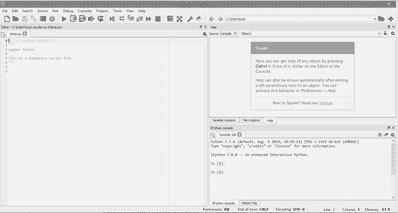
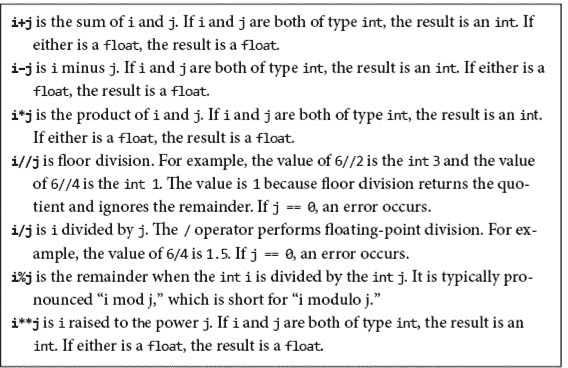
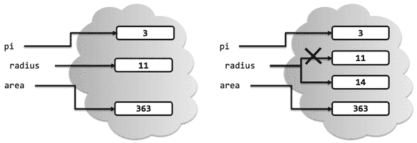
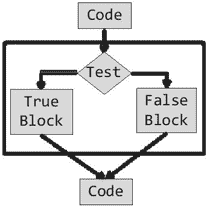
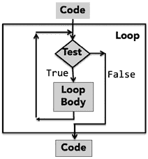
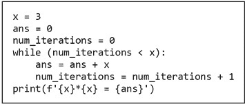
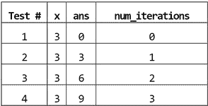
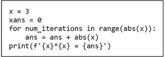

# 第二章：**Python 简介**

尽管每种编程语言都是不同的（虽然没有设计者们所认为的那样不同），但它们可以在某些维度上关联。

+   **低级与高级**指的是我们是否使用机器级别的指令和数据对象进行编程（例如，将 64 位数据从这个位置移动到那个位置），或者我们是否使用语言设计者提供的更抽象的操作（例如，在屏幕上弹出菜单）进行编程。

+   **通用与特定于应用领域**指的是编程语言的原始操作是广泛适用还是针对某一领域进行细化。例如，SQL 旨在从关系数据库中提取信息，但你不希望用它来构建操作系统。

+   **解释执行与编译执行**指的是程序员编写的指令序列（称为**源代码**）是否被直接执行（通过解释器），或者是否首先被转换（通过编译器）为一系列机器级原始操作。（在计算机的早期，人们必须用接近**机器代码**的语言编写源代码，以便计算机硬件可以直接解释。）这两种方法各有优劣。通常，调试那些设计为解释执行的语言编写的程序更容易，因为解释器能够产生易于与源代码关联的错误信息。编译语言通常生成运行更快且占用更少空间的程序。

在本书中，我们使用**Python**。然而，这本书并不是关于 Python 的。它当然会帮助你学习 Python，这很好。然而，更重要的是，你将学习如何编写解决问题的程序。你可以将这种技能转移到任何编程语言上。

Python 是一种通用编程语言，你可以有效地使用它构建几乎任何不需要直接访问计算机硬件的程序。对于具有高可靠性约束的程序（由于其弱静态语义检查）或由多人或在长时间内构建和维护的程序（同样因为弱静态语义检查），Python 并不是最佳选择。

Python 确实比许多其他语言具有多个优势。它是一种相对简单、易于学习的语言。由于 Python 被设计为解释执行，它能提供对初学者程序员特别有帮助的运行时反馈。大量不断增长的可自由获取的库与 Python 接口，提供了有用的扩展功能。本书中使用了其中的多个库。

我们准备介绍一些 Python 的基本元素。这些在概念上几乎所有编程语言都是共同的，尽管在细节上有所不同。

本书不仅仅是 Python 的介绍。它使用 Python 作为工具来呈现与计算问题解决和思维相关的概念。语言的呈现是按需逐步进行的。我们不需要的 Python 特性则完全不予展示。我们对没有涵盖每个细节感到放心，因为优秀的在线资源描述了语言的每一个方面。我们建议根据需要使用这些免费的在线资源。

Python 是一种活语言。自 1990 年由 Guido van Rossum 引入以来，它经历了许多变化。在其生命的头十年，Python 是一种鲜为人知且使用不多的语言。2000 年 Python 2.0 的到来改变了这一现状。除了对语言本身的重要改进外，它还标志着语言演变路径的转变。许多团体开始开发与 Python 无缝接口的库，Python 生态系统的持续支持和开发成为了一项社区活动。

Python 3.0 于 2008 年底发布。这个版本的 Python 清理了 Python 2 设计中的许多不一致性。然而，Python 3 不向后兼容。这意味着为早期版本的 Python 编写的大多数程序和库无法使用 Python 3 的实现运行。

到现在，所有重要的公共领域 Python 库都已移植到 Python 3。今天，没有理由使用 Python 2。

## 2.1 安装 Python 和 Python IDE

曾几何时，程序员使用通用文本编辑器输入他们的程序。如今，大多数程序员更喜欢使用**集成开发环境**（**IDE**）中的文本编辑器。

第一个 Python IDE，IDLE，作为标准 Python 安装包的一部分而出现。随着 Python 的普及，其他 IDE 应运而生。这些较新的 IDE 通常集成了一些更流行的 Python 库，并提供 IDLE 未提供的功能。**Anaconda**和 Canopy 是这些 IDE 中更受欢迎的选择。本书中的代码是在 Anaconda 中创建和测试的。

IDE 是应用程序，就像计算机上的任何其他应用程序一样。启动一个 IDE 的方式与启动其他应用程序相同，例如，通过双击图标。

+   提供具有语法高亮、自动补全和智能缩进的文本编辑器，

+   具有语法高亮的命令行，

+   一个集成调试器，目前可以安全地忽略它。

现在是安装 Anaconda（或其他 IDE）的好时机，以便你可以运行书中的示例，更重要的是，尝试编程练习。要安装 Anaconda，请访问

```py
[`www.anaconda.com/distribution/`](https://www.anaconda.com/distribution/)
```

并遵循说明。

安装完成后，启动应用程序`Anaconda-Navigator`。将出现一个包含 Python 工具集合的窗口。该窗口看起来类似于图 2-1。目前，我们唯一要使用的工具是`**Spyder**`。当你启动 Spyder（通过点击它的`Launch`按钮）时，将打开一个类似于图 2-2 的窗口。


图 2-1 Anaconda 启动窗口



图 2-2 Spyder 窗口

图 2-2 右下角的窗格是一个运行交互式 Python **shell** 的 **IPython 控制台**。你可以在这个窗口中输入并执行 Python 命令。右上角的窗格是一个帮助窗口。通常，关闭该窗口（通过点击 `x`）会更方便，这样可以为 IPython 控制台提供更多空间。左侧的窗格是一个编辑窗口，你可以在其中输入可以保存和运行的程序。窗口顶部的工具栏使打开文件和打印程序等各种任务变得容易。¹¹ `Spyder` 的文档可以在 [`www.spyder-ide.org/`](https://www.spyder-ide.org/) 找到。

## 2.2  Python 的基本元素

Python **程序**有时称为 **脚本**，是一系列定义和命令的序列。Shell 中的 Python 解释器评估定义并执行命令。

我们建议你现在启动一个 Python shell（例如，通过启动`Spyder`），并使用它尝试本章其余部分中的示例。事实上，在本书的其余部分中也可以这样做。

**命令**，通常称为 **语句**，指示解释器执行某项操作。例如，语句 `print('Yankees rule!')` 指示解释器调用函数¹² `print`，该函数将字符串 `Yankees rule!` 输出到与 shell 关联的窗口。

命令的序列

```py
print('Yankees rule!')
print('But not in Boston!')
print('Yankees rule,', 'but not in Boston!')
```

导致解释器产生输出

```py
Yankees rule!
But not in Boston!
Yankees rule, but not in Boston!
```

请注意，在第三条语句中传递了两个值给 `print`。`print` 函数接受由逗号分隔的可变数量的参数，并按出现顺序以空格字符分隔输出。

### 2.2.1 对象、表达式和数值类型

**对象**是 Python 程序操作的核心事物。每个对象都有一个 **类型**，定义了程序可以对该对象执行的操作。

类型分为标量和非标量。**标量**对象是不可分割的。可以将它们视为语言的原子。¹³ **非标量**对象，例如字符串，具有内部结构。

许多类型的对象可以通过程序文本中的 **字面量** 来表示。例如，文本 `2` 是表示数字的字面量，而文本 `'abc'` 是表示字符串的字面量。

Python 有四种类型的标量对象：

+   `**int**` 用于表示整数。类型为 `int` 的字面量是以我们通常表示整数的方式书写的（例如，`-3` 或 `5` 或 `10002`）。

+   `**float**` 用于表示实数。类型为 `float` 的字面量总是包含小数点（例如，`3.0` 或 `3.17` 或 `-28.72`）。 （也可以使用科学记数法来书写类型为 `float` 的字面量。例如，字面量 `1.6E3` 代表 1.6*10³，即它与 1600.0 相同。）你可能会想知道为什么这个类型不叫 `real`。在计算机内部，类型为 `float` 的值以 **浮点数** 的形式存储。这种表示法被所有现代编程语言采用，具有许多优点。然而，在某些情况下，它会导致浮点运算的行为与实数运算略有不同。我们将在第 3.3 节中讨论这个问题。

+   `**bool**` 用于表示布尔值 `True` 和 `False`。

+   `**None**` 是一种只有一个值的类型。我们将在第四部分中详细讨论 `None`。

对象和 **运算符** 可以组合形成 **表达式**，每个表达式的值为某种类型的对象。这称为表达式的 **值**。例如，表达式 `3 + 2` 表示类型为 `int` 的对象 `5`，而表达式 `3.0 + 2.0` 表示类型为 `float` 的对象 `5.0`。

`==` 运算符用于测试两个表达式是否评估为相同的值，而 `!=` 运算符用于测试两个表达式是否评估为不同的值。单个 `=` 意味着完全不同的东西，正如我们将在第 2.2.2 节中看到的。请提前警告——你会犯下将“`=`”输入成“`==`”的错误。注意这个错误。

在 Spyder 控制台中，类似于 `In [1]:` 的内容是 **shell 提示符**，表明解释器正在等待用户输入一些 Python 代码。提示符下方的行是在解释器评估用户输入的 Python 代码时产生的，下面是与解释器的一个交互示例：

```py
3
Out[1]: 3

3+2
Out[2]: 5

3.0+2.0
Out[3]: 5.0

3!=2
Out[4]: True
```

内置的 Python 函数 `type` 可用于查找对象的类型：

```py
type(3)
Out[5]: int

type(3.0)
Out[6]: float
```

类型为 `int` 和 `float` 的对象的运算符列在 图 2-3 中。算术运算符具有通常的优先级。例如，`*` 的优先级高于 `+`，因此表达式 `x+y*2` 会先计算 `y` 乘以 `2`，然后再将结果加到 `x` 上。可以通过使用括号来改变评估顺序，例如 `(x+y)*2` 会先将 `x` 和 `y` 相加，然后再将结果乘以 `2`。



图 2-3 类型 `int` 和 `float` 的运算符

类型 `bool` 的基本运算符是 `and`、`or` 和 `not`：

+   `**a 和 b**` 为 `True` 当且仅当 `a` 和 `b` 都为 `True`，否则为 `False`。

+   `**a 或 b**` 为 `True` 当至少一个 `a` 或 `b` 为 `True`，否则为 `False`。

+   `**not a**` 在`a`为`False`时为`True`，而在`a`为`True`时为`False`。

### 2.2.2 变量与赋值

**变量**提供了一种将名称与对象关联的方法。考虑以下代码

```py
pi = 3
radius = 11
area = pi * (radius**2)
radius = 14
```

代码首先**绑定**了名称`pi`和`radius`到不同的`int`类型对象上。¹⁴ 然后将名称`area`绑定到第三个`int`类型的对象。这在图 2-4 的左侧进行了描述。



图 2-4 变量与对象的绑定

如果程序接着执行`radius = 14`，那么名称`radius`将重新绑定到不同的`int`类型对象上，如图 2-4 右侧所示。请注意，这个赋值对`area`绑定的值没有影响。它仍然绑定于表达式`3*(11**2)`所表示的对象。

在 Python 中，*变量仅仅是一个名称*，**没有更多的意义**。记住这一点——这很重要。一个**赋值**语句将`=`符号左侧的名称与`=`符号右侧表达式所表示的对象关联起来。也请记住：一个对象可以有一个、多个或没有与之关联的名称。

也许我们不应该说，“变量*仅仅*是一个名称。”尽管朱丽叶这么说过，¹⁵ 名称是重要的。编程语言让我们描述计算，以便计算机可以执行它们。这并不意味着只有计算机在阅读程序。

正如你很快会发现的，编写正确工作的程序并不总是容易。经验丰富的程序员会确认，他们花费了大量时间阅读程序，以尝试理解它们为何以这样的方式运行。因此，编写易于阅读的程序是至关重要的。恰当选择变量名称在增强可读性方面起着重要作用。

考虑这两个代码片段

```py
a = 3.14159    pi = 3.14159
b = 11.2    diameter = 11.2
c = a*(b**2)   area = pi*(diameter**2)
```

就 Python 而言，这些代码片段没有区别。当执行时，它们将执行相同的操作。然而，对于人类读者来说，它们却截然不同。当我们阅读左侧的片段时，没有*先验*的理由怀疑有什么问题。然而，快速看一下右侧的代码应该会让我们怀疑某些地方不对。要么变量应该命名为`radius`而不是`diameter`，要么在计算面积时应该将`diameter`除以`2.0`。

在 Python 中，变量名可以包含大写和小写字母、数字（虽然不能以数字开头）以及特殊字符`_`（下划线）。Python 的变量名区分大小写，例如，`Romeo`和`romeo`是不同的名称。最后，Python 中有一些**保留字**（有时称为**关键字**），这些字有内置的意义，不能用作变量名。不同版本的 Python 有略微不同的保留字列表。Python 3.8 中的保留字包括：

| `and` | `break` | `elif` | `for` | `in` | `not` | `True` |
| --- | --- | --- | --- | --- | --- | --- |
| `as` | `class` | `else` | `from` | `is` | `or` | `try` |
| `assert` | `continue` | `except` | `global` | `lambda` | `pass` | `while` |
| `async` | `def` | `False` | `if` | `nonlocal` | `raise` | `with` |
| `await` | `del` | `finally` | `import` | `None` | `return` | `yield` |

提高代码可读性的另一个好方法是添加 **注释**。符号 `#` 后面的文本不会被 Python 解释。例如，我们可能会写

```py
side = 1 #length of sides of a unit square
radius = 1 #radius of a unit circle
#subtract area of unit circle from area of unit square
area_circle = pi*radius**2
area_square = side*side
difference = area_square – area_circle
```

Python 允许多重赋值。语句

```py
`x, y = 2, 3`
```

将 `x` 绑定到 `2`，将 `y` 绑定到 `3`。赋值右侧的所有表达式在任何绑定改变之前都会被评估。这很方便，因为它允许你使用多重赋值来交换两个变量的绑定。

例如，代码

```py
x, y = 2, 3
x, y = y, x
print('x =', x)
print('y =', y)
```

将打印

```py
x = 3
y = 2
```

## 2.3 分支程序

到目前为止，我们正在查看的计算类型称为 **直线程序**。它们按照出现的顺序一个接一个地执行语句，并在用尽语句时停止。我们可以用直线程序描述的计算类型并不是很有趣。事实上，它们实在是太无聊了。

**分支**程序更有趣。最简单的分支语句是 **条件**。如图 2-5 所示，条件语句有三个部分：

+   一个测试，即评估为 `True` 或 `False` 的表达式

+   如果测试评估为 `True`，则执行的代码块

+   如果测试评估为 `False`，则执行的可选代码块

在条件语句执行后，执行将继续在语句后的代码处。



图 2-5 条件语句的流程图

在 Python 中，条件语句的形式是

```py
`if` *Boolean expression*`:              if` *Boolean expression*`:`
    *block of code         * or  *         block of code*
`else:`
    *block of code*
```

在描述 Python 语句的形式时，我们使用斜体来标识在程序的某一点可能出现的代码类型。例如，*布尔表达式*表示任何评估为 `True` 或 `False` 的表达式可以跟在保留字 `if` 后，而 *代码块* 表示任何 Python 语句序列可以跟在 `else:` 后。

考虑以下程序，如果变量 `x` 的值为偶数，则打印“Even”，否则打印“Odd”：

```py
if x%2 == 0:
    print('Even')
else:
    print('Odd')
print('Done with conditional')
```

当 `x` 除以 `2` 的余数为 `0` 时，表达式 `x%2 == 0` 评估为 `True`，否则为 `False`。请记住，`==` 用于比较，而 `=` 是用于赋值的。

**缩进** 在 Python 中具有语义意义。例如，如果上述代码中的最后一条语句被缩进，它将属于与 `else` 相关的代码块，而不是条件语句后的代码块。

Python 在使用缩进方面是非常特殊的。大多数其他编程语言使用括号符号来划分代码块，例如，C 语言使用花括号`{` `}`来封闭代码块。Python 方法的一个优点是，它确保程序的视觉结构准确地代表其语义结构。由于缩进在语义上很重要，行的概念也很重要。过长的代码行可以通过在屏幕上每一行的末尾（除了最后一行）加上反斜杠（\）来拆分为多行。比如，

```py
 x = 1111111111111111111111111111111 + 222222222222333222222222 +\
    3333333333333333333333333333333
```

```py`Long lines can also be wrapped using Python's implied line continuation. This is done with bracketing, i.e., parentheses, square brackets, and braces. For example,    ```  x = 1111111111111111111111111111111 + 222222222222333222222222 +     3333333333333333333333333333333 ```py    is interpreted as two lines (and therefore produces an “unexpected indent” syntax error whereas    ```  x = (1111111111111111111111111111111 + 222222222222333222222222 +     3333333333333333333333333333333) ```py    is interpreted as a single line because of the parentheses. Many Python programmers prefer using implied line continuations to using a backslash. Most commonly, programmers break long lines at commas or operators.    Returning to conditionals, when either the true block or the false block of a conditional contains another conditional, the conditional statements are said to be **nested**. The following code contains nested conditionals in both branches of the top-level `if` statement.    ``` 如果 x%2 == 0:     如果 x%3 == 0:         print('能被 2 和 3 整除')     否则:         print('能被 2 整除但不能被 3 整除') 否则如果 x%3 == 0:     print('能被 3 整除但不能被 2 整除') ```py    The `elif` in the above code stands for “else if.”    It is often convenient to use a **compound Boolean expression** in the test of a conditional, for example,    ``` 如果 x < y 且 x < z:     print('x 是最小的') 否则如果 y < z:     print('y 是最小的') 否则:     print('z 是最小的') ```py    **Finger exercise:** Write a program that examines three variables—`x`, `y`, and `z`—and prints the largest odd number among them. If none of them are odd, it should print the smallest value of the three.    You can attack this exercise in a number of ways. There are eight separate cases to consider: they are all odd (one case), exactly two of them are odd (three cases), exactly one of them is odd (three cases), or none of them is odd (one case). So, a simple solution would involve a sequence of eight `if` statements, each with a single `print` statement:    ``` 如果 x%2 != 0 且 y%2 != 0 且 z%2 != 0:     print(max(x, y, z)) 如果 x%2 != 0 且 y%2 != 0 且 z%2 == 0:     print(max(x, y)) 如果 x%2 != 0 且 y%2 == 0 且 z%2 != 0:     print(max(x, z)) 如果 x%2 == 0 且 y%2 != 0 且 z%2 != 0:     print(max(y, z)) 如果 x%2 != 0 且 y%2 == 0 且 z%2 == 0:     print(x) 如果 x%2 == 0 且 y%2 != 0 且 z%2 == 0:     print(y) 如果 x%2 == 0 且 y%2 == 0 且 z%2 != 0:     print(z) 如果 x%2 == 0 且 y%2 == 0 且 z%2 == 0:     print(min(x, y, z)) ```py    That gets the job done, but is rather cumbersome. Not only is it 16 lines of code, but the variables are repeatedly tested for oddness. The following code is both more elegant and more efficient:    ``` answer = min(x, y, z) 如果 x%2 != 0:     answer = x 如果 y%2 != 0 且 y > answer:     answer = y 如果 z%2 != 0 且 z > answer:     answer = z print(answer) ```py    The code is based on a common programming paradigm. It starts by assigning a provisional value to a variable (`answer`), updating it when appropriate, and then printing the final value of the variable. Notice that it tests whether each variable is odd exactly once, and contains only a single print statement. This code is pretty much as well as we can do, since any correct program must check each variable for oddness and compare the values of the odd variables to find the largest of them.    Python supports **conditional expressions** as well as conditional statements. Conditional expressions are of the form    ``` *expr1* 如果 *condition* 否则 *expr2* ```py    If the condition evaluates to `True`, the value of the entire expression is `*expr1*`; otherwise it is `*expr2*`. For example, the statement    ``` x = y 如果 y > z 否则 z ```py    sets `x` to the maximum of `y` and `z`. A conditional expression can appear any place an ordinary expression can appear, including within conditional expressions. So, for example,    ``` print((x 如果 x > z 否则 z) 如果 x > y 否则 (y 如果 y > z 否则 z)) ```py    prints the maximum of `x`, `y`, and `z`.    Conditionals allow us to write programs that are more interesting than straight-line programs, but the class of branching programs is still quite limited. One way to think about the power of a class of programs is in terms of how long they can take to run. Assume that each line of code takes one unit of time to execute. If a straight-line program has `n` lines of code, it will take `n` units of time to run. What about a branching program with `n` lines of code? It might take less than `n` units of time to run, but it cannot take more, since each line of code is executed at most once.    A program for which the maximum running time is bounded by the length of the program is said to run in **constant time**. This does not mean that each time the program is run it executes the same number of steps. It means that there exists a constant, `k`, such that the program is guaranteed to take no more than `k` steps to run. This implies that the running time does not grow with the size of the input to the program.    Constant-time programs are limited in what they can do. Consider writing a program to tally the votes in an election. It would be truly surprising if one could write a program that could do this in a time that was independent of the number of votes cast. In fact, it is impossible to do so. The study of the intrinsic difficulty of problems is the topic of **computational complexity**. We will return to this topic several times in this book.    Fortunately, we need only one more programming language construct, iteration, to allow us write programs of arbitrary complexity. We get to that in Section 2.5.````  ```py`## 2.4 Strings and Input    Objects of type `str` are used to represent characters.¹⁶ Literals of type `str` can be written using either single or double quotes, e.g., `'abc'` or `"abc"`. The literal `'123'` denotes a string of three characters, not the number 123.    Try typing the following expressions in to the Python interpreter.    ``` `'a'` 3*4 `3*'a'` 3+4 `'a'+'a'` ```py    The operator `+` is said to be **overloaded** because it has different meanings depending upon the types of the objects to which it is applied. For example, the operator `+` means addition when applied to two numbers and concatenation when applied to two strings. The operator `*` is also over­loaded. It means what you expect it to mean when its operands are both numbers. When applied to an `int` and a `str`, it is a **repetition operator**—the expression `n*s`, where `n` is an `int` and `s` is a `str`, evaluates to a `str` with `n` repeats of `s`. For example, the expression `2*'John'` has the value `'JohnJohn'`. There is a logic to this. Just as the mathematical expression `3*2` is equivalent to `2+2+2`, the expression `3*'a'` is equivalent to `'a'+'a'+'a'`.    Now try typing    ``` new_id `'a'*'a'` ```py    Each of these lines generates an error message. The first line produces the message    ``` NameError: name 'new_id' is not defined ```py    Because `new_id` is not a literal of any type, the interpreter treats it as a name. However, since that name is not bound to any object, attempting to use it causes a runtime error. The code `'a'*'a'` produces the error message    ``` TypeError: can't multiply sequence by non-int of type ‘str'  ```py    That **type checking** exists is a good thing. It turns careless (and sometimes subtle) mistakes into errors that stop execution, rather than errors that lead programs to behave in mysterious ways. The type checking in Python is not as strong as in some other programming languages (e.g., Java), but it is better in Python 3 than in Python 2\. For example, it is clear what `<` should mean when it is used to compare two strings or two numbers. But what should the value of `'4' < 3` be`?` Rather arbitrarily, the designers of Python 2 decided that it should be `False`, because all numeric values should be less than all values of type `str`. The designers of Python 3, and most other modern languages, decided that since such expressions don't have an obvious meaning, they should generate an error message.    Strings are one of several sequence types in Python. They share the following operations with all sequence types.    *   The **length** of a string can be found using the `len` function. For example, the value of `len('abc')` is `3`. *   **Indexing** can be used to extract individual characters from a string. In Python, all indexing is zero-based. For example, typing `'abc'[0]` into the interpreter will cause it to display the string `'a'`. Typing `'abc'[3]` will produce the error message `IndexError: string index out of range`. Since Python uses `0` to indicate the first element of a string, the last element of a string of length 3 is accessed using the index `2`. Negative numbers are used to index from the end of a string. For example, the value of `'abc'[‑1]` is `'c'`. *   **Slicing** is used to extract substrings of arbitrary length. If `s` is a string, the expression `s[start:end]` denotes the substring of `s` that starts at index `start` and ends at index `end-1`. For example, `'abc'[1:3]` evaluates to `'bc'`. Why does it end at index `end-1` rather than `end`? So that expressions such as `'abc'[0:len('abc')]` have the value you might expect. If the value before the colon is omitted, it defaults to `0`. If the value after the colon is omitted, it defaults to the length of the string. Consequently, the expression `'abc'[:]` is semantically equivalent to the more verbose `'abc'[0:len('abc')]`. It is also possible to supply a third argument to select a non-contiguous slice of a string. For example, the value of the expression `'``123456789'[0:8:2]` is the string `'1357'`.    It is often convenient to convert objects of other types to strings using the `str` function. Consider, for example, the code    ``` num = 30000000 fraction = 1/2 print(num*fraction, '是', fraction*100, '%', '的', num) print(num*fraction, '是', str(fraction*100) + '%', '的', num) ```py    which prints    ``` 15000000.0 是 50.0 % 的 30000000 15000000.0 是 50.0% 的 30000000 ```py    The first print statement inserts a space between `50` and `%` because Python automatically inserts a space between the arguments to `print`. The second print statement produces a more appropriate output by combining the `50` and the `%` into a single argument of type `str`.    **Type conversions** (also called **type casts**) are used often in Python code. We use the name of a type to convert values to that type. So, for example, the value of `int('3')*4` is `12`. When a `float` is converted to an `int`, the number is truncated (not rounded), e.g., the value of `int(3.9)` is the `int` `3`.    Returning to the output of our print statements, you might be wondering about that `.0` at the end of the first number printed. That appears because `1/2` is a floating-point number, and the product of an `int` and a `float` is a `float`. It can be avoided by converting `num*fraction` to an `int`. The code    ``` print(int(num*fraction), '是', str(fraction*100) + '%', '的', num) ```py    prints `15000000 is 50.0% of 30000000`.    Python 3.6 introduced an alternative, more compact, way to build string expressions. An **f-string** consists of the character `f` (or `F`) following by a special kind of string literal called a **formatted string literal**. Formatted string literals contain both sequences of characters (like other string literals) and expressions bracketed by curly braces. These expressions are evaluated at runtime and automatically converted to strings. The code    ```  print(f'{int(num*fraction)} 是 {fraction*100}% 的 {num}') ```py    produces the same output as the previous, more verbose, print statement. If you want to include a curly brace in the string denoted by an f-string, use two braces. E.g., `print(f'{{{3*5}}}')` prints `{15}`.    The expression inside an f-string can contain modifiers that control the appearance of the output string.¹⁷ These modifiers are separated from the expression denoting the value to be modified by a colon. For example, the f-string  `f'{3.14159:.2f}'` evaluates to the string `'3.14'` because the modifier `.2f` instructs Python to truncate the string representation of a floating-point number to two digits after the decimal point. And the statement    ``` print(f'{num*fraction:,.0f} 是 {fraction*100}% 的 {num:,}') ```py    prints `15,000,000 is 50.0% of 30,000,000` because the `,` modifier instructs Python to use commas as thousands separators. We will introduce other modifiers as convenient later in the book.    ### 2.4.1 Input    Python 3 has a function, `**input**`, that can be used to get input directly from a user. The `input` function takes a string as an argument and displays it as a prompt in the shell. The function then waits for the user to type something and press the `enter` key. The line typed by the user is treated as a string and becomes the value returned by the function.    Executing the code `name = input('Enter your name: ')` will display the line    ``` `请输入你的名字:` ```py    in the console window. If you then type `George Washington` and press `enter`, the string `'George Washington'` will be assigned to the variable `name`. If you then execute `print('Are you really', name, '?')`, the line    ``` 你真的是乔治·华盛顿吗？ ```py    would be displayed. Notice that the `print` statement introduces a space before the “`?`”. It does this because when `print` is given multiple arguments, it places a space between the values associated with the arguments. The space could be avoided by executing `print('Are you really ' + name + '?')` or `print(f'Are you really {name}?')`, each of which produces a single string and passes that string as the only argument to `print`.    Now consider the code    ``` n = input('请输入一个整数: ') print(type(n)) ```py    This code will always print    ``` <class ‘str'> ```py    because `input` always returns an object of type `str`, even if the user has entered something that looks like an integer. For example, if the user had entered `3`, `n` would be bound to the str `'3'` not the int `3`. So, the value of the expression `n*4` would be `'3333'` rather than `12`. The good news is that whenever a string is a valid literal of some type, a type conversion can be applied to it.    **Finger exercise:** Write code that asks the user to enter their birthday in the form mm/dd/yyyy, and then prints a string of the form `‘You were born in the year yyyy.’`    ### 2.4.2 A Digression about Character Encoding    For many years most programming languages used a standard called ASCII for the internal representation of characters. This standard included `128` characters, plenty for representing the usual set of characters appearing in English-language text—but not enough to cover the characters and accents appearing in all the world's languages.    The **Unicode** standard is a character coding system designed to support the digital processing and display of the written texts of all languages. The standard contains more than `120,000` characters—covering `129` modern and historic scripts and multiple symbol sets. The Unicode standard can be implemented using different internal character encodings. You can tell Python which encoding to use by inserting a comment of the form    ``` `# -*- coding: *encoding name* -*-` ```py    as the first or second line of your program. For example,    ``` # -*- coding: utf-8 -*- ```py    instructs Python to use UTF-8, the most frequently used character encoding for webpages.¹⁸ If you don't have such a comment in your program, most Python implementations will default to UTF-8.    When using UTF-8, you can, text editor permitting, directly enter code like    ``` print('你会说英语吗？') print(`'`क्या आप अंग्रेज़ी बोलते हैं?`'`) ```py    which will print    ``` 你会说英语吗？ क्या आप अंग्रेज़ी बोलते हैं? ```py    You might be wondering how I managed to type the string `'`क्या आप अंग्रेज़ी बोलते हैं?`'`. I didn't. Because most of the web uses UTF-8, I was able to cut the string from a webpage and paste it directly into my program. There are ways to directly enter Unicode characters from a keyboard, but unless you have a special keyboard, they are all rather cumbersome.    ## 2.5 While Loops    Near the end of Section 2.3, we mentioned that most computational tasks cannot be accomplished using branching programs. Consider, for example, writing a program that asks for the number of X's. You might think about writing something like    ``` num_x = int(input('我应该打印字母 X 几次？ ')) to_print = '' 如果 num_x == 1:     to_print = 'X' elif num_x == 2:     to_print = 'XX' elif num_x == 3:     to_print = 'XXX' #… print(to_print) ```py    But it would quickly become apparent that you would need as many conditionals as there are positive integers—and there are an infinite number of those. What you want to write is a program that looks like (the following is **pseudocode**, not Python)    ``` num_x = int(input('我应该打印字母 X 几次？ ')) to_print = '' # 将 X 连接到 to_print num_x 次 print(to_print) ```py    When we want a program to do the same thing many times, we can use **iteration**. A generic iteration (also called **looping**) mechanism is shown in the box in Figure 2-6. Like a conditional statement, it begins with a test. If the test evaluates to `True`, the program executes the **loop** body once, and then goes back to reevaluate the test. This process is repeated until the test evaluates to `False`, after which control passes to the code following the iteration statement.      Figure 2-6 Flowchart for iteration      We can write the kind of loop depicted in Figure 2-6 using a **while** statement. Consider the code in Figure 2-7.      Figure 2-7 Squaring an integer, the hard way      The code starts by binding the variable `x` to the integer `3`. It then proceeds to square `x` by using repetitive addition. The table in Figure 2-8 shows the value associated with each variable each time the test at the start of the loop is reached. We constructed the table by **hand-simulating** the code, i.e., we pretended to be a Python interpreter and executed the program using pencil and paper. Using pencil and paper might seem quaint, but it is an excellent way to understand how a program behaves.¹⁹      Figure 2-8 Hand simulation of a small program      The fourth time the test is reached, it evaluates to `False` and flow of control proceeds to the `print` statement following the loop. For what values of `x` will this program terminate? There are three cases to consider: `x == 0`, `x > 0`, and `x < 0`.    Suppose `x == 0`. The initial value of num_`iterations` will also be `0`, and the loop body will never be executed.    Suppose `x > 0`. The initial value of `num_iterations` will be less than `x`, and the loop body will be executed at least once. Each time the loop body is executed, the value of `num_iterations` is increased by exactly `1`. This means that since `num_iterations` started out less than `x`, after some finite number of iterations of the loop, num_`iterations` will equal `x`. At this point the loop test evaluates to `False`, and control proceeds to the code following the `while` statement.    Suppose `x < 0`. Something very bad happens. Control will enter the loop, and each iteration will move `num_iterations` farther from `x` rather than closer to it. The program will therefore continue executing the loop forever (or until something else bad, e.g., an overflow error, occurs). How might we remove this flaw in the program? Changing the test to `num_iterations < abs(x)` almost works. The loop terminates, but it prints a negative value. If the assignment statement inside the loop is also changed, to `ans = ans + abs(x)`, the code works properly.    **Finger exercise:** Replace the comment in the following code with a `while` loop.    ``` num_x = int(input('我应该打印字母 X 几次？ ')) to_print = '' #将 X 连接到 to_print num_x 次 print(to_print) ```py    It is sometimes convenient to exit a loop without testing the loop condition. Executing a **break** statement terminates the loop in which it is contained and transfers control to the code immediately following the loop. For example, the code    ``` # 找到一个同时能被 11 和 12 整除的正整数 x = 1 while True:     如果 x%11 == 0 且 x%12 == 0:         break     x = x + 1 print(x, '能被 11 和 12 整除') ```py    prints    ``` 132 能被 11 和 12 整除 ```py    If a `break` statement is executed inside a nested loop (a loop inside another loop), the break will terminate the inner loop.    **Finger exercise:** Write a program that asks the user to input 10 integers, and then prints the largest odd number that was entered. If no odd number was entered, it should print a message to that effect.    ## 2.6 For Loops and Range    The `while` loops we have used so far are highly stylized, often iterating over a sequence of integers. Python provides a language mechanism, the `**for**` **loop**, that can be used to simplify programs containing this kind of iteration.    The general form of a `for` statement is (recall that the words in italics are descriptions of what can appear, not actual code):    ``` `for` *variable* `in` *sequence*`:`      *code block* ```py    The variable following `for` is bound to the first value in the sequence, and the code block is executed. The variable is then assigned the second value in the sequence, and the code block is executed again. The process continues until the sequence is exhausted or a `break` statement is executed within the code block. For example, the code    ``` total = 0 for num in (77, 11, 3):     total = total + num print(total) ```py    will print `91`. The expression (77, 11, 3) is a **tuple**. We discuss tuples in detail in Section 5\. For now, just think of a tuple as a sequence of values.    The sequence of values bound to *variable* is most commonly generated using the built-in function `**range**`, which returns a series of integers. The `range` function takes three integer arguments: `start`, `stop`, and `step`. It produces the progression `start, start + step, start + 2*step,` etc. If `step` is positive, the last element is the largest integer such that (`start + i*step)` is strictly less than `stop`. If `step` is negative, the last element is the smallest integer such that (`start + i*step)` is greater than `stop`. For example, the expression `range(5, 40, 10)` yields the sequence `5, 15, 25, 35`, and the expression `range(40, 5, -10)` yields the sequence `40, 30, 20, 10`.    If the first argument to `range` is omitted, it defaults to `0`, and if the last argument (the step size) is omitted, it defaults to `1`. For example, `range(0, 3)` and `range(3)` both produce the sequence `0, 1, 2`. The numbers in the progression are generated on an “as needed” basis, so even expressions such as `range(1000000)` consume little memory. We will discuss `range` in more depth in Section 5.2.    Consider the code    ``` x = 4 for i in range(x):     print(i) ```py    It prints    ``` 0 1 2 3 ```py    The code in Figure 2-9 reimplements the algorithm in Figure 2-7 for squaring an integer (corrected so that it works for negative numbers). Notice that unlike the `while` loop implementation, the number of iterations is not controlled by an explicit test, and the index variable `num_iterations` is not explicitly incremented.      Figure 2-9 Using a `for` statement      Notice that the code in Figure 2-9 does not change the value of `num_iterations` within the body of the `for` loop. This is typical, but not necessary, which raises the question of what happens if the index variable is modified within the `for` loop. Consider    ``` for i in range(2):     print(i)     i = 0     print(i) ```py    Do you think that it will print `0, 0, 1, 0`, and then halt? Or do you think it will print `0` over and over again?    The answer is `0, 0, 1, 0`. Before the first iteration of the `for` loop, the `range` function is evaluated and the first value in the sequence it yields is assigned to the index variable, `i`. At the start of each subsequent iteration of the loop, `i` is assigned the next value in the sequence. When the sequence is exhausted, the loop terminates. The above `for` loop is equivalent to the code    ``` index = 0 last_index = 1 while index <= last_index:     i = index     print(i)     i = 0     print(i)     index = index + 1 ```py    Notice, by the way, that code with the `while` loop is considerably more cumbersome than the `for` loop. The `for` loop is a convenient linguistic mechanism.    Now, what do you think    ``` x = 1 for i in range(x):     print(i)     x = 4 ```py    prints? Just `0`, because the arguments to the `range` function in the line with `for` are evaluated just before the first iteration of the loop, and not reevaluated for subsequent iterations.    Now, let's see how often things are evaluated when we nest loops. Consider    ``` x = 4 for j in range(x):     for i in range(x):         x = 2 ```py    How many times is each of the two loops executed? We already saw that the `range(x)` controlling the outer loop is evaluated the first time it is reached and not reevaluated for each iteration, so there are four iterations of the outer loop. That implies that the inner `for` loop is reached four times. The first time it is reached, the variable x = 4, so there will be four iterations. However, the next three times it is reached, x = 2, so there will be two iterations each time. Consequently, if you run    ``` `x = 3 for j in range(x):     print('外循环的迭代')     for i in range(x):         print('    内循环的迭代')         x = 2` ```py    it prints    ``` 外循环的迭代     内循环的迭代     内循环的迭代     内循环的迭代 外循环的迭代     内循环的迭代     内循环的迭代 外循环的迭代     内循环的迭代     内循环的迭代 ```py    The `for` statement can be used in conjunction with the `**in**` **operator** to conveniently iterate over characters of a string. For example,    ``` total = 0 for c in '12345678':     total = total + int(c) print(total) ```py    sums the digits in the string denoted by the literal `'12345678'` and prints the total.    **Finger exercise:** Write a program that prints the sum of the prime numbers greater than 2 and less than 1000\. Hint: you probably want to use a `for` loop that is a primality test nested inside a `for` loop that iterates over the odd integers between 3 and 999\.    ## 2.7 Style Matters    Much of this book is devoted to helping you learn a programming language. But knowing a language and knowing how to use a language well are two different things. Consider the following two sentences:    *“Everybody knows that if a man is* *unmarried and has a lot of money, he* *needs to get married.”*    *“It is a truth universally acknowledged, that a single man in possession of a good fortune, must be in want of a wife.”*²⁰    Each is a proper English sentence, and each means approximately the same thing. But they are not equally compelling, and perhaps not equally easy to understand. Just as style matters when writing in English, style matters when writing in Python. However, while having a distinctive voice might be an asset for a novelist, it is not an asset for a programmer. The less time readers of a program have to spend thinking about things irrelevant to the meaning of the code, the better. That's why good programmers follow coding conventions designed to make programs easy to understand, rather than fun to read.    Most Python programmers follow the conventions laid out in the **PEP 8** **style guide**.²¹ Like all sets of conventions, some of its prescriptions are arbitrary. For example, it prescribes using four spaces for indents. Why four spaces and not three or five? No particularly good reason. But if everybody uses the same number of spaces, it is easier to read (and perhaps combine) code written by different people. More generally, if everyone uses the same set of conventions when writing Python, readers can concentrate on understanding the semantics of the code rather than wasting mental cycles assimilating stylistic decisions.    The most important conventions have to do with naming. We have already discussed the importance of using variable names that convey the meaning of the variable. Noun phrases work well for this. For example, we used the name `num_iterations` for a variable denoting the number of iterations. When a name includes multiple words, the convention in Python is to use an underscore (`_)` to separate the words. Again, this convention is arbitrary. Some programmers prefer to use what is often called camelCase, e.g., `numIterations`—arguing that it is faster to type and uses less space.    There are also some conventions for single-character variable names. The most important is to avoid using a lowercase L or uppercase I (which are easily confused with the number one) or an uppercase O (which is easily confused with the number zero).    That's enough about conventions for now. We will return to the topic as we introduce various aspects of Python.    We have now covered pretty much everything about Python that you need to know to start writing interesting programs that deal with numbers and strings. In the next chapter, we take a short break from learning Python, and use what you have already learned to solve some simple problems.    ## 2.8 Terms Introduced in Chapter    *   low-level language *   high-level language *   interpreted language *   compiled language *   source code *   machine code *   Python *   integrated development environment (IDE) *   Anaconda *   Spyder *   IPython console *   shell *   program (script) *   command (statement) *   object *   type *   scalar object *   non-scalar object *   literal *   floating point *   bool *   None *   operator *   expression *   value *   shell prompt *   variable *   binding *   assignment *   reserved word *   comment (in code) *   straight-line program *   branching program *   conditional *   indentation (in Python) *   nested statement *   compound expression *   constant time *   computational complexity *   conditional expression *   strings *   overloaded operator *   repetition operator *   type checking *   indexing *   slicing *   type conversion (casting) *   formatted string expression *   input *   Unicode *   iteration (looping) *   pseudocode *   while loop *   hand simulation *   break *   for loop *   tuple *   range *   in operator *   PEP 8 style guide````
