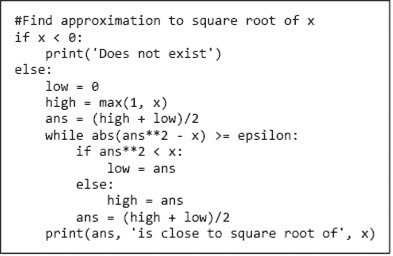
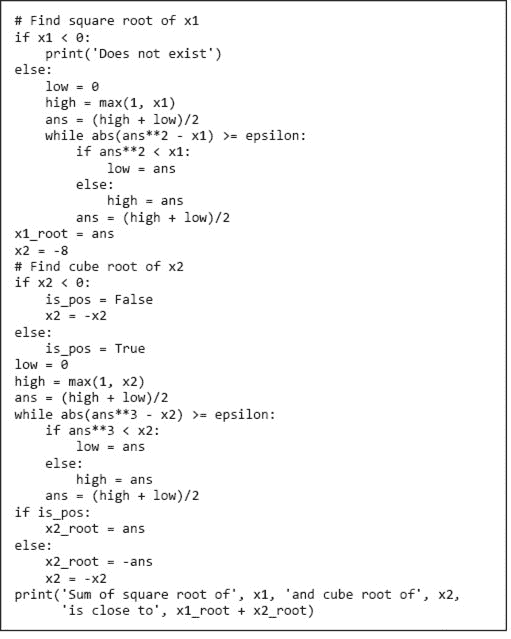
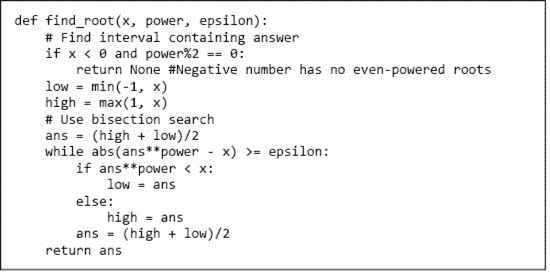
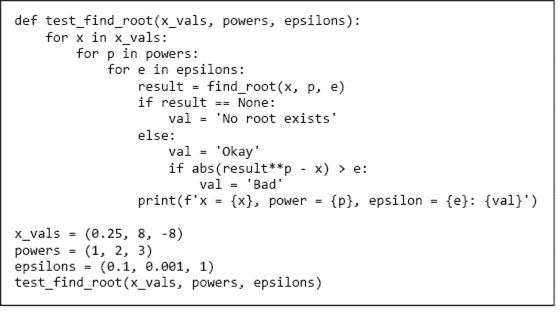
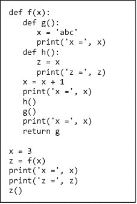
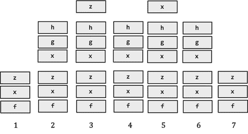
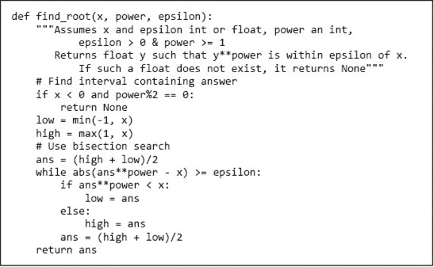
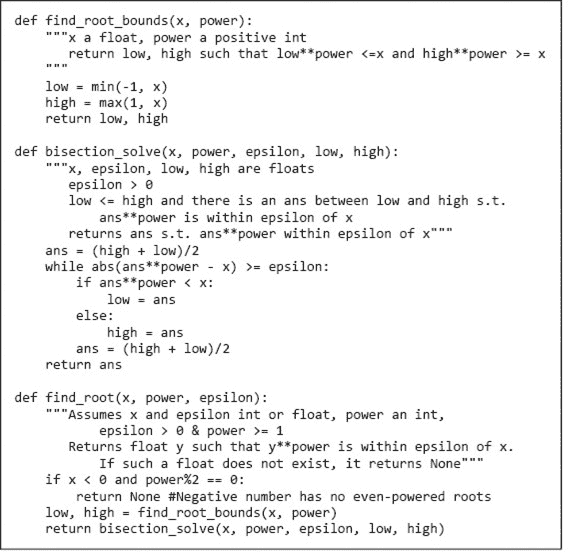
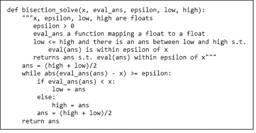
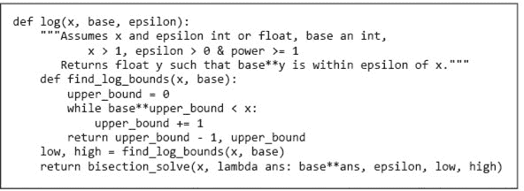

# 第四章：函数、作用域和抽象

到目前为止，我们已经介绍了数字、赋值、输入/输出、比较和循环结构。这个 Python 子集有多强大？从理论上讲，它强大到你所需的一切，即它是图灵完备的。这意味着，如果一个问题可以通过计算解决，那么它可以仅仅使用你已经看到的语言机制来解决。

但仅仅因为某件事可以做，并不意味着应该去做！虽然原则上任何计算都可以仅使用这些机制来实现，但这样做非常不实际。在上一章中，我们查看了一个寻找正数平方根近似值的算法，见图 4-1。



图 4-1 使用二分查找法近似计算 x 的平方根

这是一个合理的代码片段，但缺乏通用性。它仅适用于分配给变量`x`和`epsilon`的值。这意味着如果我们想重用它，就需要复制代码，可能还要编辑变量名，然后粘贴到我们想要的位置。我们不能轻松地在其他更复杂的计算中使用这个计算。此外，如果我们想计算立方根而不是平方根，我们就得编辑代码。如果我们想要一个能够计算平方根和立方根的程序（或者说在两个不同地方计算平方根），程序中将包含多块几乎相同的代码。

图 4-2 将图 4-1 中的代码改编为打印`x1`的平方根和`x2`的立方根的和。代码可以运行，但看起来不太美观。



图 4-2 平方根和立方根的和

程序包含的代码越多，出错的机会就越大，代码的维护也越困难。例如，想象一下，如果二分查找法的初始实现存在错误，并且在测试程序时发现了这个错误，那么很容易在一个地方修复实现，而忽视了其他需要修复的类似代码。

幸运的是，Python 提供了几种语言特性，使得泛化和重用代码相对容易。最重要的是函数。

## 4.1 函数与作用域

我们已经使用了多个内置函数，例如在图 4-1 中使用的`max`和`abs`。程序员能够定义并像内置函数一样使用自己的函数，这在便利性上是一个质的飞跃。

### 4.1.1 函数定义

在 Python 中，每个**函数定义**的形式是²⁵

```py
def *name of function* (*list of formal parameters*):
    *body of function*
```

例如，我们可以通过代码定义函数`max_val`²⁶

```py
def max_val(x, y):
    if x > y:
        return x
    else:
        return y
```

`def`是一个保留字，告诉 Python 即将定义一个函数。函数名（在此示例中为`max_val`）只是一个用于引用函数的名称。PEP 8 规范要求函数名应全小写，单词用下划线分隔，以提高可读性。

函数名后括号中的名称序列（在此示例中为`x`,`y`）是函数的**形式参数**。当使用函数时，形式参数被绑定（如同赋值语句）到**实际参数**（通常称为**实参**）的**函数调用**（也称为**函数调用**）。例如，该调用

```py
`max_val(3, 4)`
```

将`x`绑定到`3`，`y`绑定到`4`。

函数体是任何 Python 代码的片段。²⁷ 然而，有一个特殊语句`**return**`，只能在函数体内使用。

函数调用是一个表达式，像所有表达式一样，它有一个值。该值由被调用的函数返回。例如，表达式`max_val(3,4)*max_val(3,2)`的值是`12`，因为第一次调用`max_val`返回`int` `4`，第二次返回`int` `3`。请注意，执行`return`语句会终止函数的调用。

概括地说，当调用函数时

1.  1\. 组成实际参数的表达式被求值，函数的形式参数被绑定到结果值。例如，调用`max_val(3+4, z)`将把形式参数`x`绑定到`7`，将形式参数`y`绑定到调用执行时变量`z`的值。

1.  2\. **执行点**（下一条要执行的指令）从调用点移动到函数体中的第一条语句。

1.  3\. 函数体中的代码会执行，直到遇到`return`语句，在这种情况下，`return`后面表达式的值成为函数调用的值；如果没有更多语句可执行，函数将返回值`None`。（如果`return`后没有表达式，调用的值为`None`。）²⁸

1.  4\. 调用的值是返回的值。

1.  5\. 执行点被转移回紧接在调用后面的代码。

参数使程序员能够编写访问特定对象的代码，而是访问调用函数时选择用作实际参数的对象。这被称为**lambda 抽象**。²⁹

图 4-3 包含一个有三个形式参数并返回一个值的函数，称其为`result`，使得`abs(result**power – x) >= epsilon`。



图 4-3 一个寻找根的函数

图 4-4 包含可用于测试 `find_root` 是否按预期工作的代码。测试函数 `test_find_root` 的长度与 `find_root` 本身大致相同。对于缺乏经验的程序员来说，编写 **测试函数** 通常看起来是一种浪费精力。然而，经验丰富的程序员知道，编写测试代码的投资往往会带来丰厚的回报。这绝对胜过在键盘前反复输入测试用例到 shell 中进行 **调试**（找出程序为何不工作并修复的过程）。请注意，由于我们使用三个长度为三的元组调用 `test_find_root`，一次调用检查 27 种参数组合。最后，因为 `test_find_root` 检查 `find_root` 是否返回合适的答案并报告结果，它使程序员免于逐个检查每个输出并验证其正确性的乏味且容易出错的任务。我们将在第八章回到测试的主题。

**手指练习：** 使用 图 4-3 中的 `find_root` 函数打印 25 的平方根、-8 的立方根和 16 的四次根的近似值之和。使用 0.001 作为 epsilon。

**手指练习：** 编写一个函数 `is_in`，接受两个字符串作为参数，如果其中一个字符串在另一个字符串中出现，则返回 True，否则返回 False。提示：你可能想使用内置的 `str` 操作符 `in`。

**手指练习：** 编写一个函数来测试 `is_in`。



图 4-4 测试 `find_root` 的代码

### 4.1.2 关键字参数和默认值

在 Python 中，正式参数绑定到实际参数有两种方式。最常见的方法是 **位置参数**——第一个正式参数绑定到第一个实际参数，第二个正式参数绑定到第二个实际参数，依此类推。Python 还支持 **关键字参数**，其中正式参数通过其名称绑定到实际参数。考虑以下函数定义

```py
def print_name(first_name, last_name, reverse): 
   if reverse:
      print(last_name + ', ' + first_name)
   else:
      print(first_name, last_name)
```

函数 `print_name` 假设 `first_name` 和 `last_name` 是字符串，`reverse` 是布尔值。如果 `reverse == True`，它打印 `last_name,` `first_name`；否则，它打印 `first_name last_name`。

以下每个都是 `print_name` 的等效调用：

```py
print_name('Olga', 'Puchmajerova', False)
print_name('Olga', 'Puchmajerova', reverse = False)
print_name('Olga', last_name = 'Puchmajerova', reverse = False)
print_name(last_name = 'Puchmajerova', first_name = 'Olga',
          reverse = False)
```

尽管关键字参数可以在实际参数列表中以任何顺序出现，但在关键字参数后跟非关键字参数是非法的。因此，会产生错误消息

```py
print_name('Olga', last_name = 'Puchmajerova', False)
```

关键字参数通常与 **默认参数值** 一起使用。例如，我们可以写

```py
def print_name(first_name, last_name, reverse = False):
   if reverse:
      print(last_name + ', ' + first_name)
   else:
      print(first_name, last_name)
```

默认值允许程序员用少于指定数量的参数调用函数。例如，

```py
print_name('Olga', 'Puchmajerova')
print_name('Olga', 'Puchmajerova', True)
print_name('Olga', 'Puchmajerova', reverse = True)
```

将打印

```py
Olga Puchmajerova
Puchmajerova, Olga
Puchmajerova, Olga
```

最后两次调用 `print_name` 在语义上是等价的。最后一次调用的优势在于为可能神秘的参数 `True` 提供了一些文档。更一般地说，使用关键字参数降低了将实际参数错误绑定到形式参数的风险。这行代码

```py
print_name(last_name = 'Puchmajerova', first_name = 'Olga')
```

不会对编写它的程序员的意图产生歧义。这是有用的，因为以错误的顺序调用函数并传递正确的参数是一种常见错误。

默认参数关联的值是在函数定义时计算的。这可能导致程序行为出人意料，正如我们在第 5.3 节中讨论的那样。

**手指练习：** 编写一个函数 `mult`，接受一个或两个整数作为参数。如果调用时传入两个参数，函数将打印两个参数的乘积；如果调用时传入一个参数，则打印该参数。

### 4.1.3 可变数量的参数

Python 有许多内置函数可以处理可变数量的参数。例如，

```py
min(6,4)
min(3,4,1,6)
```

两者都是合法的（并且评估的结果符合你的预期）。Python 使程序员可以轻松定义接受可变数量参数的函数。**拆包运算符** `*` 允许函数接受可变数量的位置参数。例如，

```py
def mean(*args):
    # Assumes at least one argument and all arguments are numbers
    # Returns the mean of the arguments
    tot = 0
    for a in args:
        tot += a
    return tot/len(args)
```

打印 `1.5 -1.0`。请注意，参数列表中跟在 `*` 后面的名称不必是 `args`，可以是任何名称。对于 `mean`，更具描述性的写法可能是 `def mean(*numbers)`。

### 4.1.4 作用域

我们来看另一个小例子：

```py
def f(x): #name x used as formal parameter
    y = 1
    x = x + y
    print('x =', x)
    return x
x = 3
y = 2
z = f(x) #value of x used as actual parameter
print('z =', z)
print('x =', x)
print('y =', y)
```

运行时，这段代码打印

```py
x = 4
z = 4
x = 3
y = 2
```

这里发生了什么？在调用 `f` 时，形式参数 `x` 在 `f` 的函数体上下文中被局部绑定到实际参数 `x` 的值。尽管实际参数和形式参数同名，但它们不是同一个变量。每个函数定义了一个新的**名称空间**，也称为**作用域**。在 `f` 中使用的形式参数 `x` 和**局部变量** `y` 仅在 `f` 的定义范围内存在。函数体内的赋值语句 `x = x + y` 将局部名称 `x` 绑定到对象 `4`。在 `f` 中的赋值对 `f` 作用域外存在的名称 `x` 和 `y` 的绑定没有影响。

这里有一种思考方式：

1.  1\. 在顶层，即 shell 的级别，**符号表** 跟踪在该级别定义的所有名称及其当前绑定。

1.  2\. 当函数被调用时，会创建一个新的符号表（通常称为**栈帧**）。这个表跟踪在函数内定义的所有名称（包括形式参数）及其当前绑定。如果在函数体内再次调用该函数，则会创建另一个栈帧。

1.  3\. 当函数完成时，其栈帧会消失。

在 Python 中，你可以通过查看程序文本来确定名称的作用域。这被称为**静态**或**词法作用域**。图 4-5 包含一个示例，说明了 Python 的作用域规则。与代码相关的栈帧历史在图 4-6 中描绘。



图 4-5 嵌套作用域

图 4-6 中的第一列包含函数`f`体外已知的名称集合，即变量`x`和`z`以及函数名称`f`。第一个赋值语句将`x`绑定到`3`。



图 4-6 栈帧

赋值语句`z = f(x)`首先通过调用函数`f`并传入`x`绑定的值来计算表达式`f(x)`。当进入`f`时，创建了一个栈帧，如第 2 列所示。栈帧中的名称有`x`（形式参数`x`，而不是调用上下文中的`x`）、`g`和`h`。变量`g`和`h`绑定到类型为`function`的对象。这些函数的属性由`f`内部的函数定义给出。

当从`f`内部调用`h`时，又创建了一个栈帧，如第 3 列所示。此帧仅包含局部变量`z`。为什么它不包含`x`呢？只有当名称是函数的形式参数或绑定到函数体内对象的变量时，才会将名称添加到与函数关联的作用域中。在`h`的主体内，`x`仅出现在赋值语句的右侧。一个名称（在这种情况下是`x`）出现在函数体（在这种情况下是`h`）中但未绑定到任何对象，导致解释器搜索与函数定义相关的作用域的栈帧（与`f`相关的栈帧）。如果找到了名称（在这种情况下找到了），则使用其绑定的值（`4`）。如果没有找到，则会产生错误信息。

当`h`返回时，与`h`调用相关的栈帧消失（它从栈顶**弹出**），如第 4 列所示。请注意，我们从不移除栈中间的帧，而只移除最新添加的帧。由于这种“后进先出”（**LIFO**）的行为，我们称其为**栈**。（想象一下煎一叠煎饼。当第一个煎饼从平底锅上取下时，厨师将其放在一个餐盘上。随着每个后续煎饼从平底锅上取下，它被叠放在已经在餐盘上的煎饼上。当要吃煎饼时，首先上桌的煎饼是叠在最上面的，即最后一个放入的煎饼——这使得倒数第二个放入的煎饼成为新的顶部煎饼，接下来要上桌的煎饼。）


回到我们的 Python 示例，`g`现在被调用，并添加一个包含`g`的局部变量`x`的栈帧（列 5）。当`g`返回时，该帧被弹出（列 6）。当`f`返回时，包含与`f`相关名称的栈帧被弹出，使我们回到原始栈帧（列`7`）。

请注意，当`f`返回时，尽管变量`g`不再存在，曾经与该名称绑定的`function`类型的对象仍然存在。这是因为函数是对象，可以像其他任何类型的对象一样被返回。因此，`z`可以绑定到`f`返回的值，函数调用`z()`可以用来调用在`f`中与名称`g`绑定的函数——即使名称`g`在`f`的外部上下文中是未知的。

那么，图 4-5 中的代码打印了什么？它打印了

```py
x = 4
z = 4
x = abc
x = 4
x = 3
z = <function f.<locals>.g at 0x1092a7510>
x = abc
```

对名称的引用顺序并不重要。如果在函数体内的任何地方将一个对象绑定到一个名称（即使它出现在赋值的左侧之前的表达式中），它被视为该函数的局部。³⁰ 请考虑以下代码

```py
def f():
   print(x)
def g():
   print(x)
   x = 1
x = 3
f()
x = 3
g()
```

当调用`f`时，它打印`3`，但错误信息

```py
UnboundLocalError: local variable 'x' referenced before assignment
```

当遇到`g`中的打印语句时会打印出来。这是因为`print`语句后面的赋值语句使得`x`变成了`g`的局部变量。而且因为`x`是`g`的局部变量，所以在执行`print`语句时没有值。

还感到困惑吗？大多数人需要一点时间来理解作用域规则。不要让这困扰你。现在，继续前进，开始使用函数。大多数时候，你只想使用局部于函数的变量，而作用域的细微差别将无关紧要。事实上，如果你的程序依赖于一些微妙的作用域规则，你可能会考虑重写以避免这样做。

## 4.2 规范

一个**规范**定义了函数的实现者与将编写使用该函数的程序的人之间的契约。我们将函数的用户称为其**客户**。这个契约可以被视为包含两个部分：

+   **假设**：这些描述了函数的客户必须满足的条件。通常，它们描述了对实际参数的约束。几乎总是，它们指定了每个参数的可接受类型集，并且不时对一个或多个参数的值施加一些约束。例如，`find_root`的规范可能要求`power`为正整数。

+   **保证**：这些描述了在满足假设的情况下，函数必须满足的条件。例如，`find_root`的规范可能保证，如果被要求找到不存在的根（例如，负数的平方根），它将返回`None`。

函数是一种创建计算元素的方法，我们可以将其视为原始元素。它们提供了分解和抽象。

**分解**创造结构。它允许我们将程序分解为合理自-contained 的部分，并可以在不同环境中重复使用。

**抽象**隐藏了细节。它允许我们像使用一个黑箱一样使用一段代码——即，我们看不到、也不需要看、甚至不应该想要看其内部细节。³¹ 抽象的本质是在特定上下文中保留相关信息，并遗忘该上下文中不相关的信息。在编程中有效使用抽象的关键是找到一个适合抽象构建者和潜在抽象客户端的相关性概念。这就是编程的真正艺术。

抽象就是关于遗忘的。有很多方法可以对其建模，例如，大多数青少年的听觉系统。

青少年说：*我今晚可以借车吗？*

父母说：*是的，但要在午夜之前回来，并确保油箱是满的。*

青少年听到：*是的*。

青少年忽略了所有他或她认为无关紧要的琐碎细节。抽象是一个多对一的过程。如果父母说“是的，但要在凌晨 2 点之前回来，并确保车子干净”，这也会被抽象为“是的”。

通过类比，想象一下你被要求制作一个包含 25 节课的计算机科学入门课程。一种方法是招募 25 位教授，让每位教授准备一个小时的讲座，讲述他们最喜欢的话题。尽管你可能会得到 25 个精彩的小时，但整个课程可能会让人感觉像是皮兰德罗的*寻找作者的六个角色*（或你参加的那门有 15 位客座讲师的政治科学课程）。如果每位教授独立工作，他们就无法将自己讲座中的材料与其他讲座中的材料联系起来。

不知怎么的，你需要让每个人知道其他人正在做什么，而不产生太多的工作让没人愿意参与。这就是抽象的作用。你可以写 25 个规格，每个规格说明学生在每节课上应该学习什么材料，但不提供关于如何教授这些材料的任何细节。你得到的可能在教育上并不完美，但至少可能是有意义的。

这是组织使用程序员团队完成任务的方式。给定一个模块的规格，程序员可以在实现该模块时无需担心团队中其他程序员在做什么。此外，其他程序员可以利用该规格开始编写使用该模块的代码，而不必担心模块将如何实现。

图 4-7 为 图 4-3 中的 `find_root` 实现添加了一个规范。



图 4-7 带有规范的函数定义。

三重引号之间的文本在 Python 中称为 **docstring**。按照惯例，Python 程序员使用 docstring 提供函数的规范。这些 docstring 可以使用内置函数 `**help**` 进行访问。

Python IDEs 的一个优点是它们提供了一个交互式工具，用于查询内置对象。如果你想知道某个特定函数的功能，只需在控制台窗口中输入 `help(*object*)`。例如，输入 `help(abs)` 会产生以下文本。

```py
Help on built-in function abs in module builtins:

abs(x, /)
    Return the absolute value of the argument.
```

这告诉我们 `abs` 是一个将单个参数映射到其绝对值的函数。（参数列表中的 `/` 意味着该参数必须是位置参数。）如果你输入 `help()`，会启动一个交互式帮助会话，解释器会在控制台窗口中显示提示符 `help>`。交互模式的一个优点是，你可以获得有关不是对象的 Python 构造的帮助。例如，

```py
help> if
The "if" statement
******************

The "if" statement is used for conditional execution:

   if_stmt ::= "if" expression ":" suite
               ("elif" expression ":" suite)*
               ["else" ":" suite]

It selects exactly one of the suites by evaluating the expressions one
by one until one is found to be true (see section Boolean operations
for the definition of true and false); then that suite is executed
(and no other part of the "if" statement is executed or evaluated).
If all expressions are false, the suite of the "else" clause, if
present, is executed.

Related help topics: TRUTHVALUE
```

可以通过输入 `quit` 退出交互帮助。

如果 图 4-4 中的代码已加载到 IDE 中，在 shell 中输入 `help(find_root)` 将显示

```py
find_root(x, power, epsilon)
    Assumes x and epsilon int or float, power an int,
        epsilon > 0 & power >= 1
    Returns float y such that y**power is within epsilon of x.
        If such a float does not exist, it returns None
```

`find_root` 的规范是所有可能满足该规范的实现的抽象。`find_root` 的客户端可以假设实现符合规范，但不应假设其他内容。例如，客户端可以假设调用 `find_root(4, 2, 0.01)` 返回的某个值的平方在 `3.99` 和 `4.01` 之间。返回的值可以是正数或负数，即使 `4` 是一个完全平方，返回的值也可能不是 `2` 或 `-2`。关键是，如果未满足规范的假设，则无法对调用函数的效果做出任何假设。例如，调用 `find_root(8, 3, 0)` 可能返回 `2`，但也可能崩溃、无限运行，或者返回与 8 的立方根相去甚远的某个数字。

**指尖练习：** 使用图 3-6 的算法，编写一个满足规范的函数。

```py
def log(x, base, epsilon):
    """Assumes x and epsilon int or float, base an int,
           x > 1, epsilon > 0 & power >= 1
       Returns float y such that base**y is within epsilon of x."""
```

## 4.3 使用函数模块化代码。

到目前为止，我们实现的所有函数都很小，适合单页展示。随着我们实现更复杂的功能，将函数拆分为多个执行单一简单任务的函数是很方便的。为了说明这个想法，我们稍微多余地将 `find_root` 拆分为三个独立的函数，如 图 4-8 所示。每个函数都有自己的规范，并且每个函数作为独立实体是有意义的。函数 `find_root_bounds` 查找根必须位于的区间，`bisection_solve` 使用二分搜索在此区间中寻找根的近似值，而 `find_root` 则简单地调用其他两个函数并返回根。

这个版本的 `find_root` 比原始单体实现更容易理解吗？可能不是。一个好的经验法则是，如果一个函数可以舒适地放在单页上，它可能不需要被细分以便于理解。



图 4-8 将 find_root 拆分为多个函数

## 4.4 函数作为对象

在 Python 中，函数是 **一等对象**。这意味着它们可以像其他类型的对象一样被处理，例如 `int` 或 `list`。它们有类型，例如，表达式 `type(abs)` 的值为 `<type 'built-in_function_or_method'>`；它们可以出现在表达式中，例如，作为赋值语句的右侧或作为函数的参数；它们可以由函数返回；等等。

使用函数作为参数允许一种称为 **高阶编程** 的编码风格。它使我们能够编写更具通用性的函数。例如，图 4-8 中的 `bisection_solve` 函数可以重写，以便应用于根以外的任务，如 图 4-9 所示。



图 4-9 概括 `bisection_solve`

我们开始将整数参数 `power` 替换为一个函数 `eval_ans`，该函数将浮点数映射到浮点数。然后，我们将表达式 `ans**power` 的每个实例替换为函数调用 `eval_ans(ans)`。

如果我们想使用新的 `bisection_solve` 打印出 99 的平方根近似值，我们可以运行代码

```py
def square(ans):
    return ans**2
low, high = find_root_bounds(99, 2)
print(bisection_solve(99, square, 0.01, low, high)) 
```

为了简单地定义一个函数来计算平方，似乎有些多余。幸运的是，Python 支持使用保留字 `lambda` 创建匿名函数（即不绑定名称的函数）。**lambda 表达式**的一般形式是

```py
lambda *sequence of variable names* : *expression*
```

例如，lambda 表达式 `lambda x, y: x*y` 返回一个返回其两个参数乘积的函数。lambda 表达式常作为高阶函数的参数使用。比如，我们可以用

```py
print(bisection_solve(99, lambda ans: ans**2, 0.01, low, high)) 
```

**练习：** 编写一个具有两个数值参数的 lambda 表达式。如果第二个参数为零，它应该返回 `None`。否则，它应该返回第一个参数除以第二个参数的值。提示：使用条件表达式。

由于函数是一等对象，它们可以在函数内创建和返回。例如，给定函数定义

```py
def create_eval_ans():
    power = input('Enter a positive integer: ')
    return lambda ans: ans**int(power)
```

代码

```py
eval_ans = create_eval_ans()
print(bisection_solve(99, eval_ans, 0.01, low, high))
```

将打印 99 的 n^(th) 根的近似值，其中 n 是用户输入的数字。

我们对`bisection_solve`的概括意味着它现在不仅可以用来搜索根的逼近值，还可以搜索任何将浮点数映射到浮点数的单调³²函数的逼近值。例如，图 4-10 中的代码使用`bisection_solve`找到对数的逼近值。



图 4-10 使用`bisection_solve`来逼近对数

请注意，`log`的实现包含了一个局部函数`find_log_bounds`的定义。这个函数本可以在`log`之外定义，但由于我们不期望在其他上下文中使用它，因此不这样做似乎更好。

## 4.5 方法，简单化

方法是类似函数的对象。它们可以带参数调用，可以返回值，并且可以具有副作用。它们在一些重要方面与函数有所不同，我们将在第十章中讨论。

目前，可以将方法视为为函数调用提供一种特殊语法。我们使用**点表示法**将第一个参数放在函数名称之前，而不是将其放在括号内。我们在这里引入方法，因为许多内置类型上的有用操作都是方法，因此通过点表示法调用。例如，如果`s`是一个字符串，可以使用`find`方法找到子字符串在`s`中第一次出现的索引。因此，如果`s`是`'abcbc'`，调用`s.find('bc')`将返回`1`。尝试将`find`视为函数，例如调用`find(s,'bc')`，会产生错误信息`NameError: name 'find' is not defined`。

**指尖练习：** 如果`sub`在`s`中不存在，`s.find(sub)`会返回什么？

**指尖练习：** 使用`find`实现一个满足规范的函数

```py
def find_last(s, sub):
    """s and sub are non-empty strings
       Returns the index of the last occurrence of sub in s.
       Returns None if sub does not occur in s""" 
```

## 4.6 在章节中引入的术语

+   函数定义

+   形式参数

+   实际参数

+   参数

+   函数调用

+   返回语句

+   执行点

+   lambda 抽象

+   测试函数

+   调试

+   位置参数

+   关键字参数

+   默认参数值

+   解包运算符 (*)

+   名称空间

+   范围

+   局部变量

+   符号表

+   栈帧

+   静态（词法）作用域

+   栈（后进先出）

+   规范

+   客户端

+   假设

+   保证

+   分解

+   抽象

+   文档字符串

+   帮助函数

+   一等对象

+   高阶编程

+   lambda 表达式

+   方法

+   点表示法
