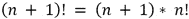
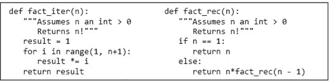
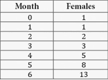
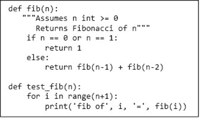
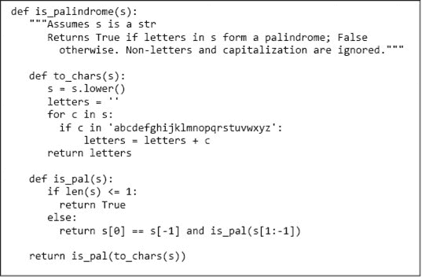
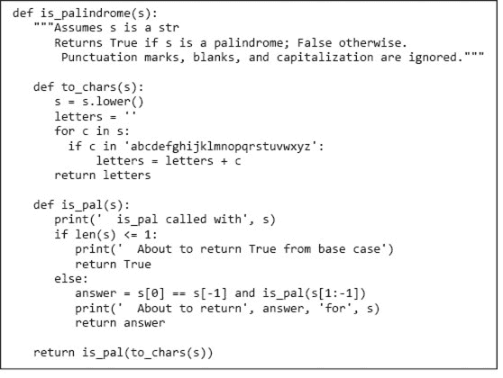
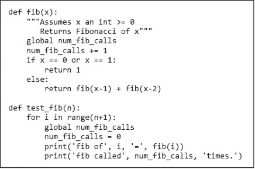

# 第六章：递归与全局变量

你可能听说过**递归**，而且很可能把它视为一种相当微妙的编程技巧。这是计算机科学家传播的一个迷人的都市传说，让人们觉得我们比实际上聪明。递归是一个重要的概念，但并不是那么微妙，它不仅仅是一种编程技巧。

递归作为一种描述性方法被广泛使用，甚至连那些从未想过写程序的人也会使用它。考虑美国法律中对“出生公民权”概念的部分定义。大致来说，定义如下

+   在美国境内出生的任何孩子或

+   在美国境外婚生的任何孩子，其中一位父母是美国公民。

第一个部分很简单；如果你在美国出生，你就是出生公民（例如巴拉克·奥巴马）。如果你不是在美国出生，则取决于你出生时你的父母是否是美国公民。而你的父母是否是美国公民可能还取决于他们的父母是否是美国公民，依此类推。

一般来说，递归定义由两部分组成。至少有一个**基例**，直接指定特殊情况下的结果（上面示例中的情况 1），还有至少一个**递归（归纳）情况**（上面示例中的情况 2），根据某个其他输入的答案来定义答案，通常是同一问题的简化版本。基例的存在使得递归定义不成为循环定义。³⁹

世界上最简单的递归定义可能是阶乘函数（通常在数学中用！表示）针对自然数的定义。⁴⁰经典的**归纳定义**是




第一个方程定义了基例。第二个方程在前一个数字的阶乘的基础上，定义了所有自然数的阶乘，除了基例。

图 6-1 包含了阶乘的迭代实现（`fact_iter`）和递归实现（`fact_rec`）。



图 6-1 阶乘的迭代和递归实现

图 6-1 阶乘的迭代和递归实现

这个函数足够简单，两个实现都不难理解。然而，第二个实现是对原始递归定义的更直接翻译。

实现 `fact_rec` 通过在 `fact_rec` 的主体中调用 `fact_rec` 似乎有些作弊。这是因为与迭代实现的工作原理相同。我们知道 `fact_iter` 中的迭代将终止，因为 `n` 一开始为正数，并且在每次循环中减少 1。这意味着它不可能永远大于 `1`。类似地，如果 `fact_rec` 被以 1 调用，它会返回一个值而不进行递归调用。当它进行递归调用时，它总是以一个比被调用时小 1 的值进行。最终，递归以调用 `fact_rec(1)` 终止。

**手指练习：** 整数的谐波和，n > 0，可以使用公式计算 。编写一个递归函数来计算这个值。

## 6.1 斐波那契数

斐波那契数列是另一种常见的数学函数，通常以递归方式定义。“它们繁殖得像兔子一样快，”通常用来描述说话者认为增长过快的人口。在 1202 年，意大利数学家比萨的莱昂纳多，即斐波那契，提出了一个公式来量化这一概念，尽管有一些并不太现实的假设。⁴¹

假设一对新生的兔子，一只雄性和一只雌性，被放在一个围栏里（或者更糟的是，被释放到野外）。进一步假设这些兔子在一个月大时就能交配（令人惊讶的是，某些品种可以）并且有一个月的怀孕期（令人惊讶的是，某些品种确实如此）。最后，假设这些神话中的兔子永远不会死（这不是任何已知兔子品种的特性），而且雌性兔子从第二个月开始每个月都会产下一对新兔子（一个雄性，一个雌性）。六个月结束时会有多少只雌性兔子？

在第一个月的最后一天（称之为月份 `0`），将有一只雌性兔子（准备在下一个月的第一天交配）。在第二个月的最后一天，仍然只有一只雌性兔子（因为她直到下一个月的第一天才会产仔）。在下一个月的最后一天，将会有两只雌性兔子（一只怀孕的和一只不怀孕的）。在下一个月的最后一天，将会有三只雌性兔子（两只怀孕的和一只不怀孕的）。依此类推。让我们以表格形式查看这一进程，图 6-2。



图 6-2 雌性兔子数量的增长

注意到对于月份 `n > 1`，`females(n) = females(n‑1) + females(n-2)`。这并不是偶然。每只在月份 `n-1` 仍然存活的雌性将在月份 `n` 依然存活。此外，每只在月份 `n‑2` 存活的雌性将在月份 `n` 产生一只新的雌性。新的雌性可以加到月份 `n-1` 的雌性数量中，以获得月份 `n` 的雌性数量。

图 6-2 雌性兔子数量的增长

人口增长自然地通过**递推**描述⁴²

```py
females(0) = 1
females(1) = 1
females(n + 2) = females(n+1) + females(n)
```

这个定义与阶乘的递归定义不同：

+   它有两个基本情况，而不仅仅是一个。一般来说，我们可以有任意多的基本情况。

+   在递归情况下，有两个递归调用，而不仅仅是一个。同样，我们可以有任意多的调用。

图 6-3 包含了斐波那契递推的直接实现，⁴³以及一个可以用来测试它的函数。



图 6-3 递归实现斐波那契数列

编写代码是解决这个问题的简单部分。一旦我们从一个模糊的关于兔子的问题陈述转变为一组递归方程，代码几乎是自然而然地生成的。找到一种抽象的方法来表达当前问题的解决方案通常是构建一个有用程序中最困难的步骤。我们将在本书后面详细讨论这个问题。

正如你可能猜到的，这并不是野生兔子种群增长的完美模型。在 1859 年，澳大利亚农民托马斯·奥斯丁从英格兰进口了 24 只兔子作为猎物。一些兔子逃脱。十年后，澳大利亚每年大约有两百万只兔子被射杀或捕获，对种群没有明显影响。这是很多兔子，但与`120`^(th)斐波那契数`r`相差甚远。⁴⁴

虽然斐波那契数列并没有提供兔子种群增长的完美模型，但它确实具有许多有趣的数学性质。斐波那契数在自然界中也很常见。例如，大多数花朵的花瓣数是斐波那契数。

**手指练习：** 当图 6-3 中的`fib`实现被用来计算`fib(5)`时，它在计算`fib(5)`的过程中计算了多少次`fib(2)`的值？

## 6.2 回文

递归对许多不涉及数字的问题也很有用。图 6-4 包含一个函数`is_palindrome`，它检查字符串是否正反读相同。



图 6-4 回文测试

函数`is_palindrome`包含两个内部**辅助函数**。这对函数的客户端没有太大兴趣，客户端只需关心`is_palindrome`的实现是否符合其规范。但你应该关心，因为通过检查实现可以学到很多东西。

辅助函数`to_chars`将所有字母转换为小写并移除所有非字母。它首先使用字符串上的内置方法生成一个与`s`相同的字符串，只是所有大写字母都被转换为小写。

辅助函数`is_pal`使用递归来完成实际工作。两个基本情况是长度为零或一的字符串。这意味着递归实现部分只会在长度为二或更多的字符串上被触及。在`else`子句中的连接⁴⁵是从左到右进行评估的。代码首先检查第一个和最后一个字符是否相同，如果相同，则继续检查去掉这两个字符的字符串是否为回文。在这个例子中，只有当第一个连接评估为`True`时，第二个连接才会被评估，这在语义上并不相关。然而，在书的后面部分，我们将看到一些例子，其中这种**短路评估**布尔表达式在语义上是相关的。

这个`is_palindrome`的实现是一个重要问题解决原则的例子，称为**分而治之**。（这个原则与分而治之算法相关，但略有不同，后者将在第十二章讨论。）这个问题解决原则是通过将一个难题拆分为一组子问题来征服一个困难的问题，具备以下属性。

+   子问题比原始问题更容易解决。

+   子问题的解决方案可以结合起来解决原始问题。

分而治之是一个古老的思想。尤利乌斯·凯撒践行了罗马人所称的*divide et impera*（分而治之）。英国人巧妙地运用这一方法来控制印度次大陆。本杰明·富兰克林非常清楚英国在运用这一技术方面的专业知识，因此在美国独立宣言签署时他说：“我们必须团结一致，否则我们必将各自面对困境。”

在这种情况下，我们通过将原始问题拆分为一个更简单的同类问题（检查一个较短的字符串是否为回文）和一个我们知道如何处理的简单问题（比较单个字符）来解决问题，然后使用逻辑运算符`and`结合解决方案。图 6-5 包含一些可视化这一过程的代码。



图 6-5 可视化回文测试的代码

执行代码

```py
print('Try dogGod')
print(is_palindrome('dogGod'))
print('Try doGood')
print(is_palindrome('doGood'))
```

打印

```py
Try dogGod
  is_pal called with doggod
  is_pal called with oggo
  is_pal called with gg
  is_pal called with 
  About to return True from base case
  About to return True for gg
  About to return True for oggo
  About to return True for doggod
True
Try doGood
  is_pal called with dogood
  is_pal called with ogoo
  is_pal called with go
  About to return False for go
  About to return False for ogoo
  About to return False for dogood
False
```

## 6.3 全局变量

如果你尝试用一个大数字调用`fib`，你可能会注意到运行时间非常长。假设我们想知道进行了多少次递归调用。我们可以仔细分析代码来找出答案，在第十一章中我们将讨论如何做到这一点。另一种方法是添加一些代码来计算调用次数。一种方法是使用**全局变量**。

到目前为止，我们所编写的所有函数仅通过其参数和返回值与环境进行通信。在大多数情况下，这正是应该的。这通常导致程序相对容易阅读、测试和调试。然而，偶尔情况下，全局变量也会派上用场。考虑图 6-6 中的代码。



图 6-6 使用全局变量

在每个函数中，代码行`global` `num_fib_calls`告诉 Python，名称`num_fib_calls`应该在其出现的函数外部定义。如果我们没有包含代码`global num_fib_calls`，那么名称`num_fib_calls`将在函数`fib`和`test_fib`中是局部的，因为`num_fib_calls`在`fib`和`test_fib`的赋值语句左侧。函数`fib`和`test_fib`都可以不受限制地访问变量`num_fib_calls`所引用的对象。函数`test_fib`每次调用`fib`时都会将`num_fib_calls`绑定为`0`，而`fib`每次进入时都会递增`num_fib_calls`的值。

调用`test_fib(6)`会产生输出

```py
fib of 0 = 1
fib called 1 times.
fib of 1 = 1
fib called 1 times.
fib of 2 = 2
fib called 3 times.
fib of 3 = 3
fib called 5 times.
fib of 4 = 5
fib called 9 times.
fib of 5 = 8
fib called 15 times.
fib of 6 = 13
fib called 25 times.
```

我们对全局变量这一主题的引入怀有些许忧虑。自 1970 年代以来，持卡计算机科学家们对它们表示反对，这一点是有充分理由的。全局变量的滥用可能导致许多问题。使程序可读的关键在于局部性。人们是逐段阅读程序的，每一段所需的上下文越少，理解就越好。由于全局变量可以在多种地方被修改或读取，它们的不当使用可能破坏局部性。然而，在某些情况下，全局变量确实是所需的。全局变量最常见的用法可能是定义一个将在多个地方使用的**全局常量**。例如，某个编写与物理相关的程序的人可能希望一次性定义光速 C，然后在多个函数中使用它。

## 6.4 本章介绍的术语

+   递归

+   基本情况

+   递归（归纳）情况

+   归纳定义

+   递归关系

+   辅助函数

+   短路求值

+   分治法

+   全局变量

+   全局常量
