# 第十章：类与面向对象编程

现在我们将注意力转向与在 Python 中编程相关的最后一个主要主题：使用类来围绕数据抽象组织程序。

类可以以多种不同的方式使用。在本书中，我们强调在**面向对象编程**的背景下使用它们。面向对象编程的关键在于将对象视为数据和操作这些数据的方法的集合。

面向对象编程的理念已有大约 50 年的历史，在过去的 30 年左右得到了广泛接受和实践。在 1970 年代中期，人们开始撰写文章解释这种编程方法的好处。大约在同一时间，编程语言 SmallTalk（在 Xerox PARC）和 CLU（在 MIT）为这些理念提供了语言支持。但直到 C++ 和 Java 的出现，面向对象编程才真正开始在实践中蓬勃发展。

在本书的大部分内容中，我们一直隐含地依赖于面向对象编程。在第 2.2.1 节中，我们说过：“对象是 Python 程序操作的核心。每个对象都有一个**类型**，定义了程序可以对该对象做的事情。”自第二章以来，我们依赖于内置类型，如 `float` 和 `str` 及其相关的方法。但正如编程语言的设计者只能内置一小部分有用的函数，他们也只能内置一小部分有用的类型。我们已经看过一种允许程序员定义新函数的机制；现在我们将看一种允许程序员定义新类型的机制。

## 10.1 抽象数据类型与类

抽象数据类型的概念相当简单。**抽象数据类型**是一组对象及其上的操作。这些被绑定在一起，以便程序员可以将一个对象从程序的一个部分传递到另一个部分，并在此过程中提供对对象的数据属性的访问，以及方便操作这些数据的操作。

这些操作的规范定义了抽象数据类型与程序其他部分之间的**接口**。接口定义了操作的行为——它们做什么，但不说明它们如何做到这一点。接口因此提供了一个**抽象屏障**，将程序的其余部分与提供类型抽象实现所涉及的数据结构、算法和代码隔离开来。

编程是以一种促进变化的方式来管理复杂性。有两种强大的机制可以实现这一点：分解和抽象。**分解**在程序中创建结构，而**抽象**则抑制细节。关键在于抑制适当的细节。这就是数据抽象能够发挥作用的地方。我们可以创建提供便利抽象的特定领域类型。理想情况下，这些类型捕捉在程序生命周期内相关的概念。如果我们在编程过程中设计出数月甚至数十年后仍然相关的类型，那么在维护该软件方面我们就有了很大的优势。

在本书中，我们一直在使用抽象数据类型（尽管没有这样称呼它们）。我们已经编写了使用整数、列表、浮点数、字符串和字典的程序，而没有考虑这些类型可能是如何实现的。用莫里哀的*《布尔乔亚绅士》*的话来说，*“我发誓，有超过一百页我们使用了 ADT，而我们并不知道。”*⁶⁰

在 Python 中，我们使用**类**实现数据抽象。每个类定义以保留字`class`开头，后面跟着类名和关于它如何与其他类相关的信息。

考虑以下微小（完全无用的）**类定义**。

```py
class Toy(object):
    def __init__(self):
        self._elems = []
    def add(self, new_elems):
        """new_elems is a list"""
        self._elems += new_elems
    def size(self):
        return len(self._elems)
```

第一行表示`Toy`是`object`的子类。目前，忽略作为子类意味着什么。我们很快就会涉及到这一点。

类定义创建一个`type`类型的对象，并将一组称为**属性**的对象与该类对象关联。在这个例子中，与类相关的三个属性是`__init__`、`add`和`size`。每个属性都是`function`类型。因此，代码

```py
print(type(Toy))
print(type(Toy.__init__), type(Toy.add), type(Toy.size))
```

打印

```py
<class ‘type'>
<class 'function'> <class 'function'> <class 'function'>
```

正如我们将看到的，Python 有许多特殊的函数名称以两个下划线开始和结束。这些通常被称为**魔法方法**。⁶¹我们将要看的第一个是`__init__`。每当类被实例化时，都会调用在该类中定义的`__init__`函数。当执行以下代码行时

```py
`s = Toy()`
```

被执行时，解释器将创建一个新的`Toy`类型的**实例**，然后调用`Toy.__init__`，将新创建的对象作为实际参数绑定到形式参数`self`。当调用`Toy.__init__`时，会创建列表对象`_elems`，它成为新创建的`Toy`类型实例的一部分。（该列表使用现在已熟悉的`[]`符号创建，实际上是`list()`的缩写。）列表`_elems`被称为`Toy`实例的**数据属性**。代码

```py
`t1 = Toy() print(type(t1)) print(type(t1.add)) t2 = Toy() print(t1 is t2) #test for object identity`
```

打印

```py
<class '__main__.Toy'>
<class 'method'>
False
```

请注意，`t1.add`是`method`类型，而`Toy.add`是`function`类型。由于`t1.add`是一个方法，我们可以使用点表示法调用它（和`t1.size`）。

类不应与该类的实例混淆，就像`list`类型的对象不应与`list`类型混淆一样。属性可以与类本身或类的实例关联：

+   类属性是在类定义中定义的；例如，`Toy.size`是类`Toy`的一个属性。当类被实例化时，比如通过语句`t = Toy()`，实例属性，比如`t.size`，会被创建。

+   虽然`t.size`最初绑定到类`Toy`中定义的`size`函数，但在计算过程中，这种绑定是可以改变的。例如，你可以（但绝对不应该！）通过执行`t.size = 3`来改变绑定。

+   当数据属性与类关联时，我们称它们为**类变量**。当它们与实例关联时，我们称它们为**实例变量**。例如，`_elems`是一个实例变量，因为对于每个`Toy`类的实例，`_elems`绑定到一个不同的列表。到目前为止，我们还没有看到类变量。我们将在图 10-4 中使用一个。

现在，考虑一下这段代码。

```py
t1 = Toy()
t2 = Toy()
t1.add([3, 4])
t2.add([4])
print(t1.size() + t2.size())
```

因为每个`Toy`实例都是不同的对象，所以每个`Toy`类型的实例都会有不同的`_elems`属性。因此，代码输出`3.`。

初看起来，这段代码似乎存在不一致的地方。看起来每个方法调用时参数少了一。比如，`add`有两个正式参数，但我们似乎只用一个实际参数在调用它。这是使用点表示法调用与类实例相关联的方法的结果。与点前的表达式相关联的对象会隐式地作为第一个参数传递给方法。在本书中，我们遵循使用`self`作为这个实际参数绑定的正式参数名称的惯例。Python 程序员几乎普遍遵循这一惯例，我们强烈建议你也这样做。

另一个常见的惯例是以一个下划线开始数据属性的名称。正如我们在 10.3 节中详细讨论的那样，我们使用前导的`_`来表示该属性是类的私有属性，即不应在类外部直接访问。

现在，让我们来看一个更有趣的例子。图 10-1 包含一个**类定义**，它提供了一个名为`Int_set`的整数集合抽象的简单实现。（考虑到 Python 有内置的`set`类型，这个实现既不必要又不必要地复杂。不过，它在教学上是有用的。）

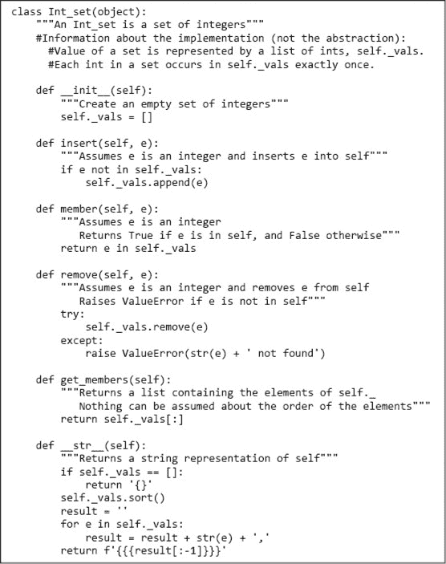

图 10-1 类`Int_set`

请注意，类定义顶部的文档字符串（用`"""`括起来的注释）描述的是类提供的抽象，而不是类的实现信息。相比之下，文档字符串下方的注释包含实现信息。这些信息面向可能想修改实现或构建该类子类的程序员，而不是希望使用该抽象的程序员。

如我们所见，与类实例相关的方法可以使用点符号调用。例如，代码，

```py
s = Int_set()
s.insert(3)
print(s.member(3))
```

创建一个新的`Int_set`实例，将整数 3 插入该`Int_set`，然后打印`True`。

数据抽象实现了表示独立性。将抽象类型的实现视为具有多个组件：

+   该类型方法的实现

+   一起编码该类型值的数据结构

+   关于方法实现如何使用数据结构的约定；一个关键约定由表示不变性捕捉

**表示不变性**定义了数据属性的哪些值对应于类实例的有效表示。`Int_set`的表示不变性是`vals`不包含重复值。`__init__`的实现负责建立该不变性（空列表时成立），其他方法负责维护该不变性。这就是为什么`insert`仅在`self.vals`中不存在`e`时才会添加它。

`remove`的实现利用了在进入`remove`时满足表示不变性的假设。它仅调用一次`list.remove`，因为表示不变性保证`self.vals`中最多只有一个`e`的出现。

类中定义的最后一个方法`__str__`是另一种特殊的`__`方法。当程序通过调用`str`将该类的实例转换为字符串时，将调用类的`__str__`方法。因此，当使用`print`命令时，打印对象的`__str__`函数将被调用。例如，代码

```py
s = Int_set()
s.insert(3)
s.insert(4)
print(str(s))
print('The value of s is', s)
```

将打印

```py
{3,4}
The value of s is {3,4}
```

（如果没有定义`__str__`方法，执行`print(s)`将打印类似于`<__main__.Int_set object at 0x1663510>`的内容。）

**手指练习：** 向`Int_set`类添加一个满足以下规范的方法。

```py
    def union(self, other):
        """other is an Int_set
           mutates self so that it contains exactly the elemnts in self
           plus the elements in other."""
```

### 10.1.1 魔法方法与可哈希类型

Python 设计目标之一是允许程序员使用类定义新的类型，使其使用与 Python 内置类型一样简单。使用魔法方法为内置函数如`str`和`len`提供类特定的定义在实现这一目标中发挥了重要作用。

魔法方法还可以用于为中缀运算符如==和+提供类特定的定义。可用于中缀运算符的方法名称是

| `+: __add__` | `*: __mul__` | `/: __truediv__` |
| --- | --- | --- |
| `-: __sub__` | `//: __floordiv__` | `%: __mod__` |
| `**: __pow__` | `&#124;: __or__` | `<: __lt__` |
| `<<: __lshift__` | `∧: __xor__` | `>: __gt__` |
| `>>: __rshsift__` | `==: __eq__` | `<=: __le__` |
| `&: __and__` | `!=: __ne__` | `>=: __ge__` |

你可以将任何实现与这些操作符关联。如果你愿意，可以将`+`实现为减法，将`<`实现为指数运算，等等。然而，我们建议你抵制这种想象力的机会，保持与这些操作符的传统含义一致的实现。

回到我们的玩具示例，考虑图 10-2 中的代码。

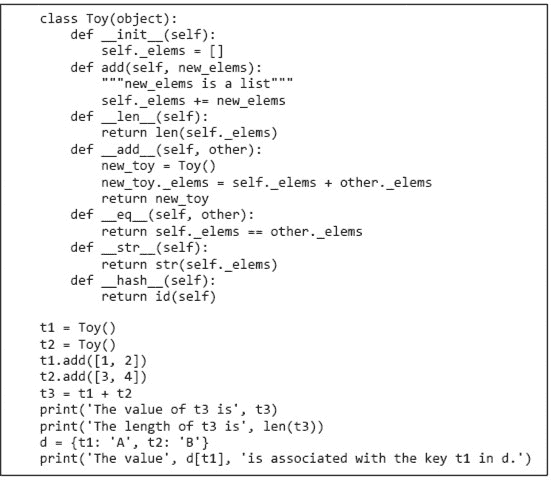

图 10-2 使用魔法方法

当运行图 10-2 中的代码时，它会打印

```py
The value of t3 is [1, 2, 3, 4]
The length of t3 is 4
The value A is associated with the key t1 in d.
```

我们可以将`Toy`的实例用作字典的键，因为我们为该类定义了`__hash__`函数。如果我们定义了`__eq__`函数但没有定义`__hash__`函数，当我们尝试使用`t1`和`t2`作为键创建字典时，代码将生成错误消息`unhashable type: ‘Toy'`。提供用户定义的`__hash__`时，应该确保对象的哈希值在该对象的生命周期内保持不变。

所有未显式定义`__eq__`的用户定义类的实例在`==`中使用对象标识，并且是可哈希的。如果没有提供`__hash__`方法，则对象的哈希值来自对象的标识（见第 5.3 节）。

**手指练习**：用一种允许`Int_set`的客户端使用`+`操作符表示集合并集的方法替换你添加到`Int_set`中的`union`方法。

### 10.1.2 使用抽象数据类型设计程序

抽象数据类型非常重要。它们导致了对组织大型程序的新思维方式。当我们思考世界时，我们依赖于抽象。在金融界，人们谈论股票和债券。在生物界，人们谈论蛋白质和残基。当试图理解这些概念时，我们会在脑海中将相关数据和特征汇集成一个知识包。例如，我们认为债券具有利率、到期日和价格等数据属性。我们还认为债券具有“设定价格”和“计算到期收益率”等操作。抽象数据类型使我们能够将这种组织方式融入程序设计中。

数据抽象鼓励程序设计者关注数据对象的核心，而不是函数。将程序更多地视为类型的集合而不是函数的集合，会导致根本不同的组织原则。除此之外，它鼓励我们将编程视为组合相对较大块的过程，因为数据抽象通常涵盖比单个函数更多的功能。这反过来使我们认为编程的本质是一个不是写个别代码行，而是组合抽象的过程。

可重用抽象的可用性不仅减少了开发时间，而且通常导致更可靠的程序，因为成熟的软件通常比新软件更可靠。多年来，常用的程序库只有统计或科学库。然而，今天可用的程序库范围广泛（尤其是针对 Python），通常基于丰富的数据抽象集，正如我们在本书后面将看到的那样。

### 10.1.3 使用类跟踪学生和教职工

作为类的示例使用，想象你正在设计一个程序，以帮助跟踪大学的所有学生和教职工。确实可以在不使用数据抽象的情况下编写这样的程序。每个学生将有一个姓氏、名字、家庭地址、年级、一些成绩等。这些数据可以通过列表和字典的组合来存储。跟踪教职工需要一些类似的数据结构和一些不同的数据结构，例如，用于跟踪薪资历史的数据结构。

在急于设计一堆数据结构之前，让我们考虑一些可能有用的抽象。是否存在一个覆盖学生、教授和工作人员共同属性的抽象？有人会争辩说，他们都是人。图 10-3 包含一个类，它结合了人类的两个共同属性（姓名和生日）。它使用了标准的 Python 库模块`datetime`，该模块提供了许多方便的方法来创建和处理日期。

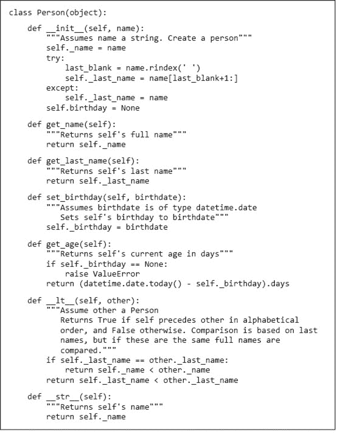

图 10-3 类`Person`

以下代码使用了`Person`和`datetime`。

```py
me = Person('Michael Guttag')
him = Person('Barack Hussein Obama')
her = Person('Madonna')
print(him.get_last_name())
him.set_birthday(datetime.date(1961, 8, 4))
her.set_birthday(datetime.date(1958, 8, 16))
print(him.get_name(), 'is', him.get_age(), ‘days old')
```

请注意，每当实例化`Person`时，都需要向`__init__`函数提供一个参数。一般来说，实例化一个类时，我们需要查看该类的`__init__`函数的规范，以了解需要提供哪些参数以及这些参数应该具备什么属性。

执行上述代码会创建三个类`Person`的实例。我们可以使用与这些实例相关联的方法访问有关它们的信息。例如，`him.get_last_name()`返回`'Obama'`。表达式`him._last_name`也会返回`'Obama'`；然而，由于本章后面讨论的原因，直接访问实例变量的表达式被认为是不良的写法，应当避免。同样，尽管实现中包含一个具有该值的属性，但对于`Person`抽象的用户来说，没有合适的方法提取一个人的生日。（当然，可以很容易地为该类添加一个`get_birthday`方法。）不过，有一种方法可以提取依赖于个人生日的信息，如上述代码中的最后一个`print`语句所示。

类`Person`为另一个特殊命名方法`__lt__`提供了特定于`Person`的定义。该方法重载了`<`运算符。每当`<`运算符的第一个参数为`Person`类型时，方法`Person__lt__`会被调用。类`Person`中的`__lt__`方法是使用类型`str`的二元`<`运算符实现的。表达式`self._name < other._name`是`self._name.__lt__(other._name)`的简写。由于`self._name`是`str`类型，因此这个`__lt__`方法与类型`str`相关联。

除了提供使用`<`的中缀表达式书写的语法便利外，这种重载还自动访问任何使用`__lt__`定义的多态方法。内置方法`sort`就是这样一个方法。因此，例如，如果`p_list`是由`Person`类型元素组成的列表，则调用`p_list.sort()`将使用类`Person`中定义的`__lt__`方法对该列表进行排序。因此，代码

```py
pList = [me, him, her]
for p in pList:
    print(p)
pList.sort()
for p in pList:
    print(p)
```

将打印

```py
Michael Guttag
Barack Hussein Obama
Madonna
Michael Guttag
Madonna
Barack Hussein Obama
```

## 10.2 继承

许多类型与其他类型有共同的属性。例如，类型`list`和`str`各自都有`len`函数，其意义相同。**继承**提供了一种方便的机制，用于构建相关抽象的分组。它允许程序员创建一个类型层次结构，在这个结构中，每个类型从其上层类型继承属性。

类`object`位于层次结构的顶部。这是合理的，因为在 Python 中，运行时存在的所有内容都是对象。由于`Person`继承了对象的所有属性，程序可以将变量绑定到`Person`，将`Person`添加到列表等。

图 10-4 中的类`MIT_person`继承自其父类`Person`的属性，包括`Person`从其父类`object`继承的所有属性。在面向对象编程的术语中，`MIT_person`是`Person`的**子类**，因此**继承**了其**超类**的属性。除了继承的属性外，子类还可以：

+   添加新属性。例如，子类`MIT_person`添加了类变量 _`next_id_num`、实例变量 _`id_num`以及方法`get_id_num`。

+   **覆盖**，即替换超类的属性。例如，`MIT_person`覆盖了`__init__`和`__lt__`。当一个方法被覆盖时，执行的方法版本取决于用于调用该方法的对象。如果对象的类型是子类，则使用在子类中定义的版本。如果对象的类型是超类，则使用超类中的版本。

方法`MIT_person.__init__`首先使用`super().__init__(name)`调用其超类（`Person`）的`__init__`函数。这初始化了继承的实例变量`self._name`。然后它初始化`self._id_num`，这是`MIT_person`的实例拥有但`Person`的实例没有的实例变量。

实例变量`self._id_num`使用一个属于类`MIT_person`的**类** **变量**_`next_id_num`进行初始化，而不是类的实例。当创建`MIT_person`的实例时，并不会创建一个新的`next_id_num`实例。这允许`__init__`确保每个`MIT_person`的实例都有一个唯一的 _`id_num`。

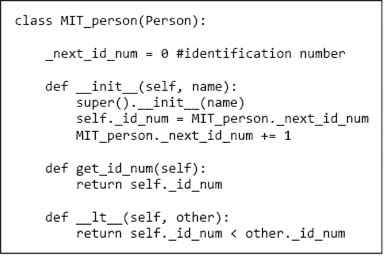

图 10-4 类`MIT_person`

考虑这段代码

```py
p1 = MIT_person('Barbara Beaver')
print(str(p1) + '\'s id number is ' + str(p1.get_id_num()))
```

第一行创建了一个新的`MIT_person`。第二行则更复杂。当它尝试评估表达式`str(p1)`时，运行时系统首先检查类`MIT_person`是否有与之关联的`__str__`方法。由于没有，它接着检查`MIT_person`的直接超类`Person`是否有`__str__`方法。确实存在，因此使用该方法。当运行时系统尝试评估表达式`p1.get_id_num()`时，它首先检查类`MIT_person`是否有与之关联的`get_id_num`方法。确实存在，因此它调用该方法并打印

```py
Barbara Beaver's id number is 0
```

（回想一下，在字符串中，字符“`\`”是一个转义字符，用于指示下一个字符应以特殊方式处理。在字符串中

```py
`'\'s id number is '`
```

“`\`”表示撇号是字符串的一部分，而不是终止字符串的分隔符。）

现在考虑这段代码

```py
p1 = MIT_person('Mark Guttag')
p2 = MIT_person('Billy Bob Beaver')
p3 = MIT_person('Billy Bob Beaver')
p4 = Person('Billy Bob Beaver')
```

我们创建了四个虚拟人物，其中三个名为**比利·鲍勃·河狸**。两个比利·鲍勃是类型为`MIT_person`，而一个仅是`Person`。如果我们执行以下代码行

```py
print('p1 < p2 =', p1 < p2)
print('p3 < p2 =', p3 < p2)
print('p4 < p1 =', p4 < p1)
```

解释器将打印

```py
p1 < p2 = True
p3 < p2 = False
p4 < p1 = True
```

由于`p1`、`p2`和`p3`都是`MIT_person`类型，解释器在评估前两个比较时将使用在`MIT_person`类中定义的`__lt__`方法，因此排序将基于识别号。在第三个比较中，`<`运算符应用于不同类型的操作数。由于表达式的第一个参数用于确定调用哪个`__lt__`方法，因此`p4 < p1`是`p4.__lt__(p1)`的简写。因此，解释器使用与`p4`类型相关的`__lt__`方法`Person`，并按名称对“人”进行排序。

如果我们尝试

```py
print('p1 < p4 =', p1 < p4)
```

运行时系统将调用与`p1`类型相关联的`__lt__`运算符，即在`MIT_person`类中定义的那个。这将导致异常。

```py
AttributeError: 'Person' object has no attribute '_id_num'
```

因为`p4`绑定的对象没有属性 _`id_num`。

**练习**：实现一个符合规范的`Person`子类。

```py
class Politician(Person):
    """ A politician is a person who can belong to a political party"""  
    def __init__(self, name, party = None):
        """name and party are strings"""
    def get_party(self):
        """returns the party to which self belongs"""
    def might_agree(self, other):
        """returns True if self and other belong to the same part
             or at least one of then does not belong to a party"""
```

### 10.2.1 多层继承

图 10-5 为类层次结构增加了另几层继承。

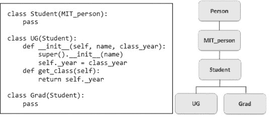

图 10-5 两种类型的学生

添加`UG`似乎是合乎逻辑的，因为我们希望将每位本科生与一个毕业年份（或预期毕业年份）关联起来。但`Student`和`Grad`类有什么情况呢？通过使用 Python 保留字`**pass**`作为主体，我们表明该类除了从其超类继承的属性外没有其他属性。为什么会有人想创建一个没有新属性的类呢？

通过引入类`Grad`，我们获得了创建两种类型学生的能力，并使用它们的类型来区分一种对象与另一种对象。例如，代码

```py
p5 = Grad('Buzz Aldrin')
p6 = UG('Billy Beaver', 1984)
print(p5, 'is a graduate student is', type(p5) == Grad)
print(p5, 'is an undergraduate student is', type(p5) == UG)
```

将打印

```py
Buzz Aldrin is a graduate student is True
Buzz Aldrin is an undergraduate student is False
```

中间类型`Student`的实用性更为微妙。考虑回到`class` `MIT_person`并添加该方法。

```py
def is_student(self):
    return isinstance(self, Student)
```

函数`isinstance`是 Python 内置的。`isinstance`的第一个参数可以是任何对象，但第二个参数必须是`type`类型的对象或一个`type`类型对象的元组。只有当第一个参数是第二个参数的实例时（或者，如果第二个参数是元组，则是元组中某种类型的实例），函数才会返回`True`。例如，`isinstance([1,2], list)`的值为`True`。

回到我们的示例，代码

```py
print(p5, 'is a student is', p5.is_student())
print(p6, 'is a student is', p6.is_student())
print(p3, 'is a student is', p3.is_student())
```

打印

```py
Buzz Aldrin is a student is True
Billy Beaver is a student is True
Billy Bob Beaver is a student is False
```

请注意，`isinstance(p6, Student)`的含义与`type(p6) == Student`的含义截然不同。`p6`绑定的对象的类型是`UG`，而不是`Student`，但由于`UG`是`Student`的子类，`p6`绑定的对象是`Student`类的一个实例（同时也是`MIT_person`和`Person`的实例）。

由于只有两种类型的学生，我们可以将`is_student`实现为，

```py
def is_student(self):
    return type(self) == Grad or type(self) == UG
```

然而，如果后续添加了一种新类型的学生，就有必要回过头来编辑实现`is_student`的代码。通过引入中间类`Student`并使用`isinstance`，我们避免了这个问题。例如，如果我们添加了

```py
class Transfer_student(Student):
    def __init__(self, name, from_school):
        MIT_person.__init__(self, name)
        self._from_school = from_school
    def get_old_school(self):
        return self._from_school
```

不需要对`is_student`进行更改。

在程序的创建和后期维护过程中，回过头来添加新类或旧类的新属性并不少见。好的程序员设计他们的程序，以尽量减少在进行此操作时可能需要更改的代码量。

**手指练习：**以下表达式的值是多少？

`isinstance('ab', str) == isinstance(str, str)`

### 10.2.2 替换原则

当使用子类化来定义类型层次结构时，子类应该被视为扩展其超类的行为。我们通过添加新属性或重写从超类继承的属性来实现。例如，`TransferStudent`通过引入前学校来扩展`Student`。

有时，子类会重写超类的方法，但这必须谨慎进行。特别是，超类的重要行为必须被每个子类支持。如果客户端代码在使用超类实例时正常工作，那么在替换为子类实例时也应正常工作（因此称为替换原则）。例如，应该能够编写使用`Student`规范的客户端代码，并使其在`TransferStudent`上正常工作。⁶²

反之，没有理由期望为`TransferStudent`编写的代码能够适用于任意类型的`Student`。

## 10.3 封装与信息隐藏

只要我们在处理学生，没必要让他们经历上课和获得成绩的痛苦那就太可惜了。

图 10-6 包含一个可以用来跟踪一组学生成绩的类。类`Grades`的实例是使用列表和字典实现的。列表跟踪班级中的学生，而字典将学生的身份证明号码映射到成绩列表。

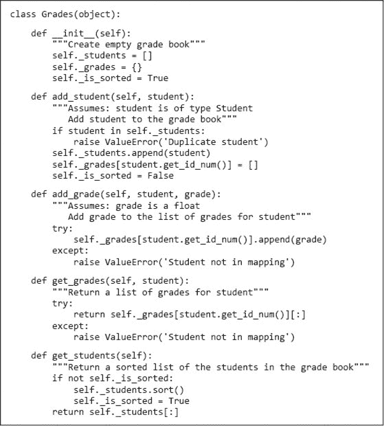

图 10-6 类`Grades`

请注意，`get_grades`返回与学生关联的成绩列表的副本，而`get_students`返回学生列表的副本。通过简单返回实例变量本身，可以避免复制列表的计算成本。然而，这样做可能会导致问题。考虑代码

```py
course = Grades()
course.add_student(Grad('Bernie'))
all_students = course.get_students()
all_students.append(Grad('Liz'))
```

如果`get_students`返回`self._students`，那么代码的最后一行将会有（可能是意外的）副作用，改变`course`中的学生集合。

实例变量`_is_sorted`用于跟踪自上次添加学生以来学生列表是否已排序。这使得`get_students`的实现可以避免对已排序列表进行排序。

图 10-7 包含一个使用类`Grades`为一些修读课程`six_hundred`的学生生成成绩报告的函数。

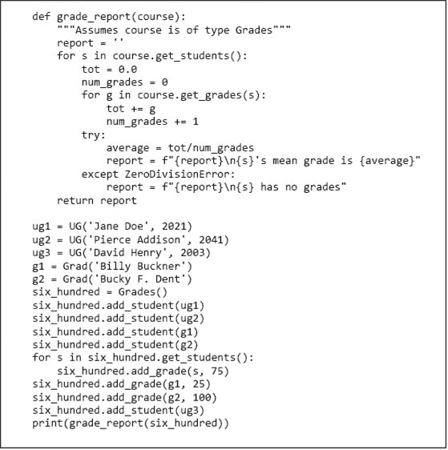

图 10-7 生成成绩报告。

运行时，图中的代码打印。

```py
Jane Doe's mean grade is 75.0
Pierce Addison's mean grade is 75.0
David Henry has no grades
Billy Buckner's mean grade is 50.0
Bucky F. Dent's mean grade is 87.5
```

面向对象编程的核心有两个重要概念。第一个是**封装**的概念。我们指的是将数据属性和操作这些属性的方法捆绑在一起。例如，如果我们写。

```py
Rafael = MIT_person('Rafael Reif')
```

我们可以使用点符号访问诸如 Rafael 的名字和身份证号等属性。

第二个重要概念是**信息隐藏**。这是模块化的关键之一。如果使用类的程序部分（即类的客户端）仅依赖于类中方法的规范，那么实现该类的程序员就可以自由地更改类的实现（例如，提高效率），而不必担心该更改会破坏使用该类的代码。

一些编程语言（例如 Java 和 C++）提供强制信息隐藏的机制。程序员可以将类的属性设为**私有**，以便类的客户端只能通过对象的方法访问数据。Python 3 使用命名约定使得属性在类外不可见。当属性的名称以`__`（双下划线）开头但不以`__`结尾时，该属性在类外不可见。请参考图 10-8 中的类。

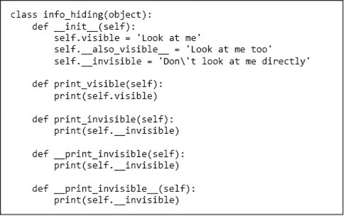

图 10-8 类中的信息隐藏。

当我们运行代码时。

```py
test = info_hiding()
print(test.visible)
print(test.__also_visible__)
print(test.__invisible)
```

它打印。

```py
Look at me
Look at me too 
```

然后引发异常。

```py
AttributeError: 'info_hiding' object has no attribute '__invisible'
```

代码。

```py
test = info_hiding()
test.print_invisible()
test.__print_invisible__()
test.__print_invisible()
```

打印。

```py
Don't look at me directly
Don't look at me directly
```

然后引发异常。

```py
AttributeError: 'info_hiding' object has no attribute '__print_invisible'
```

以及代码。

```py
class Sub_class(info_hiding):
    def new_print_invisible(self):
        print(self.__invisible)       
test_sub = Sub_class()
test_sub.new_print_invisible()
```

打印。

```py
 AttributeError: ‘Sub_class' object has no attribute '_Sub_class__invisible'
```

请注意，当子类尝试使用其超类的隐藏属性时，会发生`AttributeError`。这使得使用`__`进行信息隐藏有些繁琐。

由于这可能很繁琐，许多 Python 程序员并不利用`__`机制来隐藏属性——我们在本书中也是如此。因此，例如，`Person`的客户端可以写表达式`Rafael._last_name`而不是`Rafael.get_last_name()`。我们通过在属性前放置单个`_`来劝阻这种不良行为，以表明我们希望客户端不要直接访问它。

我们避免直接访问数据属性，因为依赖于不属于规范的一部分的内容对客户端代码是危险的，因此可能会发生变化。例如，如果`Person`的实现被更改为在请求时提取姓氏，而不是将其存储在实例变量中，那么直接访问`_last_name`的客户端代码将不再有效。

Python 不仅允许程序从类定义之外读取实例和类变量，还允许程序写入这些变量。因此，例如，代码`Rafael._birthday = '8/21/50'`是完全合法的。如果稍后在计算中调用`Rafael.get_age`，将会导致运行时类型错误。甚至可以在类定义之外创建实例变量。例如，如果赋值语句

```py
`me.age = Rafael.get_id_num()`
```

在类定义之外发生。

尽管这种相对弱的静态语义检查是 Python 的一项缺陷，但这并不是致命的缺陷。一个有纪律的程序员可以简单地遵循一个合理的规则，即不直接从定义它们的类之外访问数据属性，就像我们在本书中所做的那样。

### 10.3.1 生成器

信息隐藏的一个被感知的风险是，阻止客户端程序直接访问关键数据结构会导致不可接受的效率损失。在数据抽象的早期，许多人担心引入多余的函数或方法调用的成本。现代编译技术使这个担忧变得无关紧要。一个更严重的问题是，客户端程序将被迫使用低效的算法。

考虑在图 10-7 中实现的`grade_report`。调用`course.get_students`会创建并返回一个大小为`n`的列表，其中`n`是学生的数量。这对单个班级的成绩册来说可能不是问题，但想象一下，要跟踪 170 万名参加 SAT 考试的高中生的成绩。当列表已经存在时，创建这样大小的新列表是一种显著的低效。一种解决方案是放弃抽象，允许`grade_report`直接访问实例变量`course.students`，但这将违反信息隐藏。幸运的是，还有更好的解决方案。

图 10-9 中的代码用一种我们尚未见过的语句替换了`Grades`类中的`get_students`函数：`yield`语句。

任何包含`yield`语句的函数定义都会以特殊的方式处理。`yield`的存在告诉 Python 系统该函数是一个**生成器**。生成器通常与`for`语句一起使用，如

```py
`for s in course.get_students():`
```

在图 10-7 中。

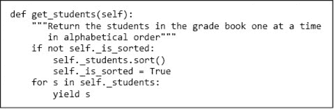

图 10-9 `get_students`的新版本

在使用生成器的`for`循环的第一次迭代开始时，生成器被调用并运行，直到第一次执行`yield`语句，此时返回`yield`语句中表达式的值。在下一次迭代中，生成器立即在`yield`后恢复执行，所有局部变量绑定到`yield`语句执行时绑定的对象，再次运行直到执行`yield`语句。它会继续这样做，直到没有代码可执行或执行`return`语句，此时循环退出。⁶³

图 10-9 中的`get_students`版本允许程序员使用`for`循环以与内置类型如`list`相同的方式迭代`Grades`类型对象中的学生。例如，代码

```py
book = Grades()
book.add_student(Grad('Julie'))
book.add_student(Grad('Lisa'))
for s in book.get_students():
    print(s)
```

打印

```py
Julie
Lisa
```

因此，图 10-7 中的循环以

```py
`for s in course.get_students():`
```

不需要修改以利用包含新实现的`get_students`的`Grades`类版本。（当然，依赖于`get_students`返回列表的大多数代码将不再有效。）相同的`for`循环可以迭代`get_students`提供的值，无论`get_students`是返回一个值的列表还是一次生成一个值。一次生成一个值将更有效，因为不会创建包含学生的新列表。

**指尖练习：** 向`Grades`添加一个满足规范的生成器

```py
def get_students_above(self, grade):
    """Return the students a mean grade > g one at a time"""
```

## 10.4 扩展示例

2008 年秋季，美国房地产价格崩溃帮助引发了一场国际经济危机。其中一个原因是，太多房主承担了最终带来意想不到后果的抵押贷款。⁶⁴

一开始，抵押贷款相对简单。买家从银行借款，并在抵押贷款的整个生命周期内每月支付固定金额，通常为 15 到 30 年。在这段时间结束时，银行收回了初始贷款（本金）加上利息，房主就“完全拥有”了房子。

到二十世纪末，抵押贷款变得更加复杂。人们可以通过在接受抵押贷款时向贷款人支付“点数”来获得更低的利率。一个点是贷款价值的`1%`的现金支付。人们可以选择在一段时间内仅支付“利息”的抵押贷款。也就是说，在贷款开始的几个月内，借款人仅支付累计的利息，而不支付本金。其他贷款涉及多种利率。通常，最初的利率（称为“诱饵利率”）较低，随后随着时间的推移而上升。这些贷款通常是浮动利率的——在初始期限后要支付的利率将根据某种旨在反映贷款人在批发信贷市场借款成本的指数而变化。

原则上，为消费者提供多种选择是一件好事。然而，不负责任的贷款提供者并不总是小心地充分解释各种选择的潜在长期影响，某些借款人做出了证明后果严重的选择。

让我们构建一个程序，检查三种抵押贷款的成本：

+   一种没有点数的固定利率抵押贷款

+   固定利率抵押贷款和点数

+   一种初始诱饵利率，随后在持续期间为更高利率的抵押贷款

本次练习的目的是提供一些有关一组相关类增量开发的经验，而不是让你成为抵押贷款专家。

我们将结构化我们的代码，以包含一个`Mortgage`类及其对应于上述三种抵押贷款类型的子类。图 10-10 包含**抽象类**`Mortgage`。该类包含每个子类共享的方法，但不打算直接实例化。也就是说，不会创建类型为`Mortgage`的对象。

图形顶部的`find_payment`函数计算需要在贷款到期时偿还贷款所需的固定月供，包括利息。它使用一个众所周知的封闭形式表达式来实现这一点。这个表达式并不难推导，但查找它要容易得多，也更可能是正确的，而不是现场推导出来的。

然而，请记住，并非你在网络上（甚至教科书中）发现的所有信息都是正确的。当你的代码包含你查找的公式时，请确保：

+   你已从可信来源获取公式。我们查看了多个可信来源，它们都包含等效的公式。

+   你完全理解公式中所有变量的含义。

+   你将你的实现与来自可信来源的示例进行测试。在实现此功能后，我们通过将我们的结果与网络上可用计算器提供的结果进行比较来进行测试。

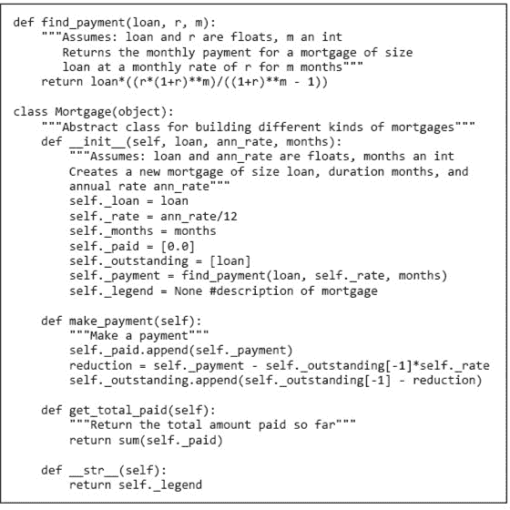

图 10-10 `Mortgage`基类

观察 `__init__`，我们看到所有 `Mortgage` 实例将具有与初始贷款金额、月利率、贷款期限（以月为单位）、每月初已支付的付款列表（该列表以 `0` 开头，因为在第一个月初尚未支付任何款项）、每月初未偿贷款余额的列表、每月需支付的金额（使用函数 `find_payment` 返回的值初始化）以及抵押贷款描述（初始值为 `None`）相对应的实例变量。每个 `Mortgage` 子类的 `__init__` 操作预计会首先调用 `Mortgage.__init__`，然后将 `self._legend` 初始化为该子类的适当描述。

方法 `make_payment` 用于记录抵押贷款支付。每次支付的一部分覆盖了未偿贷款余额的利息，剩余部分用于减少贷款余额。这就是 `make_payment` 更新 `self.paid` 和 `self.outstanding` 的原因。

方法 `get_total_paid` 使用内置的 Python 函数 `sum`，该函数返回一系列数字的总和。如果序列中包含非数字，则会引发异常。

图 10-11 包含实现三种类型抵押贷款的类。类 `Fixed` 和 `Fixed_with_pts` 重写 `__init__` 并从 `Mortgage` 继承其他三种方法。类 `Two_rate` 将抵押贷款视为两个不同利率贷款的串联。（由于 `self.paid` 初始化为包含一个元素的列表，因此它包含的元素比已支付的款项多一个。这就是方法 `make_payment` 将 `len(self.paid)` 与 `self.teaser_months + 1` 进行比较的原因。）

图 10-11 还包含一个计算并打印每种抵押贷款总成本的函数，基于一组示例参数。它首先创建每种类型的一份抵押贷款。然后，对每一份抵押贷款在给定的年份内进行每月支付。最后，打印每笔贷款的支付总额。

我们现在终于准备好比较不同的抵押贷款了：

```py
compare_mortgages(amt=200000, years=30, fixed_rate=0.035,
                  pts = 2, pts_rate=0.03, var_rate1=0.03,
                  var_rate2=0.05, var_months=60)
```

注意，在调用 `compare_mortgages` 时，我们使用了关键字参数而非位置参数。这样做是因为 `compare_mortgages` 有大量相同类型的形式参数，使用关键字参数可以更容易地确保我们为每个形式参数提供了预期的实际值。

当代码运行时，它会打印

```py
Fixed, 3.5%
 Total payments = $323,312
Fixed, 3.0%, 2 points
 Total payments = $307,555
3.0% for 60 months, then 5.0%
 Total payments = $362,435
```

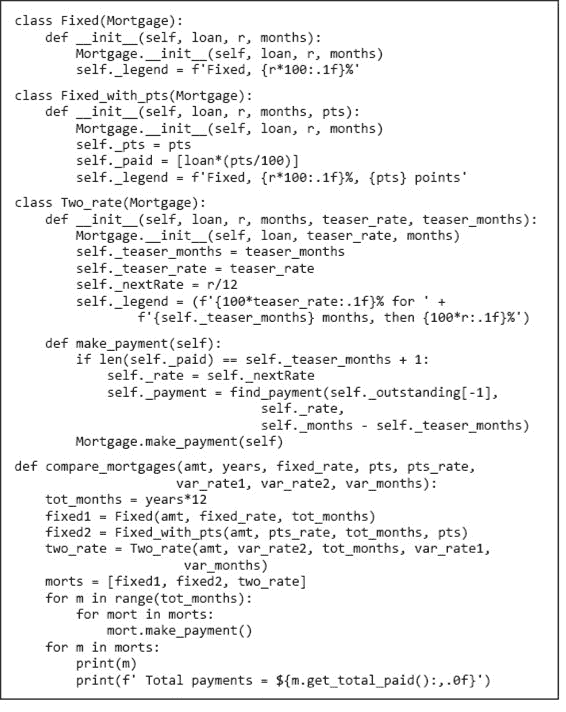

图 10-11 抵押贷款子类

初看结果似乎相当明确。可变利率贷款对借款人（而非贷款人）来说是个坏主意，而带点的固定利率贷款则是成本最低的。然而，需要注意的是，总成本并不是评估抵押贷款的唯一标准。例如，预计未来收入会更高的借款人可能愿意在后期支付更多，以减轻初期还款的负担。

这表明，与其看一个单一的数字，不如观察随时间变化的付款情况。这反过来又表明，我们的程序应该生成旨在展示抵押贷款随时间变化的图表。我们将在第 13.2 节中进行讨论。

## 10.5 章节中引入的术语

+   面向对象编程

+   抽象数据类型

+   接口

+   抽象屏障

+   分解

+   抽象

+   类

+   类定义

+   方法属性

+   类属性

+   类实例

+   属性引用

+   __ 方法

+   魔法（双下划线）方法

+   数据属性

+   类变量

+   实例变量

+   类定义

+   表示不变式

+   继承

+   子类

+   超类

+   方法重写

+   isinstance

+   替代原则

+   封装

+   信息隐藏

+   私有

+   生成器

+   抽象类
