# 第十三章：绘图及类的更多信息

通常，文本是传达信息的最佳方式，但有时有一句中国谚语非常真实：“图片的意义可以表达近万字”。然而，大多数程序依赖文本输出与用户交流。为什么？因为在许多编程语言中，呈现视觉数据太难。幸运的是，在 Python 中这很简单。

## 13.1 使用 Matplotlib 绘图

**Matplotlib**是一个 Python 库模块，提供类似于 MATLAB 的**绘图**功能，“MATLAB 是一个用于算法开发、数据可视化、数据分析和数值计算的高级技术计算语言和交互式环境。” ⁸⁰ 在本书后面我们将看看其他提供 MATLAB 类似功能的 Python 库。在这一章中，我们专注于一些简单的数据绘图方式。关于 Matplotlib 绘图功能的完整用户指南可以在网站上找到。

```py
`[plt.sourceforge.net/users/index.html](http://plt.sourceforge.net/users/index.html)`
```

我们不会在这里尝试提供用户指南或完整的教程。相反，在这一章中，我们仅提供几个示例图并解释生成这些图的代码。我们将在后面的章节中介绍许多其他绘图功能。

让我们从一个简单的例子开始，使用`plt.plot`生成一个单一的图表。执行

```py
import matplotlib.pyplot as plt
plt.plot([1,2,3,4], [1,7,3,5]) #draw on current figure
```

将产生一个类似但不完全相同于图 13-1 的图表。你的图表可能会有一条彩色线。⁸¹ 此外，如果你使用大多数 Matplotlib 安装的默认参数设置运行此代码，线条的粗细可能不会像图 13-1 中的线条那么粗。我们使用了非标准的默认值来设置线宽和字体大小，以便图形在黑白打印时效果更佳。我们将在本节后面讨论如何做到这一点。

图表在你的显示器上出现的位置取决于你使用的 Python 环境。在用于生成本书本版的 Spyder 版本中，默认情况下，它出现在被称为“图表窗格”的地方。

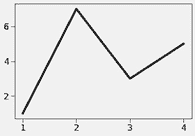

图 13-1 一个简单的图表

生成多个**图形**并将其写入文件是可能的。这些文件可以有你喜欢的任何名称。默认情况下，它们都将具有`.png`的文件扩展名，但你可以使用关键字参数`format`将其更改为其他格式（例如，`.jpg`）。

代码

```py
`plt.figure(1)                  #create figure 1 plt.plot([1,2,3,4], [1,2,3,4]) #draw on figure 1 plt.figure(2)                  #create figure 2 plt.plot([1,4,2,3], [5,6,7,8]) #draw on figure 2 plt.savefig('Figure-Addie')    #save figure 2 plt.figure(1)                  #go back to working on figure 1 plt.plot([5,6,10,3])           #draw again on figure 1 plt.savefig('Figure-Jane')     #save figure 1`
```

生成并保存到名为`Figure-Jane.png`和`Figure-Addie.png`的文件中的两个图表，见图 13-2。

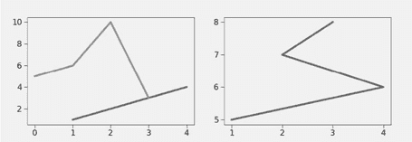

图 13-2 Figure-Jane.png（左）和 Figure-Addie.png（右）的内容

请注意，最后一次调用`plt.plot`仅传递了一个参数。该参数提供了`y`值。对应的`x`值默认为`range(len([5, 6, 10, 3]))`所生成的序列，这就是它们在此情况下从`0`到`3`的原因。

Matplotlib 有一个 **当前图形** 的概念。执行 `plt.figure(x)` 将当前图形设置为编号为 `x` 的图形。后续执行的绘图函数调用隐式引用该图形，直到再次调用 `plt.figure`。这解释了为什么写入文件 `Figure-Addie.png` 的图形是第二个创建的图形。

让我们看另一个例子。 图 13-3 左侧的代码生成了 图 13-4 左侧的图。

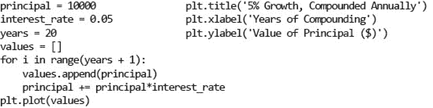

图 13-3 生成复合增长图

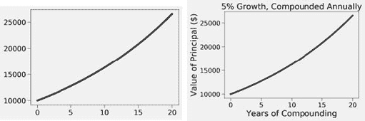

图 13-4 复合增长图

如果我们查看代码，可以推断出这是一个展示初始投资 `$10,000` 在每年复合利率 `5%` 下增长的图。然而，仅仅通过查看图形本身无法轻易推断出来。这是一个不好的地方。所有图形都应该有信息丰富的标题，所有轴都应该标记。如果我们在代码末尾添加 图 13-3 右侧的行，我们就能得到 图 13-4 右侧的图形。

对于每个绘制的曲线，有一个可选参数是格式字符串，指示图形的颜色和线型。格式字符串的字母和符号源于 MATLAB，并由一个颜色指示符后跟一个可选的线型指示符组成。默认格式字符串是 `'b-'`，表示生成一条实心蓝线。要用黑色圆圈绘制本金增长，将调用 `plt.plot(values)` 替换为 `plt.plot(values, 'ko')`，这会生成 图 13-5 中的图形。有关颜色和线型指示符的完整列表，请参见

```py
[`plt.org/api/pyplot_api.html#plt.pyplot.plot`](http://plt.org/api/pyplot_api.html#plt.pyplot.plot)
```

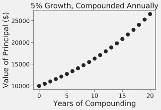

图 13-5 另一幅复合增长图

也可以更改绘图中使用的字体大小和线宽。这可以通过在单个函数调用中使用关键字参数来完成。例如，代码

```py
principal = 10000 #initial investment
interestRate = 0.05
years = 20
values = []
for i in range(years + 1):
    values.append(principal)
    principal += principal*interestRate
plt.plot(values, '-k', linewidth = 30)
plt.title('5% Growth, Compounded Annually',
            fontsize = 'xx-large')
plt.xlabel('Years of Compounding', fontsize = 'x-small')
plt.ylabel('Value of Principal ($)')
```

生成的图形在 图 13-6 中看起来故意奇怪。

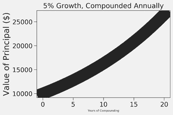

图 13-6 奇怪的图形

也可以更改默认值，这些值被称为“rc 设置”。（名称“rc”源于 Unix 中用于运行时配置文件的 `.rc` 文件扩展名。）这些值存储在一个字典样式的变量中，可以通过名称 `plt.rcParams` 访问。因此，例如，你可以通过执行代码将默认线宽设置为 6 个点⁸²。

```py
`plt.rcParams['lines.linewidth'] = 6`.
```

`rcParams` 设置的数量非常庞大。完整列表可以在这里找到

```py
[`plt.org/users/customizing.html`](http://plt.org/users/customizing.html)
```

如果你不想担心自定义单个参数，可以使用预定义的样式表。相关描述可以在这里找到

```py
`[`plt.org/users/style_sheets.html#style-sheets`](http://plt.org/users/style_sheets.html#style-sheets)`
```

本书中大多数剩余示例使用的值是通过以下代码设置的

```py
#set line width
plt.rcParams['lines.linewidth'] = 4
#set font size for titles 
plt.rcParams['axes.titlesize'] = 20
#set font size for labels on axes
plt.rcParams['axes.labelsize'] = 20
#set size of numbers on x-axis
plt.rcParams['xtick.labelsize'] = 16
#set size of numbers on y-axis
plt.rcParams['ytick.labelsize'] = 16
#set size of ticks on x-axis
plt.rcParams['xtick.major.size'] = 7
#set size of ticks on y-axis
plt.rcParams['ytick.major.size'] = 7
#set size of markers, e.g., circles representing points
plt.rcParams['lines.markersize'] = 10
#set number of times marker is shown when displaying legend
plt.rcParams['legend.numpoints'] = 1 
#Set size of type in legend
plt.rcParams['legend.fontsize'] = 14
```

如果你在彩色显示器上查看图表，就很少有理由更改默认设置。我们定制了设置，以便在将图表缩小以适应页面并转换为灰度时，更容易阅读图表。

## 13.2 绘制抵押贷款，扩展示例

在第十章中，我们通过一个抵押贷款的层次结构来说明子类化的使用。我们通过观察“我们的程序应该生成旨在显示抵押贷款随时间变化的图表”来结束这一章。图 13-7 通过添加方便生成这些图表的方法来增强类 `Mortgage`。（图 10-10 中的函数 `find_payment` 在第 10.4 节中讨论。）

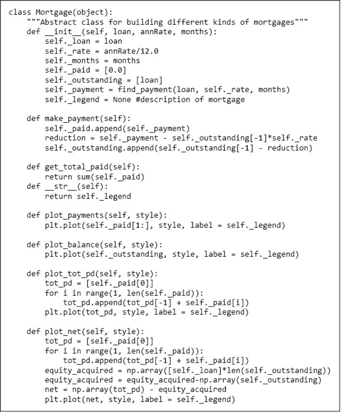

图 13-7 类 `Mortgage` 及其绘图方法

类 `Mortgage` 中的非平凡方法是 `plot_tot_paid` 和 `plot_net`。方法 `plot_tot_paid` 绘制已支付款项的累计总额。方法 `plot_net` 绘制通过减去偿还部分贷款所获得的权益而得到的抵押贷款总成本的近似值。⁸³

在函数 `plot_net` 中，表达式 `np.array(self.outstanding)` 执行类型转换。到目前为止，我们一直使用 `list` 类型的参数调用 Matplotlib 的绘图函数。在后台，Matplotlib 已将这些列表转换为另一种类型 `**array**`，这是 `numpy` 模块的一部分。导入 `import numpy as np` 和调用 `np.array` 使这一点明确。

`**Numpy**` 是一个提供科学计算工具的 Python 模块。除了提供多维数组外，它还提供各种数学功能。本书后面会有更多关于 `numpy` 的内容。

有许多方便的方式来操作数组，这些方法在列表中并不容易实现。特别是，可以使用数组和算术运算符形成表达式。在 `numpy` 中创建数组有多种方式，但最常见的方法是先创建一个列表，然后转换它。考虑以下代码

```py
`import numpy as np`
`a1 = np.array([1, 2, 4]) print('a1 =', a1) a2 = a1*2 print('a2 =', a2) print('a1 + 3 =', a1 + 3) print('3 - a1 =', 3 - a1) print('a1 - a2 =', a1 - a2) print('a1*a2 =', a1*a2)`
```

表达式 `a1*2` 将 `a1` 的每个元素乘以常数 `2`。表达式 `a1 + 3` 将整数 `3` 加到 `a1` 的每个元素上。表达式 `a1 ‑ a2` 从 `a1` 的相应元素中减去 `a2` 的每个元素（如果数组长度不同，会发生错误）。表达式 `a1*a2` 将 `a1` 的每个元素与 `a2` 的相应元素相乘。当上述代码运行时，它打印

```py
a1 = [1 2 4]
a2 = [2 4 8]
a1 + 3 = [4 5 7]
3 - a1 = [ 2  1 -1]
a1 - a2 = [-1 -2 -4]
a1*a2 = [ 2  8 32]
```

图 13-8 重复了图 10-11 中 `Mortgage` 的三个子类。每个子类都有一个独特的 `__init__` 方法，覆盖了 `Mortgage` 中的 `__init__` 方法。子类 `Two_rate` 也覆盖了 `Mortgage` 的 `make_payment` 方法。

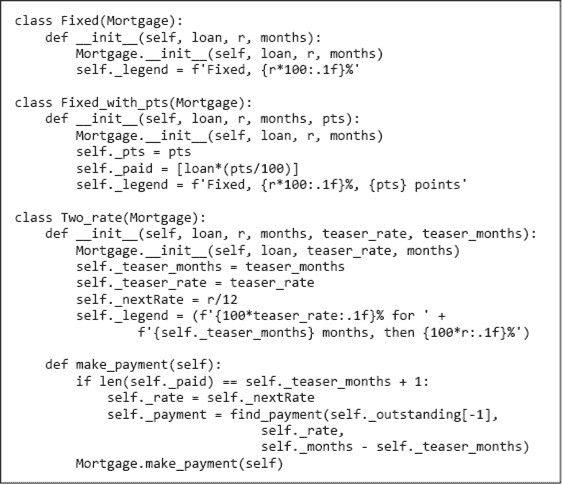

图 13-8 `Mortgage`的子类

图 13-9 和图 13-10 包含可以用于生成旨在提供有关不同类型抵押贷款洞见的图表的函数。

函数`compare_mortgages`，图 13-9，创建不同类型抵押贷款的列表，并模拟对每种贷款进行一系列付款。然后调用`plot_mortgages`，图 13-10，以生成图表。

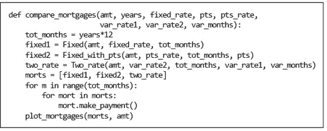

图 13-9 比较抵押贷款

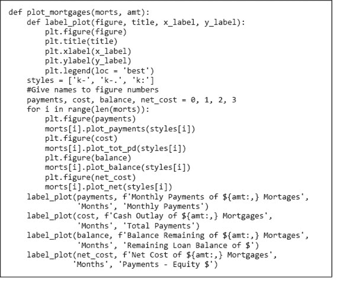

图 13-10 生成抵押贷款图表

图 13-10 中的函数`plot_mortgages`使用`Mortgage`中的绘图方法生成包含三种不同类型抵押贷款信息的图表。`plot_mortgages`中的循环使用索引`i`从列表`morts`和`styles`中选择元素，以确保在图形中以一致的方式表示不同类型的抵押贷款。例如，由于`morts`中的第三个元素是可变利率抵押贷款，`styles`中的第三个元素是`'k:'`，因此可变利率抵押贷款总是使用黑色虚线绘制。局部函数`label_plot`用于为每个图表生成适当的标题和轴标签。`plt.figure`的调用确保标题和标签与相应的图表相关联。

调用

```py
`compare_mortgages(amt=200000, years=30, fixed_rate=0.07,                  pts = 3.25, pts_rate=0.05, var_rate1=0.045,                  var_rate2=0.095, var_months=48)`
```

生成的图表（图 13-11 到 13-13）比较三种类型的抵押贷款。

图 13-11 中显示的图表是通过调用`plot_payments`生成的，它简单地将每种抵押贷款的每期付款与时间进行绘制。包含图例的框出现的位置是由于在调用`plt.legend`时提供给关键字参数`loc`的值。当`loc`绑定到`'best'`时，位置会自动选择。该图表清楚地显示了每月付款如何随时间变化（或不变化），但对每种抵押贷款的相对成本没有太多启示。

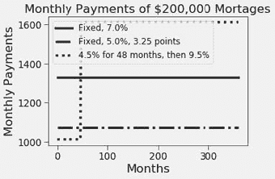

图 13-11 不同类型抵押贷款的每月付款

图 13-12 中的图表是通过调用`plot_tot_pd`生成的。它通过绘制每月开始时已产生的累计成本来比较每种抵押贷款的成本。

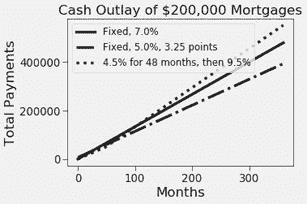

图 13-12 不同类型抵押贷款的时间成本

图 13-13 中的图表显示了剩余债务（左侧）和持有抵押贷款的总净成本（右侧）。

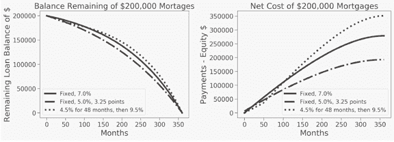

图 13-13 不同类型抵押贷款的剩余余额和净成本

## 13.3 传染病的交互式图表

当我对这本书进行最后润色时，我正在家中遵循与限制 Covid-19 疾病传播相关的“社交距离”限制。像许多呼吸道病毒一样，SARS-CoV-2 病毒主要通过人与人之间的接触传播。社交距离旨在减少人类之间的接触，从而限制由病毒引起的疾病传播。

图 13-14 包含对传染病发生率随时间变化的简单模拟。参数`fixed`是一个字典，定义了与感染传播相关的关键变量的初始值。参数`variable`是一个字典，定义了与社交距离相关的变量。稍后我们将展示如何在交互式图中改变`variable`的值。

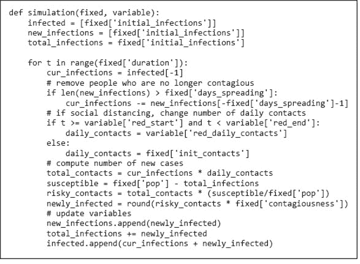

图 13-14 传染病传播的模拟

在书的后面部分，我们详细讨论了模拟模型。然而，在这里，我们关注的是交互式绘图，模拟的目的是为我们提供一些有趣的绘图内容。如果你不理解模拟的细节，那也没关系。

图 13-15 包含一个生成静态图的函数，该图显示了每一天的感染人数。它还包含一个**文本框**，显示感染总人数。以`txt_box = plt.text`开头的语句指示 Python 在由`plt.text`的前两个参数指定的位置开始绘制由第三个参数指定的文本。表达式`plt.xlim()[1]/2`将文本的左边缘放置在 x 轴左端（该图的 0）和 x 轴右端之间的中间位置。表达式`plt.ylim()[1]/1.25`将文本放置在 y 轴底部（该图的 0）到 y 轴顶部之间的 80%处。

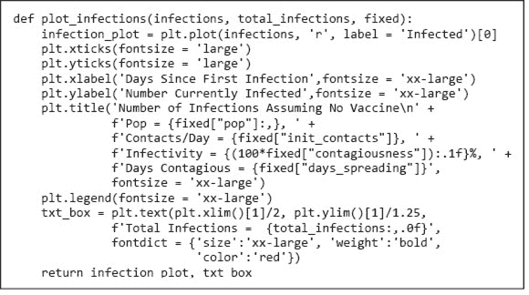

图 13-15 绘制感染历史的函数

图 13-16 使用图 13-14 和图 13-15 中的函数生成一个图图 13-17，显示感染人数——假设没有社交距离。`fixed`中的值并不基于特定的疾病。然而，假设一个人平均每天与 50 人“接触”可能会让人感到惊讶。不过，请记住，这个数字包括间接接触，例如，与感染者乘坐同一辆公交车或接触可能被感染者留下病原体的物体。

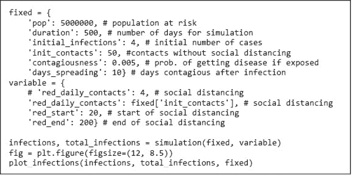

图 13-16 用一组参数生成图

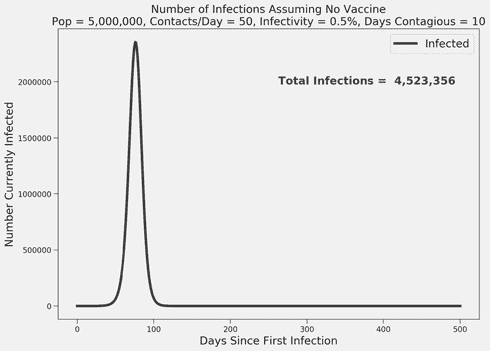

图 13-17 感染人数的静态图

图表显示当前感染人数的快速上升，随后迅速下降至零当前感染的稳定状态。这种快速增长发生是因为每个感染者会感染多个其他人，因此能够传播感染的人数呈指数增长。没有新感染的稳定状态是因为人口已经达到了**群体免疫**。当一个足够大比例的人口对一种疾病免疫时（假设从这种疾病中恢复的人不会再感染），就会有长时间没有人感染该疾病，这最终导致没有人再能传播它。⁸⁴ 如果我们想探索不同参数设置的影响，可以在`fixed`中改变一些变量的值，并生成另一个图表。然而，这是一种相当繁琐的方式来探索“如果……会怎样”的情境。相反，让我们生成一个包含**滑块**⁸⁵的图形，可以用来动态改变与社交距离相关的关键参数：`reduced_contacts_per_day`、`red_start`和`red_end`。

图形将有四个独立的组件：主图和每个字典`variable`元素的一个滑块。我们首先通过指定图形的整体尺寸（宽 12 英寸，高 8.5 英寸）、位置（以与文本框相同的方式指定）和每个组件的尺寸（相对于整个图形的大小）来描述图形的布局。我们还为每个组件绑定一个名称，以便后续引用。

```py
fig = plt.figure(figsize=(12, 8.5))
infections_ax = plt.axes([0.12, 0.2, 0.8, 0.65])
contacts_ax = plt.axes([0.25, 0.09, 0.65, 0.03])
start_ax = plt.axes([0.25, 0.06, 0.65, 0.03])
end_ax = plt.axes([0.25, 0.03, 0.65, 0.03]
```

接下来的代码行定义了三个滑块，每个滑块对应我们想要变化的一个值。首先，我们导入一个包含`Slider`类的模块。

```py
from Matplotlib.widgets import Slider
```

接下来，我们创建三个滑块，将每个滑块绑定到一个变量上。

```py
contacts_slider = Slider(
                      contacts_ax,  # axes object containing the slider
                      ‘reduced\ncontacts/day',  # name of slider
                      0,   # minimal value of the parameter
                      50,  # maximal value of the parameter
                      50)  # initial value of the parameter)
contacts_slider.label.set_fontsize(12)
start_day_slider = Slider(start_ax, ‘start reduction', 1, 30, 20)
start_day_slider.label.set_fontsize(12)
end_day_slider = Slider(end_ax, 'end reduction', 30, 400, 200)
end_day_slider.label.set_fontsize(12)
```

接下来，我们提供一个函数`update`，该函数根据滑块的当前值更新图表。

```py
def update(fixed, infection_plot, txt_box,
           contacts_slider, start_day_slider, end_day_slider):
    variable = {'red_daily_contacts': contacts_slider.val,
                ‘red_start': start_day_slider.val,
                ‘red_end': end_day_slider.val}
    I, total_infections = simulation(fixed, variable)
    infection_plot.set_ydata(I)   # new y-coordinates for plot
    txt_box.set_text(f'Total Infections =  {total_infections:,.0f}')
```

接下来，我们需要指示 Python 在滑块的值发生变化时调用`update`。这有点棘手。`Slider`类包含一个方法`on_changed`，它接受一个类型为`function`的参数，该参数在滑块变化时被调用。这个函数始终只接受一个参数，即表示滑块当前值的数字。然而，在我们的情况下，每次滑块改变时，我们希望使用所有三个滑块的值和字典`fixed`中的值运行模拟。

我们通过引入一个新的函数来解决这个问题，该函数是`on_changed`的合适参数。函数`slider_update`接受所需的数字参数，但并不使用它。相反，定义`slider_update`的 lambda 表达式捕获了与`fixed`、`infection_plot`、`txt_box`和三个滑块绑定的对象。然后，它使用这些参数调用`update`。

```py
slider_update = lambda _: update(fixed, infection_plot, txt_box,
                                 contacts_slider, start_day_slider,
                                 end_day_slider)
contacts_slider.on_changed(slider_update)
start_day_slider.on_changed(slider_update)
end_day_slider.on_changed(slider_update)
```

最后，我们绘制感染曲线，并在与`infections_ax`绑定的图形部分更新文本框。

```py
infections, total_infections = simulation(fixed, variable)
plt.axes(infections_ax)
infection_plot, txt_box = plot_infections(infections,
                                          total_infections, fixed)
```

当运行此代码时，它会生成图 13-18 中的图形。⁸⁶

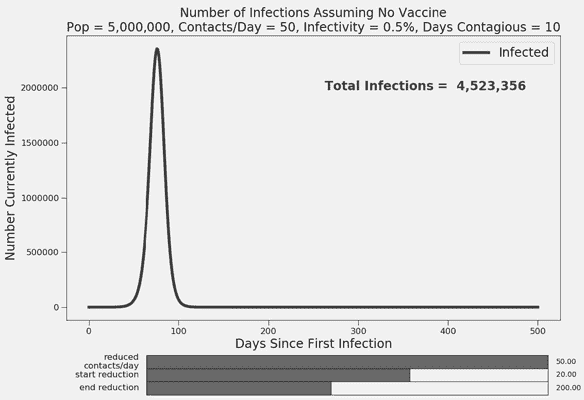

图 13-18 初始滑块值的交互式图

现在，我们可以轻松实验许多滑块值的组合，其中一个组合如图 13-19 所示。

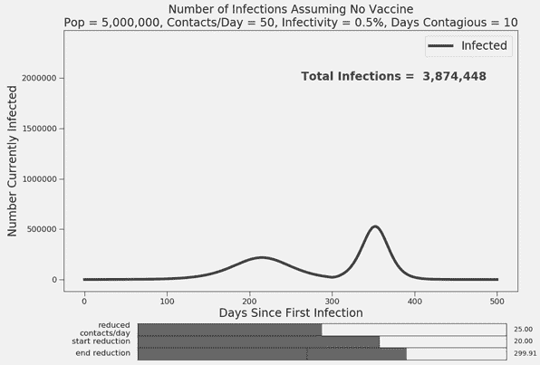

图 13-19 滑块值改变后的交互式图

图 13-19 显示，如果在 20 天后将接触次数减少到平均每天 25 次，并保持这个水平 40 周，则总感染人数会减少。更重要的是，感染的峰值数量（因此对医疗系统的最大负担）会显著降低。这通常被称为**扁平化曲线**。

## 13.4 章节中引入的术语

+   图形

+   Matplotlib

+   图

+   当前图形

+   rcParams

+   数组

+   numpy

+   交互式图

+   文本框

+   群体免疫

+   滑块

+   扁平化曲线
