# 第十四章：背包和图优化问题

优化问题的概念提供了一种结构化的方式来思考解决许多计算问题。每当你开始解决一个涉及寻找最大、最小、最多、最少、最快、最便宜等的问题时，很可能可以将该问题映射到一个经典的优化问题上，而这个问题有已知的计算解决方案。

一般来说，**优化问题**有两个部分：

+   一个需要最大化或最小化的**目标函数**。例如，波士顿和伊斯坦布尔之间的机票费用。

+   一组必须遵循的**约束条件**（可能为空）。例如，旅行时间的上限。

在本章中，我们引入了优化问题的概念并给出了一些例子。我们还提供了一些解决这些问题的简单算法。在第十五章中，我们讨论了一种有效解决重要类别优化问题的方法。

本章要点包括：

+   许多重要的问题可以用一种简单的方式表述，自然引导到计算解决方案。

+   将一个看似新颖的问题简化为一个已知问题的实例，可以让你利用现有的解决方案。

+   背包问题和图问题是可以将其他问题简化为的类别。

+   穷举枚举算法提供了一种简单但通常在计算上不可行的方式来寻找最佳解决方案。

+   贪婪算法通常是寻找一个相当不错但不总是最佳的优化问题解决方案的实用方法。

和往常一样，我们将用一些 Python 代码和编程技巧补充计算思维的材料。

## 14.1 背包问题

作为一个小偷并不容易。除了显而易见的问题（确保家中空无一人、撬锁、规避警报、处理伦理困境等），小偷还必须决定偷什么。问题在于，大多数家庭的有价值物品超出一般小偷能携带的数量。一个可怜的小偷该怎么办？他（或她）需要找到提供最大价值的物品集合，同时不超过他的携带能力。

假设，例如，一个小偷有一个最多能装`20`磅战利品的背包⁸⁷，他闯入一所房子，发现图 14-1 中的物品。显然，他无法将所有物品放入背包，因此他需要决定带走什么，留下什么。

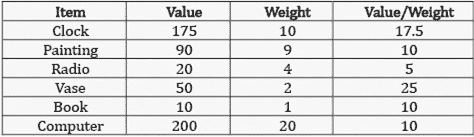

图 14-1 物品表

### 14.1.1 贪婪算法

找到这个问题的近似解的最简单方法是使用**贪心算法**。小偷会先选择最好的物品，然后是下一个最好的，持续进行直到他达到极限。当然，在这样做之前，小偷必须决定什么是“最好”。最好的物品是最有价值的，最轻的，还是可能是价值与重量比最高的物品？如果他选择最高价值，他将只拿走电脑，可以以`$200`变卖。如果他选择最低重量，他将依次拿走书、花瓶、收音机和画作，总价值为`$170`。最后，如果他决定最好的意味着价值与重量比最高，他将首先拿走花瓶和时钟。这将留下三个价值与重量比为`10`的物品，但其中只有书能放进背包。拿走书后，他将拿走仍能放进去的剩余物品，即收音机。他的战利品总价值将为`$255`。

尽管按密度贪心（价值与重量比）恰好为这个数据集提供了最佳结果，但没有保证贪心按密度算法总能找到比按重量或价值贪心算法更好的解决方案。更一般来说，任何通过贪心算法找到的这类背包问题的解决方案都不一定是最优的。⁸⁸我们稍后会更详细地讨论这个问题。

接下来三幅图中的代码实现了这三种贪心算法。在图 14-2 中，我们定义了类`Item`。每个`Item`都有一个`name`、`value`和`weight`属性。我们还定义了三个可以绑定到我们实现的`greedy`的参数`key_function`的函数；见图 14-3。

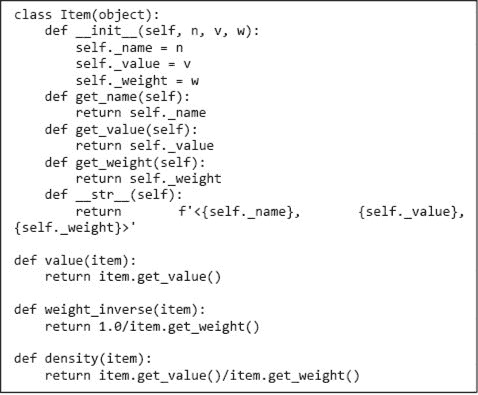

图 14-2 类`Item`

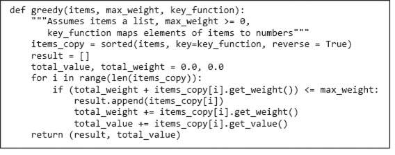

图 14-3 贪心算法的实现

通过引入参数`key_function`，我们使得`greedy`不再依赖于考虑列表元素的顺序。所需的只是`key_function`定义了`items`中元素的排序。然后，我们使用这个排序生成一个包含与`items`相同元素的排序列表。我们使用内置的 Python 函数`sorted`来实现这一点。（我们使用`sorted`而不是`sort`，因为我们希望生成一个新列表，而不是改变传入函数的列表。）我们使用`reverse`参数来表示我们希望列表从最大（根据`key_function`）排序到最小。

`greedy`的算法效率如何？需要考虑两件事：内置函数`sorted`的时间复杂度，以及在`greedy`主体中`for`循环的执行次数。循环的迭代次数受限于`items`中的元素数量，即为*θ*`(n)`，其中`n`是`items`的长度。然而，Python 内置排序函数的最坏情况时间大致为*θ*`(n log n)`，其中`n`是待排序列表的长度。⁸⁹因此，greedy 的运行时间为*θ*`(n log n)`。

图 14-4 中的代码构建了一项列表，然后使用不同的排序方式测试函数`greedy`。

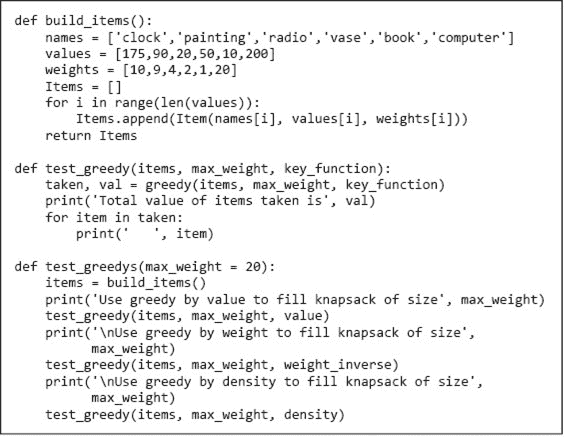

图 14-4 使用贪心算法选择项目

当执行`test_greedys()`时，它会打印

```py
Use greedy by value to fill knapsack of size 20
Total value of items taken is 200.0
    <computer, 200, 20>
Use greedy by weight to fill knapsack of size 20
Total value of items taken is 170.0
    <book, 10, 1>
    <vase, 50, 2>
    <radio, 20, 4>
    <painting, 90, 9>
Use greedy by density to fill knapsack of size 20
Total value of items taken is 255.0
    <vase, 50, 2>
    <clock, 175, 10>
    <book, 10, 1>
    <radio, 20, 4>
```

### 14.1.2  0/1 背包问题的最优解决方案

假设我们决定近似解不够好，即我们希望这个问题的最佳可能解决方案。这样的解决方案称为**最优**，这并不奇怪，因为我们正在解决一个优化问题。恰好，我们的盗贼面临的问题是经典优化问题的一个实例，称为**0/1 背包问题**。0/1 背包问题可以形式化如下：

+   每个项目由一对表示，<`*value, weight*`>。

+   背包可以容纳总重量不超过`w`的项目。

+   长度为 n 的向量 I 表示可用项目的集合。向量的每个元素都是一个项目。

+   长度为 n 的向量 V 用于指示每个项目是否被盗贼拿走。如果 V[i] = 1，则项目 I[i]被拿走。如果 V[i] = 0，则项目 I[i]未被拿走。

+   找到一个最大化的 V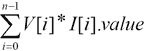

    受限于以下约束条件

    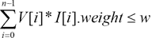

让我们看看如果尝试以直接方式实现此问题的公式会发生什么：

1.  1\. 列举所有可能的项目组合。也就是说，生成项目集的所有子集。⁹⁰这称为幂集，已在第十一章讨论过。

1.  2\. 移除所有重量超过允许重量的组合。

1.  3\. 从剩余组合中选择一个价值最大的组合。

这种方法肯定能找到一个**最佳**答案。然而，如果原始项目集很大，运行将需要很长时间，因为正如我们在第 11.3.6 节看到的，子集的数量随着项目数量的增加而迅速增长。

图 14-5 包含了这种暴力解决 0/1 背包问题的直接实现。它使用了在图 14-2、图 14-3、图 14-4 中定义的类和函数，以及在图 11-6 中定义的函数`gen_powerset`。

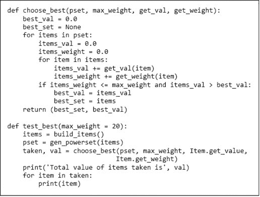

图 14-5 暴力求解 0/1 背包问题的最优解

这个实现的复杂度是*θ*`(n`*`2`^n`)`，其中`n`是`items`的长度。函数`gen_powerset`返回一个包含`Item`的列表的列表。这个列表的长度为`2`^n，其中最长的列表的长度为`n`。因此，`choose_best`中的外部循环将执行*θ*`(2`^n`)`次，内部循环的执行次数由`n`限制。

许多小的优化可以应用于加速这个程序。例如，`gen_powerset`可以有如下头部

```py
def `gen_powerset`(`item`s, con`str`aint, get_val, get_weight)
```

并且只返回那些符合重量约束的组合。或者，`choose_best`可以在超过重量约束时立即退出内部循环。虽然这些类型的优化通常是值得做的，但它们并没有解决根本问题。`choose_best`的复杂度仍然是*θ*`(n`*`2`^n`)`，因此当`items`很大时，`choose_best`仍然会运行很长时间。

从理论上讲，这个问题是绝望的。0/1 背包问题在物品数量上本质上是指数级的。然而，从实践的角度来看，这个问题远非绝望，正如我们将在 15.2 节中讨论的那样。

当运行`test_best`时，它会打印

```py
Total value of items taken is 275.0
<clock, 175, 10>
<painting, 90, 9>
<book, 10, 1>
```

注意，这个解决方案找到了总价值高于贪心算法找到的任何解决方案的物品组合。贪心算法的本质是在每一步做出最佳（由某种标准定义的）局部选择。它做出了一个**局部最优**的选择。然而，正如这个例子所示，一系列局部最优的决策并不总是会导致一个**全局最优**的解决方案。

尽管贪心算法并不总是找到最佳解决方案，但它们在实践中经常被使用。通常情况下，它们比保证找到最优解的算法更容易实现且更高效。正如伊万·博斯基曾经说过的：“我认为贪婪是健康的。你可以贪婪，但仍然对自己感觉良好。” ⁹¹

对于一个称为**分数**（或**连续**）**背包问题**的背包问题变体，贪心算法可以保证找到一个最优解。由于这个变体中的物品可以无限分割，因此总是选择尽可能多的具有最高剩余价值与重量比的物品是有意义的。假设，例如，我们的窃贼在房子里只发现了三样有价值的东西：一袋金粉、一袋银粉和一袋葡萄干。在这种情况下，贪婪密度算法将始终找到最优解。

## 14.2 图优化问题

让我们考虑另一种优化问题。假设你有一份美国各城市之间所有航空航班价格的清单。假设对于所有城市 `A, B,` 和 `C`，从 `A` 经 `B` 飞往 `C` 的费用是从 `A` 飞往 `B` 的费用加上从 `B` 飞往 `C` 的费用。你可能会想问的几个问题是：

+   两个城市之间的最少停留次数是多少？

+   两个城市之间的最低机票价格是多少？

+   在不超过两次停留的情况下，两个城市之间的最低机票价格是多少？

+   访问某些城市集合的最低费用是什么？

所有这些问题（以及其他许多问题）都可以很容易地形式化为图问题。

**图**⁹²是由称为 **节点**（或 **顶点**）的对象构成的一组对象，这些对象通过一组 **边**（或 **弧**）连接。如果边是单向的，则该图称为 **有向图** 或 **有向图**。在有向图中，如果存在一条从 *n*1 到 *n*2 的边，我们称 *n*1 为 **源节点** 或 **父节点**，而 *n*2 为 **目标节点** 或 **子节点**。

如果存在一系列边 < *e*[0], … , *e[n]* >，使得 *e*[0] 的起点是 *n*1，*e[n]* 的终点是 *n*2，并且在序列中所有边 *e*[1] 到 *e[n]* 的起点是 *e*[i]* 的终点 *e*[i][−1]，那么称图中包含 **路径** 从 *n*1 到 *n*2。一个从节点到自身的路径称为 **循环**。包含循环的图称为 **有向图**，而不包含循环的图称为 **无向图**。

图通常用于表示各部分之间存在有趣关系的情况。图在数学中首次被记录的使用是在 1735 年，当时瑞士数学家莱昂哈德·欧拉使用了后来被称为 **图论** 的方法来制定和解决 **柯尼斯堡桥问题**。

柯尼斯堡，当时是东普鲁士的首都，建于两条河流的交汇处，河流中有多个岛屿。岛屿通过七座桥相互连接，并与大陆相连，如 图 14-6 左侧的地图所示。出于某种原因，市民们对是否能进行一次恰好经过每座桥一次的散步这个问题产生了浓厚的兴趣。

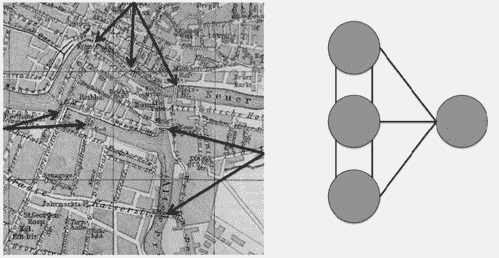

图 14-6 左侧是柯尼斯堡的桥，右侧是欧拉简化后的地图

欧拉的伟大见解在于，通过将每个独立的陆地块视为一个点（想想“节点”），每座桥视为连接这两个点的线（想想“边”），可以大大简化问题。镇的地图可以用右侧的无向图表示，如图 14-6 所示。欧拉推理，如果一次走遍每条边，走的过程中每个节点（即在行走过程中被进入和退出的任何岛屿）必须由偶数条边连接。由于这个图中的节点没有偶数条边，欧拉得出结论，不可能每座桥恰好走一次。

比起柯尼斯堡桥问题，甚至比欧拉定理（它将欧拉对柯尼斯堡桥问题的解决方案进行了推广）更有趣的是，使用图论来帮助理解问题的整个想法。

例如，仅需要对欧拉使用的那种图形进行一个小的扩展，就可以建模一个国家的高速公路系统。如果图（或有向图）中的每条边都有一个权重，则称之为**加权图**。使用加权图，高速公路系统可以表示为一个图，其中城市由节点表示，连接它们的高速公路作为边，每条边标记为两个节点之间的距离。更一般来说，我们可以通过加权有向图表示任何道路地图（包括单行街道的地图）。

同样，万维网的结构可以表示为一个有向图，其中节点是网页，只有在页面*A*上有指向页面*B*的链接时，节点*A*到节点*B*之间才会有一条边。流量模式可以通过为每条边添加一个权重来建模，以指示使用频率。

图形还有许多不太明显的用途。生物学家使用图来建模从蛋白质相互作用到基因表达网络的各种现象。物理学家使用图来描述相变。流行病学家使用图来建模疾病轨迹，等等。

图 14-7 包含实现与节点、加权边和边对应的抽象类型的类。


图 14-7 节点和边

拥有一个节点类可能看起来有些多余。毕竟，`Node`类中的任何方法都没有执行任何有趣的计算。我们引入这个类只是为了给我们灵活性，以便在某些时刻决定引入一个具有附加属性的`Node`子类。

图 14-8 包含`Digraph`和`Graph`类的实现。

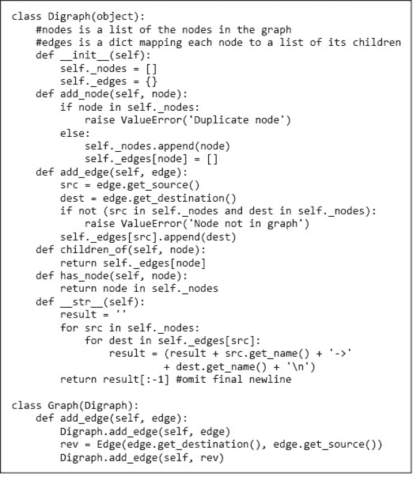

图 14-8 类`Graph`和`Digraph`

一个重要的决定是用于表示`Digraph`的数据结构选择。一个常见的表示方式是`n × n` **邻接矩阵**，其中`n`是图中节点的数量。矩阵的每个单元格包含关于连接节点对`<*i*, *j*>`的边的信息（例如，权重）。如果边是无权的，则只有在存在从*i*到*j*的边时，每个条目为`True`。

另一种常见的表示方式是**邻接表**，我们在这里使用。类`Digraph`有两个实例变量。变量`nodes`是一个包含`Digraph`中节点名称的 Python 列表。节点的连通性使用实现为字典的邻接表表示。变量`edges`是一个字典，将`Digraph`中的每个`Node`映射到该`Node`的子节点列表。

类`Graph`是`Digraph`的子类。它继承了`Digraph`的所有方法，除了重写的`add_edge`方法。（这并不是实现`Graph`的最节省空间的方式，因为它每条边存储了两次，一次用于`Digraph`的每个方向。但它的优点在于简单。）

你可能想停下来思考一下，为什么`Graph`是`Digraph`的子类，而不是反过来。在我们观察的许多子类化示例中，子类为超类添加了属性。例如，类`Weighted_edge`向类`Edge`添加了一个`weight`属性。

在这里，`Digraph`和`Graph`具有相同的属性。唯一的区别是`add_edge`方法的实现。任一类都可以通过继承另一类的方法轻松实现，但选择哪个作为超类并不是任意的。在第十章中，我们强调了遵循替代原则的重要性：如果客户端代码使用超类的实例正常工作，那么当用子类的实例替代超类的实例时，它也应正常工作。

确实，如果客户端代码使用`Digraph`的实例工作正常，那么如果用`Graph`的实例替代`Digraph`的实例，它也会正常工作。反之则不然。有许多算法适用于图（通过利用边的对称性），而这些算法在有向图上并不适用。

### 14.2.1 一些经典的图论问题

使用图论来制定问题的一个好处是，有众所周知的算法可以解决许多图上的优化问题。一些最著名的图优化问题包括：

+   **最短路径**。对于某一对节点*n*1 和*n*2，找到边的最短序列`<*s[n], d[n]*>`（源节点和目标节点），使得

    +   ○ 第一条边中的源节点是*n*1。

    +   ○ 最后一条边的目标节点是*n*2。

    +   ○ 对于序列中的所有边*e*1 和*e*2，如果*e*2 在序列中跟随*e*1，则*e*2 的源节点是*e*1 的目标节点。

+   **最短加权路径**。这类似于最短路径，但我们不是选择连接两个节点的最短边序列，而是定义某个函数来计算序列中边的权重（例如，它们的总和），并最小化该值。这就是谷歌和苹果地图在计算两个点之间的驾驶路线时所解决的那种问题。

+   **最小割**。给定图中两个节点集，**割**是一组边，去除这些边会消除从一个集合中的每个节点到另一个集合中每个节点的所有路径。

+   **最大团**。**团**是一组节点，集合中的每对节点之间都有一条边。⁹³ 最大团是图中最大规模的团。最小割是去除这些边后能实现这一点的最小边集。

### 14.2.2 最短路径：深度优先搜索和广度优先搜索

社交网络由个体和个体之间的关系组成。这些通常被建模为图，其中个体为节点，边为关系。如果关系是对称的，边是无向的；如果关系是非对称的，边是有向的。一些社交网络建模多种类型的关系，在这种情况下，边上的标签指示关系的类型。

在 1990 年，剧作家约翰·古埃尔写了《六度分隔》。该剧的可疑前提是“这个星球上的每个人仅被其他六个人隔开。”他的意思是，如果我们利用“认识”的关系建立一个包含地球上每个人的社交网络，那么任何两个个体之间的最短路径至多会经过六个其他节点。

一个较少假设性的问题是，使用 Facebook 上“朋友”关系的两个人之间的距离。例如，你可能想知道你是否有一个朋友，他有一个朋友，而那个朋友是嘎嘎女士的朋友。让我们考虑设计一个程序来回答这样的问题。

朋友关系（至少在 Facebook 上）是对称的，例如，如果萨姆是安德烈亚的朋友，安德烈亚也是萨姆的朋友。因此，我们将使用类型为 `Graph` 的社交网络来实现。然后我们可以将寻找你与嘎嘎女士之间最短连接的问题定义为：

+   让 `*G*` 表示朋友关系的图。

+   对于 `*G*`，寻找最短节点序列，[你，…，嘎嘎女士]，使得

+   如果 *n[i]* 和 *n[i]*[+1] 是序列中的连续节点，则在 `G` 中有一条边连接 *n[i]* 和 *n[i]*[+1]。

图 14-9 包含一个递归函数，该函数找到 `Digraph` 中两个节点 `start` 和 `end` 之间的最短路径。由于 `Graph` 是 `Digraph` 的子类，因此它适用于我们的 Facebook 问题。

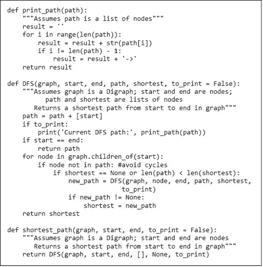

图 14-9 深度优先搜索最短路径算法

`DFS`实现的算法是递归**深度优先搜索（DFS）**算法的一个示例。一般来说，深度优先搜索算法通过选择起始节点的一个子节点开始。然后它选择该节点的一个子节点，依此类推，越来越深入，直到它达到目标节点或一个没有子节点的节点。然后搜索**回溯**，返回到最近的尚未访问的有子节点的节点。当所有路径都被探索完毕时，它选择从起点到目标的最短路径（假设存在这样一条路径）。

该代码比我们刚刚描述的算法更复杂，因为它必须处理图中包含循环的可能性。它还避免探索比已找到的最短路径更长的路径。

+   函数`shortest_path`以`path == []`（表示当前探索的路径为空）和`shortest == None`（表示尚未找到从`start`到`end`的路径）调用`DFS`。

+   `DFS`开始时选择`start`的一个子节点。然后它选择该节点的一个子节点，依此类推，直到到达节点`end`或一个没有未访问子节点的节点。

    +   ○ 检查`if node not in path`防止程序陷入循环。

    +   ○ 检查`if shortest == None or len(path) < len(shortest)`用于决定继续搜索该路径是否可能产生比当前找到的最佳路径更短的路径。

    +   ○ 如果是这样，`DFS`被递归调用。如果它找到一条到`end`的路径，其长度不超过目前为止找到的最佳路径，则更新`shortest`。

    +   ○ 当`path`中的最后一个节点没有子节点可供访问时，程序回溯到之前访问过的节点，并访问该节点的下一个子节点。

+   当从`start`到`end`的所有可能的最短路径都被探索后，函数返回。

图 14-10 包含一些代码，该代码运行图 14-9 中的代码。图 14-10 中的函数`test_SP`首先构建一个有向图，如图中所示，然后在节点 0 和节点 5 之间搜索最短路径。


图 14-10 测试深度优先搜索代码

当执行时，`test_SP`生成的输出是

```py
Current DFS path: 0
Current DFS path: 0->1
Current DFS path: 0->1->2
Current DFS path: 0->1->2->3
Current DFS path: 0->1->2->3->4
Current DFS path: 0->1->2->3->5
Current DFS path: 0->1->2->4
Current DFS path: 0->2
Current DFS path: 0->2->3
Current DFS path: 0->2->3->4
Current DFS path: 0->2->3->5
Current DFS path: 0->2->3->1
Current DFS path: 0->2->4
Shortest path found by DFS: 0->2->3->5
```

请注意，在探索路径`0->1->2->3->4`后，它回退到节点`3`并探索路径`0->1->2->3->5`。在将其保存为迄今为止的最短成功路径后，它回退到节点`2`并探索路径`0->1->2->4`。当到达该路径的尽头（节点`4`）时，它回退到节点`0`并调查从`0`到`2`的边开始的路径。依此类推。

在图 14-9 中实现的 DFS 算法找到边数最少的路径。如果边具有权重，它不一定找到最小化边权重和的路径。不过，它可以很容易地修改以实现此目的。

**手指练习：** 修改深度优先搜索算法以找到使权重总和最小的路径。假设所有权重都是正整数。

当然，除了深度优先搜索之外，还有其他遍历图的方法。另一种常见的方法是广度优先搜索（BFS）。广度优先遍历首先访问起始节点的所有子节点。如果其中没有一个是结束节点，则访问每个子节点的所有子节点，依此类推。与通常递归实现的深度优先搜索不同，广度优先搜索通常是迭代实现的。BFS 同时探索多条路径，每次迭代为每条路径添加一个节点。由于它以长度递增的顺序生成路径，第一次找到以目标节点为最后节点的路径保证边数最少。

图 14-11 包含使用广度优先搜索在有向图中找到最短路径的代码。变量`path_queue`用于存储当前正在探索的所有路径。每次迭代开始时，从`path_queue`中移除一条路径并将其分配给`tmp_path`。如果`tmp_path`的最后一个节点是`end`，则`tmp_path`是最短路径并被返回。否则，创建一组新路径，每条路径通过添加其子节点扩展`tmp_path`。这些新路径随后被添加到`path_queue`中。

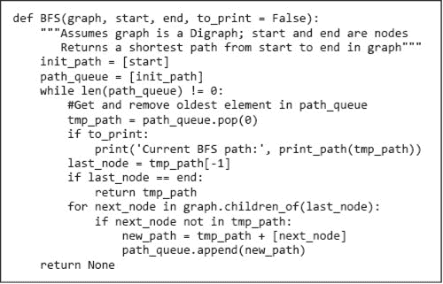

图 14-11 广度优先搜索最短路径算法

当这些线

```py
sp = BFS(g, nodes[0], nodes[5])
print('Shortest path found by BFS:', print_path(sp))
```

添加到`test_SP`末尾并执行函数时，它会打印附加行

```py
Current BFS path: 0
Current BFS path: 0->1
Current BFS path: 0->2
Current BFS path: 0->1->2
Current BFS path: 0->2->3
Current BFS path: 0->2->4
Current BFS path: 0->1->2->3
Current BFS path: 0->1->2->4
Current BFS path: 0->2->3->4
Current BFS path: 0->2->3->5
Shortest path found by BFS: 0->2->3->5
```

令人安心的是，每个算法找到的路径长度相同。在这种情况下，它们找到的是相同的路径。然而，如果图中存在多条最短路径，DFS 和 BFS 不一定找到相同的最短路径。

如上所述，广度优先搜索是一种方便的搜索路径的方式，因为第一次找到的路径保证是最少边数的路径。

**手指练习：** 考虑一个带权边的有向图。BFS 找到的第一条路径是否保证能够最小化边的权重总和？

## 14.3 本章引入的术语

+   优化问题

+   目标函数

+   约束集

+   背包问题

+   贪心算法

+   最优解

+   0/1 背包问题

+   局部最优

+   全局最优

+   连续背包问题

+   图

+   节点（顶点）

+   边（弧）

+   有向图（digraph）

+   源（父）节点

+   目标（子）节点

+   路径

+   循环

+   有环图

+   无环图

+   图论

+   带权图

+   邻接矩阵

+   邻接表

+   最短路径

+   最短带权路径

+   最小割

+   最大团

+   深度优先搜索（DFS）

+   回溯法

+   广度优先搜索（BFS）
