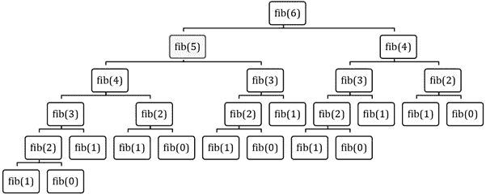
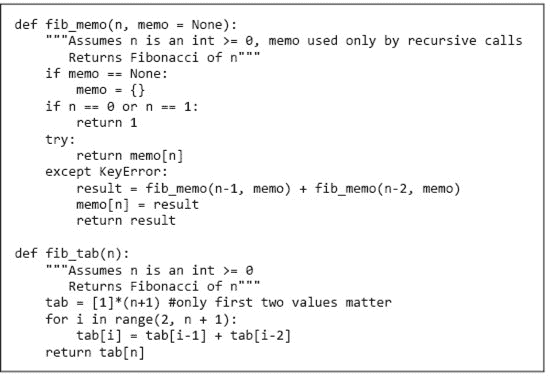
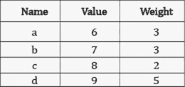
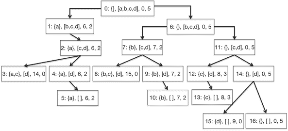
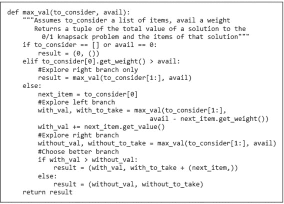
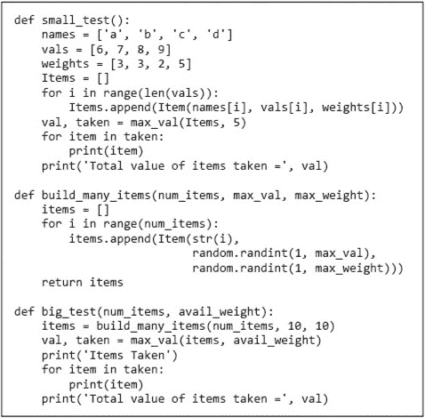
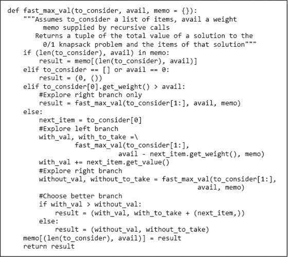

# 第十五章：动态规划

**动态规划**是理查德·贝尔曼在 1950 年代发明的。不要试图从其名称中推测任何关于该技术的内容。正如贝尔曼所描述的，名称“动态规划”被选择是为了掩盖政府赞助者“我实际上是在做数学… [动态规划这个短语]是连国会议员都无法反对的东西。” ⁹⁴

动态规划是一种高效解决具有重叠子问题和最优子结构特征的问题的方法。幸运的是，许多优化问题具有这些特征。

如果一个全局最优解可以通过结合局部子问题的最优解来找到，则该问题具有**最优子结构**。我们已经查看了许多此类问题。例如，归并排序利用了列表可以通过先排序子列表然后合并解决方案来进行排序这一事实。

如果一个问题的最优解涉及多次解决同一问题，则该问题具有**重叠子问题**。归并排序并不具备这个特性。尽管我们多次进行归并，但每次归并的列表都是不同的。

这并不是显而易见的，但 0/1 背包问题同时具备这两个特性。首先，我们稍作偏离，来看一个最优子结构和重叠子问题更加明显的问题。

## 15.1 重新审视斐波那契数列

在第四章中，我们查看了斐波那契函数的一个简单递归实现：

```py
def fib(n):
    """Assumes n is an int >= 0
       Returns Fibonacci of n"""
    if n == 0 or n == 1:
        return 1
    else:
        return fib(n-1) + fib(n-2)
```

尽管这个递归实现显然是正确的，但它非常低效。例如，尝试运行`fib(120)`，但不要等它完成。该实现的复杂度有点难以推导，但大致为`O(fib(n))`。也就是说，它的增长与结果值的增长成比例，而斐波那契序列的增长率是相当大的。例如，`fib(120)`是`8,670,007,398,507,948,658,051,921`。如果每个递归调用花费一纳秒，`fib(120)`将需要大约`250,000`年才能完成。

让我们试着找出为什么这个实现耗时如此之长。考虑到`fib`主体中的代码量很小，很明显问题在于`fib`调用自身的次数。例如，查看与调用`fib(6)`相关的调用树。



图 15-1 递归斐波那契的调用树

请注意，我们在反复计算相同的值。例如，`fib`被调用了三次，且每次调用都会引发四次额外的`fib`调用。想出一个好主意，即记录第一次调用返回的值，然后查找而不是每次都计算，并不需要天才。这是动态规划背后的关键思想。

动态规划有两种方法

+   **记忆化**从自顶向下解决原始问题。它从原始问题开始，将其分解为子问题，再将子问题分解为子问题，依此类推。每次解决一个子问题时，它都会将答案存储在表中。每次需要解决一个子问题时，它会首先尝试在表中查找答案。

+   **表格法**是一种自底向上的方法。它从最小的问题开始，并将这些问题的答案存储在表中。然后，它将这些问题的解决方案结合起来，以解决下一个最小的问题，并将这些答案存储在表中。

图 15-2 包含使用每种动态规划方法实现的斐波那契数列。函数 `fib_memo` 有一个参数 `memo`，用于跟踪它已经评估的数字。该参数有一个默认值，即空字典，因此 `fib_memo` 的客户不必担心提供 `memo` 的初始值。当 `fib_memo` 被调用时，若 `n > 1`，它会尝试在 `memo` 中查找 `n`。如果不存在（因为这是第一次以该值调用 `fib_memo`），则会引发异常。当这种情况发生时，`fib_memo` 使用正常的斐波那契递归，然后将结果存储在 `memo` 中。

函数 `fib_tab` 非常简单。它利用了所有斐波那契的子问题都是提前已知且容易以有用的顺序列举的事实。



图 15-2 使用备忘录实现斐波那契数列

如果你尝试运行 `fib_memo` 和 `fib_tab`，你会看到它们确实非常快：`fib(120)` 几乎瞬间返回。这个函数的复杂度是什么？`fib_memo` 针对从 0 到 `n` 的每个值调用 `fib` 恰好一次。因此，在假设字典查找可以在常数时间内完成的前提下，`fib_memo(n)` 的时间复杂度为 `O(n)`。而 `fib_tab` 的复杂度更明显也是 `O(n)`。

如果解决原始问题需要解决所有子问题，通常使用表格方法更好。它更简单，速度更快，因为它没有递归调用的开销，并且可以预先分配适当大小的表，而不是动态增长备忘录。如果仅需要解决某些子问题（这通常是情况），记忆化通常更高效。

**手指练习**：使用表格方法实现一个符合规范的动态规划解决方案

```py
 def make_change(coin_vals, change):
    """coin_vals is a list of positive ints and coin_vals[0] = 1
       change is a positive int,
       return the minimum number of coins needed to have a set of
          coins the values of which sum to change. Coins may be used
          more than once. For example, make_change([1, 5, 8], 11)
          should return 3."""
```

## 15.2 动态规划与 0/1 背包问题

我们在第十四章中研究的优化问题之一是 0/1 背包问题。回想一下，我们研究了一种在 `n log n` 时间内运行的贪心算法，但不能保证找到最优解。我们还研究了一种保证找到最优解的暴力算法，但其运行时间为指数级。最后，我们讨论了这个问题在输入规模上本质上是指数级的。在最坏的情况下，如果不查看所有可能的答案，就无法找到最优解。

幸运的是，情况并不像看起来那么糟。动态规划提供了一种在合理时间内解决大多数 0/1 背包问题的实用方法。作为推导此类解决方案的第一步，我们从基于穷举枚举的指数解决方案开始。关键思想是通过构建一个根节点二叉树来探索满足重量约束的所有可能解的空间。

**根节点二叉树**是一个无环有向图，其中。

+   恰好有一个没有父节点的节点。这被称为**根**。

+   每个非根节点恰好有一个父节点。

+   每个节点最多有两个子节点。没有子节点的节点称为**叶子**。

0/1 背包问题的搜索树中的每个节点都带有一个四元组，表示背包问题的部分解。四元组的元素包括：

+   一组要取的物品。

+   尚未做出决策的物品列表。

+   要取的物品集合的总价值（这仅仅是一个优化，因为价值可以从集合中计算得出）。

+   背包中剩余的空间。（同样，这是一个优化，因为它仅仅是允许的重量与迄今为止所有物品重量的差值。）

树是自上而下构建的，从根节点开始。⁹⁵ 从待考虑的物品中选择一个元素。如果该物品可以放入背包中，就构建一个节点，反映选择这个物品的后果。根据约定，我们将该节点绘制为左子节点。右子节点显示选择不带这个物品的后果。然后递归应用此过程，直到背包满或没有更多物品可考虑。因为每条边代表一个决策（选择带入或不带入一个物品），这样的树被称为**决策树**。⁹⁶

图 15-3 是描述一组物品的表。



图 15-3 物品的价值和重量表。

图 15-4 是一个决策树，用于决定在假设背包最大重量为`5`的情况下应选择哪些物品。树的根节点（节点 0）标记为`<{}, [a,b,c,d], 0, 5>`，表示没有物品被选中，所有物品仍需考虑，已选物品的价值为`0`，并且仍有`5`的重量可用。节点`1`表示物品`a`已被选中，剩余需考虑的物品为`[b,c,d]`，已选物品的价值为`6`，而背包还可以容纳`2`磅。节点`1`没有左子节点，因为重量为`3`磅的物品`b`无法放入背包。

在图 15-4 中，每个节点前的冒号之前的数字表示节点生成的一种顺序。这种特定的顺序称为左优先深度优先。在每个节点，我们尝试生成左节点。如果不可能，则尝试生成右节点。如果也不可能，则向上回退一个节点（到父节点）并重复该过程。最终，我们生成了根节点的所有子孙，过程停止。当过程结束时，所有可以放入背包的物品组合都已生成，任何具有最大价值的叶节点都代表了一个最佳解。注意，对于每个叶节点，第二个元素要么是空列表（表示没有更多物品需要考虑），要么第四个元素为 0（表示背包没有剩余空间）。



图 15-4 背包问题的决策树

毫不奇怪（特别是如果你阅读了第十四章），深度优先树搜索的自然实现是递归的。图 15-5 包含这样的实现。它使用`Item`类及在图 14-2 中定义的函数。

函数`max_val`返回两个值，所选物品的集合及这些物品的总价值。它被调用时有两个参数，分别对应树中节点标签的第二个和第四个元素：

+   `to_consider`。那些在树中较高节点（对应于递归调用栈中的早期调用）尚未考虑的物品。

+   `avail`。仍然可用的空间量。

注意`max_val`的实现并不是构建决策树再寻找最佳节点。相反，它使用局部变量`result`记录到目前为止找到的最佳解。可以使用图 15-6 中的代码来测试`max_val`。

当运行`small_test`（使用图 15-3 中的值）时，它打印出一个结果，表明图 15-4 中的节点`8`是一个最佳解：

```py
<c, 8, 2>
<b, 7, 3>
Total value of items taken = 15
```



图 15-5 使用决策树解决背包问题

函数`build_many_items`和`big_test`可用于在随机生成的项目集上测试`max_val`。尝试`big_test(10, 40)`。这并没有花费太长时间。现在尝试`big_test(40, 100)`。当你等得不耐烦时，停止计算，问问自己发生了什么。

让我们思考一下我们正在探索的树的大小。由于在树的每一层我们都在决定保留或不保留一个项目，因此树的最大深度为`len(items)`。在层级`0`时，我们只有一个节点；在层级`1`时最多有两个节点；在层级`2`时最多有四个节点；在层级`3`时最多有八个节点。在层级`39`时，最多有 2³⁹个节点。难怪运行起来需要很长时间！

让我们看看动态规划是否能提供帮助。

在图 15-4 和图 15-5 中都可以看到最优子结构。每个父节点结合其子节点达到的解决方案，以推导出该父节点根树的最优解决方案。这在图 15-5 中通过注释`#Choose better branch`后的代码得以体现。



图 15-6 测试基于决策树的实现

是否也存在重叠子问题？乍一看，答案似乎是“没有”。在树的每一层，我们都有不同的可用项目集可供考虑。这意味着，如果确实存在公共子问题，它们必须在树的同一层级。实际上，在树的每一层中，每个节点都有相同的项目集可供考虑。然而，通过查看图 15-4 中的标签，我们可以看到，每个层级的节点表示关于更高层树中所考虑项目的不同选择集。

思考每个节点正在解决的问题：在给定剩余可用重量的情况下，从剩下的可考虑项目中找到最佳项目。可用重量依赖于到目前为止所取项目的总重量，但与所取项目或所取项目的总价值无关。因此，例如，在图 15-4 中，节点 2 和 7 实际上在解决同一个问题：在可用重量为`2`的情况下，决定应该取[c,d]中的哪些元素。

图 15-7 中的代码利用了最优子结构和重叠子问题，提供了一种基于记忆化的动态规划解决方案，来解决 0/1 背包问题。



图 15-7 背包问题的动态规划解决方案

添加了一个额外的参数`memo`来跟踪已经解决的子问题的解。它是使用一个字典实现的，键由`to_consider`的长度和可用重量构成。表达式`len(to_consider)`是一种简洁的方式来表示仍需考虑的物品。这个方法有效，因为物品总是从列表`to_consider`的同一端（前端）移除。

现在，将对`max_val`的调用替换为对`fast_max_val`的调用，并尝试运行`big_test(40, 100)`。它几乎瞬间返回问题的最优解。

图 15-8 显示了当我们在具有不同物品数量和最大重量为 100 的情况下运行代码时的调用次数。增长量很难量化，但显然远低于指数级。⁹⁷但这怎么可能呢？因为我们知道 0/1 背包问题在物品数量上本质上是指数级的？我们是否找到了一种推翻宇宙基本法则的方法？不，但我们发现计算复杂性可能是一个微妙的概念。⁹⁸


图 15-8 动态编程解决方案的性能

`fast_max_val`的运行时间由生成的不同对`<to_consider, avail>`的数量决定。这是因为关于下一步该做什么的决定仅依赖于仍然可用的物品和已选物品的总重量。

`to_consider`的可能值数量受`len(items)`的限制。`avail`的可能值更难以界定。它的上限是背包可以容纳的项目重量总和的最大不同值。如果背包最多可以容纳`n`个物品（根据背包的容量和可用物品的重量），则`avail`最多可以取`2`^n 个不同值。从原则上讲，这可能是一个相当大的数字。然而，实际上通常并不是如此。即使背包的容量很大，如果物品的重量是从合理小的重量集合中选择的，许多物品的组合将具有相同的总重量，从而大大减少运行时间。

这个算法属于一个被称为**伪多项式**的复杂度类。对此概念的仔细解释超出了本书的范围。粗略来说，`fast_max_val`在表示`avail`可能值所需的位数上是指数级的。

要查看当`avail`的值从一个相当大空间中选择时会发生什么，请在图 15-6 中的`big_test`函数里将对`max_val`的调用更改为

```py
val, taken = fast_max_val(items, 1000)
```

现在，当物品数量为`1024`时，找到解决方案需要`1,028,403`次对`fast_max_val`的调用。

为了观察在选取来自一个巨大空间的权重时会发生什么，我们可以从正实数中选择可能的权重，而不是从正整数中选择。为此，替换该行，

```py
items.append(Item(str(i),
                  random.randint(1, max_val),
                  random.randint(1, max_weight)))
```

在`build_many_items`中，由于这一行

```py
items.append(Item(str(i),
                  random.randint(1, max_val),
                  random.randint(1, max_weight)*random.random()))
```

每次调用时，`random.random()`返回一个介于`0.0`和`1.0`之间的随机浮点数，因此，在所有实用意义上，可能的权重数量是无限的。不要指望等待这个最后的测试完成。动态规划在一般意义上可能是一种奇迹技术，⁹⁹，但在礼仪意义上并不能创造奇迹。

## 15.3 动态规划与分治法

与分治算法类似，动态规划基于解决独立的子问题，然后将这些解决方案组合起来。然而，仍然存在一些重要的区别。

分治算法基于寻找比原始问题小得多的子问题。例如，归并排序通过在每一步将问题规模减半来工作。相对而言，动态规划涉及解决仅比原始问题稍小的问题。例如，计算第十九个斐波那契数并不是一个比计算第二十个斐波那契数小得多的问题。

另一个重要的区别是，分治算法的效率并不依赖于将算法结构化以便重复解决相同的问题。相比之下，动态规划仅在不同子问题的数量显著少于总子问题数量时才高效。

## 15.4 章节中介绍的术语

+   动态规划

+   最优子结构

+   重叠子问题

+   备忘录法

+   表格法

+   有根二叉树

+   根

+   叶子

+   决策树

+   伪多项式复杂度
