# 第十六章：随机游走与数据可视化

本书讲述的是如何使用计算来解决问题。到目前为止，我们关注的问题是可以通过**确定性程序**解决的问题。程序是确定性的，如果它在相同输入下运行时，产生相同输出。这种计算非常有用，但显然不足以应对某些类型的问题。我们生活的世界的许多方面只能准确地建模为**随机过程**。¹⁰⁰ 如果一个过程的下一个状态可能依赖于某个随机因素，那么它就是随机的。随机过程的结果通常是不确定的。因此，我们很少能对随机过程会做什么作出明确的陈述。相反，我们会对它们可能做什么作出概率性陈述。本书的其余部分主要讨论构建帮助理解不确定情况的程序。这些程序中的许多将是模拟模型。

模拟模仿真实系统的活动。例如，图 10-11 中的代码模拟了一个人进行一系列按揭付款。可以将这段代码视为一种实验设备，称为**模拟** **模型**，它提供有关所建模系统可能行为的有用信息。除此之外，模拟通常用于预测物理系统的未来状态（例如，`50`年后地球的温度），并代替那些进行成本过高、耗时或危险的真实世界实验（例如，税法变化的影响）。

重要的是要始终记住，模拟模型和所有模型一样，仅仅是对现实的近似。我们永远无法确定实际系统是否会按照模型预测的方式表现。事实上，我们通常相当自信地认为实际系统不会完全按模型预测的方式表现。例如，并不是每个借款人都会按时支付所有的按揭款。常言道：“所有模型都是错误的，但有些是有用的。” ¹⁰¹

## 16.1 随机游走

1827 年，苏格兰植物学家罗伯特·布朗观察到悬浮在水中的花粉颗粒似乎在随机漂浮。他对后来的布朗运动没有合理的解释，也没有试图从数学上进行建模。¹⁰² 1900 年，路易斯·巴歇利耶在其博士论文*投机理论*中首次提出了这一现象的清晰数学模型。然而，由于该论文涉及当时不光彩的金融市场理解问题，因此被主流学术界大多忽视。五年后，年轻的阿尔伯特·爱因斯坦将这种随机思维带入物理学界，提出了几乎与巴歇利耶的模型相同的数学模型，并描述了如何利用该模型确认原子的存在。¹⁰³ 不知为何，人们似乎认为理解物理学比赚钱更重要，因此世界开始关注这方面。那时的时代确实不同。

布朗运动是**随机漫步**的一个例子。随机漫步广泛用于模拟物理过程（例如扩散）、生物过程（例如 DNA 对异源双链 RNA 位移的动力学）和社会过程（例如股市的运动）。

在本章中，我们出于三个原因研究随机漫步：

+   随机漫步本身具有内在趣味性，且应用广泛。

+   它们为我们提供了一个良好的示例，说明如何使用抽象数据类型和继承来构建一般程序，尤其是模拟模型。

+   这些提供了引入 Python 更多特性和展示一些额外绘图技巧的机会。

## 16.2 醉汉的漫步

让我们来看一个实际上涉及走动的随机漫步。一个醉汉农民站在田地中央，每秒钟随机朝一个方向迈出一步。她（或他）在`1000`秒后与原点的预期距离是多少？如果她走了很多步，是否更可能离原点越来越远，还是更可能一次又一次地徘徊回到原点，最终不远离起点？让我们写一个模拟来找出答案。

在开始设计程序之前，尝试对程序所要模拟的情况发展一些直觉总是个好主意。让我们先使用笛卡尔坐标系勾勒出一个简单的模型。假设农民正站在一片田地中，草神秘地被修剪成类似于方格纸的形状。进一步假设，农民每走一步的长度为一，并且与 x 轴或 y 轴平行。

图 16-1 左侧的图片描绘了一个站在田野中间的农夫¹⁰⁴。微笑脸表示农夫在一步之后可能到达的所有地方。请注意，在一步之后，她始终离起始点恰好一单位。假设她在第一步时朝东从她的初始位置游荡。她在第二步之后可能离她的初始位置有多远？

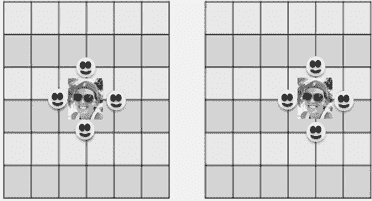

图 16-1 一个不寻常的农夫

看着右侧图片中的微笑脸，我们看到她以`0.25`的概率会离原点`0`单位，以`0.25`的概率会离原点`2`单位，以`0.5`的概率会离原点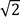单位。¹⁰⁵因此，平均而言，经过两步后她会比经过一步后离原点更远。第三步呢？如果第二步是到顶部或底部的微笑脸，第三步将使农夫在一半的情况下更靠近原点，而在另一半的情况下更远离。如果第二步是到左侧的微笑脸（原点），第三步将远离原点。如果第二步是到右侧的微笑脸，第三步在四分之一的时间内将更靠近原点，而在四分之三的时间内则会更远离原点。

看起来醉汉走的步数越多，预期离原点的距离就越大。我们可以继续这种可能性的详尽枚举，也许可以很好地直观理解这种距离是如何随着步数的增加而增长的。然而，这变得有些繁琐，因此写一个程序来为我们完成这项工作似乎是个更好的主意。

让我们通过思考一些可能在构建此模拟以及其他类型随机行走的模拟中有用的数据抽象来开始设计过程。像往常一样，我们应该尝试发明与我们试图建模的情况中出现的事物类型相对应的类型。三个显而易见的类型是`Location`、`Field`和`Drunk`。在查看提供这些类型的类时，考虑它们可能对我们能够构建的模拟模型暗示的内容是很有价值的。

让我们从`Location`开始，图 16-2。这是一个简单的类，但它体现了两个重要的决策。它告诉我们模拟将最多涉及两个维度。这与上面的图片是一致的。此外，由于提供给`delta_x`和`delta_y`的值可以是浮点数而不是整数，因此这个类没有关于醉汉可能移动的方向集合的内置假设。这是对非正式模型的一个概括，其中每一步的长度为一，并且与 x 轴或 y 轴平行。

类`Field`，图 16-2，也相当简单，但它同样体现了一些显著的决策。它只是维护了醉汉与位置的映射。它对位置没有任何限制，因此可以推测`Field`是无限大小的。它允许多个醉汉随机添加到`Field`中的任意位置。它没有对醉汉的移动模式做出任何说明，也不禁止多个醉汉占据同一位置或穿过其他醉汉占据的空间。

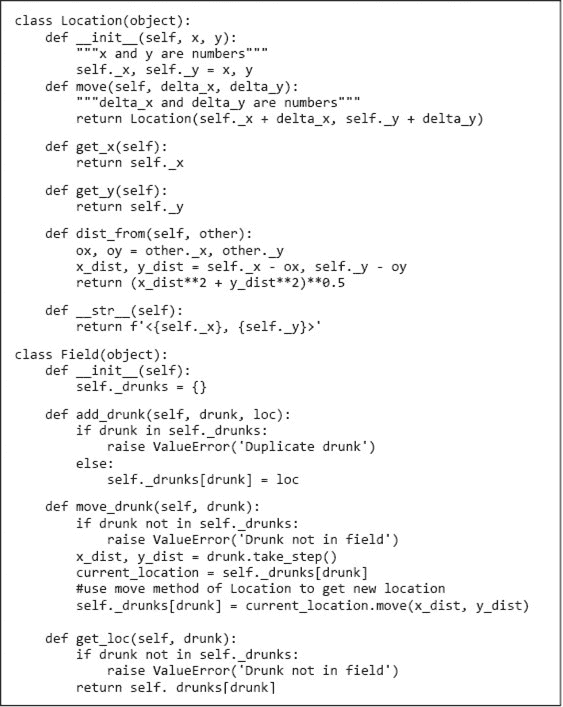

图 16-2 `Location`和`Field`类

图 16-3 中的`Drunk`和`Usual_drunk`类定义了醉汉在场地上漫游的方式。特别是，`Usual_drunk`中`step_choices`的值引入了每一步的长度为一且平行于 x 轴或 y 轴的限制。由于函数`random.choice`返回传入序列中随机选择的成员，因此每种步伐的可能性是相等的，并且不受之前步伐的影响。稍后我们将查看具有不同行为的`Drunk`子类。

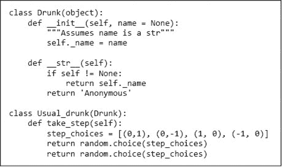

图 16-3 定义醉汉的类

下一步是使用这些类构建一个模拟，以回答最初的问题。图 16-4 包含用于此模拟的三个函数。


图 16-4 醉汉的行走（带有错误）

函数`walk`模拟一次`num_steps`步的行走。函数`sim_walks`调用`walk`模拟`num_trials`次每次`num_steps`步的行走。函数`drunk_test`调用`sim_walks`以模拟不同长度的行走。

`sim_walks`的参数`d_class`是`class`类型，并在代码的第一行用于创建适当子类的`Drunk`。稍后，当`drunk.take_step`从`Field.move_drunk`调用时，将自动选择适当子类的方法。

函数`drunk_test`还有一个参数`d_class`，类型为`class`。它被使用了两次，一次在调用`sim_walks`时，另一次在第一个`print`语句中。在`print`语句中，内置的`class`属性`__name__`用于获取类名的字符串。

当我们执行`drunk_test((10, 100, 1000, 10000), 100, Usual_drunk)`时，它打印了

```py
Usual_drunk walk of 10 steps: Mean = 8.634, Max = 21.6, Min = 1.4
Usual_drunk walk of 100 steps: Mean = 8.57, Max = 22.0, Min = 0.0
Usual_drunk walk of 1000 steps: Mean = 9.206, Max = 21.6, Min = 1.4
Usual_drunk walk of 10000 steps: Mean = 8.727, Max = 23.5, Min = 1.4
```

这令人惊讶，因为我们之前形成的直觉是，平均距离应该随着步数的增加而增加。这可能意味着我们的直觉是错误的，或者可能意味着我们的模拟有问题，或者两者都有。

此时的第一步是对我们已经认为知道答案的值运行模拟，确保模拟产生的结果与预期结果匹配。我们来试试零步数的步行（对于它，离原点的平均、最小和最大距离都应该是`0`）和一步的步行（对于它，离原点的平均、最小和最大距离都应该是`1`）。

当我们运行`drunk_test((0,1), 100, Usual_drunk)`时，得到了高度可疑的结果

```py
Usual_drunk walk of 0 steps: Mean = 8.634, Max = 21.6, Min = 1.4
Usual_drunk walk of 1 steps: Mean = 8.57, Max = 22.0, Min = 0.0
```

零步数的步行的平均距离怎么可能超过`8`？我们的模拟中肯定有至少一个错误。经过一些调查，问题变得清楚。在`sim_walks`中，函数调用`walk(f, Homer, num_trials)`应该是`walk(f, Homer, num_steps)`。

这里的道德非常重要：在查看模拟结果时，始终保持一些怀疑态度。首先要问结果是否合理（即，看起来可信）。并始终对你对结果有强烈直觉的参数进行**烟雾测试**¹⁰⁶。

当纠正后的模拟在我们的两个简单案例中运行时，得到了完全预期的结果：

```py
Usual_drunk walk of 0 steps: Mean = 0.0, Max = 0.0, Min = 0.0
Usual_drunk walk of 1 steps: Mean = 1.0, Max = 1.0, Min = 1.0
```

当在更长的步行中运行时，它打印出

```py
Usual_drunk walk of 10 steps: Mean = 2.863, Max = 7.2, Min = 0.0
Usual_drunk walk of 100 steps: Mean = 8.296, Max = 21.6, Min = 1.4
Usual_drunk walk of 1000 steps: Mean = 27.297, Max = 66.3, Min = 4.2
Usual_drunk walk of 10000 steps: Mean = 89.241, Max = 226.5, Min = 10.0
```

正如预期的那样，离原点的平均距离随着步数的增加而增长。

现在让我们看看从原点的平均距离的图表，图 16-5。为了展示距离增长的速度，我们在图上绘制了一条显示步数平方根的线（并将步数增加到`100,000`）。

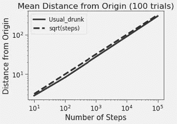

图 16-5 从起点到已走步数的距离

**指尖练习：** 编写代码生成图 16-5 中的图表。

这个图表是否提供了关于醉汉最终可能位置的任何信息？它确实告诉我们，平均而言，醉汉会在一个以原点为中心，半径等于预期距离的圆上。然而，它对于我们在任何特定步行结束时可能找到醉汉的具体位置几乎没有提供信息。我们将在下一节回到这个话题。

## 16.3 偏置随机步行

现在我们有了一个有效的模拟，可以开始修改它来研究其他类型的随机步行。例如，假设我们想考虑一个厌恶寒冷的北半球醉汉农夫的行为，即使在醉酒状态下，他在朝南方向移动时速度也会快一倍。或者可能是一个光向性醉汉，总是朝着太阳移动（早上向东，下午向西）。这些都是**偏置随机步行**的例子。步行仍然是随机的，但结果中存在偏差。

图 16-6 定义了两个额外的`Drunk`子类。在每种情况下，专业化涉及为`step_choices`选择合适的值。函数`sim_all`迭代一系列`Drunk`子类，以生成有关每种类型行为的信息。

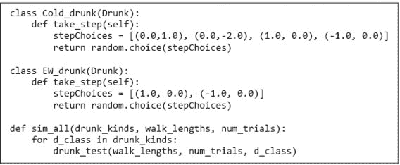

图 16-6 `Drunk`基类的子类

当我们运行时

```py
`sim_all((Usual_drunk, Cold_drunk, EW_drunk), (100, 1000), 10)`
```

它打印了

```py
Usual_drunk walk of 100 steps: Mean = 9.64, Max = 17.2, Min = 4.2
Usual_drunk walk of 1000 steps: Mean = 22.37, Max = 45.5, Min = 4.5
Cold_drunk walk of 100 steps: Mean = 27.96, Max = 51.2, Min = 4.1
Cold_drunk walk of 1000 steps: Mean = 259.49, Max = 320.7, Min = 215.1
EW_drunk walk of 100 steps: Mean = 7.8, Max = 16.0, Min = 0.0
EW_drunk walk of 1000 steps: Mean = 20.2, Max = 48.0, Min = 4.0
```

看起来我们的热寻求醉汉比其他两种醉汉更快地远离原点。然而，消化这段输出中的所有信息并不容易。是时候远离文本输出，开始使用图表了。

由于我们在同一个图表上展示不同类型的醉汉，我们将为每种醉汉关联一种独特的样式，以便于区分。样式将具有三个方面：

+   线条和标记的颜色

+   标记的形状

+   线条的类型，例如，实线或虚线。

类`style_iterator`，图 16-7 通过传递给`style_iterator.__init__`的参数旋转一系列样式。


图 16-7 迭代样式

图 16-8 中的代码在结构上与图 16-4 中的代码相似。

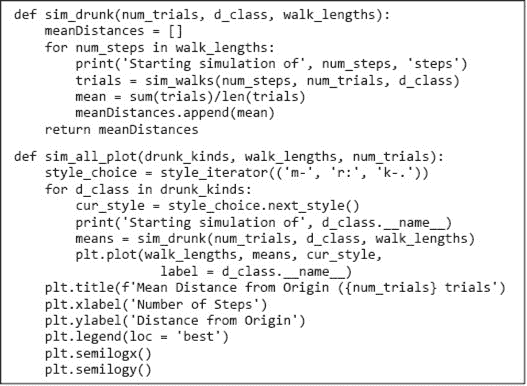

图 16-8 绘制不同醉汉的步态

`sim_drunk`和`sim_all_plot`中的`print`语句对仿真的结果没有贡献。它们的存在是因为这个仿真可能需要较长时间完成，偶尔打印一条指示进展的消息可以让用户感到安心，避免他们怀疑程序是否真的在运行。

图 16-9 中的图是通过执行生成的。

```py
sim_all_plot((Usual_drunk, Cold_drunk, EW_drunk),
             (10, 100, 1000, 10000, 100000), 100)
```

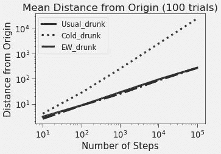

图 16-9 不同类型醉汉的平均距离

普通醉汉和光向性醉汉（`EW_drunk`）似乎以大约相同的速度远离原点，但热寻求醉汉（`Cold_drunk`）似乎远离的速度要快几个数量级。这很有趣，因为平均而言，他只比其他人快`25%`（他每四步平均走五步）。

让我们构建一个不同的图表，以帮助我们更深入地了解这三个类的行为。代码在图 16-10 中绘制了单步数的最终位置分布，而不是随着步数增加绘制距离随时间的变化。


图 16-10 绘制最终位置

`plot_locs`的第一个操作是创建一个`style_iterator`实例，该实例有三种样式的标记。然后它使用`plt.plot`在每次试验结束时对应的位置放置标记。对`plt.plot`的调用设置了标记的颜色和形状，使用了`style_iterator`返回的值。

调用`plot_locs((Usual_drunk, Cold_drunk, EW_drunk), 100, 200)`生成了图 16-11 中的图。

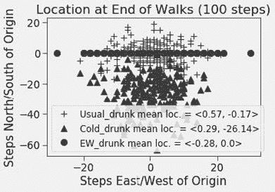

图 16-11 醉汉停下的地方

首先要说的是，我们的醉汉似乎表现如预期。`EW_drunk`最终位于 x 轴上，`Cold_drunk`似乎向南推进，而`Usual_drunk`则显得漫无目的。

但为什么圆形标记似乎比三角形或+标记少得多呢？因为许多`EW_drunk`的行走最终到达了同一个地方。这并不令人惊讶，考虑到`EW_drunk`可能的终点数量只有`200`。而且，圆形标记在 x 轴上似乎分布相对均匀。

至少对我们来说，`Cold_drunk`为什么在平均情况下能比其他类型的醉汉走得更远，这一点仍然不是显而易见的。也许是时候关注一条单一行走的路径，而不是许多行走的终点。 图 16-12 中的代码生成了图 16-13 中的图。

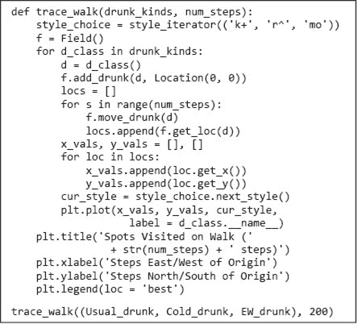

图 16-12 行走轨迹追踪

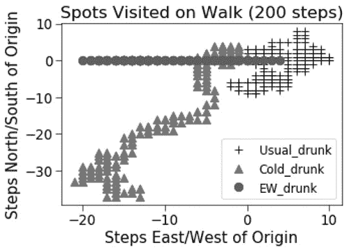

图 16-13 行走轨迹

由于行走长度为`200`步，而`EW_drunk`的行走访问了不到`30`个不同的位置，因此显然他花费了很多时间在回溯自己的步骤上。对于`Usual_drunk`也是如此。相比之下，虽然`Cold_drunk`并不是直奔佛罗里达，但他相对花费更少的时间去访问他已经去过的地方。

这些模拟本身并没有什么有趣之处。（在第十八章中，我们将关注更内在有趣的模拟。）但有几点值得注意：

+   起初，我们将模拟代码分为四个独立的部分。其中三个是类（`Location`、`Field`和`Drunk`），对应于问题非正式描述中出现的抽象数据类型。第四部分是一组函数，这些函数使用这些类执行简单的模拟。

+   我们随后将`Drunk`详细划分为一个类的层次结构，以便观察不同类型的偏向随机行走。`Location`和`Field`的代码保持不变，但模拟代码被更改为迭代`Drunk`的不同子类。在此过程中，我们利用了类本身是一个对象，因此可以作为参数传递的事实。

+   最后，我们对模拟进行了一系列渐进的更改，而没有涉及表示抽象类型的类的任何变化。这些更改主要涉及引入旨在提供对不同游走的洞察的图表。这是模拟开发的典型方式。首先让基本模拟工作，然后再开始添加功能。

## 16.4 危险场

你是否玩过在美国被称为*滑梯与梯子*、在英国被称为*蛇与梯子*的桌面游戏？这个儿童游戏起源于印度（可能是在公元前二世纪），当时称为*Moksha-patamu*。落在代表美德（例如，慷慨）的方块上，会让玩家爬上梯子，进入更高的生活层次。落在代表邪恶（例如，欲望）的方块上，则会将玩家送回更低的生活层次。

我们可以通过创建一个带有虫洞的`Field`轻松地为我们的随机游走添加这种特性，¹⁰⁷，如图 16-14 所示，并将函数`trace_walk`中的第二行代码替换为

```py
`f = Odd_field(1000, 100, 200)`
```

在`Odd_field`中，走入虫洞位置的醉汉会被传送到虫洞另一端的位置。

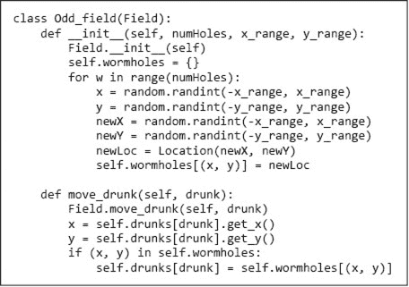

图 16-14 具有奇怪属性的场

当我们运行`trace_walk((Usual_drunk, Cold_drunk, EW_drunk), 500)`时，得到了图 16-15 中相当奇怪的图。

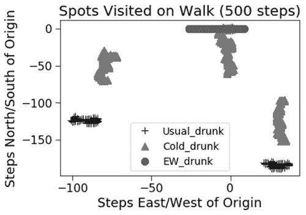

图 16-15 奇怪的游走

显然，更改场的属性产生了显著效果。然而，这并不是本示例的重点。主要观点是：

+   由于我们代码的结构方式，适应被建模情况的重大变化变得容易。正如我们可以添加不同类型的醉汉而不触动`Field`一样，我们也可以添加一种新的`Field`而不触动`Drunk`或其任何子类。（如果我们足够有远见，将场作为`trace_walk`的参数，我们就不必更改`trace_walk`了。）

+   尽管可以从分析上推导出简单随机游走甚至有偏随机游走的预期行为的不同信息，但一旦引入虫洞，这就变得很具挑战性。然而，改变模拟以适应新情况却极为简单。模拟模型通常相对于分析模型享有这一优势。

## 16.5 在章节中引入的术语确定性程序

+   随机过程

+   模拟模型

+   随机游走

+   烟雾测试

+   有偏随机游走

+   对数尺度
