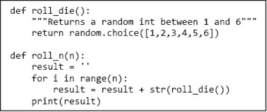
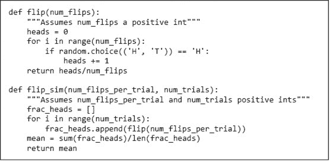
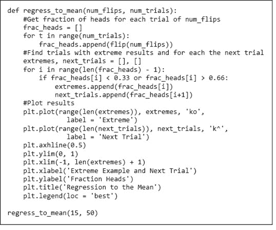
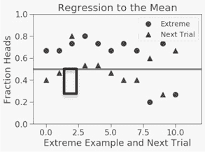
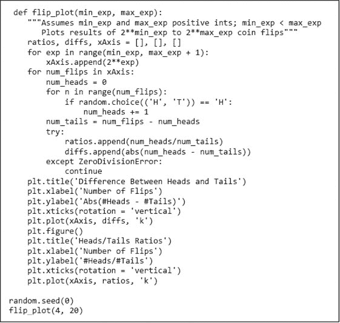
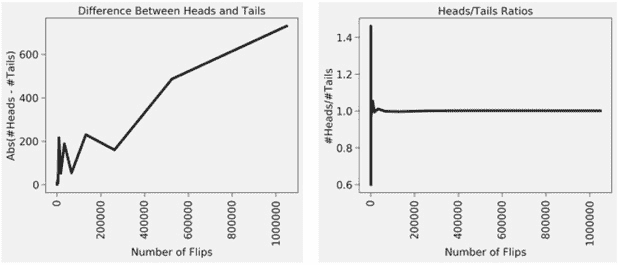

# 第十七章：随机程序、概率和分布

纽顿力学给人一种安慰。你在杠杆的一端施加压力，另一端就会上升。你把球抛向空中；它沿着抛物线轨迹移动，最终落下。简而言之，一切都是有原因的。物理世界是一个完全可预测的地方——所有物理系统的未来状态都可以从对其当前状态的知识中推导出来。

几个世纪以来，这一直是主流科学智慧；然后量子力学和哥本哈根公理出现了。以波尔和海森堡为首的公理支持者们争辩说，从最根本的层面来看，物理世界的行为是无法预测的。可以做出“x 很可能发生”的概率性陈述，但不能做出“x 必然发生”的陈述。其他著名物理学家，尤其是爱因斯坦和薛定谔， vehemently disagreed.

这场辩论搅动了物理学、哲学甚至宗教的世界。辩论的核心是**因果非确定性**的有效性，即并非每个事件都是由之前的事件引起的信念。爱因斯坦和薛定谔发现这种观点在哲学上不可接受，正如爱因斯坦经常重复的那句话，“上帝不会掷骰子。”他们所能接受的是**预测非确定性**，即我们的测量能力有限使得无法对未来状态做出准确预测。这一区别被爱因斯坦很好地总结，他说：“当代理论的本质统计特征完全归因于这一理论以不完整的物理系统描述为基础。”

因果非确定性的问题仍然没有解决。然而，我们无法预测事件的原因是因为它们真正不可预测，还是因为我们仅仅没有足够的信息去预测它们，这在实践中并无重要意义。

当波尔/爱因斯坦的辩论涉及如何理解物理世界的最低层次时，相同的问题也出现在宏观层面。或许马赛的结果、轮盘赌的旋转以及股票市场的投资是因果确定的。然而，有充足的证据表明，将它们视为可预测的确定性是危险的。

## 17.1 随机程序

如果一个程序是**确定性的**，那么每当它在相同输入上运行时，它产生相同的输出。注意，这与说输出完全由问题的规格定义并不相同。考虑，例如，`square_root`的规格：

```py
`def square_root(x, epsilon):     """Assumes x and epsilon are of type float; x >= 0 and epsilon > 0        Returns float y such that x-epsilon <= y*y <= x+epsilon"""`
```

这个规格为函数调用`square_root(2, 0.001)`允许了许多可能的返回值。然而，我们在第三章看到的连续逼近算法将始终返回相同的值。该规格并不要求实现是确定性的，但它确实允许确定性实现。

不是所有有趣的规格都可以通过确定性实现来满足。例如，考虑实现一个骰子游戏的程序，比如西洋双陆棋或掷骰子。程序中会有一个函数来模拟一个公平的六面骰子的掷骰子。¹⁰⁹假设它的规格是这样的。

```py
`def roll_die():     """Returns an int between 1 and 6"""` 
```

这将是个问题，因为它允许实现每次调用时返回相同的数字，这会使游戏变得相当无聊。更好的方法是指定`roll_die`“`返回一个在 1 和 6 之间随机选择的整数`”，这样就要求实现是随机的。

大多数编程语言，包括 Python，都提供了简单的方法来编写随机程序，即利用随机性的程序。图 17-1 中的小程序是一个模拟模型。我们不是让某个人多次掷骰子，而是写了一个程序来模拟这个活动。代码使用了从导入的 Python 标准库模块`random`中找到的几个有用函数之一。

```py
import random
import numpy as np
import matplotlib.pyplot as plt
import scipy.integrate
```

所有这些都已执行。

函数`random.choice`以一个非空序列作为参数，并返回该序列中随机选择的成员。几乎所有`random`中的函数都是使用函数`random.random`构建的，该函数生成一个在`0.0`和`1.0`之间的随机浮点数。¹¹⁰



图 17-1 掷骰子

现在，想象一下运行`roll_n(10)`。你会对打印出`1111111111`还是`5442462412`感到更惊讶？换句话说，这两个序列哪个更随机？这是一个技巧性问题。这两个序列发生的可能性是一样的，因为每次掷骰子的值与之前的掷骰子值是独立的。在随机过程中的两个事件是**独立的**，如果一个事件的结果对另一个事件的结果没有影响。

如果我们通过考虑一个两面的骰子（也称为硬币），其值为 0 和 1 来简化情况，这样更容易理解。这样我们可以将`roll_n`的输出视为一个二进制数字。当我们使用二进制骰子时，`roll_n`可能返回的序列有`2`^n 种可能性。这些序列的可能性是一样的，因此每个序列发生的概率为`(1/2)`^n。

让我们回到六面骰子。长度为`10`的不同序列有多少种？`6`¹⁰。所以，连续掷到 10 个`1`的概率是`1/6`¹⁰。少于六千万分之一。相当低，但不低于任何其他序列的概率，例如`5442462412`。

## 17.2 计算简单概率

一般来说，当我们谈论某个结果具有某种属性的**概率**（例如，都是`1`）时，我们是在询问所有可能结果中有多少比例具有该属性。这就是为什么概率的范围是从 0 到 1。假设我们想知道掷骰子时得到的序列不是全部`1`的概率。它只是`1 – (1/6`¹⁰`)`，因为某件事发生的概率和同一事件不发生的概率之和必须为`1`。

假设我们想知道在 10 次掷骰子中没有掷到一个`1`的概率。回答这个问题的一种方法是将其转化为`6¹⁰`个可能序列中有多少个不包含`1`。这可以通过以下方式计算：

1.  1\. 在任何一次掷骰子中，不掷到`1`的概率是`5/6`。

1.  2\. 在第一次或第二次掷骰子时，不掷到`1`的概率是`(5/6)`*`(5/6)`，或`(5/6)`²。

1.  3\. 所以，不连续掷到`1` 10 次的概率是`(5/6)`¹⁰，略高于`0.16`。

第 2 步是对独立概率的**乘法法则**的应用。例如，考虑两个独立事件`A`和`B`。如果`A`发生的概率为`1/3`，而`B`发生的概率为`1/4`，那么`A`和`B`同时发生的概率为`1/4 of 1/3`，即`(1/3)/4`或`(1/3)*(1/4)`。

至于掷到至少一个`1`的概率呢？它就是 1 减去不掷到至少一个`1`的概率，即`1` - `(5/6)`¹⁰。注意，不能简单地说任何一次掷骰子的`1`的概率是`1/6`，因此至少掷到一个`1`的概率是`10*(1/6)`，即`10/6`。这显然是不正确的，因为概率不能大于`1`。

那么在 10 次掷骰子中掷到恰好两个`1`的概率是多少呢？这相当于问在`6¹⁰`个整数中，有多少个整数在其基数`6`表示中恰好有两个`1`。我们可以轻松编写程序生成所有这些序列，并计算包含恰好一个`1`的数量。用解析方法推导这个概率有点棘手，我们将其留到第 17.4.4 节讨论。

## 17.3 推论统计

正如你刚才看到的，我们可以使用系统化的过程基于已知的一个或多个简单事件的概率，推导出一些复杂事件的精确概率。例如，我们可以轻松计算投掷硬币得到 10 次连续正面的概率，前提是我们假设每次投掷是独立的，并且知道每次投掷出现正面的概率。然而，假设我们实际上并不知道相关的简单事件的概率。举例来说，假设我们不知道这枚硬币是否公平（即，正反面出现的概率相等）。

一切尚未失去。如果我们对硬币的行为有一些数据，我们可以将这些数据与我们的概率知识结合，以推导出真实概率的估计。我们可以使用**推断统计**来估计一次投掷出现正面的概率，然后用传统概率来计算这种行为的硬币连续出现 10 次正面的概率。

简而言之（因为这不是一本关于统计的书），推断统计的指导原则是，随机样本往往表现出与其来源总体相同的特性。

假设哈维·登特（也称为“双面人”）投掷了一枚硬币，结果是正面。你不会由此推断下一次投掷也会是正面。假设他投掷了两次，结果都是正面。你可能会推测，对于一枚公平的硬币，这种情况发生的概率是`0.25`，因此仍然没有理由假设下一次投掷会是正面。然而，假设`100`次投掷中都有`100`次是正面。事件的概率`(1/2)¹⁰⁰`（假设硬币是公平的）非常小，因此你可能会觉得推断这枚硬币的两面都是正面是安全的。

你对硬币是否公平的信念基于这样的直觉：单次`100`次投掷的行为与所有`100`次投掷样本的总体行为是相似的。当所有`100`次投掷都是正面时，这种信念似乎是合适的。假设有`52`次投掷是正面，`48`次是反面。你是否会对预测下一次`100`次投掷的正反面比例保持信心？更进一步，你会对预测下一次`100`次投掷中正面会多于反面感到有把握吗？花几分钟思考一下这个问题，然后尝试进行实验。或者，如果你没有现成的硬币，可以使用图 17-2 中的代码来模拟投掷。

图 17-2 中的函数`flip`模拟了一枚公平硬币投掷`num_flips`次，并返回其中出现正面的比例。对于每次投掷，调用`random.choice(('H', ‘T'))`随机返回`'H'`或`'T'`。



图 17-2 投掷硬币

尝试执行函数 `flip_sim(10, 1)` 几次。我们在前两次尝试 `print('Mean =', flip_sim(10, 1))` 时看到的结果如下：

```py
Mean = 0.2
Mean = 0.6
```

从单次 `10` 次抛掷的试验中假设太多（除了硬币有正反两面）似乎不合适。这就是为什么我们通常将模拟结构化为包含多个试验并比较结果。让我们尝试 `flip_sim(10, 100)` 几次：

```py
Mean = 0.5029999999999999
Mean = 0.496
```

你对这些结果感觉更好了吗？当我们尝试 `flip_sim(100, 100000)` 时，我们得到了

```py
Mean = 0.5005000000000038
Mean = 0.5003139999999954
```

这看起来真的很好（尤其是我们知道答案应该是 `0.5`——但这算作弊）。现在似乎我们可以安全地得出关于下一次抛掷的结论，即正反面大致同样可能。但我们为什么认为可以得出这样的结论呢？

我们所依赖的是 **大数法则**（也称为 **伯努利定理**¹¹¹）。该法则声明，在相同实际概率 `p` 的重复独立测试中（在这种情况下为抛掷），该结果的出现频率与 `p` 的差异概率随着试验次数趋向于无穷大而收敛为零。

值得注意的是，大数法则并不意味着，正如太多人所想，若出现与预期行为的偏差，这些偏差可能会被未来的相反偏差“抵消”。这种对大数法则的误用被称为 **赌徒谬误**。¹¹²

人们常常将赌徒谬误与回归均值混淆。**回归均值**¹¹³表示，在经历极端随机事件后，下一个随机事件可能会更不极端。如果你抛一枚公正的硬币六次并得到六个正面，回归均值暗示下一个六次抛掷的结果更接近三个正面的期望值。它并不意味着，正如赌徒谬误所暗示的，下一次抛掷的正面数量可能少于反面数量。

大多数事务的成功需要技能与运气的结合。技能成分决定了均值，而运气成分则解释了变异性。运气的随机性导致回归均值。

图 17-3 中的代码生成了一个图，图 17-4，说明了回归均值。函数 `regress_to_mean` 首先生成 `num_trials` 次试验，每次 `num_flips` 次抛硬币。然后，它识别出所有结果中正面比例低于 `1/3` 或高于 `2/3` 的试验，并将这些极端值绘制为圆圈。接着，对于每个这些点，它在与圆圈相同的列中绘制后续试验的值作为三角形。

`0.5`处的水平线，即预期均值，是使用`axhline`函数创建的。`plt.xlim`函数控制 x 轴的范围。函数调用`plt.xlim(xmin, xmax)`设置当前图形 x 轴的最小值和最大值。函数调用`plt.xlim()`返回一个元组，包含当前图形 x 轴的最小值和最大值。`plt.ylim`函数的工作方式相同。



图 17-3 回归到均值

注意到，在极端结果后，通常会跟随一个更接近均值的试验，但这并不总是发生——如框中的一对所示。**手指练习：** 安德烈在打高尔夫时每洞平均`5`杆。一天，她完成前九洞用了`40`杆。她的搭档推测她可能会回归均值，接下来用`50`杆完成后九洞。你同意她的搭档吗？ 图 17-4 均值回归的插图 图 17-5 包含一个函数`flip_plot`，生成两个图， 图 17-6，旨在展示大数法则的应用。第一个图显示头和尾的数量差的绝对值如何随翻转次数变化。第二个图比较头与尾的比率和翻转次数。由于 x 轴上的数字较大，我们使用`plt.xticks(rotation = ‘vertical')`来旋转它们。 图 17-5 掷硬币结果的绘图 `random.seed(0)`在图底部确保`random.random`使用的伪随机数生成器每次执行时生成相同的伪随机数序列。这在调试时很方便。函数`random.seed`可以用任何数字调用。如果没有参数调用，则随机选择种子。 图 17-6 大数法则的应用 左边的图似乎表明，头和尾的绝对差在开始时波动，随后迅速下跌，然后迅速上升。然而，我们需要记住，`x = 300,000`右侧只有两个数据点。`plt.plot`用线连接这些点可能会误导我们看到趋势，而实际上只有孤立点。这不是不常见的现象，所以在对图的含义做出任何结论之前，总是要询问图实际包含多少个点。 在右侧的图中，很难看出任何内容，主要是平坦的线。这也是误导。尽管有 16 个数据点，但大多数都挤在图左侧的小区域中，因此细节难以看清。这是因为绘制的点的 x 值是`2`⁴`, 2`⁵`, 2`⁶`, …, 2`²⁰`，因此 x 轴的值范围从`16`到超过一百万，除非另行指示，`plot`会根据这些点与原点的相对距离来放置它们。这被称为**线性缩放**。由于大多数点的 x 值相对于`2`²⁰较小，它们看起来相对接近原点。 幸运的是，这些可视化问题在 Python 中很容易解决。正如我们在第十三章和本章早些时候看到的，我们可以轻松指示程序绘制不连接的点，例如，通过编写`plt.plot(xAxis, diffs, 'ko')`。 图 17-7 中的两个图都在 x 轴上使用对数尺度。由于`flip_plot`生成的 x 值为`2`^(minExp), `2`^(minExp+1), …, `2`^(maxExp)，使用对数 x 轴使得点沿 x 轴均匀分布——提供点之间的最大分离。 图 17-7 左侧的图在 y 轴上也使用对数尺度。该图的 y 值范围从接近`0`到约`550`。如果 y 轴是线性缩放，则很难看到图左端 y 值的相对小差异。另一方面，右侧的图 y 值相对较紧凑，因此我们使用线性 y 轴。 图 17-7 大数法则的应用 **手指练习：** 修改图 17-5 中的代码，使其生成如图 17-7 所示的图。 图 17-7 中的图比早期图更容易解释。右侧的图强烈暗示，随着翻转次数增大，头与尾的比率收敛于`1.0`。左侧图的意义不太清晰。似乎绝对差随着翻转次数增长，但这并不完全令人信服。 通过抽样实现完美的准确性永远是不可能的，除非抽样整个种群。无论我们检查多少样本，只有在检查种群的每个元素后，才能确定样本集是否典型（而且由于我们通常处理的是无限种群，例如所有可能的掷硬币序列，这往往是不可能的）。当然，这并不是说估计不能是精确正确的。我们可能掷硬币两次，得到一头一尾，得出每个结果的真实概率是`0.5`。我们会得出正确的结论，但我们的推理是错误的。 我们需要查看多少个样本，才能对我们计算的答案有合理的信心？这取决于**方差**在潜在分布中的情况。大致而言，方差是可能不同结果的扩散程度的度量。更正式地，值集合*X*的方差定义为： 其中|*X*|是集合的大小，*μ*（mu）是其均值。非正式地，方差描述有多少比例的值接近均值。如果许多值相对接近均值，方差相对较小。如果许多值相对远离均值，方差相对较大。如果所有值都相同，方差为零。 一组值的**标准差**是方差的平方根。虽然它包含与方差完全相同的信息，但标准差更易于解释，因为它与原始数据的单位相同。例如，“一个种群的平均身高是`70`英寸，标准差是`4`英寸”的说法比“一个种群的平均身高是`70`英寸，方差是`16`平方英寸”的说法更易于理解。图 17-8 包含方差和标准差的实现。¹¹⁵ 图 17-8 方差和标准差 我们可以利用标准差的概念来思考我们查看的样本数量与我们在计算的答案中应有的信心程度之间的关系。图 17-10 包含一个修改版的`flip_plot`。它使用辅助函数`run_trial`运行每个掷硬币次数的多个试验，然后绘制`头/尾`比率的均值和标准差。辅助函数`make_plot`，图 17-9，包含生成图的代码。 图 17-9 掷硬币模拟的辅助函数  图 17-10 掷硬币模拟 让我们尝试`flip_plot1(4, 20, 20)`。它生成图 17-11 中的图。 图 17-11 头尾比率的收敛 这令人鼓舞。平均头/尾比率正在收敛于`1`，标准差的对数与每次试验的翻转次数的对数线性下降。当我们进行大约`10`⁶次掷硬币时，标准差（约`10`^(-3)）大约比均值（约`1`）小三个数量级，因此我们可以相当有信心预期头/尾比率非常接近`1.0`。随着我们掷更多硬币，我们不仅得到更精确的答案，更重要的是，我们还有更多理由相信它
