# 第十九章：抽样与置信度

回想一下，推断统计涉及通过分析随机选择的样本来对**总体**进行推断。这个样本被称为**样本**。

抽样很重要，因为通常无法观察到整个感兴趣的总体。医生无法计算患者血液中某种细菌的数量，但可以测量患者血液的小样本中的细菌数量，从而推断整个总体的特征。如果你想知道十八岁美国人的平均体重，可以尝试把他们全部召集起来，放在一个非常大的秤上，然后除以人数。或者，你可以随机召集 50 个十八岁的人，计算他们的平均体重，并假设这个平均体重是整个十八岁人群平均体重的合理估计。

样本与感兴趣总体之间的对应关系至关重要。如果样本不能代表总体，再复杂的数学也无法得出有效的推断。50 个女性或 50 个亚裔美国人或 50 个足球运动员的样本不能用于对美国所有十八岁人群的平均体重进行有效推断。

在本章中，我们关注**概率抽样**。使用概率抽样，感兴趣总体的每个成员都有非零的被纳入样本的概率。在**简单随机样本**中，总体的每个成员被选中的机会是均等的。在**分层抽样**中，总体首先被划分为子群体，然后从每个子群体随机抽样以构建样本。分层抽样可以提高样本代表整个总体的概率。例如，确保样本中男性和女性的比例与总体中的比例相符，会增加样本均值（**样本均值**）是整个总体均值（**总体均值**）的良好估计的概率。

本章中的代码假设以下导入语句

```py
import random
import numpy as np
import matplotlib.pyplot as plt
import scipy
```

## 19.1 抽样波士顿马拉松

自 1897 年以来，每年都有运动员（主要是跑步者，但自 1975 年以来有残疾人组别）聚集在马萨诸塞州参加波士顿马拉松。¹³³近年来，每年约有 20,000 名勇敢的人成功挑战`42.195`公里（`26`英里，`385`码）的赛道。

包含 2012 年比赛数据的文件可在与本书相关的网站上获得。文件`bm_results2012.csv`为逗号分隔格式，包含每位参与者的姓名、性别、¹³⁴年龄、组别、国家和时间。图 19-1 包含该文件内容的前几行。

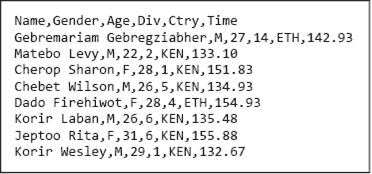

图 19-1 `bm_results2012.csv`中的前几行

由于每场比赛的完整结果数据很容易获得，因此没有实际需要使用抽样来推导比赛的统计数据。然而，从教育角度来看，将从样本中得出的统计估计与实际估计值进行比较是有益的。

图 19-2 中的代码生成了图 19-3 中显示的图表。函数`get_BM_data`从包含比赛中每位竞争者信息的文件中读取数据。它返回一个包含六个元素的字典。每个键描述与该键关联的列表中元素的数据类型（例如，`'name'`或`'gender'`）。例如，`data['time']`是一个浮点数列表，包含每个竞争者的完成时间，`data['name'][i]`是第`i`位竞争者的名字，`data['time'][i]`是第`i`位竞争者的完成时间。函数`make_hist`生成完成时间的可视化表示。（在第二十三章中，我们将研究一个可以简化本章中很多代码的 Python 模块 Pandas，包括`get_BM_data`和`make_hist`。）

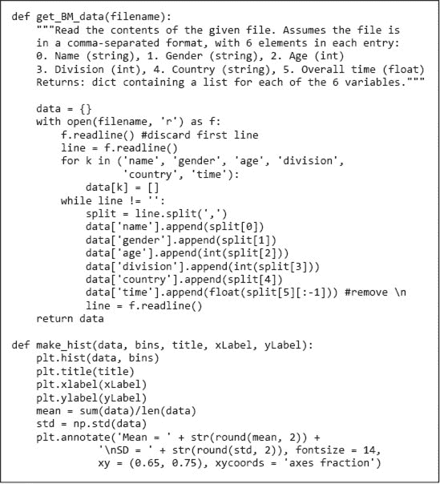

图 19-2 读取数据并生成波士顿马拉松的图表

代码

```py
times = get_BM_data('bm_results2012.csv')['time']
make_hist(times, 20, '2012 Boston Marathon',
          'Minutes to Complete Race', 'Number of Runners')
```

在图 19-3 中生成图表。

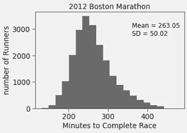

图 19-3 波士顿马拉松完成时间

完成时间的分布类似于正态分布，但由于右侧的粗尾明显不正常。

现在，让我们假装没有关于所有竞争者的数据，而是想通过抽样一小部分随机选择的竞争者来估计整个参赛者完成时间的一些统计数据。

图 19-4 中的代码创建了`times`元素的简单随机样本，然后使用该样本来估计`times`的均值和标准差。函数`sample_times`使用`random.sample(times, num_examples)`来提取样本。调用`random.sample`返回一个大小为`num_examples`的列表，包含从列表`times`中随机选择的不同元素。在提取样本后，`sample_times`生成一个直方图，显示样本中值的分布。

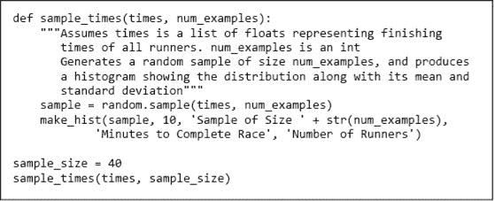

图 19-4 抽样完成时间

正如图 19-5 所示，样本的分布与其抽取的分布相比，远离正态分布。这并不令人惊讶，因为样本大小较小。更令人惊讶的是，尽管样本大小为(`40`，约为`21,000`)小，但估计的均值与总体均值相差约`3%`。我们是运气好，还是有理由期待均值的估计会相当准确？换句话说，我们能否以量化的方式表达我们对估计的信心有多大？

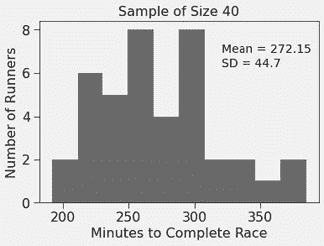

图 19-5 分析小样本

正如我们在第十七章和第十八章讨论的那样，提供置信区间和置信水平以指示估计的可靠性通常是有用的。给定一个从更大总体中抽取的单个样本（任意大小），总体均值的最佳估计是样本的均值。估计所需达到期望置信水平的置信区间宽度则更复杂。这在一定程度上取决于样本的大小。

很容易理解样本大小为什么重要。大数法则告诉我们，随着样本大小的增加，样本值的分布更可能类似于其抽取的总体的分布。因此，随着样本大小的增加，样本均值和样本标准差更可能接近总体均值和总体标准差。

所以，越大越好，但多大才算足够？这取决于总体的方差。方差越高，需要的样本越多。考虑两个正态分布，一个均值为`0`，标准差为`1`，另一个均值为`0`，标准差为`100`。如果我们从这些分布中随机选择一个元素并用它来估计该分布的均值，那么该估计在任何期望精度∈内的真实均值(`0`)的概率，将等于在概率密度函数下方，范围在−∈和∈之间的面积（见第 17.4.1 节）。图 19-6 中的代码计算并打印了对于∈ = 3 分钟的这些概率。

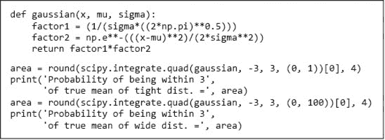

图 19-6 方差对均值估计的影响

当运行图 19-6 中的代码时，它会打印出

```py
Probability of being within 3 of true mean of tight dist. = 0.9973
Probability of being within 3 of true mean of wide dist. = 0.0239
```

图 19-7 中的代码绘制了来自两个正态分布的`1000`个样本，每个样本大小为`40`的均值。再次强调，每个分布的均值为`0`，但一个的标准差为`1`，另一个的标准差为`100`。

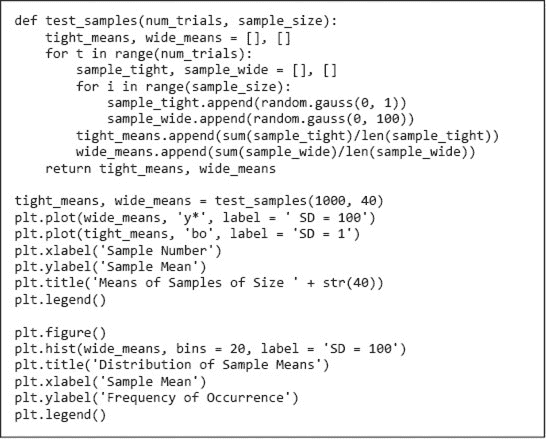

图 19-7 计算并绘制样本均值

图 19-8 的左侧显示了每个样本的均值。正如预期的那样，当总体标准差为 1 时，样本均值都接近总体均值`0`，这就是为什么看不到明显的圆圈——它们密集到合并成看似一条柱形的状态。相反，当总体标准差为`100`时，样本均值则以难以辨认的模式分散。

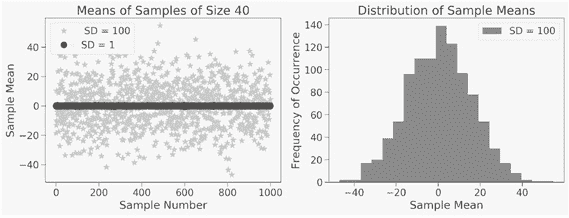

图 19-8 样本均值

然而，当我们查看标准差为`100`时的均值直方图时，在图 19-8 的右侧，出现了一个重要的现象：均值形成了一个类似于以`0`为中心的正态分布。右侧的图 19-8 看起来如此并非偶然。这是中心极限定理的结果，这是所有概率和统计中最著名的定理。

## 19.2 中心极限定理

中心极限定理解释了为什么可以使用从一个总体中抽取的单一样本来估计从同一总体中抽取的一组假设样本均值的变异性。

**中心极限定理**（简称**CLT**）的一个版本最早由拉普拉斯于 1810 年发表，并在 1820 年代由泊松进一步完善。但我们今天所知的 CLT 是 20 世纪上半叶一系列杰出数学家工作的成果。

尽管（或许正因为）有许多杰出的数学家参与其中，CLT 实际上相当简单。它的意思是

+   给定从同一总体中抽取的足够大的样本集，样本的均值（样本均值）将近似呈正态分布。

+   这种正态分布的均值将接近总体的均值。

+   样本均值的方差（使用`numpy.var`计算）将接近于总体方差除以样本大小。

让我们来看一个中心极限定理（CLT）实际应用的例子。想象一下，你有一个骰子，每次掷出的结果会产生一个在 0 到 5 之间的随机实数。图 19-9 中的代码模拟了多次掷骰子的过程，打印均值和方差（`variance`函数在图 17-8 中定义），并绘制了显示各个数字范围出现概率的直方图。它还模拟了多次掷`100`个骰子，并在同一图中绘制这些`100`个骰子的均值的直方图。`hatch`关键字参数用于在视觉上区分两个直方图。

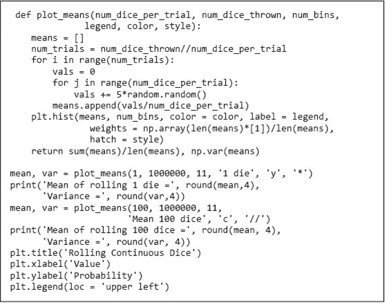

图 19-9 估计连续骰子的均值

`weights`关键字绑定到与`hist`的第一个参数相同长度的数组，用于给第一个参数中的每个元素分配权重。在生成的直方图中，箱子中的每个值都贡献其相关的权重到箱子计数中（而不是通常的`1`）。在这个例子中，我们使用`weights`来缩放 y 值，以反映每个箱子的相对（而非绝对）大小。因此，对于每个箱子，y 轴上的值是均值落在该箱子内的概率。

运行代码后，生成了图 19-10 中的绘图，并打印了，

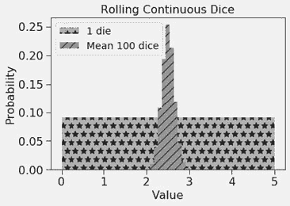

图 19-10 中心极限定理的示意图

```py
Mean of rolling 1 die = 2.5003 Variance = 2.0814
Mean of rolling 100 dice = 2.4999 Variance = 0.0211
```

在每种情况下，均值都非常接近预期的均值`2.5`。由于我们的骰子是公平的，一个骰子的概率分布几乎是完全均匀的，¹³⁵即远非正态。然而，当我们查看`100`个骰子的平均值时，分布几乎是完全正态的，峰值包括预期的均值。此外，`100`次掷骰子的均值方差接近单次掷骰子的值除以`100`的方差。所有结果都如中心极限定理所预测。

中心极限定理似乎有效，但它有什么用呢？或许它可以帮助那些在特别书呆子的酒吧喝酒的人赢得酒吧赌注。然而，中心极限定理的主要价值在于它允许我们计算置信水平和区间，即使基础的总体分布不是正态分布。当我们在第 17.4.2 节中讨论置信区间时，指出经验法则是基于对所采样空间性质的假设。我们假设

+   均值估计误差为 0。

+   估计值的误差分布是正态的。

当这些假设成立时，针对正态分布的经验法则提供了一种便捷的方法，根据均值和标准差估计置信区间和水平。

让我们回到波士顿马拉松的例子。代码在图 19-11 中生成的绘图在图 19-12 中显示，针对各种样本大小绘制了 200 个简单随机样本。对于每个样本大小，它计算了这 200 个样本的均值；然后计算这些均值的均值和标准差。由于中心极限定理告诉我们样本均值将服从正态分布，我们可以使用标准差和经验法则为每个样本大小计算`95%`置信区间。

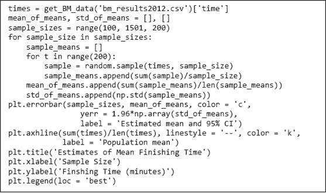

图 19-11 带误差条的绘图

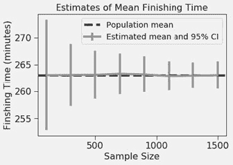

图 19-12 带误差条的完成时间估计

如图 19-12 所示，所有估计值都与实际总体均值相当接近。然而，请注意，估计均值的误差并不是随着样本大小单调减少——使用`700`个例子的估计恰好比使用`50`个例子的估计更差。随着样本大小的增加，我们对均值估计的信心是单调增加的。当样本大小从`100`增加到`1500`时，置信区间从大约`±15`减少到大约`±2.5`。这非常重要。仅仅运气好并得到一个好的估计是不够的。我们需要知道对我们的估计要有多少信心。

## 19.3 均值的标准误差

我们刚刚看到，如果选择 200 个随机样本，每个样本`1,500`名竞争者，我们可以以`95%`的置信度，在大约五分钟的范围内估计均值完成时间。我们使用了样本均值的标准差。不幸的是，由于这涉及到使用比竞争者更多的总例子(`200`*`1500 = 300,000`)，这似乎并不是一个有用的结果。我们直接使用整个总体计算实际均值会更好。我们需要一种方法，通过单个例子估计置信区间。引入**均值的标准误差**（**SE**或**SEM**）的概念。

样本大小为`n`的 SEM 是从同一总体中抽取的无穷多个样本均值的标准差，样本大小为`n`。不出所料，它依赖于`n`和σ，总体的标准差：

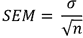

图 19-13 将图 19-12 中使用的样本大小的 SEM 与我们为每个样本大小生成的 200 个样本的均值标准差进行了比较。

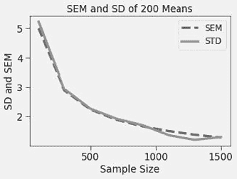

图 19-13 标准误差

我们的 200 个样本的均值的实际标准差与标准误差(SE)紧密相关。注意，SEM 和 SD 在开始时迅速下降，然后随着样本大小的增大而减缓。这是因为该值依赖于样本大小的平方根。换句话说，要将标准差减半，我们需要将样本大小增加四倍。

可惜的是，如果我们只有一个样本，就不知道总体的标准差。通常，我们假设样本的标准差是总体标准差的合理替代。这在总体分布不严重偏斜时是成立的。

图 19-14 中的代码创建了来自波士顿马拉松数据的`100`个不同大小的样本，并将每个大小样本的均值标准差与总体的标准差进行了比较。它生成了图 19-15 中的图。

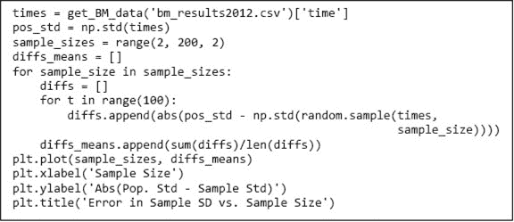

图 19-14 样本标准偏差与总体标准偏差

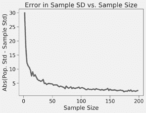

图 19-15 样本标准偏差

当样本大小达到`100`时，样本标准偏差与总体标准偏差之间的差异相对较小（约为实际平均完成时间的 1.2%）。

实际上，人们通常使用样本标准偏差来代替（通常未知的）总体标准偏差以估计标准误差。如果样本大小足够大，¹³⁶并且总体分布与正态分布相差不大，那么使用这个估计值来计算基于经验法则的置信区间是安全的。

这意味着什么？如果我们抽取一个包含 200 名跑步者的单一样本，我们可以

+   计算该样本的均值和标准偏差。

+   使用该样本的标准偏差来估计标准误差（SE）。

+   使用估计的标准误差（SE）来生成围绕样本均值的置信区间。

图 19-16 中的代码执行此操作`10,000`次，然后打印样本均值与总体均值之间超过`1.96`个估计标准误差的次数比例。（请记住，对于正态分布，`95%`的数据落在均值的`1.96`个标准偏差范围内。）

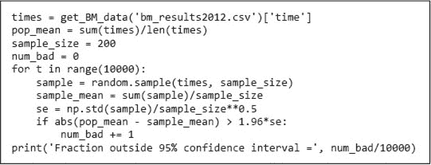

图 19-16 估计总体均值 10,000 次

当代码运行时，它会打印，

```py
Fraction outside 95% confidence interval = 0.0533
```

这基本上是理论的预测。中心极限定理胜出一分！

## 19.4 本章引入的术语

+   总体

+   样本

+   样本大小

+   概率抽样

+   简单随机样本

+   分层抽样

+   样本均值

+   总体均值

+   中心极限定理

+   标准误差（SE，SEM）
