# 第二十章：理解实验数据

本章是关于理解实验数据的。我们将广泛使用绘图来可视化数据，并展示如何使用线性回归构建实验数据模型。我们还将讨论物理实验和计算实验之间的相互作用。我们将讨论如何得出有效的统计结论的内容推迟到第二十一章。

## 20.1 弹簧的行为

弹簧是非常奇妙的东西。当它们被某种力压缩或拉伸时，会储存能量。当这个力不再施加时，它们释放储存的能量。这一特性使它们能够在汽车中平滑行驶，帮助床垫适应我们的身体，收回安全带，发射弹丸。

1676 年，英国物理学家**罗伯特·胡克**制定了弹性**胡克定律**：*Ut tensio, sic vis*，用英语表达为`F = -kx`。换句话说，存储在弹簧中的力`F`与弹簧被压缩（或拉伸）的距离呈线性关系。（负号表示弹簧施加的力与位移方向相反。）胡克定律适用于各种材料和系统，包括许多生物系统。当然，它不适用于任意大的力。所有弹簧都有一个**弹性极限**，超过这个极限，定律就失效了。那些拉伸过度的 Slinky 玩具的人对此了解得太清楚了。

比例常数`k`称为**弹簧常数**。如果弹簧很硬（比如汽车悬挂中的弹簧或弓箭手的弓臂），`k`就大。如果弹簧很弱，比如圆珠笔中的弹簧，`k`就小。

知道特定弹簧的弹簧常数可能非常重要。简单秤和原子力显微镜的标定都依赖于知道组件的弹簧常数。DNA 链的机械行为与压缩它所需的力相关。弓发射箭矢的力与其弓臂的弹簧常数相关，等等。

代代物理学生通过使用类似于图 20-1 所示的实验装置来估计弹簧常数。

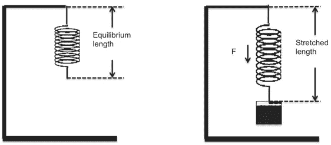

图 20-1 经典实验

我们从一个没有附加重量的弹簧开始，测量弹簧底部到支架顶部的距离。然后我们在弹簧上挂上已知质量的物体，并等待它停止移动。在此时，存储在弹簧中的力就是悬挂物体施加在弹簧上的力。这就是胡克定律中的`F`值。我们再次测量弹簧底部到支架顶部的距离。这个距离与挂上重量之前的距离之间的差值就是胡克定律中的`x`值。

我们知道施加在弹簧上的力`F`等于质量`m`乘以重力加速度`g`（`9.81 m/s`²是这个星球表面`g`的一个相当好的近似值），因此我们将`m`*`g`代入`F`。通过简单的代数，我们知道`k = -(m`*`g)/x.` 

假设，例如，`m = 1kg`和`x = 0.1m`，那么

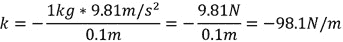

根据这个计算，拉伸弹簧一米需要`*98.1*`牛顿¹³⁷的力。

如果一切都很好

+   我们完全相信我们能够完美地进行这个实验。在这种情况下，我们可以进行一次测量，执行计算，并知道我们找到了`k`。不幸的是，实验科学几乎从不这样运作。

+   我们可以确保我们在弹簧的弹性极限以下进行操作。

一个更稳健的实验是将一系列越来越重的重物悬挂在弹簧上，每次测量弹簧的伸长并绘制结果。我们进行了这样的实验，并将结果输入到一个名为`springData.csv`的文件中：

```py
Distance (m), Mass (kg)
0.0865,0.1
0.1015,0.15
…
0.4416,0.9
0.4304,0.95
0.437,1.0
```

图 20-2 中的函数从一个文件读取数据，例如我们保存的文件，并返回包含距离和质量的列表。

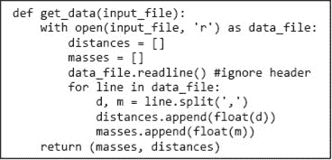

图 20-2 从文件中提取数据

图 20-3 中的函数使用`get_data`从文件中提取实验数据，然后生成图 20-4 中的图表。

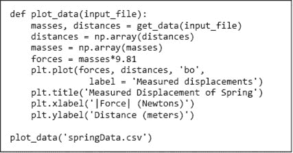

图 20-3 绘制数据

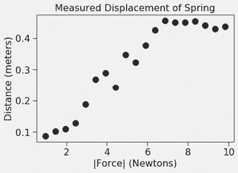

图 20-4 弹簧的位移

这不是胡克定律所预测的。胡克定律告诉我们，距离应与质量线性增加，即点应位于一条直线上，其斜率由弹簧常数决定。当然，我们知道当我们进行真实测量时，实验数据很少与理论完全吻合。测量误差是可以预期的，因此我们应当期望点位于一条线附近，而不是在线上。

仍然，看到一条代表我们最佳猜测的线会很好，假如没有测量误差，点将会在何处。通常的做法是对数据进行线性拟合。

### 20.1.1 使用线性回归找到拟合

每当我们将任何曲线（包括直线）拟合到数据时，我们需要某种方法来判断哪条曲线是数据的最佳**拟合**。这意味着我们需要定义一个客观函数，以定量评估曲线与数据的拟合程度。一旦我们有了这样的函数，找到最佳拟合可以被表述为寻找一个最小化（或最大化）该函数值的曲线，即作为一个优化问题（见第 14 和 15 章）。

最常用的目标函数称为 **最小二乘法**。令 `*observed*` 和 `*predicted*` 为相同长度的向量，其中 `*observed*` 包含测量点，*predicted* 包含建议拟合的相应数据点。

然后定义目标函数为：

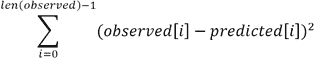

对观察值和预测值之间的差异进行平方处理，使观察值和预测值之间的大差异相对比小差异更为重要。平方差异还丢失了关于差异是正还是负的信息。

我们如何找到最佳的最小二乘拟合？一种方法是使用类似于第三章中牛顿–拉夫森算法的逐次逼近算法。或者，通常适用解析解。但我们不必实现牛顿–拉夫森或解析解，因为 `numpy` 提供了一个内置函数 `polyfit`，该函数可以找到最佳最小二乘拟合的近似值。该调用

```py
`np.polyfit(observed_x_vals, observed_y_vals, n)`
```

查找提供最佳最小二乘拟合的多项式的系数，次数为 `n`，该多项式由两个数组 `observed_x_vals` 和 `observed_y_vals` 定义的点集给出。例如，该调用

```py
`np.polyfit(observed_x_vals, observed_y_vals, 1)`
```

将找到由多项式 `y = ax + b` 描述的直线，其中 `a` 是直线的斜率，`b` 是 y 轴截距。在这种情况下，调用返回一个包含两个浮点值的数组。类似地，抛物线由二次方程 `y = ax`² `+ bx + c` 描述。因此，该调用

```py
`np.polyfit(observed_x_vals, observed_y_vals, 2)`
```

返回一个包含三个浮点值的数组。

`polyfit` 使用的算法称为 **线性回归**。这可能有些令人困惑，因为我们可以用它来拟合除直线以外的曲线。一些作者确实区分线性回归（当模型是直线时）和 **多项式回归**（当模型是次数大于 `1` 的多项式时），但大多数作者没有。¹³⁸

图 20-5 中的函数 `fit_data` 通过添加一条表示数据最佳拟合的直线来扩展 图 20-3 中的 `plot_data` 函数。它使用 `polyfit` 找到系数 `a` 和 `b`，然后利用这些系数生成每个力的预测弹簧位移。注意，`forces` 和 `distance` 的处理方式存在不对称性。`forces` 中的值（来自悬挂在弹簧上的质量）被视为独立变量，用于生成因悬挂该质量而产生的因变量 `predicted_distances` 的值。

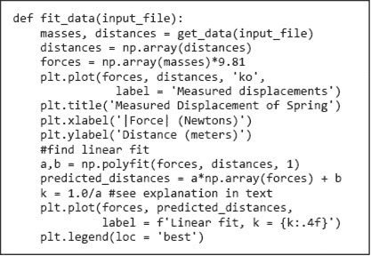

图 20-5 拟合数据曲线

该函数还计算弹簧常数 `k`。直线的斜率 `a` 是 `Δdistance/Δforce`。另一方面，弹簧常数 `k` 是 `Δforce/Δdistance`。因此，`k` 是 `a` 的倒数。

调用`fit_data('springData.csv')`生成图 20-6 中的图表。

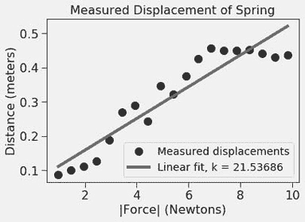

图 20-6 测量点和线性模型

有趣的是，实际上很少有点落在最小二乘拟合上。这是合理的，因为我们试图最小化平方误差的总和，而不是最大化落在直线上的点的数量。不过，这看起来似乎并不是一个很好的拟合。让我们通过向`fit_data`添加代码来尝试三次拟合

```py
#find cubic fit
fit = np.polyfit(forces, distances, 3)
predicted_distances = np.polyval(fit, forces)
plt.plot(forces, predicted_distances, 'k:', label = 'cubic fit')
```

在这段代码中，我们使用了函数`polyval`来生成与三次拟合相关的点。这个函数接受两个参数：一组多项式系数和一组用于计算多项式值的自变量。代码片段

```py
fit = np.polyfit(forces, distances, 3)
predicted_distances = np.polyval(fit, forces)
```

和

```py
a,b,c,d = np.polyfit(forces, distances, 3)
predicted_distances = a*(forces**3) + b*forces**2 + c*forces + d
```

是等价的。

这生成了图 20-7 中的图表。三次拟合似乎比线性拟合更好地描述了数据，但真的如此吗？可能不是。

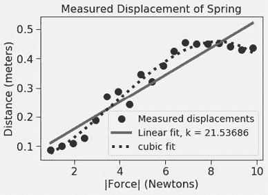

图 20-7 线性与三次拟合

技术性和大众化文章经常包含这样的图表，展示原始数据和与数据拟合的曲线。然而，作者常常假设拟合曲线就是对实际情况的描述，而原始数据仅仅是实验误差的指示。这是很危险的。

请记住，我们开始时的理论是`x`和`y`值之间应该存在线性关系，而不是三次关系。让我们看看如果使用我们的线性和三次拟合来预测对应于悬挂`1.5kg`重量的点会落在哪里，图 20-8。

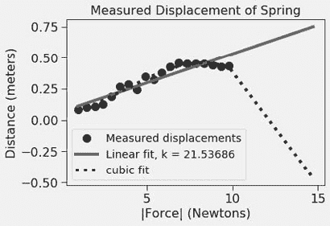

图 20-8 使用模型进行预测

现在三次拟合看起来不太好。特别是，通过在弹簧上挂一个大重量，弹簧会升高到（y 值为负）其悬挂的杆上方，这似乎极不可能。我们遇到的是**过拟合**的例子。过拟合通常发生在模型过于复杂时，例如，相对于数据量，它有太多参数。当这种情况发生时，拟合可以捕捉到数据中的噪声，而不是有意义的关系。过拟合的模型通常具有较差的预测能力，正如这个例子所示。

**手指练习：** 修改图 20-5 中的代码，以便生成图 20-8 中的图表。

让我们回到线性拟合。此刻，忘掉直线，研究原始数据。它有什么奇怪的地方吗？如果我们对最右侧的六个点拟合一条直线，它将几乎与 x 轴平行。这似乎与胡克定律相矛盾——直到我们记起胡克定律仅在某个弹性极限内有效。也许这个极限在`7N`（大约`0.7kg`）附近。

让我们看看如果通过替换`fit_data`的第二和第三行来消除最后六个点会发生什么。

```py
`distances = np.array(distances[:-6]) masses = np.array(masses[:-6])`
```

正如图 20-9 所示，去掉那些点确实会产生影响：`k`值显著下降，线性和立方拟合几乎无法区分。但我们怎么知道哪条线性拟合更好地代表了我们的弹簧在其弹性极限内的表现呢？我们可以使用某种统计检验来确定哪条线更适合数据，但那并不是重点。这个问题无法通过统计来回答。毕竟，我们可以抛弃所有数据，只保留任意两个点，并知道`polyfit`会找到一条完全适合这两个点的线。单纯为了获得更好的拟合而抛弃实验结果是完全不合适的。¹³⁹ 在这里，我们通过引用胡克定律的理论，即弹簧具有弹性极限，来合理化抛弃最右侧的点。这个理由不应该被用于其他地方的数据点。

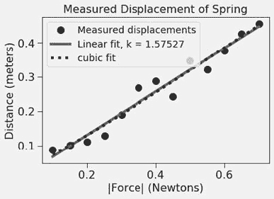

图 20-9 弹性极限的模型

## 20.2 发射体的行为

对于仅仅拉伸弹簧感到厌倦，我们决定用我们的一个弹簧制作一个能够发射发射体的装置。¹⁴⁰ 我们使用该装置四次，将发射体发射到距离发射点`30`码（`1080`英寸）的目标上。每次，我们都测量发射体在距离发射点不同距离时的高度。发射点和目标在同一高度，我们在测量中将其视为`0.0`。

数据存储在一个文件中，部分数据如图 20-10 所示。第一列包含发射体距离目标的距离。其他列包含在该距离下四次实验中发射体的高度。所有测量均以英寸为单位。

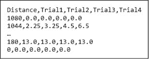

图 20-10 来自发射体实验的数据

图 20-11 中的代码用于绘制四次实验中发射体的平均高度与发射点之间的距离关系。它还绘制了这些点的最佳线性和二次拟合。（如果你忘记了将列表与整数相乘的含义，表达式`[0]*len(distances)`将生成一个包含`len(distances)`个`0`的列表。）

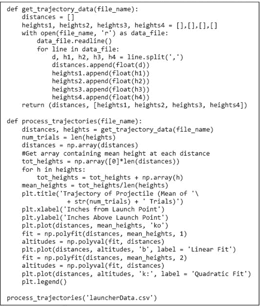

图 20-11 绘制发射体的轨迹

通过快速查看图 20-12 中的图表，很明显，二次拟合远优于线性拟合。¹⁴¹ 但从绝对意义上讲，这条线的拟合有多糟糕，二次拟合又有多好呢？

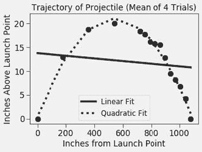

图 20-12 轨迹图

### 20.2.1 决定系数

当我们为一组数据拟合曲线时，我们是在寻找一个将自变量（本例中从发射点水平距离的英寸数）与因变量的预测值（本例中发射点以上的英寸数）关联的函数。询问**拟合优度**相当于询问这些预测的准确性。请记住，拟合是通过最小化均方误差来找到的。这表明我们可以通过查看均方误差来评估拟合优度。该方法的问题在于，虽然均方误差有下界（0），但没有上界。这意味着尽管均方误差对于比较同一数据的两个拟合的相对优度是有用的，但它对于获取拟合的绝对优度的感觉并不特别有用。

我们可以使用**决定系数**计算拟合的绝对优度，通常写作`R`**²**。¹⁴² 设*y[i]*为第*i^(th)*个观察值，*p[i]*为模型预测的对应值，*μ*为观察值的均值。

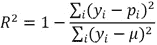

通过将估计误差（分子）与原始值的变异性（分母）进行比较，`R`²旨在捕捉统计模型所解释的数据集中相对于均值的变异比例。当评估的模型由线性回归产生时，`R`²的值始终介于`0`和`1`之间。如果`R`²`= 1`，则模型与数据完全拟合。如果`R`²`= 0`，则模型预测的值与数据围绕均值的分布之间没有关系。

图 20-13 中的代码提供了这个统计度量的直接实现。它的紧凑性源于对 numpy 数组操作的表达能力。表达式`(predicted - measured)**2`从一个数组的元素中减去另一个数组的元素，然后对结果中的每个元素进行平方。表达式`(measured - mean_of_measured)**2`从数组`measured`的每个元素中减去标量值`mean_of_measured`，然后对结果中的每个元素进行平方。

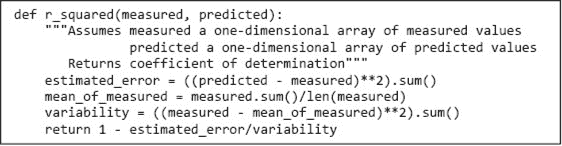

图 20-13 计算 R²

当代码行

```py
print('r**2 of linear fit =', r_squared(mean_heights, altitudes))
```

和

```py
print('r**2 of quadratic fit =', r_squared(mean_heights, altitudes))
```

在`process_trajectories`中适当调用`plt.plot`之后插入时，它们会打印

```py
r**2 of linear fit = 0.0177433205440769
r**2 of quadratic fit = 0.9857653692869693
```

粗略地说，这告诉我们，线性模型只能解释测量数据中不到`2%`的变异，但二次模型可以解释超过`98%`的变异。

### 20.2.2 使用计算模型

现在我们有了一个似乎是我们数据的良好模型，我们可以利用这个模型帮助回答关于我们原始数据的问题。一个有趣的问题是弹道在击中目标时的水平速度。我们可以使用以下思路来设计一个计算，以回答这个问题：

1.  1\. 我们知道，弹道的轨迹由形式为`y = ax`² `+ bx + c`的公式给出，即它是一个抛物线。由于每个抛物线在其顶点处是对称的，我们知道其最高点发生在发射点与目标之间的中间位置；将此距离称为`xMid`。因此，峰值高度 yPeak 由 yPeak = a*xMid² + b*xMid + c 给出。

1.  2\. 如果我们忽略空气阻力（记住没有模型是完美的），我们可以计算弹道从`yPeak`降到目标高度所需的时间，因为这纯粹是重力的函数。它由方程给出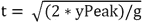。¹⁴³这也是弹道从`xMid`移动到目标所需的时间，因为一旦它到达目标就停止移动。

1.  3\. 给定从`xMid`到目标的时间，我们可以轻松计算该时间段内弹道的平均水平速度。如果我们假设弹道在该时间段内在水平方向上既没有加速也没有减速，我们可以将平均水平速度作为弹道击中目标时水平速度的估计。

图 20-14 实现了这种估算弹道水平速度的技术。¹⁴⁴

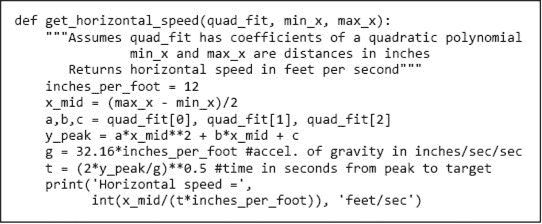

图 20-14 计算弹道的水平速度

当在`process_trajectories (`图 20-11`)`末尾插入行`get_horizontal_speed(fit, distances[-1], distances[0])`时，它会打印。

```py
Horizontal speed = 136 feet/sec
```

我们刚刚经历的步骤序列遵循一个常见模式。

1.  1\. 我们首先进行了一项实验，以获取有关物理系统行为的数据。

1.  2\. 然后我们使用计算来寻找并评估系统行为模型的质量。

1.  3\. 最后，我们使用一些理论和分析设计了一个简单的计算，以推导出模型的一个有趣结果。

**手指练习：** 在真空中，物体下落的速度由方程`v = v0 + gt`定义，其中`v0`是物体的初始速度，`t`是物体下落的秒数，*g*是重力常数，地球表面约为`9.8 m/sec`²，火星上为`3.711 m/sec`²。一位科学家在一个未知星球上测量下落物体的速度。她通过在不同时间点测量物体的下落速度来实现。在时间`0`时，物体的速度为未知的`v0`。实现一个函数，将模型拟合到时间和速度数据上，并估计该星球的`g`和实验的`v0`。它应该返回`g`和`v0`的估计值，以及模型的 r 平方值。

## 20.3 拟合指数分布数据

`Polyfit`使用线性回归来找到某个给定次数的多项式，该多项式是某些数据的最佳最小二乘拟合。如果数据可以直接用多项式近似，它工作得很好。但这并不总是可能。例如，考虑简单的指数增长函数`y = 3`^x。图 20-15 中的代码拟合了一个五次多项式到前十个点，并按图 20-16 中的结果绘制。它使用函数调用`np.arange(10)`，返回一个包含整数`0-9`的`array`。参数设置`markeredgewidth = 2`设置了标记中使用的线条宽度。

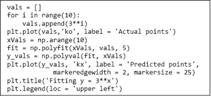

图 20-15 拟合指数分布的多项式曲线

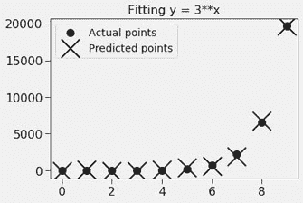

图 20-16 拟合指数分布

拟合对于这些数据点显然是好的。然而，让我们看看模型对`3`²⁰的预测。当我们添加代码时

```py
print('Model predicts that 3**20 is roughly',
      np.polyval(fit, [3**20])[0])
print('Actual value of 3**20 is', 3**20)
```

到图 20-15 的末尾，它打印出，

```py
Model predicts that 3**20 is roughly 2.4547827637212492e+48
Actual value of 3**20 is 3486784401
```

哎呀！尽管拟合了数据，但`polyfit`产生的模型显然不好。这是因为`5`不是正确的次数吗？不。这是因为没有多项式能很好地拟合指数分布。这是否意味着我们无法使用`polyfit`来建立指数分布的模型？幸运的是，不是这样，因为我们可以使用`polyfit`找到一个适合原始独立值和依赖值对数的曲线。

考虑指数序列`[1, 2, 4, 8, 16, 32, 64, 128, 256, 512]`。如果我们对每个值取以`2`为底的对数，我们得到序列`[0, 1, 2, 3, 4, 5, 6, 7, 8, 9]`，即线性增长的序列。实际上，如果一个函数`y = f(x)`表现出指数增长，则`f(x)`的对数（以任何底数）都是线性增长的。这可以通过绘制具有对数 y 轴的指数函数来可视化。代码

```py
x_vals, y_vals = [], []
for i in range(10):
    x_vals.append(i)
    y_vals.append(3**i)
plt.plot(x_vals, y_vals, 'k')
plt.semilogy()
```

产生的图在图 20-17 中。

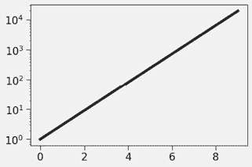

图 20-17 半对数图上的指数

对指数函数取对数会产生线性函数这一事实可以用来构建指数分布的数据点模型，如图 20-18 中的代码所示。我们使用 `polyfit` 找到适合 `x` 值和 `y` 值对数的曲线。请注意，我们还使用了另一个 Python 标准库模块 `math`，它提供了一个 `log` 函数。（我们本可以使用 `np.log2`，但想指出 `math` 有一个更通用的对数函数。）

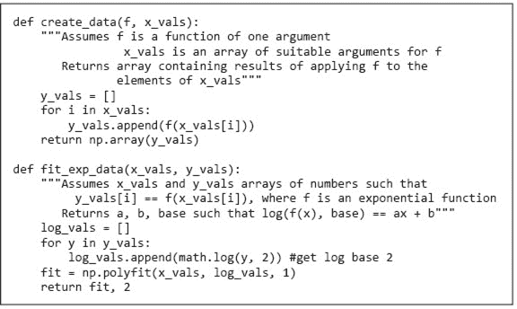

图 20-18 使用 `polyfit` 拟合指数函数

运行时，代码

```py
x_vals = range(10)
f = lambda x: 3**x
y_vals = create_data(f, x_vals)
plt.plot(x_vals, y_vals, 'ko', label = 'Actual values')
fit, base = fit_exp_data(x_vals, y_vals)
predictedy_vals = []
for x in x_vals:
    predictedy_vals.append(base**np.polyval(fit, x))
plt.plot(x_vals, predictedy_vals, label = 'Predicted values')
plt.title('Fitting an Exponential Function')
plt.legend(loc = 'upper left')
#Look at a value for x not in original data
print('f(20) =', f(20))
print('Predicted value =', int(base**(np.polyval(fit, [20]))))
```

生成的图在图 20-19 中，实际值与预测值重合。此外，当模型在一个未用于生成拟合值的值（`20`）上进行测试时，它输出为

```py
f(20) = 3486784401
Predicted value = 3486784401 
```

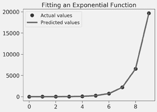

图 20-19 指数函数的拟合

使用 `polyfit` 找到数据模型的方法适用于关系可以用形式为 `y = base`^(ax+b) 的方程描述的情况。如果用于不适合此模型的数据，将会产生糟糕的结果。

为了看到这一点，我们使用

```py
f = lambda x: 3**x + x
```

该模型现在的预测效果很差，输出为

```py
f(20) = 3486784421
Predicted value = 2734037145
```

## 20.4 当理论缺失时

在本章中，我们强调了理论、实验和计算科学之间的相互作用。然而，有时我们发现自己拥有大量有趣的数据，却几乎没有理论。在这种情况下，我们通常 resort to 使用计算技术通过构建一个似乎符合数据的模型来发展理论。

在理想情况下，我们会进行一次受控实验（例如，从弹簧上挂重物），研究结果，然后回顾性地制定与结果一致的模型。接着我们会进行新的实验（例如，从同一个弹簧上挂不同的重物），并将实验结果与模型预测进行比较。

不幸的是，在许多情况下，甚至无法进行一次受控实验。举个例子，假设建立一个模型来揭示利率如何影响股价。我们中的很少有人有能力设定利率并观察结果。另一方面，相关的历史数据却是源源不断的。

在这种情况下，我们可以通过将现有数据分为**训练集**和**保留集**来模拟一组实验，用作**测试集**。在不查看保留集的情况下，我们建立一个似乎能解释训练集的模型。例如，我们找到一个对训练集具有合理 `R`² 的曲线。然后我们在保留集上测试该模型。大多数情况下，该模型会比保留集拟合训练集得更好。但是如果模型是好的，它应该能合理地拟合保留集。如果没有，那么该模型可能应该被舍弃。

我们如何选择训练集？我们希望它能代表整个数据集。一种方法是随机选择训练集的样本。如果数据集足够大，这通常效果不错。

检查模型的另一种相关但稍微不同的方法是对原始数据的多个随机选择子集进行训练，并查看模型之间的相似程度。如果它们非常相似，那么我们可以比较有信心。这种方法称为**交叉验证**。

交叉验证在第二十一章和第二十四章中有更详细的讨论。

## 20.5 在章节中引入的术语

+   胡克定律

+   弹性极限

+   弹簧常数

+   曲线拟合

+   最小二乘法

+   线性回归

+   多项式回归

+   过拟合

+   拟合优度

+   决定系数 (R²)

+   训练集

+   测试集

+   保留集

+   交叉验证
