# 第二十三章：使用 PANDAS 探索数据

本书后半部分的大部分内容都集中在构建各种计算模型上，这些模型可以用来从数据中提取有用的信息。在接下来的章节中，我们将快速了解使用机器学习从数据构建模型的简单方法。

然而，在这样做之前，我们将查看一个流行的库，它可以快速帮助我们熟悉数据集，然后再深入到更详细的分析中。**Pandas**¹⁷³ 是建立在 numpy 之上的。Pandas 提供了促进

+   组织数据

+   计算数据的简单统计

+   以便于未来分析的格式存储数据

## 23.1 DataFrames 和 CSV 文件

Pandas 中的一切都是围绕 **DataFrame** 类型构建的。DataFrame 是一个可变的二维表格数据结构，具有标记的轴（行和列）。可以将其视为一种增强版的电子表格。

虽然可以使用 Python 代码从头构建 DataFrame，但创建 DataFrame 更常见的方法是通过读取 **CSV 文件**。正如我们在第十九章中看到的，CSV 文件的每一行由一个或多个值组成，这些值由逗号分隔。¹⁷⁴ CSV 文件通常用于以纯文本格式存储表格数据。在这种情况下，行通常具有相同数量的字段。由于它们是纯文本，因此经常用于将数据从一个应用程序移动到另一个应用程序。例如，大多数电子表格程序允许用户将电子表格的内容写入 CSV 文件。

图 23-1 显示了一个 DataFrame，其中包含关于 2019 年 FIFA 女子世界杯后期轮次的信息。每一列代表一个称为 **series** 的东西。每一行都有一个 **index** 相关联。默认情况下，索引是连续的数字，但它们并不一定需要如此。每一列都有一个 **name** 相关联。正如我们将看到的，这些名称的作用类似于字典中的键。

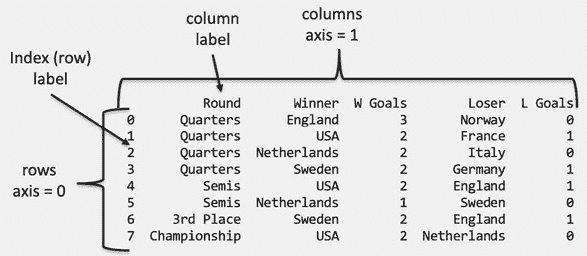

图 23-1 一个绑定到变量 wwc 的示例 Pandas DataFrame

在 图 23-1 中显示的 DataFrame 是使用下面的代码和 图 23-2 中所示的 CSV 文件生成的。

```py
import pandas as pd
`wwc = pd.read_csv('wwc2019_q-f.csv') print(wwc)`
```

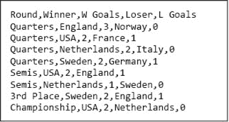

图 23-2 一个示例 CSV 文件

在导入 Pandas 后，代码使用 Pandas 的函数 `read_csv` 来读取 CSV 文件，然后以 图 23-1 中所示的表格形式打印出来。如果 DataFrame 具有大量的行或列，`print` 将在 DataFrame 的中心用省略号替换列和/或行。这可以通过首先使用 DataFrame 方法 `to_string` 将 DataFrame 转换为字符串来避免。

一行索引和一个列标签一起指示一个数据单元（如在电子表格中）。我们将在第 23.3 节讨论如何访问单个单元和单元组。通常，但并不总是，列中的单元格都是同一种类型。在 图 23-1 的 DataFrame 中，`Round`、`Winner` 和 `Loser` 列中的每个单元格都是 `str` 类型。`W Goals` 和 `L Goals` 列中的单元格是 `numpy.int64` 类型。如果你将它们视为 Python 的整型，你就不会有问题。

我们可以直接使用属性 `index`、`columns` 和 `values` 访问 DataFrame 的三个组成部分。

`index` 属性的类型为 `RangeIndex`。例如，`wwc.index` 的值为 `RangeIndex(start=0, stop=8, step=1)`。因此，代码

```py
for i in wwc.index:
    print(i)
```

将按升序打印整数 0-7。

`columns` 属性的类型为 `Index`。例如，值 `wwc.columns` 是 `Index(['Round', 'Winner', 'W Goals', 'Loser', 'L Goals'], dtype='object')`，而代码

```py
for c in wwc.columns:
    print(c)
```

打印

```py
Round
Winner
W Goals
Loser
L Goals
```

`values` 属性的类型为 `numpy.ndarray`。在第十三章中，我们介绍了类型 `numpy.array`。事实证明，`array` 是 `ndarray` 的特殊情况。虽然数组是一维的（像其他序列类型一样），但 ndarrays 可以是多维的。ndarray 的维数和项目数称为其 **shape**，并用一个表示每个维度大小的非负整数元组表示。值 `wwc.values` 是二维 ndarrays

```py
[['Quarters' 'England' 3 'Norway' 0]
 ['Quarters' 'USA' 2 'France' 1]
 ['Quarters' 'Netherlands' 2 'Italy' 0]
 ['Quarters' ‘Sweden' 2 'Germany' 1]
 ['Semis' 'USA' 2 'England' 1]
 ['Semis' 'Netherlands' 1 ‘Sweden' 0]
 ['3rd Place' ‘Sweden' 2 'England' 1]
 ['Championship' 'USA' 2 'Netherlands' 0]]
```

由于它有八行五列，因此它的形状为 `(8, 5)`。

## 23.2 创建系列和 DataFrame

实际上，Pandas 的 DataFrame 通常是通过加载存储为 SQL 数据库、CSV 文件或与电子表格应用程序相关的格式的数据集来创建的。然而，有时使用 Python 代码构建系列和 DataFrame 是有用的。

表达式 `pd.DataFrame()` 生成一个空的 DataFrame，而语句 `print(pd.DataFrame())` 产生的输出

```py
Empty DataFrame
Columns: []
Index: []
```

创建一个非空 DataFrame 的简单方法是传入一个列表。例如，代码

```py
rounds = ['Semis', ‘Semis', '3rd Place', 'Championship']
print(pd.DataFrame(rounds))
```

打印

```py
              0
0         Semis
1         Semis
2     3rd Place
3  Championship
```

请注意，Pandas 为 DataFrame 的唯一一列自动生成了一个标签，尽管这个标签并不是特别描述性。为了获得更具描述性的标签，我们可以传入一个字典而不是一个列表。例如，代码 `print(pd.DataFrame({'Round': rounds}))` 会打印

```py
          Round
0         Semis
1         Semis
2     3rd Place
3  Championship
```

要直接创建一个具有多列的 DataFrame，我们只需传入一个包含多个条目的字典，每个条目由一个列标签作为键和一个与每个键相关联的列表作为值。这些列表必须具有相同的长度。例如，代码

```py
rounds = ['Semis', ‘Semis', '3rd Place', 'Championship']
teams = ['USA', 'Netherlands', ‘Sweden', 'USA']
df = pd.DataFrame({'Round': rounds, 'Winner': teams})
print(df)
```

打印

```py
          Round       Winner
0         Semis          USA
1         Semis  Netherlands
2     3rd Place       Sweden
3  Championship          USA
```

一旦创建了 DataFrame，就很容易添加列。例如，语句 `df['W Goals'] = [2, 1, 0, 0]` 会修改 `df`，使其值变为

```py
          Round       Winner  W Goals
0         Semis          USA        2
1         Semis  Netherlands        1
2     3rd Place       Sweden        0
3  Championship          USA        0
```

就像字典中与键关联的值可以被替换一样，与列关联的值也可以被替换。例如，在执行语句`df['W Goals'] = [2, 1, 2, 2]`后，`df`的值变为

```py
          Round       Winner  W Goals
0         Semis          USA        2
1         Semis  Netherlands        1
2     3rd Place       Sweden        2
3  Championship          USA        2
```

从 DataFrame 中删除列也是很简单的。函数调用`print(df.drop('Winner', axis = 'columns'))`会打印出

```py
          Round  W Goals
0         Semis        2
1         Semis        1
2     3rd Place        2
3  Championship        2
```

并且`df`保持不变。如果在调用`drop`时没有包含`axis = 'columns'`（或等效地`axis = 1`），则轴将默认为`'rows'`（等效于`axis = 0`），这将导致生成异常`KeyError: "['Winner'] not found in axis."`

如果一个 DataFrame 很大，以这种方式使用`drop`是低效的，因为这需要复制 DataFrame。通过将`drop`的`inplace`关键字参数设置为`True`，可以避免复制。调用`df.drop('Winner', axis = 'columns', inplace = True)`会修改`df`并返回`None`。

可以使用`DataFrame`构造函数将行添加到 DataFrame 的开头或末尾，然后使用`concat`函数将新 DataFrame 与现有 DataFrame 组合。例如，代码

```py
quarters_dict = {'Round': ['Quarters']*4,
                 'Winner': ['England', 'USA', 'Netherlands', ‘Sweden'],
                 'W Goals': [3, 2, 2, 2]}
df = pd.concat([pd.DataFrame(quarters_dict), df], sort = False)
```

将`df`设置为

```py
          Round       Winner  W Goals
0      Quarters      England        3
1      Quarters          USA        2
2      Quarters  Netherlands        2
3      Quarters       Sweden        2
0         Semis          USA        2
1         Semis  Netherlands        1
2     3rd Place       Sweden        2
3  Championship          USA        2
```

如果将关键字参数`sort`设置为`True`，`concat`也会根据列标签的字典序改变列的顺序。也就是说，

```py
pd.concat([pd.DataFrame(quarters_dict), df], sort = True)
```

交换最后两列的位置并返回 DataFrame。

```py
          Round  W Goals       Winner
0      Quarters        3      England
1      Quarters        2          USA
2      Quarters        2  Netherlands
3      Quarters        2       Sweden
0         Semis        2          USA
1         Semis        1  Netherlands
2     3rd Place        2       Sweden
3  Championship        2          USA
```

如果没有提供`sort`的值，则默认为`False`。

注意每个连接的 DataFrame 的索引保持不变。因此，会有多个具有相同索引的行。可以使用`reset_index`方法重置索引。例如，表达式`df.reset_index(drop = True)`的值为

```py
             Round       Winner  W Goals
0      Quarters      England        3
1      Quarters          USA        2
2      Quarters  Netherlands        2
3      Quarters       Sweden        2
4         Semis          USA        2
5         Semis  Netherlands        1
6     3rd Place       Sweden        2
7  Championship          USA        2
```

如果`reset_index`被调用时`drop = False`，则会向 DataFrame 添加一个包含旧索引的新列。该列被标记为`index`。

你可能会想知道为什么 Pandas 甚至允许重复索引。原因是使用语义上有意义的索引来标记行通常是有帮助的。例如，`df.set_index('Round')`的值为

```py
                   Winner  W Goals
Round                             
Quarters          England        3
Quarters              USA        2
Quarters      Netherlands        2
Quarters           Sweden        2
Semis                 USA        2
Semis         Netherlands        1
3rd Place          Sweden        2
Championship          USA        2
```

## 23.3 选择列和行

对于 Python 中的其他复合类型，方括号是选择 DataFrame 部分的主要机制。要选择 DataFrame 的单列，只需将列的标签放在方括号之间。例如，`wwc['Winner']`的值为

```py
0        England
1            USA
2    Netherlands
3         Sweden
4            USA
5    Netherlands
6         Sweden
7            USA
```

该对象的类型是`**Series**`，即它不是 DataFrame。Series 是一维值序列，每个值都有一个索引标签。要从 Series 中选择单个项目，我们在系列后面的方括号中放入一个索引。因此，`wwc['Winner'][3]`的值为字符串`Sweden`。

我们可以使用`for`循环遍历一个序列。例如，

```py
winners = ''
for w in wwc['Winner']:
    winners += w + ','
print(winners[:-1])
```

打印出`England,USA,Netherlands,Sweden,USA,Netherlands,Sweden,USA`。

**指尖练习：** 编写一个函数，返回获胜者所进球的总和。

方括号也可以用来从 DataFrame 中选择多个列。这是通过在方括号内放置列标签的列表来完成的。这将产生一个 DataFrame 而不是 Series。例如，`wwc[['Winner', 'Loser']]`产生的 DataFrame 为：

```py
        Winner        Loser
0      England       Norway
1          USA       France
2  Netherlands        Italy
3       Sweden      Germany
4          USA      England
5  Netherlands       Sweden
6       Sweden      England
7          USA  Netherlands
```

选择方括号中的标签列表的顺序不必与原始 DataFrame 中的标签顺序相同。这使得通过选择来重新组织 DataFrame 变得方便。例如，`wwc[['Round','Winner','Loser','W Goals','L Goals']]`返回的 DataFrame 为：

```py
          Round       Winner        Loser  W Goals  L Goals
0      Quarters      England       Norway        3        0
1      Quarters          USA       France        2        1
2      Quarters  Netherlands        Italy        2        0
3      Quarters       Sweden      Germany        2        1
4         Semis          USA      England        2        1
5         Semis  Netherlands       Sweden        1        0
6     3rd Place       Sweden      England        2        1
7  Championship          USA  Netherlands        2        0
```

请注意，尝试通过将行的索引放入方括号中来选择一行将不起作用。这将产生一个`KeyError`异常。然而，奇怪的是，我们可以通过切片选择行。因此，虽然`wwc[1]`会导致异常，`wwc[1:2]`会产生一个包含单行的 DataFrame。

```py
 Round Winner  W Goals   Loser  L Goals
 1  Quarters    USA        2  France        1
```

我们将在下一小节讨论其他选择行的方法。

### 23.3.1 使用 loc 和 iloc 进行选择

`**loc**`方法可以用于从 DataFrame 中选择行、列或行列的组合。重要的是，所有选择都是通过标签进行的。这一点值得强调，因为某些标签（例如索引）看起来可能像数字。

如果`df`是一个 DataFrame，则表达式`df.loc[label]`返回与`df`中`label`关联的行对应的 Series。例如，`wwc.loc[3]`返回的 Series 为：

```py
Round      Quarters
Winner       Sweden
W Goals           2
Loser       Germany
L Goals           1
```

请注意，`wwc`的列标签是 Series 的索引标签，与这些标签相关联的值是`wwc`中标签为`3`的行对应列的值。

要选择多行，我们只需在`.loc`后面的方括号内放置标签列表（而不是单个标签）。这样做时，表达式的值是一个 DataFrame 而不是一个 Series。例如，表达式`wwc.loc[[1,3,5]]`产生：

```py
      Round       Winner  W Goals    Loser  L Goals
1  Quarters          USA        2   France        1
3  Quarters       Sweden        2  Germany        1
5     Semis  Netherlands        1   Sweden        0
```

请注意，新 DataFrame 中每一行的索引是旧 DataFrame 中该行的索引。

切片提供了另一种选择多行的方法。一般形式为`df.loc[first:last:step]`。如果未提供`first`，则默认为 DataFrame 中的第一个索引。如果未提供`last`，则默认为 DataFrame 中的最后一个索引。如果未提供`step`，则默认为`1`。表达式`wwc.loc[3:7:2]`产生的 DataFrame 为：

```py
          Round       Winner  W Goals        Loser  L Goals
3      Quarters       Sweden        2      Germany        1
5         Semis  Netherlands        1       Sweden        0
7  Championship          USA        2  Netherlands        0
```

作为一名 Python 程序员，你可能会惊讶于标签为`7`的行被包含在内。对于其他 Python 数据容器（如列表），切片时最后一个值会被排除，但对于 DataFrame 则不是这样。¹⁷⁵ 表达式`wwc.loc[6:]`产生的 DataFrame 为：

```py
          Round  Winner  W Goals        Loser  L Goals
6     3rd Place  Sweden        2      England        1
7  Championship     USA        2  Netherlands        0
```

表达式`wwc.loc[:2]`产生：

```py
      Round       Winner  W Goals   Loser  L Goals
0  Quarters      England        3  Norway        0
1  Quarters          USA        2  France        1
2  Quarters  Netherlands        2   Italy        0
```

**指尖练习：** 写一个表达式，选择`wwc`中所有偶数编号的行。

如前所述，`loc`可以用来同时选择行和列的组合。这是通过类似以下形式的表达式完成的：

```py
df.loc[*row_selector*, *column_selector*]
```

行和列选择器可以使用之前讨论过的任何机制编写，即单个标签、标签列表或切片表达式。例如，`wwc.loc[0:2, 'Round':'L Goals':2]`生成

```py
 Round  W Goals  L Goals 
0  Quarters        3        0 
1  Quarters        2        1 
2  Quarters        2        0
```

**手指练习：** 写一个生成数据框的表达式

```py
 Round       Winner  W Goals   Loser  L Goals
1  Quarters          USA        2  France        1
2  Quarters  Netherlands        2   Italy        0
```

到目前为止，如果你把索引标签视为整数，你是不会错的。让我们看看当 1)标签不是数字型，2)有多行具有相同标签时，选择是如何工作的。让`wwc_by_round`成为数据框

```py
                   Winner  W Goals        Loser  L Goals
Round                                                   
Quarters          England        3       Norway        0
Quarters              USA        2       France        1
Quarters      Netherlands        2        Italy        0
Quarters           Sweden        2      Germany        1
Semis                 USA        2      England        1
Semis         Netherlands        1       Sweden        0
3rd Place          Sweden        2      England        1
Championship          USA        2  Netherlands        0
```

你认为表达式`wwc_by_round.loc['Semis']`的结果是什么？它选择所有标签为`Semis`的行，以返回

```py
            Winner  W Goals    Loser  L Goals
Round                                        
Semis          USA        2  England        1
Semis  Netherlands        1   Sweden        0
```

同样，`wwc_by_round.loc[['Semis', 'Championship']]`选择所有标签为`Semis`或`Championship`的行：

```py
                   Winner  W Goals        Loser  L Goals
Round                                                   
Semis                 USA        2      England        1
Semis         Netherlands        1       Sweden        0
Championship          USA        2  Netherlands        0
```

切片也适用于非数字索引。表达式

```py
`wwc_by_round.loc['Quarters':'Semis':2]`
```

通过选择标记为`Quarters`的第一行，然后选择每隔一行，直到经过标记为`Semis`的行，生成

```py
               Winner  W Goals    Loser  L Goals
Round                                           
Quarters      England        3   Norway        0
Quarters  Netherlands        2    Italy        0
Semis             USA        2  England        1
```

现在，假设我们想选择标记为`Quarters`的第二行和第三行。我们不能简单地写`wwc_by_round.loc['Quarters']`，因为那样会选择所有四行标记为`Quarters`。使用`iloc`方法。

`**iloc**`方法类似于`loc`，但它是基于整数而不是标签（因此有`i`在`iloc`中）。数据框的第一行是`iloc 0`，第二行为`iloc 1`，依此类推。因此，要选择标记为`Quarters`的第二行和第三行，我们写`wwc_by_round.iloc[[1,2]]`。

### 23.3.2 按组选择

将数据框分成子集，并对每个子集分别应用一些聚合或转换，通常很方便。`groupby`方法使得这种操作变得简单。

假设，例如，我们想知道每轮中获胜和失利球队总进球数。代码

```py
grouped_by_round = wwc.groupby('Round')
```

将`group_by_round`绑定到类型为`DataFrameGroupBy`的对象。我们可以对该对象应用聚合器`sum`以生成一个数据框。代码

```py
grouped_by_round = wwc.groupby('Round')
print(grouped_by_round.sum())
```

打印

```py
               W Goals  L Goals
Round                         
3rd Place           2        1
Championship        2        0
Quarters            9        2
Semis               3        1
```

代码`print(wwc.groupby('Winner').mean())`打印出

```py
             W Goals   L Goals
Winner                        
England          3.0  0.000000
Netherlands      1.5  0.000000
Sweden           2.0  1.000000
USA              2.0  0.666667
```

从中我们可以很容易地看出，英格兰在赢得的比赛中平均进了三球，同时零封了对手。

代码`print(wwc.groupby(['Loser', 'Round']).mean())`打印出

```py
`                          W Goals  L Goals Loser       Round                          England     3rd Place           2        1             Semis               2        1 France      Quarters            2        1 Germany     Quarters            2        1 Italy       Quarters            2        0 Netherlands Championship        2        0 Norway      Quarters            3        0 Sweden      Semis               1        0`
```

从中我们可以很容易地看出，英格兰在输掉的比赛中平均进了一球，而丢了两个。

### 23.3.3 按内容选择

假设我们想从数据框中选择瑞典赢得的所有比赛的行，如图 23-1。由于这个数据框比较小，我们可以查看每一行并找到对应比赛的行索引。当然，这种方法不适用于大型数据框。幸运的是，使用称为**布尔索引**的东西可以轻松根据内容选择行。

基本思想是编写一个逻辑表达式，引用 DataFrame 中的值。该表达式随后在 DataFrame 的每一行上进行评估，评估结果为 `True` 的行将被选中。表达式 `wwc.loc[wwc['Winner'] == 'Sweden']` 评估为 DataFrame

```py
       Round  Winner  W Goals    Loser  L Goals
3   Quarters  Sweden        2  Germany        1
6  3rd Place  Sweden        2  England        1
```

提取所有涉及瑞典的比赛稍微复杂一些。逻辑运算符 `**&**`（对应于与），`**|**`（对应于或）和 `**–**`（对应于非）可用于形成表达式。表达式 `wwc.loc[(wwc['Winner'] == 'Sweden') | (wwc['Loser'] == 'Sweden')]` 返回

```py
 Round       Winner  W Goals    Loser  L Goals
3   Quarters       Sweden        2  Germany        1
5      Semis  Netherlands        1   Sweden        0
6  3rd Place       Sweden        2  England        1
```

请注意，逻辑表达式两个子项周围的括号是必要的，因为在 Pandas 中，`|` 的优先级高于 `==`。

**练习:** 编写一个表达式，返回一个包含美国参赛但法国没有参赛的比赛的 DataFrame。

如果我们预计会进行许多查询以选择某个国家参与的比赛，定义一个函数可能会很方便。

```py
   def get_country(df, country):
    """df a DataFrame with series labeled Winner and Loser
       country a str
       returns a DataFrame with all rows in which country appears
       in either the Winner or Loser column"""
    return df.loc[(df['Winner'] == country) | (df['Loser'] == country)]
```

由于 `get_country` 返回一个 DataFrame，因此通过组合两次调用 `get_country` 很容易提取成对球队之间的比赛。例如，评估 `get_country(get_country(wwc, 'Sweden'),'Germany')` 提取了这两支球队之间的一场比赛（球队在淘汰赛阶段最多相互对阵一次）。

假设我们想要对 `get_country` 进行概括，使其接受国家列表作为参数并返回列表中任何国家参加的所有比赛。我们可以使用 `isin` 方法来实现：

```py
  def get_games(df, countries):
    return df[(df['Winner'].isin(countries)) |
            (df['Loser'].isin(countries))]
```

`isin` 方法通过在指定列中选择仅包含指定值（或指定值集合中的元素）的行来过滤 DataFrame。在 `get_games` 的实现中，表达式 `df['Winner'].isin(countries)` 选择了 `df` 中 `Winner` 列包含 `countries` 列表中的元素的行。

**练习:** 打印一个只包含瑞典与德国或荷兰比赛的 DataFrame。

## 23.4 在 DataFrame 中操作数据

我们现在已经查看了一些创建和选择 DataFrame 部分的简单方法。创建 DataFrame 的一个原因是能够轻松提取聚合信息。让我们首先看看如何从 DataFrame `wwc` 中提取聚合信息，如 图 23-1 所示。

DataFrame 的列可以以类似于我们对 numpy 数组操作的方式进行操作。例如，类似于表达式 `2*np.array([1,2,3])` 评估为数组 `[2 4 6]`，表达式 `2*wwc['W Goals']` 评估为系列

```py
0    6
1    4
2    4
3    4
4    4
5    2
6    4
7    4
```

表达式 `wwc['W Goals'].sum()` 对 `W Goals` 列中的值进行求和，得到值 `16`。类似地，表达式

```py
(wwc[wwc['Winner'] == ‘Sweden']['W Goals'].sum() +
wwc[wwc['Winner'] == ‘Sweden']['L Goals'].sum())
```

计算瑞典队进球总数为 `6`，并且表达式

```py
`(wwc['W Goals'].sum() - wwc['L Goals'].sum())/len(wwc['W Goals'])`
```

计算 DataFrame 中比赛的平均进球差为 `1.5`。

**手指练习：** 写一个表达式，计算所有轮次中进球的总数。

**手指练习：** 写一个表达式，计算四分之一决赛中输球队进球的总数。

假设我们想添加一列，包含所有比赛的进球差异，并添加一行，总结所有包含数字的列的总计。添加列很简单。我们只需执行`wwc['G Diff'] = wwc['W Goals'] - wwc['L Goals']`。添加行则更复杂。我们首先创建一个包含所需行内容的字典，然后使用该字典创建一个只包含新行的新数据框。接着，我们使用`concat`函数将`wwc`和新数据框连接起来。

```py
#Add new column to wwc
wwc['G Diff'] = wwc['W Goals'] - wwc['L Goals']
#create a dict with values for new row
new_row_dict = {'Round': ['Total'],
           'W Goals': [wwc['W Goals'].sum()],
           'L Goals': [wwc['L Goals'].sum()],
           'G Diff': [wwc['G Diff'].sum()]}
#Create DataFrame from dict, then pass it to concat
new_row = pd.DataFrame(new_row_dict)
wwc = pd.concat([wwc, new_row], sort = False).reset_index(drop = True)
```

这段代码生成了数据框。

```py
          Round       Winner  W Goals        Loser  L Goals  G Diff
0      Quarters      England        3       Norway        0       3
1      Quarters          USA        2       France        1       1
2      Quarters  Netherlands        2        Italy        0       2
3      Quarters       Sweden        2      Germany        1       1
4         Semis          USA        2      England        1       1
5         Semis  Netherlands        1       Sweden        0       1
6     3rd Place       Sweden        2      England        1       1
7  Championship          USA        2  Netherlands        0       2
8         Total          NaN       16          NaN        4      12
```

注意，当我们尝试对不包含数字的列中的值求和时，Pandas 没有产生异常。相反，它提供了特殊值`NaN`（非数字）。

除了提供简单的算术操作，如求和和均值，Pandas 还提供计算各种有用统计函数的方法。其中最有用的是`corr`，用于计算两个系列之间的**相关性**。

相关性是一个介于-1 和 1 之间的数字，提供有关两个数值之间关系的信息。正相关表明一个变量的值增加时，另一个变量的值也增加；负相关表明一个变量的值增加时，另一个变量的值减少。相关性为零表示变量之间没有关系。

最常用的相关性度量是皮尔逊相关性。皮尔逊相关性衡量两个变量之间线性关系的强度和方向。除了皮尔逊相关性外，Pandas 还支持其他两种相关性度量，斯皮尔曼和肯德尔。这三种度量之间存在重要差异（例如，斯皮尔曼对异常值的敏感性低于皮尔逊，但仅对单调关系有用），但讨论何时使用哪一种超出了本书的范围。

要打印`W Goals`、`L Goals`和`G Diff`的皮尔逊成对相关性（并排除包含总计的行），我们只需执行。

```py
print(wwc.loc[wwc['Round'] != ‘Total'].corr(method = 'pearson'))
```

这产生了。

```py
          W Goals   L Goals    G Diff
W Goals  1.000000  0.000000  0.707107
L Goals  0.000000  1.000000 -0.707107
G Diff   0.707107 -0.707107  1.000000
```

对角线上的值都是 1，因为每个系列与自身完全正相关。不出所料，进球差异与获胜队的进球数强正相关，而与输球队的进球数强负相关。获胜者和输者进球之间较弱的负相关在职业足球中也有其道理。¹⁷⁶

## 23.5 扩展示例

在本节中，我们将查看两个数据集，一个包含 21 个美国城市的历史温度数据，另一个包含全球化石燃料使用的历史数据。

### 23.5.1 温度数据

代码

```py
pd.set_option('display.max_rows', 6)
pd.set_option('display.max_columns', 5)
temperatures = pd.read_csv('US_temperatures.csv')
print(temperatures)
```

打印

```py
           Date  Albuquerque  ...  St Louis  Tampa
0      19610101        -0.55  ...     -0.55  15.00
1      19610102        -2.50  ...     -0.55  13.60
2      19610103        -2.50  ...      0.30  11.95
        ...          ...  ...       ...    ...
20085  20151229        -2.15  ...      1.40  26.10
20086  20151230        -2.75  ...      0.60  25.55
20087  20151231        -0.75  ...     -0.25  25.55
[20088 rows x 22 columns]
```

前两行代码设置了默认选项，以限制打印 DataFrame 时显示的行数和列数。这些选项的作用类似于我们用于设置各种绘图默认值的`rcParams`。函数`reset_option`可以用来将选项恢复为系统默认值。

这个 DataFrame 以一种便于查看特定日期不同城市天气的方式组织。例如，查询

```py
temperatures.loc[temperatures['Date']==19790812][['New York','Tampa']]
```

告诉我们在 1979 年 8 月 12 日，纽约的温度为 15°C，坦帕为 25.55°C。

**手指练习：** 写一个表达式，如果 2000 年 10 月 31 日凤凰城比坦帕温暖则评估为`True`，否则评估为`False`。

**手指练习：** 编写代码提取凤凰城温度为 41.4°C 的日期。¹⁷⁷

不幸的是，查看 21 个城市在 20,088 个日期的数据并不能直接洞察与温度趋势相关的大问题。让我们开始添加提供每日温度汇总信息的列。代码

```py
temperatures['Max T'] = temperatures.max(axis = 'columns')
temperatures['Min T'] = temperatures.min(axis = 'columns')
temperatures['Mean T'] = round(temperatures.mean(axis = 'columns'), 2)
print(temperatures.loc[20000704:20000704])
```

打印

```py
 Date  Albuquerque  ...  Min T      Mean T
```

```py
14429  20000704        26.65  ...  15.25  1666747.37
```

2000 年 7 月 4 日，那 21 个城市的平均温度真的比太阳表面的温度高很多吗？可能不是。更可能的是我们的代码存在 bug。问题在于我们的 DataFrame 将日期编码为数字，而这些数字用于计算每行的平均值。从概念上讲，考虑日期作为温度系列的索引可能更有意义。因此，让我们将 DataFrame 中的日期改为索引。代码

```py
temperatures.set_index('Date', drop = True, inplace = True)
temperatures['Max'] = temperatures.max(axis = 'columns')
temperatures['Min'] = temperatures.min(axis = 'columns')
temperatures['Mean T'] = round(temperatures.mean(axis = 'columns'), 2)
print(temperatures.loc[20000704:20000704])
```

打印更可信的

```py
          Albuquerque  Baltimore  ...  Min T  Mean T
Date                              ...               
20000704        26.65      25.55  ...  15.25   24.42
```

顺便提一下，由于`Date`不再是列标签，我们不得不使用不同的打印语句。我们为什么要用切片选择单行？因为我们想创建一个 DataFrame 而不是一个系列。

我们现在可以开始绘制一些显示各种趋势的图表。例如，

```py
plt.figure(figsize = (14, 3)) #set aspect ratio for figure
plt.plot(list(temperatures['Mean T']))
plt.title('Mean Temp Across 21 US Cities')
plt.xlabel('Days Since 1/1/1961')
plt.ylabel('Degrees C')
```

生成的图表显示了美国温度的季节性。请注意，在绘制平均温度之前，我们将系列转换为列表。如果直接绘制系列，它将使用系列的索引（代表日期的整数）作为 x 轴。这将产生一种相当奇怪的图，因为 x 轴上的点会奇怪地间隔。例如，1961 年 12 月 30 日和 1961 年 12 月 31 日之间的距离为 1，但 1961 年 12 月 31 日和 1962 年 1 月 1 日之间的距离为 8870（19620,101 – 19611231）。

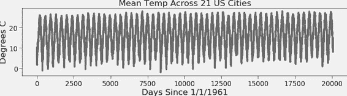

通过放大几年的数据并使用调用`plt.plot(list(temperatures['Mean T'])[0:3*365])`生成图表，我们可以更清楚地看到季节模式。

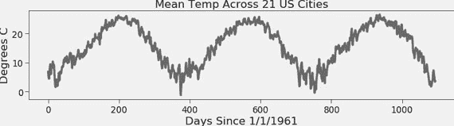

在过去的几十年里，关于地球变暖的共识已经形成。让我们看看这些数据是否与这一共识一致。由于我们正在研究一个关于长期趋势的假设，可能不应关注每日或季节性的温度变化。相反，让我们看一下年度数据。

作为第一步，让我们使用`temperatures`中的数据构建一个新的数据框，其中行代表年份而不是天。执行此操作的代码包含在图 23-3 和图 23-4 中。大部分工作在函数`get_dict`中完成， 图 23-3 返回一个字典，将年份映射到一个字典，该字典给出与不同标签相关的该年份的值。`get_dict`的实现使用`iterrows`遍历`temperatures`中的行。该方法返回一个迭代器，每一行返回一个包含索引标签和该行内容的系列对。可以使用列标签选择生成系列的元素。¹⁷⁸

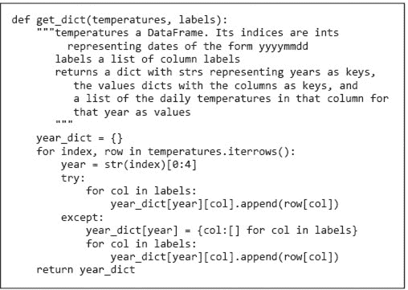

图 23-3 构建一个将年份映射到温度数据的字典

如果`test`是数据框。

```py
          Max T  Min T  Mean T
Date                          
19611230  24.70 -13.35    3.35
19611231  24.75 -10.25    5.10
19620101  25.55 -10.00    5.70
19620102  25.85  -4.45    6.05
```

调用`get_dict(test, ['Max', 'Min'])`将返回字典。

```py
{'1961': {'Max T': [24.7, 24.75], 'Min T': [-13.35, -10.25], 'Mean T': [3.35, 5.1]}, '1962': {'Max T': [25.55, 25.85], 'Min T': [-10.0, -4.45], 'Mean T': [5.7, 6.05]}}
```

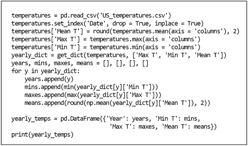

图 23-4 围绕年份构建数据框

在图 23-4 中调用`get_dict`后的代码构建了一个包含出现在`temperatures`中的每一年的列表，以及包含这些年的最低、最高和平均温度的附加列表。最后，它使用这些列表构建数据框`yearly_temps`：

```py
    Year  Min T  Max T  Mean T
0   1961 -17.25  38.05   15.64
1   1962 -21.65  36.95   15.39
2   1963 -24.70  36.10   15.50
..   ...    ...    ...     ...
52  2013 -15.00  40.55   16.66
53  2014 -22.70  40.30   16.85
54  2015 -18.80  40.55   17.54
```

现在我们已经以便于处理的格式获得了数据，让我们生成一些图表来可视化温度随时间的变化。 图 23-5 中的代码生成了图 23-6 中的图表。

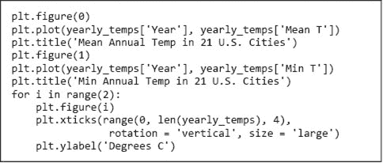

图 23-5 生成与年份相关的温度测量图

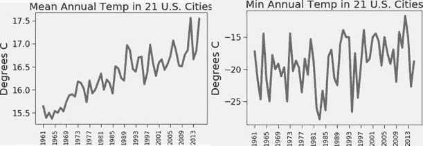

图 23-6 年度平均和最低温度

图 23-6 左侧的图表显示了一个不可否认的趋势；¹⁷⁹这 21 个城市的平均温度随着时间的推移而上升。右侧的图表则不那么清晰。极端的年度波动使得很难看出趋势。通过绘制温度的**移动平均**，可以生成更具启示性的图表。

Pandas 方法`rolling`用于对系列的多个连续值执行操作。评估表达式`yearly_temps['Min T'].rolling(7).mean()`会生成一个系列，其中前 6 个值为`NaN`，对于每个大于 6 的 i，系列中的第 i 个值为`yearly_temps['Min'][i-6:i+1]`的平均值。将该系列与年份绘制在一起会生成图 图 23-7，这确实暗示了一个趋势。

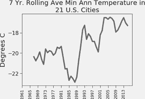

图 23-7 滚动平均最低温度

虽然可视化两个系列之间的关系可以提供信息，但通常更有用的是以更定量的方式观察这些关系。让我们先看一下年份与七年滚动平均最低、最高和平均温度之间的相关性。在计算相关性之前，我们首先更新`yearly_temps`中的系列以包含滚动平均值，然后将年份值从字符串转换为整数。代码

```py
num_years = 7
for label in ['Min T', 'Max T', 'Mean T']:
    yearly_temps[label] = yearly_temps[label].rolling(num_years).mean()
yearly_temps['Year'] = yearly_temps['Year'].apply(int)
print(yearly_temps.corr())
```

打印

```py
            Year     Min T     Max T    Mean T
Year    1.000000  0.713382  0.918975  0.969475
Min T   0.713382  1.000000  0.629268  0.680766
Max T   0.918975  0.629268  1.000000  0.942378
Mean T  0.969475  0.680766  0.942378  1.000000
```

所有汇总的温度值与年份呈正相关，其中平均温度的相关性最强。这引发了一个问题：年份解释了平均温度滚动平均值方差的多少。以下代码打印决定系数（第 20.2.1 节）。

```py
indices = np.isfinite(yearly_temps['Mean T'])
model = np.polyfit(list(yearly_temps['Year'][indices]),
                  list(yearly_temps['Mean T'][indices]), 1)
print(r_squared(yearly_temps['Mean T'][indices],
              np.polyval(model, yearly_temps['Year'][indices])))
```

由于`Mean`系列中的一些值为`NaN`，我们首先使用函数`np.isfinite`获取`yearly_temps['Mean']`中非`NaN`值的索引。然后我们构建一个线性模型，最后使用`r_squared`函数（见图 20-13）将模型预测的结果与实际温度进行比较。与年份相关的七年滚动平均温度几乎解释了 94%的方差。

**指尖练习：** 找到平均年温度而非滚动平均和十年滚动平均的决定系数（r²）。

如果你恰好住在美国或计划前往美国，你可能更有兴趣按城市而不是按年份查看数据。让我们首先生成一个新的 DataFrame，以提供每个城市的汇总数据。为了考虑到我们的美国读者，我们通过对`city_temps`中的所有值应用转换函数，将所有温度转换为华氏度。倒数第二行添加了一列，显示温度变化的极端程度。执行此代码会生成 图 23-8 中的 DataFrame。¹⁸⁰

```py
temperatures = pd.read_csv('US_temperatures.csv')
temperatures.drop('Date', axis = 'columns', inplace = True)
means = round(temperatures.mean(), 2)
maxes = temperatures.max()
mins = temperatures.min()
city_temps = pd.DataFrame({'Min T':mins, 'Max T':maxes,
                           'Mean T':means})
city_temps = city_temps.apply(lambda x: 1.8*x + 32)
city_temps['Max-Min'] = city_temps['Max T'] - city_temps['Min T']
print(city_temps.sort_values('Mean T', ascending = False).to_string())
```

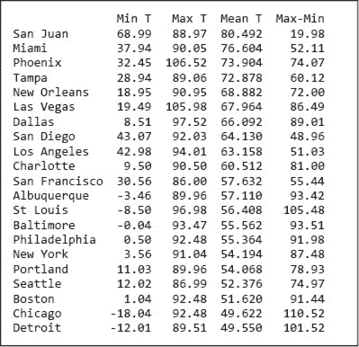

图 23-8 部分城市的平均温度

为了可视化城市之间的差异，我们使用代码生成了图 图 23-9

```py
plt.plot(city_temps.sort_values('Max-Min', ascending=False)
        ['Max-Min'], 'o')
plt.figure()
plt.plot(city_temps.sort_values('Max-Min', ascending=False)['Min T'],
        'b∧', label = 'Min T')
plt.plot(city_temps.sort_values('Max-Min', ascending=False)['Max T'],
        'kx', label = 'Max T')
plt.plot(city_temps.sort_values('Max-Min', ascending=False)['Mean T'],
        'ro', label = 'Mean T')
plt.xticks(rotation = ‘vertical')
plt.legend()
plt.title('Variation in Extremal Daily\nTemperature 1961-2015')
plt.ylabel('Degrees F')
```

请注意，我们对所有三个系列使用了排序顺序`Max - Min`。使用`ascending = False`会逆转默认的排序顺序。

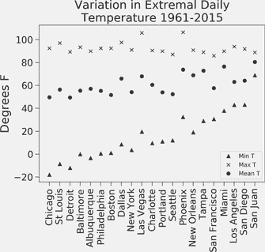

图 23-9 温度极端变化

看这个图我们可以看到，除了其他内容之外，

+   在城市之间，最低温度的差异远大于最高温度。因此，最大值减去最小值（排序顺序）与最低温度之间存在强正相关。

+   旧金山或西雅图从未变得非常炎热。

+   圣胡安的温度几乎保持不变。

+   芝加哥的温度并不接近恒定。这个风城的温度既会变得相当炎热，也会变得令人畏惧的寒冷。

+   凤凰城和拉斯维加斯都变得异常炎热。

+   旧金山和阿尔伯克基的平均气温大致相同，但最低和最高温度差异显著。

### 23.5.2 化石燃料消费

文件 global-fossil-fuel-consumption.csv 包含 1965 年至 2015 年地球上化石燃料年消费的数据。代码

```py
emissions = pd.read_csv('global-fossil-fuel-consumption.csv')
print(emissions)
```

打印

```py
    Year         Coal    Crude Oil   Natural Gas
0   1965  16151.96017  18054.69004   6306.370076
1   1966  16332.01679  19442.23715   6871.686791
2   1967  16071.18119  20830.13575   7377.525476
..   ...          ...          ...           ...
50  2015  43786.84580  52053.27008  34741.883490
51  2016  43101.23216  53001.86598  35741.829870
52  2017  43397.13549  53752.27638  36703.965870
```

现在，让我们将显示每种燃料消费的列替换为两列，一列显示三者的总和，另一列显示五年滚动平均的总和。

```py
emissions['Fuels'] = emissions.sum(axis = 'columns')
emissions.drop(['Coal', 'Crude Oil', 'Natural Gas'], axis = 'columns',
              inplace = True)
num_years = 5
emissions['Roll F'] =\
    emissions['Fuels'].rolling(num_years).mean()
emissions = emissions.round()
```

我们可以使用

```py
plt.plot(emissions['Year'], emissions['Fuels'],
         label = 'Consumption')
plt.plot(emissions['Year'], emissions['Roll F'],
         label = str(num_years) + ' Year Rolling Ave.')
plt.legend()
plt.title('Consumption of Fossil Fuels')
plt.xlabel('Year')
plt.ylabel('Consumption')
```

要获取图 23-10 中的情节。

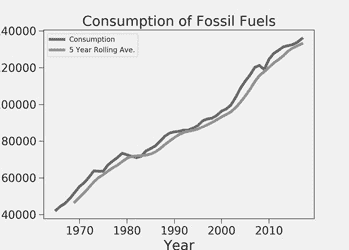

图 23-10 全球化石燃料消费

尽管消费量在少数小幅下滑（例如，2008 年金融危机期间），但上升趋势显而易见。

科学界已达成共识，燃料消费的上升与地球平均温度的上升之间存在关联。让我们看看它与我们在 23.5.1 节中查看的 21 个美国城市的温度之间的关系。

请记住，`yearly_temps`被绑定到数据框中。

```py
    Year  Min T  Max T  Mean T
0   1961 -17.25  38.05   15.64
1   1962 -21.65  36.95   15.39
2   1963 -24.70  36.10   15.50
..   ...    ...    ...     ...
52  2013 -15.00  40.55   16.66
53  2014 -22.70  40.30   16.85
54  2015 -18.80  40.55   17.54
```

如果有一种简单的方法来组合`yearly_temps`和`emissions`，那该多好啊？Pandas 的`merge`函数正是如此。代码

```py
yearly_temps['Year'] = yearly_temps['Year'].astype(int)
merged_df = pd.merge(yearly_temps, emissions,
                      left_on = 'Year', right_on = 'Year')
print(merged_df)
```

打印数据框

```py
    Year  Min T  ...     Fuels    Roll F
0   1965  -21.7  ...   42478.0       NaN
1   1966  -25.0  ...   44612.0       NaN
2   1967  -17.8  ...   46246.0       NaN
..   ...    ...  ...       ...       ...
48  2013  -15.0  ...  131379.0  126466.0
49  2014  -22.7  ...  132028.0  129072.0
50  2015  -18.8  ...  132597.0  130662.0
```

数据框包含出现在`yearly_temps`和`emissions`中的列的并集，但仅包括来自`yearly_temps`和`emissions`中具有相同`Year`值的行构建的行。

现在我们在同一个数据框中拥有排放和温度信息，轻松查看它们之间的相关性。代码`print(merged_df.corr().round(2).to_string())`打印

```py
 Year  Min T  Max T  Mean T  Fuels  Roll F
Year    1.00   0.37   0.72    0.85   0.99    0.98
Min T   0.37   1.00   0.22    0.49   0.37    0.33
Max T   0.72   0.22   1.00    0.70   0.75    0.66
Mean T  0.85   0.49   0.70    1.00   0.85    0.81
Fuels   0.99   0.37   0.75    0.85   1.00    1.00
Roll F  0.98   0.33   0.66    0.81   1.00    1.00 
```

我们看到，前几年的全球燃料消费确实与这些美国城市的平均温度和最高温度高度相关。这是否意味着增加的燃料消费导致温度上升？并不是。请注意，两者都与年份高度相关。也许某个潜在变量也与年份相关并且是因果因素。从统计学的角度来看，我们可以说，数据并不反驳广泛接受的科学假设，即化石燃料的增加使用产生的温室气体导致温度上升。

这就是我们对 Pandas 的简要介绍。我们只是在它所提供的内容上轻轻触及了一下。我们将在书中后续部分使用它，并介绍更多功能。如果你想了解更多，有许多在线资源以及一些优秀的廉价书籍。网站 `[`www.dataschool.io/best-python-pandas-resources/`](https://www.dataschool.io/best-python-pandas-resources/)` 列出了其中的一些。

## 23.6 在章节中引入的术语

+   数据框

+   行

+   序列

+   索引

+   名称

+   CSV 文件

+   ndarray 的形状

+   布尔索引

+   序列的相关性

+   移动（滚动）平均
