# 第二十四章：机器学习速览

世界上的数字数据量以难以人类理解的速度增长。自 1980 年代以来，世界的数据存储能力每三年大约翻一番。在你阅读本章所需的时间里，世界上的数据存储将增加约`10`¹⁸位。这么大的数字不容易理解。可以这样想：`10`¹⁸个加元便士的表面积大约是地球的两倍。

当然，更多的数据并不总是意味着更有用的信息。进化是一个缓慢的过程，人类心智同化数据的能力并不会每三年翻倍。世界正在使用的一种方法，以期从“大数据”中提取更多有用信息，就是**统计机器学习**。

机器学习很难定义。从某种意义上说，每个有用的程序都会学习一些东西。例如，牛顿法的实现学习一个多项式的根。美国电气工程师和计算机科学家阿瑟·萨缪尔提出的最早定义之一是，它是一个“使计算机能够在没有明确编程的情况下学习的研究领域”。

人类通过两种方式学习——记忆和概括。我们利用记忆来积累个别事实。例如，在英国，小学生可能会学习一份英王列表。人类使用**概括**从旧事实推导出新事实。例如，政治学学生可能会观察大量政治家的行为，并从这些观察中推导出所有政治家在竞选时都撒谎。

当计算机科学家谈论机器学习时，他们最常指的是编写程序的学科，这些程序自动学习从数据中的隐含模式中得出有用的推论。例如，线性回归（见第二十章）学习一条曲线，该曲线是一组示例的模型。然后可以使用该模型对以前未见过的示例进行预测。基本范式是

1.  1\. 观察一组示例，通常称为**训练数据**，它表示有关某些统计现象的不完整信息。

1.  2\. 使用推理技术创建一个可能生成所观察示例的过程模型。

1.  3\. 使用该模型对以前未见过的示例进行预测。

假设，例如，你获得了图 24-1 中的两个名称集合和图 24-2 中的**特征向量**。

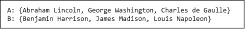

图 24-1 两个名称集合

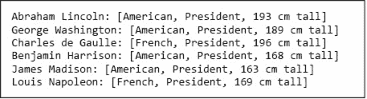

图 24-2 将特征向量与每个名称关联

向量的每个元素对应于某个方面（即特征）。基于对这些历史人物的有限信息，你可能推断出将标签`A`或标签`B`分配给每个示例的过程是为了将高个子总统与矮个子总统区分开来。

机器学习有许多方法，但所有方法都试图学习一个提供示例的概括模型。所有方法都有三个组成部分：

+   模型的一个表示

+   用于评估模型优劣的目标函数

+   一种优化方法，用于学习最小化或最大化目标函数值的模型

广义来说，机器学习算法可以分为有监督和无监督两种。

在**有监督学习**中，我们从一组特征向量/值对开始。目标是从这些对中推导出一个规则，以预测与先前未见的特征向量相关联的值。**回归模型**将一个实数与每个特征向量关联。**分类模型**将有限数量的**标签**中的一个与每个特征向量关联。¹⁸²

在第二十章中，我们看了一种回归模型，即线性回归。每个特征向量是一个 x 坐标，与之相关的值是对应的 y 坐标。通过特征向量/值对的集合，我们学习了一个模型，可以用来预测与任何 x 坐标相关联的 y 坐标。

现在，让我们来看一个简单的分类模型。给定我们在图 24-1 中标记的总统集合`A`和`B`以及图 24-2 中的特征向量，我们可以生成图 24-3 中的特征向量/标签对。

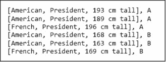

图 24-3 总统的特征向量/标签对

从这些标记的示例中，学习算法可能推断出所有高个子总统应该标记为`A`，所有矮个子总统标记为`B`。当被要求为

```py
[American, President, 189 cm.]¹⁸³
```

它会使用它所学到的规则来选择标签`A`。

有监督机器学习广泛应用于诸如检测信用卡欺诈使用和向人们推荐电影等任务。

在**无监督学习**中，我们获得一组特征向量，但没有标签。无监督学习的目标是揭示特征向量集合中的潜在结构。例如，给定总统特征向量的集合，无监督学习算法可能会将总统分为高个子和矮个子，或者可能分为美国人和法国人。无监督机器学习的方法可以分为聚类方法或学习潜变量模型的方法。

**潜变量**是一个其值不是直接观察到的变量，但可以从观察到的变量值中推断出来。例如，大学的招生官员试图根据一组可观察的值（如中学成绩和标准化测试成绩）推断申请者成为成功学生的概率（即潜变量）。有许多丰富的方法用于学习潜变量模型，但我们在本书中不讨论这些。

**聚类**将一组实例划分为多个组（称为簇），使得同一组中的实例彼此之间更相似，而与其他组中的实例则相对不相似。例如，遗传学家使用聚类来寻找相关基因的群体。许多流行的聚类方法出人意料地简单。

我们在第二十五章介绍了一种广泛使用的聚类算法，并在第二十六章讨论了几种监督学习的方法。在本章的其余部分，我们讨论了构建特征向量的过程以及计算两个特征向量之间相似性的不同方法。

## 24.1 特征向量

**信噪比**（**SNR**）的概念在许多工程和科学领域中使用。确切的定义在不同应用中有所不同，但基本思想很简单。将其视为有用输入与无关输入的比率。在餐厅里，信号可能是你约会对象的声音，而噪声则是其他 diners 的声音。如果我们试图预测哪些学生在编程课程中表现良好，之前的编程经验和数学能力将是信号的一部分，而发色则仅仅是噪声。将信号与噪声分离并不总是容易。当做得不够好时，噪声可能会干扰，掩盖信号中的真相。

**特征工程**的目的是将可用数据中对信号有贡献的特征与仅仅是噪声的特征分开。如果未能做好这项工作，可能导致模型表现不佳。当数据的**维度**（即不同特征的数量）相对于样本数量较大时，风险特别高。

成功的特征工程能够减少可用信息的庞大数量，使其成为有助于推广的有用信息。例如，想象一下，你的目标是学习一个模型，以预测一个人是否可能会发生心脏病发作。一些特征，比如他们的年龄，可能非常相关。其他特征，比如他们是否是左撇子，可能不太相关。

**特征选择**技术可以自动识别在给定特征集合中哪些特征最有可能是有帮助的。例如，在监督学习的背景下，我们可以选择与样本标签最强相关的特征。¹⁸⁵然而，如果没有相关特征，这些特征选择技术帮助不大。假设我们心脏病发作示例的原始特征集合包括身高和体重。尽管身高和体重都不是心脏病发作的强预测因素，但身体质量指数（BMI）可能是。虽然 BMI 可以通过身高和体重计算得出，但其关系（体重以千克为单位除以身高以米为单位的平方）过于复杂，无法通过典型的机器学习技术自动发现。成功的机器学习通常涉及领域专家设计特征。

在无监督学习中，问题甚至更困难。通常，我们根据对哪些特征可能与我们希望发现的结构相关的直觉来选择特征。然而，依赖于对特征潜在相关性的直觉是有问题的。你对某人的牙齿历史是否是未来心脏病发作的有用预测因素的直觉有多好？

考虑图 24-4，其中包含特征向量的表格和每个向量相关的标签（爬行动物或非爬行动物）。

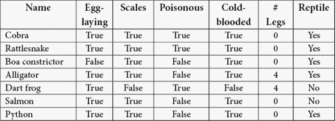

图 24-4 各种动物的名称、特征和标签

仅仅通过有关眼镜蛇的信息（即，仅表格的第一行），一个监督机器学习算法（或人类）几乎只能记住眼镜蛇是爬行动物这一事实。现在，让我们添加有关响尾蛇的信息。我们可以开始进行概括，并可能推断出一个规则：如果动物下蛋、有鳞、是毒性、是冷血动物，并且没有腿，则它是爬行动物。

现在，假设我们被要求决定一条巨蟒是否是爬行动物。我们可能会回答“不是”，因为巨蟒既不是毒性动物，也不是下蛋的。然而，这将是错误的答案。当然，试图从两个示例中进行概括而导致错误也并不令人惊讶。一旦我们将巨蟒纳入我们的训练数据，我们可能会形成新的规则：如果动物有鳞、是冷血动物，并且没有腿，则它是爬行动物。在这样做的过程中，我们将特征`下蛋`和`毒性`视为与分类问题无关而丢弃。

如果我们用新规则来分类鳄鱼，我们错误地得出结论，认为因为它有腿，所以不是爬行动物。一旦我们将鳄鱼纳入训练数据，我们就重新制定规则，允许爬行动物没有腿或有四条腿。当我们观察飞镖蛙时，我们正确得出结论，它不是爬行动物，因为它不是冷血的。然而，当我们用目前的规则来分类鲑鱼时，我们错误地得出结论，认为鲑鱼是爬行动物。我们可以为我们的规则增加更多复杂性，以将鲑鱼与鳄鱼区分开来，但这是徒劳的。没有办法修改我们的规则，使其能够正确分类鲑鱼和蟒蛇，因为这两种物种的特征向量是相同的。

这种问题在机器学习中比比皆是。特征向量中包含足够信息以完美分类的情况非常罕见。在这种情况下，问题在于我们没有足够的特征。

如果我们考虑到爬行动物的卵有羊膜，我们可以制定出一个将爬行动物与鱼类分开的规则。不幸的是，在大多数机器学习的实际应用中，构造允许完美区分的特征向量是不可能的。

这是否意味着我们应该放弃，因为所有可用的特征只是噪声？不。在这种情况下，特征`鳞片`和`冷血`是成为爬行动物的必要条件，但不是充分条件。如果动物有鳞片且是冷血的，就不可能产生假阴性，即，任何被分类为非爬行动物的动物确实不会是爬行动物。然而，这条规则会产生一些假阳性，即，一些被分类为爬行动物的动物实际上并不是爬行动物。

## 24.2 距离度量

在图 24-4 中，我们使用四个二元特征和一个整数特征描述了动物。假设我们想用这些特征来评估两种动物的相似性，例如，询问响尾蛇与蚺蛇或飞镖蛙更相似。

进行这种比较的第一步是将每种动物的特征转换为数字序列。如果我们说`True = 1`和`False = 0`，我们会得到以下特征向量：

```py
Rattlesnake: [1,1,1,1,0]
Boa constrictor: [0,1,0,1,0]
Dart frog: [1,0,1,0,4]
```

比较数字向量相似性的方法有很多。比较相同长度向量时最常用的度量基于**闵可夫斯基距离**：

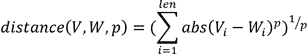

其中*len*是向量的长度。

参数`p`，至少为 1，定义了在遍历向量*V*和*W*之间的距离时可以遵循的路径类型。这在向量长度为二时可以很容易地可视化，因此可以使用笛卡尔坐标表示。请考虑图 24-5 中的图像。

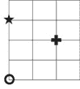

图 24-5 可视化距离度量

左下角的圆形更接近十字还是更接近星形？这要看情况。如果我们可以直线行走，十字更近。毕达哥拉斯定理告诉我们，十字距离圆形`8`单位的平方根，大约是`2.8`单位，而星形距离圆形`3`单位。这些距离被称为**欧几里得距离**，对应于使用闵可夫斯基距离时`p = 2`。但想象一下，图中的线条对应于街道，我们必须沿街道从一个地方到另一个地方。星形仍然距离圆形`3`单位，但十字现在距离`4`单位。这些距离被称为**曼哈顿** **距离**，¹⁹⁰，它们对应于使用闵可夫斯基距离时`p = 1`。图 24-6 包含一个实现闵可夫斯基距离的函数。

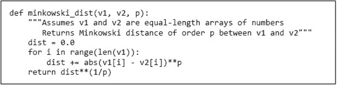

图 24-6 闵可夫斯基距离

图 24-7 包含类`Animal`。它将两只动物之间的距离定义为与动物相关的特征向量之间的欧几里得距离。

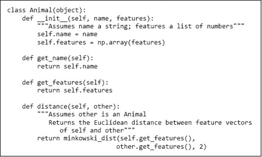

图 24-7 类`Animal`

图 24-8 包含一个比较动物列表的函数，并生成一张显示成对距离的表格。代码使用了我们之前未使用的 Matplotlib 绘图工具：`table`。

`table`函数生成一个（惊喜！）看起来像表格的图。关键字参数`rowLabels`和`colLabels`用于提供行和列的标签（在本例中是动物的名称）。关键字参数`cellText`用于提供表格单元格中出现的值。在该示例中，`cellText`绑定到`table_vals`，这是一个字符串列表的列表。`table_vals`中的每个元素都是表格一行中单元格值的列表。关键字参数`cellLoc`用于指定文本在每个单元格中的位置，关键字参数`loc`用于指定表格本身在图中的位置。示例中使用的最后一个关键字参数是`colWidths`。它绑定到一个浮点数列表，给出表格中每一列的宽度（以英寸为单位）。代码`table.scale(1, 2.5)`指示 Matplotlib 保持单元格的水平宽度不变，但将单元格的高度增加`2.5`倍（使表格看起来更美观）。

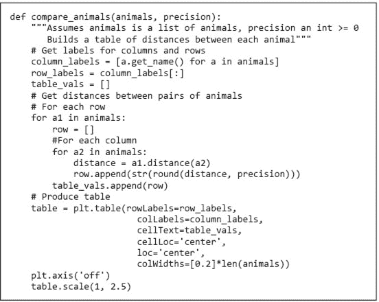

图 24-8 建立动物对之间的距离表

如果我们运行代码

```py
rattlesnake = Animal('rattlesnake', [1,1,1,1,0])
boa = Animal('boa', [0,1,0,1,0])
dart_frog = Animal('dart frog', [1,0,1,0,4])
animals = [rattlesnake, boa, dart_frog]
compare_animals(animals, 3)
```

它生成了图 24-9 中的表格。

正如你可能预期的，响尾蛇与蟒蛇之间的距离小于任何一条蛇与飞蛙之间的距离。顺便提一下，飞蛙离响尾蛇稍微近一点，而不是蟒蛇。

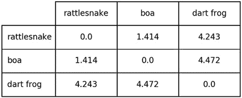

图 24-9 三种动物之间的距离

现在，让我们在上述代码的最后一行之前插入以下行

```py
alligator = Animal('alligator', [1,1,0,1,4])
animals.append(alligator)
```

它生成了图 24-10 中的表格。


图 24-10 四种动物之间的距离

也许你会惊讶于鳄鱼与飞蛙之间的距离明显小于与响尾蛇或蟒蛇之间的距离。花点时间思考一下为什么。

鳄鱼的特征向量与响尾蛇的特征向量在两个地方不同：是否有毒和腿的数量。鳄鱼的特征向量与飞蛙的特征向量在三个地方不同：是否有毒、是否有鳞片，以及是否是冷血动物。然而，根据我们的欧几里得距离度量，鳄鱼与飞蛙更相似，而非响尾蛇。这是怎么回事？

问题的根源在于不同特征具有不同的值范围。除了一个特征，其他特征的范围均在`0`和`1`之间，但腿的数量则在`0`到`4`之间。这意味着当我们计算欧几里得距离时，腿的数量权重不成比例。让我们看看如果将特征变为二元特征，若动物无腿则值为`0`，否则为`1`会发生什么。

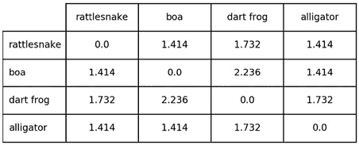

图 24-11 使用不同特征表示的距离

这看起来更合理了。

当然，仅使用二元特征并不总是方便。在第 25.4 节中，我们将介绍一种更通用的方法来处理特征之间的规模差异。

## 24.3 本章介绍的术语

+   统计机器学习

+   泛化

+   训练数据

+   特征向量

+   监督学习

+   回归模型

+   分类模型

+   标签

+   无监督学习

+   潜在变量

+   聚类

+   信噪比（SNR）

+   特征工程

+   数据的维度

+   特征选择

+   闵可夫斯基距离

+   三角不等式

+   欧几里得距离

+   曼哈顿距离
