# 16（完结） -- Finale

上节课我们主要介绍了Matrix Factorization。通过电影推荐系统的例子，介绍Matrix Factorization其实是一个提取用户特征，关于电影的线性模型。反过来也可以看出是关于用户的线性模型。然后，我们使用SGD对模型进行最佳化。本节课我们将对机器学习技法课程介绍过的所有内容做个总结，分成三个部分：Feature Exploitation Techniques，Error Optimization Techniques和Overfitting Elimination Techniques。

### **Feature Exploitation Techniques**

我们在本系列课程中介绍的第一个特征提取的方法就是kernel。Kernel运算将特征转换和计算内积这两个步骤合二为一，提高了计算效率。我们介绍过的kernel有：Polynormial Kernel、Gaussian Kernel、Stump Kernel等。另外，我们可以将不同的kernels相加（transform union）或者相乘（transform combination），得到不同的kernels的结合形式，让模型更加复杂。值得一提的是，要成为kernel，必须满足Mercer Condition。不同的kernel可以搭配不同的kernel模型，比如：SVM、SVR和probabilistic SVM等，还包括一些不太常用的模型：kernel ridge regression、kernel logistic regression。使用这些kernel模型就可以将线性模型扩展到非线性模型，kernel就是实现一种特征转换，从而能够处理非常复杂的非线性模型。顺便提一下，因为PCA、k-Means等算法都包含了内积运算，所以它们都对应有相应的kernel版本。

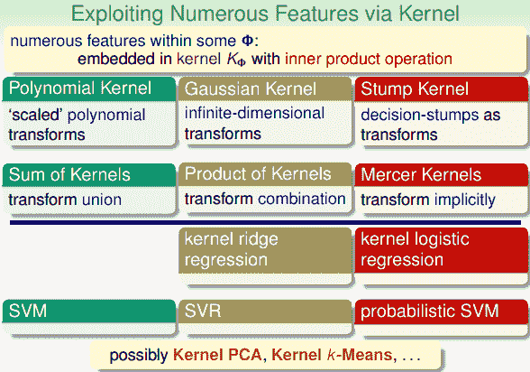

Kernel是我们利用特征转换的第一种方法，那利用特征转换的第二种方法就是Aggregation。我们之前介绍的所有的hypothesis都可以看成是一种特征转换，然后再由这些g组合成G。我们介绍过的分类模型（hypothesis）包括：Decision Stump、Decision Tree和Gaussian RBF等。如果所有的g是已知的，就可以进行blending，例如Uniform、Non-Uniform和Conditional等方式进行aggregation。如果所有的g是未知的，可以使用例如Bagging、AdaBoost和Decision Tree的方法来建立模型。除此之外，还有probabilistic SVM模型。值得一提的是，机器学习中很多模型都是类似的，我们在设计一个机器学习模型时，应该融会贯通。

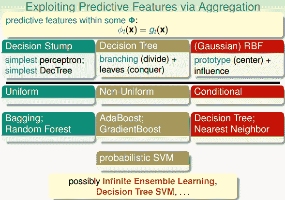

除此之外，我们还介绍了利用提取的方式，找出潜藏的特征（Hidden Features）。一般通过unsupervised learning的方法，从原始数据中提取出隐藏特征，使用权重表征。相应的模型包括：Neural Network、RBF Network、Matrix Factorization等。这些模型使用的unsupervised learning方法包括：AdaBoost、k-Means和Autoencoder、PCA等。

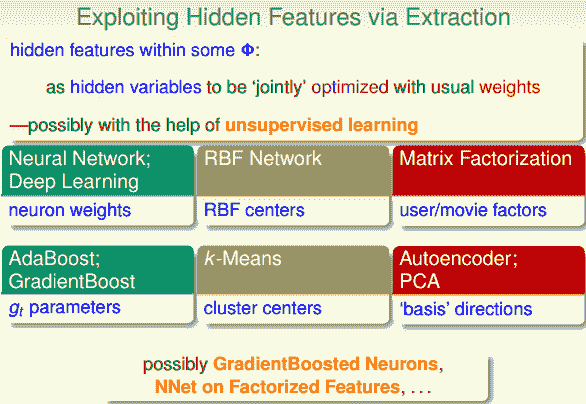

另外，还有一种非常有用的特征转换方法是维度压缩，即将高维度的数据降低（投影）到低维度的数据。我们介绍过的维度压缩模型包括：Decision Stump、Random Forest Tree Branching、Autoencoder、PCA和Matrix Factorization等。这些从高纬度到低纬度的特征转换在实际应用中作用很大。

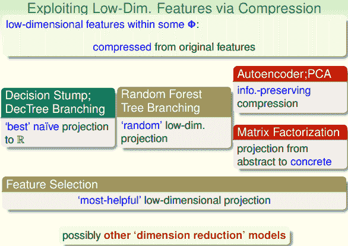

### **Error Optimization Techniques**

接下来我们将总结一下本系列课程中介绍过哪些优化技巧。首先，第一个数值优化技巧就是梯度下降（Gradient Descent），即让变量沿着其梯度反方向变化，不断接近最优解。例如我们介绍过的SGD、Steepest Descent和Functional GD都是利用了梯度下降的技巧。

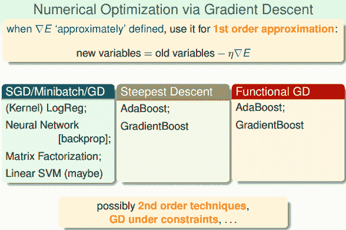

而对于一些更复杂的最佳化问题，无法直接利用梯度下降方法来做，往往需要一些数学上的推导来得到最优解。最典型的例子是Dual SVM，还包括Kernel LogReg、Kernel RidgeReg和PCA等等。这些模型本身包含了很多数学上的一些知识，例如线性代数等等。除此之外，还有一些boosting和kernel模型，虽然本课程中没有提到，但是都会用到类似的数学推导和转换技巧。

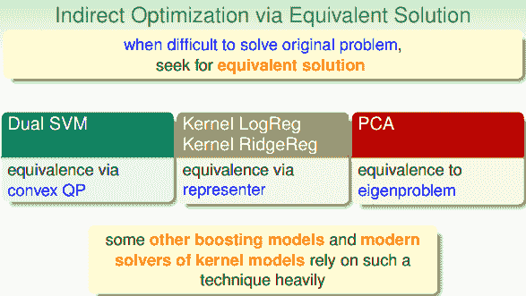

如果原始问题比较复杂，求解比较困难，我们可以将原始问题拆分为子问题以简化计算。也就是将问题划分为多个步骤进行求解，即Multi-Stage。例如probabilistic SVM、linear blending、RBF Network等。还可以使用交叉迭代优化的方法，即Alternating Optim。例如k-Means、alternating LeastSqr等。除此之外，还可以采样分而治之的方法，即Divide & Conquer。例如decision tree。

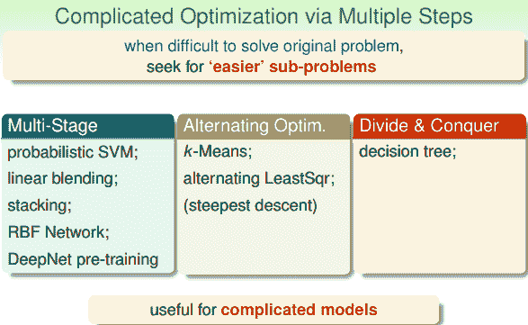

### **Overfitting Elimination Techniques**

Feature Exploitation Techniques和Error Optimization Techniques都是为了优化复杂模型，减小。但是太小有很可能会造成过拟合overfitting。因此，机器学习中，Overfitting Elimination尤为重要。

首先，可以使用Regularization来避免过拟合现象发生。我们介绍过的方法包括：large-margin、L2、voting/averaging等等。

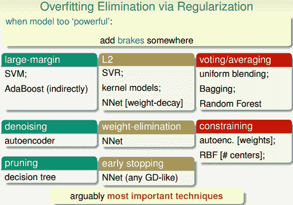

除了Regularization之外，还可以使用Validation来消除Overfitting。我们介绍过的Validation包括：SV、OOB和Internal Validation等。

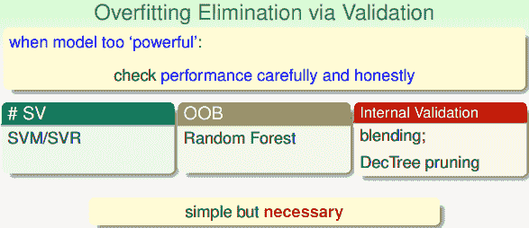

### **Machine Learning in Action**

本小节介绍了林轩田老师所在的台大团队在近几年的KDDCup国际竞赛上的表现和使用的各种机器算法。融合了我们在本系列课程中所介绍的很多机器学习技法和模型。这里不再一一赘述，将相应的图片贴出来，读者自己看看吧。

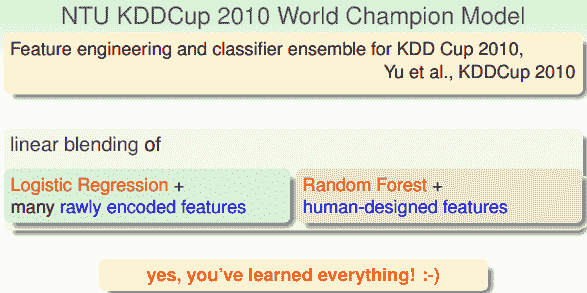

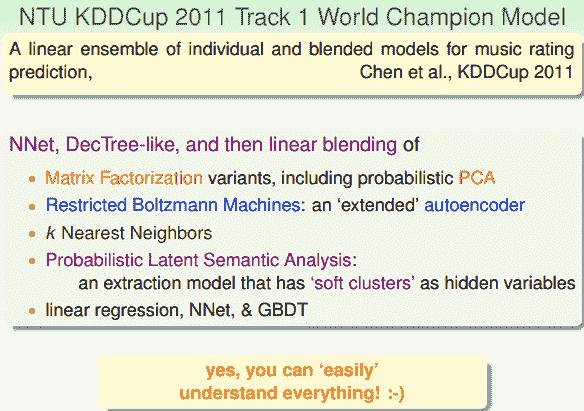

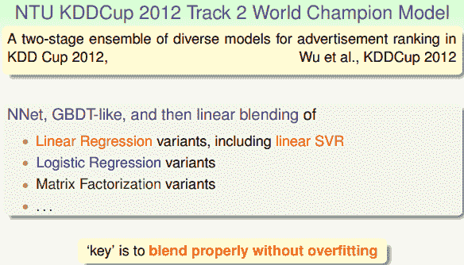

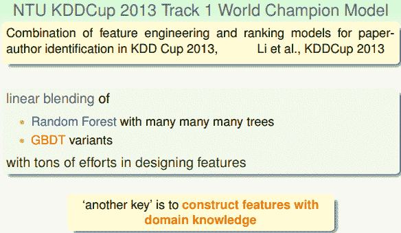

ICDM在2006年的时候发布了排名前十的数据挖掘算法，如下图所示。其中大部分的算法我们在本系列的课程中都有过介绍。值得一提的是Naive Bayes算法本课程中没有涉及，贝叶斯模型在实际中应用还是挺广泛的，后续可能还需要深入学习一下。

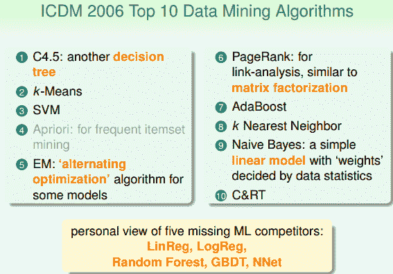

最后，我们将所有介绍过的机器学习算法和模型列举出来：

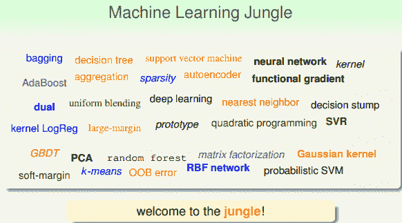

### **总结**

本节课主要从三个方面来对机器学习技法课程做个总结：Feature Exploitation Techniques，Error Optimization Techniques和Overfitting Elimination Techniques。最后介绍了林轩田老师带领的台大团队是如何在历届KDDCup中将很多机器学习算法模型融合起来，并获得了良好的成绩。

**_注明：_**

文章中所有的图片均来自台湾大学林轩田《机器学习技法》课程、

### **写在最后的话**

历时近4个月，终于将台湾大学林轩田老师的《机器学习基石》和《机器学习技法》这两门课程学完了。突然的想法，开始写博客记录下学习历程，通过笔记的形式加深巩固了自己的理解。如果能对读者有些许帮助的话，那便是一大快事。笔者资历尚浅，博客中难免有疏漏和错误，欢迎各位批评指正。另外，鄙人不才，建立了一个QQ群，以便讨论与该课程相关或者其它的机器学习和深度学习问题。有兴趣的朋友可以加一下，QQ群号码是223490966（红色石头机器学习小站）。后续，笔者根据学习情况，可能还会推出一些课程笔记的博客。

积跬步以致千里，积小流以成江海！

最后，特别感谢林轩田老师！您的教学风格我很喜欢，深入浅出、寓教于乐。非常有幸能够学到您的课程！再次感谢！
