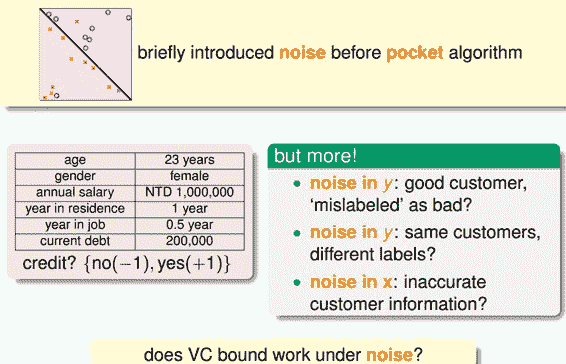
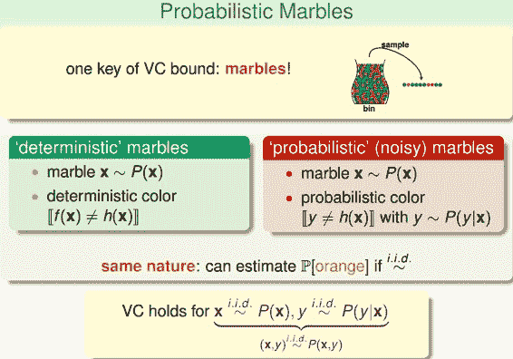
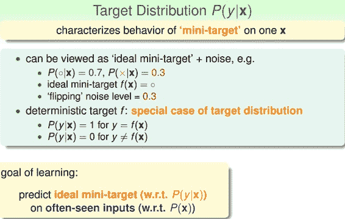
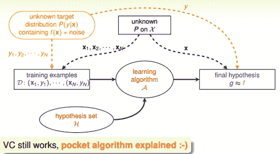
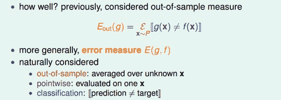
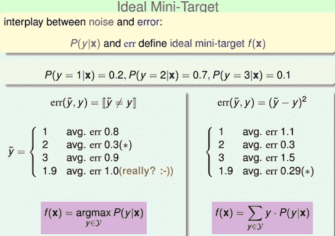
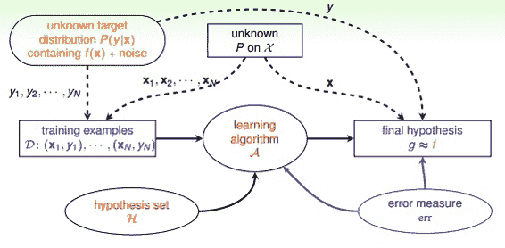
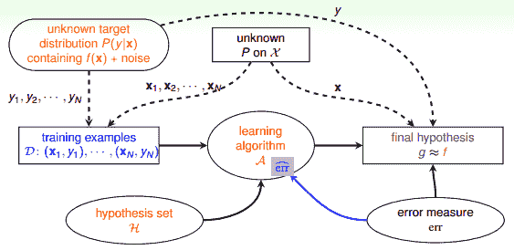
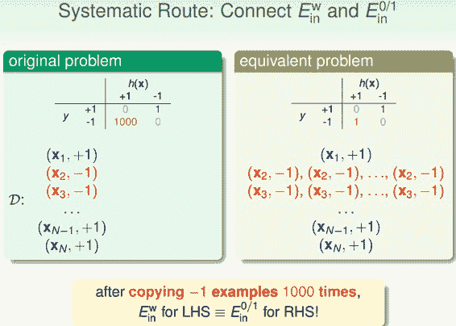
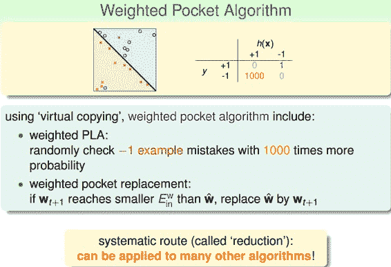

# 8 -- Noise and Error

上一节课，我们主要介绍了VC Dimension的概念。如果Hypotheses set的VC Dimension是有限的，且有足够多N的资料，同时能够找到一个hypothesis使它的，那么就能说明机器学习是可行的。本节课主要讲了数据集有Noise的情况下，是否能够进行机器学习，并且介绍了假设空间H下演算法A的Error估计。

### **一、Noise and Probablistic target**

上节课推导VC Dimension的数据集是在没有Noise的情况下，本节课讨论如果数据集本身存在Noise，那VC Dimension的推导是否还成立呢？

首先，Data Sets的Noise一般有三种情况：

*   **由于人为因素，正类被误分为负类，或者负类被误分为正类；**

*   **同样特征的样本被模型分为不同的类；**

*   **样本的特征被错误记录和使用。**

之前的数据集是确定的，即没有Noise的，我们称之为Deterministic。现在有Noise了，也就是说在某点处不再是确定分布，而是概率分布了，即对每个(x，y)出现的概率是。

因为Noise的存在，比如在x点，有0.7的概率y=1，有0.3的概率y=0，即y是按照分布的。数学上可以证明如果数据集按照概率分布且是iid的，那么以前证明机器可以学习的方法依然奏效，VC Dimension有限即可推断和是近似的。

称之为目标分布（Target Distribution）。它实际上告诉我们最好的选择是什么，同时伴随着多少noise。其实，没有noise的数据仍然可以看成“特殊”的概率分布，即概率仅是1和0.对于以前确定的数据集：

在引入noise的情况下，新的学习流程图如下所示：

### **二、ERROR Measure**

机器学习需要考虑的问题是找出的矩g与目标函数f有多相近，我们一直使用进行误差的估计，那一般的错误测量有哪些形式呢？

我们介绍的矩g对错误的衡量有三个特性：

*   **out-of-sample：样本外的未知数据**

*   **pointwise：对每个数据点x进行测试**

*   **classification：看prediction与target是否一致，classification error通常称为0/1 error**

PointWise error实际上就是对数据集的每个点计算错误并计算平均，和的pointwise error的表达式为：

pointwise error是机器学习中最常用也是最简单的一种错误衡量方式，未来课程中，我们主要考虑这种方式。pointwise error一般可以分成两类：0/1 error和squared error。0/1 error通常用在分类（classification）问题上，而squared error通常用在回归（regression）问题上。

Ideal Mini-Target由和err共同决定，0/1 error和squared error的Ideal Mini-Target计算方法不一样。例如下面这个例子，分别用0/1 error和squared error来估计最理想的mini-target是多少。0/1 error中的mini-target是取P(y|x)最大的那个类，而squared error中的mini-target是取所有类的加权平方和。

有了错误衡量，就会知道当前的矩g是好还是不好，并会让演算法不断修正，得到更好的矩g，从而使得g与目标函数更接近。所以，引入error measure后，学习流程图如下所示：

### **三、Algorithmic Error Measure**

Error有两种：false accept和false reject。false accept意思是误把负类当成正类，false reject是误把正类当成负类。 根据不同的机器学习问题，false accept和false reject应该有不同的权重，这根实际情况是符合的，比如是超市优惠，那么false reject应该设的大一些；如果是安保系统，那么false accept应该设的大一些。

机器学习演算法A的cost function error估计有多种方法，真实的err一般难以计算，常用的方法可以采用plausible或者friendly，根据具体情况而定。

引入algorithm error measure之后，学习流程图如下：

### **四、Weighted Classification**

实际上，机器学习的Cost Function即来自于这些error，也就是算法里面的迭代的目标函数，通过优化使得Error（Ein）不断变小。
cost function中，false accept和false reject赋予不同的权重，在演算法中体现。对不同权重的错误惩罚，可以选用virtual copying的方法。

### **五、总结**

本节课主要讲了在有Noise的情况下，即数据集按照概率分布，那么VC Dimension仍然成立，机器学习算法推导仍然有效。机器学习cost function常用的Error有0/1 error和squared error两类。实际问题中，对false accept和false reject应该选择不同的权重。

**_注明：_**

文章中所有的图片均来自台湾大学林轩田《机器学习基石》课程。