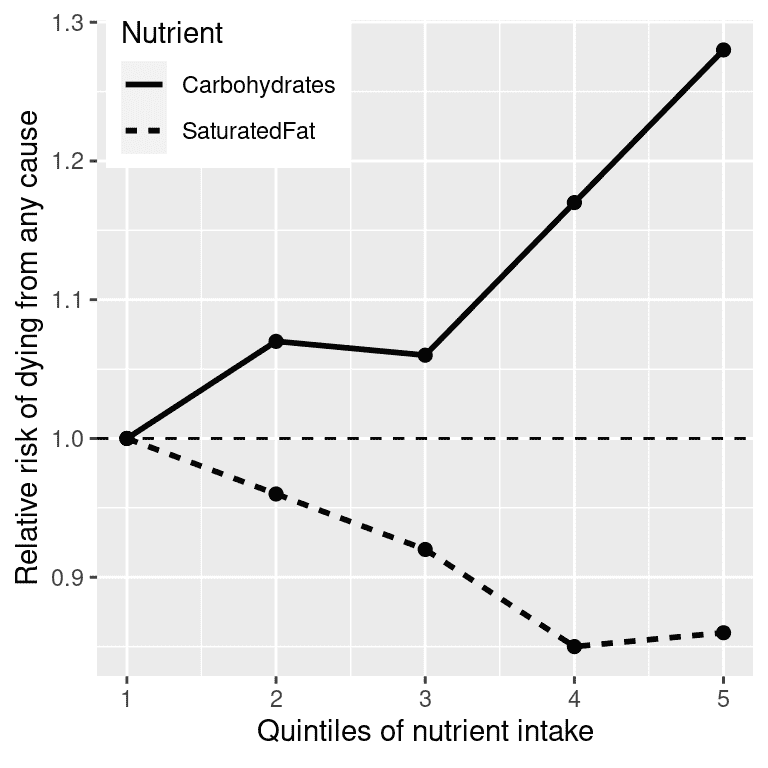

# 第一章：引言

> 原文：[`statsthinking21.github.io/statsthinking21-core-site/introduction.html`](https://statsthinking21.github.io/statsthinking21-core-site/introduction.html)
> 
> 译者：[飞龙](https://github.com/wizardforcel)
> 
> 协议：[CC BY-NC-SA 4.0](https://creativecommons.org/licenses/by-nc-sa/4.0/)

“统计思维将有一天像阅读和写作能力一样，对有效的公民身份来说是必不可少的。”- H.G.威尔斯

## 1.1 什么是统计思维？

统计思维是一种通过相对简单的方式描述复杂世界的方式，这种方式能够捕捉其结构或功能的基本方面，并且也能够让我们对这些知识的不确定性有一些了解。统计思维的基础主要来自数学和统计学，但也来自计算机科学、心理学和其他研究领域。

我们可以区分统计思维与其他不太可能准确描述世界的思维形式。特别是，人类直觉经常试图回答我们可以用统计思维回答的相同问题，但通常得到错误的答案。例如，近年来，大多数美国人报告说他们认为暴力犯罪比前一年更糟（[皮尤研究中心](http://www.pewresearch.org/fact-tank/2018/01/30/5-facts-about-crime-in-the-u-s/)）。然而，对实际犯罪数据的统计分析显示，事实上自 1990 年代以来，暴力犯罪一直在稳步*下降*。直觉会让我们失望，因为我们依赖于最佳猜测（心理学家称之为*启发式*），这往往会出错。例如，人类经常使用*可得性启发式*来判断某些事件（如暴力犯罪）的普遍性——也就是说，我们能多容易地想到一个暴力犯罪的例子。因此，我们对犯罪率增加的判断可能更多地反映了新闻报道的增加，而不是实际犯罪率的下降。统计思维为我们提供了更准确地理解世界的工具，并克服了人类判断的偏见。

## 1.2 处理统计焦虑

许多人第一次上统计课时会感到很紧张和焦虑，尤其是一旦他们听说他们还必须学习编程才能分析数据。在我的课堂上，我在第一节课之前给学生们做一项调查，以衡量他们对统计学的态度，要求他们对一些陈述进行评分，分数从 1（非常不同意）到 7（非常同意）。调查中的一项是“想到要上统计课让我感到紧张”。在最近的一堂课上，几乎有三分之二的学生回答为五分或更高，大约四分之一的学生表示他们非常同意这个说法。所以如果你对开始学习统计感到紧张，你并不孤单。

焦虑感觉不舒服，但心理学告诉我们，这种情绪激动实际上可以帮助我们在许多任务上表现*更好*，因为它能够集中我们的注意力。所以如果你开始对这本书中的材料感到焦虑，提醒自己许多其他读者也有类似的感受，这种情绪激动实际上可能会帮助你更好地学习材料（即使看起来并不是这样！）。

## 1.3 统计学对我们有什么作用？

我们可以用统计学做三件重要的事情：

+   *描述*：世界是复杂的，我们经常需要以我们能理解的简化方式来描述它。

+   *决定*：我们经常需要根据数据做出决策，通常是在面对不确定性的情况下。

+   *预测*：我们经常希望根据我们对先前情况的了解，对新情况进行预测。

让我们看一个这些行动的例子，重点是一个我们许多人都感兴趣的问题：我们如何决定什么是健康的饮食？有许多不同的指导来源；政府膳食指南、饮食书籍和博客，仅举几例。让我们专注于一个具体的问题：我们饮食中的饱和脂肪是一件坏事吗？

我们可能回答这个问题的一种方式是常识。如果我们吃脂肪，那么它会直接在我们的身体里变成脂肪，对吧？我们都看过充满脂肪的动脉的照片，所以吃脂肪会堵塞我们的动脉，对吧？

我们可能回答这个问题的另一种方式是听从权威人士的意见。美国食品和药物管理局的膳食指南中有一个关键建议是“健康饮食模式限制饱和脂肪”。你可能希望这些指南是基于良好的科学，有时候确实是，但正如 Nina Teicholz 在她的书《大脂肪惊喜》（[Teicholz 2014](#ref-teic:2014)）中所概述的，这个特定的建议似乎更多地基于营养研究人员长期以来的教条，而不是实际证据。

最后，我们可能会看一下实际的科学研究。让我们首先看一下一个名为 PURE 研究的大型研究，该研究调查了来自 18 个不同国家的 135,000 多人的饮食和健康结果（包括死亡）。在这个数据集的分析中（2017 年发表在《柳叶刀》上；Dehghan 等人（2017）），PURE 研究人员报告了摄入各种类的大量营养素（包括饱和脂肪和碳水化合物）与人们在随访期间死亡的可能性之间的关系。人们被随访了*中位数*7.4 年，这意味着研究中有一半的人随访时间少于 7.4 年，另一半人随访时间超过 7.4 年。图 1.1 绘制了从研究中提取的一些数据（从论文中提取），显示了摄入饱和脂肪和碳水化合物与任何原因死亡风险之间的关系。



图 1.1：PURE 研究的数据图，显示饱和脂肪和碳水化合物的相对摄入量与任何原因死亡之间的关系。

这个图是基于十个数字。为了获得这些数字，研究人员将 135,335 名研究参与者（我们称之为“样本”）按其摄入任一营养素的顺序分成 5 组（“五分位数”）；第一分位数包含摄入最低的 20%的人，第五分位数包含摄入最高的 20%的人。然后研究人员计算了在随访期间每个组的人死亡的频率。图表达了这一点，以相对风险的形式，与最低分位数相比死亡的频率：如果这个数字大于一，意味着该组的人比最低分位数的人更有可能死亡，而如果小于一，意味着该组的人比最低分位数的人更不可能死亡。图表明得很清楚：摄入更多饱和脂肪的人在研究期间死亡的可能性*更低*，最低死亡率出现在摄入脂肪低于最低 60%但低于最高 20%的人中。而碳水化合物则相反；一个人摄入的碳水化合物越多，在研究期间死亡的可能性就越大。这个例子展示了我们如何使用统计学来用一组更简单的数字*描述*一个复杂的数据集；如果我们必须同时查看每个研究参与者的数据，我们将被数据淹没，很难看到当它们更简单地描述时所呈现的模式。

图 1.1 中的数字似乎显示饱和脂肪摄入量减少，碳水化合物摄入量增加，但我们也知道数据中存在很多不确定性；有些人尽管摄入低碳水化合物饮食，却早逝，同样地，有些人摄入大量碳水化合物，却活到了老年。鉴于这种变异性，我们希望*决定*我们在数据中看到的关系是否足够大，以至于我们不会期望它们在没有饮食和寿命之间真正关系的情况下随机发生。统计学为我们提供了做出这类决定的工具，而且外界通常认为这是统计学的*主要*目的。但正如我们将在整本书中看到的那样，基于模糊证据做出黑白决定的需求经常导致研究人员误入歧途。

基于数据，我们还希望对未来的结果进行预测。例如，一家人寿保险公司可能希望利用有关某个人脂肪和碳水化合物摄入的数据来预测他们可能活多久。预测的一个重要方面是，它要求我们从我们已有的数据中推广到其他情况，通常是未来的情况；如果我们的结论仅限于研究中特定时间的特定人群，那么这项研究就不会太有用。一般来说，研究人员必须假设他们的特定样本代表了更大的*总体*，这要求他们以一种能够提供总体无偏照片的方式获得样本。例如，如果 PURE 研究从实行素食主义的宗教教派中招募了所有参与者，那么我们可能不希望将结果推广到遵循不同饮食标准的人群。

## 1.4 统计学的重要思想

统计学的一些非常基本的想法贯穿了几乎所有统计思维的方面。斯蒂格勒（2016）在他出色的著作《统计智慧的七大支柱》中概述了其中的一些，我在这里进行了补充。

### 1.4.1 从数据中学习

把统计学看作一套工具，使我们能够从数据中学习。在任何情况下，我们都从一组关于可能情况的想法或*假设*开始。在 PURE 研究中，研究人员可能最初期望摄入更多脂肪会导致更高的死亡率，考虑到关于饱和脂肪的普遍负面教条。在课程的后期，我们将介绍*先验知识*的概念，这意味着我们所带入情况的知识。这种先验知识的强度可能会有所不同，通常取决于我们的经验量；如果我第一次去一家餐馆，我可能对它的好坏没有太强的期望，但如果我去了一家我之前吃过十次的餐馆，我的期望会强得多。同样，如果我看到一个餐馆评论网站，发现一个餐馆的平均评分是四星，但只基于三条评论，那么我的期望会比基于 300 条评论的情况要弱。

统计学为我们提供了一种描述新数据如何最好地用于更新我们的信念的方法，从而统计学与心理学之间存在着深刻的联系。事实上，心理学中关于人类和动物学习的许多理论与新兴领域*机器学习*的思想密切相关。机器学习是统计学和计算机科学交叉的领域，专注于如何构建可以从经验中学习的计算机算法。虽然统计学和机器学习经常试图解决相同的问题，但这些领域的研究人员通常采取非常不同的方法；著名的统计学家 Leo Breiman 曾经将它们称为“两种文化”，以反映他们的方法有多么不同([Breiman 2001](#ref-breiman2001))。在本书中，我将尝试将这两种文化融合在一起，因为这两种方法都为思考数据提供了有用的工具。

### 1.4.2 聚合

将统计学视为“丢弃数据的科学”是另一种思考统计学的方式。在上面的 PURE 研究示例中，我们将超过 10 万个数字压缩成了十个。这种*聚合*是统计学中最重要的概念之一。当它首次提出时，这是一场革命：如果我们丢弃了每个参与者的所有细节，那么我们怎么能确定我们没有错过重要的东西？

正如我们将看到的，统计学为我们提供了表征数据聚合结构的方法，具有理论基础，解释了为什么这通常效果很好。然而，重要的是要记住，聚合可能会走得太远，稍后我们将遇到一些情况，其中摘要可能会对被总结的数据提供一个非常误导性的图片。

### 1.4.3 不确定性

世界是一个不确定的地方。我们现在知道吸烟会导致肺癌，但这种因果关系是概率性的：一个吸烟了 50 年，每天吸两包烟并继续吸烟的 68 岁男子患肺癌的风险为 15%（7 个人中有 1 个），远高于不吸烟者患肺癌的几率。然而，这也意味着会有很多人一辈子都吸烟却从未患肺癌。统计学为我们提供了描述不确定性的工具，以便在不确定性下做出决策，并对我们可以量化的预测进行预测。

人们经常看到记者写道，科学研究人员已经“证明”了某个假设。但统计分析永远不能“证明”一个假设，不能像在逻辑或数学证明中那样证明它必须是真的。统计学可以为我们提供证据，但它总是暂时的，并受到现实世界中始终存在的不确定性的影响。

### 1.4.4 从人口中抽样

聚合的概念意味着我们可以通过对数据进行汇总来得出有用的见解-但我们需要多少数据？*抽样*的概念表明，只要以正确的方式获得了样本，我们就可以根据人口的少量样本总结整个人口。例如，PURE 研究招募了大约 13.5 万人的样本，但其目标是为构成这些人口的数十亿人提供见解。正如我们在上面已经讨论过的那样，研究样本的获取方式至关重要，因为它决定了我们能够推广结果的广度。关于抽样的另一个基本见解是，虽然较大的样本总是更好的（就其准确代表整个人口的能力而言），但随着样本的增大，收益会递减。事实上，随着样本量的增加，更大样本的收益减少的速度遵循一个简单的数学规律，增长为样本量的平方根，这样，为了使我们的估计精度加倍，我们需要使样本的大小增加四倍。

## 1.5 因果关系和统计学

PURE 研究似乎提供了关于饱和脂肪摄入与长寿之间积极关系的相当强有力的证据，但这并不能告诉我们我们真正想知道的：如果我们摄入更多饱和脂肪，那会让我们活得更久吗？这是因为我们不知道摄入饱和脂肪和长寿之间是否存在直接因果关系。数据与这种关系一致，但它们同样也与其他因素导致了更高的饱和脂肪和更长的寿命。例如，人们可能会想象富人吃更多饱和脂肪，富人更长寿，但他们更长的寿命不一定是由于脂肪摄入 - 它可能是由于更好的医疗保健，减少的心理压力，更好的食品质量或许多其他因素。PURE 研究的调查人员试图考虑这些因素，但我们不能确定他们的努力是否完全消除了其他变量的影响。其他因素可能解释了饱和脂肪摄入与死亡之间的关系，这就是为什么入门统计课程经常教导“相关不意味着因果关系”，尽管著名的数据可视化专家爱德华·图夫特补充说：“但这确实是一个暗示。”

尽管观察研究（如 PURE 研究）不能最终证明因果关系，我们通常认为可以使用实验控制和操纵特定因素的研究来证明因果关系。在医学上，这样的研究被称为*随机对照试验*（RCT）。假设我们想进行一项 RCT 来研究增加饱和脂肪摄入是否会延长寿命。为此，我们将对一组人进行抽样，然后将他们分配到治疗组（被告知增加饱和脂肪摄入）或对照组（被告知保持与以前相同的饮食）。我们必须将这些个体随机分配到这些组中。否则，选择治疗的人可能在某种程度上与选择对照组的人不同 - 例如，他们可能更有可能参与其他健康行为。然后，我们将随着时间跟踪参与者，并观察每组有多少人死亡。因为我们将参与者随机分配到治疗或对照组，我们可以相当有信心地认为两组之间没有其他差异会*混淆*治疗效果；然而，我们仍然不能确定，因为有时随机化会产生在某些重要方面*确实*有所不同的治疗与对照组。研究人员通常尝试使用统计分析来解决这些混淆，但从数据中消除混淆的影响可能非常困难。

许多 RCT 已经研究了改变饱和脂肪摄入是否会导致更健康和更长寿的问题。这些试验主要关注*减少*饱和脂肪，因为营养研究人员中存在着饱和脂肪是致命的强烈教条；大多数这些研究人员可能会认为导致人们摄入*更多*饱和脂肪是不道德的！然而，这些 RCT 已经显示了非常一致的模式：总体上减少饱和脂肪摄入对死亡率没有明显影响。

## 1.6 学习目标

阅读完本章后，您应该能够：

+   描述统计学的中心目标和基本概念

+   描述实验和观察研究在因果推断方面的区别

+   解释随机化如何提供了对因果推断的能力。

## 1.7 建议阅读

+   *《统计智慧的七大支柱》作者：斯蒂格勒

+   *《品茶的女士：统计学如何在二十世纪改变了科学》作者：大卫·萨尔斯伯格

+   *《裸统计：剥去数据的恐惧》作者：查尔斯·威兰

## 参考资料

```r
Breiman, Leo. 2001. “Statistical Modeling: The Two Cultures (with Comments and a Rejoinder by the Author).” Statist. Sci. 16 (3): 199–231. https://doi.org/10.1214/ss/1009213726.
Dehghan, Mahshid, Andrew Mente, Xiaohe Zhang, Sumathi Swaminathan, Wei Li, Viswanathan Mohan, Romaina Iqbal, et al. 2017. “Associations of Fats and Carbohydrate Intake with Cardiovascular Disease and Mortality in 18 Countries from Five Continents (PURE): A Prospective Cohort Study.” Lancet 390 (10107): 2050–62. https://doi.org/10.1016/S0140-6736(17)32252-3.
Stigler, Stephen M. 2016. The Seven Pillars of Statistical Wisdom. Harvard University Press.
Teicholz, Nina. 2014. The Big Fat Surprise. Simon & Schuster.
```