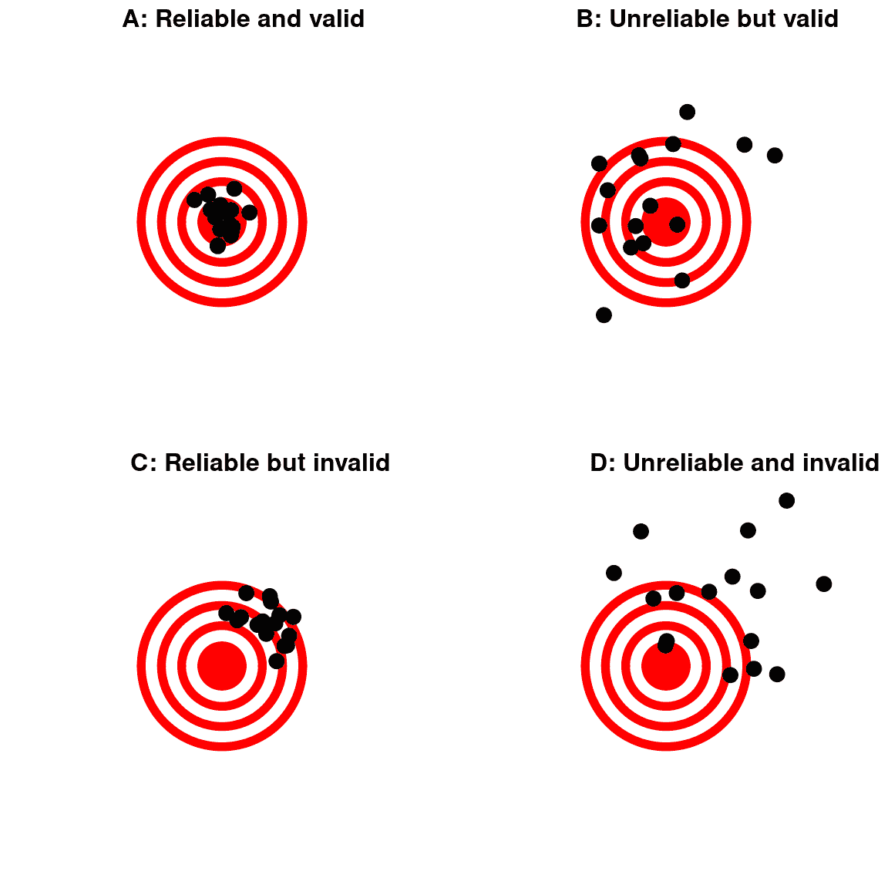

# 第二章：数据处理

> 原文：[`statsthinking21.github.io/statsthinking21-core-site/working-with-data.html`](https://statsthinking21.github.io/statsthinking21-core-site/working-with-data.html)
> 
> 译者：[飞龙](https://github.com/wizardforcel)
> 
> 协议：[CC BY-NC-SA 4.0](https://creativecommons.org/licenses/by-nc-sa/4.0/)

## 2.1 什么是数据？

关于数据的第一个重要观点是数据是复数形式的（尽管有些人不同意我的观点）。你可能还想知道如何发音“数据”-我说“day-tah”，但我知道很多人说“dah-tah”，尽管如此，我还是能和他们保持朋友关系。现在，如果我听到他们说“数据是”，那就是一个更大的问题...

### 2.1.1 定性数据

数据由*变量*组成，其中变量反映了独特的测量或数量。一些变量是*定性*的，意思是它们描述的是质量而不是数值数量。例如，在我的统计课上，我通常进行入门调查，既是为了获取课堂上使用的数据，也是为了更多地了解学生。我问的一个问题是“你最喜欢的食物是什么？”，其中一些答案是：蓝莓、巧克力、玉米卷、意大利面、比萨和芒果。这些数据本质上不是数字；我们可以给每个数据分配一个数字（1=蓝莓，2=巧克力等），但我们只是把数字当作标签而不是真正的数字。这也限制了我们对这些数字应该做什么；例如，计算这些数字的平均值是没有意义的。然而，我们经常使用数字对定性数据进行编码，以便更容易处理，你以后会看到。

### 2.1.2 定量数据

在统计学中，我们更常见地使用*定量*数据，意思是数据是数字的。例如，这里的表 2.1 显示了我在入门课上问的另一个问题的结果，即“你为什么选修这门课？”

表 2.1：对“你为什么选修这门课？”这个问题的不同回答的普遍性的计数

| 你为什么选修这门课？ | 学生人数 |
| :-- | --: |
| 它满足学位计划的要求 | 105 |
| 它满足通识教育广度要求 | 32 |
| 不是必须的，但我对这个主题感兴趣 | 11 |
| 其他 | 4 |

注意学生的答案是定性的，但我们通过计算每个学生给出的回答数量，生成了一个定量的总结。

#### 2.1.2.1 数字的类型

在统计学中，我们使用几种不同类型的数字。了解这些差异很重要，部分原因是因为统计分析语言（如 R）通常区分它们。

**二进制数**。最简单的是二进制数-即零或一。我们经常使用二进制数来表示某事物是真或假，或者存在或不存在。例如，我可能问 10 个人他们是否曾经经历过偏头痛，记录他们的答案为“是”或“否”。通常，我们会使用*逻辑*值，它们的值要么是`TRUE`，要么是`FALSE`。当我们开始使用像 R 这样的编程语言来分析我们的数据时，这将特别有用，因为这些语言已经理解了 TRUE 和 FALSE 的概念。事实上，大多数编程语言都等价地处理真值和二进制数。数字 1 等于逻辑值`TRUE`，数字零等于逻辑值`FALSE`。

**整数**。整数是没有分数或小数部分的整数。我们最常遇到整数的情况是计数，但它们也经常出现在心理测量中。例如，在我的入门调查中，我提出了一系列关于对统计学态度的问题（比如“统计学对我来说非常神秘。”），学生们用 1 到 7 之间的数字来回答。

实数。在统计学中，我们通常使用实数，它们具有分数/小数部分。例如，我们可能测量某人的体重，可以用任意精度来测量，从千克到微克。

## 离散与连续测量

离散测量是指取有限一组特定数值中的一个的测量。这些可以是定性数值（例如，不同品种的狗）或数值数值（例如，一个人在 Facebook 上有多少朋友）。重要的是，测量之间没有中间地带；说一个人有 33.7 个朋友是没有意义的。

连续测量是指以实数定义的测量。它可以落在特定数值范围内的任何位置，尽管通常我们的测量工具会限制我们测量的精度；例如，地板秤可能会将重量测量到最接近的公斤，即使理论上重量可以用更高的精度来测量。

在统计学课程中，通常会更详细地讨论不同的测量“尺度”，这在本章附录中有更详细的讨论。从中最重要的收获是，某些类型的数据上某些类型的统计学是没有意义的。例如，想象一下，我们要从许多人那里收集邮政编码数据。这些数字表示为整数，但它们实际上并不是指数标度；每个邮政编码基本上是不同地区的标签。因此，谈论平均邮政编码是没有意义的。

## 什么构成一个好的测量？

在许多领域，如心理学，我们测量的东西不是一个物理特征，而是一个不可观察的理论概念，我们通常称之为“构念”。例如，假设我想测试你对上述不同类型数字的区别理解得有多好。我可以给你一张小测验，问你几个关于这些概念的问题，并计算你答对了多少。这个测试可能或可能不是对你实际知识构念的一个好的测量 - 例如，如果我把测试写得很混乱或使用你不理解的语言，那么测试可能会表明你不理解这些概念，而实际上你是理解的。另一方面，如果我给出一个非常明显的错误答案的选择题测试，那么即使你实际上不理解材料，你可能也能在测试中表现良好。

通常不可能在没有一定程度的误差的情况下测量一个构念。在上面的例子中，你可能知道答案，但你可能误读问题并回答错误。在其他情况下，被测量的事物本身就存在误差，比如我们测量一个人在简单反应时间测试中的反应时间，这会因为很多原因在每次试验中有所不同。我们通常希望我们的测量误差尽可能低，这可以通过改善测量的质量（例如，使用更好的时间来测量反应时间），或者通过对更多个体测量进行平均来实现。

有时有一个标准，其他测量可以根据这个标准进行测试，我们可能称之为“黄金标准” - 例如，可以使用许多不同的设备来测量睡眠（如测量床上的运动的设备），但它们通常被认为是次要的，与多导睡眠图（使用脑电波测量来量化一个人在每个睡眠阶段中花费的时间）相比。通常黄金标准更难或更昂贵，但更便宜的方法被使用，即使它可能有更大的误差。

当我们考虑什么构成一个好的测量时，我们通常区分一个好的测量的两个不同方面：它应该是可靠的，它应该是有效的。

### 2.3.1 可靠性

可靠性指的是我们测量的一致性。一种常见的可靠性形式，称为“测试-重测可靠性”，衡量了如果同样的测量被执行两次，这些测量有多么一致。例如，我今天可能会给你一份关于你对统计学态度的问卷调查，明天重复这个问卷调查，然后比较你两天的答案；我们希望它们彼此非常相似，除非在两次测试之间发生了应该改变你对统计学看法的事情（比如读了这本书！）。

另一种评估可靠性的方法是在数据包含主观判断的情况下。例如，假设一个研究人员想要确定一种治疗是否改变了自闭症儿童与其他儿童互动的能力，这是通过让专家观察孩子并评价他们与其他孩子的互动来衡量的。在这种情况下，我们希望确保答案不依赖于个体评分者 — 也就是说，我们希望有很高的*评分者间可靠性*。这可以通过让多个评分者进行评分，然后比较他们的评分来确保他们之间的一致性。

如果我们想要将一个测量与另一个测量进行比较，可靠性就很重要，因为两个不同变量之间的关系不能比任何一个变量与自身的关系更强（即，它的可靠性）。这意味着一个不可靠的测量永远不可能与任何其他测量有很强的统计关系。因此，研究人员开发新的测量（比如新的调查）通常会不遗余力地建立和改进其可靠性。

图 2.1：一幅图表演示了可靠性和有效性之间的区别，使用了对靶心的射击。可靠性指的是射击位置的一致性，有效性指的是射击与靶心的准确性。

### 2.3.2 有效性

可靠性很重要，但单靠可靠性还不够：毕竟，我可以通过重新编码每个答案为相同的数字来在人格测试中创建一个完全可靠的测量，而不管这个人实际上是如何回答的。我们希望我们的测量也是*有效的* — 也就是说，我们希望确保我们实际上正在测量我们认为正在测量的构建物（图 2.1）。通常讨论的有效性类型有很多种；我们将重点关注其中的三种。

*面向有效性*。测量在表面上是否合理？如果我告诉你我要通过观察舌头的颜色来测量一个人的血压，你可能会认为这在表面上不是一个有效的测量。另一方面，使用血压袖带就具有面向有效性。这通常是在我们深入讨论有效性的更复杂方面之前的第一个现实检查。

*构造效度*。测量是否以适当的方式与其他测量相关？这通常分为两个方面。*收敛效度*意味着测量应与被认为反映相同构造的其他测量密切相关。假设我对使用问卷调查或面试来衡量一个人的外向性感兴趣。如果这两种不同的测量都与彼此密切相关，那么就证明了收敛效度。另一方面，被认为反映不同构造的测量应该是无关的，称为*发散效度*。如果我的个性理论认为外向性和责任心是两个不同的构造，那么我还应该看到我的外向性测量与责任心测量是*无关*的。

*预测效度*。如果我们的测量确实有效，那么它们也应该能预测其他结果。例如，假设我们认为心理特质的感觉寻求（对新经验的渴望）与现实世界中的冒险行为有关。为了测试感觉寻求测量的预测效度，我们将测试测试分数如何预测测量现实世界冒险行为的不同调查的分数。

## 2.4 学习目标

阅读完本章后，您应该能够：

+   区分不同类型的变量（定量/定性，二进制/整数/实数，离散/连续）并举例说明这些变量的每种类型

+   区分可靠性和有效性的概念，并将每个概念应用于特定数据集

## 2.5 建议阅读

+   [*具有 R 应用的心理测量理论简介*](http://www.personality-project.org/r/book/) - 关于心理测量的免费在线教材

## 2.6 附录

### 2.6.1 测量尺度

所有变量必须至少具有两个不同的可能值（否则它们将是一个*常数*而不是一个变量），但变量的不同值可以以不同的方式相互关联，我们称之为*测量尺度*。变量的不同值可以有四种不同的方式。

+   *身份*：变量的每个值都有独特的含义。

+   *大小*：变量的值反映不同的大小，并且彼此之间有一个有序的关系 - 也就是说，一些值较大，一些值较小。

+   *等距*：测量尺度上的单位彼此相等。这意味着，例如，1 和 2 之间的差异在大小上等同于 19 和 20 之间的差异。

+   *绝对零点*：尺度具有真正有意义的零点。例如，对于许多身高或体重等物理量的测量，这是被测量物的完全缺席。

测量的四种不同尺度与变量值的不同方式相对应。

*名义尺度*。名义变量满足身份的标准，即变量的每个值代表不同的东西，但数字只是作为上面讨论的定性标签。例如，我们可能会问人们他们的政党隶属，然后将其编码为数字：1 =“共和党”，2 =“民主党”，3 =“自由党”，等等。然而，不同的数字之间没有任何有序关系。

*序数刻度*。序数变量满足身份和大小的标准，使得值可以按其大小排序。例如，我们可能要求慢性疼痛患者每天填写一张表，评估他们的疼痛有多严重，使用 1-7 的数字刻度。请注意，虽然在报告 6 和报告 3 的日子，这个人可能在前者比后者感到更痛苦，但说他们的痛苦在前者和后者的日子上是两倍严重是没有意义的；排序为我们提供了有关相对大小的信息，但值之间的差异在大小上不一定相等。

*间隔刻度*。间隔刻度具有序数刻度的所有特征，但是除此之外，测量刻度上单位之间的间隔可以被视为相等。一个标准的例子是用摄氏或华氏度测量的物理温度；10 度和 20 度之间的物理差异与 90 度和 100 度之间的物理差异相同，但每个刻度也可以取负值。

*比率刻度*。比率刻度变量具有上述所有四个特征：身份、大小、相等间隔和绝对零点。比率刻度变量与间隔刻度变量的区别在于比率刻度变量具有真正的零点。比率刻度变量的例子包括身高和体重，以及以开尔文度测量的温度。

我们必须注意变量的测量刻度有两个重要原因。首先，刻度决定了我们可以对数据应用什么样的数学运算（见表 2.2）。名义变量只能比较是否相等；也就是说，该变量上的两个观察是否具有相同的数值？对名义变量应用其他数学运算是没有意义的，因为它们在名义变量中并不真正作为数字，而是作为标签。对于序数变量，我们也可以测试一个值是否大于或小于另一个值，但我们不能进行任何算术运算。间隔和比率变量允许我们执行算术运算；对于间隔变量，我们只能添加或减去值，而对于比率变量，我们还可以相乘和相除值。

表 2.2：不同的测量刻度允许不同类型的数值运算

|  | 相等/不相等 | 大于/小于 | 相加/相减 | 相乘/相除 |
| :-- | :-- | :-- | :-- | :-- |
| 名义 | 可以 |  |  |  |
| 序数 | 可以 | 可以 |  |  |
| 间隔 | 可以 | 可以 | 可以 |  |
| 比率 | 可以 | 可以 | 可以 | 可以 |

这些限制也意味着我们可以计算每种变量类型的某些统计数据。简单涉及不同值的计数统计（例如最常见的值，称为*模式*）可以计算在任何变量类型上。其他统计数据基于值的排序或排名（例如*中位数*，当所有值按其大小排序时，它是中间值），这要求至少值在序数刻度上。最后，涉及值相加的统计数据（例如平均值，或*均值*）要求变量至少在间隔刻度上。话虽如此，我们应该注意，研究人员经常计算仅在序数上的变量的均值（例如个性测试的回答），但这有时可能会有问题。
