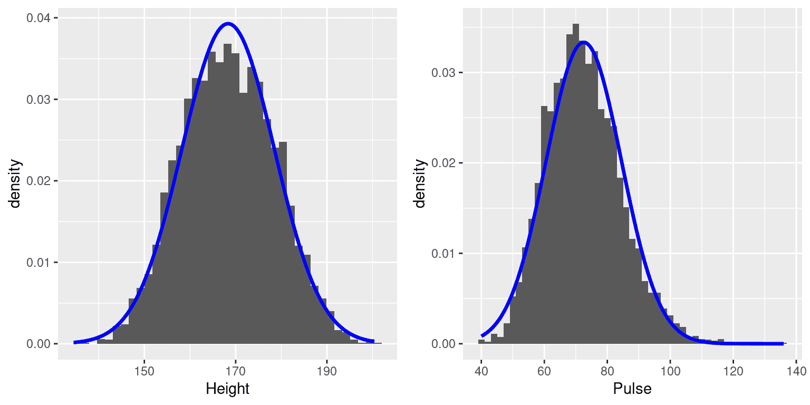

# 第三章：总结数据

> 原文：[`statsthinking21.github.io/statsthinking21-core-site/summarizing-data.html`](https://statsthinking21.github.io/statsthinking21-core-site/summarizing-data.html)
> 
> 译者：[飞龙](https://github.com/wizardforcel)
> 
> 协议：[CC BY-NC-SA 4.0](https://creativecommons.org/licenses/by-nc-sa/4.0/)

我在介绍中提到统计学的一个重大发现是，我们可以通过丢弃信息来更好地理解世界，这正是我们总结数据时所做的。在本章中，我们将讨论为什么以及如何总结数据。

## 3.1 为什么总结数据？

当我们总结数据时，我们必然会丢失信息，人们可能会对此提出异议。举个例子，让我们回到我们在第一章中讨论的 PURE 研究。我们难道不应该相信每个个体的所有细节都很重要，而不仅仅是数据集中总结的那些细节吗？那么数据收集的具体细节，比如一天中的时间或参与者的心情呢？当我们总结数据时，所有这些细节都会丢失。

我们总结数据的一个原因是它为我们提供了一种*概括*的方式 - 也就是说，可以做出超出具体观察的一般性陈述。概括的重要性在作家豪尔赫·路易斯·博尔赫斯的短篇小说《费内斯的记忆》中得到了强调，该小说描述了一个失去遗忘能力的个体。博尔赫斯着重讨论了概括（即丢弃数据）与思维之间的关系：“思考就是忘记差异，概括，抽象。在费内斯过于充实的世界中，只有细节。”

心理学家长期以来一直研究思维中的概括方式。一个例子是分类：我们能够轻松地识别“鸟类”这一类别的不同例子，即使这些个体例子在表面特征上可能非常不同（比如鸵鸟、知更鸟和鸡）。重要的是，概括让我们能够对这些个体做出预测 - 在鸟类的情况下，我们可以预测它们能够飞行和吃种子，而它们可能不能开车或说英语。这些预测并不总是正确的，但它们通常足够在现实世界中有用。

## 3.2 使用表格总结数据

总结数据的一个简单方法是生成一个代表各种类型观察计数的表格。这种类型的表格已经被使用了数千年（见图 3.1）。

图 3.1：来自卢浮宫的苏美尔文版，显示了一份房屋和田地的销售合同。公共领域，通过维基共享资源。

让我们看一些使用表格的例子，使用一个更现实的数据集。在本书中，我们将使用[国家健康和营养调查(NHANES)](https://www.cdc.gov/nchs/nhanes/index.htm)数据集。这是一项持续研究，评估来自美国的个体样本在许多不同变量上的健康和营养状况。我们将使用 R 统计软件包可用的数据集版本。在这个例子中，我们将查看一个简单的变量，在数据集中称为*PhysActive*。这个变量包含三种不同的值：“是”或“否”（表示个人是否报告进行“中等或剧烈强度的体育、健身或娱乐活动”），或者如果该个体的数据缺失，则为“NA”。数据可能缺失的原因有不同；例如，这个问题没有问及 12 岁以下的儿童，而在其他情况下，成年人可能在采访中拒绝回答问题，或者采访者在表格上记录答案的方式可能不可读。

### 3.2.1 频率分布

*分布*描述了数据如何分布在不同的可能值之间。例如，让我们看看有多少人属于每个身体活动类别。

表 3.1：PhysActive 变量的频率分布

| 身体活动 | 绝对频率 |
| :-- | --: |
| 否 | 2473 |
| 是 | 2972 |
| NA | 1334 |

表 3.1 显示了每个不同值的频率；有 2473 个人回答“否”，2972 个人回答“是”，1334 个人没有回答。我们称这为*频率分布*，因为它告诉我们在我们的样本中每个可能值有多频繁。

这向我们展示了两种回答的绝对频率，对于实际给出回答的所有人。我们可以从中看出说“是”的人比说“否”的人更多，但从绝对数字中很难判断相对差异有多大。因此，我们通常更愿意使用*相对频率*来呈现数据，这是通过将每个频率除以所有频率的总和得到的：

$$ 相对频率 _i = \frac{绝对频率 _i}{\sum_{j=1}^N 绝对频率 _j} $$ 

相对频率提供了一个更容易看出不平衡有多大的方式。我们还可以将相对频率解释为百分比，方法是将它们乘以 100。在这个例子中，我们也会删除 NA 值，因为我们希望能够解释活跃和不活跃人群的相对频率。但是，为了使这有意义，我们必须假设 NA 值是“随机缺失”的，这意味着它们的存在或缺失与该人的变量的真实值无关。例如，如果不活跃的参与者更有可能拒绝回答问题，那么这将*偏倚*我们对身体活动频率的估计，这意味着我们的估计将与真实值不同。

表 3.2：PhysActive 变量的绝对频率和相对频率以及百分比

| 身体活动 | 绝对频率 | 相对频率 | 百分比 |
| :-- | --: | --: | --: |
| 否 | 2473 | 0.45 | 45 |
| 是 | 2972 | 0.55 | 55 |

表 3.2 让我们看到 NHANES 样本中 45.4%的个体说“否”，54.6%说“是”。

### 3.2.2 累积分布

我们上面检查的*PhysActive*变量只有两个可能的值，但通常我们希望总结可能有更多可能值的数据。当这些值是定量的时，一种有用的总结方式是通过我们所谓的*累积*频率表示：我们不是问有多少观察值取特定值，而是问有多少取特定值*或更少*的值。

让我们看看 NHANES 数据集中的另一个变量，称为*SleepHrsNight*，记录参与者在工作日通常睡眠的小时数。表 3.3 显示了一个频率表，我们删除了任何对这个问题缺失数据的人。我们可以通过查看表格来开始总结数据集；例如，我们可以看到大多数人报告每晚睡 6 到 8 小时。为了更清楚地看到这一点，我们可以绘制一个*直方图*，显示每个不同值的案例数量；参见图 3.2 的左面板。我们还可以绘制相对频率，我们经常称为*密度* - 参见图 3.2 的右面板。

表 3.3：NHANES 数据集中每晚睡眠小时数的频率分布

| 每晚睡眠小时数 | 绝对频率 | 相对频率 | 百分比 |
| --: | --: | --: | --: |
| 2 | 9 | 0.00 | 0.18 |
| 3 | 49 | 0.01 | 0.97 |
| 4 | 200 | 0.04 | 3.97 |
| 5 | 406 | 0.08 | 8.06 |
| 6 | 1172 | 0.23 | 23.28 |
| 7 | 1394 | 0.28 | 27.69 |
| 8 | 1405 | 0.28 | 27.90 |
| 9 | 271 | 0.05 | 5.38 |
| 10 | 97 | 0.02 | 1.93 |
| 11 | 15 | 0.00 | 0.30 |
| 12 | 17 | 0.00 | 0.34 |

图 3.2：左：直方图显示 NHANES 数据集中报告每个可能值的 SleepHrsNight 变量的人数（左）和比例（右）。

如果我们想知道有多少人报告睡眠 5 小时或更少，该怎么办？为了找到这个值，我们可以计算*累积分布*。要计算某个值 j 的累积频率，我们将所有值直到 j 的频率相加：

$$ 累积频率 _j = \sum_{i=1}^{j}{绝对\频率 _i} $$

表 3.4：SleepHrsNight 变量的绝对和累积频率分布

| 每晚睡眠小时数 | 绝对频率 | 累积频率 |
| --: | --: | --: |
| 2 | 9 | 9 |
| 3 | 49 | 58 |
| 4 | 200 | 258 |
| 5 | 406 | 664 |
| 6 | 1172 | 1836 |
| 7 | 1394 | 3230 |
| 8 | 1405 | 4635 |
| 9 | 271 | 4906 |
| 10 | 97 | 5003 |
| 11 | 15 | 5018 |
| 12 | 17 | 5035 |

让我们对我们的睡眠变量进行这样的计算，计算绝对和累积频率。在图 3.3 的左面板中，我们绘制数据以查看这些表示是什么样子的；绝对频率值以实线绘制，累积频率以虚线绘制。我们看到累积频率是*单调递增*的 - 也就是说，它只能上升或保持不变，但它永远不会下降。同样，我们通常发现相对频率比绝对频率更有用；这些在图 3.3 的右面板中绘制。重要的是，相对频率图的形状与绝对频率图完全相同 - 只是值的大小发生了变化。

图 3.3：频率（左）和比例（右）的相对（实线）和累积相对（虚线）值的图，表示 SleepHrsNight 的可能值。

### 3.2.3 绘制直方图

图 3.4：NHANES 中年龄（左）和身高（右）变量的直方图。

我们上面检查的变量相当简单，只有几个可能的值。现在让我们看一个更复杂的变量：年龄。首先让我们绘制 NHANES 数据集中所有个体的*年龄*变量（见图 3.4 的左面板）。你在那里看到了什么？首先，你应该注意到每个年龄组中的个体数量随时间而减少。这是有道理的，因为人口是随机抽样的，因此随着时间的推移，死亡导致年龄较大的人口减少。其次，你可能会注意到图表中 80 岁年龄有一个很大的峰值。你觉得那是怎么回事？

如果我们查找 NHANES 数据集的信息，我们会看到*年龄*变量的以下定义：“研究参与者筛查时的年龄。注意：80 岁或以上的受试者记录为 80 岁。”这是因为相对较少的具有非常高年龄的个体可能会更容易识别数据集中的特定人物，如果你知道他们的确切年龄；研究人员通常承诺保护参与者的身份保密，这是他们可以帮助保护研究对象的事情之一。这也突显了了解数据的来源和处理方式总是很重要的；否则我们可能会错误地解释它们，认为 80 岁以上的人在样本中被过度代表了。

让我们看一下 NHANES 数据集中的另一个更复杂的变量：身高。身高值的直方图在图 3.4 的右面板中绘制。你应该注意到这个分布的第一件事是，它的大部分密度集中在大约 170 厘米左右，但分布在左侧有一个“尾巴”；有一小部分个体的身高要小得多。你觉得这里发生了什么？

你可能已经直觉到，小身高来自数据集中的儿童。一种检查这一点的方法是为儿童和成年人分别使用不同颜色绘制直方图（图 3.5 的左面板）。这显示了所有非常短的身高确实来自样本中的儿童。让我们创建一个只包括成年人的 NHANES 的新版本，然后仅为他们绘制直方图（图 3.5 的右面板）。在那个图中，分布看起来更对称。正如我们将在后面看到的，这是一个很好的*正态*（或*高斯*）分布的例子。

图 3.5：NHANES 身高直方图。A：分别绘制儿童（灰色）和成年人（黑色）的值。B：仅成年人的值。C：与 B 相同，但 bin 宽度=0.1

### 3.2.4 直方图箱

在我们早期关于睡眠变量的例子中，数据以整数报告，我们只是计算了报告每个可能值的人数。然而，如果你看一下 NHANES 中身高变量的一些值（如表 3.5 所示），你会发现它是以厘米为单位测量的，精确到小数点后一位。

表 3.5：NHANES 数据框中身高的一些值。

| 身高 |
| :-- |
| 169.6 |
| 169.8 |
| 167.5 |
| 155.2 |
| 173.8 |
| 174.5 |

图 3.5 的 C 面板显示了一个直方图，它计算了小数点后一位的每个可能值的密度。该直方图看起来非常不规则，这是因为特定小数位值的变异性。例如，值 173.2 出现了 32 次，而值 173.3 只出现了 15 次。我们可能不认为这两个身高的普遍性真的有这么大的差异；更有可能的是这只是由于我们样本中的随机变异性。

通常，当我们创建连续数据的直方图或者存在许多可能值的数据时，我们会对值进行*分箱*，这样我们不是计算和绘制每个特定值的频率，而是计算和绘制落入特定范围内的值的频率。这就是为什么在 3.5 的面板 B 中，图看起来不那么锯齿状；在这个面板中，我们将箱宽设置为 1，这意味着直方图是通过组合宽度为 1 的箱内的值来计算的；因此，值 1.3、1.5 和 1.6 都将计入相同箱的频率，该箱的范围从等于 1 的值到小于 2 的值。

请注意，一旦选择了箱宽，箱数就由数据确定：

$$箱数= \frac{分数范围}{箱宽}$$

并没有硬性的规则来选择最佳的箱宽。有时会很明显（例如当只有少数可能的值时），但在许多情况下，这将需要反复试验。有一些方法可以自动找到最佳的箱尺寸，例如我们将在一些后续示例中使用的 Freedman-Diaconis 方法。

## 3.3 分布的理想化表示

数据集就像雪花一样，每一个都是不同的，但是仍然有一些模式在不同类型的数据中经常看到。这使我们能够使用数据的理想化表示来进一步总结它们。让我们以 3.5 中绘制的成年人身高数据为例，并将它们与一个非常不同的变量一起绘制：脉搏率（每分钟心跳次数），也是在 NHANES 中测量的（参见图 3.6）。

图 3.6：NHANES 数据集中身高（左）和脉搏（右）的直方图，每个数据集上都叠加了正态分布。

虽然这些图看起来肯定不完全相同，但它们都具有相对对称地围绕中间的圆形峰值的一般特征。事实上，当我们收集数据时，这种形状实际上是我们观察到的分布的常见形状之一，我们称之为*正态*（或*高斯*）分布。这个分布是用两个值（我们称之为分布的*参数*）来定义的：中心峰值的位置（我们称之为*均值*）和分布的宽度（用一个称为*标准差*的参数来描述）。图 3.6 显示了在每个直方图上方绘制的适当的正态分布。你可以看到，尽管曲线不完全符合数据，但它们在表征分布方面做得相当不错-只用两个数字！

正如我们稍后将在讨论中心极限定理时看到的那样，世界上许多变量呈现正态分布的形式有一个深刻的数学原因。

### 3.3.1 偏度

图 3.6 中的示例基本上符合正态分布，但在许多情况下，数据会以一种系统的方式偏离正态分布。数据偏离的一种方式是当它们是不对称的，使得分布的一个尾部比另一个更密集。我们称之为“偏度”。当测量被限制为非负时，偏斜通常发生，例如当我们在计数或测量经过的时间时（因此变量不能取负值）。

在旧金山国际机场安检等待时间的平均值中可以看到相对较小的偏斜，如图 3.7 的左面板所示。您可以看到，虽然大多数等待时间都不到 20 分钟，但也有一些情况下等待时间要长得多，超过 60 分钟！这是一个“右偏”分布的例子，右尾比左尾更长；当查看计数或测量时间时，这种情况很常见，因为它们不能小于零。看到“左偏”分布相对较少，但也可能发生，例如在查看不能大于一的分数值时。

右偏和长尾分布的例子。左：旧金山国际机场 A 航站楼安检等待时间的平均值（2017 年 1 月至 10 月），来源于 https://awt.cbp.gov/。右：3633 名个体的 Facebook 好友数量的直方图，来源于斯坦福大型网络数据库。拥有最多朋友的人用菱形表示。

图 3.7：右偏和长尾分布的例子。左：旧金山国际机场 A 航站楼安检等待时间的平均值（2017 年 1 月至 10 月），来源于[`awt.cbp.gov/`](https://awt.cbp.gov/)。右：3633 名个体的 Facebook 好友数量的直方图，来源于斯坦福大型网络数据库。拥有最多朋友的人用菱形表示。

### 3.3.2 长尾分布

在历史上，统计学主要关注正态分布的数据，但有许多数据类型看起来与正态分布完全不同。特别是，许多现实世界的分布都是“长尾”的，意味着右尾远远超出了分布的最典型成员；也就是说，它们是极端偏斜的。长尾分布最有趣的数据类型之一来自对社交网络的分析。例如，让我们看一下[斯坦福大型网络数据库](https://snap.stanford.edu/data/egonets-Facebook.html)中的 Facebook 好友数据，并绘制数据库中 3663 人的好友数量的直方图（见图 3.7 的右面板）。正如我们所看到的，这个分布有一个非常长的右尾 - 平均每个人有 24.09 个朋友，而拥有最多朋友的人（用蓝点表示）有 1043 个！

长尾分布在现实世界中越来越被认可。特别是，许多复杂系统的特征都以这些分布为特征，从文本中单词的频率，到不同机场进出的航班数量，再到大脑网络的连接性。长尾分布可能有多种形成方式，但一个常见的情况是所谓的“马太效应”：

> 因为凡有的，还要给他使他多有，并且还要使他充足；没有的，连他所有的也要夺过来。 — 马太福音 25:29，修订标准版

这经常被改述为“富者愈富”。在这些情况下，优势会累积，这样那些拥有更多朋友的人就能接触到更多新朋友，而那些拥有更多金钱的人则有能力做一些能增加他们财富的事情。

随着课程的进行，我们将看到几个长尾分布的例子，我们应该记住，当面对长尾数据时，统计学中的许多工具可能会失败。正如纳西姆·尼古拉斯·塔勒布在他的书《黑天鹅》中指出的那样，这种长尾分布在 2008 年的金融危机中发挥了关键作用，因为许多交易员使用的金融模型假设金融系统会遵循正态分布，而事实显然并非如此。

## 3.4 学习目标

阅读完本章后，您应该能够：

+   计算给定数据集的绝对、相对和累积频率分布

+   生成频率分布的图形表示

+   描述正态分布和长尾分布之间的区别，并描述通常导致每种分布的情况

## 3.5 建议阅读

+   *黑天鹅：高度不太可能事件的影响*，作者纳西姆·尼古拉斯·塔勒布
