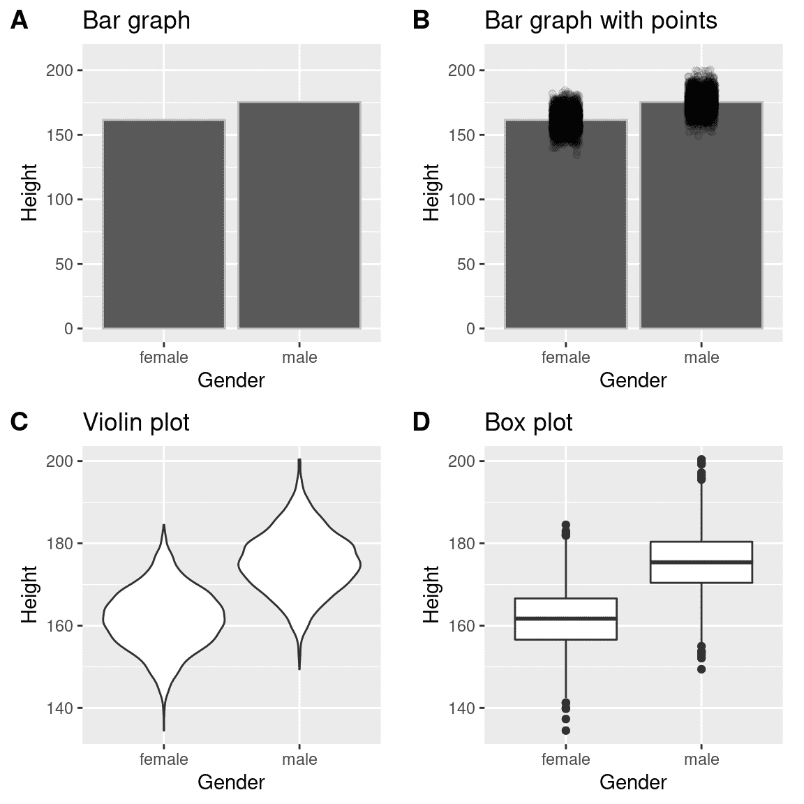

# 第四章：数据可视化

> 原文：[`statsthinking21.github.io/statsthinking21-core-site/data-visualization.html`](https://statsthinking21.github.io/statsthinking21-core-site/data-visualization.html)
> 
> 译者：[飞龙](https://github.com/wizardforcel)
> 
> 协议：[CC BY-NC-SA 4.0](https://creativecommons.org/licenses/by-nc-sa/4.0/)

1986 年 1 月 28 日，航天飞机挑战者号在起飞后 73 秒爆炸，造成机上 7 名宇航员全部遇难。与任何类似灾难发生时一样，对事故原因进行了官方调查，发现连接固体火箭助推器两个部分的 O 形圈泄漏，导致接头失效和大型液体燃料箱爆炸（见图 4.1）。

![火箭助推器泄漏燃料的图像，在爆炸前几秒。火箭侧面可见的小火焰是 O 形圈失效的地方。由 NASA（NASA 描述中的伟大图像）[公有领域]，通过 Wikimedia Commons](img/fa1586f4ea3833d1ab9f46d37d589315.png)

图 4.1：火箭助推器泄漏燃料的图像，在爆炸前几秒。火箭侧面可见的小火焰是 O 形圈失效的地方。由 NASA（NASA 描述中的伟大图像）[公有领域]，通过 Wikimedia Commons

调查发现 NASA 决策过程的许多方面存在缺陷，特别关注 NASA 工作人员与承包商 Morton Thiokol 的工程师之间的会议，后者建造了固体火箭助推器。这些工程师特别担心，因为预测发射当天早上的温度将非常寒冷，并且他们拥有以往发射的数据，显示 O 形圈在较低温度下的性能受到影响。在发射前一晚的会议上，工程师向 NASA 经理展示了他们的数据，但未能说服他们推迟发射。他们的证据是一组手写幻灯片，显示了以往各次发射的数字。

可视化专家爱德华·图夫特认为，通过正确呈现所有数据，工程师们本可以更有说服力。特别是，他们可以展示类似于图 4.2 中的图表，突出显示了两个重要事实。首先，它显示 O 形圈损坏的程度（由以往飞行后从海洋中检索出的固体火箭助推器上发现的侵蚀和烟灰量定义）与起飞时的温度密切相关。其次，它显示了 1 月 28 日早上的预测温度范围（显示在阴影区）远超过了以往所有发射的范围。虽然我们无法确定，但这似乎至少是有可能更有说服力的。

图 4.2：图夫特损伤指数数据的重新绘制。线显示了数据的趋势，阴影区显示了发射当天早上的预测温度。

## 4.1 情节解剖

绘制数据的目标是以二维（偶尔是三维）的方式呈现数据集的摘要。我们将这些维度称为*轴* - 水平轴称为*X 轴*，垂直轴称为*Y 轴*。我们可以沿着轴排列数据，以突出显示数据值。这些值可以是连续的，也可以是分类的。

我们可以使用许多不同类型的图来呈现数据，它们各有优缺点。假设我们对 NHANES 数据集中男性和女性身高差异感兴趣。图 4.3 展示了绘制这些数据的四种不同方式。

1.  面板 A 中的条形图显示了均值的差异，但没有显示出围绕这些均值的数据有多大的波动 - 正如我们将在后面看到的那样，了解这一点对于确定我们是否认为两组之间的差异足够重要至关重要。

1.  第二个图显示了所有数据点叠加在条形图上 - 这使得男性和女性身高的分布有些重叠更清晰，但由于数据点的数量很大，仍然很难看清楚。

通常我们更喜欢使用一种提供更清晰的数据点分布视图的绘图技术。

1.  在面板 C 中，我们看到了一个*小提琴图*的例子，它绘制了每个条件下数据的分布（稍微平滑了一下）。

1.  另一个选择是面板 D 中显示的*箱线图*，它显示了中位数（中心线）、变异性的度量（箱子的宽度，基于一个称为四分位距的度量），以及任何异常值（由线末端的点表示）。这两种方法都是有效的显示数据的方式，可以很好地了解数据的分布。

图 4.3：在 NHANES 数据集中绘制男性和女性身高差异的四种不同方式。面板 A 绘制了两组的均值，这样无法评估两个分布的相对重叠。面板 B 显示了相同的条形图，但也叠加了数据点，使它们可以看到它们的整体分布。面板 C 显示了小提琴图，显示了每个组的数据集的分布。面板 D 显示了一个箱线图，突出显示了分布的扩展以及任何异常值（显示为单独的点）。

## 4.2 良好可视化的原则

关于有效可视化数据已经写了很多书。大多数作者都同意一些原则，而其他一些原则则更有争议。在这里，我们总结了一些主要原则；如果你想了解更多，那么一些好的资源在本章末尾的“建议阅读”部分中列出。

### 4.2.1 展示数据并使其突出显示

假设我进行了一项研究，研究牙齿健康与使用牙线时间之间的关系，我想要可视化我的数据。图 4.4 展示了这些数据的四种可能呈现方式。

1.  在面板 A 中，我们实际上没有显示数据，只是一条表达数据关系的线。这显然不是最佳选择，因为我们实际上看不到基础数据是什么样子。

面板 B-D 显示了绘制实际数据的三种可能结果，每个图显示了数据可能呈现的不同方式。

1.  如果我们在面板 B 中看到这个图，我们可能会感到怀疑 - 真实数据很少会遵循如此精确的模式。

1.  另一方面，面板 C 中的数据看起来像是真实数据 - 它们显示了一个一般的趋势，但是杂乱无章，就像世界上的数据通常一样。

1.  面板 D 中的数据告诉我们，两个变量之间的明显关系仅仅是由一个个体引起的，我们称之为*离群值*，因为它们远远超出了群体的模式。很明显，我们可能不希望从一个由一个数据点驱动的效应中得出太多结论。这个图强调了在对数据进行任何总结之前，查看原始数据是*非常*重要的。

图 4.4：牙齿健康示例的四种不同可能的数据呈现。散点图中的每个点代表数据集中的一个数据点，每个图中的线代表数据的线性趋势。

### 4.2.2 最大化数据/墨水比

Edward Tufte 提出了一个叫做数据/墨水比的概念：

$$ 数据/墨水比例 = \frac{数据上使用的墨水量}{总墨水量} $$ 

这样做的目的是最大限度地减少视觉杂乱，让数据显示出来。例如，看一下图 4.5 中牙齿健康数据的两种呈现。两个面板显示相同的数据，但面板 A 更容易理解，因为它的数据/墨水比例相对较高。

图 4.5：使用两种不同数据/墨水比例绘制相同数据的示例。

### 4.2.3 避免图表垃圾

在流行媒体中，经常会看到数据呈现的演示，这些演示装饰有许多与内容主题相关但与实际数据无关的视觉元素。这被称为*图表垃圾*，应该尽一切可能避免。

避免图表垃圾的一个好方法是避免使用流行的电子表格程序来绘制数据。例如，图 4.6 中的图表（使用 Microsoft Excel 创建）绘制了美国不同宗教的相对流行程度。这个图有至少三个问题：

+   它在每个条形上叠加了与实际数据无关的图形。

+   它有分散注意力的背景纹理

+   它使用了三维条形图，扭曲了数据

图 4.6：图表垃圾的示例。

### 4.2.4 避免扭曲数据

通常可以利用可视化来扭曲数据集的信息。一个非常常见的方法是使用不同的轴缩放来夸大或隐藏数据的模式。例如，假设我们有兴趣看看美国的暴力犯罪率是否有变化。在图 4.7 中，我们可以看到这些数据以使犯罪率看起来保持不变或暴跌的方式绘制。相同的数据可以讲述两个完全不同的故事！

图 4.7：1990 年至 2014 年的犯罪数据随时间的变化。面板 A 和 B 显示相同的数据，但 Y 轴上的值范围不同。数据来源于[`www.ucrdatatool.gov/Search/Crime/State/RunCrimeStatebyState.cfm`](https://www.ucrdatatool.gov/Search/Crime/State/RunCrimeStatebyState.cfm)

统计数据可视化中的一个主要争议是如何选择 Y 轴，特别是是否应该始终包括零。在他著名的书《如何用统计数据撒谎》中，达雷尔·赫夫坚决主张 Y 轴上应始终包括零点。另一方面，爱德华·图夫特提出了相反的观点：

> “总的来说，在时间序列中，使用一个显示数据而不是零点的基线；不要花费大量的空白垂直空间来达到零点，以掩盖数据线本身的情况。”（来自[`qz.com/418083/its-ok-not-to-start-your-y-axis-at-zero/`](https://qz.com/418083/its-ok-not-to-start-your-y-axis-at-zero/)）

当然，有些情况下使用零点根本毫无意义。比如，我们有兴趣绘制个体随时间的体温。在图 4.8 中，我们绘制了相同（模拟的）数据，带有或不带有 Y 轴上的零点。显然，通过在 Y 轴上绘制这些数据（面板 A），我们在图中浪费了很多空间，因为一个活人的体温永远不可能降到零！通过包括零点，我们也使得第 21-30 天的温度变化不那么明显。总的来说，我倾向于在线图和散点图中使用图表中的所有空间，除非零点真的很重要需要突出。

图 4.8：随时间变化的体温，带有或不带有 Y 轴上的零点绘制。

爱德华·图夫特引入了“谎言因素”的概念，用来描述可视化中的物理差异与数据差异的大小程度。如果一个图形的谎言因素接近 1，那么它就适当地代表了数据，而远离 1 的谎言因素反映了对基础数据的扭曲。

谎言因素支持了在许多情况下应该始终在条形图中包括零点的观点。在图 4.9 中，我们绘制了相同的数据，带有或不带有 Y 轴上的零点。在面板 A 中，两个条之间的面积比例差与数值之间的比例差完全相同（即谎言因素=1），而在面板 B 中（不包括零点），两个条之间的面积比例差大约是数值之间的比例差的 2.8 倍，因此在视觉上夸大了差异的大小。

图 4.9：带有相关谎言因素的两个条形图。

## 4.3 容纳人类的局限性

人类既有感知限制又有认知限制，这些限制可能会使得一些可视化图表非常难以理解。在构建可视化图表时，牢记这些限制总是很重要的。

### 4.3.1 感知限制

许多人（包括我自己）面临的一个重要感知限制是色盲。这可能会使得很难感知图中的信息（比如[图 4.10](data-visualization.html#fig:badColors)中的图），其中元素之间只有颜色对比而没有亮度对比。使用在亮度和/或纹理上有显著差异的图形元素总是有帮助的，除了颜色。许多可视化工具也提供了[“色盲友好”的调色板](http://www.cookbook-r.com/Graphs/Colors_(ggplot2)/#a-colorblind-friendly-palette)。

图 4.10：仅依赖颜色对比的糟糕图例。

即使对于色觉完美的人来说，也存在感知限制，这可能使一些图表无效。这就是统计学家*永远*不使用饼图的原因：人类很难准确地感知形状的体积差异。图 4.11 中的饼图（呈现了我们上面展示的宗教信仰数据）展示了这一点有多棘手。

图 4.11：饼图的一个例子，突出了理解不同饼片的相对体积的困难。

这个图表有几个糟糕的地方。首先，它需要区分底部的大量颜色小块。其次，视觉透视扭曲了相对数量，使得天主教的饼块看起来比无信仰的饼块大得多，而实际上无信仰的数量略大（22.8%对 20.8%），正如在图 4.6 中所显示的那样。第三，通过将图例与图形分开，它要求观察者在工作记忆中保存信息，以便在图形和图例之间进行映射，并进行许多“表格查找”，以便不断地将图例标签与可视化相匹配。最后，它使用的文本太小，使得在不放大的情况下无法阅读。

使用更合理的方法绘制数据（图 4.12），我们可以更清楚地看到模式。这个图表可能看起来不像使用 Excel 生成的饼图那样引人注目，但它是数据更有效和准确的表现。

图 4.12：宗教信仰数据的更清晰呈现（来源于[http://www.pewforum.org/religious-landscape-study/](http://www.pewforum.org/religious-landscape-study/)）。

这个图表允许观察者基于一个共同的比例尺（y 轴）来进行比较。人类倾向于更准确地解读基于这些感知元素的差异，而不是基于面积或颜色。

## 4.4 考虑其他因素的修正

通常我们对绘制的数据感兴趣，其中感兴趣的变量受到除我们感兴趣的变量之外的其他因素的影响。例如，假设我们想了解汽油价格随时间的变化。图 4.13 显示了历史汽油价格数据，无论是否考虑通货膨胀进行调整。尽管未经调整的数据显示了巨大的增长，但经过调整的数据表明这主要是通货膨胀的反映。其他需要调整数据以考虑其他因素的例子包括人口规模和跨不同季节收集的数据。

图 4.13：美国 1930 年至 2013 年的汽油价格（取自[http://www.thepeoplehistory.com/70yearsofpricechange.html](http://www.thepeoplehistory.com/70yearsofpricechange.html)），是否考虑通货膨胀进行修正（基于消费者价格指数）。

## 4.5 学习目标

阅读完本章后，您应该能够：

+   描述区分好坏图表的原则，并使用它们来识别好坏图表。

+   了解必须适应的人类局限，以制作有效的图表。

+   承诺永远不要制作饼图。*永远*。

## 4.6 建议阅读和视频

+   [*数据可视化基础*](https://serialmentor.com/dataviz/)，作者克劳斯·威尔克

+   《视觉解释》，作者爱德华·图夫特

+   《数据可视化》，作者威廉·S·克利夫兰

+   《眼睛和心灵的图表设计》，作者斯蒂芬·M·科斯林

+   [*人类如何看待数据*](https://www.youtube.com/watch?v=fSgEeI2Xpdc&feature=youtu.be)，作者约翰·劳塞尔
