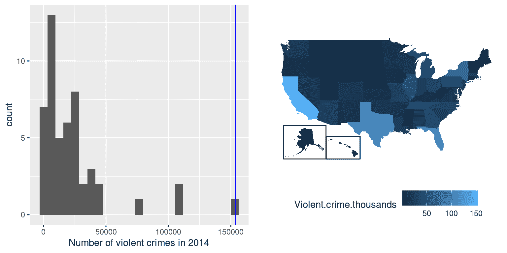
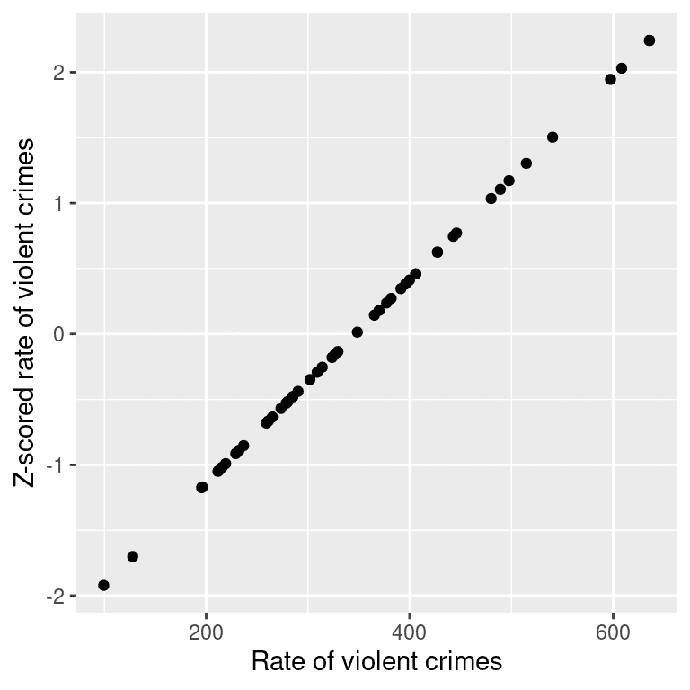
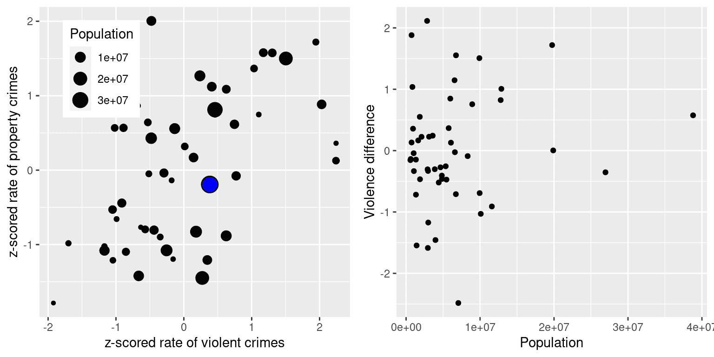

# 第五章：将模型拟合到数据

> 原文：[`statsthinking21.github.io/statsthinking21-core-site/fitting-models.html`](https://statsthinking21.github.io/statsthinking21-core-site/fitting-models.html)
> 
> 译者：[飞龙](https://github.com/wizardforcel)
> 
> 协议：[CC BY-NC-SA 4.0](https://creativecommons.org/licenses/by-nc-sa/4.0/)

统计学中的一个基本活动是创建能够用少量数字总结数据的模型，从而提供数据的简洁描述。在本章中，我们将讨论统计模型的概念以及如何用它来描述数据。

## 5.1 什么是模型？

在物理世界中，“模型”通常是对现实世界中的事物的简化，但仍然传达了被建模事物的本质。建筑物的模型传达了建筑物的结构，同时足够小和轻，可以用一只手拿起；生物学中细胞的模型比实际的细胞大得多，但同样传达了细胞的主要部分及其关系。

在统计学中，模型的目的是提供一个类似的简洁描述，但是针对的是数据而不是物理结构。与物理模型一样，统计模型通常比所描述的数据简单得多；它的目的是尽可能简单地捕捉数据的结构。在这两种情况下，我们意识到模型是一个方便的虚构，必然忽略了被建模的实际细节。正如统计学家 George Box 所说：“所有模型都是错误的，但有些是有用的。”将统计模型视为观察数据生成方式的理论也是有用的；我们的目标是找到最有效和准确地总结数据生成方式的模型。但正如我们将在下面看到的，效率和准确性的要求通常是截然相反的。

统计模型的基本结构是：

$$ 数据 = 模型 + 误差 $$

这表达了这样一个观点：数据可以分为两部分：一部分由统计模型描述，它表达了我们根据我们的知识期望数据采取的值，另一部分我们称之为*误差*，它反映了模型预测和观察数据之间的差异。

实质上，我们希望使用我们的模型来预测任何给定观察的数据值。我们会这样写方程：

$$ \widehat{data_i} = model_i $$ 

数据上的“帽子”表示这是我们的预测，而不是数据的实际值。这意味着观察$i$的数据的预测值等于该观察的模型值。一旦我们从模型得到预测，我们就可以计算误差：

$$ error_i = data_i - \widehat{data_i} $$ 

也就是说，任何观察的误差是数据的观察值与模型预测值之间的差异。

## 5.2 统计建模：一个例子

让我们看一个建立数据模型的例子，使用 NHANES 的数据。特别是，我们将尝试建立 NHANES 样本中儿童身高的模型。首先让我们加载数据并绘制它们（参见图 5.1）。


图 5.1：NHANES 儿童身高的直方图。

请记住，我们希望尽可能简单地描述数据，同时仍然捕捉到它们的重要特征。我们可以想象的最简单的模型将只涉及一个单一的数字；也就是说，该模型将预测每个观察值相同的值，而不管我们可能了解这些观察值的其他信息。我们通常用*参数*来描述模型，这些参数是我们可以改变以修改模型预测的值。在整本书中，我们将使用希腊字母 beta（$\beta$）来指代这些参数；当模型有多个参数时，我们将使用带下标的数字来表示不同的 beta（例如$\beta_1$）。习惯上，我们用字母$y$来表示数据的值，并使用带下标的版本$y_i$来表示个别观察值。

我们通常不知道参数的真实值，因此我们必须从数据中估计它们。因此，我们通常会在$\beta$符号上放一个“帽子”，表示我们使用的是参数值的估计值，而不是它的真实值（通常我们不知道）。因此，我们使用单个参数对身高的简单模型将是：

$$ y_i = \beta + \epsilon $$

方程的右侧没有出现下标$i$，这意味着模型的预测不取决于我们正在观察的是哪个观察值——对所有观察值都是相同的。那么问题就变成了：我们如何估计模型参数的最佳值？在这种情况下，什么单个值是$\beta$的最佳估计？更重要的是，我们如何定义*最佳*？

我们可能想象的一个非常简单的估计量是*模式*，它只是数据集中最常见的值。这将整个 1691 个孩子的数据重新描述为一个单一的数字。如果我们想要预测任何新孩子的身高，那么我们的预测值将是相同的数字：

$$ \hat{y_i} = 166.5 $$

然后，每个个体的误差将是预测值（$\hat{y_i}$）与他们实际身高（$y_i$）之间的差异：

$$ error_i = y_i - \hat{y_i} $$

这个模型有多好呢？通常我们根据误差的大小来定义模型的好坏，误差代表数据偏离模型预测的程度；其他条件相同，产生较小误差的模型更好。（尽管后面我们会看到，其他条件通常不相同...）在这种情况下，我们发现当我们使用模式作为$\beta$的估计量时，平均个体的误差相当大，为-28.8 厘米，这在表面上看起来并不好。

我们如何找到一个更好的模型参数估计量？我们可以尝试找到一个使平均误差为零的估计量。一个很好的选择是算术平均值（即*平均值*，通常用变量上方的横线表示，如$\bar{X}$），计算为所有值的总和除以值的数量。在数学上，我们表示为：

$$ \bar{X} = \frac{\sum_{i=1}^{n}x_i}{n} $$

事实证明，如果我们使用算术平均值作为我们的估计量，那么平均误差确实将为零（如果您感兴趣，可以在本章末尾看到简单的证明）。尽管从平均值的误差是零，但我们可以从图 5.2 的直方图中看到，每个个体仍然有一定程度的误差；有些是正的，有些是负的，它们相互抵消，使平均误差为零。


图 5.2：从平均值的误差分布。

负误差和正误差相互抵消的事实意味着两个不同的模型在绝对值上可能具有非常不同的误差量，但仍然具有相同的平均误差。这正是为什么平均误差不是我们估计器的良好标准的原因；我们希望一个试图最小化总体误差的标准，而不考虑其方向。因此，我们通常根据某种计算正负误差的度量来总结错误。我们可以使用每个误差值的绝对值，但更常见的是使用平方误差，原因我们将在本书的后面看到。

有几种常见的方法来总结平方误差，您将在本书的各个部分遇到，因此了解它们之间的关系很重要。首先，我们可以简单地将它们相加；这被称为*平方误差的总和*。我们通常不使用它的原因是它的大小取决于数据点的数量，因此除非我们观察相同数量的观察结果，否则很难解释。其次，我们可以取平方误差值的平均值，这被称为*均方误差（MSE）*。然而，由于我们在平均值之前对值进行了平方，它们与原始数据不在同一尺度上；它们是在$厘米^2$。因此，通常也会取均方误差的平方根，我们称之为*均方根误差（RMSE）*，以便误差以与原始值相同的单位（在本例中为厘米）来衡量。

均值有相当大的误差-任何个体数据点平均将偏离均值约 27 厘米-但仍然比众数要好得多，众数的均方根误差约为 39 厘米。

### 5.2.1 改进我们的模型

我们能想象一个更好的模型吗？请记住，这些数据来自 NHANES 样本中所有 2 至 17 岁的儿童，他们的年龄变化很大。鉴于这一广泛的年龄范围，我们可能期望我们的身高模型也应包括年龄。让我们绘制身高与年龄的数据，看看这种关系是否真的存在。


图 5.3：NHANES 中儿童的身高，没有模型绘制（A），只包括年龄的线性模型（B）或年龄和常数的线性模型（C），以及适合男女年龄的线性模型（D）。

图 5.3 的面板 A 中的黑点显示了数据集中的个体，身高和年龄之间似乎存在着很强的关系，这是我们所期望的。因此，我们可能会建立一个将身高与年龄相关联的模型：

$$ \hat{y_i} = \hat{\beta} * age_i $$

其中$\hat{\beta}$是我们估计的参数，我们将其乘以年龄以生成模型预测。

您可能还记得代数中定义线的方式：

$$ y = 斜率*x + 截距 $$

如果年龄是 $X$ 变量，那么这意味着我们从年龄对身高的预测将是一条斜率为 $\beta$ 截距为零的直线——为了看到这一点，让我们在数据上用蓝色绘制最佳拟合线（图 5.3 的 B 面板）。显然，这个模型有明显的问题，因为这条线似乎并不很好地跟随数据。事实上，这个模型的均方根误差（39.16）实际上比只包括均值的模型还要高！问题在于我们的模型只包括年龄，这意味着模型对于年龄为零时的身高预测值必须为零。即使数据中没有任何年龄为零的儿童，数学上要求这条线在 x 为零时有一个 y 值为零，这就解释了为什么这条线被拉到了年轻数据点的下方。我们可以通过在模型中包括一个截距来解决这个问题，这基本上代表了当年龄等于零时的估计身高；即使在这个数据集中年龄为零是不合理的，这是一个数学技巧，可以让模型考虑到数据的整体幅度。模型是：

$$ \widehat{y_i} = \hat{\beta_0} + \hat{\beta_1} * age_i $$

其中 $\hat{\beta_0}$ 是我们对 *截距* 的估计，它是添加到每个个体预测值的常数值；我们称之为截距，因为它映射到直线方程中的截距。我们将在后面学习如何为特定数据集估计这些参数值；现在，我们将使用我们的统计软件来估计给出这些特定数据最小误差的参数值。图 5.3 的 C 面板显示了这个模型应用于 NHANES 数据，我们可以看到，这条线比没有常数的那条线更好地匹配了数据。

我们使用这个模型的误差要小得多——平均只有 8.36 厘米。你能想到其他可能与身高有关的变量吗？性别呢？在图 5.3 的 D 面板中，我们分别为男性和女性绘制了拟合线的数据。从图中看，似乎男性和女性之间存在差异，但这种差异相对较小，并且只在青春期后才显现。在图 5.4 中，我们绘制了不同模型的均方根误差值，包括一个额外参数来模拟性别的影响。从中我们可以看到，模型从模式到均值变得更好了一点，从均值到均值+年龄变得更好了很多，而包括性别后只稍微变得更好了一点。


图 5.4：对上面测试的每个模型绘制的均方误差。

## 5.3 什么使一个模型“好”？

我们通常希望从我们的统计模型中得到两种不同的东西。首先，我们希望它能很好地描述我们的数据；也就是说，我们希望在对数据建模时，它的误差尽可能低。其次，我们希望它能很好地推广到新的数据集；也就是说，当我们将其应用于新的数据集以进行预测时，我们希望它的误差尽可能低。事实证明，这两个特性经常会发生冲突。

为了理解这一点，让我们思考误差的来源。首先，如果我们的模型是错误的，误差就会产生；例如，如果我们错误地说身高随着年龄下降而不是上升，那么我们的误差将比正确模型的误差更大。同样，如果我们的模型中缺少一个重要因素，那也会增加我们的误差（就像我们在身高模型中没有考虑年龄时那样）。然而，即使模型是正确的，误差也可能发生，这是由于数据的随机变化造成的，我们通常称之为“测量误差”或“噪音”。有时，这确实是由于我们测量的错误 - 例如，当测量依赖于人类时，比如使用秒表来测量足球比赛中的经过时间。在其他情况下，我们的测量设备非常精确（比如用于测量体重的数字秤），但被测量的物体受到许多不同因素的影响，导致它变化。如果我们知道所有这些因素，那么我们就可以建立一个更准确的模型，但实际上这很少可能。

让我们用一个例子来说明这一点。我们将使用计算机模拟生成一些数据来进行示例，而不是使用真实数据（关于这一点我们将在几章后详细讨论）。假设我们想要了解一个人的血液酒精含量（BAC）与他们在模拟驾驶测试中的反应时间之间的关系。我们可以生成一些模拟数据并绘制关系（参见图 5.5 的 A 面）。


图 5.5：在驾驶测试中血液酒精含量和反应时间之间的模拟关系，最佳拟合线性模型由线表示。A：与低测量误差的线性关系。B：与较高测量误差的线性关系。C：与低测量误差和（不正确的）线性模型的非线性关系

在这个例子中，反应时间随着血液酒精含量的增加而系统性增加 - 线条显示了最佳拟合模型，我们可以看到误差非常小，这在所有点都非常接近线条的事实中是显而易见的。

我们还可以想象出现相同线性关系的数据，但误差更大，就像图 5.5 的 B 面所示。在这里，我们可以看到反应时间随着血液酒精含量的增加仍然存在系统性增加，但在个体之间的变异性更大。

这些都是两个变量之间关系呈现线性的例子，误差反映了我们测量中的噪音。另一方面，还有其他情况下，变量之间的关系不是线性的，误差会增加，因为模型没有正确规定。比如，我们对咖啡因摄入量和测试表现之间的关系感兴趣。咖啡因等兴奋剂与测试表现之间的关系通常是*非线性*的 - 也就是说，它不是一条直线。这是因为测试表现随着较小剂量的咖啡因而提高（人变得更警觉），但随着较大剂量的咖啡因而开始下降（人变得紧张和焦虑）。我们可以模拟这种形式的数据，然后对数据进行线性模型拟合（参见图 5.5 的 C 面板）。蓝线显示了最适合这些数据的直线；显然，误差很大。尽管测试表现和咖啡因摄入之间存在非常合法的关系，但它遵循的是曲线而不是直线。假设线性关系的模型由于这些数据而产生了高误差，因为它对这些数据来说是错误的模型。

## 5.4 模型是否可能太好？

误差听起来像是一件坏事，通常我们会更喜欢具有较低误差的模型，而不是具有较高误差的模型。然而，我们上面提到，模型在准确拟合当前数据集和泛化到新数据集之间存在紧张关系，事实证明，具有最低误差的模型通常在泛化到新数据集时要比较差！

为了看到这一点，让我们再次生成一些数据，以便我们知道变量之间的真实关系。我们将创建两个模拟数据集，它们以完全相同的方式生成 - 只是它们分别添加了不同的随机噪声。也就是说，它们的方程式都是$y = \beta * X + \epsilon$；唯一的区别是在每种情况下，$\epsilon$使用了不同的随机噪声。


图 5.6：过度拟合的一个例子。两个数据集都是使用相同的模型生成的，每个集合都添加了不同的随机噪声。左面板显示了用于拟合模型的数据，蓝色表示简单线性拟合，红色表示复杂（8 阶多项式）拟合。图中显示了每个模型的均方根误差（RMSE）值；在这种情况下，复杂模型的 RMSE 低于简单模型。右面板显示了第二个数据集，上面覆盖了相同的模型，并使用从第一个数据集获得的模型计算了 RMSE 值。在这里，我们看到简单模型实际上比过度拟合到第一个数据集的更复杂模型更好地适应了新数据集。

图 5.6 的左面板显示，更复杂的模型（红色）比更简单的模型（蓝色）更好地拟合了数据。然而，当相同的模型应用于以相同方式生成的新数据集时，我们看到相反的情况-在这里，我们看到更简单的模型比更复杂的模型更好地拟合了新数据。直观地，我们可以看到更复杂的模型受到第一个数据集中特定数据点的影响很大;由于这些数据点的确切位置是由随机噪声驱动的，这导致更复杂的模型在新数据集上拟合不佳。这是我们所说的*过度拟合*现象。现在重要的是要记住，我们的模型拟合需要很好，但不要太好。正如阿尔伯特·爱因斯坦（1933 年）所说：“可以毫不夸张地说，所有理论的最高目标是使不可简化的基本元素尽可能简单，尽可能少，而不必放弃对单个经验数据的充分表征。”这经常被改编为：“一切都应该尽可能简单，但不要太简单。”

## 5.5 使用均值总结数据

我们已经遇到了均值（或平均值），实际上大多数人都知道平均值，即使他们从未上过统计课。它通常用来描述我们所说的数据集的“中心趋势”-也就是说，数据以什么值为中心？大多数人并不认为计算均值是将模型拟合到数据。然而，当我们计算均值时，这正是我们正在做的。

我们已经看到了计算样本数据均值的公式：

$$ \bar{X} = \frac{\sum_{i=1}^{n}x_i}{n} $$

请注意，我说过这个公式是特别针对*样本*数据的，这是从更大的人口中选择的一组数据点。使用样本，我们希望描述更大的人口-我们感兴趣的所有个体的完整集合。例如，如果我们是政治民意调查员，我们感兴趣的人口可能是所有注册选民，而我们的样本可能只包括从该人口中抽样的几千人。在第 7 章中，我们将更详细地讨论抽样，但现在重要的是统计学家通常喜欢使用不同的符号来区分描述样本值的*统计量*和描述人口真实值的*参数*;在这种情况下，人口均值的公式（表示为$\mu$）是：

$$ \mu = \frac{\sum_{i=1}^{N}x_i}{N} $$

其中 N 是整个人口的大小。

我们已经看到均值是一个保证给我们平均误差为零的估计量，但我们也学到了平均误差不是最好的标准；相反，我们希望一个给出最低平方误差和（SSE）的估计量，而均值也能做到。我们可以用微积分来证明这一点，但我们将在图 5.7 中用图形来演示它。


图 5.7：演示均值作为最小化平方误差和的统计量。使用 NHANES 儿童身高数据，我们计算均值（用蓝色条表示）。然后，我们测试一系列可能的参数估计值，对于每个值，我们计算每个数据点与该值之间的平方误差和，用黑色曲线表示。我们看到均值落在平方误差图的最小值处。

最小化 SSE 是一个很好的特性，这就是为什么平均值是最常用的总结数据的统计量。然而，平均值也有一个不好的一面。比如说有五个人在酒吧，我们检查每个人的收入（表 5.1）：

表 5.1：我们五个酒吧顾客的收入

| 收入 | 人 |
| --: | :-- |
| 48000 | 乔 |
| 64000 | 卡伦 |
| 58000 | 马克 |
| 72000 | 安德烈 |
| 66000 | 帕特 |

平均值（61600.00）似乎是对这五个人的收入的一个很好的总结。现在让我们看看如果碧昂丝·诺尔斯走进酒吧会发生什么（表 5.2）。

表 5.2：我们五个酒吧顾客加上碧昂丝·诺尔斯的收入。

| 收入 | 人 |
| :-- | :-- |
| 48000 | 乔 |
| 64000 | 卡伦 |
| 58000 | 马克 |
| 72000 | 安德烈 |
| 66000 | 帕特 |
| 54000000 | 碧昂丝 |

现在平均值接近 1000 万美元，这实际上并不代表酒吧里的任何人 - 特别是，它受到碧昂丝这个异常值的极大影响。一般来说，平均值对极端值非常敏感，这就是为什么在使用平均值总结数据时，确保没有极端值总是很重要的原因。

### 5.5.1 使用中位数稳健地总结数据

如果我们想以一种对异常值不太敏感的方式总结数据，我们可以使用另一个叫做*中位数*的统计量。如果我们按照大小顺序对所有值进行排序，那么中位数就是中间的值。如果值的数量是偶数，那么会有两个值并列在中间位置，这种情况下我们取这两个数的平均值（即两个数的中间点）。

让我们看一个例子。假设我们想总结以下值： 

```r
8  6  3 14 12  7  6  4  9
```

如果我们对这些值进行排序：

```r
3  4  6  6  7  8  9 12 14
```

然后中位数是中间值 - 在这种情况下，是 9 个值中的第 5 个。

而平均值最小化了平方误差的和，中位数最小化了一个略有不同的数量：误差的绝对值的和。这解释了为什么中位数对异常值不太敏感 - 平方会加剧大误差的影响，而绝对值不会。我们可以从收入的例子中看到这一点：中位收入（$65,000）更能代表整个群体，而不太敏感于一个大的异常值，而平均值（$9,051,333）。

鉴于此，我们为什么还要使用平均值呢？正如我们将在后面的章节中看到的，平均值是“最好的”估计量，因为它在样本之间的变化要比其他估计量小。这取决于我们是否认为这值得对潜在异常值的敏感性 - 统计学就是关于权衡的。

## 5.6 众数

有时我们希望描述一个非数值数据集的中心趋势。例如，假设我们想知道哪种型号的 iPhone 最常用。为了测试这一点，我们可以问一大群 iPhone 用户每个人拥有哪种型号。如果我们对这些值取平均值，我们可能会发现平均 iPhone 型号是 9.51，这显然是荒谬的，因为 iPhone 型号并不是量化的测量。在这种情况下，中心趋势的更合适的度量是众数，即数据集中最常见的值，正如我们上面讨论的那样。

## 5.7 变异性：平均值对数据拟合得有多好？

一旦我们描述了数据的中心趋势，我们通常也想描述数据的变异程度 - 这有时也被称为“离散度”，反映了它描述数据有多广泛分布的事实。

我们已经在上面遇到了平方误差的总和，这是最常用的变异性度量的基础：*方差*和*标准差*。人口的方差（表示为$\sigma^2$）简单地是平方误差的总和除以观察次数 - 也就是说，它与之前遇到的*均方误差*完全相同：

$$ \sigma^2 = \frac{SSE}{N} = \frac{\sum_{i=1}^n (x_i - \mu)^2}{N} $$

其中$\mu$是总体均值。总体标准差简单地是这个的平方根 - 也就是我们之前看到的*均方根误差*。标准差很有用，因为误差与原始数据的单位相同（撤销了我们对误差的平方）。 

通常我们无法访问整个总体，所以我们必须使用样本来计算方差，我们称之为$\hat{\sigma}^2$，其中“帽子”表示这是基于样本的估计。$\hat{\sigma}^2$的方程与$\sigma^2$的方程类似：

$$ \hat{\sigma}^2 = \frac{\sum_{i=1}^n (x_i - \bar{X})^2}{n-1} $$

两个方程之间唯一的区别是我们除以 n-1 而不是 N。这涉及到一个基本的统计概念：*自由度*。记住，为了计算样本方差，我们首先必须估计样本均值$\bar{X}$。在估计了这个值之后，数据中的一个值就不再自由变化。例如，假设我们有一个变量$x$的以下数据点：[3, 5, 7, 9, 11]，其均值为 7。因为我们知道这个数据集的均值是 7，我们可以计算如果缺少任何特定值的值。例如，假设我们要隐藏第一个值（3）。这样做之后，我们仍然知道它的值必须是 3，因为 7 的均值意味着所有值的总和是$7 * n = 35$，$35 - (5 + 7 + 9 + 11) = 3$。

所以当我们说我们“失去”了一个自由度时，这意味着在拟合模型后有一个值不再自由变化。在样本方差的背景下，如果我们不考虑失去的自由度，那么我们对样本方差的估计将是*有偏的*，导致我们低估了对均值估计的不确定性。

## 5.8 使用模拟来理解统计学

我坚信使用计算机模拟来理解统计概念，在后面的章节中我们将更深入地探讨它们的使用。在这里，我们将通过询问是否可以确认在计算样本方差时需要从样本大小中减去 1 来介绍这个想法。

让我们把 NHANES 数据中的所有儿童样本作为我们的“总体”，并看看使用分母中的$n$或$n-1$来计算样本方差会如何估计这个总体的方差，在从数据中模拟的大量随机样本中。我们将在后面的章节中详细介绍如何做到这一点。

表 5.3：使用 n 与 n-1 的方差估计；使用 n-1 的估计更接近于总体值

| 估计 | 值 |
| :-- | --: |
| 总体方差 | 725 |
| 使用 n 的方差估计 | 710 |
| 使用 n-1 的方差估计 | 725 |

5.3 中的结果告诉我们，上面概述的理论是正确的：使用$n-1$作为分母的方差估计非常接近于在完整数据（即总体）上计算的方差，而使用$n$作为分母的方差估计是有偏的（较小），与真实值相比。

## 5.9 Z 分数

在以中心趋势和变异性来表征分布之后，通常有必要以个体得分在整体分布中的位置来表达。假设我们有兴趣描述不同州之间犯罪的相对水平，以确定加利福尼亚是否是一个特别危险的地方。我们可以使用来自[FBI 统一犯罪报告网站](https://www.ucrdatatool.gov/Search/Crime/State/RunCrimeOneYearofData.cfm)的 2014 年数据来提出这个问题。图 5.8 的左侧面板显示了每个州暴力犯罪数量的直方图，突出显示了加利福尼亚的值。从这些数据来看，加利福尼亚似乎非常危险，当年有 153709 起犯罪。我们可以通过生成一张地图来可视化这些数据，显示一个变量在各州之间的分布，这在图 5.8 的右侧面板中呈现。



图 5.8：左侧：暴力犯罪数量的直方图。 CA 的值以蓝色绘制。右侧：相同数据的地图，以各州的犯罪数量（以千为单位）用颜色表示。

然而，您可能已经意识到，加利福尼亚也是美国人口最多的州，因此它拥有更多的犯罪是合理的。如果我们将每个州的犯罪数量与人口之一绘制成图（参见图 5.9 的左侧面板），我们会发现两个变量之间存在直接关系。


图 5.9：左侧：按州划分的暴力犯罪数量与人口的图。右侧：以每 10 万人口的犯罪率表示的暴力犯罪率的直方图。

我们应该使用每人口的暴力犯罪*率*，而不是使用原始犯罪数字，这可以通过将每个州的犯罪数量除以每个州的人口来获得。FBI 的数据集已经包括了这个值（以每 10 万人口的比率表示）。从图 5.9 的右侧面板可以看出，加利福尼亚并不那么危险 - 其每 10 万人口的犯罪率为 396.10，略高于各州的平均值 346.81，但远低于许多其他州。但是，如果我们想更清楚地了解它与其他分布的距离有多远呢？

*Z 得分*允许我们以一种更能洞察每个数据点与整体分布关系的方式来表达数据。计算给定个体数据点的 Z 得分的公式，假设我们知道总体均值$\mu$和标准偏差$\sigma$的值为：

$$ Z(x) = \frac{x - \mu}{\sigma} $$

直观地，您可以将 Z 得分视为告诉您任何数据点距离平均值有多远，以标准偏差为单位。我们可以计算犯罪率数据的 Z 得分，如图 5.10 所示，该图将 Z 得分绘制为原始得分。



图 5.10：原始犯罪率数据与 Z 得分数据的散点图。

散点图告诉我们，Z 分数的过程并不改变数据点的相对分布（在原始数据和 Z 分数数据相互绘制时，它们落在一条直线上），它只是将它们移动到具有零均值和标准偏差为一的位置。图 5.11 显示了使用地理视图的 Z 分数犯罪数据。


图 5.11：犯罪数据呈现为 Z 分数的美国地图。

这为我们提供了对数据稍微更易解释的视角。例如，我们可以看到内华达州、田纳西州和新墨西哥州的犯罪率大约是平均值的两个标准偏差。

### 5.9.1 解释 Z 分数

“Z 分数”中的“Z”来自于标准正态分布（即均值为零，标准偏差为 1 的正态分布）通常被称为“Z”分布。我们可以使用标准正态分布来帮助我们理解特定 Z 分数告诉我们关于数据点在分布的其余部分中所处位置的信息。


图 5.12：标准正态分布的密度（上）和累积分布（下），在一个标准偏差以上/以下的均值处有截断。

图 5.12 的上部显示我们预计大约 16%的值落在$Z\ge 1$，同样的比例落在$Z\le -1$。


图 5.13：标准正态分布的密度（上）和累积分布（下），在两个标准偏差以上/以下的均值处有截断。

图 5.13 显示了两个标准偏差的相同图。在这里，我们看到只有大约 2.3%的值落在$Z \le -2$，同样的在$Z \ge 2$。因此，如果我们知道特定数据点的 Z 分数，我们可以估计找到至少与该值一样极端的值的可能性或不可能性，这让我们更好地将值放入上下文中。在犯罪率的情况下，我们看到加利福尼亚的暴力犯罪率人均 Z 分数为 0.38，显示它与其他州的平均值相当接近，大约有 35%的州有更高的犯罪率，65%的州有更低的犯罪率。

### 5.9.2 标准化分数

假设我们不是用 Z 分数，而是想生成平均值为 100，标准偏差为 10 的标准化犯罪分数。这类似于对智力测试分数进行标准化以生成智商指数（IQ）。我们可以通过简单地将 Z 分数乘以 10 然后加上 100 来实现这一点。


图 5.14：犯罪数据以平均值为 100，标准偏差为 10 呈现为标准化分数。

#### 5.9.2.1 使用 Z 分数比较分布

Z 得分的一个有用应用是比较不同变量的分布。假设我们想要比较各州的暴力犯罪和财产犯罪的分布。在图 5.15 的左面板中，我们将它们相互绘制，CA 用蓝色绘制。正如你所看到的，财产犯罪的原始率远高于暴力犯罪的原始率，所以我们不能直接比较这些数字。然而，我们可以将这些数据的 Z 得分相互绘制（图 5.15 的右面板）- 在这里我们再次看到数据的分布没有改变。将每个变量的数据转换为 Z 得分使它们可以相互比较，并让我们看到加利福尼亚实际上在暴力犯罪和财产犯罪方面都处于分布的中间位置。


图 5.15：暴力犯罪率与财产犯罪率的图表（左）和 Z 得分率（右）。

让我们在图中再添加一个因素：人口。在图 5.16 的左面板中，我们使用绘图符号的大小来显示这一点，这通常是向图中添加信息的有用方式。



图 5.16：左：暴力犯罪率与财产犯罪率的图表，通过绘图符号的大小呈现人口规模；加利福尼亚以蓝色呈现。右：暴力犯罪与财产犯罪的差异分数，绘制在人口上。

因为 Z 得分是直接可比较的，我们还可以计算一个*差异分数*，它表达了各州暴力与非暴力（财产）犯罪的相对率。然后我们可以将这些分数绘制在人口上（参见图 5.16 的右面板）。这显示了我们如何使用 Z 得分将不同的变量放在一个共同的尺度上。

值得注意的是，最小的州似乎在两个方向上都有最大的差异。虽然可能会诱人地查看每个州并尝试确定为什么它具有高或低的差异分数，但这可能反映了从较小样本中获得的估计值必然会更加变化，正如我们将在第 7 章中讨论的那样。

## 5.10 学习目标

+   描述统计模型的基本方程（数据=模型+误差）

+   描述不同的集中趋势和离散度测量，它们是如何计算的，以及在什么情况下适用。

+   计算 Z 得分并描述它们为什么有用。

## 5.11 附录

### 5.11.1 证明均值误差的总和为零

$$ 错误 = \sum_{i=1}^{n}(x_i - \bar{X}) = 0 $$

$$ \sum_{i=1}^{n}x_i - \sum_{i=1}^{n}\bar{X}=0 $$

$$ \sum_{i=1}^{n}x_i = \sum_{i=1}^{n}\bar{X} $$

$$ \sum_{i=1}^{n}x_i = n\bar{X} $$

$$ \sum_{i=1}^{n}x_i = \sum_{i=1}^{n}x_i $$
