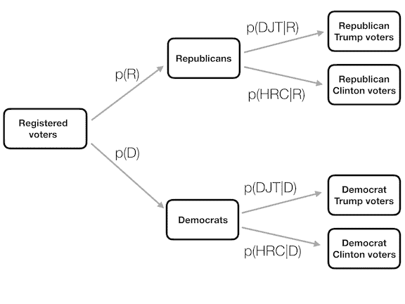

# 第六章：概率

> 原文：[`statsthinking21.github.io/statsthinking21-core-site/probability.html`](https://statsthinking21.github.io/statsthinking21-core-site/probability.html)
> 
> 译者：[飞龙](https://github.com/wizardforcel)
> 
> 协议：[CC BY-NC-SA 4.0](https://creativecommons.org/licenses/by-nc-sa/4.0/)

概率论是处理机会和不确定性的数学分支。它构成了统计学基础的重要部分，因为它为我们提供了描述不确定事件的数学工具。概率的研究部分是由于对理解卡牌或骰子等游戏的兴趣。这些游戏提供了许多统计概念的有用例子，因为当我们重复这些游戏时，不同结果发生的可能性保持（大部分）不变。然而，关于概率含义的深刻问题我们在这里不会讨论；如果您对了解更多有关这个迷人主题及其历史感兴趣，请参阅结尾的建议阅读。

## 6.1 什么是概率？

非正式地，我们通常将概率视为描述某个事件发生可能性的数字，范围从零（不可能）到一（确定）。有时概率将以百分比的形式表示，范围从零到一百，就像天气预报预测今天下雨的概率为百分之二十一样。在每种情况下，这些数字都表达了该特定事件有多大可能发生，从绝对不可能到绝对确定。

为了形式化概率论，我们首先需要定义一些术语：

+   **实验**是产生或观察结果的任何活动。例如，抛硬币、掷一个六面骰子，或者尝试一条新的上班路线看看它是否比旧路线更快。

+   **样本空间**是实验的可能结果的集合。我们通过在一组花括号中列出它们来表示这些结果。对于抛硬币，样本空间是{正面，反面}。对于一个六面骰子，样本空间是可能出现的每个数字：{1,2,3,4,5,6}。对于到达工作地点所需的时间，样本空间是所有可能的实数大于零（因为到达某个地方不可能花费负数的时间，至少目前还不可能）。我们不会尝试在括号内写出所有这些数字。

+   **事件**是样本空间的子集。原则上，它可以是样本空间中可能结果的一个或多个，但在这里，我们将主要关注*基本事件*，它们由恰好一个可能结果组成。例如，这可能是在一次抛硬币中获得正面，掷骰子时掷出 4，或者通过新路线回家花费 21 分钟。

现在我们已经有了这些定义，我们可以概述概率的正式特征，这些特征是由俄罗斯数学家安德烈·科尔莫戈洛夫首次定义的。这些是值必须具备的特征，如果它要成为概率的话。假设我们有一个由 N 个独立事件${E_1, E_2, ... , E_N}$定义的样本空间，$X$是一个随机变量，表示发生了哪个事件。$P(X=E_i)$是事件$i$的概率：

+   概率不能为负数：$P(X=E_i) \ge 0$

+   样本空间中所有结果的总概率为 1；也就是说，如果我们取每个 Ei 的概率并将它们相加，它们必须加起来等于 1。我们可以使用求和符号$\sum$来表示这一点：

    $$ \sum_{i=1}^N{P(X=E_i)} = P(X=E_1) + P(X=E_2) + ... + P(X=E_N) = 1 $$ 
    
    这被解释为“取所有 N 个基本事件，我们已经从 1 到 N 进行了标记，并将它们的概率相加。它们必须加起来等于一。”

+   任何单个事件的概率都不能大于一：$P(X=E_i)\le 1$。这是由前面的观点所暗示的；因为它们必须加起来等于一，而且它们不能是负数，所以任何特定的概率都不能超过一。

## 6.2 我们如何确定概率？

既然我们知道了概率是什么，我们如何实际确定任何特定事件的概率呢？

### 6.2.1 个人信念

假设我问你如果伯尼·桑德斯在 2016 年总统选举中成为民主党提名人而不是希拉里·克林顿，他会赢得选举的概率是多少？我们实际上无法进行实验来找到结果。然而，大多数了解美国政治的人都愿意至少猜测这一事件的概率。在许多情况下，个人知识和/或意见是我们确定事件概率的唯一指南，但这并不是非常科学上令人满意的。

### 6.2.2 经验频率

确定事件概率的另一种方法是多次进行实验，并计算每个事件发生的频率。从不同结果的相对频率，我们可以计算出每个结果的概率。例如，假设我们想知道旧金山下雨的概率。我们首先必须定义实验 - 假设我们将查看 2017 年每一天的国家气象局数据，并确定在旧金山市中心气象站是否有下雨。根据这些数据，2017 年有 73 天下雨。为了计算旧金山下雨的概率，我们只需将下雨的天数除以计数的天数（365），得出 P（2017 年旧金山下雨）= 0.2。

我们如何知道经验概率给出了正确的数字？这个问题的答案来自于*大数定律*，它表明随着样本量的增加，经验概率将接近真实概率。我们可以通过模拟大量的硬币抛掷来看到这一点，并在每次抛掷后查看我们对正面概率的估计。我们将在后面的章节中更多地讨论模拟；现在，只需假设我们有一种计算方法来生成每次硬币抛掷的随机结果。

图 6.1 的左侧面板显示，随着样本数量（即，硬币抛掷试验）的增加，正面的估计概率会收敛到 0.5 的真实值。然而，请注意，当样本量较小时，估计值可能与真实值相差甚远。这在 2017 年阿拉巴马州美国参议院特别选举中得到了真实世界的例证，该选举将共和党人罗伊·摩尔对阵民主党人道格·琼斯。图 6.1 的右侧面板显示了在晚上的过程中每个候选人报告的相对选票数量，随着越来越多的选票被计算出来。晚上早些时候，选票数量特别不稳定，从琼斯的大幅领先到摩尔长时间领先，最终琼斯取得领先并赢得了比赛。

左侧：大数定律的演示。硬币被抛掷了 30,000 次，每次抛掷后，根据迄今为止收集到的正反面数量计算出正面的概率。大约需要 15,000 次抛掷，概率才会稳定在真实概率 0.5。右侧：2017 年 12 月 12 日阿拉巴马州参议院特别选举中的选票相对比例，作为报告选区百分比的函数。这些数据是从 https://www.ajc.com/news/national/alabama-senate-race-live-updates-roy-moore-doug-jones/KPRfkdaweoiXICW3FHjXqI/转录的。

图 6.1：左侧：大数定律的演示。硬币被抛掷了 30,000 次，每次抛掷后根据迄今为止收集到的正反面数量计算出正面的概率。大约需要 15,000 次抛掷才能使概率稳定在真实概率 0.5。右侧：2017 年 12 月 12 日阿拉巴马州参议院特别选举中的选票相对比例，作为报告选区百分比的函数。这些数据是从[`www.ajc.com/news/national/alabama-senate-race-live-updates-roy-moore-doug-jones/KPRfkdaweoiXICW3FHjXqI/`](https://www.ajc.com/news/national/alabama-senate-race-live-updates-roy-moore-doug-jones/KPRfkdaweoiXICW3FHjXqI/)转录的。

这两个例子表明，虽然大样本最终会收敛于真实概率，但小样本的结果可能相差甚远。不幸的是，许多人忘记了这一点，并过分解释了小样本的结果。这被心理学家丹尼·卡尼曼和阿莫斯·特沃斯基称为“小数定律”，他们表明人们（甚至是受过训练的研究人员）经常表现得好像大数定律甚至适用于小样本，对基于小数据集的结果给予了过多的信任。在课程中，我们将看到许多例子，说明当统计结果是基于小样本生成时，它们是多么不稳定。

### 6.2.3 古典概率

我们很少有人会抛掷硬币数万次，但我们仍然愿意相信抛掷正面的概率是 0.5。这反映了我们使用另一种计算概率的方法，我们称之为“古典概率”。在这种方法中，我们根据对情况的了解直接计算概率。

古典概率起源于对骰子和纸牌等游戏的研究。一个著名的例子来自于法国赌徒谢瓦利埃·德梅雷遇到的问题。德梅雷玩了两种不同的骰子游戏：在第一种游戏中，他押注至少有一个六在投掷六面骰子的四次中出现的机会，而在第二种游戏中，他押注至少有一个双六在投掷两个骰子的 24 次中出现的机会。他期望在这两个赌博中赚钱，但他发现，虽然平均上他在第一个赌博中赚了钱，但当他多次玩第二个赌博时，他实际上平均上是赔钱的。为了理解这一点，他求助于他的朋友、数学家布莱兹·帕斯卡，现在他被认为是概率论的创始人之一。

我们如何使用概率论来理解这个问题呢？在古典概率中，我们假设样本空间中的所有基本事件是等可能发生的；也就是说，当你掷骰子时，每种可能的结果（{1,2,3,4,5,6}）都是等可能发生的。（不允许使用偏骰子！）在这种情况下，我们可以计算任何单个结果的概率为 1 除以可能结果的数量：

$$ P(outcome_i) = \frac{1}{\text{number of possible outcomes}} $$

对于六面骰子，每个单个结果的概率是 1/6。

这很好，但德梅雷对更复杂的事件感兴趣，比如多次掷骰子会发生什么。我们如何计算复杂事件的概率（这是单个事件的“并集”），比如在第一次或第二次掷骰子时掷出一个六？我们用$\cup$符号在数学上表示事件的并集：例如，如果第一次掷骰子掷出六的概率被称为$P(Roll6_{throw1})$，第二次掷骰子掷出六的概率被称为$P(Roll6_{throw2})$，那么并集被称为$P(Roll6_{throw1} \cup Roll6_{throw2})$。

de Méré认为（我们将在下面看到是错误的），他可以简单地将两个事件的概率相加来计算组合事件的概率，这意味着首次或第二次掷出六的概率将如下计算：

$$ P(Roll6_{throw1}) = 1/6 $$ 

$$ P(Roll6_{throw2}) = 1/6 $$

de Méré的错误:

$$ P(Roll6_{throw1} \cup Roll6_{throw2}) = P(Roll6_{throw1}) + P(Roll6_{throw2}) = 1/6 + 1/6 = 1/3 $$

de Méré基于这个错误的假设推理，即四次掷骰子至少有一个六的概率是每次单独掷骰子的概率之和：$4*\frac{1}{6}=\frac{2}{3}$。同样，他推断出，由于掷两个骰子时出现双六的概率是 1/36，那么掷两个骰子 24 次至少出现一次双六的概率将是$24*\frac{1}{36}=\frac{2}{3}$。然而，尽管他在第一次赌注上一直赢钱，但在第二次赌注上却输钱了。是什么原因呢？

要理解 de Méré的错误，我们需要介绍一些概率论的规则。第一个是*减法规则*，它说事件 A *不*发生的概率是 1 减去事件发生的概率：

$$ P(\neg A) = 1 - P(A) $$

其中$\neg A$表示“非 A”。这个规则直接源自我们上面讨论的公理；因为 A 和$\neg A$是唯一可能的结果，所以它们的总概率必须加起来为 1。例如，如果单次掷骰子掷出 1 的概率是$\frac{1}{6}$，那么掷出非 1 的概率就是$\frac{5}{6}$。

第二条规则告诉我们如何计算联合事件的概率 - 也就是两个事件都发生的概率。我们称之为*交集*，用$\cap$符号表示；因此，$P(A \cap B)$表示 A 和 B 都发生的概率。我们将专注于一种规则的版本，该规则告诉我们如何在两个事件彼此独立的特殊情况下计算这个数量；我们稍后将学习*独立性*概念的确切含义，但现在我们可以认为两次掷骰子是独立事件。我们通过简单地将两个事件的概率相乘来计算两个独立事件的交集的概率：

$$ P(A \cap B) = P(A) * P(B)\ \text{当且仅当 A 和 B 是独立的时候} $$

因此，两次掷出六的概率是$\frac{1}{6}*\frac{1}{6}=\frac{1}{36}$。

第三条规则告诉我们如何将概率相加 - 就是在这里我们看到了 de Méré的错误来源。加法规则告诉我们，要获得两个事件中任一事件发生的概率，我们将单独的概率相加，然后减去两者同时发生的可能性：

$$ P(A \cup B) = P(A) + P(B) - P(A \cap B) $$

从某种意义上说，这阻止我们将这些实例计算两次，这就是这条规则与 de Méré的错误计算有何不同。假设我们想要找到两次掷骰子中至少掷出 6 的概率。根据我们的规则：

$$ P(Roll6_{throw1} \cup Roll6_{throw2}) = P(Roll6_{throw1}) + P(Roll6_{throw2}) - P(Roll6_{throw1} \cap Roll6_{throw2}) $$

$$ = \frac{1}{6} + \frac{1}{6} - \frac{1}{36} = \frac{11}{36} $$

图 6.2：此矩阵中的每个单元格代表掷骰子两次的一个结果，列代表第一次掷骰子，行代表第二次掷骰子。红色表示第一次或第二次掷出六的单元格；其余显示为蓝色。

让我们使用图形描述来对这个规则有一个不同的视角。图 6.2 显示了表示两次投掷中所有可能结果组合的矩阵，并突出显示了涉及第一次或第二次投掷中的六的单元格。如果你数一数红色的单元格，你会发现有 11 个这样的单元格。这说明了为什么加法规则给出了与 de Méré不同的答案；如果我们像他一样简单地将两次投掷的概率相加，那么我们会将(6,6)计算两次，而实际上它只应该计算一次。

### 6.2.4 解决 de Méré的问题

Blaise Pascal 利用概率规则解决了 de Méré的问题。首先，他意识到计算至少一个事件的概率组合是棘手的，而计算某事在多个事件中不发生的概率相对容易——它只是各个事件概率的乘积。因此，他不是计算四次投掷中至少出现一个六的概率，而是计算所有投掷中没有六的概率：

$$ P(\text{四次投掷中没有六}) = \frac{5}{6}*\frac{5}{6}*\frac{5}{6}*\frac{5}{6}=\bigg(\frac{5}{6}\bigg)^4=0.482 $$

然后他利用四次投掷中没有六的概率是至少有一个六的概率的补集（因此它们必须相加为一），并使用减法规则计算感兴趣的概率：

$$ P(\text{四次投掷中至少有一个六}) = 1 - \bigg(\frac{5}{6}\bigg)^4=0.517 $$

de Méré打赌他在四次投掷中至少会掷出一个六的概率大于 0.5，这解释了为什么 de Méré平均赚钱。

但是 de Méré的第二次赌注呢？Pascal 使用了同样的技巧：

$$ P(\text{24 次投掷中没有双六}) = \bigg(\frac{35}{36}\bigg)^{24}=0.509 $$ 

$$ P(\text{24 次投掷中至少有一个双六}) = 1 - \bigg(\frac{35}{36}\bigg)^{24}=0.491 $$

这种结果的概率略低于 0.5，说明了为什么 de Méré在这个赌注上平均亏钱。

## 6.3 概率分布

*概率分布*描述了实验中所有可能结果的概率。例如，2018 年 1 月 20 日，篮球运动员斯蒂芬·库里在对休斯顿火箭队的比赛中只投中了 4 次罚球中的 2 次。我们知道库里整个赛季罚球的概率是 0.91，所以他在一场比赛中只投中 50%的罚球似乎是不太可能的，但确切有多少可能性呢？我们可以使用理论概率分布来确定这一点；在本书中，我们将遇到许多这些概率分布，每个都适合描述不同类型的数据。在这种情况下，我们使用*二项式*分布，它提供了一种计算在每次试验中成功或失败的情况下，某些成功次数的概率的方法，给定每次试验上的已知成功概率（称为“伯努利试验”）。这个分布被定义为：

$$ P(k; n,p) = P(X=k) = \binom{n}{k} p^k(1-p)^{n-k} $$

这指的是在概率为 p 的情况下，在 n 次试验中出现 k 次成功的概率。你可能不熟悉$\binom{n}{k}$，它被称为*二项式系数*。二项式系数也被称为“n 选 k”，因为它描述了从 n 个总项中选择 k 个项的不同方式的数量。二项式系数计算如下：

$$ \binom{n}{k} = \frac{n!}{k!(n-k)!} $$

其中感叹号（!）表示数字的*阶乘*：

$$ n! = \prod_{i=1}^n i = n*(n-1)*...*2*1 $$

乘积运算符$\prod$类似于求和运算符$\sum$，只是它是相乘而不是相加。在这种情况下，它将从一到$n$的所有数字相乘在一起。

在斯蒂芬·库里罚球的例子中：

$$ P(2;4,0.91) = \binom{4}{2} 0.91^2(1-0.91)^{4-2} = 0.040 $$

这表明，鉴于库里的整体罚球命中率，他在 4 次罚球中只命中 2 次的概率是非常低的。这只是表明在现实世界中不太可能的事情实际上确实会发生。

### 6.3.1 累积概率分布

通常我们不仅想知道特定值有多大可能性，还想知道找到一个与特定值一样极端或更极端的值有多大可能性；当我们在第 9 章讨论假设检验时，这将变得非常重要。为了回答这个问题，我们可以使用*累积*概率分布；标准概率分布告诉我们某个特定值的概率，而累积分布告诉我们一个与某个特定值一样大或更大（或者一样小或更小）的值的概率。

在罚球的例子中，我们可能想知道：鉴于库里的整体罚球概率为 0.91，斯蒂芬·库里在四次尝试中命中 2 次或更少罚球的概率是多少。为了确定这一点，我们可以简单地使用二项概率方程，并将所有可能的 k 值代入并相加。

$$ P(k\le2)= P(k=2) + P(k=1) + P(k=0) = 6e^{-5} + .002 + .040 = .043 $$

在许多情况下，可能结果的数量对我们来说太大，无法通过枚举所有可能的值来计算累积概率；幸运的是，它可以直接计算任何理论概率分布。表 6.1 显示了上面示例中每个成功罚球次数的累积概率，从中我们可以看到库里在 4 次尝试中命中 2 次或更少罚球的概率为 0.043。

表 6.1：斯蒂芬·库里在 4 次尝试中成功罚球次数的简单和累积概率分布。

| 成功数量 | 概率 | 累积概率 |
| --: | --: | --: |
| 0 | 0.000 | 0.000 |
| 1 | 0.003 | 0.003 |
| 2 | 0.040 | 0.043 |
| 3 | 0.271 | 0.314 |
| 4 | 0.686 | 1.000 |

## 6.4 条件概率

到目前为止，我们只限制在简单概率上 - 也就是单个事件或事件组合的概率。然而，我们经常希望确定某个事件发生的概率，假设发生了另一个事件，这被称为*条件概率*。

让我们以 2016 年美国总统选举为例。有两个简单的概率可以用来描述选民。首先，我们知道美国选民与共和党有关的概率：$p(共和党) = 0.44$。我们还知道投票支持唐纳德·特朗普的选民的概率：$p(特朗普选民)=0.46$。然而，假设我们想知道以下内容：一个人投票支持唐纳德·特朗普的概率是多少，*假设他们是共和党人*？

要计算给定 B 的条件概率 A（我们将其写为$P(A|B)$，“给定 B 的 A 的概率”），我们需要知道*联合概率*（即 A 和 B 同时发生的概率）以及 B 的整体概率：

$$ P(A|B) = \frac{P(A \cap B)}{P(B)} $$

也就是说，我们想知道在被条件限制的情况下，两件事情都是真的概率。

图 6.3：条件概率的图形描述，显示了条件概率如何将我们的分析限制在数据的子集中。

以图形方式思考这点可能会有所帮助。图 6.3 显示了一个流程图，描述了选民的整体人口是如何分为共和党人和民主党人的，并且条件概率（以政党为条件）如何进一步根据他们的投票将每个政党的成员细分。

## 6.5 从数据计算条件概率

我们还可以直接从数据中计算条件概率。假设我们对以下问题感兴趣：一个人患有糖尿病的概率是多少，假设他们不活跃？即，$P(糖尿病|不活跃)$。NHANES 数据集包括两个变量，涉及这个问题的两个部分。第一个（`糖尿病`）询问这个人是否被告知他们患有糖尿病，第二个（`身体活动`）记录这个人是否参加至少中等强度的体育、健身或娱乐活动。让我们首先计算简单概率，如表 6.2 所示。表格显示 NHANES 数据集中有糖尿病的人的概率为 0.1，不活跃的人的概率为 0.45。

表 6.2：糖尿病和体力活动的摘要数据

| 答案 | 无糖尿病 | 糖尿病概率 | 无身体活动 | 身体活动概率 |
| :-- | --: | --: | --: | --: |
| 否 | 4893 | 0.9 | 2472 | 0.45 |
| 是 | 550 | 0.1 | 2971 | 0.55 |

表 6.3：糖尿病和身体活动变量的联合概率。

| 糖尿病 | 身体活动 | n | 概率 |
| :-- | :-- | --: | --: |
| 否 | 否 | 2123 | 0.39 |
| 否 | 是 | 2770 | 0.51 |
| 是 | 否 | 349 | 0.06 |
| 是 | 是 | 201 | 0.04 |

要计算 $P(糖尿病|不活跃)$ ，我们还需要知道患糖尿病和不活跃的联合概率，除了每个简单概率。这些显示在表 6.3 中。根据这些联合概率，我们可以计算 $P(糖尿病|不活跃)$。在计算机程序中，一种方法是首先确定每个个体的 PhysActive 变量是否等于“否”，然后取这些真值的平均值。由于大多数编程语言（包括 R 和 Python）将 TRUE/FALSE 值分别视为 1/0，这使我们可以通过简单地取表示其真值的逻辑变量的平均值来轻松识别简单事件的概率。然后我们使用该值来计算条件概率，从中我们发现，患糖尿病的人在身体不活跃的情况下的概率为 0.141。

## 6.6 独立性

“独立”这个术语在统计学中有一个非常具体的含义，与常规用法略有不同。两个变量之间的统计独立意味着知道一个变量的值不会告诉我们关于另一个变量的值的任何信息。这可以表示为：

$$ P(A|B) = P(A) $$

也就是说，给定 B 的某个值时 A 的概率与 A 的整体概率是一样的。从这个角度来看，我们发现在现实世界中许多我们称之为“独立”的情况实际上并不是统计上独立的。例如，加利福尼亚州的一小部分公民目前正在推动宣布一个名为杰斐逊的新独立州，该州将包括加利福尼亚州北部和俄勒冈州的一些县。如果这种情况发生，那么当前加利福尼亚居民现在居住在杰斐逊州的概率将是 $P(\text{杰斐逊人})=0.014$，而他们仍然是加利福尼亚居民的概率将是 $P(\text{加利福尼亚人})=0.986$。新的州可能在政治上是独立的，但它们*不*在统计上是独立的，因为如果我们知道一个人是杰斐逊人，那么我们可以肯定他们*不*是加利福尼亚人！也就是说，尽管在日常语言中，“独立”通常指的是互斥的集合，但统计独立是指一个变量的值无法从另一个变量的值预测出来的情况。例如，知道一个人的头发颜色不太可能告诉你他们更喜欢巧克力还是草莓冰淇淋。

让我们看另一个例子，使用 NHANES 数据：身体健康和心理健康是否彼此独立？NHANES 包括两个相关问题：*PhysActive*，询问个体是否进行身体活动，以及*DaysMentHlthBad*，询问个体在过去 30 天中有多少天经历了糟糕的心理健康。让我们考虑在过去一个月中有超过 7 天糟糕心理健康的人。基于此，我们可以定义一个名为*badMentalHealth*的新变量，作为一个逻辑变量，告诉每个人是否有超过 7 天的糟糕心理健康。我们可以首先总结数据，显示有多少个体落入两个变量的每种组合（在表 6.4 中显示），然后除以总观察数，创建一个比例表（在表 6.5 中显示）：

表 6.4：心理健康和身体活动的绝对频率数据总结。

| 身体活动 | 心理不健康 | 心理健康 | 总数 |
| :-- | --: | --: | --: |
| No | 414 | 1664 | 2078 |
| Yes | 292 | 1926 | 2218 |
| Total | 706 | 3590 | 4296 |

表 6.5：心理健康和身体活动的相对频率数据总结。

| 身体活动 | 心理不健康 | 心理健康 | 总数 |
| :-- | --: | --: | --: |
| No | 0.10 | 0.39 | 0.48 |
| Yes | 0.07 | 0.45 | 0.52 |
| Total | 0.16 | 0.84 | 1.00 |

这显示了所有观察结果中落入每个单元格的比例。然而，我们想要知道的是这里的条件概率，即取决于是否进行身体活动的糟糕心理健康的条件概率。为了计算这个，我们将每个身体活动组除以其总观察数，使得每行现在总和为 1（在表 6.6 中显示）。在这里，我们看到了每个身体活动组的糟糕或良好心理健康的条件概率（在前两行中），以及第三行中的总体糟糕或良好心理健康的概率。要确定心理健康和身体活动是否独立，我们将比较糟糕心理健康的简单概率（第三行）与在进行身体活动的情况下糟糕心理健康的条件概率（第二行）。

表 6.6：给定身体活动的条件概率总结。 

| 身体活动 | 心理不健康 | 心理健康 | 总数 |
| :-- | --: | --: | --: |
| No | 0.20 | 0.80 | 1 |
| Yes | 0.13 | 0.87 | 1 |
| Total | 0.16 | 0.84 | 1 |

糟糕心理健康的总体概率$P(\text{bad mental health})$为 0.16，而条件概率$P(\text{bad mental health|physically active})$为 0.13。因此，似乎条件概率略小于总体概率，这表明它们不是独立的，尽管我们不能仅凭数字就确定，因为这些数字可能由于样本中的随机变异而不同。本书后面我们将讨论统计工具，让我们直接测试两个变量是否独立。

## 6.7 反转条件概率：贝叶斯定理

在许多情况下，我们知道$P(A|B)$，但我们真正想知道的是$P(B|A)$。这在医学筛查中经常发生，我们知道$P(\text{疾病|阳性检测结果})$，但我们想知道的是$P(\text{阳性检测结果|疾病})$。例如，一些医生建议 50 岁以上的男性接受一种名为前列腺特异抗原（PSA）的检测，以筛查可能的前列腺癌。在一项测试被批准用于医学实践之前，制造商需要测试测试性能的两个方面。首先，他们需要展示它的*敏感性* - 也就是说，当疾病存在时发现疾病的可能性有多大：$\text{敏感性} = P(\text{疾病|阳性检测})$。他们还需要展示它的*特异性*：也就是说，在没有疾病的情况下给出阴性结果的可能性有多大：$\text{特异性} = P(\text{无疾病|阴性检测})$。对于 PSA 测试，我们知道敏感性约为 80%，特异性约为 70%。然而，这些并不能回答医生想要为任何特定患者回答的问题：在检测结果呈阳性的情况下，他们实际上患癌症的可能性有多大？这要求我们反转定义敏感性的条件概率：我们想知道的不是$P(阳性\ 检测| 疾病)$，而是$P(疾病| 阳性\ 检测)$。

为了反转条件概率，我们可以使用*贝叶斯定理*：

$$ P(B|A) = \frac{P(A|B)*P(B)}{P(A)} $$

贝叶斯定理相当容易推导出来，基于我们在本章早些时候学到的概率规则（有关此推导，请参阅附录）。

如果我们只有两个结果，我们可以使用总和规则重新定义$P(A)$来更清晰地表达贝叶斯定理：

$$ P(A) = P(A|B)*P(B) + P(A|\neg B)*P(\neg B) $$

利用这一点，我们可以重新定义贝叶斯定理：

$$ P(B|A) = \frac{P(A|B)*P(B)}{P(A|B)*P(B) + P(A|\neg B)*P(\neg B)} $$

我们可以将相关数字代入这个方程中，以确定一个 PSA 检测结果呈阳性的个体实际上患癌症的可能性 - 但请注意，为了做到这一点，我们还需要知道该人群患癌症的总体概率，我们通常称之为*基础率*。让我们以一个 60 岁的男性为例，他在接下来的 10 年内患前列腺癌的概率为$P(癌症)=0.058$。使用我们上面概述的敏感性和特异性值，我们可以计算个体在检测结果呈阳性的情况下患癌症的可能性：

$$ P(\text{癌症|检测}) = \frac{P(\text{检测|癌症})*P(\text{癌症})}{P(\text{检测|癌症})*P(\text{癌症}) + P(\text{检测|}\neg\text{癌症})*P(\neg\text{癌症})} $$ 

$$ = \frac{0.8*0.058}{0.8*0.058 +0.3*0.942 } = 0.14 $$

这相当小 - 你觉得这让人惊讶吗？许多人确实如此，事实上有大量的心理学文献表明人们在判断中系统地忽视*基础率*（即总体患病率）。

## 6.8 从数据中学习

另一种思考贝叶斯定理的方式是作为一种根据数据更新我们对世界的信念的方式 - 也就是说，利用数据来了解世界。让我们再次看看贝叶斯定理：

$$ P(B|A) = \frac{P(A|B)*P(B)}{P(A)} $$

贝叶斯定理的不同部分有特定的名称，与它们在使用贝叶斯定理更新我们的信念中的作用有关。我们首先对 B 的概率有一个初始猜测（$P(B)$），我们称之为*先验*概率。在 PSA 示例中，我们使用基础率作为先验，因为这是我们在知道测试结果之前对个体患癌症机会的最佳猜测。然后我们收集一些数据，在我们的例子中是测试结果。数据 A 与结果 B 一致的程度由$P(A|B)$给出，我们称之为*似然性*。你可以把它看作是在特定假设为真的情况下，数据有多大可能性。在我们的例子中，被测试的假设是个体是否患有癌症，似然性是基于我们对测试敏感性的了解（即，给定癌症存在的情况下测试呈阳性的概率）。分母（$P(A)$）被称为*边际似然性*，因为它表达了数据的整体可能性，平均分布在 B 的所有可能值上（在我们的例子中是疾病存在和疾病不存在）。左边的结果（$P(B|A)$）被称为*后验* - 因为它是计算的最终结果。

还有另一种写贝叶斯定理的方式，使得这一点更加清晰：

$$ P(B|A) = \frac{P(A|B)}{P(A)}*P(B) $$

左边的部分（$\frac{P(A|B)}{P(A)}$）告诉我们，相对于数据的整体（边际）概率，数据 A 在给定 B 的情况下更可能或更不可能发生，而右边的部分（$P(B)$）告诉我们，在我们对数据一无所知之前，我们认为 B 有多大可能性。这使得更清楚，贝叶斯定理的作用是根据数据在给定 B 的情况下比整体更可能发生的程度来更新我们的先验知识。如果假设在给定数据的情况下更可能发生，那么我们会增加对假设的信念；如果在给定数据的情况下更不可能发生，那么我们会减少对假设的信念。

## 6.9 赔率和赔率比

上一节的结果显示，基于阳性 PSA 测试结果，个体患癌症的可能性仍然相当低，尽管比我们知道测试结果之前大两倍。我们经常希望更直接地量化概率之间的关系，这可以通过将它们转换为*赔率*来实现，赔率表达了某件事发生或不发生的相对可能性：

$$ \text{A 的赔率} = \frac{P(A)}{P(\neg A)} $$

在我们的 PSA 示例中，患癌症的赔率（给定阳性测试）为：

$$ \text{癌症的赔率} = \frac{P(\text{癌症})}{P(\neg \text{癌症})} =\frac{0.14}{1 - 0.14} = 0.16 $$

这告诉我们，即使测试呈阳性，患癌症的赔率也相当低。作为对比，单次掷骰子出现 6 的赔率为：

$$ \text{赔率为 6} = \frac{1}{5} = 0.2 $$

顺便说一句，这就是为什么许多医学研究人员越来越谨慎地使用广泛的筛查测试来检测相对不常见的疾病的原因；大多数阳性结果最终都会被证明是假阳性，导致不必要的后续测试可能会出现并发症，更不用说给患者增加的压力了。

我们还可以使用赔率来比较不同的概率，通过计算所谓的*赔率比* - 这正是它的名字。例如，假设我们想知道阳性测试如何增加个体患癌症的赔率。我们可以首先计算*先验赔率* - 也就是，在我们知道这个人测试呈阳性之前的赔率。这些是使用基础率计算的：

$$ \text{先验赔率} = \frac{P(\text{癌症})}{P(\neg \text{癌症})} =\frac{0.058}{1 - 0.058} = 0.061 $$

然后我们可以将这些与后验赔率进行比较，后验赔率是使用后验概率计算的：

$$ \text{赔率比} = \frac{\text{后验赔率}}{\text{先验赔率}} = \frac{0.16}{0.061} = 2.62 $$

这告诉我们，给出阳性检测结果，患癌症的几率增加了 2.62 倍。赔率比是我们后来将称之为*效应大小*的一个例子，它是量化任何特定统计效应相对大小的一种方式。

## 6.10 概率是什么意思？

你可能会觉得谈论一个人患癌症的概率取决于检测结果有点奇怪；毕竟，一个人要么患癌症，要么不患。在历史上，概率有两种不同的解释方式。第一种（称为*频率*解释）是根据长期频率解释概率。例如，在抛硬币的情况下，它将反映在大量抛掷后长期内正面的相对频率。虽然这种解释对于可以重复多次的事件（如抛硬币）可能是有意义的，但对于只会发生一次的事件（如个人的生活或特定的总统选举）就不那么合理了；正如经济学家约翰·梅纳德·凯恩斯所说，“从长远来看，我们都会死去。”

概率的另一种解释（称为*贝叶斯*解释）是对特定命题的信念程度。如果我问你“美国在 2040 年前返回月球的可能性有多大”，你可以根据你的知识和信念回答这个问题，即使没有相关频率来计算频率概率。我们经常表达主观概率的一种方式是根据一个人愿意接受特定赌注的程度。例如，如果你认为美国在 2040 年前登月的概率是 0.1（即 9 比 1 的赔率），那意味着如果事件发生，你应该愿意接受任何超过 9 比 1 赔率的赌注。

正如我们将看到的，概率的这两种不同定义与统计学家在测试统计假设时所考虑的两种不同方式非常相关，我们将在后面的章节中遇到。

## 6.11 学习目标

阅读完本章后，你应该能够：

+   描述所选随机实验的样本空间。

+   计算给定事件集的相对频率和经验概率

+   计算单个事件、互补事件以及事件集合的并集和交集的概率。

+   描述大数定律。

+   描述概率和条件概率之间的差异

+   描述统计独立的概念

+   使用贝叶斯定理计算逆条件概率。

## 6.12 建议阅读

+   *《醉汉的漫步：随机性如何统治我们的生活》*，作者 Leonard Mlodinow

+   *《关于机会的十大伟大思想》*，作者 Persi Diaconis 和 Brian Skyrms

## 6.13 附录

### 6.13.1 贝叶斯规则的推导

首先，记住计算条件概率的规则：

$$ P(A|B) = \frac{P(A \cap B)}{P(B)} $$

我们可以重新排列这个公式，得到使用条件概率计算联合概率的公式：

$$ P(A \cap B) = P(A|B) * P(B) $$

利用这个公式，我们可以计算逆概率：

$$ P(B|A) = \frac{P(A \cap B)}{P(A)} = \frac{P(A|B)*P(B)}{P(A)} $$
