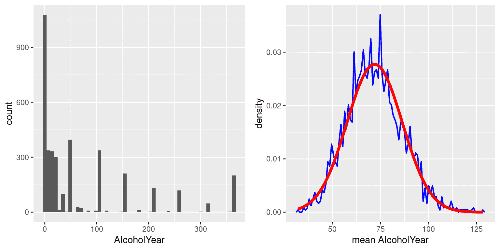

# 第七章：采样

> 原文：[`statsthinking21.github.io/statsthinking21-core-site/sampling.html`](https://statsthinking21.github.io/statsthinking21-core-site/sampling.html)
> 
> 译者：[飞龙](https://github.com/wizardforcel)
> 
> 协议：[CC BY-NC-SA 4.0](https://creativecommons.org/licenses/by-nc-sa/4.0/)

统计学中的一个基本思想是，我们可以根据人口的一个相对较小的样本对整个人口进行推断。在本章中，我们将介绍统计抽样的概念，并讨论为什么它有效。 

在美国生活的任何人都会熟悉从政治民意调查中抽样的概念，这已经成为我们选举过程的核心部分。在某些情况下，这些民意调查可以非常准确地预测选举结果。最著名的例子来自 2008 年和 2012 年的美国总统选举，民意调查员内特·西尔弗（Nate Silver）在 2008 年正确预测了 49/50 个州的选举结果，在 2012 年预测了所有 50 个州的选举结果。西尔弗通过结合来自 21 个不同民意调查的数据来做到这一点，这些民意调查在倾向于共和党或民主党的程度上有所不同。每个民意调查包括大约 1000 名可能的选民的数据 - 这意味着西尔弗几乎可以准确预测超过 1.25 亿选民的选票模式，只使用了大约 2.1 万人的数据，以及其他知识（比如这些州过去的投票情况）。

## 7.1 我们如何进行抽样？

我们在采样中的目标是确定感兴趣的整个人口的统计量的值，只使用人口的一个小子集。我们主要这样做是为了节省时间和精力 - 当只需要一个小样本就足以准确估计感兴趣的统计量时，为什么要费劲测量人口中的每个个体呢？

在选举的例子中，人口是被调查地区的所有注册选民，样本是由民意调查组织选出的 1000 个个体。我们选择样本的方式对确保样本*代表*整个人口至关重要，这是统计抽样的主要目标。很容易想象一个非代表性的样本；如果民意调查员只打电话给他们从当地民主党那里得到的名单上的人，那么调查结果很可能不代表整个人口。一般来说，我们会定义代表性调查为每个人口成员被选中的机会相等。当这种情况失败时，我们就需要担心我们在样本上计算的统计量是否*有偏* - 也就是说，它的值是否与人口值（我们称之为*参数*）有系统性的不同。请记住，我们通常不知道这个人口参数，因为如果我们知道的话，我们就不需要抽样了！但我们将使用一些例子来解释一些关键的思想，其中我们可以访问整个人口。

重要的是要区分两种不同的采样方式：有放回和无放回。在*有放回*采样中，从人口中抽取一个成员后，将其放回池中，这样他们有可能再次被抽样。在*无放回*采样中，一旦成员被抽样，他们就不再有资格被再次抽样。最常见的是使用无放回采样，但在某些情况下，我们会使用有放回采样，比如在第 8 章中讨论的一种叫做*自助法*的技术。

## 7.2 采样误差

无论我们的样本有多具代表性，我们计算出的统计量与人口参数至少略有不同的可能性很大。我们称之为*抽样误差*。如果我们抽取多个样本，我们的统计估计值的值也会因样本而异；我们将这个统计量在样本中的分布称为*抽样分布*。

抽样误差与我们对人口的测量质量直接相关。显然，我们希望从样本中获得的估计值尽可能接近人口参数的真实值。然而，即使我们的统计量是无偏的（也就是说，我们期望它具有与人口参数相同的值），任何特定估计值的值都将与人口值不同，并且当抽样误差更大时，这些差异将更大。因此，减少抽样误差是更好地测量的重要一步。

我们将以 NHANES 数据集为例；我们将假设 NHANES 数据集是感兴趣的整个人口，然后我们将从该人口中抽取随机样本。在下一章中，我们将更多地讨论计算机中“随机”样本生成的工作原理。

在这个例子中，我们知道成年人口的均值（168.35）和身高的标准差（10.16），因为我们假设 NHANES 数据集*是*人口。表 7.1 显示了从 NHANES 人口中抽取的 50 个个体的几个样本计算出的统计数据。

表 7.1：NHANES 身高变量的几个样本的均值和标准差示例。

| 样本均值 | 样本标准差 |
| --: | --: |
| 167 | 9.1 |
| 171 | 8.3 |
| 170 | 10.6 |
| 166 | 9.5 |
| 168 | 9.5 |

样本均值和标准差与人口值相似，但并非完全相等。现在让我们抽取 50 个个体的大量样本，计算每个样本的均值，并查看得到的均值的抽样分布。我们必须决定抽取多少样本才能很好地估计抽样分布 - 在这种情况下，我们将抽取 5000 个样本，以便我们对答案非常有信心。请注意，像这样的模拟有时可能需要几分钟才能运行，并且可能会使您的计算机变得吃力。图 7.1 中的直方图显示，对于 50 个个体的每个样本估计的均值有些变化，但总体上它们都集中在人口均值周围。5000 个样本均值的平均值（168.3463）非常接近真实的人口均值（168.3497）。

图 7.1：蓝色直方图显示了从 NHANES 数据集中随机抽取的 5000 个样本的均值的抽样分布。灰色直方图是完整数据集的参考。

## 7.3 均值的标准误差

在本书的后面，能够描述我们的样本有多么变化是至关重要的，以便对样本统计量进行推断。对于均值，我们使用一个称为均值的标准误差（SEM）的量来做到这一点，可以将其视为均值的抽样分布的标准差。要计算我们样本的均值的标准误差，我们将估计的标准偏差除以样本大小的平方根：

$$ SEM = \frac{\hat{\sigma}}{\sqrt{n}} $$

请注意，如果我们的样本很小（大约小于 30），在使用估计标准偏差计算 SEM 时必须小心。

因为我们从 NHANES 人口中有许多样本，并且我们实际上知道人口 SEM（通过将人口标准差除以人口大小计算），我们可以确认使用人口参数（1.44）计算的 SEM 非常接近我们从 NHANES 数据集中抽取的样本的均值的观察标准差（1.43）。

均值标准误差的公式意味着我们的测量质量涉及两个量：总体变异性和样本大小。因为样本大小是 SEM 公式中的分母，所以在保持总体变异性恒定时，较大的样本大小将产生较小的 SEM。我们无法控制总体变异性，但我们可以控制样本大小。因此，如果我们希望改善样本统计数据（通过减少抽样变异性），那么我们应该使用更大的样本。然而，该公式还告诉我们关于统计抽样的一个非常基本的事实，即较大样本的效用随着样本大小的平方根而减小。这意味着加倍样本大小不会使统计数据的质量加倍，而是会使其提高$\sqrt{2}$倍。在[10.3 节](ci-effect-size-power.html#statistical-power)中，我们将讨论统计功效，这与这个想法密切相关。

## 7.4 中心极限定理

中心极限定理告诉我们，随着样本大小的增大，均值的抽样分布将变得正态分布，*即使每个样本内的数据不是正态分布*。

首先，让我们简单介绍一下正态分布。它也被称为*高斯*分布，以数学家卡尔·弗里德里希·高斯命名，他并没有发明它，但在其发展中起了一定作用。正态分布用两个参数描述：均值（可以认为是峰值的位置）和标准差（指定分布的宽度）。分布的钟形外观永远不会改变，只有其位置和宽度会改变。正态分布在现实世界中收集的数据中经常观察到，正如我们在第 3 章中已经看到的那样，中心极限定理为我们解释了为什么会发生这种情况。

为了看到中心极限定理的作用，让我们使用 NHANES 数据集中的变量 AlcoholYear，该变量呈高度偏斜，如图 7.2 的左面板所示。这个分布，缺乏更好的词来形容，有点奇怪，绝对不是正态分布。现在让我们看看这个变量的均值抽样分布。图 7.2 显示了这个变量的均值抽样分布，通过反复从 NHANES 数据集中抽取大小为 50 的样本并取均值获得。尽管原始数据明显不是正态分布，但抽样分布与正态分布非常接近。

图 7.2：左图：NHANES 数据集中变量 AlcoholYear 的分布，反映了个体一年内饮酒的天数。右图：NHANES 数据集中 AlcoholYear 的均值抽样分布，通过从 NHANES 数据集中重复抽取大小为 50 的样本获得，用蓝色表示。具有相同均值和标准差的正态分布用红色表示。

中心极限定理对统计学很重要，因为它允许我们安全地假设平均数的抽样分布在大多数情况下是正态的。这意味着我们可以利用假设正态分布的统计技术，正如我们将在下一节中看到的那样。它也很重要，因为它告诉我们为什么正态分布在现实世界中如此普遍；每当我们将许多不同因素合并成一个单一数字时，结果很可能是正态分布。例如，任何成年人的身高取决于他们的遗传和经验的复杂混合；即使这些个体贡献可能不是正态分布的，当我们将它们结合起来时，结果就是正态分布。

## 7.5 学习目标

阅读完本章后，您应该能够：

+   区分总体和样本，以及总体参数和样本统计量

+   描述抽样误差和抽样分布的概念

+   计算平均数的标准误差

+   描述中心极限定理如何决定平均数的抽样分布的性质

## 7.6 建议阅读

+   《信号与噪音：为什么这么多预测失败-但有些不会》，作者：内特·席尔瓦
