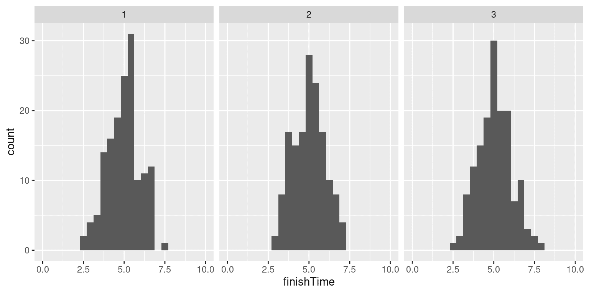

# 第八章：重采样和模拟

> 原文：[`statsthinking21.github.io/statsthinking21-core-site/resampling-and-simulation.html`](https://statsthinking21.github.io/statsthinking21-core-site/resampling-and-simulation.html)
> 
> 译者：[飞龙](https://github.com/wizardforcel)
> 
> 协议：[CC BY-NC-SA 4.0](https://creativecommons.org/licenses/by-nc-sa/4.0/)

计算机模拟的使用已经成为现代统计学的一个重要方面。例如，实际计算机科学中最重要的书之一，名为《数值方法》，说：

> “如果让我们选择掌握五英尺高的分析统计书籍和在执行统计蒙特卡洛模拟方面具有一般能力之间，我们肯定会选择后者的技能。”

在本章中，我们将介绍蒙特卡洛模拟的概念，并讨论如何使用它进行统计分析。

## 8.1 蒙特卡洛模拟

蒙特卡洛模拟的概念是由数学家斯坦·乌拉姆和尼古拉斯·梅特罗波利斯提出的，他们正在为美国曼哈顿计划的原子武器开发工作。他们需要计算中子在物质中与原子核碰撞之前的平均距离，但他们无法使用标准数学计算。乌拉姆意识到这些计算可以使用随机数来模拟，就像赌场游戏一样。在赌场游戏中，例如轮盘赌，数字是随机生成的；为了估计特定结果的概率，可以玩数百次游戏。乌拉姆的叔叔曾在摩纳哥的蒙特卡洛赌场赌博，这显然是这种新技术的名称来源。

执行蒙特卡洛模拟有四个步骤：

1.  定义可能值的域

1.  从概率分布中生成该域内的随机数

1.  使用随机数进行计算

1.  在许多重复中结合结果

例如，假设我想弄清楚为课堂测验留多少时间。我们暂时假设我们知道测验完成时间的分布是正态分布，均值为 5 分钟，标准差为 1 分钟。在这种情况下，测试时间需要多长，以便我们预计所有学生 99%的时间都能完成考试？解决这个问题有两种方法。第一种是使用称为极值统计的数学理论计算答案。然而，这涉及复杂的数学。或者，我们可以使用蒙特卡洛模拟。为此，我们需要从正态分布中生成随机样本。

## 8.2 统计学中的随机性

“随机”一词在口语中经常用来指称奇怪或意外的事物，但在统计学中，这个词有一个非常具体的含义：如果一个过程是*随机*的，那么它是不可预测的。例如，如果我抛一枚公平的硬币 10 次，一次抛硬币的结果的值并不能提供任何信息，让我能够预测下一次抛硬币的结果。重要的是要注意，某事是不可预测的并不一定意味着它不是确定性的。例如，当我们抛硬币时，抛硬币的结果是由物理定律决定的；如果我们以足够详细的方式知道所有条件，我们应该能够预测抛硬币的结果。然而，许多因素结合在一起，使得硬币抛掷的结果在实践中是不可预测的。

心理学家已经证明，人类实际上对随机性有相当糟糕的感觉。首先，我们倾向于在不存在的情况下看到模式。在极端情况下，这导致了*错觉*现象，即人们会在随机模式中看到熟悉的物体（例如将云看作人脸或在一片面包上看到圣母玛利亚）。其次，人类倾向于认为随机过程是自我纠正的，这使我们期望在游戏中输了很多轮之后“应该赢了”，这种现象被称为“赌徒谬误”。

## 8.3 生成随机数

运行蒙特卡洛模拟需要生成随机数。生成真正的随机数（即完全不可预测的数）只能通过物理过程来实现，例如原子衰变或掷骰子，这些过程很难获得和/或太慢，以至于对于计算机模拟来说不实用（尽管可以从[NIST 随机性信标](https://www.nist.gov/programs-projects/nist-randomness-beacon%5D)获得）。

通常情况下，我们使用计算机算法生成的*伪随机*数，而不是真正的随机数；这些数字在某种意义上看起来是随机的，因为它们很难预测，但实际上数字序列会在某个时候重复。例如，在 R 中使用的随机数生成器在$2^{19937} - 1$个数字后会重复。这远远超过了宇宙历史上的秒数，我们普遍认为这对于统计分析的大多数目的来说是可以接受的。

大多数统计软件包括用于生成每个主要概率分布的随机数的函数，例如均匀分布（0 到 1 之间的所有值均等）、正态分布和二项分布（例如掷骰子、抛硬币）。图 8.1 显示了从均匀分布和正态分布函数生成的数字的示例。

图 8.1：从均匀（左）或正态（右）分布生成的随机数示例。

我们还可以使用分布的*分位数*函数生成任何分布的随机数。这是累积分布函数的反函数；分位数函数不是为一组值确定累积概率，而是为一组累积概率确定值。使用分位数函数，我们可以从均匀分布中生成随机数，然后通过其分位数函数将其映射到感兴趣的分布中。

在统计软件中，默认情况下，随机数生成器每次运行时都会生成不同的随机数集。然而，也可以通过将所谓的*随机种子*设置为特定值来生成完全相同的随机数集。如果你看一下生成这些图表的代码，我们将在本书的许多示例中这样做，以确保这些示例是可重现的。

## 8.4 使用蒙特卡洛模拟

让我们回到我们的考试完成时间的例子。假设我进行了三次测验，并记录了每个学生对每次考试的完成时间，这可能看起来像图 8.2 中呈现的分布。

图 8.2：模拟完成时间分布。

为了回答我们的问题，我们真正想知道的不是完成时间的分布是什么样子，而是每次测验的*最长*完成时间的分布是什么样子。为了做到这一点，我们可以模拟测验的完成时间，使用上面提到的完成时间分布正态分布的假设；对于这些模拟的测验中，我们记录最长的完成时间。我们重复这个模拟很多次（5000 次应该足够），并记录完成时间的分布，如图 8.3 所示。

图 8.3：模拟中最长完成时间的分布。

这表明完成时间分布的第 99 百分位数为 8.74，这意味着如果我们给予这么多时间来做测验，那么 99%的时间每个人都应该能完成。重要的是要记住我们的假设很重要 - 如果它们是错误的，那么模拟的结果就毫无意义。在这种情况下，我们假设完成时间分布是正态分布的，具有特定的平均值和标准差；如果这些假设是不正确的（几乎肯定是不正确的，因为经过的时间很少是正态分布的），那么真实的答案可能会大不相同。

## 8.5 使用模拟进行统计：bootstrap

到目前为止，我们已经使用模拟来演示统计原理，但我们也可以使用模拟来回答真实的统计问题。在本节中，我们将介绍一个称为*bootstrap*的概念，它让我们可以使用模拟来量化我们对统计估计的不确定性。在课程的后面，我们将看到其他例子，说明模拟通常可以用来回答统计问题，特别是当理论统计方法不可用或者它们的假设太难满足时。

### 8.5.1 计算 bootstrap

在上一章中，我们利用对平均值的抽样分布的了解来计算平均值的标准误差。但是，如果我们不能假设估计值是正态分布的，或者我们不知道它们的分布是什么怎么办？bootstrap 的想法是使用数据本身来估计答案。这个名字来源于一个拉自己的靴带的想法，表达了我们没有任何外部杠杆的想法，所以我们必须依靠数据本身。bootstrap 方法是由斯坦福大学统计系的 Bradley Efron 构想的，他是世界上最有影响力的统计学家之一。

bootstrap 背后的想法是我们反复从实际数据集中抽样；重要的是，我们进行*有放回*的抽样，这样同一个数据点往往会在一个样本中被多次表示。然后我们计算我们感兴趣的统计量在每个 bootstrap 样本上，然后使用这些估计值的分布作为我们的抽样分布。在某种意义上，我们将我们特定的样本视为整个人口，然后反复进行有放回的抽样来生成我们用于分析的样本。这假设我们特定的样本是人口的准确反映，对于较大的样本来说可能是合理的，但在样本较小时可能会失效。

让我们首先使用 bootstrap 来估计 NHANES 数据集中成年人身高的平均值的抽样分布，以便我们可以将结果与我们之前讨论的平均标准误差（SEM）进行比较。

图 8.4：使用 bootstrap 来计算 NHANES 数据集中成年人身高的平均标准误差的示例。直方图显示了 bootstrap 样本中平均值的分布，而红线显示了基于样本平均值和标准差的正态分布。

图 8.4 显示，通过自助法样本的均值分布与基于正态分布假设的理论估计相当接近。通常情况下，我们不会使用自助法来计算均值的置信区间（因为我们通常可以假设正态分布适用于均值的抽样分布，只要我们的样本足够大），但这个例子展示了这种方法给我们带来了与基于正态分布的标准方法大致相同的结果。自助法更常用于生成我们知道或怀疑正态分布不适用的其他统计量的标准误差。此外，在后面的章节中，您将看到我们还可以使用自助法样本来生成我们样本统计量的不确定性估计。

## 8.6 学习目标

阅读完本章后，您应该能够：

+   描述蒙特卡洛模拟的概念。

+   描述统计学中随机性的含义

+   描述伪随机数是如何生成的

+   描述自助法的概念

## 8.7 建议阅读

+   *计算机时代的统计推断：算法、证据和数据科学*，作者：布拉德利·埃夫隆（Bradley Efron）和特雷弗·哈斯蒂（Trevor Hastie）
