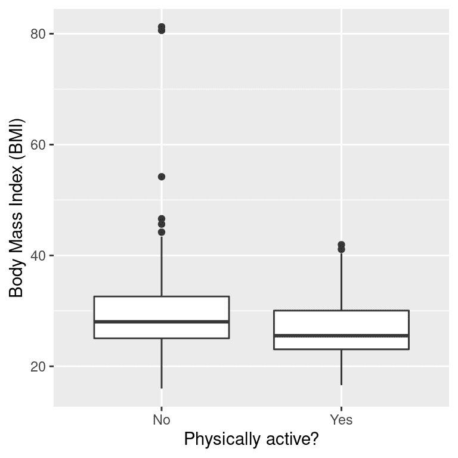
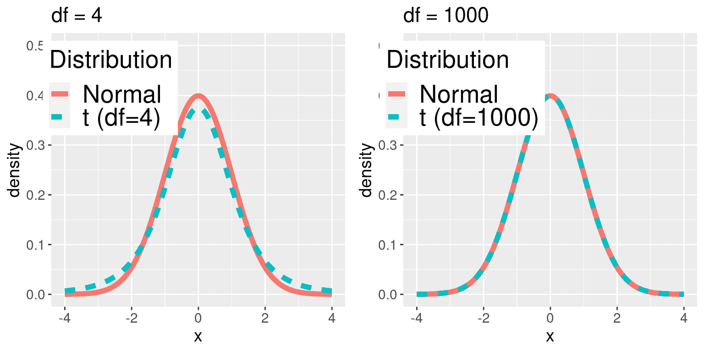
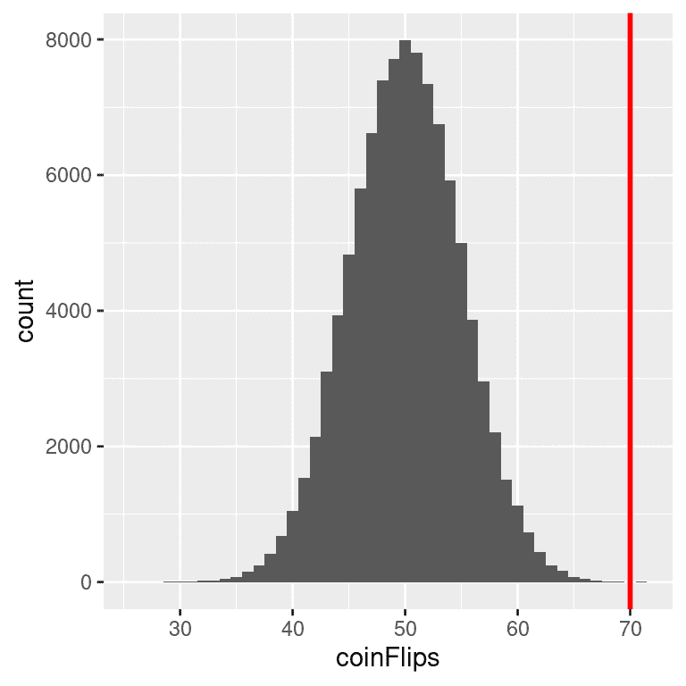
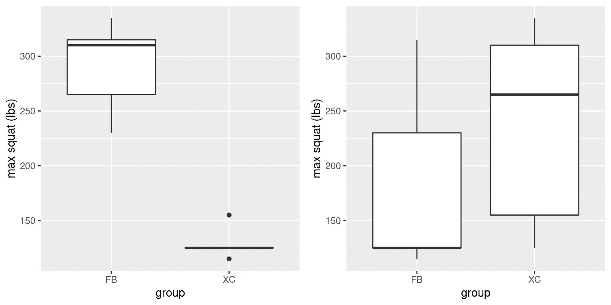
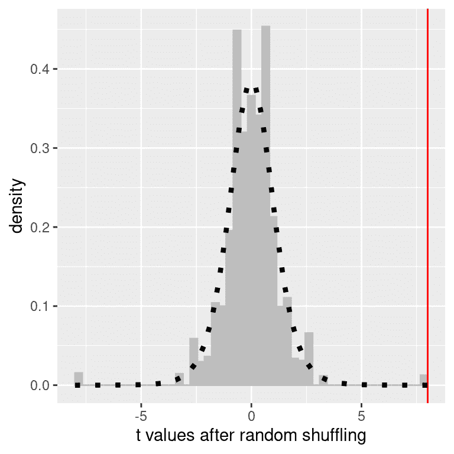
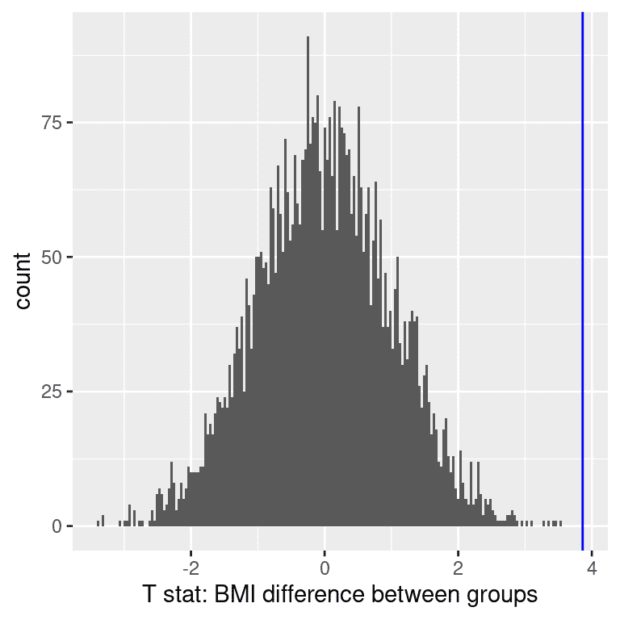
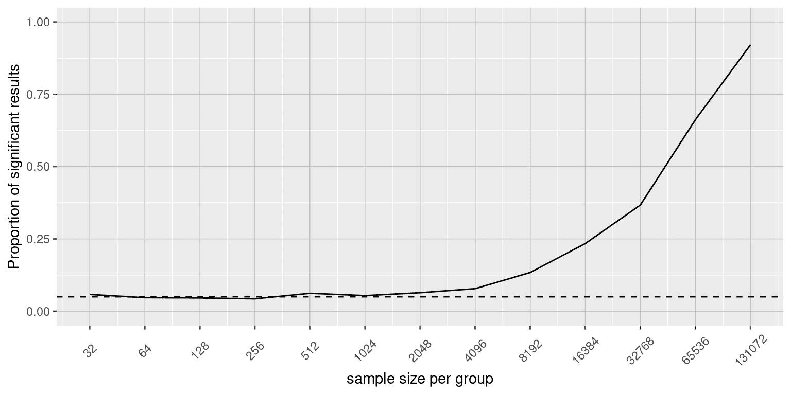
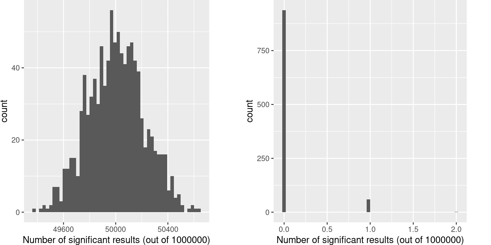

# 第九章：假设检验

> 原文：[`statsthinking21.github.io/statsthinking21-core-site/hypothesis-testing.html`](https://statsthinking21.github.io/statsthinking21-core-site/hypothesis-testing.html)
> 
> 译者：[飞龙](https://github.com/wizardforcel)
> 
> 协议：[CC BY-NC-SA 4.0](https://creativecommons.org/licenses/by-nc-sa/4.0/)

在第一章中，我们讨论了统计学的三个主要目标：

+   描述

+   决定

+   预测

在本章中，我们将介绍使用统计数据做出决策的思想，特别是关于某个特定假设是否得到数据支持的决策。

## 9.1 零假设统计检验（NHST）

我们将讨论的特定类型的假设检验被称为*零假设统计检验*（NHST）（出于将要明确的原因）。如果你拿起几乎任何科学或生物医学研究出版物，你会看到 NHST 被用来测试假设，在他们的心理学入门教科书中，Gerrig & Zimbardo（2002）将 NHST 称为“心理研究的支柱”。因此，学习如何使用和解释假设检验的结果对于理解许多研究领域的结果至关重要。

然而，你也需要知道，NHST 存在严重缺陷，许多统计学家和研究人员（包括我自己）认为它已经导致了科学上的严重问题，我们将在第[18]章（进行可重复研究.html#进行可重复研究）中讨论。50 多年来，人们一直呼吁放弃 NHST，转而采用其他方法（就像我们将在接下来的章节中讨论的那些方法）：

+   “心理研究中的统计显著性检验可以被视为研究进行中一种基本的无意识”（Bakan，1966）

+   假设检验是“关于构成科学进步的错误观点”（Luce，1988）

NHST 也被广泛误解，主要是因为它违反了我们对统计假设检验应该如何工作的直觉。让我们看一个例子来看看这一点。

## 9.2 零假设统计检验：一个例子

人们对警察佩戴身体摄像头的兴趣很大，认为这可以减少使用武力并改善警察的行为。然而，为了证实这一点，我们需要实验证据，政府越来越普遍地使用随机对照试验来测试这样的想法。华盛顿特区政府和华盛顿特区警察局在 2015/2016 年进行了一项关于身体摄像头有效性的随机对照试验。警察被随机分配佩戴或不佩戴身体摄像头，然后跟踪他们的行为，以确定摄像头是否导致使用武力减少以及有关警察行为的民事投诉减少。

在我们得出结果之前，让我们问一下你认为统计分析可能是如何工作的。假设我们想具体测试佩戴摄像头是否减少使用武力的假设。随机对照试验为我们提供了测试假设的数据，即分配给摄像头组或对照组的警官使用武力的比率。下一个明显的步骤是查看数据，并确定它们是否提供有力的证据支持或反对这一假设。也就是说：鉴于数据和我们所知道的其他一切，佩戴身体摄像头是否减少了使用武力的可能性有多大？

事实证明，这*不是*零假设检验的工作方式。相反，我们首先拿出我们感兴趣的假设（即佩戴身体摄像头会减少使用武力），然后将其颠倒过来，创建一个*零假设* - 在这种情况下，零假设将是摄像头不会减少使用武力。重要的是，我们假设零假设为真。然后我们看数据，并确定如果零假设为真，数据会有多大可能性。如果数据在零假设下不够可能，我们可以拒绝零假设，支持*备择假设*，这是我们感兴趣的假设。如果没有足够的证据来拒绝零假设，那么我们说我们保留（或“未能拒绝”）零假设，坚持我们最初的假设零假设为真。

理解 NHST 的一些概念，特别是臭名昭著的“p 值”，第一次遇到它们无疑是具有挑战性的，因为它们是如此违反直觉。正如我们将在后面看到的，还有其他方法可以提供更直观的方式来处理假设检验（但它们也有自己的复杂性）。然而，在我们接触这些方法之前，你有必要深刻理解假设检验的工作原理，因为显然它不会很快消失。

## 9.3 零假设检验的过程

我们可以将零假设检验的过程分解为几个步骤：

1.  制定一个包含我们预测的假设（*在看到数据之前*）

1.  指定零假设和备择假设

1.  收集与假设相关的一些数据

1.  将模型拟合到代表备择假设的数据中，并计算一个检验统计量

1.  计算假设为真时观察值的概率

1.  评估结果的“统计显著性”

举个实际例子，让我们使用 NHANES 数据来问以下问题：体力活动是否与身体质量指数有关？在 NHANES 数据集中，参与者被问及是否经常参与中等或剧烈强度的体育、健身或娱乐活动（存储在变量$PhysActive$中）。研究人员还测量了身高和体重，并用它们来计算*身体质量指数*（BMI）：

$$ BMI = \frac{weight(kg)}{height(m)^2} $$

### 9.3.1 步骤 1：制定感兴趣的假设

我们假设不参与体力活动的人的 BMI 比参与的人更高。

### 9.3.2 步骤 2：指定零假设和备择假设

对于步骤 2，我们需要指定我们的零假设（我们称之为$H_0$）和我们的备择假设（我们称之为$H_A$）。$H_0$是我们测试感兴趣的假设的基准：也就是说，如果没有效应，我们期望数据看起来会是什么样子？零假设总是涉及某种形式的相等（=，$\le$或$\ge$）。$H_A$描述了如果实际上有效应，我们期望的情况。备择假设总是涉及某种形式的不等式（$\ne$，>或<）。重要的是，零假设检验在假设零假设为真的情况下进行。

我们还必须决定是否要测试*定向*或*非定向*假设。非定向假设只是预测会有差异，而不预测差异的方向。对于 BMI/活动的例子，非定向零假设将是：

$H0: BMI_{active} = BMI_{inactive}$

相应的非定向备择假设将是：

$HA: BMI_{active} \neq BMI_{inactive}$

另一方面，定向假设预测了差异的方向。例如，我们有强烈的先验知识来预测参与体力活动的人应该比不参与的人体重更轻，因此我们提出以下定向零假设：

$H0: BMI_{active} \ge BMI_{inactive}$

和定向备择假设：

$HA: BMI_{active} < BMI_{inactive}$

正如我们将在后面看到的，测试非定向假设更为保守，因此通常更可取，除非有强有力的*先验*理由假设特定方向上的效应。假设，包括它们是否是定向的，应该在查看数据之前始终明确指定！

### 9.3.3 步骤 3：收集一些数据

在这种情况下，我们将从 NHANES 数据集中抽取 250 个个体。图 9.1 展示了这样一个样本的示例，其中 BMI 分别显示为活跃和不活跃的个体，表 9.1 显示了每组的摘要统计信息。

表 9.1：活动与不活动个体的 BMI 数据总结

| 身体活动 | N | 均值 | 标准差 |
| :-- | --: | --: | --: |
| 编号 | 131 | 30 | 9.0 |
| 是 | 119 | 27 | 5.2 |



图 9.1：来自 NHANES 数据集成年人样本的 BMI 数据的箱线图，按是否报告参与定期体育活动进行分割。

### 9.3.4 步骤 4：对数据进行建模并计算检验统计量

接下来，我们希望使用数据计算一个统计量，最终让我们决定是否拒绝零假设。为此，模型需要量化支持备择假设的证据量，相对于数据的变异性。因此，我们可以将检验统计量视为提供效应大小相对于数据变异性的一种度量。一般来说，这个检验统计量将与概率分布相关联，因为这使我们能够确定在零假设下我们观察到的统计量的概率有多大。

对于 BMI 的例子，我们需要一个检验统计量，允许我们测试两个均值之间的差异，因为假设是以每组的平均 BMI 来陈述的。经常用于比较两个均值的统计量是*t*统计量，最初由统计学家威廉·西利·高斯特(Wiliam Sealy Gossett)开发，他在都柏林的吉尼斯啤酒厂工作，并以笔名“学生”写作，因此通常被称为“学生*t*统计量”。当样本量相对较小且总体标准差未知时，*t*统计量适用于比较两组的均值。用于比较两个独立组的*t*统计量计算如下：

$$ t = \frac{\bar{X_1} - \bar{X_2}}{\sqrt{\frac{S_1^2}{n_1} + \frac{S_2^2}{n_2}}} $$

其中$\bar{X}_1$和$\bar{X}_2$是两组的均值，$S^2_1$和$S^2_2$是两组的估计方差，$n_1$和$n_2$是两组的样本量。因为两个独立变量的差异的方差是每个单独变量的方差的总和($var(A - B) = var(A) + var(B)$)，我们将每组的方差除以它们的样本量，以计算差异的标准误差。因此，可以将*t*统计量视为量化组间差异与均值差异的抽样变异性之间的大小关系的一种方式。

*t*统计量根据一个被称为*t*分布的概率分布进行分布。*t*分布看起来非常类似于正态分布，但它根据自由度的数量而有所不同。当自由度很大（比如 1000），那么*t*分布看起来基本上就像正态分布，但当自由度很小时，*t*分布的尾部比正态分布要长（见图 9.2）。在最简单的情况下，如果组的大小相同且方差相等，*t*检验的自由度就是观察值的数量减去 2，因为我们计算了两个均值，因此放弃了两个自由度。在这种情况下，从箱线图中很明显可以看出，非活跃组的变异性比活跃组更大，并且每组的数字也不同，因此我们需要使用一个稍微复杂一点的自由度公式，通常被称为“韦尔奇 t 检验”。公式为：

$$ \mathrm{d.f.} = \frac{\left(\frac{S_1^2}{n_1} + \frac{S_2^2}{n_2}\right)^2}{\frac{\left(S_1^2/n_1\right)^2}{n_1-1} + \frac{\left(S_2^2/n_2\right)^2}{n_2-1}} $$

当方差和样本大小相等时，这将等于$n_1 + n_2 - 2$，否则会更小，实际上对样本大小或方差的差异对检验施加了惩罚。对于这个例子，计算结果为 241.12，略低于从样本大小减去 2 得到的 248。



图 9.2：每个面板显示了 t 分布（蓝色虚线）叠加在正态分布（红色实线）上。左面板显示了自由度为 4 的 t 分布，此时分布类似但尾部略宽。右面板显示了自由度为 1000 的 t 分布，此时它几乎与正态分布相同。

### 9.3.5 第 5 步：确定零假设下观察结果的概率

这一步是 NHST 开始违反我们的直觉的地方。我们不是确定在数据给定的情况下零假设为真的可能性，而是确定在零假设下观察到至少与我们观察到的统计量一样极端的可能性 — 因为我们最初假设零假设为真！为了做到这一点，我们需要知道在零假设下统计量的预期概率分布，这样我们就可以问在该分布下结果有多大可能性。请注意，当我说“结果有多大可能性”时，我真正的意思是“观察到的结果或更极端的结果有多大可能性”。我们需要添加这个警告的原因至少有两个。第一个是当我们谈论连续值时，任何特定值的概率都是零（如果你上过微积分课程，可能还记得）。更重要的是，我们试图确定如果零假设成立，我们的结果有多奇怪，任何更极端的结果都会更奇怪，因此在计算零假设下我们的结果的概率时，我们希望计算所有这些更奇怪的可能性。

我们可以使用理论分布（如*t*分布）或使用随机化来获得这个“零分布”。在我们转向 BMI 的例子之前，让我们从一些更简单的例子开始。

#### 9.3.5.1 P 值：一个非常简单的例子

假设我们想要确定一枚特定硬币是否有偏向翻转为正面的倾向。为了收集数据，我们翻转了 100 次硬币，假设我们数到了 70 次正面。在这个例子中，$H_0: P(正面) \le 0.5$ 和 $H_A: P(正面) > 0.5$，我们的检验统计量就是我们数到的正面次数。然后我们想要问的问题是：如果正面的真实概率是 0.5，那么我们观察到 100 次翻转中 70 次或更多正面的可能性有多大？我们可以想象这可能偶尔会发生，但似乎不太可能。为了量化这个概率，我们可以使用*二项分布*：

$$ P(X \le k) = \sum_{i=0}^k \binom{N}{k} p^i (1-p)^{(n-i)} $$

这个方程将告诉我们在特定的头像概率（$p$）和事件数量（$N$）的情况下，特定数量的头像（$k$）或更少的概率。然而，我们真正想知道的是特定数量或更多的概率，我们可以通过减去一来获得，根据概率规则：

$$ P(X \ge k) = 1 - P(X < k) $$



图 9.3：100,000 次模拟运行中头像数量（100 次翻转）的分布，观察到的 70 次翻转由垂直线表示。

使用二项分布，给定 P(头像)=0.5，69 个或更少头像的概率为 0.999961，因此 70 个或更多头像的概率就是 1 减去这个值（0.000039）。这个计算告诉我们，如果硬币确实是公平的，那么得到 70 个或更多头像的可能性是非常小的。

现在，如果我们没有一个标准函数告诉我们那个数量的头像的概率会怎么样？我们可以通过模拟来确定，我们重复翻转一枚硬币 100 次，使用真实概率 0.5，然后计算这些模拟运行中头像数量的分布。图 9.3 显示了这个模拟的结果。在这里我们可以看到，通过模拟计算的概率（0.000030）非常接近理论概率（0.000039）。

#### 9.3.5.2 使用*t*分布计算 p 值

现在让我们使用*t*分布来计算我们 BMI 示例的 p 值。首先，我们使用上面计算的样本值计算*t*统计量，我们发现 t = 3.86。然后我们想要问的问题是：如果组之间的真实差异为零或更小（即方向性零假设），那么我们会发现这样大小的*t*统计量的可能性是多少？

我们可以使用*t*分布来确定这个概率。在上面我们注意到，适当的自由度（在校正方差和样本大小的差异后）是 t = 241.12。我们可以使用统计软件中的函数来确定找到大于或等于我们观察到的*t*统计值的概率。我们发现 p(t > 3.86, df = 241.12) = 0.000072，这告诉我们，如果零假设确实成立，那么我们观察到的*t*统计值 3.86 相对不太可能。

在这种情况下，我们使用了定向假设，因此我们只需要查看零分布的一端。如果我们想要测试非定向假设，那么我们需要能够确定效应大小的意外程度，而不考虑其方向。在 t 检验的背景下，这意味着我们需要知道统计量在正向或负向方向上有多么意外的可能性。为了做到这一点，我们将观察到的 *t* 值乘以 -1，因为 *t* 分布以零为中心，然后将两个尾部概率相加，得到 *双尾* p 值：p(t > 3.86 或 t< -3.86, df = 241.12) = 0.000145。在这里，我们看到双尾检验的 p 值是单尾检验的两倍，这反映了一个极端值不那么令人惊讶，因为它可能发生在任何方向。

你如何选择使用单尾还是双尾检验？双尾检验总是更保守，所以最好使用双尾检验，除非你有非常强烈的先验理由使用单尾检验。在这种情况下，你应该在查看数据之前就写下假设。在第 18 章中，我们将讨论假设的预先注册的概念，这正式了在查看实际数据之前写下假设的想法。一旦查看了数据，你绝对*不应该*对如何进行假设检验做出决定，因为这可能会导致结果严重偏倚。

#### 9.3.5.3 使用随机化计算 p 值

到目前为止，我们已经看到了如何使用 t 分布来计算零假设下数据的概率，但我们也可以使用模拟来做到这一点。基本思想是，我们生成类似于零假设下预期数据的模拟数据，然后询问观察到的数据与这些模拟数据相比有多极端。关键问题是：我们如何生成使零假设成立的数据？一般的答案是，我们可以以一种特定的方式随机重新排列数据，使数据看起来像如果零假设真的成立时会是什么样子。这类似于自举的概念，因为它使用我们自己的数据来得出答案，但它的方式不同。

#### 9.3.5.4 随机化：一个简单的例子

让我们从一个简单的例子开始。假设我们想比较足球运动员和越野跑步者的平均深蹲能力，其中 $H_0: \mu_{FB} \le \mu_{XC}$ 和 $H_A: \mu_{FB} > \mu_{XC}$。我们测量了 5 名足球运动员和 5 名越野跑步者的最大深蹲能力（我们将随机生成），假设 $\mu_{FB} = 300$，$\mu_{XC} = 140$，和 $\sigma = 30$。数据如表 9.2 所示。

表 9.2：两组深蹲数据

| 组 | 深蹲 | 打乱的深蹲 |
| :-- | --: | --: |
| FB | 265 | 125 |
| FB | 310 | 230 |
| FB | 335 | 125 |
| FB | 230 | 315 |
| FB | 315 | 115 |
| XC | 155 | 335 |
| XC | 125 | 155 |
| XC | 125 | 125 |
| XC | 125 | 265 |
| XC | 115 | 310 |



图 9.4：左：模拟足球运动员和越野跑步者深蹲能力的箱线图。右：在混淆组标签后分配给每组受试者的箱线图。

从图 9.4 的左侧图表可以清楚地看出两组之间存在很大的差异。我们可以进行标准的 t 检验来测试我们的假设；在这个例子中，我们将使用 R 中的 `t.test()` 命令，得到以下结果：

```r
## 
##  Welch Two Sample t-test
## 
## data:  squat by group
## t = 8, df = 5, p-value = 2e-04
## alternative hypothesis: true difference in means between group FB and group XC is greater than 0
## 95 percent confidence interval:
##  121 Inf
## sample estimates:
## mean in group FB mean in group XC 
##              291              129
```

如果我们看一下这里报告的 p 值，我们会发现在零假设下出现这样的差异的可能性非常小，使用*t*分布来定义零。

现在让我们看看如何使用随机化来回答相同的问题。基本思想是，如果没有组之间的差异的零假设成立，那么来自哪个组（足球运动员与越野跑步者）就不重要 - 因此，为了创建像我们实际数据一样但也符合零假设的数据，我们可以随机重新排列数据集中个体的数据，然后重新计算组之间的差异。这样的洗牌结果显示在表 9.2 的“shuffleSquat”列中，生成的数据的箱线图显示在图 9.4 的右面板中。



图 9.5：在随机洗牌组成员资格后，足球和越野组之间的平均差异的 t 值的直方图。垂直线表示两组之间观察到的实际差异，虚线显示了此分析的理论 t 分布。

在混淆数据之后，我们看到两组现在更加相似，事实上越野组现在的平均值略高。现在让我们这样做 10000 次，并存储每次迭代的*t*统计量；如果你在自己的电脑上进行这个操作，完成需要一段时间。图 9.5 显示了所有随机洗牌的*t*值的直方图。如预期的那样，在零假设下，这个分布以零为中心（分布的均值为 0.007）。从图中我们还可以看到，在洗牌后*t*值的分布大致遵循零假设下的理论*t*分布（均值=0），表明随机化工作生成了零数据。我们可以通过测量多少洗牌值至少与观察值一样极端来计算来自随机数据的 p 值：p(t > 8.01, df = 8) using randomization = 0.00410。这个 p 值与我们使用*t*分布得到的 p 值非常相似，两者都非常极端，表明如果零假设成立，观察到的数据非常不可能出现 - 在这种情况下，我们*知道*它不是真的，因为我们生成了数据。

##### 9.3.5.4.1 随机化：BMI/活动示例

现在让我们使用随机化来计算 BMI/活动示例的 p 值。在这种情况下，我们将随机洗牌`PhysActive`变量，并在每次洗牌后计算两组之间的差异，然后将我们观察到的*t*统计量与洗牌数据的*t*统计量的分布进行比较。图 9.6 显示了来自洗牌样本的*t*值的分布，我们还可以计算找到一个与观察值一样大或更大的值的概率。从随机化得到的 p 值（0.000000）与使用*t*分布得到的 p 值（0.000075）非常相似。随机化检验的优势在于，它不要求我们假设每个组的数据都是正态分布的，尽管 t 检验通常对该假设的违反具有相当的鲁棒性。此外，随机化检验可以让我们计算统计量的 p 值，即使我们没有像 t 检验那样的理论分布。



图 9.6：在组标签混洗后 t 统计直方图，垂直线显示 t 统计的观察值，至少与观察值一样极端的值显示为浅灰色

当我们使用随机化检验时，我们必须做出一个主要假设，我们称之为*可交换性*。这意味着所有的观察结果都以相同的方式分布，这样我们可以互换它们而不改变整体分布。这种假设可能会破坏的主要地方是当数据中存在相关的观察结果时；例如，如果我们有来自 4 个不同家庭的个体数据，那么我们不能假设个体是可交换的，因为兄弟姐妹之间的距离比他们与其他家庭的个体之间的距离更近。一般来说，如果数据是通过随机抽样获得的，那么可交换性的假设应该成立。

### 9.3.6 步骤 6：评估结果的“统计显著性”

下一步是确定从前一步得出的 p 值是否足够小，以至于我们愿意拒绝零假设，相反地得出替代假设是真实的。我们需要多少证据？这是统计学中最具争议的问题之一，部分原因是因为它需要主观判断——没有“正确”的答案。

历史上，对这个问题最常见的答案是，如果 p 值小于 0.05，我们应该拒绝零假设。这来自于罗纳德·费舍尔的著作，他被称为“20 世纪统计学中最重要的人物”（[Efron 1998](#ref-efron1998)）：

> “如果 P 在 .1 和 .9 之间，肯定没有理由怀疑被检验的假设。如果它低于 .02，强烈表明假设未能解释所有的事实。如果它低于 .05，我们不会经常走错路……在大约我们可以说的水平上画一条线：要么治疗有效，要么发生了一次在二十次试验中不会再次发生的巧合”（[R. A. Fisher 1925](#ref-fisher1925statistical)）

然而，费舍尔从未打算 $p < 0.05$ 成为一个固定的规则：

> “没有科学工作者有一个固定的显著性水平，从一年到另一年，在所有情况下，他拒绝假设；相反，他根据他的证据和想法来考虑每个特定情况”（[罗纳德·艾尔默·费舍尔 1956](#ref-fish:1956)）

相反，p < .05 很可能成为一种仪式，因为在计算变量的任意值的 p 值变得容易之前，人们依赖于使用表格的 p 值。所有的表格都有一个 0.05 的条目，这样就很容易确定自己的统计量是否超过了达到那个显著水平所需的值。

统计阈值的选择仍然存在深刻的争议，最近（Benjamin et al., 2018）提出将默认阈值从 0.05 更改为 0.005，使其更严格，因此更难拒绝零假设。在很大程度上，这一举措是由于越来越多的人担心从 $p < .05$ 的显著结果获得的证据相对较弱；我们将在第 18 章中讨论可重复性时返回到这一点。

#### 9.3.6.1 假设检验作为决策：内曼-皮尔逊方法

而 Fisher 认为 p 值可以提供关于特定假设的证据，统计学家 Jerzy Neyman 和 Egon Pearson 则强烈反对。相反，他们提出我们应该从长期的错误率角度来考虑假设检验：

> “基于概率理论的任何测试本身都不能提供任何有价值的关于假设真假的证据。但我们可以从另一个角度来看待测试的目的。在不希望知道每个单独假设是真还是假的情况下，我们可以寻找规则来指导我们对待它们的行为，通过遵循这些规则，我们确保在长期的经验中，我们不会经常犯错”（[J. Neyman and Pearson 1933](#ref-Neyman289)）

也就是说：我们无法知道具体的决策是对还是错，但如果我们遵循规则，至少可以知道我们的决策在长期内会有多少错误。

为了理解 Neyman 和 Pearson 开发的决策框架，我们首先需要讨论统计决策的结果类型。现实存在两种可能的状态（$H_0$为真，或$H_0$为假），以及两种可能的决策（拒绝$H_0$，或保留$H_0$）。我们可以做出正确决策的两种方式：

+   当$H_0$为假时我们拒绝$H_0$（在信号检测理论的术语中，我们称之为*命中*）

+   当$H_0$为真时我们保留$H_0$（在这种情况下有些令人困惑，这被称为*正确拒绝*）

我们也可以犯两种错误：

+   当$H_0$实际上为真时我们拒绝$H_0$（我们称之为*虚警*，或*I 型错误*）

+   当$H_0$实际上为假时我们保留$H_0$（我们称之为*漏失*，或*II 型错误*）

Neyman 和 Pearson 创造了两个术语来描述长期内这两种错误的概率：

+   P(I 型错误) = $\alpha$

+   P(II 型错误) = $\beta$

也就是说，如果我们将$\alpha$设为 0.05，那么长期内我们应该有 5%的概率犯 I 型错误。虽然通常将$\alpha$设为 0.05，但可接受的$\beta$水平的标准值为 0.2——也就是说，我们愿意接受 20%的时间我们无法检测到真实效应。我们将在后面讨论统计功效时再回到这一点，统计功效是 II 型错误的补充。

### 9.3.7 显著结果意味着什么？

关于 p 值的实际含义存在很多混淆（Gigerenzer, 2004）。假设我们进行一个实验，比较不同条件下的平均值，发现 p 值为 0.01。可能有多种解释。

#### 9.3.7.1 这意味着零假设为真的概率是 0.01 吗？

不是。请记住，在零假设检验中，p 值是给定零假设下数据的概率（$P(data|H_0)$）。它并不支持关于给定数据的零假设的概率（$P(H_0|data)$）的结论。当我们在后面的章节讨论贝叶斯推断时，我们将回到这个问题，因为贝叶斯定理让我们以一种方式反转条件概率，从而能够确定给定数据的假设概率。

#### 9.3.7.2 这意味着你做出错误决策的概率是 0.01 吗？

不是。这将是$P(H_0|data)$，但请记住，p 值是在$H_0$下数据的概率，而不是假设的概率。

#### 9.3.7.3 这意味着如果你再次进行研究，你会 99%的时间得到相同的结果吗？

不是。p 值是关于在零假设下特定数据集的可能性的陈述；它不允许我们对未来事件的可能性（如重复实验）进行推断。

#### 9.3.7.4 这意味着你发现了一个实际重要的效应吗？

不。*统计显著性*和*实际显著性*之间存在重要区别。举个例子，假设我们进行了一项随机对照试验，以检验某种特定饮食对体重的影响，并且我们发现在 p<.05 的水平上存在统计学上显著的影响。这并不能告诉我们实际上减掉了多少体重，这被称为*效应大小*（将在第 10 章中更详细地讨论）。如果我们考虑一项减肥研究，那么我们可能不认为失去一盎司（即几片薯条的重量）是实际上显著的。让我们看看随着样本量的增加，我们能否检测到 1 盎司的显著差异。

图 9.7 显示，随着样本量的增加，显著结果的比例增加，因此在非常大的样本量（约 262,000 名受试者）中，当两种饮食之间的体重减少差异为 1 盎司时，我们将在超过 90%的研究中发现显著结果。尽管这些是统计上显著的，但大多数医生不会认为减重一盎司在实际上或临床上是显著的。当我们回到第 10.3 节讨论*统计功效*的概念时，我们将更详细地探讨这种关系，但从这个例子中已经很清楚，统计显著性并不一定表明实际显著性。



图 9.7：对于一个非常小的变化（1 盎司，大约为.001 标准差）的显著结果的比例，作为样本量的函数。

## 9.4 现代语境下的 NHST：多重检验

到目前为止，我们已经讨论了我们感兴趣的测试单个统计假设的例子，这与传统科学一致，传统科学通常一次只测量少量变量。然而，在现代科学中，我们通常可以测量每个个体的数百万个变量。例如，在量化整个基因组的遗传研究中，每个个体可能有数百万个测量值，在我所在的大脑成像研究中，我们经常一次从大脑的 10 万多个位置收集数据。在这些情况下应用标准的假设检验，除非我们适当地加以注意，否则会发生不好的事情。

让我们举个例子来看看这可能是如何工作的。人们对了解可以使个体易患严重精神疾病（如精神分裂症）的遗传因素非常感兴趣，因为我们知道大约 80%的精神分裂症患者之间的差异是由遗传差异引起的。人类基因组计划及随后的基因组科学革命提供了工具，可以检查人类在基因组方面的许多差异。近年来使用的一种方法称为*全基因组关联研究*（GWAS），其中对每个个体的基因组进行表征，以确定他们在每个位置的遗传密码中有哪些字母，重点关注人类经常不同的位置。确定了这些位置后，研究人员在基因组的每个位置进行统计检验，以确定被诊断为精神分裂症的人是否更有可能在该位置具有遗传序列的一个特定版本。

让我们想象一下，如果研究人员简单地询问每个位置的测试是否在 p<.05 水平上显著，而实际上在任何位置都没有真正的效应会发生什么。为了做到这一点，我们从零分布中生成大量模拟的*t*值，并询问有多少个在 p<.05 水平上显著。让我们多次这样做，每次计算有多少测试结果显著（见图 9.8）。



图 9.8：左：当实际上没有真正效应时，在每一百万次统计测试中每组显著结果的直方图。右：应用多重测试的邦费罗尼校正后，在所有模拟运行中显著结果的直方图。

这表明每次运行中约 5%的测试都是显著的，这意味着即使在真正没有显著关系的情况下，如果我们将 p < .05 作为统计显著性的阈值，那么即使在每项研究中也会“发现”约 500 个基因在统计上是显著的（显著结果的预期数量简单地是$n * \alpha$）。这是因为虽然我们控制了每次测试的错误，但我们没有控制整个*测试家族*的错误率（称为*家族智误差*），这才是我们真正想要控制的，如果我们要查看大量测试的结果。在上面的例子中，使用 p<.05，我们的家族智误差率是 1 - 也就是说，在任何特定研究中，我们几乎肯定会至少犯一个错误。

控制家族智误差的一种简单方法是将α水平除以测试次数；这被称为*邦费罗尼*校正，以意大利统计学家卡洛·邦费罗尼命名。使用上面例子中的数据，我们可以看到在图 9.8 中，只有约 5%的研究显示出任何显著结果，使用校正后的α水平 0.000005，而不是名义水平 0.05。我们有效地控制了家族智误差，使得我们研究中出现*任何*错误的概率控制在 0.05 左右。

## 9.5 学习目标

+   识别假设检验的组成部分，包括感兴趣的参数、零假设和备择假设以及检验统计量。

+   描述 p 值的正确解释以及常见的误解

+   在假设检验中区分两种类型的错误以及决定它们的因素。

+   描述如何使用重抽样来计算 p 值。

+   描述多重检验的问题以及如何解决

+   描述零假设统计检验的主要批评。

## 9.6 建议阅读

+   [《无意义的统计学》，作者格尔德·吉格伦策](https://library.mpib-berlin.mpg.de/ft/gg/GG_Mindless_2004.pdf)

## 参考资料

```r
Efron, Bradley. 1998. “R. A. Fisher in the 21st Century (Invited Paper Presented at the 1996 r. A. Fisher Lecture).” Statist. Sci. 13 (2): 95–122. https://doi.org/10.1214/ss/1028905930.
Fisher, R. A. 1925. Statistical Methods for Research Workers. Edinburgh Oliver & Boyd.
Fisher, Ronald Aylmer. 1956. Statistical Methods and Scientific Inference. New York: Hafner Pub. Co.
Neyman, J., and K. Pearson. 1933. “On the Problem of the Most Efficient Tests of Statistical Hypotheses.” Philosophical Transactions of the Royal Society of London A: Mathematical, Physical and Engineering Sciences 231 (694-706): 289–337. https://doi.org/10.1098/rsta.1933.0009.
```