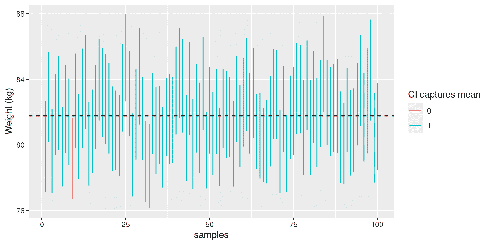
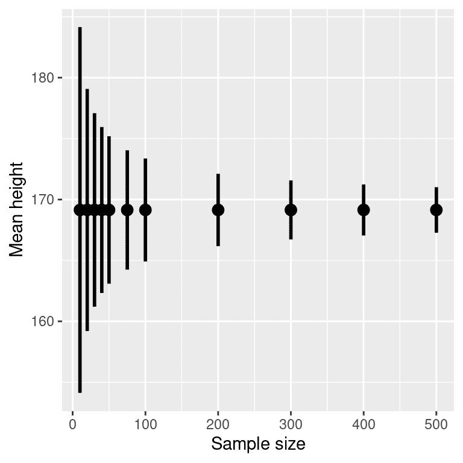
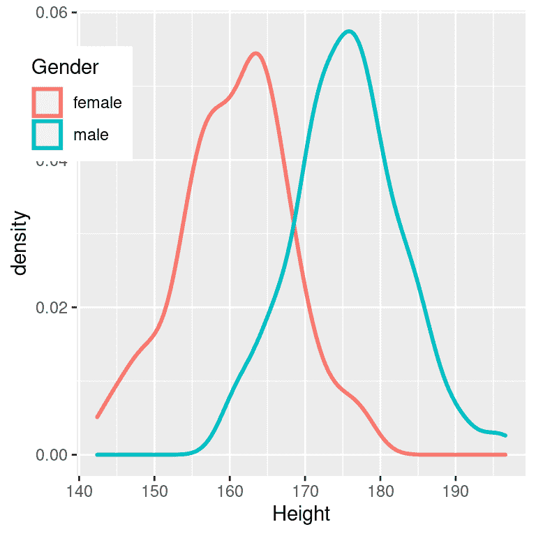
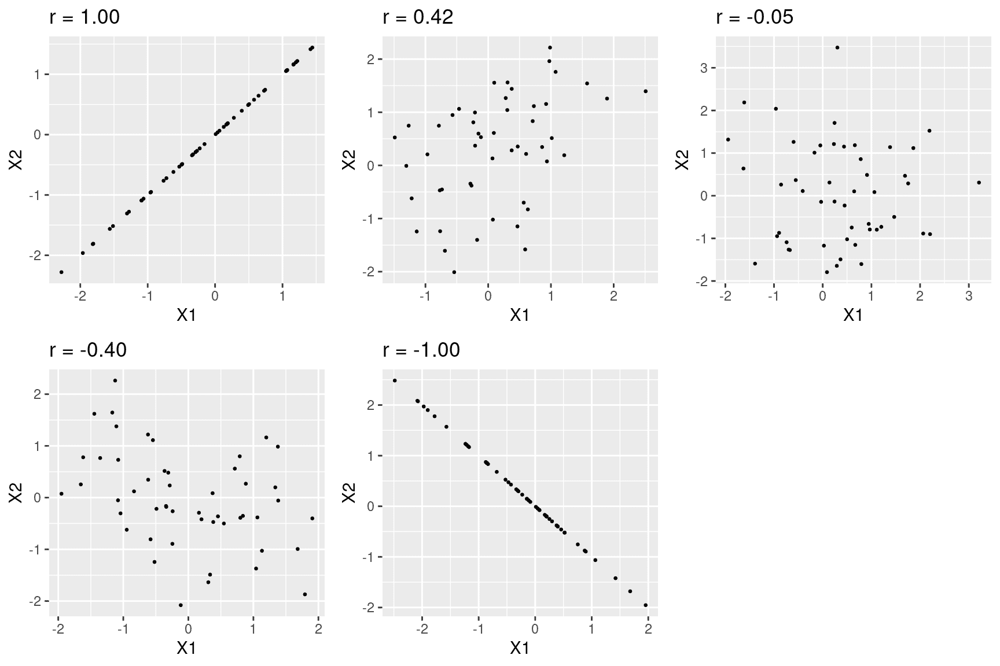
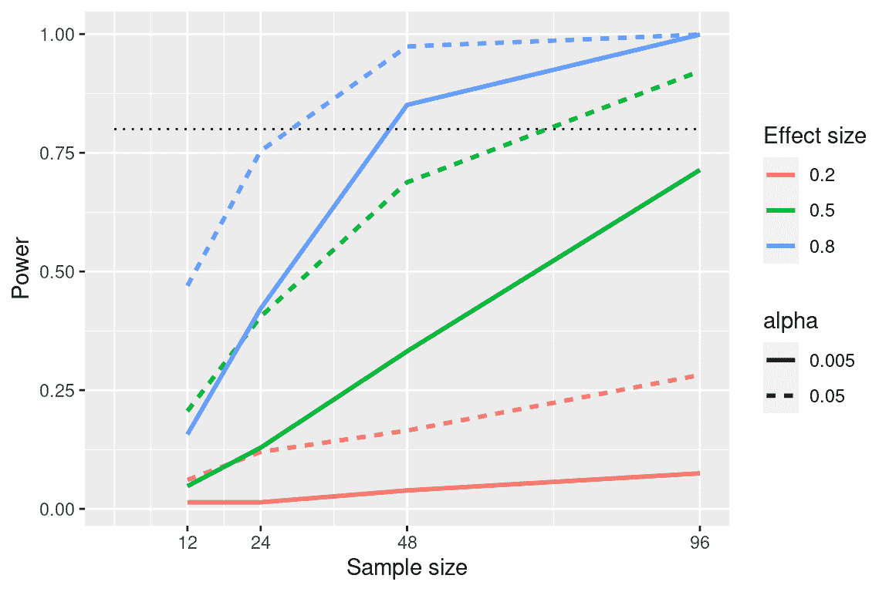

# 第十章：量化效应和设计研究

> 原文：[`statsthinking21.github.io/statsthinking21-core-site/ci-effect-size-power.html`](https://statsthinking21.github.io/statsthinking21-core-site/ci-effect-size-power.html)
> 
> 译者：[飞龙](https://github.com/wizardforcel)
> 
> 协议：[CC BY-NC-SA 4.0](https://creativecommons.org/licenses/by-nc-sa/4.0/)

在上一章中，我们讨论了如何使用数据来检验假设。这些方法提供了一个二元答案：我们要么拒绝要么未能拒绝零假设。然而，这种决定忽略了一些重要的问题。首先，我们想知道答案有多大的不确定性（无论结果如何）。此外，有时我们没有一个明确的零假设，因此我们想看到与数据一致的估计范围。其次，我们想知道效应实际上有多大，因为正如我们在上一章中的减重示例中看到的，统计上显著的效应未必是实际上重要的效应。

在本章中，我们将讨论解决这两个问题的方法：置信区间提供我们对估计的不确定性的度量，以及效应大小提供了一种标准化的方式来理解效应的大小。我们还将讨论*统计功效*的概念，它告诉我们我们有多大可能发现实际存在的任何真实效应。

## 10.1 置信区间

到目前为止，本书中我们一直专注于估计单个数值统计量。例如，假设我们想要估计 NHANES 数据集中成年人的平均体重，因此我们从数据集中抽取样本并估计平均值。在这个样本中，平均体重为 79.92 公斤。我们将这称为*点估计*，因为它为我们提供了一个单一的数字来描述我们对总体参数的估计。然而，根据我们之前对抽样误差的讨论，我们知道对这个估计存在一定的不确定性，这由标准误差描述。您还应该记住，标准误差由两个组成部分确定：总体标准差（分子）和样本大小的平方根（分母）。总体标准差是一个通常未知但固定的参数，不在我们的控制范围内，而样本大小*在*我们的控制范围内。因此，我们可以通过增加样本大小来减少对估计的不确定性-直到整个人口规模的极限，此时没有任何不确定性，因为我们可以直接从整个人口的数据中计算出总体参数。

我们经常希望有一种更直接地描述我们对统计估计的不确定性的方法，这可以通过使用*置信区间*来实现。大多数人通过政治民意调查中“误差范围”的概念熟悉置信区间。这些调查通常试图提供一个在+/- 3%内准确的答案。例如，当估计候选人在选举中以 9 个百分点的优势获胜，误差范围为 3 时，他们将获胜的百分比估计在 6-12 个百分点之间。在统计学中，我们将这种数值范围称为置信区间，它提供了一系列与我们的样本数据一致的参数估计值，而不仅仅是基于数据给出一个单一的估计。置信区间越宽，我们对参数估计的不确定性就越大。

置信区间因其含义常常令人困惑，主要是因为它们的含义并不是我们直觉上认为的含义。如果我告诉你我已经计算出了我的统计量的“95%置信区间”，那么似乎自然地认为我们可以有 95%的信心，真实的参数值落在这个区间内。然而，正如我们在整个课程中将看到的那样，统计学中的概念通常并不是我们认为它们应该是的。在置信区间的情况下，我们不能以这种方式解释它们，因为总体参数具有固定值 - 它要么在区间内，要么不在区间内，因此谈论发生这种情况的概率是没有意义的。置信区间的发明者 Jerzy Neyman 说过：

> “参数是一个未知的常数，关于它的值不可能做出概率陈述。”([J. Neyman 1937](#ref-Neyman37))

相反，我们必须从与我们观察假设检验相同的角度来看待置信区间过程：作为一个长期来看，它将允许我们以特定概率做出正确的陈述的过程。因此，95%置信区间的正确解释是，它是一个区间，将在 95%的时间内包含真实的总体均值，事实上，我们可以使用模拟来确认这一点，如下所示。

均值的置信区间计算如下：

$$ CI = \text{点估计} \pm \text{临界值} * \text{标准误差} $$

其中临界值由估计的抽样分布确定。那么，重要的问题是我们如何获得我们的估计值的抽样分布。

### 10.1.1 正态分布下的置信区间

如果我们知道总体标准差，那么我们可以使用正态分布来计算置信区间。我们通常不知道，但对于 NHANES 数据集的示例，我们知道，因为我们将整个数据集视为总体（体重为 21.3）。

假设我们想要计算均值的 95%置信区间。临界值将是标准正态分布的值，这些值捕获了分布的 95%；这些值只是分布的第 2.5 百分位数和第 97.5 百分位数，我们可以使用统计软件计算出来，结果为$\pm 1.96$。因此，均值（$\bar{X}$）的置信区间是：

$$ CI = \bar{X} \pm 1.96*SE $$

使用样本的估计均值（79.92）和已知的总体标准差，我们可以计算出置信区间为[77.28,82.56]。

### 10.1.2 使用 t 分布的置信区间

如上所述，如果我们知道总体标准差，那么我们可以使用正态分布来计算置信区间。然而，一般情况下我们不知道 - 在这种情况下，*t*分布更适合作为抽样分布。请记住，t 分布比正态分布略宽，特别是对于较小的样本，这意味着置信区间将比使用正态分布时稍微宽一些。这包括了在我们基于小样本估计参数时产生的额外不确定性。

我们可以以与上面正态分布示例类似的方式计算 95%置信区间，但临界值由适当自由度的*t*分布的第 2.5 百分位数和第 97.5 百分位数确定。因此，均值（$\bar{X}$）的置信区间是：

$$ CI = \bar{X} \pm t_{crit}*SE $$

其中$t_{crit}$是临界 t 值。对于 NHANES 体重示例（样本量为 250），置信区间将是 79.92 +/- 1.97 * 1.41 [77.15 - 82.69]。

请记住，这并不告诉我们真实总体值落入此区间的概率，因为它是一个固定参数（在这种情况下，我们知道是 81.77，因为我们在这种情况下有整个总体），它要么在这个特定的区间内，要么不在（在这种情况下，它在）。相反，它告诉我们，从长远来看，如果我们使用这个程序计算置信区间，有 95%的时间置信区间将捕获真实的总体参数。

我们可以使用 NHANES 数据作为我们的总体；在这种情况下，我们知道总体参数的真实值，因此我们可以看到在许多不同的样本中置信区间最终捕获该值的频率。图 10.1 显示了从 NHANES 数据集中计算的估计平均体重的 100 个样本的置信区间。其中有 95 个捕获了真实的总体平均体重，表明置信区间程序的执行效果如预期。



图 10.1：从 NHANES 数据集中重复取样，为每个样本计算了平均值的 95%置信区间。红色区间未捕获真实的总体均值（显示为虚线）。

### 10.1.3 置信区间和样本量

由于标准误差随样本量的减少而减少，因此随着样本量的增加，置信区间应该变得更窄，为我们的估计提供逐渐更紧的界限。图 10.2 显示了置信区间在体重示例中随样本量变化的示例。从图中可以明显看出，随着样本量的增加，置信区间变得越来越紧，但增加样本提供的回报递减，这与置信区间项的分母与样本量的平方根成比例的事实一致。



图 10.2：样本量对平均值置信区间宽度的影响的示例。

### 10.1.4 使用自助法计算置信区间

在某些情况下，我们不能假设正态性，或者我们不知道统计量的抽样分布。在这些情况下，我们可以使用自助法（我们在第[8]章中介绍过）。提醒一下，自助法涉及重复使用*有替换*的数据进行重新抽样，然后使用在这些样本上计算的统计量的分布作为统计量的抽样分布的替代品。这是我们在 R 中使用内置的自助法函数来计算 NHANES 样本中体重的置信区间的结果：

```r
## BOOTSTRAP CONFIDENCE INTERVAL CALCULATIONS
## Based on 1000 bootstrap replicates
## 
## CALL : 
## boot.ci(boot.out = bs, type = "perc")
## 
## Intervals : 
## Level     Percentile     
## 95%   (78, 84 )  
## Calculations and Intervals on Original Scale
```

这些值与上面使用 t 分布获得的值非常接近，尽管不完全相同。

### 10.1.5 置信区间与假设检验的关系

置信区间与假设检验之间有着密切的关系。特别是，如果置信区间不包括零假设，那么相关的统计检验将具有统计显著性。例如，如果您正在测试样本的平均值是否大于零，$\alpha = 0.05$，您可以简单地检查零是否包含在平均值的 95%置信区间内。 

如果我们想要比较两个条件的均值（[Schenker and Gentleman 2001](#ref-sche:gent:2001)），事情就会变得更加棘手。有一些情况是明确的。首先，如果每个均值都包含在另一个均值的置信区间内，那么在所选的置信水平下肯定没有显著差异。其次，如果置信区间之间没有重叠，那么在所选的水平上肯定存在显著差异；事实上，这个测试实际上是*保守*的，这样实际的错误率将低于所选的水平。但是如果置信区间彼此重叠但不包含另一组的均值呢？在这种情况下，答案取决于两个变量的相对变异性，没有通用的答案。然而，一般来说，应该避免使用“目测法”来判断重叠的置信区间。

## 10.2 效应量

> “统计显著性是关于结果最不重要的事情。你应该用量级的度量来描述结果——不仅仅是，治疗是否影响人们，而是它对他们产生了多大影响。” Gene Glass 在([Sullivan and Feinn 2012](#ref-Sullivan:2012ta))中引用。

在前一章中，我们讨论了统计显著性可能并不一定反映实际显著性的想法。为了讨论实际显著性，我们需要一种标准的方式来描述效应的大小，我们称之为*效应量*。在本节中，我们将介绍这个概念，并讨论计算效应量的各种方法。

效应量是一种标准化的测量，它将某种统计效应的大小与参考数量（如统计的变异性）进行比较。在一些科学和工程领域，这个想法被称为“信噪比”。效应量可以用许多不同的方式来量化，这取决于数据的性质。

### 10.2.1 Cohen's D

效应量的最常见测量之一被称为*Cohen's d*，以统计学家雅各布·科恩（以他 1994 年的论文“地球是圆的（p < .05）”而闻名）命名。它用于量化两个均值之间的差异，以它们的标准偏差为单位：

$$ d = \frac{\bar{X}_1 - \bar{X}_2}{s} $$

$\bar{X}_1$和$\bar{X}_2$是两组的均值，$s$是合并标准偏差（这是两个样本的标准偏差的组合，按其样本大小加权）：

$$ s = \sqrt{\frac{(n_1 - 1)s^2_1 + (n_2 - 1)s^2_2 }{n_1 +n_2 -2}} $$

其中$n_1$和$n_2$是样本大小，$s^2_1$和$s^2_2$分别是两组的标准偏差。请注意，这在精神上与 t 统计量非常相似——主要区别在于 t 统计量的分母是基于均值的标准误差，而 Cohen's D 的分母是基于数据的标准偏差。这意味着随着样本量的增加，t 统计量会增长，而 Cohen's D 的值将保持不变。

表 10.1：Cohen's D 的解释

| D | 解释 |
| :-- | :-- |
| 0.0 - 0.2 | 可忽略的 |
| 0.2 - 0.5 | 小 |
| 0.5 - 0.8 | 中等 |
| 0.8 - | 大 |

解释效应大小的常用尺度是科恩的 d，如表 10.1 所示。查看一些常见的效应可以帮助理解这些解释是很有用的。例如，成年人身高的性别差异的效应大小（d = 2.05）根据我们上面的表格是非常大的。我们也可以通过查看 NHANES 数据集中样本中男性和女性身高的分布来看到这一点。图 10.3 显示，这两个分布相当分开，但仍有重叠，突出了即使两个群体之间存在非常大的效应大小，仍会有一些个体更像另一群体。



图 10.3: NHANES 数据集中男性和女性身高的平滑直方图，显示出明显不同但也有明显重叠的分布。

值得注意的是，我们在科学中很少遇到这种程度的效应，部分原因是它们是如此明显的效应，我们不需要科学研究来发现它们。正如我们将在第 18 章中看到的，科学研究中报告的非常大的效应往往反映了可疑的研究做法，而不是自然界中真正巨大的效应。值得注意的是，即使对于如此巨大的效应，两个分布仍然有重叠 - 会有一些女性比平均男性更高，反之亦然。对于大多数有趣的科学效应，重叠程度会更大，因此我们不应该立即根据即使是很大的效应大小就对来自不同群体的个体做出强烈的结论。

### 10.2.2 皮尔逊相关系数 r

皮尔逊*r*，也称为*相关系数*，是衡量两个连续变量之间线性关系强度的指标。我们将在第 13 章中更详细地讨论相关性，所以我们将详细内容留到那一章；在这里，我们只是介绍*r*作为量化两个变量之间关系的一种方式。

*r*是一个从-1 到 1 变化的度量，其中 1 表示变量之间的完全正相关关系，0 表示没有关系，-1 表示完全负相关关系。图 10.4 使用随机生成的数据显示了不同水平的相关性的示例。



图 10.4: 不同水平的皮尔逊相关系数 r 的示例。

### 10.2.3 赔率比

在我们之前对概率的讨论中，我们讨论了赔率的概念 - 也就是某个事件发生与不发生的相对可能性：

$$ A 的赔率 = \frac{P(A)}{P(\neg A)} $$

我们还讨论了*赔率比*，它只是两个赔率的比率。赔率比是描述二元变量效应大小的一种有用方式。

例如，让我们以吸烟和肺癌为例。2012 年发表在《国际癌症杂志》上的一项研究（[Pesch et al. 2012](#ref-pesc:kend:gust:2012)）结合了关于吸烟者和从未吸烟者在许多不同研究中肺癌发生情况的数据。请注意，这些数据来自病例对照研究，这意味着研究参与者之所以被招募，是因为他们有或没有癌症；然后检查了他们的吸烟状况。因此，这些数字（在表 10.2 中显示）并不代表一般人群中吸烟者患癌症的患病率-但它们可以告诉我们癌症和吸烟之间的关系。

表 10.2：吸烟者和从未吸烟者的肺癌发生率分别

| 状态 | 从未吸烟 | 现在吸烟者 |
| :-- | --: | --: |
| 无癌症 | 2883 | 3829 |
| 癌症 | 220 | 6784 |

我们可以将这些数字转换为每个组的几率比。从未吸烟者患肺癌的几率为 0.08，而现在吸烟者患肺癌的几率为 1.77。这些几率的比率告诉我们关于两组之间癌症相对发生率的情况：23.22 的几率比告诉我们吸烟者患肺癌的几率大约是从未吸烟者的 23 倍。

## 10.3 统计学力量

请记住前一章中提到的，根据 Neyman-Pearson 假设检验方法，我们必须指定我们对两种错误的容忍水平：假阳性（他们称之为*第一类错误*）和假阴性（他们称之为*第二类错误*）。人们经常非常关注第一类错误，因为做出假阳性声明通常被视为一件非常糟糕的事情；例如，Wakefield（1999）声称自闭症与疫苗接种有关导致了反疫苗情绪，从而导致麻疹等儿童疾病大幅增加。同样，我们也不想声称一种药物治愈了一种疾病，如果实际上并非如此。这就是为什么对第一类错误的容忍通常设置得相当低，通常为$\alpha = 0.05$。但第二类错误呢？

统计学力量的概念是第二类错误的补充-也就是说，它是在存在积极结果的情况下找到积极结果的可能性：

$$ 力量 = 1 - \beta $$

Neyman-Pearson 模型的另一个重要方面是我们之前没有讨论的，即除了指定可接受的第一类和第二类错误水平外，我们还必须描述一个特定的备择假设-也就是说，我们希望检测的效应大小是多少？否则，我们无法解释$\beta$ - 发现大效应的可能性总是比发现小效应的可能性要高，因此$\beta$将取决于我们试图检测的效应大小。

有三个因素可以影响统计学力量：

+   样本量：较大的样本提供更大的统计学力量

+   效应大小：给定的设计总是比小效应具有更大的功率来发现大效应（因为发现大效应更容易）

+   第一类错误率：第一类错误与力量之间存在关系，即（其他条件相等）降低第一类错误也会降低力量。

我们可以通过模拟来看到这一点。首先让我们模拟一个单一实验，其中我们使用标准 t 检验比较两组的平均值。我们将改变效应大小（以 Cohen 的 d 表示），第一类错误率和样本量，对于每个这些因素，我们将检查显著结果的比例（即力量）如何受到影响。图 10.5 显示了力量如何随这些因素的变化而变化的示例。



图 10.5：来自功率模拟的结果，显示功率作为样本大小的函数，效应大小显示为不同的颜色，α显示为线型。标准的 80%功率标准由虚线黑线表示。

这个模拟告诉我们，即使样本大小为 96，我们也几乎没有足够的功效来发现一个小效应（$d = 0.2$），$\alpha = 0.005$。这意味着设计这样一个研究将是*徒劳*的 - 也就是说，即使存在这样大小的真实效应，几乎肯定找不到任何东西。

关于统计功效有至少两个重要的原因。首先，如果你是一名研究人员，你可能不想浪费时间做徒劳的实验。进行功效不足的研究基本上是徒劳的，因为这意味着很低的可能性会发现一个效应，即使它存在。其次，结果表明，与功效充足的研究相比，来自功效不足的研究的任何积极发现更有可能是错误的，这一点我们在第 18 章中会更详细地讨论。

### 10.3.1 功效分析

幸运的是，有可用的工具可以帮助我们确定实验的统计功效。这些工具最常见的用途是在规划实验时，我们想确定我们的样本需要多大才能有足够的功效来找到我们感兴趣的效应。

假设我们有兴趣进行一项研究，研究 iOS 用户和 Android 用户之间某种个性特征的差异。我们的计划是收集两组个体，并在个性特征上对他们进行测量，然后使用 t 检验比较这两组。在这种情况下，我们认为中等效应（$d = 0.5$）是科学上感兴趣的，因此我们将在我们的功效分析中使用这个水平。为了确定必要的样本量，我们可以使用统计软件中的功效函数：

```r
## 
##      Two-sample t test power calculation 
## 
##               n = 64
##           delta = 0.5
##              sd = 1
##       sig.level = 0.05
##           power = 0.8
##     alternative = two.sided
## 
## NOTE: n is number in *each* group
```

这告诉我们，为了有足够的功效找到中等大小的效应，每组至少需要 64 名受试者。在开始新研究之前进行功效分析总是很重要的，以确保研究不会因为样本太小而徒劳。

你可能会想到，如果效应大小足够大，那么所需的样本将会非常小。例如，如果我们使用 d=2 运行相同的功效分析，那么我们将看到我们只需要每组大约 5 个受试者就足够有能力找到差异。

```r
## 
##      Two-sample t test power calculation 
## 
##               n = 5.1
##               d = 2
##       sig.level = 0.05
##           power = 0.8
##     alternative = two.sided
## 
## NOTE: n is number in *each* group
```

然而，在科学中很少进行预期发现如此大的效应的实验 - 就像我们不需要统计数据告诉我们 16 岁的人比 6 岁的人更高一样。当我们进行功效分析时，我们需要指定一个对我们的研究来说是合理和/或科学上有趣的效应大小，这通常来自先前的研究。然而，在第 18 章中，我们将讨论一个被称为“赢家诅咒”的现象，这可能导致发表的效应大小比真实效应大小更大，因此这也应该牢记在心中。

## 10.4 学习目标

阅读完本章后，您应该能够：

+   描述置信区间的正确解释，并计算给定数据集的均值的置信区间。

+   定义效应大小的概念，并计算给定测试的效应大小。

+   描述统计功效的概念以及为什么它对研究很重要。

## 10.5 建议阅读

+   [Hoekstra 等人的《置信区间的强偏误解释》](http://www.ejwagenmakers.com/inpress/HoekstraEtAlPBR.pdf)

## 参考资料

```r
Neyman, J. 1937. “Outline of a Theory of Statistical Estimation Based on the Classical Theory of Probability.” Philosophical Transactions of the Royal Society of London A: Mathematical, Physical and Engineering Sciences 236 (767): 333–80. https://doi.org/10.1098/rsta.1937.0005.
Pesch, Beate, Benjamin Kendzia, Per Gustavsson, Karl-Heinz Jöckel, Georg Johnen, Hermann Pohlabeln, Ann Olsson, et al. 2012. “Cigarette Smoking and Lung Cancer–Relative Risk Estimates for the Major Histological Types from a Pooled Analysis of Case-Control Studies.” Int J Cancer 131 (5): 1210–19. https://doi.org/10.1002/ijc.27339.
Schenker, Nathaniel, and Jane F. Gentleman. 2001. “On Judging the Significance of Differences by Examining the Overlap Between Confidence Intervals.” The American Statistician 55 (3): 182–86. http://www.jstor.org/stable/2685796.
Sullivan, Gail M, and Richard Feinn. 2012. “Using Effect Size-or Why the p Value Is Not Enough.” J Grad Med Educ 4 (3): 279–82. https://doi.org/10.4300/JGME-D-12-00156.1.
Wakefield, A J. 1999. “MMR Vaccination and Autism.” Lancet 354 (9182): 949–50. https://doi.org/10.1016/S0140-6736(05)75696-8.
```