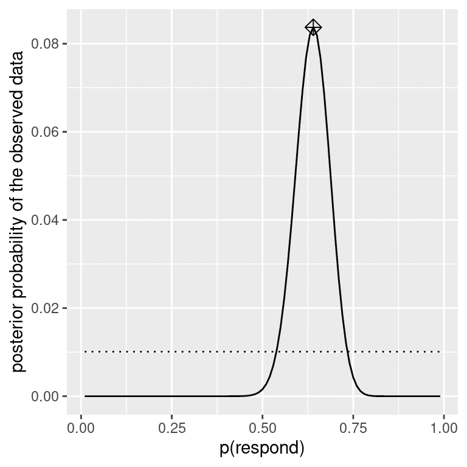

# 第十一章：贝叶斯统计

> 原文：[`statsthinking21.github.io/statsthinking21-core-site/bayesian-statistics.html`](https://statsthinking21.github.io/statsthinking21-core-site/bayesian-statistics.html)
> 
> 译者：[飞龙](https://github.com/wizardforcel)
> 
> 协议：[CC BY-NC-SA 4.0](https://creativecommons.org/licenses/by-nc-sa/4.0/)

在本章中，我们将采用与你在第 9 章中遇到的零假设检验框架相对立的统计建模和推断方法。这被称为“贝叶斯统计”，以纪念托马斯·贝叶斯牧师，你在第 6 章已经遇到过他的定理。在本章中，你将学习贝叶斯定理如何提供了一种理解数据的方式，解决了我们讨论的关于零假设检验的许多概念问题，同时也引入了一些新的挑战。

## 11.1 生成模型

假设你正在走在街上，你的一个朋友就在你身边走过，但没有打招呼。你可能会试图弄清楚为什么会发生这种情况 - 他们没有看到你吗？他们生你的气了吗？你突然被一个魔法隐形盾牌包裹了吗？贝叶斯统计背后的一个基本思想是，我们想根据数据本身推断数据是如何生成的细节。在这种情况下，你想要使用数据（即你的朋友没有打招呼的事实）来推断生成数据的过程（例如他们是否真的看到了你，他们对你的感觉如何等）。

生成模型背后的思想是一个*潜在*（未见）过程生成我们观察到的数据，通常在过程中有一定的随机性。当我们从一个群体中取样数据并从样本中估计参数时，我们实质上是在试图学习一个潜在变量（群体均值），通过取样产生观察到的数据（样本均值）。图 11.1 显示了这个想法的示意图。


图 11.1：生成模型的想法的示意图。

如果我们知道潜在变量的值，那么重建观察到的数据应该是很容易的。例如，假设我们抛一枚我们知道是公平的硬币，我们期望它 50%的时间会正面朝上。我们可以用二项分布描述硬币，其值为$P_{heads}=0.5$，然后我们可以从这样的分布中生成随机样本，以便看到观察到的数据应该是什么样子。然而，一般情况下我们处于相反的情况：我们不知道感兴趣的潜在变量的值，但我们有一些数据，我们希望用它来估计它。

## 11.2 贝叶斯定理和逆推推断

贝叶斯统计之所以得名，是因为它利用贝叶斯定理从数据中推断生成数据的潜在过程。假设我们想知道一枚硬币是否公平。为了测试这一点，我们抛了 10 次硬币，得到了 7 次正面。在这个测试之前，我们相当确定$P_{heads}=0.5$，但如果我们相信$P_{heads}=0.5$，那么在 10 次抛硬币中得到 7 次或更多次正面的条件概率（$P(n\ge7|p_{heads}=0.5)$）会让我们感到犹豫不决。我们已经知道如何使用二项分布计算这个条件概率。

得到的概率是 0.055。这是一个相当小的数字，但这个数字并没有真正回答我们所问的问题 —— 它告诉我们在给定某个特定的正面概率的情况下，出现 7 次或更多正面的可能性，而我们真正想知道的是这枚硬币的真实正面概率。这应该听起来很熟悉，因为这正是我们在零假设检验中遇到的情况，它告诉我们的是数据的可能性而不是假设的可能性。

记住，贝叶斯定理为我们提供了反转条件概率的工具：

$$ P(H|D) = \frac{P(D|H)*P(H)}{P(D)} $$

我们可以将这个定理看作有四个部分：

+   *先验*（$P(假设)$）：在观察到数据 D 之前我们对假设 H 的信念程度

+   *似然*（$P(数据|假设)$）：在假设 H 下观察到的数据 D 有多大可能性？

+   *边际似然*（$P(Data)$）：观察到的数据有多大可能性，结合所有可能的假设？

+   *后验*（$P(假设|数据)$）：在观察到数据 D 后我们对假设 H 的更新信念

在我们抛硬币的例子中：

+   *先验*（$P_{heads}$）：我们对抛硬币出现正面的可能性的信念程度，即$P_{heads}=0.5$

+   *似然*（$P(\text{10 次抛硬币中出现 7 次或更多正面}|P_{heads}=0.5)$）：如果$P_{heads}=0.5$，10 次抛硬币中出现 7 次或更多正面的可能性有多大？

+   *边际似然*（$P(\text{10 次抛硬币中出现 7 次或更多正面}$）：一般情况下，我们观察到 10 次抛硬币中出现 7 次正面的可能性有多大？

+   *后验*（$P_{heads}|\text{10 次抛硬币中出现 7 次或更多正面}$）：观察到的抛硬币结果后我们对$P_{heads}$的更新信念

在这里，我们看到频率派和贝叶斯统计之间的主要区别之一。频率派不相信有关假设概率的概念（即我们对假设的信念程度） —— 对他们来说，一个假设要么成立要么不成立。另一种说法是，对于频率派来说，假设是固定的，数据是随机的，这就是为什么频率派推断侧重于描述在假设下数据的概率（即 p 值）。另一方面，贝叶斯派则可以舒适地对数据和假设做出概率陈述。

## 11.3 进行贝叶斯估计

我们最终希望使用贝叶斯统计来对假设做出决策，但在这之前我们需要估计做出决策所需的参数。在这里，我们将介绍贝叶斯估计的过程。让我们再举一个筛查的例子：机场安检。如果你经常飞行，随机的爆炸物筛查结果呈阳性只是时间问题；我在 2001 年 9 月 11 日后不久就经历了这样的不幸经历，当时机场安检人员特别紧张。

安检人员想要知道的是一个人携带爆炸物的可能性，假设机器给出了阳性测试。让我们通过贝叶斯分析来计算这个值。

### 11.3.1 指定先验

要使用贝叶斯定理，我们首先需要指定假设的先验概率。在这种情况下，我们不知道真实数字，但我们可以假设它相当小。根据[FAA](https://www.faa.gov/air_traffic/by_the_numbers/media/Air_Traffic_by_the_Numbers_2018.pdf)的数据，2017 年美国有 971,595,898 名航空乘客。假设其中一名旅客携带了爆炸物 —— 这将给出一个先验概率为 971 百万分之一，非常小！安检人员在 9/11 袭击后的几个月内可能会有更强烈的先验概率，所以我们假设他们的主观信念是每百万名飞行者中有一人携带爆炸物。

### 11.3.2 收集一些数据

数据由爆炸物筛查测试的结果组成。假设安全人员将袋子通过他们的测试设备进行 3 次测试，并且在 3 次测试中有 3 次阳性读数。

### 11.3.3 计算可能性

我们想计算在有爆炸物存在的假设下数据的可能性。假设我们知道（来自机器制造商）测试的灵敏度为 0.99 - 也就是说，当设备存在时，它会在 99%的时间内检测到它。为了确定在有设备存在的假设下我们的数据的可能性，我们可以将每个测试视为伯努利试验（即具有真或假结果的试验），成功的概率为 0.99，我们可以使用二项分布来建模。

### 11.3.4 计算边际可能性

我们还需要知道数据的整体可能性 - 也就是说，在 3 次测试中找到 3 个阳性。计算边际可能性通常是贝叶斯分析中最困难的部分之一，但对于我们的例子来说很简单，因为我们可以利用我们在第[6.7]节中介绍的二元结果的贝叶斯定理的特定形式：

$$ P(E|T) = \frac{P(T|E)*P(E)}{P(T|E)*P(E) + P(T|\neg E)*P(\neg E)} $$

其中$E$指的是爆炸物的存在，$T$指的是阳性测试结果。

在这种情况下，边际可能性是数据在爆炸物存在或不存在的情况下的可能性的加权平均值，乘以爆炸物存在的概率（即先验）。在这种情况下，假设我们知道（来自制造商）测试的特异性为 0.99，因此当没有爆炸物时的阳性结果的可能性（$P(T|\neg E)$）为 0.01。

### 11.3.5 计算后验

现在我们已经有了计算爆炸物存在的后验概率所需的所有部分，这是在观察到 3 次测试中的 3 次阳性结果后。

这个结果告诉我们，在这些阳性测试中，爆炸物在袋子里的后验概率（0.492）略低于 50%，再次突出了测试罕见事件几乎总是容易产生大量假阳性的事实，即使特异性和灵敏度非常高。

贝叶斯分析的一个重要方面是它可以是顺序的。一旦我们有了一个分析的后验，它可以成为下一个分析的先验！

## 11.4 估计后验分布

在先前的例子中，只有两种可能的结果 - 爆炸物要么存在，要么不存在 - 我们想知道在给定数据的情况下哪种结果最有可能。然而，在其他情况下，我们想使用贝叶斯估计来估计参数的数值。假设我们想了解一种新药物对疼痛的有效性；为了测试这一点，我们可以向一组患者施用药物，然后询问他们在服药后疼痛是否有所改善。我们可以使用贝叶斯分析来估计使用这些数据药物对患者有效的比例。

### 11.4.1 指定先验

在这种情况下，我们没有关于药物有效性的先验信息，因此我们将使用*均匀分布*作为我们的先验，因为在均匀分布下所有值都是同等可能的。为了简化例子，我们只会查看 99 个可能有效性值的子集（从.01 到.99，步长为.01）。因此，每个可能的值都有 1/99 的先验概率。

### 11.4.2 收集一些数据

我们需要一些数据来估计药物的效果。假设我们向 100 个人施用药物，我们发现 64 人对药物有积极反应。

### 11.4.3 计算可能性

我们可以使用二项密度函数计算在任何特定效果参数值下的观察数据的似然性。在图 11.2 中，您可以看到在几种不同$P_{respond}$值下对响应者数量的似然曲线。从这个图中可以看出，我们的观察数据在$P_{respond}=0.7$的假设下相对更可能，在$P_{respond}=0.5$的假设下略不太可能，在$P_{respond}=0.3$的假设下相当不可能。贝叶斯推断的一个基本思想是，我们应该根据数据在这些值下的可能性来加强我们对感兴趣参数值的信念，同时平衡我们在看到数据之前对参数值的信念（我们的先验知识）。


图 11.2：在几种不同假设下每个可能的响应者数量的似然性（p(respond)=0.5（实线），0.7（虚线），0.3（虚线）。观察值显示在垂直线上

### 11.4.4 计算边际似然

除了在不同假设下数据的似然性，我们还需要知道数据的整体似然性，结合所有假设（即边际似然）。这种边际似然主要重要是因为它有助于确保后验值是真实概率。在这种情况下，我们使用一组离散可能的参数值使得计算边际似然变得容易，因为我们可以计算每个假设下每个参数值的似然性并将它们相加。

### 11.4.5 计算后验

我们现在拥有计算后验概率分布的所有部分所需的部分，这些部分涵盖了所有可能的$p_{respond}$值，如图 11.3 所示。



图 11.3：观察数据的后验概率分布以实线绘制，与均匀先验分布（虚线）相对。最大后验概率（MAP）值由菱形符号表示。

### 11.4.6 最大后验概率（MAP）估计

根据我们的数据，我们想要获得样本的$p_{respond}$估计值。一种方法是找到后验概率最高的$p_{respond}$值，我们称之为*最大后验概率*（MAP）估计。我们可以从 11.3 的数据中找到这个值——它是在分布顶部标记的值。请注意，结果（0.64）只是我们样本中响应者的比例——这是因为先验是均匀的，因此并没有影响我们的估计。

### 11.4.7 可信区间

通常，我们不仅想知道后验的单个估计值，还想知道一个区间，我们对后验落在其中有信心。我们之前在频率派推断的背景下讨论了置信区间的概念，您可能还记得置信区间的解释特别复杂：它是一个将包含参数值 95%的时间的区间。我们真正想要的是一个我们对真实参数落在其中有信心的区间，而贝叶斯统计可以给我们这样的区间，我们称之为*可信区间*。

这个可信区间的解释更接近我们希望从置信区间中得到的（但没有得到）：它告诉我们，有 95%的概率$p_{respond}$的值在这两个数值之间。重要的是，在这种情况下，它表明我们非常有信心$p_{respond} > 0.0$，这意味着药物似乎有积极的效果。

在某些情况下，可信区间可以根据已知分布*数值*计算，但更常见的是通过从后验分布中抽样来生成可信区间，然后计算样本的分位数。当我们没有简单的方法来数值表达后验分布时，这种方法特别有用，而在真实的贝叶斯数据分析中通常是这种情况。这样的一种方法（拒绝抽样）在本章末尾的附录中有更详细的解释。

### 11.4.8 不同先验的影响

在前面的例子中，我们使用了*平坦先验*，这意味着我们没有理由相信$p_{respond}$的任何特定值更可能或更不可能。然而，假设我们之前有一些先前的数据：在一项先前的研究中，研究人员测试了 20 人，发现其中有 10 人对治疗作出了积极反应。这将导致我们开始具有先验信念，即治疗对 50%的人有效。我们可以做与上面相同的计算，但使用我们先前研究的信息来指导我们的先验（参见图 11.4 的 A 面板）。

请注意，似然和边际似然没有改变 - 只有先验改变了。先验变化的效果是将后验拉近到新先验的集中点，即 0.5。

现在让我们看看如果我们带着更强烈的先验信念进行分析会发生什么。假设我们之前观察到 20 个人中有 10 个反应者，而先前的研究测试了 500 人，发现 250 个反应者。这原则上应该给我们一个更强的先验，正如我们在图 11.4 的 B 面板中看到的那样：先验更加集中在 0.5 附近，后验也更接近先验。总的想法是，贝叶斯推断结合了先验和似然的信息，权衡了每个的相对强度。

这个例子也突出了贝叶斯分析的顺序性质 - 一个分析的后验可以成为下一个分析的先验。

最后，重要的是要意识到，如果先验足够强大，它们可以完全压倒数据。假设你有一个绝对先验，即$p_{respond}$大于等于 0.8，这样你就将所有其他值的先验概率设为零。如果我们计算后验会发生什么呢？


图 11.4：A：先验对后验分布的影响。基于平坦先验的原始后验分布以蓝色绘制。基于 20 人中 10 名回答者的观察的先验以虚线黑色线绘制，使用此先验的后验以红色绘制。B：先验强度对后验分布的影响。蓝线显示使用基于 100 人中 50 个头的先验获得的后验。虚线黑线显示基于 500 次抛硬币中 250 个头的先验，红线显示基于该先验的后验。C：先验强度对后验分布的影响。蓝线显示使用绝对先验获得的后验，该先验表明 p（回答）为 0.8 或更高。先验以虚线黑线显示。

在图 11.4 的 C 面板中，我们看到后验中没有任何值的密度，其中先验被设为零 - 数据被绝对先验所压倒。

## 11.5 选择先验

贝叶斯统计中最具争议的方面是先验对推断结果的影响。什么是正确的先验？如果先验的选择决定了结果（即后验），你如何确信你的结果是可信的？这些是困难的问题，但我们不应该因为面对困难问题而退缩。正如我们之前讨论过的，贝叶斯分析给我们提供了可解释的结果（可信区间等）。这本身就应该激励我们认真思考这些问题，以便得出合理和可解释的结果。

有各种方法可以选择先验，这些方法（如上所述）可能会影响结果的推断。有时我们有一个非常具体的先验，就像我们预期硬币掷出正面的概率为 50%一样，但在许多情况下，我们没有这样强烈的起点。*无信息先验*试图尽可能少地影响结果的后验，就像我们在上面的均匀先验的例子中看到的那样。使用*弱信息先验*（或*默认先验*）也很常见，它们只会轻微地影响结果。例如，如果我们使用基于两次抛硬币中的一次正面的二项分布，先验将以 0.5 为中心，但相当平坦，只会轻微地影响后验。还可以使用基于科学文献或现有数据的先验，我们称之为*经验先验*。然而，总的来说，我们将坚持使用无信息/弱信息先验，因为它们最少地引起我们对结果的担忧。

## 11.6 贝叶斯假设检验

学会了如何进行贝叶斯估计后，我们现在转向使用贝叶斯方法进行假设检验。假设有两位政治家在他们对公众是否支持额外税收以支持国家公园的信念上存在差异。史密斯参议员认为只有 40%的人支持这项税收，而琼斯参议员认为有 60%的人支持。他们安排进行一项民意调查来测试这一点，询问了 1000 名随机选取的人是否支持这样的税收。结果是，在接受调查的样本中，有 490 人支持这项税收。基于这些数据，我们想知道：数据是否支持一位参议员的主张胜过另一位，以及胜过多少？我们可以使用一个称为[贝叶斯因子](https://bayesfactor.blogspot.com/2014/02/the-bayesfactor-package-this-blog-is.html)的概念来测试这一点，它通过比较每个假设对观察到的数据的预测能力来量化哪个假设更好。

### 11.6.1 贝叶斯因子

贝叶斯因子表征了数据在两种不同假设下的相对可能性。它的定义如下：

$$ BF = \frac{p(data|H_1)}{p(data|H_2)} $$

对于两个假设$H_1$和$H_2$。在我们的两位参议员的情况下，我们知道如何使用二项分布计算每个假设下数据的可能性；暂时假设每位参议员的先验概率相同（$P_{H_1} = P_{H_2} = 0.5$）。我们将参议员史密斯放在分子中，参议员琼斯放在分母中，这样大于一的值将反映对参议员史密斯更大的证据，小于一的值将反映对参议员琼斯更大的证据。得到的贝叶斯因子（3325.26）提供了关于数据支持两个假设的证据的度量 - 在这种情况下，它告诉我们数据支持参议员史密斯比支持参议员琼斯强大 3000 多倍。

### 11.6.2 统计假设的贝叶斯因子

在前面的例子中，我们对每位参议员都有具体的预测，我们可以使用二项分布来量化它们的可能性。此外，我们对两个假设的先验概率是相等的。然而，在实际数据分析中，我们通常必须处理关于参数的不确定性，这使得贝叶斯因子变得复杂，因为我们需要计算边际似然（即在所有可能的模型参数上的似然的综合平均，按其先验概率加权）。然而，作为交换，我们获得了量化支持零假设与备择假设相对证据量的能力。

假设我们是一名进行糖尿病治疗临床试验的医学研究人员，我们希望知道一种特定药物是否与安慰剂相比能够降低血糖。我们招募了一组志愿者，并将他们随机分配到药物组或安慰剂组，然后我们测量在药物或安慰剂使用期间每组的血红蛋白 A1C（血糖水平的标志）的变化。我们想知道的是：药物和安慰剂之间是否有差异？

首先，让我们生成一些数据并使用零假设检验进行分析（参见图 11.5）。然后让我们进行独立样本 t 检验，结果显示组之间存在显著差异：


图 11.5：箱线图显示药物组和安慰剂组的数据。

```r
## 
##  Welch Two Sample t-test
## 
## data:  hbchange by group
## t = 2, df = 32, p-value = 0.02
## alternative hypothesis: true difference in means between group 0 and group 1 is greater than 0
## 95 percent confidence interval:
##  0.11  Inf
## sample estimates:
## mean in group 0 mean in group 1 
##          -0.082          -0.650
```

这个检验告诉我们组之间存在显著差异，但它并没有量化证据支持零假设与备择假设的强度。为了衡量这一点，我们可以使用 R 中 BayesFactor 包的`ttestBF`函数计算贝叶斯因子：

```r
## Bayes factor analysis
## --------------
## [1] Alt., r=0.707 0<d<Inf    : 3.4  ±0%
## [2] Alt., r=0.707 !(0<d<Inf) : 0.12 ±0.01%
## 
## Against denominator:
##   Null, mu1-mu2 = 0 
## ---
## Bayes factor type: BFindepSample, JZS
```

我们特别关注大于零效应的贝叶斯因子，在报告中标有“[1]”的行中列出。这里的贝叶斯因子告诉我们，备择假设（即差异大于零）相对于点零假设（即均值差异恰好为零）在数据给定的情况下大约有 3 倍的可能性。因此，虽然效应是显著的，但它提供给我们支持备择假设的证据量相当弱。

#### 11.6.2.1 单侧检验

我们通常对特定点值的零假设（例如，平均差异= 0）进行测试的兴趣不如对方向性零假设（例如，差异小于或等于零）进行测试。我们还可以使用`ttestBF`分析的结果执行方向（或*单侧*）检验，因为它提供两个贝叶斯因子：一个是备择假设，即平均差异大于零，另一个是备择假设，即平均差异小于零。如果我们想评估正效应的相对证据，我们可以通过简单地将函数返回的两个贝叶斯因子相除来计算比较正效应与负效应的相对证据：

```r
## Bayes factor analysis
## --------------
## [1] Alt., r=0.707 0<d<Inf : 29 ±0.01%
## 
## Against denominator:
##   Alternative, r = 0.707106781186548, mu =/= 0 !(0<d<Inf) 
## ---
## Bayes factor type: BFindepSample, JZS
```

现在我们看到，正效应与负效应的贝叶斯因子大得多（几乎 30）。

#### 11.6.2.2 解释贝叶斯因子

我们如何知道贝叶斯因子为 2 或 20 是好还是坏？[Kass & Rafferty (1995)](https://www.andrew.cmu.edu/user/kk3n/simplicity/KassRaftery1995.pdf)提出了贝叶斯因子解释的一般指导方针：

| BF | 证据的强度 |
| --- | --- |
| 1 到 3 | 不值一提 |
| 3 到 20 | 正效应 |
| 20 到 150 | 强 |
| >150 | 非常强 |

基于此，即使统计结果显着，支持备择假设与点零假设相比的证据量也很弱，几乎不值一提，而对于方向性假设的证据相对较强。

### 11.6.3 评估零假设的证据

因为贝叶斯因子比较了两个假设的证据，所以它还允许我们评估是否有证据支持零假设，这是标准零假设检验无法做到的（因为它假设零假设为真）。这对于确定非显著结果是否真的提供了无效果的强有力证据，或者只是总体证据较弱非常有用。

## 11.7 学习目标

阅读完本章后，应该能够：

+   描述贝叶斯分析和零假设检验之间的主要区别

+   描述并执行贝叶斯分析的步骤

+   描述不同先验的影响以及选择先验的考虑因素

+   描述置信区间和贝叶斯可信区间之间的解释差异

## 11.8 建议阅读

+   《不会消失的理论：贝叶斯定理如何破译了密码，追踪俄罗斯潜艇，并在两个世纪的争议中胜出》，作者：沙龙·伯奇·麦格雷恩

+   《贝叶斯数据分析：R 的教程介绍》，作者：约翰·K·克鲁斯克

## 11.9 附录：

### 11.9.1 拒绝抽样

我们将使用一种称为[*拒绝抽样*](https://am207.github.io/2017/wiki/rejectionsampling.html)的简单算法从后验分布中生成样本。其思想是我们从均匀分布中选择 x（在本例中为$p_{respond}$）和 y（在本例中为$p_{respond}$的后验概率）的随机值。然后，我们只接受样本，如果$y < f(x)$ - 在本例中，如果随机选择的 y 值小于 y 的实际后验概率。图 11.6 显示了使用拒绝抽样的样本直方图示例，以及使用该方法获得的 95％可信区间（表[**??**](#tab:credInt)中的值）。

|  | x |
| :-- | --: |
| 2.5% | 0.54 |
| 97.5% | 0.73 |


图 11.6：拒绝抽样示例。黑线显示了 p(回答)所有可能值的密度；蓝线显示了分布的 2.5 和 97.5 百分位数，代表了对 p(回答)估计的 95%可信区间。
