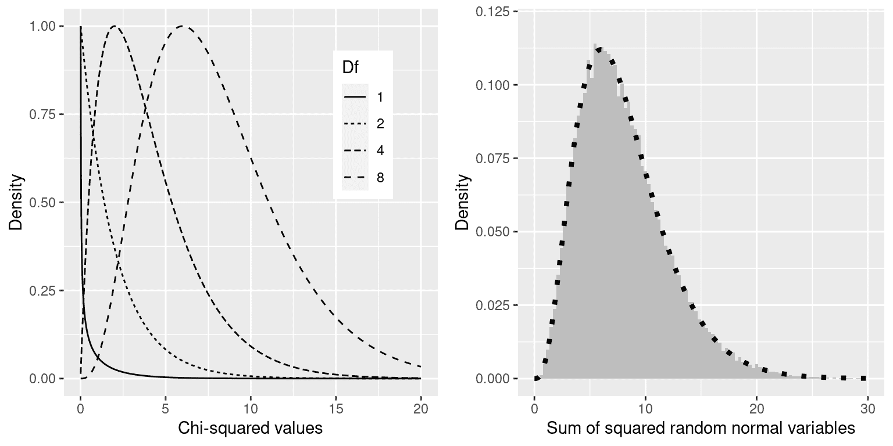

# 第十二章：建模分类关系

> 原文：[`statsthinking21.github.io/statsthinking21-core-site/modeling-categorical-relationships.html`](https://statsthinking21.github.io/statsthinking21-core-site/modeling-categorical-relationships.html)
> 
> 译者：[飞龙](https://github.com/wizardforcel)
> 
> 协议：[CC BY-NC-SA 4.0](https://creativecommons.org/licenses/by-nc-sa/4.0/)

到目前为止，我们已经讨论了统计建模和假设检验的一般概念，并将它们应用于一些简单的分析；现在我们将转向如何在我们的数据中建模特定类型的关系的问题。在本章中，我们将重点关注*分类*关系的建模，这意味着我们测量的变量之间的关系是定性的。这些数据通常用计数来表示；也就是说，对于变量的每个值（或多个变量的组合的值），有多少观察值取该值？例如，当我们统计我们班上每个专业的人数时，我们正在对数据进行分类建模。

## 12.1 示例：糖果颜色

假设我购买了一袋 100 颗糖果，标有 1/3 巧克力、1/3 甘露和 1/3 甘露的标签。当我数袋子里的糖果时，我们得到以下数字：30 颗巧克力，33 颗甘露和 37 颗甘露。因为我比甘露或甘露更喜欢巧克力，我觉得有点被欺骗，我想知道这是否只是一个偶然事件。为了回答这个问题，我需要知道：如果每种糖果的真实概率是平均比例的 1/3，那么计数出现这种情况的可能性是多少？

## 12.2 皮尔逊卡方检验

Pearson 卡方检验为我们提供了一种测试一组观察计数是否与定义零假设的特定期望值不同的方法：

$$ \chi^2 = \sum_i\frac{(observed_i - expected_i)^2}{expected_i} $$

在我们糖果的例子中，零假设是每种类型的糖果的比例相等。要计算卡方统计量，我们首先需要在零假设下得出我们的期望计数：因为零假设是它们都相同，那么这只是在三个类别之间分割的总计数（如表 12.1 所示）。然后我们取每个计数与其在零假设下的期望值之间的差异，对它们进行平方，除以零假设，然后将它们相加以获得卡方统计量。

表 12.1：糖果数据中的观察计数、零假设下的期望值和平方差

| 糖果类型 | 计数 | 零假设 | 平方差 |
| --- | --- | --- | --- |
| 巧克力 | 30 | 33 | 11.11 |
| 甘露 | 33 | 33 | 0.11 |
| 口香糖 | 37 | 33 | 13.44 |

这个分析的卡方统计量为 0.74，单独来看是无法解释的，因为它取决于被加在一起的不同值的数量。然而，我们可以利用卡方统计量在零假设下分布的事实，这被称为*卡方*分布。该分布被定义为一组标准正态随机变量的平方和；它的自由度数量等于被加在一起的变量的数量。分布的形状取决于自由度的数量。图 12.1 的左面板显示了几个不同自由度的分布示例。



图 12.1：左：不同自由度下卡方分布的示例。右：随机正态变量平方和的模拟。直方图基于 50,000 组 8 个随机正态变量的平方和；虚线显示了具有 8 个自由度的理论卡方分布的值。

让我们通过模拟验证卡方分布是否准确描述了一组标准正态随机变量的平方和，为此，我们反复抽取 8 个随机数，并在平方每个值后将每组相加。图 12.1 的右面板显示，理论分布与重复添加一组随机正态变量的平方的模拟结果非常接近。

对于糖果的例子，我们可以计算在所有糖果上频率相等的零假设下观察到的卡方值 0.74 的可能性。我们使用自由度等于 k - 1 的卡方分布（其中 k = 类别数），因为当我们计算均值以生成期望值时，我们失去了一个自由度。得到的 p 值（P(Chi-squared) > 0.74 = 0.691）显示，根据糖果袋上印刷的比例，观察到的糖果数量并不特别令人惊讶，我们不会拒绝等比例的零假设。

## 12.3 列联表和双向检验

我们经常使用卡方检验的另一种方式是询问两个分类变量是否彼此相关。作为更现实的例子，让我们来看看一个问题，即当警察拦下一名司机时，黑人司机是否比白人司机更有可能被搜查。斯坦福开放警务项目([`openpolicing.stanford.edu/`](https://openpolicing.stanford.edu/))对此进行了研究，并提供了我们可以用来分析这个问题的数据。我们将使用康涅狄格州的数据，因为它们相对较小，因此更容易分析。

用*列联表*来表示分类分析数据的标准方法，它展示了每个变量可能组合的观察数量或比例。下面的表 12.2 显示了警察搜查数据的列联表。使用比例而不是原始数字来查看列联表也是有用的，因为它们在视觉上更容易比较，因此我们在这里包括了绝对和相对数字。

表 12.2：警察搜查数据的列联表

| 被搜查 | 黑 | 白 | 黑（相关） | 白（相关） |
| --- | --- | --- | --- | --- |
| FALSE | 36244 | 239241 | 0.13 | 0.86 |
| TRUE | 1219 | 3108 | 0.00 | 0.01 |

皮尔逊卡方检验允许我们测试观察频率是否与期望频率不同，因此我们需要确定如果搜查和种族无关，即我们可以定义为*独立*，则每个单元格中我们期望的频率是什么。请记住，从概率章节中可以知道，如果 X 和 Y 是独立的，那么：

$$ P(X \cap Y) = P(X) * P(Y) $$ 

也就是说，在独立性的零假设下，联合概率简单地是每个单独变量的*边际*概率的乘积。边际概率只是每个事件发生的概率，而不考虑其他事件。我们可以计算这些边际概率，然后将它们相乘以得到独立性下的期望比例。

|  | 黑色 | 白色 |  |
| --- | --- | --- | --- |
| 没被搜查 | `P(NS)*P(B)` | `P(NS)*P(W)` | `P(NS)` |
| 被搜查 | `P(S)*P(B)` | `P(S)*P(W)` | `P(S)` |
|  | `P(B)` | `P(W)` |  |

然后我们计算卡方统计量，结果为 828.3。为了计算 p 值，我们需要将其与零假设下的卡方分布进行比较，以确定我们的卡方值与零假设下的预期相比有多极端。这个分布的自由度是$df = (nRows - 1) * (nColumns - 1)$ - 因此，对于像这里的 2X2 表，$df = (2-1)*(2-1)=1$。直觉在于计算期望频率需要我们使用三个值：观察总数和两个变量的边际概率。因此，一旦这些值被计算出来，就只有一个数字可以自由变化，因此只有一个自由度。鉴于此，我们可以计算卡方统计量的 p 值，这个 p 值接近于零：$3.79 \times 10^{-182}$。这表明如果种族和警察搜查真的没有关系，观察到的数据将是非常不可能的，因此我们应该拒绝独立性的零假设。

我们也可以使用我们的统计软件轻松进行这个测试。

```r
## 
##  Pearson's Chi-squared test
## 
## data:  summaryDf2wayTable and 1
## X-squared = 828, df = 1, p-value <2e-16
```

## 12.4 标准化残差

当我们在卡方检验中发现显著效应时，这告诉我们数据在零假设下不太可能发生，但它并不告诉我们数据有何不同。为了更深入地了解数据与零假设下的预期有何不同，我们可以检查模型的残差，这反映了数据（即观察频率）与模型（即期望频率）在每个单元格中的偏差。与查看原始残差（这将仅根据数据中的观察次数而变化）不同，更常见的是查看*标准化残差*（有时称为*皮尔逊残差*），计算公式如下：

$$ 标准化残差 _{ij} = \frac{观察 _{ij} - 期望 _{ij}}{\sqrt{期望 _{ij}}} $$

其中$i$和$j$分别是行和列的索引。

表 12.3 显示了警察停车数据的标准化残差。这些标准化残差可以解释为 Z 分数 - 在这种情况下，我们看到黑人被搜查的次数远远高于独立性预期，而白人被搜查的次数远远低于预期。这为我们提供了解释显著卡方结果所需的背景。

表 12.3：警察停车数据的标准化残差总结

| 搜查 | 驾驶员种族 | 标准化残差 |
| --- | --- | --- |
| FALSE | 黑人 | -3.3 |
| TRUE | 黑人 | 26.6 |
| FALSE | 白人 | 1.3 |
| TRUE | 白人 | -10.4 |

## 12.5 赔率比

我们还可以使用我们之前介绍的赔率比来表示列联表中不同结果的相对可能性，以更好地理解效应的大小。首先，我们表示每个种族被停车的赔率，然后计算它们的比率：

$$ 赔率 _{黑人被搜查} = \frac{N_{黑人被搜查}}{N_{黑人未被搜查}} = \frac{1219}{36244} = 0.034 $$

$$ 赔率 _{白人被搜查} = \frac{N_{白人被搜查}}{N_{白人未被搜查}} = \frac{3108}{239241} = 0.013 $$

$$ 赔率比 = \frac{赔率 _{黑人被搜查}}{赔率 _{白人被搜查}} = 2.59 $$

赔率比显示，根据这个数据集，黑人被搜查的赔率是白人的 2.59 倍。

## 12.6 贝叶斯因子

我们在之前关于贝叶斯统计的章节中讨论了贝叶斯因子 - 你可能还记得它代表了数据在两个假设下的可能性比：

$$ K = \frac{P(data|H_A)}{P(data|H_0)} = \frac{P(H_A|data)*P(H_A)}{P(H_0|data)*P(H_0)} $$ 

我们可以使用我们的统计软件计算警察搜查数据的贝叶斯因子：

```r
## Bayes factor analysis
## --------------
## [1] Non-indep. (a=1) : 1.8e+142 ±0%
## 
## Against denominator:
##   Null, independence, a = 1 
## ---
## Bayes factor type: BFcontingencyTable, independent multinomial
```

这表明在这个数据集中，关于驾驶员种族和警察搜查之间关系的证据非常强大——$1.8 * 10^{142}$接近无穷大，这在统计学中是我们能想象到的最接近无穷大的了。

## 12.7 超过 2X2 表的分类分析

分类分析也可以应用于列联表，其中每个变量有两个以上的类别。

例如，让我们看看 NHANES 数据，并比较变量*Depressed*，它表示“参与者感到沮丧、抑郁或绝望的天数”。这个变量编码为`None`、`Several`或`Most`。让我们测试一下这个变量是否与*SleepTrouble*变量相关，后者表示个体是否向医生报告了睡眠问题。

12.4 表：NHANES 数据集中抑郁和睡眠问题之间的关系

| 抑郁 | 无睡眠问题 | 有睡眠问题 |
| --- | --- | --- |
| None | 2614 | 676 |
| Several | 418 | 249 |
| Most | 138 | 145 |

仅仅通过观察这些数据，我们就可以得知这两个变量之间可能存在关系；值得注意的是，尽管有睡眠问题的人数远少于没有睡眠问题的人数，但对于报告大部分时间感到抑郁的人来说，有睡眠问题的人数大于没有睡眠问题的人数。我们可以直接使用卡方检验来量化这一点：

```r
## 
##  Pearson's Chi-squared test
## 
## data:  depressedSleepTroubleTable
## X-squared = 191, df = 2, p-value <2e-16
```

这个检验表明抑郁和睡眠问题之间存在着强烈的关系。我们还可以计算贝叶斯因子来量化支持备择假设的证据的强度：

```r
## Bayes factor analysis
## --------------
## [1] Non-indep. (a=1) : 1.8e+35 ±0%
## 
## Against denominator:
##   Null, independence, a = 1 
## ---
## Bayes factor type: BFcontingencyTable, joint multinomial
```

在这里，我们看到贝叶斯因子非常大（$1.8 * 10^{35}$），表明抑郁和睡眠问题之间的关系证据非常强大。

## 12.8 小心辛普森悖论

上面呈现的列联表代表了大量观察结果的总结，但总结有时可能会产生误导。让我们以棒球为例。下表显示了 1995-1997 年间 Derek Jeter 和 David Justice 的击球数据（安打/打数和击球平均率）：

| 运动员 | 1995 |  | 1996 |  | 1997 |  | 合并后 |  |
| --- | --- | --- | --- | --- | --- | --- | --- | --- |
| Derek Jeter | 12/48 | .250 | 183/582 | .314 | 190/654 | .291 | 385/1284 | **.300** |
| David Justice | 104/411 | **.253** | 45/140 | **.321** | 163/495 | **.329** | 312/1046 | .298 |

如果你仔细观察，你会发现有些奇怪的事情发生了：在每个单独的年份里，贾斯蒂斯的击球平均率都高于杰特，但当我们将所有三年的数据合并时，杰特的平均率实际上高于贾斯蒂斯的！这是辛普森悖论的一个例子，即在合并数据集中存在的模式可能在数据子集中不存在。这是因为在不同的子集中可能有另一个变量在变化——在这种情况下，打数在不同年份中变化，贾斯蒂斯在 1995 年击球次数更多（当时击球平均率较低）。我们称之为*潜在变量*，在检验分类数据时，始终要注意这些变量是非常重要的。

## 12.9 学习目标

+   描述分类数据的列联表概念。

+   描述卡方检验的关联概念，并为给定的列联表计算它。

+   描述辛普森悖论及其对分类数据分析的重要性。

## 12.10 额外阅读

+   [心理科学中的辛普森悖论：实用指南](https://www.frontiersin.org/articles/10.3389/fpsyg.2013.00513/full)
