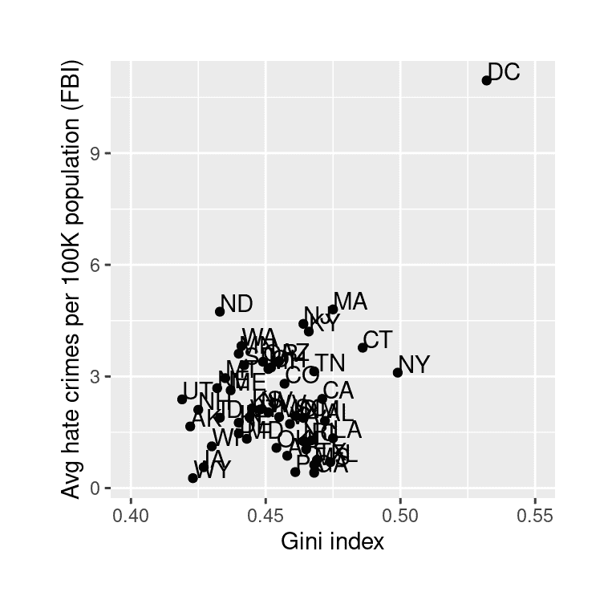
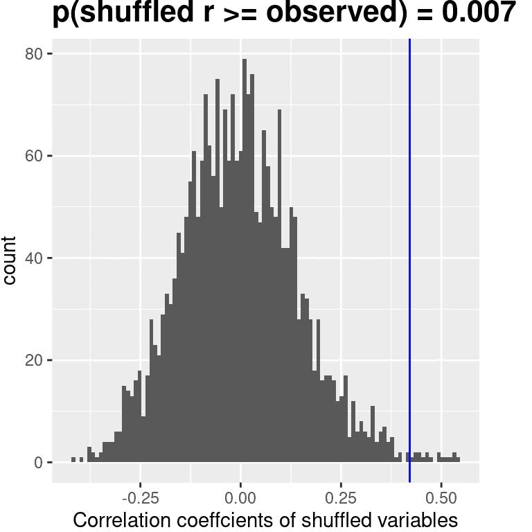
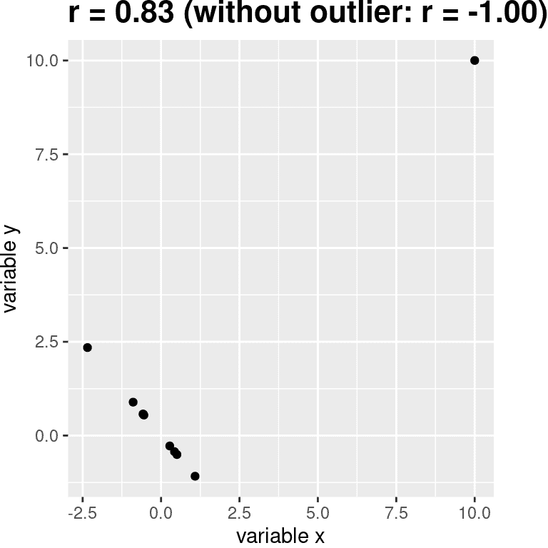
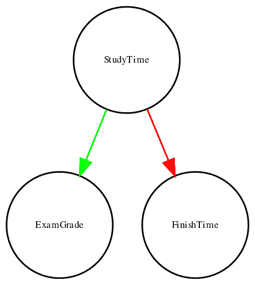
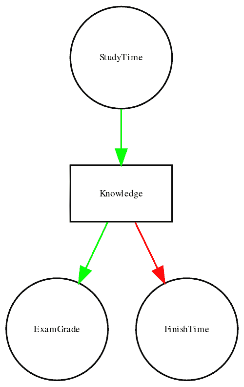
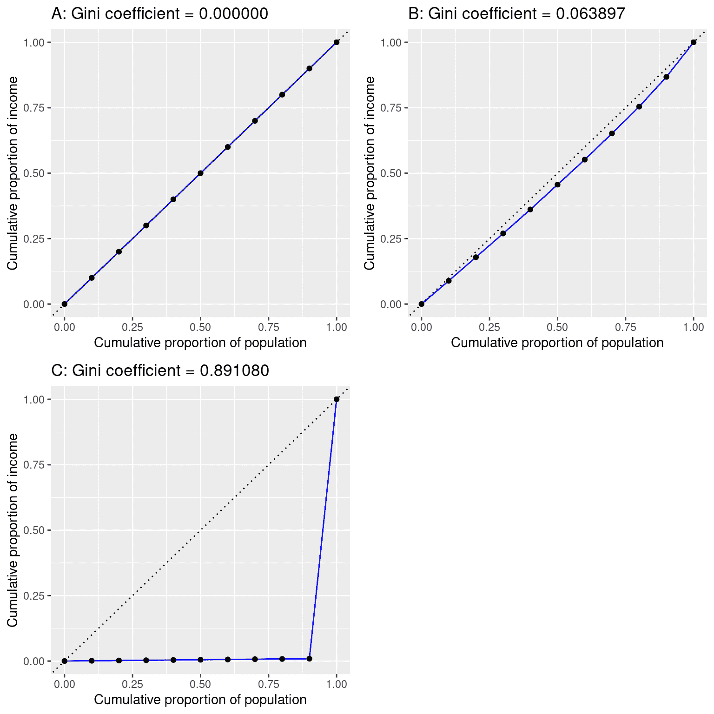

# 第十三章：建模连续关系

> 原文：[`statsthinking21.github.io/statsthinking21-core-site/modeling-continuous-relationships.html`](https://statsthinking21.github.io/statsthinking21-core-site/modeling-continuous-relationships.html)
> 
> 译者：[飞龙](https://github.com/wizardforcel)
> 
> 协议：[CC BY-NC-SA 4.0](https://creativecommons.org/licenses/by-nc-sa/4.0/)

大多数人都熟悉*相关性*的概念，在本章中，我们将对这个常用且常被误解的概念提供更正式的理解。

## 13.1 例子：仇恨犯罪和收入不平等

2017 年，网站 Fivethirtyeight.com 发表了一篇名为[*Higher Rates Of Hate Crimes Are Tied To Income Inequality*](https://fivethirtyeight.com/features/higher-rates-of-hate-crimes-are-tied-to-income-inequality/)的故事，讨论了 2016 年总统选举后仇恨犯罪的流行程度与收入不平等之间的关系。该故事报道了来自 FBI 和南方贫困法律中心的仇恨犯罪数据的分析，根据这些数据，他们报道：

> “我们发现收入不平等是美国各地人口调整后的仇恨犯罪和仇恨事件的最重要决定因素”。

这项分析的数据可作为 R 统计软件的`fivethirtyeight`包的一部分获得，这使我们可以轻松访问它们。故事中报告的分析侧重于收入不平等（由一种称为*基尼指数*的数量定义——有关更多细节，请参见附录）与每个州仇恨犯罪的流行程度之间的关系。

## 13.2 收入不平等与仇恨犯罪有关吗？



图 13.1：仇恨犯罪率与基尼指数的图表。

收入不平等与仇恨犯罪率之间的关系显示在图 13.1 中。从数据来看，似乎这两个变量之间可能存在正相关关系。我们如何量化这种关系呢？

## 13.3 协方差和相关性

量化两个变量之间关系的一种方法是*协方差*。记住，单个变量的方差是每个数据点与均值之间的平方差的平均值：

$$ s^2 = \frac{\sum_{i=1}^n (x_i - \bar{x})^2}{N - 1} $$

这告诉我们每个观察值平均而言与均值的距离是多少的平方单位。协方差告诉我们观察中两个不同变量的偏差之间是否存在关系。它的定义是：

$$ covariance = \frac{\sum_{i=1}^n (x_i - \bar{x})(y_i - \bar{y})}{N - 1} $$

当个体数据点以相似的方式偏离各自的均值时，这个值将远离零；如果它们以相同的方向偏离，协方差是正的，而如果它们以相反的方向偏离，协方差是负的。让我们先看一个玩具示例。数据如表 13.1 所示，以及它们与均值的个体偏差和它们的交叉乘积。

表 13.1：协方差玩具示例的数据

| x | y | y_dev | x_dev | 交叉乘积 |
| --- | --- | --- | --- | --- |
| 3 | 5 | -3.6 | -4.6 | 16.56 |
| 5 | 4 | -4.6 | -2.6 | 11.96 |
| 8 | 7 | -1.6 | 0.4 | -0.64 |
| 10 | 10 | 1.4 | 2.4 | 3.36 |
| 12 | 17 | 8.4 | 4.4 | 36.96 |

协方差简单地是交叉乘积的平均值，在这种情况下是 17.05。我们通常不使用协方差来描述变量之间的关系，因为它随着数据中方差的整体水平而变化。相反，我们通常会使用*相关系数*（通常在统计学家卡尔·皮尔逊之后称为*皮尔逊相关系数*）。相关性是通过将协方差按两个变量的标准差进行缩放来计算的。

$$ r = \frac{covariance}{s_xs_y} = \frac{\sum_{i=1}^n (x_i - \bar{x})(y_i - \bar{y})}{(N - 1)s_x s_y} $$

在这种情况下，该值为 0.89。相关系数很有用，因为它在数据的性质不同的情况下都在-1 和 1 之间变化 - 实际上，我们在讨论效应大小时已经讨论过相关系数。正如我们在上一章中看到的，相关系数为 1 表示完美的线性关系，相关系数为-1 表示完美的负相关关系，相关系数为零表示没有线性关系。

### 13.3.1 相关性的假设检验

仇恨犯罪和收入不平等之间的相关值为 0.42，似乎表明两者之间有相当强的关系，但我们也可以想象即使没有关系，这种情况也可能发生。我们可以使用一个简单的方程来测试相关性是否为零，这个方程可以将相关值转换为*t*统计量：

$$ \textit{t}_r = \frac{r\sqrt{N-2}}{\sqrt{1-r^2}} $$

在零假设$H_0:r=0$下，这个统计量服从自由度为$N - 2$的 t 分布。我们可以使用我们的统计软件来计算这个值：

```r
## 
##  Pearson's product-moment correlation
## 
## data:  hateCrimes$avg_hatecrimes_per_100k_fbi and hateCrimes$gini_index
## t = 3, df = 48, p-value = 0.002
## alternative hypothesis: true correlation is not equal to 0
## 95 percent confidence interval:
##  0.16 0.63
## sample estimates:
##  cor 
## 0.42
```

这个检验表明在零假设下，出现这么极端或更极端的 r 值的可能性是相当低的，所以我们会拒绝$r=0$的零假设。请注意，这个检验假设两个变量都是正态分布的。

我们也可以通过随机化来测试这一点，即我们反复洗牌其中一个变量的值并计算相关性，然后将我们观察到的相关值与这个零分布进行比较，以确定在零假设下我们观察到的值有多大可能性。结果显示在图 13.2 中。使用随机化计算的 p 值与 t 检验给出的答案相当相似。



图 13.2: 在零假设下相关值的直方图，通过洗牌值获得。观察值由蓝线表示。

我们也可以使用贝叶斯推断来估计相关性；更多信息请参见附录。

### 13.3.2 鲁棒相关性

你可能已经注意到在图 13.1 中有一些奇怪的地方 - 其中一个数据点（哥伦比亚特区的数据点）似乎与其他数据点相当分离。我们称之为*离群值*，标准相关系数对离群值非常敏感。例如，在图 13.3 中，我们可以看到一个离群数据点会导致一个非常高的正相关值，即使其他数据点之间的实际关系是完全负相关的。



图 13.3: 离群值对相关性的影响的模拟示例。没有离群值，其余数据点具有完美的负相关关系，但单个离群值将相关值改变为高度正相关。

解决异常值的一种方法是对数据进行排序后计算秩相关性，而不是对数据本身进行计算；这被称为*Spearman 相关性*。在图 13.3 的示例中，皮尔逊相关性为 0.83，而 Spearman 相关性为-0.45，显示秩相关性减少了异常值的影响，并反映了大多数数据点之间的负相关关系。

我们也可以对仇恨犯罪数据进行秩相关性计算：

```r
## 
##  Spearman's rank correlation rho
## 
## data:  hateCrimes$avg_hatecrimes_per_100k_fbi and hateCrimes$gini_index
## S = 20146, p-value = 0.8
## alternative hypothesis: true rho is not equal to 0
## sample estimates:
##   rho 
## 0.033
```

现在我们看到相关性不再显著（实际上非常接近零），这表明 FiveThirtyEight 博客文章的说法可能是错误的，因为异常值的影响。

## 13.4 相关性和因果关系

当我们说一件事*导致*另一件事时，我们是什么意思？哲学上长期存在关于因果关系含义的讨论，但在统计学中，我们通常认为因果关系的一种方式是通过实验控制来思考。也就是说，如果我们认为因素 X 导致因素 Y，那么操纵 X 的值也应该改变 Y 的值。

在医学上，有一套被称为[*柯赫氏假说*](https://en.wikipedia.org/wiki/Koch%27s_postulates)的观念，它们历来被用来确定特定生物是否导致疾病。基本思想是，该生物应该存在于患有疾病的人体内，而在没有疾病的人体内不存在——因此，消除该生物的治疗也应该消除疾病。此外，感染该生物应该导致患者患上疾病。马歇尔博士的工作中就有一个例子，他假设胃溃疡是由一种细菌（*幽门螺杆菌*）引起的。为了证明这一点，他用这种细菌感染了自己，不久之后他的胃就严重发炎了。然后他用抗生素治疗自己，他的胃很快就恢复了。后来他因这项工作获得了诺贝尔医学奖。

通常我们想要测试因果假设，但实际上我们无法进行实验，要么是因为不可能（“人类碳排放与地球气候之间的关系是什么？”），要么是不道德的（“严重虐待对儿童大脑发育的影响是什么？”）。然而，我们仍然可以收集可能与这些问题相关的数据。例如，我们可以潜在地收集受虐待儿童和未受虐待儿童的数据，然后问他们的大脑发育是否不同。

假设我们进行了这样的分析，并发现受虐待的儿童的大脑发育不如未受虐待的儿童。这是否证明虐待*导致*大脑发育不良？不。每当我们观察到两个变量之间的统计关联时，其中一个变量导致另一个变量是完全可能的。但也有可能两个变量都受到第三个变量的影响；在这个例子中，可能是儿童虐待与家庭压力相关，家庭压力也可能通过较少的智力参与、食物压力或其他可能的途径导致大脑发育不良。关键是，两个变量之间的相关性通常告诉我们某件事*可能*导致另一件事，但它并没有告诉我们是什么导致了什么。

### 13.4.1 因果图

描述变量之间因果关系的一种有用方法是通过*因果图*，它将变量显示为圆圈，变量之间的因果关系显示为箭头。例如，图 13.4 显示了学习时间和我们认为应受其影响的两个变量之间的因果关系：考试成绩和考试完成时间。

然而，实际上，完成时间和成绩的影响并不是直接由学习时间决定的，而是由学生通过学习获得的知识量决定的。我们通常会说知识是一个*潜在*变量 - 也就是说，我们无法直接测量它，但我们可以通过我们可以测量的变量（比如成绩和完成时间）来看到它的反映。图 13.5 展示了这一点。



图 13.4：一个图表显示了三个变量之间的因果关系：学习时间、考试成绩和考试完成时间。绿色箭头代表正相关关系（即更多的学习时间导致考试成绩提高），红色箭头代表负相关关系（即更多的学习时间导致考试完成时间更快）。

图 13.5：一个图表显示了与上文相同的因果关系，但现在还显示了潜在变量（知识）使用一个方框来表示。

在这里，我们会说知识*中介*了学习时间和成绩/完成时间之间的关系。这意味着如果我们能够保持知识恒定（例如，通过给药物导致立即遗忘），那么学习时间就不应该再对成绩和完成时间产生影响了。

请注意，如果我们只是测量考试成绩和完成时间，我们通常会看到它们之间存在负相关关系，因为通常情况下，完成考试最快的人得到的成绩最高。然而，如果我们将这种相关性解释为因果关系，这将告诉我们为了获得更好的成绩，我们实际上应该更快地完成考试！这个例子展示了从非实验数据中推断因果关系有多么棘手。

统计学和机器学习领域有一个非常活跃的研究社区，目前正在研究如何从非实验数据中推断因果关系的问题。然而，这些方法通常需要做出强烈的假设，并且必须谨慎使用。

## 13.5 学习目标

阅读完本章后，您应该能够：

+   描述相关系数的概念及其解释

+   计算两个连续变量之间的相关性

+   描述异常数据点的影响以及如何处理它们。

+   描述可能导致观察到的相关性的潜在因果影响。

## 13.6 建议阅读

+   Judea Pearl 的《为什么》（http://bayes.cs.ucla.edu/WHY/）- 一个关于因果推断背后思想的优秀介绍。

## 13.7 附录：

### 13.7.1 量化不平等：基尼系数

在我们看报道中的分析之前，首先了解基尼系数如何用来量化不平等是很有用的。基尼系数通常是用收入和收入低于或等于该水平的人口比例之间的关系来定义的，称为*洛伦兹曲线*。然而，另一种更直观的思考方式是：它是收入之间的相对平均绝对差异，除以二（来自[`en.wikipedia.org/wiki/Gini_coefficient`](https://en.wikipedia.org/wiki/Gini_coefficient)）：

$$ G = \frac{\displaystyle{\sum_{i=1}^n \sum_{j=1}^n \left| x_i - x_j \right|}}{\displaystyle{2n\sum_{i=1}^n x_i}} $$



图 13.6：A）完全平等，B）正态分布收入和 C）高度不平等（除了一个非常富有的个人外，收入相等）的洛伦兹曲线。

图 13.6 显示了几种不同收入分布的洛伦兹曲线。左上面板（A）显示了一个有 10 个人的例子，每个人的收入完全相同。点之间的间隔长度相等，表明每个人在总人口收入中赚取了相同的份额。右上面板（B）显示了一个收入正态分布的例子。左下面板显示了一个高度不平等的例子；每个人的收入都相等（40,000 美元），除了一个人，他的收入是 40,000,000 美元。根据美国人口普查，2010 年美国的基尼系数为 0.469，大致处于我们正态分布和最不平等的例子之间。

### 13.7.2 贝叶斯相关分析

我们还可以使用贝叶斯分析来分析 FiveThirtyEight 数据，这有两个优点。首先，它为我们提供了后验概率 - 在这种情况下，相关值超过零的概率。其次，贝叶斯估计结合了观察到的证据和*先验*，这使得*正则化*相关估计，有效地将其拉向零。在这里，我们可以使用 R 中的*BayesFactor*包来计算它。

```r
## Bayes factor analysis
## --------------
## [1] Alt., r=0.333 : 21 ±0%
## 
## Against denominator:
##   Null, rho = 0 
## ---
## Bayes factor type: BFcorrelation, Jeffreys-beta*
```

```r
## Summary of Posterior Distribution
## 
## Parameter | Median |       95% CI |     pd |          ROPE | % in ROPE |    BF |         Prior
## ----------------------------------------------------------------------------------------------
## rho       |   0.38 | [0.13, 0.58] | 99.88% | [-0.05, 0.05] |        0% | 20.85 | Beta (3 +- 3)
```

请注意，使用贝叶斯方法估计的相关性（0.38）略小于使用标准相关系数估计的相关性（0.42），这是因为估计是基于证据和先验的组合，有效地将估计值收缩到零。然而，请注意，贝叶斯分析对异常值不具有鲁棒性，它仍然表明有相当强的证据表明相关性大于零（贝叶斯因子超过 20）。
