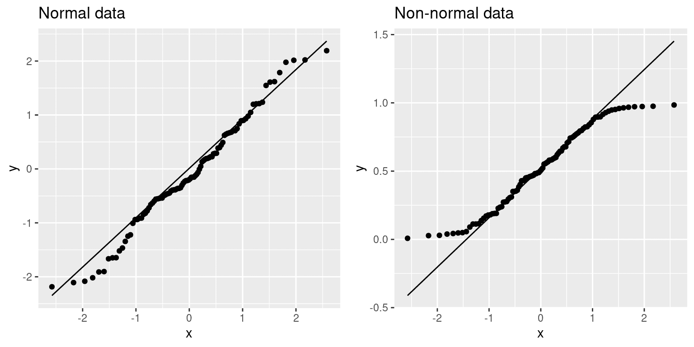

# 第十四章：通用线性模型

> 原文：[`statsthinking21.github.io/statsthinking21-core-site/the-general-linear-model.html`](https://statsthinking21.github.io/statsthinking21-core-site/the-general-linear-model.html)
> 
> 译者：[飞龙](https://github.com/wizardforcel)
> 
> 协议：[CC BY-NC-SA 4.0](https://creativecommons.org/licenses/by-nc-sa/4.0/)

请记住，在本书的早期，我们描述了统计学的基本模型：

$$ 数据 = 模型 + 误差 $$，我们的一般目标是找到最小化误差的模型，同时满足其他一些约束（例如保持模型相对简单，以便我们可以推广到我们的特定数据集之外）。在本章中，我们将专注于这种方法的特定实现，即*通用线性模型*（或 GLM）。在早期关于将模型拟合到数据的章节中，您已经看到了通用线性模型，我们对 NHANES 数据集中的身高建模为年龄的函数；在这里，我们将更一般地介绍 GLM 的概念及其许多用途。几乎统计学中使用的每个模型都可以用通用线性模型或其扩展来表述。

在讨论通用线性模型之前，让我们首先定义两个对我们讨论重要的术语：

+   *因变量*：这是我们的模型旨在解释的结果变量（通常称为*Y*）

+   *自变量*：这是我们希望用来解释因变量的变量（通常称为*X*）。

可能会有多个自变量，但在本课程中，我们将主要关注分析中只有一个因变量的情况。

通用线性模型是一个模型，其中因变量的模型由独立变量的*线性组合*组成，每个独立变量都乘以一个权重（通常称为希腊字母 beta - $\beta$），这决定了该独立变量对模型预测的相对贡献。


图 14.1：学习时间和成绩之间的关系

举个例子，让我们生成一些模拟数据，来描述学习时间和考试成绩之间的关系（见图 14.1）。根据这些数据，我们可能想要进行统计学的三个基本活动：

+   *描述*：成绩和学习时间之间的关系有多强？

+   *决定*：成绩和学习时间之间是否存在统计学上显著的关系？

+   *预测*：给定特定的学习时间，我们期望得到什么成绩？

在上一章中，我们学习了如何使用相关系数描述两个变量之间的关系。让我们使用统计软件来计算这些数据的相关关系，并测试相关性是否显著不同于零：

```r
## 
##  Pearson's product-moment correlation
## 
## data:  df$grade and df$studyTime
## t = 2, df = 6, p-value = 0.09
## alternative hypothesis: true correlation is not equal to 0
## 95 percent confidence interval:
##  -0.13  0.93
## sample estimates:
##  cor 
## 0.63
```

相关性非常高，但请注意，估计周围的置信区间非常宽，几乎涵盖了从零到一的整个范围，这在一定程度上是由于样本量较小造成的。

## 14.1 线性回归

我们可以使用通用线性模型来描述两个变量之间的关系，并决定该关系是否具有统计学意义；此外，该模型还允许我们根据自变量的新值来预测因变量的值。最重要的是，通用线性模型将允许我们构建包含多个自变量的模型，而相关系数只能描述两个单独变量之间的关系。

我们用于此的 GLM 的具体版本被称为*线性回归*。 *回归*一词是由弗朗西斯·高尔顿创造的，他注意到当他比较父母和他们的孩子在某些特征上（如身高）时，极端父母的孩子（即非常高或非常矮的父母）通常比他们的父母更接近平均值。这是一个非常重要的观点，我们将在下面回到这一点。

线性回归模型的最简单版本（具有单个自变量）可以表示如下：

$$ y = x * \beta_x + \beta_0 + \epsilon $$ $\beta_x$值告诉我们，我们期望 y 在给定 x 变化一个单位时会发生多大变化。截距$\beta_0$是一个整体偏移量，告诉我们当$x=0$时我们期望 y 有什么值；您可能还记得我们早期建模讨论中提到的，即使$x$从未真正达到零，这对于模拟数据的整体幅度也很重要。误差项$\epsilon$指的是模型拟合后剩下的东西；我们经常将这些称为模型的*残差*。如果我们想知道在估计了$\beta$值之后如何预测 y（我们称之为$\hat{y}$），那么我们可以去掉误差项：

$$ \hat{y} = x * \hat{\beta_x} + \hat{\beta_0} $$

请注意，这只是一条线的方程，其中$\hat{\beta_x}$是我们对斜率的估计，$\hat{\beta_0}$是截距。图 14.2 显示了将此模型应用于研究时间数据的示例。


图 14.2：研究时间数据的线性回归解决方案显示在实线中，截距的值等于当 x 变量等于零时 y 变量的预测值；这用虚线表示。 beta 的值等于线的斜率-也就是说，y 在 x 变化一个单位时的变化量。这在虚线中以示意图的方式显示，显示了学习时间增加一个单位时成绩的增加程度。

我们不会详细介绍如何从数据中实际估计最佳拟合斜率和截距；如果您感兴趣，可以在附录中找到详细信息。

### 14.1.1 回归到平均值

*回归到平均值*的概念是高尔顿对科学的重要贡献之一，当我们解释实验数据分析的结果时，这仍然是一个关键点。假设我们想研究阅读干预对差阅读者表现的影响。为了测试我们的假设，我们可能会进入学校并招募那些在某项阅读测试的分布中处于最低 25%的个体，进行干预，然后检查他们在干预后的测试中的表现。假设干预实际上没有效果，这样每个个体的阅读分数只是来自正态分布的独立样本。这个假设实验的计算机模拟结果在表 14.1 中呈现。

表 14.1：测试 1 的阅读分数（较低，因为它是选择学生的基础）和测试 2 的阅读分数（较高，因为它与测试 1 无关）。

|  | 分数 |
| --- | --- |
| 测试 1 | 88 |
| 测试 2 | 101 |

如果我们看一下第一次和第二次测试的平均测试表现之间的差异，似乎干预帮助了这些学生，因为他们的分数在测试中提高了超过十分！然而，我们知道实际上学生们并没有改善，因为在这两种情况下，分数只是从随机正态分布中随机选择的。发生的是一些学生在第一次测试中由于随机机会而表现不佳。如果我们仅基于他们的第一次测试成绩选择这些学科，他们肯定会在第二次测试中回到整个组的平均水平，即使培训没有任何效果。这就是为什么我们总是需要一个未经处理的*对照组*来解释由于干预而导致的任何性能变化；否则我们很可能会被回归到平均值所欺骗。此外，参与者需要被随机分配到对照组或治疗组，这样两组之间就不会有任何系统性差异（平均而言）。

### 14.1.2 相关和回归之间的关系

相关系数和回归系数之间有着密切的关系。记住 Pearson 相关系数是由 x 和 y 的协方差和标准差的乘积的比值计算得出的：

$$ \hat{r} = \frac{covariance_{xy}}{s_x * s_y} $$

而 x 的回归 beta 计算如下：

$$ \hat{\beta_x} = \frac{covariance_{xy}}{s_x*s_x} $$

基于这两个方程，我们可以推导出$\hat{r}$和$\hat{beta}$之间的关系：

$$ covariance_{xy} = \hat{r} * s_x * s_y $$

$$ \hat{\beta_x} = \frac{\hat{r} * s_x * s_y}{s_x * s_x} = r * \frac{s_y}{s_x} $$

也就是说，回归斜率等于相关值乘以 y 和 x 的标准差的比值。这告诉我们的一件事是，当 x 和 y 的标准差相同时（例如当数据已转换为 Z 分数时），相关估计等于回归斜率估计。

### 14.1.3 回归模型的标准误差

如果我们想对回归参数估计进行推断，那么我们还需要估计它们的变异性。为了计算这一点，我们首先需要计算模型的*残差方差*或*误差方差*——也就是，因变量中有多少变异性不是由模型解释的。我们可以计算模型残差如下：

$$ residual = y - \hat{y} = y - (x*\hat{\beta_x} + \hat{\beta_0}) $$

然后我们计算*平方误差和（SSE）*：

$$ SS_{error} = \sum_{i=1}^n{(y_i - \hat{y_i})^2} = \sum_{i=1}^n{residuals^2} $$

然后我们计算*均方误差*：

$$ MS_{error} = \frac{SS_{error}}{df} = \frac{\sum_{i=1}^n{(y_i - \hat{y_i})^2} }{N - p} $$

其中自由度（$df$）由观测数（$N$）减去估计参数数（在这种情况下为 2：$\hat{\beta_x}$和$\hat{\beta_0}$）确定。一旦我们有了均方误差，我们就可以计算模型的标准误差。

$$ SE_{model} = \sqrt{MS_{error}} $$

为了获得特定回归参数估计的标准误差$SE_{\beta_x}$，我们需要通过 X 变量的平方和的平方根重新调整模型的标准误差：

$$ SE_{\hat{\beta}_x} = \frac{SE_{model}}{\sqrt{{\sum{(x_i - \bar{x})^2}}}} $$

### 14.1.4 回归参数的统计检验

一旦我们有了参数估计和它们的标准误差，我们就可以计算一个*t*统计量，告诉我们观察到的参数估计与零假设下的某个期望值相比的可能性。在这种情况下，我们将针对没有效果的零假设进行检验（即$\beta=0$）：

$$ \begin{array}{c} t_{N - p} = \frac{\hat{\beta} - \beta_{expected}}{SE_{\hat{\beta}}}\\ t_{N - p} = \frac{\hat{\beta} - 0}{SE_{\hat{\beta}}}\\ t_{N - p} = \frac{\hat{\beta} }{SE_{\hat{\beta}}} \end{array} $$

一般来说，我们会使用统计软件来计算这些值，而不是手工计算。以下是 R 中线性模型函数的结果：

```r
## 
## Call:
## lm(formula = grade ~ studyTime, data = df)
## 
## Residuals:
##     Min      1Q  Median      3Q     Max 
## -10.656  -2.719   0.125   4.703   7.469 
## 
## Coefficients:
##             Estimate Std. Error t value Pr(>|t|)    
## (Intercept)    76.16       5.16   14.76  6.1e-06 ***
## studyTime       4.31       2.14    2.01    0.091 .  
## ---
## Signif. codes:  0 '***' 0.001 '**' 0.01 '*' 0.05 '.' 0.1 ' ' 1
## 
## Residual standard error: 6.4 on 6 degrees of freedom
## Multiple R-squared:  0.403,  Adjusted R-squared:  0.304 
## F-statistic: 4.05 on 1 and 6 DF,  p-value: 0.0907
```

在这种情况下，我们看到截距与零显著不同（这并不是很有趣），而 studyTime 对成绩的影响略显显著（p = .09）- 与我们之前进行的相关性检验相同的 p 值。

### 14.1.5 量化模型的拟合优度

有时候量化模型整体拟合数据的好坏是很有用的，其中一种方法是询问模型能解释数据变异性的多少。这可以用一个叫做$R^2$的值来量化（也被称为*决定系数*）。如果只有一个 x 变量，那么可以通过简单地平方相关系数来计算：

$$ R^2 = r^2 $$

在我们的学习时间示例中，$R^2$ = 0.4，这意味着我们解释了大约 40%的成绩方差。

更一般地，我们可以将$R^2$看作是模型解释数据方差的比例，可以通过将方差分解为多个部分来计算：

这很令人困惑，改为残差而不是误差

$$ SS_{total} = SS_{model} + SS_{error} $$

其中$SS_{total}$是数据（$y$）的方差，$SS_{model}$和$SS_{error}$如本章前面所示计算。有了这些，我们可以计算决定系数：

$$ R^2 = \frac{SS_{model}}{SS_{total}} = 1 - \frac{SS_{error}}{SS_{total}} $$

一个小的$R^2$值告诉我们，即使模型拟合在统计上是显著的，它可能只解释了数据中的一小部分信息。

## 14.2 拟合更复杂的模型

通常我们希望了解多个变量对某个特定结果的影响，以及它们之间的关系。在我们的学习时间示例中，假设我们发现一些学生之前曾上过相关课程。如果我们绘制他们的成绩（见图 14.3），我们可以看到那些之前上过课程的学生在相同的学习时间下表现得比那些没有上过课程的学生要好得多。我们希望建立一个统计模型来考虑这一点，我们可以通过扩展上面建立的模型来实现：

$$ \hat{y} = \hat{\beta_1}*studyTime + \hat{\beta_2}*priorClass + \hat{\beta_0} $$

为了模拟每个个体是否之前上过课程，我们使用所谓的*虚拟编码*，其中我们创建一个新变量，其值为 1 表示之前上过课程，否则为 0。这意味着对于之前上过课程的人，我们将简单地将$\hat{\beta_2}$的值添加到他们的预测值中-也就是说，使用虚拟编码，$\hat{\beta_2}$反映了两组之间的均值差异。我们对$\hat{\beta_1}$的估计反映了所有数据点的回归斜率-我们假设回归斜率在某人之前是否上过课程的情况下是相同的（见图 14.3）。

```r
## 
## Call:
## lm(formula = grade ~ studyTime + priorClass, data = df)
## 
## Residuals:
##       1       2       3       4       5       6       7       8 
##  3.5833  0.7500 -3.5833 -0.0833  0.7500 -6.4167  2.0833  2.9167 
## 
## Coefficients:
##             Estimate Std. Error t value Pr(>|t|)    
## (Intercept)    70.08       3.77   18.60  8.3e-06 ***
## studyTime       5.00       1.37    3.66    0.015 *  
## priorClass1     9.17       2.88    3.18    0.024 *  
## ---
## Signif. codes:  0 '***' 0.001 '**' 0.01 '*' 0.05 '.' 0.1 ' ' 1
## 
## Residual standard error: 4 on 5 degrees of freedom
## Multiple R-squared:  0.803,  Adjusted R-squared:  0.724 
## F-statistic: 10.2 on 2 and 5 DF,  p-value: 0.0173
```


图 14.3：包括先前经验作为模型中的附加组件的学习时间和成绩之间的关系。实线将学习时间与没有先前经验的学生的成绩联系起来，虚线将成绩与具有先前经验的学生的学习时间联系起来。点线对应于两组之间的平均差异。

## 14.3 变量之间的交互作用

在先前的模型中，我们假设学习时间对成绩的影响（即回归斜率）对两组是相同的。然而，在某些情况下，我们可能会想象一个变量的影响可能会根据另一个变量的值而有所不同，我们称之为变量之间的*交互作用*。

让我们使用一个新的例子来提出问题：咖啡因对公开演讲有什么影响？首先让我们生成一些数据并绘制它们。从图 14.4 的 A 面来看，似乎没有关系，我们可以通过对数据进行线性回归来确认这一点。

```r
## 
## Call:
## lm(formula = speaking ~ caffeine, data = df)
## 
## Residuals:
##    Min     1Q Median     3Q    Max 
## -33.10 -16.02   5.01  16.45  26.98 
## 
## Coefficients:
##             Estimate Std. Error t value Pr(>|t|)
## (Intercept)   -7.413      9.165   -0.81     0.43
## caffeine       0.168      0.151    1.11     0.28
## 
## Residual standard error: 19 on 18 degrees of freedom
## Multiple R-squared:  0.0642, Adjusted R-squared:  0.0122 
## F-statistic: 1.23 on 1 and 18 DF,  p-value: 0.281
```

但现在假设我们发现研究表明焦虑和非焦虑的人对咖啡因有不同的反应。首先让我们分别为焦虑和非焦虑的人绘制数据。

从图 14.4 的 B 面可以看出，似乎演讲和咖啡因之间的关系对两组是不同的，咖啡因可以提高没有焦虑的人的表现，但会降低有焦虑的人的表现。我们想要创建一个可以回答这个问题的统计模型。首先让我们看看如果我们只在模型中包括焦虑会发生什么。

```r
## 
## Call:
## lm(formula = speaking ~ caffeine + anxiety, data = df)
## 
## Residuals:
##    Min     1Q Median     3Q    Max 
## -32.97  -9.74   1.35  10.53  25.36 
## 
## Coefficients:
##                   Estimate Std. Error t value Pr(>|t|)
## (Intercept)        -12.581      9.197   -1.37     0.19
## caffeine             0.131      0.145    0.91     0.38
## anxietynotAnxious   14.233      8.232    1.73     0.10
## 
## Residual standard error: 18 on 17 degrees of freedom
## Multiple R-squared:  0.204,  Adjusted R-squared:  0.11 
## F-statistic: 2.18 on 2 and 17 DF,  p-value: 0.144
```

在这里我们看到咖啡因和焦虑都没有显著的影响，这可能有点令人困惑。问题在于这个模型试图使用相同的斜率来关联演讲和咖啡因对两组。如果我们想要使用具有不同斜率的线来拟合它们，我们需要在模型中包括*交互作用*，这相当于为两组中的每一组拟合不同的线；这通常用在模型中使用$*)符号来表示。

```r
## 
## Call:
## lm(formula = speaking ~ caffeine + anxiety + caffeine * anxiety, 
##     data = df)
## 
## Residuals:
##     Min      1Q  Median      3Q     Max 
## -11.385  -7.103  -0.444   6.171  13.458 
## 
## Coefficients:
##                            Estimate Std. Error t value Pr(>|t|)    
## (Intercept)                 17.4308     5.4301    3.21  0.00546 ** 
## caffeine                    -0.4742     0.0966   -4.91  0.00016 ***
## anxietynotAnxious          -43.4487     7.7914   -5.58  4.2e-05 ***
## caffeine:anxietynotAnxious   1.0839     0.1293    8.38  3.0e-07 ***
## ---
## Signif. codes:  0 '***' 0.001 '**' 0.01 '*' 0.05 '.' 0.1 ' ' 1
## 
## Residual standard error: 8.1 on 16 degrees of freedom
## Multiple R-squared:  0.852,  Adjusted R-squared:  0.825 
## F-statistic: 30.8 on 3 and 16 DF,  p-value: 7.01e-07
```

从这些结果中，我们看到咖啡因和焦虑都有显著的影响（我们称之为*主效应*），以及咖啡因和焦虑之间的交互作用。图 14.4 的 C 面显示了每组的分开回归线。


图 14.4：A：咖啡因和公开演讲之间的关系。B：咖啡因和公开演讲之间的关系，焦虑由数据点的形状表示。C：公开演讲和咖啡因之间的关系，包括与焦虑的交互作用。这导致了两条分别为每组建模的线（对焦虑的虚线，对非焦虑的点线）。

一个重要的要点是，如果存在显著的交互作用，我们必须非常小心地解释显著的主效应，因为交互作用表明主效应根据另一个变量的值而不同，因此不容易解释。

有时我们想要比较两个不同模型的相对拟合，以确定哪个是更好的模型；我们称之为*模型比较*。对于上面的模型，我们可以使用所谓的*方差分析*来比较具有交互作用和不具有交互作用的模型的拟合度：

```r
## Analysis of Variance Table
## 
## Model 1: speaking ~ caffeine + anxiety
## Model 2: speaking ~ caffeine + anxiety + caffeine * anxiety
##   Res.Df  RSS Df Sum of Sq    F Pr(>F)    
## 1     17 5639                             
## 2     16 1046  1      4593 70.3  3e-07 ***
## ---
## Signif. codes:  0 '***' 0.001 '**' 0.01 '*' 0.05 '.' 0.1 ' ' 1
```

这告诉我们有很好的证据表明，更喜欢具有交互作用的模型而不是没有交互作用的模型。在这种情况下，模型比较相对简单，因为这两个模型是*嵌套*的 - 其中一个模型是另一个模型的简化版本，简化模型中的所有变量都包含在更复杂的模型中。与非嵌套模型的模型比较可能会变得更加复杂。

## 14.4 超越线性预测和结果

重要的是要注意，尽管它被称为一般*线性*模型，我们实际上可以使用相同的方法来建模不遵循直线的效应（如曲线）。一般线性模型中的“线性”并不是指响应的形状，而是指模型在其参数上是线性的 - 也就是说，模型中的预测变量只与参数相乘，而不是像被提高到参数的幂这样的非线性关系。分析的数据通常是二元的而不是连续的，正如我们在分类结果的章节中所看到的那样。有一些方法可以调整一般线性模型（称为*广义线性模型*），允许进行这种类型的分析。我们将在本书的后面探讨这些模型。

## 14.5 批评我们的模型和检查假设

“垃圾进，垃圾出”这句话在统计学中同样适用。在统计模型的情况下，我们必须确保我们的模型被正确指定，并且我们的数据适合模型。

当我们说模型“被正确指定”时，我们的意思是我们已经在模型中包含了适当的自变量集。我们已经看到了错误指定模型的例子，在图 5.3 中。请记住，我们看到了几种情况，模型未能正确解释数据，比如未包括截距。在构建模型时，我们需要确保它包括所有适当的变量。

我们还需要担心我们的模型是否满足我们统计方法的假设。当使用一般线性模型时，我们做出的最重要的假设之一是残差（即模型预测与实际数据之间的差异）是正态分布的。这可能会因为模型未正确指定或者我们建模的数据不合适而失败。

我们可以使用称为*Q-Q*（分位数-分位数）图来查看我们的残差是否服从正态分布。您已经遇到过*分位数* - 它们是截断特定累积分布的比例值。Q-Q 图将两个分布的分位数相互对比；在这种情况下，我们将实际数据的分位数与同一数据拟合的正态分布的分位数进行对比。图 14.5 显示了两个这样的 Q-Q 图的示例。左侧面板显示了来自正态分布的数据的 Q-Q 图，而右侧面板显示了来自非正态数据的 Q-Q 图。右侧面板中的数据点与线明显偏离，反映了它们不是正态分布的事实。

```r
qq_df <- tibble(norm=rnorm(100),
 unif=runif(100))

p1 <- ggplot(qq_df,aes(sample=norm)) + 
 geom_qq() + 
 geom_qq_line() + 
 ggtitle('Normal data')

p2 <- ggplot(qq_df,aes(sample=unif)) + 
 geom_qq() + 
 geom_qq_line()+ 
 ggtitle('Non-normal data')

plot_grid(p1,p2)
```



图 14.5：正态（左）和非正态（右）数据的 Q-Q 图。线显示了 x 轴和 y 轴相等的点。

模型诊断将在后面的章节中更详细地探讨。

## 14.6 “预测”真正意味着什么？

当我们在日常生活中谈论“预测”时，我们通常指的是在看到数据之前估计某个变量的值的能力。然而，在线性回归的背景下，这个术语通常用来指代将模型拟合到数据；估计的值（$\hat{y}$）有时被称为“预测”，而独立变量被称为“预测变量”。这有一个不幸的含义，因为它意味着我们的模型也应该能够预测未来新数据点的值。实际上，将模型拟合到用于获取参数的数据集的拟合几乎总是比将模型拟合到新数据集的拟合要好（[Copas 1983](#ref-copa:1983)）。

例如，让我们从 NHANES 中抽取 48 个儿童的样本，并为包括几个回归器（年龄、身高、看电视和使用电脑的小时数以及家庭收入）及其交互作用的体重拟合回归模型。

表 14.2：应用于原始数据和新数据的模型的均方根误差，以及在对 y 变量的顺序进行洗牌后的结果（实质上使零假设成立）

| 数据类型 | RMSE（原始数据） | RMSE（新数据） |
| --- | --- | --- |
| 真实数据 | 3.0 | 25 |
| 洗牌数据 | 7.8 | 59 |

在这里，我们看到，尽管在原始数据上拟合的模型显示出非常好的拟合（每个个体只有几公斤的偏差），但对于从同一人群中抽样的新儿童的体重值，同样的模型预测效果要差得多（每个个体超过 25 公斤的偏差）。这是因为我们指定的模型相当复杂，因为它不仅包括每个单独的变量，还包括它们的所有可能组合（即它们的*交互作用*），导致一个具有 32 个参数的模型。由于这几乎与数据点（即 48 个儿童的身高）一样多的系数，该模型对数据*过拟合*，就像我们在 5.4 节中过拟合的初始示例中的复杂多项式曲线一样。

另一种看过拟合效果的方法是看看如果我们随机洗牌权重变量的值会发生什么（在表的第二行显示）。随机洗牌的值应该使得从其他变量预测权重变得不可能，因为它们不应该有系统关系。表中的结果表明，即使没有真正的关系要建模（因为洗牌应该已经消除了关系），复杂模型在拟合数据的预测中仍然显示出非常低的误差，因为它适应了特定数据集中的噪音。然而，当该模型应用于新数据集时，我们看到误差要大得多，正如应该的那样。

### 14.6.1 交叉验证

为了解决过拟合问题，已经开发出一种称为*交叉验证*的方法。这种技术通常在机器学习领域中使用，该领域专注于构建能够很好地推广到新数据的模型，即使我们没有新的数据集来测试模型。交叉验证的想法是，我们反复拟合我们的模型，每次都留出一部分数据，然后测试模型预测每个保留子集中的值的能力。


图 14.6：交叉验证程序的示意图。

让我们看看这对我们的体重预测例子会有什么影响。在这种情况下，我们将进行 12 折交叉验证，这意味着我们将数据分成 12 个子集，然后在每种情况下拟合模型 12 次，每次留出一个子集，然后测试模型对这些留出数据点的因变量值的准确预测能力。大多数统计软件都提供工具来对数据应用交叉验证。使用这个函数，我们可以在 NHANES 数据集的 100 个样本上运行交叉验证，并计算交叉验证的 RMSE，以及原始数据和新数据的 RMSE，就像我们上面计算的那样。

表 14.3：交叉验证和新数据的 R 平方，显示交叉验证提供了对模型在新数据上性能的合理估计。

|  | R 平方 |
| --- | --- |
| 原始数据 | 0.95 |
| 新数据 | 0.34 |
| 交叉验证 | 0.60 |

在这里，我们看到交叉验证给出了一个对预测准确性的估计，这个估计比我们在原始数据集上看到的要接近一个全新数据集的情况，实际上，它甚至比一个新数据集的平均值稍微悲观一些，可能是因为只有部分数据被用来训练每个模型。

请注意，正确使用交叉验证是棘手的，建议在实践中使用之前咨询专家。然而，本节希望向你展示了三件事：

+   “预测”并不总是意味着你认为的那样

+   复杂模型可能会严重过拟合数据，以至于即使没有真正的信号来预测，也会观察到看似良好的预测

+   除非使用了适当的方法，否则对预测准确性的声明应该持怀疑态度。

## 14.7 学习目标

阅读完本章后，你应该能够：

+   描述线性回归的概念，并将其应用于数据集

+   描述一般线性模型的概念，并提供其应用示例

+   描述交叉验证如何允许我们估计模型在新数据上的预测性能

## 14.8 建议阅读

+   [统计学习的要素：数据挖掘、推断和预测（第二版）](https://web.stanford.edu/~hastie/Papers/ESLII.pdf) - 机器学习方法的“圣经”，可在网上免费获取。

## 14.9 附录

### 14.9.1 估计线性回归参数

我们通常使用*线性代数*从数据中估计线性模型的参数，线性代数是应用于向量和矩阵的代数形式。如果你不熟悉线性代数，不用担心 - 你实际上不需要在这里使用它，因为 R 会为我们做所有的工作。然而，简短的线性代数探讨可以提供一些关于模型参数在实践中是如何估计的见解。

首先，让我们介绍向量和矩阵的概念；你已经在 R 的上下文中遇到过它们，但我们将在这里进行复习。矩阵是一组按照方形或矩形排列的数字，这样矩阵在一个或多个*维度*上变化。习惯上，将不同的观测单位（比如人）放在行中，将不同的变量放在列中。让我们拿上面的学习时间数据来说。我们可以将这些数字排列成一个矩阵，它将有八行（每个学生一行）和两列（一个是学习时间，一个是成绩）。如果你在想“这听起来像是 R 中的数据框”，那么你说对了！实际上，数据框是矩阵的一种特殊形式，我们可以使用`as.matrix()`函数将数据框转换为矩阵。

```r
df <-
 tibble(
 studyTime = c(2, 3, 5, 6, 6, 8, 10, 12) / 3,
 priorClass = c(0, 1, 1, 0, 1, 0, 1, 0)
 ) %>%
 mutate(
 grade = 
 studyTime * betas[1] + 
 priorClass * betas[2] + 
 round(rnorm(8, mean = 70, sd = 5))
 )

df_matrix <- 
 df %>%
 dplyr::select(studyTime, grade) %>%
 as.matrix()
```

我们可以将一般线性模型用线性代数表示如下：

$$ Y = X*\beta + E $$

这看起来很像我们之前使用的方程，只是所有的字母都是大写的，这是为了表达它们是向量的事实。

我们知道成绩数据进入 Y 矩阵，但$X$矩阵中放入了什么？请记住，从我们对线性回归的最初讨论中，我们需要在我们感兴趣的自变量之外添加一个常数，因此我们的$X$矩阵（我们称之为*设计矩阵*）需要包括两列：一个代表学习时间变量，另一列对于每个个体都具有相同的值（通常我们用全为 1 的值填充）。我们可以以图形方式查看生成的设计矩阵（参见图 14.7）。


图 14.7：用矩阵代数表示学习时间数据的线性模型的描绘。

矩阵乘法规则告诉我们，矩阵的维度必须相互匹配；在这种情况下，设计矩阵的维度为 8（行）X 2（列），Y 变量的维度为 8 X 1。因此，$\beta$矩阵的维度需要为 2 X 1，因为 8 X 2 矩阵乘以 2 X 1 矩阵的结果是 8 X 1 矩阵（因为匹配的中间维度被消除）。$\beta$矩阵中的两个值的解释是它们分别与学习时间和 1 相乘，以获得每个个体的估计成绩。我们还可以将线性模型视为每个个体的一组单独方程：

$\hat{y}_1 = studyTime_1*\beta_1 + 1*\beta_2$

$\hat{y}_2 = studyTime_2*\beta_1 + 1*\beta_2$

…

$\hat{y}_8 = studyTime_8*\beta_1 + 1*\beta_2$

请记住，我们的目标是确定给定$X$和$Y$的已知值的最佳拟合值$\beta$。一个天真的方法是使用简单的代数来解决$\beta$ – 在这里我们忽略了误差项$E$，因为它不在我们的控制范围内：

$$ \hat{\beta} = \frac{Y}{X} $$

这里的挑战是$X$和$\beta$现在是矩阵，而不是单个数字 – 但线性代数的规则告诉我们如何除以矩阵，这与乘以矩阵的*逆*（称为$X^{-1}$）相同。我们可以在 R 中这样做：

```r
# compute beta estimates using linear algebra

#create Y variable 8 x 1 matrix
Y <- as.matrix(df$grade) 
 #create X variable 8 x 2 matrix
X <- matrix(0, nrow = 8, ncol = 2)
#assign studyTime values to first column in X matrix
X[, 1] <- as.matrix(df$studyTime) 
#assign constant of 1 to second column in X matrix
X[, 2] <- 1 

# compute inverse of X using ginv()
# %*% is the R matrix multiplication operator

beta_hat <- ginv(X) %*% Y #multiple the inverse of X by Y
print(beta_hat)
```

```r
##      [,1]
## [1,]  8.2
## [2,] 68.0
```

对于对统计方法感兴趣的任何人，强烈建议投入一些时间学习线性代数，因为它为标准统计中使用的几乎所有工具提供了基础。

## 参考资料

```r
Copas, J. B. 1983. “Regression, Prediction and Shrinkage (with Discussion).” Journal of the Royal Statistical Society, Series B: Methodological 45: 311–54.
```