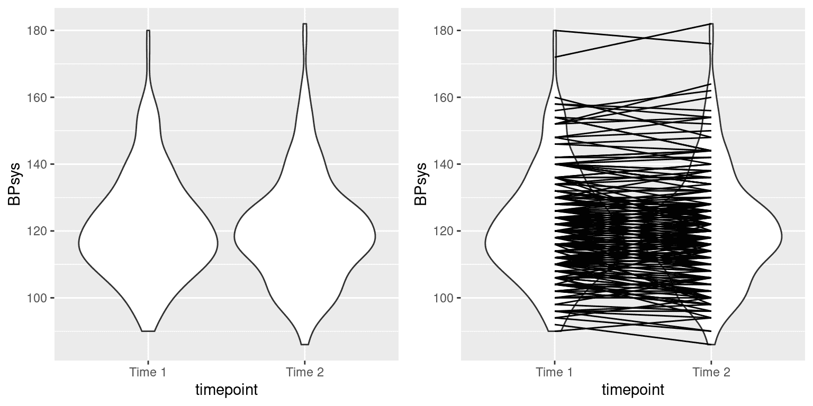
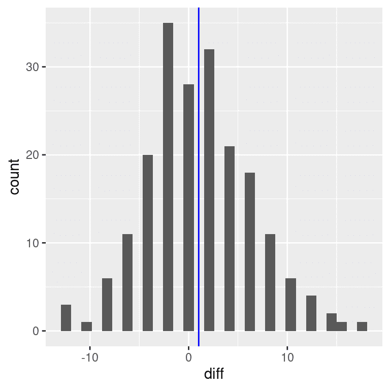
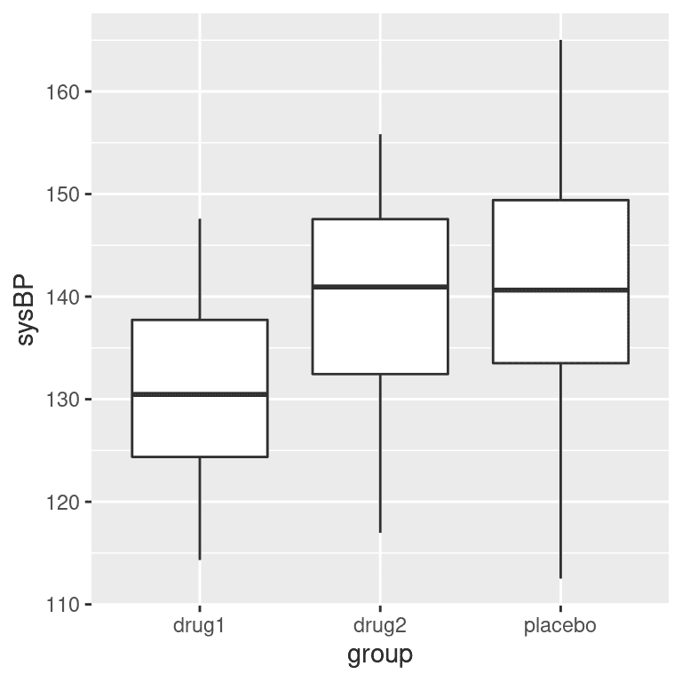
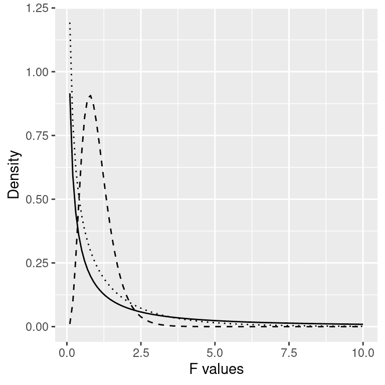

# 第十五章：比较均值

> 原文：[`statsthinking21.github.io/statsthinking21-core-site/comparing-means.html`](https://statsthinking21.github.io/statsthinking21-core-site/comparing-means.html)
> 
> 译者：[飞龙](https://github.com/wizardforcel)
> 
> 协议：[CC BY-NC-SA 4.0](https://creativecommons.org/licenses/by-nc-sa/4.0/)

我们已经遇到了许多情况，我们想要询问样本均值的问题。在本章中，我们将更深入地探讨我们可以比较不同组均值的各种方法。

## 15.1 测试单个均值的值

我们可能想要询问均值是否具有特定值的最简单的问题。假设我们想要测试 NHANES 数据集中成年人的舒张压均值是否高于 80，这是根据美国心脏病学会的高血压标准。为了询问这个问题，我们从数据集中抽取了 200 名成年人；每个成年人的血压被测量了三次，我们使用这些值的平均值进行我们的检验。

测试这种差异的一种简单方法是使用称为*符号检验*的检验，它询问实际值与假设值之间的正差异的比例是否与我们预期的差异不同。为了做到这一点，我们取每个数据点与假设均值的差异并计算它们的符号。如果数据呈正态分布且实际均值等于假设均值，那么高于假设均值（或低于它）的值的比例应该是 0.5，这样正差异的比例也应该是 0.5。在我们的样本中，我们看到 19.0%的个体舒张压高于 80。然后我们可以使用二项检验来询问这种正差异的比例是否大于 0.5，使用我们统计软件中的二项检验函数：

```r
## 
##  Exact binomial test
## 
## data:  npos and nrow(NHANES_sample)
## number of successes = 38, number of trials = 200, p-value = 1
## alternative hypothesis: true probability of success is greater than 0.5
## 95 percent confidence interval:
##  0.15 1.00
## sample estimates:
## probability of success 
##                   0.19
```

在零假设$p \le 0.5$下，我们看到具有正符号的个体比例并不令人惊讶，这不应该让我们感到惊讶，因为观察到的值实际上小于 0.5。

我们也可以使用学生 t 检验来询问这个问题，这是你在本书中早些时候已经遇到过的。我们将均值称为$\bar{X}$，假设总体均值为$\mu$。然后，单个均值的 t 检验为：

$$ t = \frac{\bar{X} - \mu}{SEM} $$

其中 SEM（你可能还记得抽样章节中的内容）被定义为：

$$ SEM = \frac{\hat{\sigma}}{\sqrt{n}} $$

实质上，t 统计量询问样本均值与假设数量的偏差在均值的抽样变异性方面有多大。

我们可以使用我们的统计软件计算 NHANES 数据集的这个值：

```r
## 
##  One Sample t-test
## 
## data:  NHANES_adult$BPDiaAve
## t = -55, df = 4593, p-value = 1
## alternative hypothesis: true mean is greater than 80
## 95 percent confidence interval:
##   69 Inf
## sample estimates:
## mean of x 
##        70
```

这告诉我们数据集中的舒张压均值（69.5）实际上远低于 80，因此我们对它是否高于 80 的检验远非显著。

记住，大的 p 值并不能为我们提供支持零假设的证据，因为我们已经假定零假设是真实的。然而，正如我们在贝叶斯分析的章节中讨论的那样，我们可以使用贝叶斯因子来量化支持或反对零假设的证据：

```r
ttestBF(NHANES_sample$BPDiaAve, mu=80, nullInterval=c(-Inf, 80))
```

```r
## Bayes factor analysis
## --------------
## [1] Alt., r=0.707 -Inf<d<80    : 2.7e+16  ±NA%
## [2] Alt., r=0.707 !(-Inf<d<80) : NaNe-Inf ±NA%
## 
## Against denominator:
##   Null, mu = 80 
## ---
## Bayes factor type: BFoneSample, JZS
```

这里列出的第一个贝叶斯因子（$2.73 * 10^{16}$）表示支持零假设胜过备择假设的证据非常强。

## 15.2 比较两个均值

统计学中经常出现的一个更常见的问题是两个不同组的均值是否有差异。假设我们想知道定期吸大麻的人是否看更多电视，我们也可以使用 NHANES 数据集来询问这个问题。我们从数据集中抽取了 200 个个体的样本，并测试每天看电视的小时数是否与定期吸大麻有关。图 15.1 的左侧面板显示了使用小提琴图展示的这些数据。

左图：小提琴图显示了通过定期使用大麻分开的电视观看分布。右图：小提琴图显示了每个组的数据，用虚线连接了每个组的预测值，这些值是基于线性模型的结果计算得出的。

图 15.1：左图：小提琴图显示了通过定期使用大麻分开的电视观看分布。右图：小提琴图显示了每个组的数据，用虚线连接了每个组的预测值，这些值是基于线性模型的结果计算得出的。

我们也可以使用学生 t 检验来测试两组独立观察的差异（正如我们在前面的章节中看到的）；我们将在本章后面讨论观察不独立的情况。作为提醒，用于比较两个独立组的 t 统计量计算如下：

$$ t = \frac{\bar{X_1} - \bar{X_2}}{\sqrt{\frac{S_1^2}{n_1} + \frac{S_2^2}{n_2}}} $$

其中$\bar{X}_1$和$\bar{X}_2$是两组的均值，$S^2_1$和$S^2_2$是每组的方差，$n_1$和$n_2$是两组的大小。在均值无差异的零假设下，这个统计量根据 t 分布分布，使用韦尔奇检验计算自由度（如前面讨论的），因为两组个体数量不同。在这种情况下，我们从具体假设开始，即吸大麻与更多的电视观看有关，因此我们将使用单尾检验。以下是我们统计软件的结果：

```r
## 
##  Welch Two Sample t-test
## 
## data:  TVHrsNum by RegularMarij
## t = -3, df = 85, p-value = 6e-04
## alternative hypothesis: true difference in means between group No and group Yes is less than 0
## 95 percent confidence interval:
##   -Inf -0.39
## sample estimates:
##  mean in group No mean in group Yes 
##               2.0               2.8
```

在这种情况下，我们看到组之间存在统计上显著的差异，且方向符合预期 - 经常吸大麻的人看更多电视。

## 15.3 t 检验作为线性模型

t 检验通常被呈现为比较均值的专门工具，但也可以被视为一般线性模型的应用。在这种情况下，模型如下：

$$ \hat{TV} = \hat{\beta_1}*Marijuana + \hat{\beta_0} $$

由于吸烟是一个二元变量，我们将其视为前一章中讨论的*虚拟变量*，对于吸烟者设置为 1，对于非吸烟者设置为 0。在这种情况下，$\hat{\beta_1}$ 简单地是两组之间均值的差异，$\hat{\beta_0}$ 是编码为零的组的均值。我们可以使用统计软件中的一般线性模型函数拟合这个模型，并且可以看到它给出了与上面的 t 检验相同的 t 统计量，只是在这种情况下是正的，因为我们的软件安排了这些组的方式：

```r
## 
## Call:
## lm(formula = TVHrsNum ~ RegularMarij, data = NHANES_sample)
## 
## Residuals:
##     Min      1Q  Median      3Q     Max 
## -2.2843 -1.0067 -0.0067  0.9933  2.9933 
## 
## Coefficients:
##                 Estimate Std. Error t value Pr(>|t|)    
## (Intercept)        2.007      0.116   17.27  < 2e-16 ***
## RegularMarijYes    0.778      0.230    3.38  0.00087 ***
## ---
## Signif. codes:  0 '***' 0.001 '**' 0.01 '*' 0.05 '.' 0.1 ' ' 1
## 
## Residual standard error: 1.4 on 198 degrees of freedom
## Multiple R-squared:  0.0546, Adjusted R-squared:  0.0498 
## F-statistic: 11.4 on 1 and 198 DF,  p-value: 0.000872
```

我们也可以以图形方式查看线性模型的结果（参见 15.1 的右面板）。在这种情况下，非吸烟者的预测值是$\hat{\beta_0}$（2.0），吸烟者的预测值是$\hat{\beta_0} +\hat{\beta_1}$（2.8）。

为了计算这个分析的标准误差，我们可以使用与线性回归相同的方程 - 因为这实际上只是线性回归的另一个例子。实际上，如果你比较上面 t 检验的 p 值和大麻使用变量的线性回归分析中的 p 值，你会发现线性回归分析的 p 值是 t 检验的两倍，因为线性回归分析执行的是双尾检验。

### 15.3.1 比较两个均值的效应大小

比较两个均值最常用的效应大小是科恩的 d，这是一个用标准差单位表示的效应大小的表达式（你可能还记得第 10 章中的内容）。对于使用上面概述的一般线性模型估计的 t 检验（即使用单个虚拟编码变量），这可以表示为：

$$ d = \frac{\hat{\beta_1}}{\sigma_{residual}} $$

我们可以从上面的分析输出中获得这些值，得到 d = 0.55，通常我们会解释为中等效应。

我们还可以为这个分析计算 $R^2$，它告诉我们电视观看的方差有多少被大麻吸烟解释。这个值（在上面线性模型分析的摘要底部报告）为 0.05，这告诉我们，虽然效应可能在统计上显著，但它解释了相对较少的电视观看方差。

## 15.4 平均差异的贝叶斯因子

正如我们在贝叶斯分析的章节中讨论的那样，贝叶斯因子提供了一种更好地量化支持或反对零假设的证据的方法。我们可以对相同的数据进行这种分析：

```r
## Bayes factor analysis
## --------------
## [1] Alt., r=0.707 0<d<Inf    : 0.041 ±0%
## [2] Alt., r=0.707 !(0<d<Inf) : 61    ±0%
## 
## Against denominator:
##   Null, mu1-mu2 = 0 
## ---
## Bayes factor type: BFindepSample, JZS
```

由于数据的组织方式，第二行向我们展示了这个分析的相关贝叶斯因子，为 61.4。这告诉我们，反对零假设的证据非常强。

## 15.5 比较配对观测

在实验研究中，我们经常使用*受试者内部*设计，即我们比较同一个人的多次测量。这种设计产生的测量通常被称为*重复测量*。例如，在 NHANES 数据集中，血压被测量了三次。假设我们有兴趣测试在样本中个体的第一次和第二次测量之间的平均收缩压是否有差异（见图 15.2）。



图 15.2：左侧：NHANES 数据集中第一次和第二次记录的收缩压的小提琴图。右侧：相同的小提琴图，显示了每个个体的两个数据点之间的连线。

我们看到第一次和第二次测量之间的平均血压没有太大的差异（大约一点）。首先让我们使用独立样本 t 检验来测试差异，忽略了数据点成对来自同一个个体的事实。

```r
## 
##  Two Sample t-test
## 
## data:  BPsys by timepoint
## t = 0.6, df = 398, p-value = 0.5
## alternative hypothesis: true difference in means between group BPSys1 and group BPSys2 is not equal to 0
## 95 percent confidence interval:
##  -2.1  4.1
## sample estimates:
## mean in group BPSys1 mean in group BPSys2 
##                  121                  120
```

这个分析显示没有显著差异。然而，这个分析是不合适的，因为它假设两个样本是独立的，而实际上它们并不是，因为数据来自同一个个体。我们可以绘制每个个体的数据线来展示这一点（见图 15.2 的右侧面板）。

在这个分析中，我们真正关心的是每个人的血压在两次测量之间是否以系统的方式发生了变化，因此表示数据的另一种方式是计算每个个体两个时间点之间的差异，然后分析这些差异分数而不是分析个体测量值。在图 15.3 中，我们展示了这些差异分数的直方图，蓝线表示平均差异。



图 15.3：第一次和第二次血压测量之间差异分数的直方图。垂直线代表样本中的平均差异。

### 15.5.1 符号检验

一个简单的测试差异的方法是使用*符号检验*。为此，我们取差异并计算它们的符号，然后使用二项式检验来询问正符号的比例是否与 0.5 不同。

```r
## 
##  Exact binomial test
## 
## data:  npos and nrow(NHANES_sample)
## number of successes = 96, number of trials = 200, p-value = 0.6
## alternative hypothesis: true probability of success is not equal to 0.5
## 95 percent confidence interval:
##  0.41 0.55
## sample estimates:
## probability of success 
##                   0.48
```

在这里，我们看到具有积极迹象的个体比例（0.48）不足以在零假设下的 p=0.5 下令人惊讶。然而，符号检验的一个问题是它丢弃了关于差异大小的信息，因此可能会漏掉一些东西。

### 15.5.2 配对 t 检验

更常见的策略是使用*配对 t 检验*，它相当于每个人的测量之间的均值差异是否为零的单样本 t 检验。我们可以使用我们的统计软件计算这个，告诉它数据点是配对的：

```r
## 
##  Paired t-test
## 
## data:  BPsys by timepoint
## t = 3, df = 199, p-value = 0.007
## alternative hypothesis: true mean difference is not equal to 0
## 95 percent confidence interval:
##  0.29 1.75
## sample estimates:
## mean difference 
##               1
```

通过这些分析，我们看到两次测量之间实际上存在显著差异。让我们计算贝叶斯因子，看看结果提供了多少证据：

```r
## Bayes factor analysis
## --------------
## [1] Alt., r=0.707 : 3 ±0.01%
## 
## Against denominator:
##   Null, mu = 0 
## ---
## Bayes factor type: BFoneSample, JZS
```

观察到的贝叶斯因子为 2.97 告诉我们，尽管配对 t 检验中的效应是显著的，但实际上提供了非常微弱的证据支持备择假设。

配对 t 检验也可以用线性模型来定义；有关此更多详细信息，请参阅附录。

## 15.6 比较两个以上的均值

通常我们希望比较两个以上的均值，以确定它们是否彼此不同。假设我们正在分析治疗高血压的临床试验数据。在这项研究中，志愿者被随机分配到三种条件中的一种：药物 1、药物 2 或安慰剂。让我们生成一些数据并绘制它们（见图 15.4）。



图 15.4：显示我们临床试验中三个不同组的血压的箱线图。

### 15.6.1 方差分析

我们首先想要测试所有组的均值是否相等的零假设 - 也就是说，与安慰剂相比，治疗都没有任何效果。我们可以使用一种称为*方差分析*（ANOVA）的方法来做到这一点。这是心理统计学中最常用的方法之一，我们只会在这里浅尝辄止。ANOVA 的基本思想是我们在一般线性模型章节中已经讨论过的，实际上 ANOVA 只是这种模型的一个特定版本的名称。

还记得上一章我们可以将数据的总方差（$SS_{total}$）分成模型解释的方差（$SS_{model}$）和未解释的方差（$SS_{error}$）。然后我们可以通过将它们除以它们的自由度来计算每个的*均方*；对于误差，这是$N - p$（其中$p$是我们计算的均值的数量），对于模型，这是$p - 1$：

$$ MS_{model} =\frac{SS_{model}}{df_{model}}= \frac{SS_{model}}{p-1} $$

$$ MS_{error} = \frac{SS_{error}}{df_{error}} = \frac{SS_{error}}{N - p} $$

对于 ANOVA，我们想要测试模型解释的方差是否大于我们在零假设下预期的随机方差，即均值之间没有差异。而对于 t 分布，在零假设下期望值为零，但在这里情况并非如此，因为平方和始终是正数。幸运的是，还有另一个理论分布描述了在零假设下平方和的比率是如何分布的：*F*分布（见图 15.5）。这个分布有两个自由度，对应于分子（在这种情况下是模型）和分母（在这种情况下是误差）的自由度。



图 15.5：零假设下的 F 分布，不同自由度的值。

要创建 ANOVA 模型，我们扩展了您在上一章中遇到的“虚拟编码”的概念。请记住，对于比较两个均值的 t 检验，我们创建了一个单一的虚拟变量，该变量对于其中一个条件取值为 1，对于其他条件取值为零。在这里，我们通过创建两个虚拟变量来扩展这个想法，一个编码药物 1 条件，另一个编码药物 2 条件。就像在 t 检验中一样，我们将有一个条件（在这种情况下是安慰剂），它没有虚拟变量，因此代表了与其他条件进行比较的基线；其均值定义了模型的截距。使用药物 1 和 2 的虚拟编码，我们可以使用与上一章相同的方法拟合模型：

```r
## 
## Call:
## lm(formula = sysBP ~ d1 + d2, data = df)
## 
## Residuals:
##     Min      1Q  Median      3Q     Max 
## -29.084  -7.745  -0.098   7.687  23.431 
## 
## Coefficients:
##             Estimate Std. Error t value Pr(>|t|)    
## (Intercept)   141.60       1.66   85.50  < 2e-16 ***
## d1            -10.24       2.34   -4.37  2.9e-05 ***
## d2             -2.03       2.34   -0.87     0.39    
## ---
## Signif. codes:  0 '***' 0.001 '**' 0.01 '*' 0.05 '.' 0.1 ' ' 1
## 
## Residual standard error: 9.9 on 105 degrees of freedom
## Multiple R-squared:  0.169,  Adjusted R-squared:  0.154 
## F-statistic: 10.7 on 2 and 105 DF,  p-value: 5.83e-05
```

此命令的输出为我们提供了两件事。首先，它向我们显示了每个虚拟变量的 t 检验结果，基本上告诉我们每个条件是否与安慰剂分别不同；看起来药物 1 确实有差异，而药物 2 没有。但是，请记住，如果我们想要解释这些测试，我们需要校正 p 值，以考虑我们进行了多个假设检验的事实；我们将在下一章中看到如何做到这一点。

请记住，我们最初想要测试的假设是是否在任何条件之间存在差异；我们将这称为“总体”假设检验，这是 F 统计提供的测试。F 统计基本上告诉我们我们的模型是否比仅包括一个截距的简单模型更好。在这种情况下，我们看到 F 检验非常显著，与我们的印象一致，即似乎各组之间确实存在差异（事实上我们知道确实存在差异，因为我们创建了数据）。

## 15.7 学习目标

阅读完本章后，您应该能够：

+   描述标志检验背后的原理

+   描述 t 检验如何用于将单个均值与假设值进行比较

+   使用双样本 t 检验比较两个配对或非配对组的均值

+   描述方差分析如何用于测试两个以上均值之间的差异。

## 15.8 附录

### 15.8.1 配对 t 检验作为线性模型

我们还可以根据一般线性模型来定义配对 t 检验。为此，我们将每个受试者的所有测量数据作为数据点（在整洁的数据框中）。然后，在模型中包括一个变量，该变量编码每个个体的身份（在这种情况下，包含每个人的受试者 ID 的 ID 变量）。这被称为“混合模型”，因为它包括独立变量的效应以及个体的效应。标准模型拟合过程“lm（）”无法做到这一点，但我们可以使用一个名为“lme4”的流行 R 包中的“lmer（）”函数来实现这一点，该包专门用于估计混合模型。公式中的“(1|ID)”告诉“lmer（）”估计一个单独的截距（这是“1”所指的内容）用于“ID”变量的每个值（即数据集中的每个个体），然后估计一个将时间点与 BP 相关联的公共斜率。

```r
# compute mixed model for paired test

lmrResult <- lmer(BPsys ~ timepoint + (1 | ID), 
 data = NHANES_sample_tidy)
summary(lmrResult)
```

```r
## Linear mixed model fit by REML. t-tests use Satterthwaite's method [
## lmerModLmerTest]
## Formula: BPsys ~ timepoint + (1 | ID)
##    Data: NHANES_sample_tidy
## 
## REML criterion at convergence: 2895
## 
## Scaled residuals: 
##     Min      1Q  Median      3Q     Max 
## -2.3843 -0.4808  0.0076  0.4221  2.1718 
## 
## Random effects:
##  Groups   Name        Variance Std.Dev.
##  ID       (Intercept) 236.1    15.37   
##  Residual              13.9     3.73   
## Number of obs: 400, groups:  ID, 200
## 
## Fixed effects:
##                 Estimate Std. Error      df t value Pr(>|t|)    
## (Intercept)      121.370      1.118 210.361  108.55   <2e-16 ***
## timepointBPSys2   -1.020      0.373 199.000   -2.74   0.0068 ** 
## ---
## Signif. codes:  0 '***' 0.001 '**' 0.01 '*' 0.05 '.' 0.1 ' ' 1
## 
## Correlation of Fixed Effects:
##             (Intr)
## tmpntBPSys2 -0.167
```

您可以看到，这向我们显示了一个 p 值，该 p 值与使用“t.test（）”函数计算的配对 t 检验的结果非常接近。
