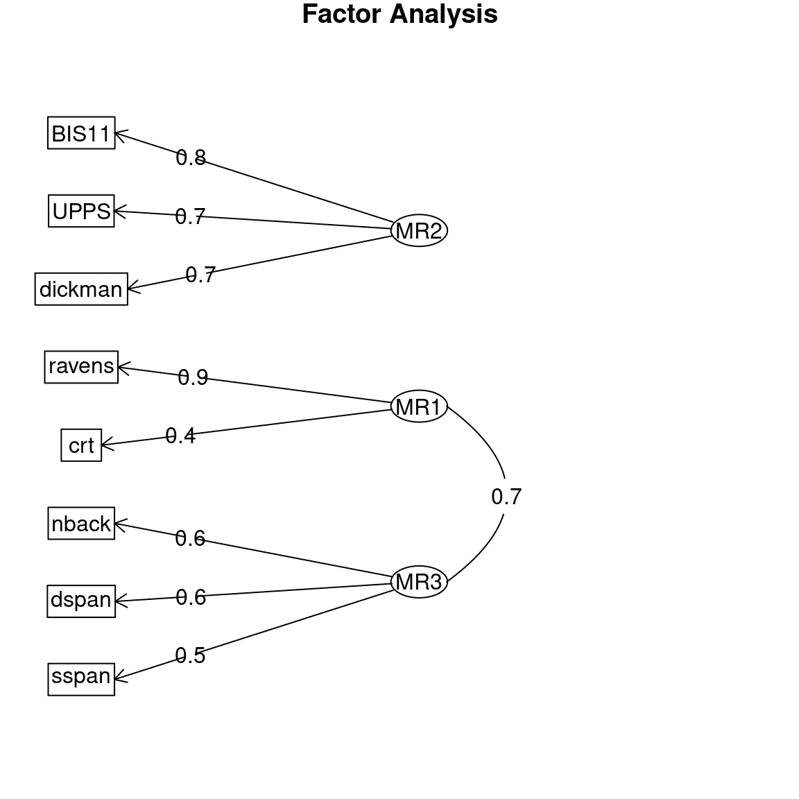

# 第十六章：多元统计

> 原文：[`statsthinking21.github.io/statsthinking21-core-site/multivariate.html`](https://statsthinking21.github.io/statsthinking21-core-site/multivariate.html)
> 
> 译者：[飞龙](https://github.com/wizardforcel)
> 
> 协议：[CC BY-NC-SA 4.0](https://creativecommons.org/licenses/by-nc-sa/4.0/)

术语*多元*指的是涉及多个随机变量的分析。虽然我们之前看到的模型包括多个变量（如线性回归），但在这些情况下，我们特别关注的是如何解释*因变量*的变化，这些变化通常由实验者而不是被测量的*自变量*来解释。在多元分析中，我们通常将所有变量视为平等，并试图理解它们如何作为一个群体相互关联。

本章中有许多不同种类的多元分析，但我们将重点关注两种主要方法。首先，我们可能只是想要理解和可视化数据中存在的结构，通常指的是哪些变量或观察与其他变量或观察相关。我们通常会根据一些衡量指标来定义“相关”，这些指标可以衡量跨变量值之间的距离。属于这一类别的一个重要方法被称为*聚类*，旨在找到在变量或观察之间相似的聚类。

其次，我们可能希望将大量变量减少到较少的变量，同时尽量保留尽可能多的信息。这被称为*降维*，其中“维度”指的是数据集中的变量数量。我们将讨论两种常用的降维技术，即*主成分分析*和*因子分析*。

聚类和降维通常被归类为*无监督学习*的形式；这与迄今为止学到的线性回归等*监督学习*形成对比。我们认为线性回归是“监督学习”的原因是，我们知道我们试图预测的事物的价值（即依赖变量），并且我们试图找到最佳预测这些值的模型。在无监督学习中，我们没有特定的值要预测；相反，我们试图发现数据中可能有用于理解情况的结构，这通常需要一些关于我们想要找到什么样的结构的假设。

在本章中，您将发现，虽然在监督学习中通常存在一个“正确”的答案（一旦我们已经同意如何确定“最佳”模型，例如平方误差的总和），但在无监督学习中通常没有一个一致的“正确”答案。不同的无监督学习方法可能会给出关于相同数据的非常不同的答案，通常原则上无法确定哪一个是“正确”的，因为这取决于分析的目标和对产生数据的机制愿意做出的假设。有些人会觉得这很沮丧，而其他人会觉得这很令人振奋；您将需要弄清楚自己属于哪个阵营。

## 16.1 多元数据：一个例子

作为多元分析的一个例子，我们将看一下由我的团队收集并由 Eisenberg 等人发布的数据集。([**Eisenberg:2019um?**](#ref-Eisenberg:2019um))。这个数据集很有用，因为它收集了大量有趣的变量，并且涉及相对较多的个体，并且可以在网上免费获取，因此您可以自行探索。

进行这项研究是因为我们对了解心理功能的几个不同方面如何相互关联感兴趣，特别关注自我控制和相关概念的心理测量。参与者在一周内进行了长达十小时的认知测试和调查；在这个第一个例子中，我们将关注与自我控制的两个特定方面相关的变量。*反应抑制*被定义为迅速停止行动的能力，在这项研究中使用了一组称为*停止信号任务*的任务来衡量。这些任务的感兴趣变量是一个估计一个人停止自己所需的时间，称为*停止信号反应时间*（*SSRT*），数据集中有四种不同的测量。*冲动性*被定义为倾向于冲动决策，不考虑潜在后果和长期目标。研究包括了许多不同的调查来衡量冲动性，但我们将关注*UPPS-P*调查，该调查评估了冲动性的五个不同方面。

在为艾森伯格的研究中的 522 名参与者计算了这些分数之后，我们得到了每个个体的 9 个数字。虽然多变量数据有时可能有数千甚至数百万个变量，但首先了解这些方法如何处理少量变量是有用的。

## 16.2 可视化多变量数据

多变量数据的一个基本挑战是，人眼和大脑只能够可视化三维以上的数据。我们可以使用各种工具来尝试可视化多变量数据，但随着变量数量的增加，所有这些工具都会失效。一种方法是首先减少维度（如下文所述），然后可视化减少后的数据集。

### 16.2.1 矩阵散点图

可视化少量变量的一种有用方法是将每对变量相互绘制，有时被称为“矩阵散点图”；图 16.1 中显示了一个例子。面板中的每行/列都指代一个单一变量 - 在这种情况下是我们之前例子中的心理变量之一。图中的对角元素显示了每个变量的分布情况，即直方图。对角线以下的元素显示了每对矩阵的散点图，并叠加了描述变量关系的回归线。对角线以上的元素显示了每对变量的相关系数。当变量数量相对较少（大约 10 个或更少）时，这可以是一种有用的方式来深入了解多变量数据集。


图 16.1：自我控制数据集中九个变量的矩阵散点图。矩阵中的对角元素显示了每个单独变量的直方图。左下方的面板显示了每对变量之间的关系散点图，右上方的面板显示了每对变量的相关系数。

### 16.2.2 热力图

在某些情况下，我们希望一次可视化大量变量之间的关系，通常关注相关系数。这样做的一个有用方式是将相关值绘制成*热图*，其中地图的颜色与相关性的值相关。图 16.2 显示了一个相对较少变量的示例，使用了上面的心理学示例。在这种情况下，热图帮助我们看到数据的结构；我们看到 SSRT 变量内部和 UPPS 变量内部之间存在强相关，而两组变量之间的相关性相对较小。


图 16.2：九个自我控制变量的相关矩阵热图。左上角和右下角的较亮的黄色区域突出了两个变量子集内部的更高相关性。

热图特别适用于可视化大量变量之间的相关性。我们可以以脑成像数据为例。神经科学研究人员通常使用功能磁共振成像（fMRI）从大脑的许多位置收集关于脑功能的数据，然后评估这些位置之间的相关性，以测量区域之间的“功能连接”。例如，图 16.3 显示了一个大的相关矩阵的热图，基于单个个体（即我自己）大脑中 300 多个区域的活动。通过查看热图，数据中的清晰结构显而易见。特别是，我们看到有大量脑区域的活动彼此高度相关（在相关矩阵对角线上的大黄色块中可见），而这些块也与其他块强烈负相关（在对角线外的大蓝色块中可见）。热图是一种强大的工具，可以轻松可视化大型数据矩阵。


图 16.3：显示单个个体左半球 316 个脑区活动之间的相关系数的热图。黄色的单元格反映了强正相关，而蓝色的单元格反映了强负相关。矩阵对角线上的大块正相关对应于大脑中的主要连接网络

## 16.3 聚类

聚类是指一组方法，根据观测值的相似性在数据集中识别相关观测或变量的群组。通常，这种相似性将以某种多变量值的*距离*度量来量化。然后，聚类方法找到成员之间距离最小的一组群组。

聚类中常用的距离度量是*欧氏距离*，基本上是连接两个数据点的线的长度。图 16.4 显示了一个具有两个数据点和两个维度（X 和 Y）的数据集的示例。这两个点之间的欧氏距离是空间中连接点的虚线的长度。


图 16.4：两点之间的欧几里德距离的描绘，(1,2)和(4,3)。这两点在 X 轴上相差 3，在 Y 轴上相差 1。

欧几里德距离是通过平方每个维度中点的位置的差异，将这些平方差异相加，然后取平方根来计算的。当有两个维度$x$和$y$时，这将被计算为：

$$ d(x, y) = \sqrt{(x_1 - x_2)^2 + (y_1 - y_2)^2} $$

将我们示例数据的值代入公式：

$$ d(x, y) = \sqrt{(1 - 4)^2 + (2 - 3)^2} = 3.16 $$

如果欧几里德距离的公式看起来有点熟悉，那是因为它与大多数人在几何课上学到的*毕达哥拉斯定理*是相同的，该定理根据两边的长度计算直角三角形的斜边长度。在这种情况下，三角形的两边的长度对应于沿着两个维度之一的点之间的距离。虽然这个例子是在两个维度上，但我们经常处理的数据的维度远远超过两个，但是相同的思想可以扩展到任意数量的维度。

欧几里德距离的一个重要特征是它对数据的整体均值和变异性敏感。在这个意义上，它不像相关系数，后者测量变量之间的线性关系，对整体均值或变异性不敏感。因此，通常在计算欧几里德距离之前对数据进行*缩放*，这相当于将每个变量转换为其 Z 得分版本。

### 16.3.1 K 均值聚类

一种常用的聚类数据的方法是*K 均值聚类*。这种技术识别一组聚类中心，然后将每个数据点分配给离该数据点最近的聚类（即欧几里德距离最小的聚类）。举个例子，让我们以世界各国的纬度和经度作为我们的数据点，并看看 K 均值聚类是否能有效地识别世界各大洲。

大多数统计软件包都有一个内置函数，可以使用单个命令执行 K 均值聚类，但了解它是如何一步一步工作的是很有用的。我们必须首先决定*K*的具体值，即要在数据中找到的聚类数。重要的是要指出，聚类数没有唯一的“正确”值；有各种技术可以尝试确定哪个解决方案是“最佳”的，但它们通常会给出不同的答案，因为它们包含不同的假设或权衡。尽管如此，聚类技术如 K 均值对于理解数据的结构是一种重要工具，特别是当它们变得高维时。

在选择我们希望找到的聚类数（*K*）之后，我们必须想出 K 个位置，这些位置将成为我们聚类中心的起始猜测（因为我们最初不知道中心在哪里）。一个简单的开始方法是随机选择 K 个实际数据点，并将它们用作我们的起始点，这些点被称为*质心*。然后，我们计算每个数据点到每个质心的欧几里德距离，并根据最接近的质心将每个点分配到一个聚类中。使用这些新的聚类分配，我们通过对分配给该聚类的所有点的位置进行平均来重新计算每个聚类的质心。然后重复这个过程，直到找到一个稳定的解决方案；我们将这称为*迭代*过程，因为它迭代直到答案不再改变，或者直到达到其他种类的限制，比如可能的最大迭代次数。


图 16.5：对世界各国的纬度和经度进行聚类的二维描述。方形黑色符号显示了每个簇的起始质心，线条显示了该簇在算法迭代中的移动。

将 K 均值聚类应用于纬度/经度数据（图 16.5），我们看到结果簇与大洲之间有合理的匹配，尽管没有一个大洲完全匹配任何一个簇。我们可以通过绘制一个表格来进一步检查这一点，该表格比较了每个国家的每个簇的成员资格与实际大洲；这种表格通常被称为*混淆矩阵*。

```r
##       
## labels AF AS EU NA OC SA
##      1  5  1 36  0  0  0
##      2  3 24  0  0  0  0
##      3  0  0  0  0  0  7
##      4  0  0  0 15  0  4
##      5  0 10  0  0  6  0
##      6 35  0  0  0  0  0
```

+   簇 1 包含所有欧洲国家，以及来自北非和亚洲的国家。

+   簇 2 包含亚洲国家以及一些非洲国家。

+   簇 3 包含南美洲南部的国家。

+   簇 4 包含所有北美国家以及南美洲北部国家。

+   簇 5 包含大洋洲以及一些亚洲国家

+   簇 6 包含所有剩余的非洲国家。

尽管在这个例子中我们知道实际的簇（也就是世界各大洲），但通常我们并不知道无监督学习问题的真实情况，所以我们只能相信聚类方法在数据中找到了有用的结构。然而，关于 K 均值聚类和迭代过程的一个重要点是，它们不能保证每次运行时都会得到相同的答案。使用随机数确定起始点意味着起始点每次可能不同，而且根据数据的不同，有时可能会导致找到不同的解决方案。对于这个例子，K 均值聚类有时会找到一个包含北美和南美的单一簇，有时会找到两个簇（就像在这里使用的特定随机种子的选择一样）。每当使用涉及迭代解决方案的方法时，重要的是使用不同的随机种子多次重新运行该方法，以确保答案在运行之间不会有太大的分歧。如果有的话，那么就不应该基于不稳定的结果得出坚定的结论。实际上，基于聚类结果得出坚定的结论可能是一个好主意；它们主要用于对可能存在于数据集中的结构有直观感觉。


图 16.6：K=3 的 K 均值聚类算法的 10 次运行结果的可视化。图中的每一行代表聚类算法的不同运行（使用不同的随机起始点），颜色相同的变量属于同一簇。

我们可以对自我控制变量应用 K 均值聚类，以确定哪些变量彼此之间最密切相关。对于 K=2，K 均值算法始终选择包含 SSRT 变量和包含冲动性变量的一个聚类。对于较高的 K 值，结果不太一致；例如，对于 K=3，该算法有时会识别出一个仅包含 UPPS 感觉寻求变量的第三个聚类，而在其他情况下，它将 SSRT 变量分成两个单独的聚类（如图 16.6 所示）。K=2 时聚类的稳定性表明，这可能是这些数据的最稳健的聚类，但这些结果也突显了多次运行算法以确定任何特定聚类结果是否稳定的重要性。

### 16.3.2 层次聚类

另一种检查多元数据集结构的有用方法被称为*层次聚类*。这种技术也利用数据点之间的距离来确定聚类，但它还提供了一种可视化数据点之间关系的方式，即树状结构，称为*树状图*。

最常用的层次聚类程序被称为*聚合聚类*。该程序首先将每个数据点视为自己的一个聚类，然后通过合并两个距离最小的聚类来逐渐创建新的聚类。它继续这样做，直到只剩下一个单一的聚类。这需要计算聚类之间的距离，有许多方法可以做到这一点；在这个例子中，我们将使用*平均链接*方法，它简单地取两个聚类中每个数据点之间的所有距离的平均值。例如，我们将检查上面描述的自我控制变量之间的关系。


图 16.7：树状图显示了九个自我控制变量的相对相似性。三条彩色垂直线代表三个不同的截断点，分别得到两个（蓝线）、三个（绿线）或四个（红线）聚类。

图 16.7 显示了从自我调节数据集生成的树状图。在这里，我们看到变量之间的关系具有结构，可以通过“剪切”树来在不同层次上理解：如果我们在 25 处剪切树，我们得到两个聚类；如果我们在 20 处剪切，我们得到三个聚类，而在 19 处我们得到四个聚类。

有趣的是，对自我控制数据进行层次聚类分析找到的解与大多数 K 均值聚类运行找到的解相同，这令人欣慰。

我们对这个分析的解释是，每个变量集合（SSRT 和 UPPS）内部之间存在高度相似性，而与集合之间相比则相对较少。在 UPPS 变量中，似乎寻求感觉变量与其他变量有所不同，其他变量之间更相似。在 SSRT 变量中，似乎刺激选择性 SSRT 变量与其他三个变量有所不同，其他三个变量更相似。这些是可以从聚类分析中得出的结论。重要的是要指出，没有单一“正确”的聚类数量；不同的方法依赖于不同的假设或启发式方法，可能会给出不同的结果和解释。一般来说，最好以几个不同的层次呈现聚类数据，并确保这不会大幅改变数据的解释。

## 16.4 降维

在多变量数据中，往往许多变量之间会高度相似，它们在很大程度上测量相同的事物。一种思考方式是，虽然数据具有特定数量的变量，我们称之为*维度*，但实际上信息源并不像变量那么多。*降维*的想法是减少变量数量，以创建反映数据中潜在信号的复合变量。

### 16.4.1 主成分分析

主成分分析的想法是找到一组变量的低维描述，以解释完整数据集中可能的最大信息量。对主成分分析的深入理解需要对线性代数有深刻的理解，这超出了本书的范围；请参阅本章末尾的资源，了解有关此主题的有用指南。在本节中，我将概述这个概念，并希望激发您学习更多的兴趣。

我们将从一个简单的例子开始，只有两个变量，以便直观地理解它是如何工作的。首先，我们为变量 X 和 Y 生成一些合成数据，两个变量之间的相关性为 0.7。主成分分析的目标是找到数据集中观察变量的线性组合，以解释最大量的方差；这里的想法是数据中的方差是信号和噪音的组合，我们希望找到变量之间最强的共同信号。第一个主成分是解释最大方差的组合。第二个成分是解释剩余最大方差的组合，同时与第一个成分不相关。对于更多的变量，我们可以继续这个过程，获得与变量数量相同的成分（假设观察次数多于变量数量），尽管在实践中，我们通常希望找到能解释大部分方差的少数成分。

在我们的二维示例中，我们可以计算主成分并将它们绘制在数据上（图 16.8）。我们看到第一个主成分（显示为绿色）沿着最大方差的方向。这条线与线性回归线相似，尽管不完全相同；虽然线性回归解决方案最小化了每个数据点与回归线在相同 X 值（即垂直距离）的距离，但主成分最小化了数据点与表示该成分的线之间的欧几里得距离（即垂直于成分的距离）。第二个成分指向与第一个成分垂直的方向（相当于不相关）。


图 16.8：合成数据的绘图，第一个主成分以绿色绘制，第二个以红色绘制。

通常使用 PCA 来降低更复杂数据集的维度。例如，假设我们想知道早期数据集中所有四个停止信号任务变量的表现是否与五个冲动性调查变量相关。我们可以分别对这些数据集执行 PCA，并检查数据中多少方差由第一个主成分解释，这将作为我们对数据的摘要。


图 16.9：Eisenberg 数据集中应用 PCA 分别应用于反应抑制和冲动性变量的方差解释（或*屏幕图*）的绘图。

我们在图 16.9 中看到，对于停止信号变量，第一个主成分解释了数据中约 60%的方差，而对于 UPPS，它解释了约 55%的方差。然后，我们可以计算使用每组变量的第一个主成分获得的分数之间的相关性，以了解两组变量之间是否存在关系。两个摘要变量之间的-0.014 的相关性表明，在这个数据集中，反应抑制和冲动性之间没有总体关系。

```r
## 
##  Pearson's product-moment correlation
## 
## data:  pca_df$SSRT and pca_df$UPPS
## t = -0.3, df = 327, p-value = 0.8
## alternative hypothesis: true correlation is not equal to 0
## 95 percent confidence interval:
##  -0.123  0.093
## sample estimates:
##    cor 
## -0.015
```

我们还可以同时对所有这些变量进行 PCA。查看图 16.7 中解释的方差的绘图（也称为*屏幕图*），我们可以看到前两个成分解释了数据中相当多的方差。然后，我们可以查看每个单独变量在这两个成分上的载荷，以了解每个特定变量与不同成分的关联。


（#fig:imp_pc_scree）绘制了在全套自控变量上计算的 PCA 成分解释的方差。


图 16.10：在包括所有自控变量的 PCA 解决方案中计算的 PCA 成分的变量载荷的绘图。每个变量都显示为其在两个成分中的载荷；分别反映在两行中。

对冲动性数据集进行这样的操作（图 16.10），我们看到第一个成分（在图的第一行）对大多数 UPPS 变量具有非零载荷，对每个 SSRT 变量几乎没有载荷，而第二主成分的情况正好相反，它主要对 SSRT 变量进行载荷。这告诉我们，第一个主成分主要捕获了与冲动性测量相关的方差，而第二个主成分主要捕获了与反应抑制测量相关的方差。您可能会注意到这些变量的载荷实际上是负的；载荷的符号是任意的，因此我们应该确保查看大的正载荷和负载荷。

### 16.4.2 因子分析

虽然主成分分析对于将数据集减少到较少数量的复合变量可能是有用的，但是标准的 PCA 方法有一些局限性。最重要的是，它确保组件之间不相关；虽然这有时可能是有用的，但通常存在我们希望提取可能彼此相关的维度的情况。第二个限制是 PCA 不考虑正在分析的变量中的测量误差，这可能导致难以解释结果的载荷。虽然有修改 PCA 可以解决这些问题，但在某些领域（如心理学）中更常见的是使用一种称为*探索性因子分析*（或 EFA）的技术来降低数据集的维度。[¹](#fn1)

EFA 的理念是每个观察变量都是通过一组*潜在变量*的贡献组合而成的，即不能直接观察到的变量，以及每个变量的一定量的测量误差。因此，EFA 模型通常被称为属于一类称为*潜在变量模型*的统计模型。

例如，假设我们想了解几个不同变量的测量与产生这些测量的潜在因素之间的关系。我们将首先生成一个合成数据集，以展示这可能是如何工作的。我们将生成一组个体，假装我们知道几个潜在心理变量的值：冲动性、工作记忆能力和流体推理。我们假设工作记忆能力和流体推理彼此相关，但两者都与冲动性不相关。然后，我们将从这些潜在变量中为每个个体生成一组八个观察变量，这些变量只是潜在变量的线性组合，同时加入随机噪声以模拟测量误差。

我们可以通过显示与所有这些变量相关的相关矩阵的热图来进一步检查数据（图 16.7）。从中我们可以看到，有三个变量簇对应于我们的三个潜在变量，这正是应该的。


（#fig:efa_cor_hmap）显示从三个潜在潜在变量生成的变量之间的相关性的热图。

我们可以将 EFA 视为一次性估计一组线性模型的参数，其中每个模型将每个观察变量与潜在变量相关联。对于我们的示例，这些方程将如下所示。在这些方程中，$\beta$字符有两个下标，一个是指任务，另一个是指潜在变量，还有一个变量$\epsilon$指的是误差。在这里，我们假设一切都有零的平均值，因此我们不需要为每个方程包括额外的截距项。

$$ \begin{array}{lcl} nback & = &beta_{[1, 1]} * WM + \beta_{[1, 2]} * FR + \beta_{[1, 3]} * IMP + \epsilon \\ dspan & = &beta_{[2, 1]} * WM + \beta_{[2, 2]} * FR + \beta_{[2, 3]} * IMP + \epsilon \\ ospan & = &beta_{[3, 1]} * WM + \beta_{[3, 2]} * FR + \beta_{[3, 3]} * IMP + \epsilon \\ ravens & = &beta_{[4, 1]} * WM + \beta_{[4, 2]} * FR + \beta_{[4, 3]} * IMP + \epsilon \\ crt & = &beta_{[5, 1]} * WM + \beta_{[5, 2]} * FR + \beta_{[5, 3]} * IMP + \epsilon \\ UPPS & = &beta_{[6, 1]} * WM + \beta_{[6, 2]} * FR + \beta_{[6, 3]} * IMP + \epsilon \\ BIS11 & = &beta_{[7, 1]} * WM + \beta_{[7, 2]} * FR + \beta_{[7, 3]} * IMP + \epsilon \\ dickman & = &beta_{[8, 1]} * WM + \beta_{[8, 2]} * FR + \beta_{[8, 3]} * IMP + \epsilon \\ \end{array} $$

实际上，我们使用 EFA 想要做的是估计将潜在变量映射到观察变量的系数（beta）*矩阵*。对于我们生成的数据，我们知道这个矩阵中的大多数 beta 都是零，因为我们是这样创建的；对于每个任务，只有一个权重被设置为 1，这意味着每个任务是单个潜在变量的嘈杂测量。

我们可以将 EFA 应用于我们的合成数据集以估计这些参数。我们不会详细介绍 EFA 是如何实际执行的，只是提到一个重要的点。本书中大多数先前的分析都依赖于试图最小化观察数据值与模型预测值之间的差异的方法。用于估计 EFA 参数的方法反而试图最小化观察变量之间的*协方差*与模型参数暗示的协方差之间的差异。因此，这些方法通常被称为*协方差结构模型*。

让我们将探索性因子分析应用到我们的合成数据上。与聚类方法一样，我们首先需要确定我们的模型中要包含多少个潜在因子。在这种情况下，我们知道有三个因子，所以让我们从这个开始；稍后我们将研究直接从数据中估计因子数量的方法。这是我们统计软件对这个模型的输出：

```r
## 
## Factor analysis with Call: fa(r = observed_df, nfactors = 3)
## 
## Test of the hypothesis that 3 factors are sufficient.
## The degrees of freedom for the model is 7  and the objective function was  0.04 
## The number of observations was  200  with Chi Square =  8  with prob <  0.34 
## 
## The root mean square of the residuals (RMSA) is  0.01 
## The df corrected root mean square of the residuals is  0.03 
## 
## Tucker Lewis Index of factoring reliability =  0.99
## RMSEA index =  0.026  and the 10 % confidence intervals are  0 0.094
## BIC =  -29
##  With factor correlations of 
##      MR1  MR2  MR3
## MR1 1.00 0.03 0.47
## MR2 0.03 1.00 0.03
## MR3 0.47 0.03 1.00
```

我们想要问的一个问题是我们的模型实际上对数据拟合得有多好。没有单一的方法来回答这个问题；相反，研究人员已经开发了许多不同的方法，这些方法可以提供一些关于模型对数据拟合程度的见解。例如，一个常用的标准是基于*均方根逼近误差*（RMSEA）统计量，它量化了预测的协方差与实际协方差之间的距离；RMSEA 小于 0.08 的值通常被认为反映了一个适当拟合的模型。在这个例子中，RMSEA 值为 0.026，这表明模型拟合得相当好。

我们还可以检查参数估计，以查看模型是否适当地识别了数据中的结构。通常将这个作为图表，用箭头从潜在变量（表示为椭圆）指向观察变量（表示为矩形），其中箭头表示观察变量对潜在变量的实质性载荷；这种图通常被称为*路径图*，因为它反映了变量之间的路径关系。这在图 16.11 中显示。在这种情况下，EFA 过程正确地识别了数据中存在的结构，无论是哪些观察变量与每个潜在变量相关，还是潜在变量之间的相关性。


图 16.11：探索性因子分析模型的路径图。

### 16.4.3 确定因子的数量

应用 EFA 的主要挑战之一是确定因子的数量。一个常见的做法是在改变因子数量的同时检查模型的拟合情况，然后选择给出最佳拟合的模型。这并不是绝对可靠的，有多种方法来量化模型的拟合程度，有时会得出不同的答案。

有人可能会认为我们可以简单地看模型拟合得有多好，然后选择最拟合的因素数量，但这不起作用，因为更复杂的模型总是会更好地拟合数据（正如我们在之前关于过度拟合的讨论中看到的）。因此，我们需要使用一个惩罚模型参数数量的模型拟合度量。在这个例子中，我们将选择一种常见的量化模型拟合度的方法，即*样本大小调整的贝叶斯信息准则*（或*SABIC*）。这个度量量化了模型对数据的拟合程度，同时还考虑了模型中的参数数量（在这种情况下与因素数量有关）以及样本大小。虽然 SABIC 的绝对值是不可解释的，但是当使用相同的数据和相同类型的模型时，我们可以使用 SABIC 来比较模型，以确定哪个对数据最合适。关于 SABIC 和其他类似的度量（称为*信息准则*）的一个重要事实是，较低的值代表模型拟合得更好，因此在这种情况下，我们希望找到具有最低 SABIC 的因素数量。在图 16.12 中，我们看到具有最低 SABIC 的模型有三个因素，这表明这种方法能够准确确定用于生成数据的因素数量。


图 16.12：不同因素数量的 SABIC 图。

现在让我们看看当我们将这个模型应用到 Eisenberg 等人数据集的真实数据时会发生什么，该数据集包含了上面示例中模拟的所有八个变量的测量值。三因素模型在这些真实数据中的 SABIC 也是最低的。



图 16.13：Eisenberg 等人数据上三因素模型的路径图。

绘制路径图（图 16.13），我们看到真实数据展示了一个与我们在模拟数据中看到的非常相似的因素结构。这并不奇怪，因为模拟数据是基于对这些不同任务的知识生成的，但是知道人类行为是有系统性的，我们可以可靠地识别这些关系是令人欣慰的。主要的区别是工作记忆因素（MR3）和流体推理因素（MR1）之间的相关性甚至比模拟数据中更高。这个结果在科学上是有用的，因为它向我们展示了，虽然工作记忆和流体推理密切相关，但分别对它们进行建模是有用的。

## 16.5 学习目标

阅读完本章后，您应该能够：

+   描述监督学习和无监督学习之间的区别。

+   使用可视化技术，包括热图，来可视化多变量数据的结构。

+   了解聚类的概念以及如何用它来识别数据中的结构。

+   理解降维的概念。

+   描述主成分分析和因素分析如何用于进行降维。

## 16.6 建议阅读

+   *多元统计的几何学*，Thomas Wickens

+   *线性代数的无废话指南*，Ivan Savov

* * *

1.  还有另一种因素分析的应用，称为*验证性因素分析*（或 CFA），我们在这里不讨论；在实践中，它的应用可能存在问题，最近的研究已经开始转向修改 EFA 以回答通常使用 CFA 解决的问题。([**Marsh:2014th?**](#ref-Marsh:2014th))[↩︎](multivariate.html#fnref1)
