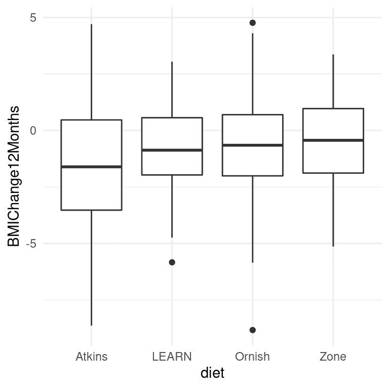
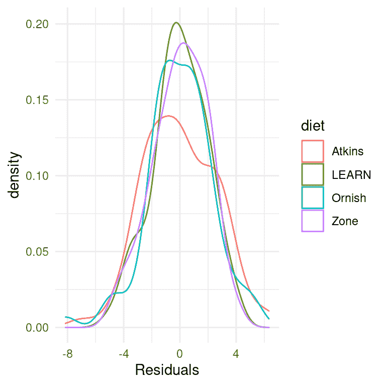
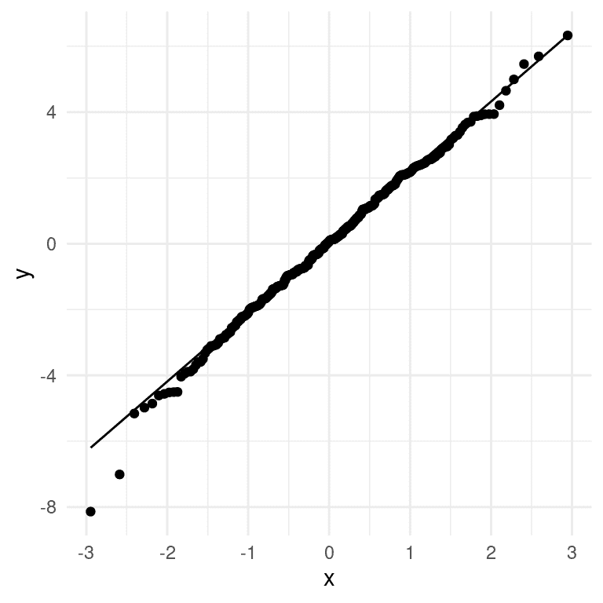

# 第十七章：实际统计建模

> 原文：[`statsthinking21.github.io/statsthinking21-core-site/practical-example.html`](https://statsthinking21.github.io/statsthinking21-core-site/practical-example.html)
> 
> 译者：[飞龙](https://github.com/wizardforcel)
> 
> 协议：[CC BY-NC-SA 4.0](https://creativecommons.org/licenses/by-nc-sa/4.0/)

在本章中，我们将通过将我们所学到的一切应用到一个实际例子中来汇总一切。 2007 年，斯坦福大学的克里斯托弗·加德纳和同事在《美国医学会杂志》上发表了一篇题为“阿特金斯，区域，奥尼什和学习饮食对超重绝经前妇女体重和相关危险因素变化的比较 - A TO Z 减肥研究：随机试验”的研究（[Gardner et al. 2007](#ref-gard:kiaz:alha:2007)）。 我们将使用这项研究来展示如何从头到尾分析实验数据。

## 17.1 统计建模的过程

当我们想要使用我们的统计模型来测试科学假设时，通常会经历一系列步骤：

1.  指定您感兴趣的问题

1.  确定或收集适当的数据

1.  为分析准备数据

1.  确定适当的模型

1.  将模型拟合到数据

1.  批评模型以确保其适当拟合

1.  测试假设并量化效应大小

### 17.1.1 1: 指定您感兴趣的问题

根据作者的说法，他们研究的目标是：

> 比较代表低至高碳水化合物摄入谱的 4 种减肥饮食对体重减轻和相关代谢变量的影响。

### 17.1.2 2: 确定或收集适当的数据

为了回答他们的问题，调查人员随机分配了 311 名超重/肥胖妇女中的每一位到四种不同的饮食（阿特金斯，区域，奥尼什或学习），并随着时间测量了她们的体重以及许多其他健康指标。 作者记录了大量变量，但对于感兴趣的主要问题，让我们专注于一个单一变量：身体质量指数（BMI）。 此外，由于我们的目标是测量 BMI 的持久变化，我们只会关注饮食开始后 12 个月的测量。

### 17.1.3 3: 为分析准备数据



图 17.1：每个条件的箱线图，每组的第 50 百分位数（即中位数）显示为黑线。

A 到 Z 研究的实际数据并不是公开的，因此我们将使用他们的论文中报告的摘要数据来生成一些大致符合其研究中获得的数据的合成数据，每组的均值和标准差相同。 一旦我们有了数据，我们可以将它们可视化，以确保没有异常值。 箱线图对于查看分布的形状很有用，如图 17.1 所示。 这些数据看起来相当合理-在各个组内有一些异常值（由箱线图外的点表示），但它们似乎不会在其他组方面极端。 我们还可以看到，这些分布在方差上似乎有些不同，阿特金斯的变异性略大于其他饮食。 这意味着任何假设方差在各组之间相等的分析可能是不合适的。 幸运的是，我们计划使用的 ANOVA 模型对此相当健壮。

### 17.1.4 4. 确定适当的模型

为了确定我们分析的适当统计模型，我们需要提出几个问题。

+   什么样的因变量？

+   BMI：连续，大致正态分布

+   我们在比较什么？

+   四种饮食组的平均 BMI

+   ANOVA 是合适的

+   观察是否独立？

+   随机分配应确保独立性的假设是适当的

+   使用差异分数（在本例中是起始体重和 12 个月后体重之间的差异）在某种程度上是有争议的，特别是当不同组之间的起始点不同时。在这种情况下，各组的起始体重非常相似，因此我们将使用差异分数，但一般来说，在将这样的模型应用于真实数据之前，人们会希望咨询统计学家。

### 17.1.5 5\. 将模型拟合到数据

让我们对 BMI 变化进行一项方差分析，比较四种饮食之间的差异。大多数统计软件会自动将名义变量转换为一组虚拟变量。使用*公式表示法*是指定统计模型的常见方式，其中模型使用以下形式的公式进行指定：

$$ \text{因变量} \sim \text{自变量} $$

在这种情况下，我们希望查看 BMI 的变化（存储在一个名为*BMIChange12Months*的变量中）作为饮食（存储在一个名为*diet*的变量中）的函数，因此我们使用以下公式：

$$ BMIChange12Months \sim diet $$

大多数统计软件（包括 R）在模型包含名义变量（例如包含每个人所接受的饮食名称的*diet*变量）时会自动生成一组虚拟变量。以下是拟合到我们数据的这个模型的结果：

```r
## 
## Call:
## lm(formula = BMIChange12Months ~ diet, data = dietDf)
## 
## Residuals:
##    Min     1Q Median     3Q    Max 
##  -8.14  -1.37   0.07   1.50   6.33 
## 
## Coefficients:
##             Estimate Std. Error t value Pr(>|t|)    
## (Intercept)   -1.622      0.251   -6.47  3.8e-10 ***
## dietLEARN      0.772      0.352    2.19   0.0292 *  
## dietOrnish     0.932      0.356    2.62   0.0092 ** 
## dietZone       1.050      0.352    2.98   0.0031 ** 
## ---
## Signif. codes:  0 '***' 0.001 '**' 0.01 '*' 0.05 '.' 0.1 ' ' 1
## 
## Residual standard error: 2.2 on 307 degrees of freedom
## Multiple R-squared:  0.0338, Adjusted R-squared:  0.0243 
## F-statistic: 3.58 on 3 and 307 DF,  p-value: 0.0143
```

请注意，软件自动生成了对应于四种饮食中三种的虚拟变量，使得阿特金斯饮食没有虚拟变量。这意味着截距代表了阿特金斯饮食组的均值，其他三个变量则模拟了这些饮食的均值与阿特金斯饮食均值之间的差异。阿特金斯饮食被选择为未建模的基线变量，仅仅是因为它在字母顺序中排在第一位。

### 17.1.6 6\. 批评模型以确保其适当

我们首先要做的是批评模型，确保它是适当的。我们可以做的一件事是查看模型的残差。在图 17.2 中，我们按饮食对每个个体的残差进行了绘制。在不同条件下残差的分布没有明显的差异，我们可以继续进行分析。



图 17.2: 每个条件下残差的分布

我们应用于线性模型的统计检验的另一个重要假设是模型的残差呈正态分布。人们普遍错误地认为线性模型要求*数据*呈正态分布，但事实并非如此；正确的统计要求只是残差误差呈正态分布。图 17.3 的右侧显示了一个 Q-Q（分位数-分位数）图，它将残差值根据正态分布中的分位数与其期望值进行了对比。如果残差呈正态分布，那么数据点应该沿着虚线分布 — 在这种情况下看起来相当不错，除了在底部明显的一些离群值。由于这个模型对正态性的违反也相对健壮，并且这些违反相当小，我们将继续使用这些结果。



图 17.3: 实际残差值与理论残差值的 Q-Q 图

### 17.1.7 7\. 测试假设并量化效应大小

首先让我们回顾一下上面第 5 步中 ANOVA 的结果摘要。显著的 F 检验告诉我们饮食之间存在显著差异，但我们还应该注意到模型实际上并没有解释数据的很多变异；R 平方值只有 0.03，表明模型只解释了体重减轻变异的几个百分点。因此，我们不希望过分解释这个结果。

在整体 F 检验中的显著结果也没有告诉我们哪些饮食与其他饮食有差异。我们可以通过比较不同条件下的均值来了解更多信息。因为我们进行了几次比较，所以需要对这些比较进行校正，这是通过一种称为 Tukey 方法的程序来实现的，该方法由我们的统计软件实现：

```r
##  diet   emmean    SE  df lower.CL upper.CL .group
##  Atkins  -1.62 0.251 307    -2.11    -1.13  a    
##  LEARN   -0.85 0.247 307    -1.34    -0.36  ab   
##  Ornish  -0.69 0.252 307    -1.19    -0.19   b   
##  Zone    -0.57 0.247 307    -1.06    -0.08   b   
## 
## Confidence level used: 0.95 
## P value adjustment: tukey method for comparing a family of 4 estimates 
## significance level used: alpha = 0.05 
## NOTE: Compact letter displays can be misleading
##       because they show NON-findings rather than findings.
##       Consider using 'pairs()', 'pwpp()', or 'pwpm()' instead.
```

右侧列中的字母告诉我们哪些组彼此不同，使用一种调整进行比较的方法；共享一个字母的条件彼此之间没有显著差异。这表明 Atkins 和 LEARN 饮食彼此没有差异（因为它们共享字母 a），LEARN、Ornish 和 Zone 饮食彼此没有差异（因为它们共享字母 b），但 Atkins 饮食与 Ornish 和 Zone 饮食有差异（因为它们没有共享字母）。

### 17.1.8 可能的混杂因素是什么？

如果我们更仔细地查看 Gardner 的论文，我们会发现他们还报告了每组中被诊断为*代谢综合征*的个体数量的统计数据，代谢综合征的特征是高血压、高血糖、腰部多余脂肪和异常的胆固醇水平，与心血管问题的风险增加有关。Gardner 的数据在表 17.1 中呈现。

表 17.1：AtoZ 研究中每个组中代谢综合征的存在。

| 饮食 | N | P(代谢综合征) |
| --- | --- | --- |
| Atkins | 77 | 0.29 |
| LEARN | 79 | 0.25 |
| Ornish | 76 | 0.38 |
| Zone | 79 | 0.34 |

从数据来看，各组之间的比例略有不同，Ornish 和 Zone 饮食中代谢综合征病例更多，而这两种饮食的结果也较差。假设我们有兴趣测试代谢综合征的发病率在各组之间是否存在显著差异，因为这可能使我们担心这些差异可能影响了饮食结果。

#### 17.1.8.1 确定适当的模型

+   什么样的因变量？

+   比例

+   我们在比较什么？

+   四种饮食组中代谢综合征的比例

+   对拟合优度的卡方检验适用于没有差异的零假设

让我们首先使用统计软件中的卡方检验函数计算该统计量：

```r
## 
##  Pearson's Chi-squared test
## 
## data:  contTable
## X-squared = 4, df = 3, p-value = 0.3
```

这个检验表明均值之间没有显著差异。然而，它并没有告诉我们有多大把握确定没有差异；请记住，在 NHST 下，我们总是假设零假设成立，除非数据给出足够的证据使我们拒绝零假设。

如果我们想要量化支持或反对零假设的证据怎么办？我们可以使用贝叶斯因子来做到这一点。

```r
## Bayes factor analysis
## --------------
## [1] Non-indep. (a=1) : 0.058 ±0%
## 
## Against denominator:
##   Null, independence, a = 1 
## ---
## Bayes factor type: BFcontingencyTable, independent multinomial
```

这告诉我们，备择假设比零假设更可能 0.058 倍，这意味着在这些数据给出的情况下，零假设比备择假设更可能 1/0.058 ~ 17 倍。这是相当强大的，即使不是完全压倒性的，支持零假设的证据。

## 17.2 寻求帮助

在分析真实数据时，最好与经过训练的统计学家核对分析计划，因为真实数据可能会出现许多潜在问题。事实上，最好在项目开始之前就与统计学家交谈，因为他们关于研究设计或实施方面的建议可能会在未来避免给你带来重大麻烦。大多数大学都设有统计咨询办公室，为大学社区成员提供免费帮助。理解本书的内容并不会阻止你在某个时候需要他们的帮助，但它将帮助你与他们进行更加明智的对话，并更好地理解他们提供的建议。

## 参考资料

```r
Gardner, Christopher D, Alexandre Kiazand, Sofiya Alhassan, Soowon Kim, Randall S Stafford, Raymond R Balise, Helena C Kraemer, and Abby C King. 2007. “Comparison of the Atkins, Zone, Ornish, and LEARN Diets for Change in Weight and Related Risk Factors Among Overweight Premenopausal Women: The a TO z Weight Loss Study: A Randomized Trial.” JAMA 297 (9): 969–77. https://doi.org/10.1001/jama.297.9.969.
```