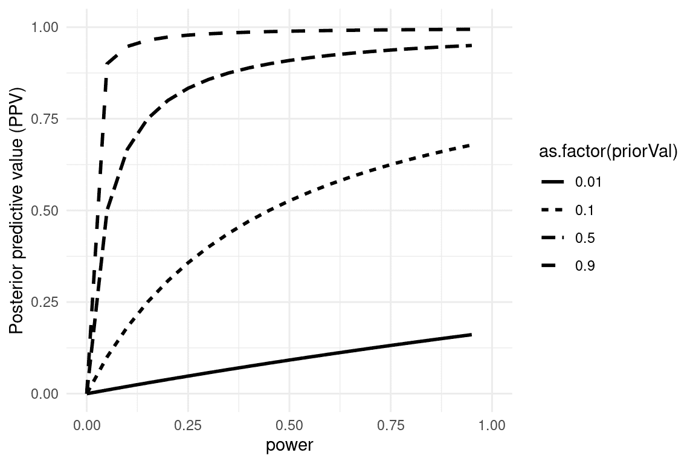
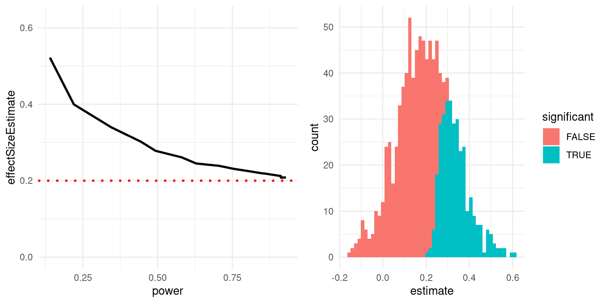

# 第十八章：进行可重复研究

> 原文：[`statsthinking21.github.io/statsthinking21-core-site/doing-reproducible-research.html`](https://statsthinking21.github.io/statsthinking21-core-site/doing-reproducible-research.html)
> 
> 译者：[飞龙](https://github.com/wizardforcel)
> 
> 协议：[CC BY-NC-SA 4.0](https://creativecommons.org/licenses/by-nc-sa/4.0/)

大多数人认为科学是回答世界问题的可靠方法。当我们的医生开处方时，我们相信它已经通过研究证明是有效的，我们也同样相信我们乘坐的飞机不会从天上掉下来。然而，自 2005 年以来，人们越来越担心科学可能并不总是像我们长期以来认为的那样有效。在本章中，我们将讨论关于科学研究可重复性的这些担忧，并概述可以采取的步骤，以确保我们的统计结果尽可能具有可重复性。

## 18.1 我们认为科学应该如何工作

假设我们对一个关于儿童选择吃什么的研究项目感兴趣。这是著名饮食研究员布莱恩·万辛克及其同事在 2012 年的一项研究中提出的问题。标准（并且，正如我们将看到的，有些天真）观点大致如下：

+   你从一个假设开始

+   使用受欢迎角色的品牌可能会导致孩子更频繁地选择“健康”的食物

+   你收集一些数据

+   给孩子提供选择，要么是带有 Elmo 品牌贴纸的饼干和苹果，要么是带有控制贴纸的饼干和苹果，并记录他们的选择

+   你做统计来检验零假设

+   预先计划的比较显示，带有 Elmo 品牌的苹果与饼干相比，儿童选择苹果的比例从 20.7%增加到 33.8%（$\chi^2$=5.158; P=.02）（[Wansink, Just, and Payne 2012](#ref-wans:just:payn:2012)）

+   你根据数据得出结论

+   “这项研究表明，品牌或有吸引力的品牌角色的使用可能对更健康的食物产生更多好处，而不是对放纵、更加加工的食物产生好处。正如已经证明有吸引力的名称可以增加学校午餐室中更健康食物的选择一样，品牌和卡通角色也可以在年幼儿童中产生同样的效果。”（[Wansink, Just, and Payne 2012](#ref-wans:just:payn:2012)）

## 18.2 科学（有时）实际上是如何工作的

布莱恩·万辛克以他的《无意识进食》一书而闻名，他的企业演讲费曾一度高达数万美元。2017 年，一组研究人员开始审查他发表的一些研究，首先是一组关于人们在自助餐厅吃了多少比萨的论文。研究人员要求万辛克分享研究数据，但他拒绝了，所以他们深入研究了他发表的论文，并在论文中发现了大量的不一致和统计问题。围绕这一分析的公开报道引起了其他许多人对万辛克过去的关注，包括获取万辛克和他的合作者之间的电子邮件。正如 Buzzfeed 的 Stephanie Lee 报道的那样，这些电子邮件显示了万辛克的实际研究实践与天真模型有多么不同：

> ……回到 2008 年 9 月，当 Payne 在数据收集后不久查看数据时，他并没有发现明显的苹果和艾尔莫之间的联系——至少目前还没有。……“我在这封邮件中附上了儿童研究的一些初步结果，供您的报告使用，”Payne 写道。 “不要绝望。看起来水果上的贴纸可能有效（需要更多的魔法）。 ”……Wansink 在准备提交论文时也承认了论文的薄弱之处。P 值为 0.06，刚好低于 0.05 的黄金标准。正如他在 2012 年 1 月 7 日的一封电子邮件中所说的那样，这是一个“瓶颈”。……“在我看来，它应该更低，”他在附上一份草案的时候写道。“你想看看它，看看你的想法。如果你能得到数据，并且需要一些调整，那么将这个值降低到 0.05 以下将是很好的。”……2012 年晚些时候，这项研究发表在著名的《JAMA 儿科学》，0.06 的 P 值保持不变。但在 2017 年 9 月，它被撤回，并以一个列出 P 值为 0.02 的版本取而代之。一个月后，它因为完全不同的原因再次被撤回：Wansink 承认实验并不是在 8 至 11 岁的孩子身上进行的，正如他最初所声称的那样，而是在学龄前儿童身上进行的。

这种行为最终让 Wansink 受到了惩罚；[他的 15 项研究被撤回](https://www.vox.com/science-and-health/2018/9/19/17879102/brian-wansink-cornell-food-brand-lab-retractions-jama)，并且在 2018 年，他辞去了康奈尔大学的教职。

## 18.3 科学中的可重复性危机

虽然我们认为 Wansink 案中出现的欺诈行为相对罕见，但越来越清楚的是，科学中的可重复性问题比以前想象的要普遍得多。这在 2015 年变得特别明显，当时一大群研究人员在《科学》杂志上发表了一篇题为“估计心理科学可重复性”的研究（[Open Science Collaboration 2015](#ref-open:2015)）。在这篇论文中，研究人员选取了 100 篇心理学领域的已发表研究，并试图重现这些论文中最初报告的结果。他们的发现令人震惊：原始论文中有 97%报告了统计显著的发现，但在复制研究中，只有 37%的效应在统计上是显著的。尽管心理学中存在这些问题已经引起了很多关注，但似乎几乎每个科学领域都存在这些问题，从癌症生物学（[Errington et al. 2014](#ref-erri:iorn:gunn:2014)）和化学（[Baker 2017](#ref-bake:2017)）到经济学（[Christensen and Miguel 2016](#ref-NBERw22989)）和社会科学（[Camerer et al. 2018](#ref-Camerer2018EvaluatingTR)）。

2010 年后出现的可重复性危机实际上是由斯坦福大学的医生约翰·约阿尼迪斯预测的，他在 2005 年写了一篇名为“为什么大多数发表的研究结果是错误的”（[Ioannidis 2005](#ref-ioan:2005)）的论文。在这篇文章中，约阿尼迪斯认为，在现代科学背景下使用零假设统计检验必然会导致高水平的错误结果。

### 18.3.1 阳性预测值和统计显著性

Ioannidis 的分析集中在一个称为“阳性预测值”的概念上，它被定义为阳性结果（通常翻译为“统计显著的发现”）中真实的比例：

$$ PPV = \frac{p(true\ positive\ result)}{p(true\ positive\ result) + p(false\ positive\ result)} $$

假设我们知道假设为真的概率 ($p(hIsTrue)$)，那么真正阳性结果的概率就是 $p(hIsTrue)$ 乘以研究的统计功效。

$$ p(true\ positive\ result) = p(hIsTrue) * (1 - \beta) $$

其中 $\beta$ 是假阴性率。假阳性结果的概率由 $p(hIsTrue)$ 和假阳性率 $\alpha$ 决定：

$$ p(false\ positive\ result) = (1 - p(hIsTrue)) * \alpha $$

PPV 的定义如下：

$$ PPV = \frac{p(hIsTrue) * (1 - \beta)}{p(hIsTrue) * (1 - \beta) + (1 - p(hIsTrue)) * \alpha} $$

让我们首先举一个概率假设为真的概率很高的例子，比如说 0.8 - 尽管一般来说我们实际上无法知道这个概率。假设我们进行了一项研究，使用标准值$\alpha=0.05$和$\beta=0.2$。我们可以计算 PPV 如下：

$$ PPV = \frac{0.8 * (1 - 0.2)}{0.8 * (1 - 0.2) + (1 - 0.8) * 0.05} = 0.98 $$

这意味着如果我们在假设可能为真且功效高的研究中发现了积极的结果，那么它的真实性很高。然而，请注意，假设一个研究领域的假设有如此高的真实可能性可能并不是一个非常有趣的研究领域；当研究告诉我们一些意外的事情时，研究是最重要的！

让我们对$p(hIsTrue)=0.1$的领域进行相同的分析 - 也就是说，大多数被测试的假设都是错误的。在这种情况下，PPV 是：

$$ PPV = \frac{0.1 * (1 - 0.2)}{0.1 * (1 - 0.2) + (1 - 0.1) * 0.05} = 0.307 $$

这意味着在一个大部分假设可能是错误的领域（也就是说，一个有趣的科学领域，研究人员正在测试冒险的假设），即使我们发现了积极的结果，它更可能是假的而不是真的！事实上，这只是我们在假设检验的背景下讨论的基本率效应的另一个例子 - 当结果不太可能时，几乎可以肯定大多数积极的结果都是假阳性。

我们可以模拟这一点，展示 PPV 如何与统计功效和假设真实的先验概率相关（见图 18.1）。



图 18.1：后验预测值的模拟，作为统计功效的函数（绘制在 x 轴上），以及假设真实的先验概率（作为单独的线绘制）。

不幸的是，在许多科学领域，统计功效仍然很低（[Smaldino and McElreath 2016](#ref-smal:mcel:2016)），这表明许多发表的研究结果是错误的。

一个有趣的例子是乔纳森·肖恩菲尔德和约翰·约阿尼迪斯的一篇论文，题为“我们吃的一切都与癌症有关吗？系统的食谱评论”（[Schoenfeld and Ioannidis 2013](#ref-scho:ioan:2013)）。他们检查了大量评估不同食物与癌症风险关系的论文，发现 80%的成分与增加或减少癌症风险有关。在大多数情况下，统计证据很弱，当结果在研究中结合时，结果为零。

### 18.3.2 胜者诅咒

当统计功效低时，还会发生另一种错误：我们对效应大小的估计会被夸大。这种现象通常被称为“胜者诅咒”，这个术语来自经济学，在那里它指的是对于某些类型的拍卖（其中价值对每个人都是相同的，比如一罐季度，出价是私人的），获胜者保证要支付比商品价值更多的钱。在科学上，胜者诅咒指的是从显著结果（即获胜者）中估计的效应大小几乎总是真实效应大小的夸大。

我们可以模拟这个，以查看显著结果的估计效应大小与实际基础效应大小的关系。让我们生成一个真实效应大小为 d = 0.2 的数据，并估计检测到显著效应的结果的效应大小。图 18.2 的左面板显示，当功效低时，显著结果的估计效应大小可能与实际效应大小相比高度膨胀。



图 18.2：左：赢家诅咒的模拟，作为统计功效的函数（x 轴）。实线显示估计的效应大小，虚线显示实际效应大小。右：直方图显示了来自数据集的多个样本的效应大小估计，显著结果显示为蓝色，非显著结果显示为红色。

我们可以看一个单独的模拟来看为什么会出现这种情况。在图 18.2 的右面板中，您可以看到 1000 个样本的估计效应大小的直方图，根据检验是否具有统计显著性进行分隔。从图中应该清楚，如果我们仅基于显著结果来估计效应大小，那么我们的估计将会被夸大；只有当大多数结果是显著的（即功效高且效应相对较大）时，我们的估计才会接近实际效应大小。

## 18.4 可疑的研究行为

美国心理学协会出版的一本名为《The Compleat Academic: A Career Guide》的畅销书（[Darley, Zanna, and Roediger 2004](#ref-darl:zann:roed:2004)）旨在为有抱负的研究人员提供如何建立职业生涯的指导。社会心理学家达里尔·贝姆在一章中提到了“撰写实证期刊文章”，他提供了一些建议关于如何写一篇研究论文。不幸的是，他提出的做法存在严重问题，已经被称为*可疑的研究行为*（QRPs）。

> 你应该写哪篇文章？有两篇可能的文章可以写：（1）你在设计研究时计划写的文章，或者（2）你已经看到结果后现在最有意义的文章。它们很少相同，正确答案是（2）。

Bem 在这里建议的是*HARKing*（在结果已知后进行假设）([Kerr 1998](#ref-kerr:1998))。这可能看起来无害，但是有问题，因为它允许研究人员重新构建事后结论（我们应该持保留态度）作为先验预测（我们会更有信心）。实质上，它允许研究人员根据事实重写他们的理论，而不是使用理论进行预测，然后进行测试——类似于移动球门，使其最终停在任何地方。因此，非常难以证伪不正确的想法，因为球门总是可以移动以匹配数据。Bem 继续说道：

> **分析数据** 从各个角度检查它们。分别分析性别。制作新的综合指数。如果一个数据表明一个新的假设，试着在数据的其他地方找到进一步的证据。如果你看到有趣模式的微弱痕迹，试着重新组织数据以使它们更加醒目。如果有你不喜欢的参与者，或者试验、观察者或采访者给你异常结果，暂时放弃它们。进行一次钓鱼远征，寻找一些有趣的东西。不，这不是不道德的。

Bem 在这里提出的是*p-hacking*，这意味着尝试许多不同的分析，直到找到一个显着的结果。 Bem 正确地指出，如果报告数据上进行的每一项分析，那么这种方法就不会“不道德”。然而，很少看到一篇论文讨论对数据集执行的所有分析; 相反，论文通常只呈现*有效*的分析 - 这通常意味着他们找到了统计上显着的结果。有许多不同的方法可以进行 p-hack：

+   在每个受试者之后分析数据，并在 p <.05 时停止收集数据

+   分析许多不同的变量，但只报告那些 p <.05 的变量

+   收集许多不同的实验条件，但只报告那些 p <.05 的条件

+   排除参与者以获得 p <.05

+   转换数据以获得 p <.05

Simmons，Nelson 和 Simonsohn（2011）发表的一篇著名论文表明，使用这些 p-hacking 策略可以大大增加实际的假阳性率，导致大量的假阳性结果。

### 18.4.1 ESP 或 QRP？

2011 年，同样是 Daryl Bem 发表了一篇文章（Bem 2011），声称已经找到了超感知的科学证据。文章中指出：

> 本文报告了 9 个实验，涉及 1000 多名参与者，测试了通过“时间逆转”已经建立的心理效应来测试超前影响。 …所有 9 个实验中的超感知表现的平均效应大小（d）为 0.22，除一个实验外，所有实验都产生了统计上显着的结果。

当研究人员开始检查 Bem 的文章时，很明显他已经参与了上面讨论的所有 QRPs。正如 Tal Yarkoni 在一篇审查该文章的博客文章中指出的那样：

+   样本大小在研究中有所不同

+   不同的研究似乎已经被合并在一起或分开

+   这些研究允许许多不同的假设，目前尚不清楚事先计划了哪些假设

+   Bem 在没有明确有方向性预测的情况下使用单尾检验（因此α实际上为 0.1）

+   大多数 p 值非常接近 0.05

+   目前尚不清楚有多少其他研究进行了但没有报告

## 18.5 进行可重复研究

自可重复性危机爆发以来，已经出现了一个强大的运动，旨在开发工具，以帮助保护科学研究的可重复性。

### 18.5.1 预注册

最受欢迎的想法之一是*预注册*，其中将研究的详细描述（包括所有数据分析）提交给受信任的存储库（例如[Open Science Framework](http://osf.io)或[AsPredicted.org](http://aspredicted.org)）。通过在分析数据之前详细说明计划，预注册提供了更大的信心，使分析不会受到 p-hacking 或其他可疑的研究实践的影响。

在医学临床试验中，预先注册的影响是显著的。2000 年，国家心脏，肺部和血液研究所（NHLBI）开始要求所有临床试验在[临床试验.gov](http://clinicaltrials.gov)上进行预先注册。这提供了一个自然实验来观察研究预先注册的影响。当 Kaplan 和 Irvin（2015）在一段时间内检查临床试验结果时，他们发现 2000 年之后临床试验的积极结果数量大大减少，与之前相比。虽然有许多可能的原因，但似乎在研究注册之前，研究人员能够改变他们的方法或假设以找到积极的结果，而在注册后这变得更加困难。

### 18.5.2 可重复的实践

Simmons, Nelson 和 Simonsohn（2011）提出了一套建议的实践，使研究更具可重复性，所有这些实践都应该成为研究人员的标准：

> +   作者必须在数据收集开始之前决定终止数据收集的规则，并在文章中报告这个规则。
> 
> +   作者必须每个单元收集至少 20 个观察结果，否则必须提供令人信服的数据收集成本的理由。
> 
> +   作者必须列出研究中收集的所有变量。
> 
> +   作者必须报告所有实验条件，包括失败的操作。
> 
> +   如果观察结果被排除，作者必须报告如果包括这些观察结果，统计结果是什么。
> 
> +   如果分析包括一个协变量，作者必须报告没有协变量的分析的统计结果。

### 18.5.3 复制

科学的一个标志是*复制*的概念-也就是说，其他研究人员应该能够进行相同的研究并获得相同的结果。不幸的是，正如我们在之前讨论的复制项目的结果中看到的那样，许多发现是不可复制的。确保研究的可复制性的最佳方法是首先在自己身上复制它；对于一些研究来说，这可能是不可能的，但每当可能时，应确保自己的发现在新样本中成立。新样本应具有足够的功效来发现感兴趣的效应大小；在许多情况下，这实际上将需要比原始样本更大的样本。

在复制方面，有几件事情很重要。首先，复制尝试失败并不一定意味着原始发现是错误的；请记住，以 80%的功效水平，即使存在真实效应，结果仍有五分之一的机会是不显著的。因此，我们通常希望在决定是否相信某个重要发现之前看到多次复制。不幸的是，包括心理学在内的许多领域过去未能遵循这一建议，导致“教科书”上的发现最终被证明是错误的。关于 Daryl Bem 对超感知的研究，一个包括 7 个研究的大型复制尝试未能复制他的发现（Galak 等人，2012）。

其次，要记住 p 值并不能提供给我们一个发现复制的可能性的度量。正如我们之前讨论过的，p 值是关于特定零假设下数据的可能性的陈述；它并不能告诉我们关于发现实际上是真实的概率（正如我们在贝叶斯分析的章节中学到的）。为了知道复制的可能性，我们需要知道发现是真实的概率，而这通常是我们不知道的。

## 18.6 进行可重复的数据分析

到目前为止，我们已经专注于在新实验中复制其他研究人员的发现的能力，但可再现性的另一个重要方面是能够在其自己的数据上重现某人的分析，我们称之为*计算可再现性*。这要求研究人员分享他们的数据和分析代码，以便其他研究人员既可以尝试重现结果，也可以在相同数据上测试不同的分析方法。心理学领域越来越倾向于公开分享代码和数据；例如，《心理科学》杂志现在为分享研究材料、数据和代码以及预注册的论文提供“徽章”。

能够重现分析是我们强烈主张使用脚本分析（如使用 R 语言）而不是使用“点与点击”软件包的原因之一。这也是我们主张使用免费开源软件（如 R）而不是商业软件包的原因，后者需要其他人购买软件才能重现任何分析。

有许多分享代码和数据的方式。分享代码的常见方式是通过支持软件*版本控制*的网站，例如[Github](http://github.com)。小型数据集也可以通过这些网站分享；较大的数据集可以通过数据共享门户网站（如[Zenodo](https://zenodo.org/)）或专门用于特定类型数据的门户网站（如[OpenNeuro](http://openneuro.org)）进行分享。

## 18.7 结论：做更好的科学

每个科学家都有责任改进他们的研究实践，以增加其研究的可再现性。必须记住，研究的目标不是找到显著结果，而是以最真实的方式提出和回答关于自然的问题。我们的大部分假设都会是错误的，我们应该对此感到舒适，这样当我们找到一个正确的假设时，我们会更加对其真实性有信心。

## 18.8 学习目标

+   描述 P-值操纵的概念及其对科学实践的影响

+   描述阳性预测值的概念及其与统计功效的关系

+   描述预注册的概念以及它如何帮助防止可疑的研究实践

## 18.9 建议阅读

+   [《严谨之死：草率的科学如何制造毫无价值的治疗，粉碎希望，浪费数十亿》（作者：理查德·哈里斯）](https://www.amazon.com/dp/B01K3WN72C)

+   [改善您的统计推断](https://www.coursera.org/learn/statistical-inferences) - 一门关于如何进行更好的统计分析的在线课程，包括本章提出的许多要点。

## 参考资料

```r
Baker, Monya. 2017. “Reproducibility: Check Your Chemistry.” Nature 548 (7668): 485–88. https://doi.org/10.1038/548485a.
Bem, Daryl J. 2011. “Feeling the Future: Experimental Evidence for Anomalous Retroactive Influences on Cognition and Affect.” J Pers Soc Psychol 100 (3): 407–25. https://doi.org/10.1037/a0021524.
Camerer, Colin F., Anna Dreber, Felix Holzmeister, Teck-Hua Ho, Jürgen Huber, Magnus Johannesson, Michael Kirchler, et al. 2018. “Evaluating the Replicability of Social Science Experiments in Nature and Science Between 2010 and 2015.” Nature Human Behaviour 2: 637–44.
Christensen, Garret S, and Edward Miguel. 2016. “Transparency, Reproducibility, and the Credibility of Economics Research.” Working Paper 22989. Working Paper Series. National Bureau of Economic Research. https://doi.org/10.3386/w22989.
Darley, John M, Mark P Zanna, and Henry L Roediger. 2004. The Compleat Academic: A Career Guide. 2nd ed. Washington, DC: American Psychological Association. http://www.loc.gov/catdir/toc/fy037/2003041830.html.
Errington, Timothy M, Elizabeth Iorns, William Gunn, Fraser Elisabeth Tan, Joelle Lomax, and Brian A Nosek. 2014. “An Open Investigation of the Reproducibility of Cancer Biology Research.” Elife 3 (December). https://doi.org/10.7554/eLife.04333.
Galak, Jeff, Robyn A LeBoeuf, Leif D Nelson, and Joseph P Simmons. 2012. “Correcting the Past: Failures to Replicate Psi.” J Pers Soc Psychol 103 (6): 933–48. https://doi.org/10.1037/a0029709.
Ioannidis, John P A. 2005. “Why Most Published Research Findings Are False.” PLoS Med 2 (8): e124. https://doi.org/10.1371/journal.pmed.0020124.
Kaplan, Robert M, and Veronica L Irvin. 2015. “Likelihood of Null Effects of Large NHLBI Clinical Trials Has Increased over Time.” PLoS One 10 (8): e0132382. https://doi.org/10.1371/journal.pone.0132382.
Kerr, N L. 1998. “HARKing: Hypothesizing After the Results Are Known.” Pers Soc Psychol Rev 2 (3): 196–217. https://doi.org/10.1207/s15327957pspr0203_4.
Open Science Collaboration. 2015. “PSYCHOLOGY. Estimating the Reproducibility of Psychological Science.” Science 349 (6251): aac4716. https://doi.org/10.1126/science.aac4716.
Schoenfeld, Jonathan D, and John P A Ioannidis. 2013. “Is Everything We Eat Associated with Cancer? A Systematic Cookbook Review.” Am J Clin Nutr 97 (1): 127–34. https://doi.org/10.3945/ajcn.112.047142.
Simmons, Joseph P, Leif D Nelson, and Uri Simonsohn. 2011. “False-Positive Psychology: Undisclosed Flexibility in Data Collection and Analysis Allows Presenting Anything as Significant.” Psychol Sci 22 (11): 1359–66. https://doi.org/10.1177/0956797611417632.
Smaldino, Paul E, and Richard McElreath. 2016. “The Natural Selection of Bad Science.” R Soc Open Sci 3 (9): 160384. https://doi.org/10.1098/rsos.160384.
Wansink, Brian, David R Just, and Collin R Payne. 2012. “Can Branding Improve School Lunches?” Arch Pediatr Adolesc Med 166 (10): 1–2. https://doi.org/10.1001/archpediatrics.2012.999.
```