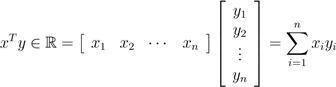
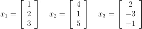

# 斯坦福大学 CS224d 基础：线性代数知识

作者：Zico Kolter (补充： Chuong Do)       

时间：2016 年 6 月

翻译：@MOLLY（mollyecla@gmail.com） @OWEN（owenj1989@126.com）

校正：@寒小阳(hanxiaoyang.ml@gmail.com) @龙心尘(johnnygong.ml@gmail.com)  出处：[`blog.csdn.net/han_xiaoyang/article/details/51629242`](http://blog.csdn.net/han_xiaoyang/article/details/51629242)

[`blog.csdn.net/longxinchen_ml/article/details/51629328`](http://blog.csdn.net/longxinchen_ml/article/details/51629328)

声明：版权所有，转载请联系作者并注明出处

## 1 基本概念和符号

线性代数可以对一组线性方程进行简洁地表示和运算。例如，对于这个方程组:

这里有两个方程和两个变量，如果你学过高中代数的话，你肯定知道，可以为 x1 和 x2 找到一组唯一的解 (除非方程可以进一步简化，例如，如果第二个方程只是第一个方程的倍数形式。但是显然上面的例子不可简化，是有唯一解的)。在矩阵表达中，我们可以简洁的写作:

其中：

很快我们将会看到，咱们把方程表示成这种形式，在分析线性方程方面有很多优势(包括明显地节省空间)。

## 1.1 基本符号

以下是我们要使用符号:

*   符号*A* ∈ R^(m×n)表示一个 m 行 n 列的矩阵，并且矩阵 A 中的所有元素都是实数。
*   符号 x ∈ R^n 表示一个含有 n 个元素的向量。通常，我们把 n 维向量看成是一个 n 行 1 列矩阵，即列向量。如果我们想表示一个行向量（1 行*n*列矩阵），我们通常写作*x^(T )*(*x^T*表示 x 的转置，后面会解释它的定义)。
*   一个向量 x 的第*i*个元素表示为 x[i]：

*   我们用*a[ij ]*(或*A[ij]，A[i，j]*，等) 表示第*i*行第*j*列的元素：

*   我们用*a[j ]*或*A*[:*，j*]表示 A 矩阵的第*j*列元素：

*   我们用*a^T [i]或 A[i，:]*表示矩阵的第 i 行元素:

    

*   请注意，这些定义都是不严格的（例如，*a[1]*和*a[1]^T*在前面的定义中是两个不同向量）。通常使用中，符号的含义应该是可以明显看出来的。

## 2 矩阵乘法

矩阵 *A *∈ R^(*m*×*n *)和*B *∈ R^(*n*×*p *)的乘积为矩阵 ：

其中：

*.*

请注意，矩阵 A 的列数应该与矩阵 B 的行数相等，这样才存在矩阵的乘积。有很多种方式可以帮助我们理解矩阵乘法，这里我们将通过一些例子开始学习。

## 2.1 向量的乘积

给定两个向量 x，y ∈ R^n，那么 x^(T )y 的值，我们称之为向量的**内积**或**点积。它**是一个由下式得到的实数：

*.*

可以发现，内积实际上是矩阵乘法的一个特例。通常情况下 x^(T )y = y^(T )x。

对于向量 x ∈ R^m， y ∈ R^n（大小不必相同），xy^(T )∈ R^(m×n)称为向量的**外积**。外积是一个矩阵，其中中的每个元素，都可以由得到，也就是说，

*.*

我们举个例子说明外积有什么用。令**1 **∈ R*^(n )*表示所有元素都是 1 的 n 维向量，然后将矩阵 *A *∈ R^(*m*×*n *)的每一列都用列向量*x *∈ R*^m*表示。使用外积，我们可以将 A 简洁的表示为：

*.*

## 2.2 矩阵-向量的乘积

对于一个矩阵*A *∈ R^(*m*×*n *)和向量*x *∈ R*^n*，他们的乘积为向量 *y *= *Ax *∈ R*^m*。理解矩阵向量乘法的方式有很多种，我们一起来逐一看看。

以行的形式书写 A，我们可以将其表示为 Ax 的形式：

*.*

也就是说，*y*第*i*行的元素等于 A 的第*i*行与 x 的内积 .

咱们换个角度，以列的形式表示 A，我们可以看到：

* .*

换言之，*y*是 A 列的线性组合，线性组合的系数就是 x 的元素。

上面我们看到的是右乘一个列向量，那左乘一个行向量嘞？对于 A ∈ R^(m×n)，x ∈ R^m， y ∈ R^n*，这个式子可以*写成*y^(T )*= *x^(T )A 。*向之前那样，我们有两种方式表达*y^T*，这取决于表达 A 的方式是行还是列。第一种情况是把 A 以列的形式表示：

这个式子说明 y^(T )第*i*列的元素等于向量*x*与 A 的第 i 列的内积。

我们也一样可以把 A 表示成行的形式，来说明向量-矩阵乘积。

我们可以看到*y^(T )*是 A 的行的线性组合，线性组合的系数是 x 的元素。

## 2.3 矩阵-矩阵乘积

基于以上知识，我们可以看到如之前所定义的矩阵-矩阵乘法 C=AB 有四种不同（但是等价）的理解方法。

首先，我们可以将矩阵-矩阵相乘看作一组**向量****-向量乘积**。根据其概念，我们最好理解的方式是*矩阵 C 的*(*i，j*)元素是 A 的*i*行与 B 的 *j*列的内积。符号表达如下：

* .*

注意由于*A *∈ R^(*m*×*n *)， *B *∈ R^(*n*×*p*)， *a[i ]*∈ R*^(n )b[j ]*∈ R*^n*， 所以内积永远有意义。对矩阵乘法而言，以 A 的行和 B 的列表示是最"自然"的表示方法。当然，我们也可以以 A 的列和 B 的行的形式进行表示。表达方法是 AB 外积累加的形式，稍微复杂一点点。符号表达为：

* .*

换一种方式表达，AB 的值等于对于所有的 i，A 的 i 列与 B 的 i 行的外积的和。因此，对于 a[i ]∈ R^(m )和 b[i ]∈ R^p，外积 a[i]b[i]^T 的维度是 m×p，它与 C 的维度是相同的。等式可能有点难理解，花点时间想想，我猜你肯定能明白。

第二种理解方式是，我们也可将向量-向量乘法看做一系列的**矩阵****-向量**乘积。具体来说，如果我们将 B 以列的形式表示，我们可以将 C 的每一列看做 A 和 B 列的矩阵-向量乘积。符号表达为：

* .*

可以将 C 的*i*列以矩阵-向量乘积（向量在右）的方式表示为*c[i ]*= *Ab[i]*. 这些矩阵-向量乘积可以用前面的两种观点解释。最后类比一下，我们以 A 的行形式表示，将 C 的行视为 A 的行与 C 的矩阵-向量乘积，符号表达为

*.*

在此，我们以矩阵-向量乘积（向量左乘）的形式表示了 C 的*i*列，

只是一个矩阵乘法而已，这么细的分析看上去好像没有必要，尤其是当我们知道矩阵乘法定义后其实很容易可以计算得到结果。然而，几乎所有的线性代数内容都在处理某种类型的矩阵乘法，因此花一些时间去形成对这些结论的直观认识还是很有帮助的。

此外，知道一些更高层次的矩阵乘法的基本性质也是有好处的：

*   结合律即(*AB*)*C *= *A*(*BC*)
*   分配率即*A*(*B *+ *C*) = *AB *+ *AC*
*   注意哦，矩阵乘法没有交换律，即*AB *≠*BA*.（例如，如果*A *∈ R^(*m*×*n *)和*B *∈ R^(*n*×*q*)，矩阵的乘积*BA*在*m*和*q*不等时，*BA*可能根本就不存在）

如果你对这些性质不熟悉，最好花些时间自己证明一下。例如，为了验证矩阵乘法的结合律，对于*A *∈ R^(*m*×*n*)， *B *∈ R^(*n*×*p*)，*C *∈ R^(*p*×*q*)，注意*AB *∈ R^(*m*×*p*)，而 (*AB*)*C *∈ R^(*m*×*q*)。类似的有*BC *∈ R^(*n*×*q*)，所以*A*(*BC) ∈ R^(m×q)*。因此可以得到维度相同的矩阵。为了说明矩阵乘法符合结合律，证明(AB)C 第(i,j)个元素是否与 A(BC)的(i,j)个元素相等就够了。我们可以直接运用矩阵乘法的定义进行证明。

上面的推导过程中，第一个和最后两个等式使用矩阵乘法的定义，第三和第五的等式使用标量乘法的分配率，第四个等式使用了标量加法的交换律和结合律。这种将运算简化成标量的特性以证明矩阵性质的方法会经常出现，你可以熟悉熟悉它们。

## 3 运算和性质

在这一节中，我们将介绍几种矩阵/向量的运算和性质。很希望这些内容可以帮助你回顾以前知识，这些笔记仅仅是作为上述问题的一个参考。

## 3.1 单位矩阵与对角矩阵

**单位矩阵**，记作 I ∈ R^(n×n)， 是一个方阵，其对角线上的都是 1，其他元素都是 0。即：

它具备*A *∈ R^(*m*×*n*)矩阵的所有性质

请注意，在某种意义上，标识矩阵的符号是有歧义的，因为它没有指定*I*的维度。一般而言，从上下文中可以推断出 I 的维度，这个维度使矩阵相乘成为可能。例如，在上面的等式 AI = A 中的 I 是 n × n 矩阵，而 A = IA 中 I 是 m × m 矩阵。

**对角矩阵**除了对角线元素之外其他元素都是 0。可以记作*D *= diag(*d*[1]*，d*[2]*，...，d[n]*)，其中：

显然，I = diag(1，1，...*，*1).

## 3.2 转置

矩阵的**转置**的是矩阵行和列的"翻转"。对于一个矩阵*A *∈ R^(*m*×*n*)，，它的转置，*A^(T )*∈ R^(*n*×*m*)，是一个*n *× *m* 的矩阵，其元素为

我们实际上已经使用转置当描述行向量的转置，因为一个列向量的转置，自然是一个行向量。

下面是一些关于转置的性质，证明起来也不太难：

*   (A^T )^T = A
*   (AB)^T = B^T A^T
*   (A + B)^(T )= A*^(T )*+ *B^T*

## 3.3 对称矩阵

如果一个方阵 A∈ R^(*n*×n)满足条件*A *= *A^T*，那么它就是**对称**的。如果满足*A *= ?*A^T*则 A 是**反对称的**。很容易证明，任何矩阵*A *∈ R^(*n*×*n*)，*A *+ *A^(T )*是对称的，而 A?A^T 是反对称的。因此，任何方阵*A *∈ R^(*n*×n)可以表示为一个对称矩阵和反对称矩阵的和，因为:

右边的第一个矩阵是对称的，第二个是反对称的。在实践中，对称矩阵是很常用的，他们有诸多优秀的性质，我们将在以后进行说明。我们通常将所有大小为 n 的对称矩阵的集合表示为 S^n；*A *∈ S*^n*则表示 A 是*n *× *n*的对称矩阵。

## 3.4 矩阵的迹

方阵*A *∈ R^(*n*×*n*)的**迹**，记作 tr(*A*)，或可以省略括号表示成 tr*A，*是矩阵的对角线元素之和:

正如 cs229 讲义中所述，矩阵的迹具有以下性质（在此讲述完全是为了内容的完整性）：

*   对于*A *∈ R^(*n*×*n*)， tr*A *= tr*A^(T )*.
*   对于*A，B *∈ R^(*n*×*n*)， tr(*A *+ *B*) = tr*A *+ tr*B*.
*   对于*A *∈ R^(*n*×*n*)， *t *∈ R， tr(*tA*) = *t *tr*A*.
*   对于方阵*A,B,C*，tr*ABC *= tr*BCA *= tr*CAB*，即使有更多的矩阵相乘，这个性质也不变.

前三个性质比较容易证明，咱们一起来看看第 4 个性质。假设*A *∈ R^(*m*×*n *)，*B *∈ R^(*n*×*m *)(因此*AB *∈ R^(*m*×*m*)是个方阵)。观察到*BA *∈ R^(*n*×*n*)也是一个方阵，所以他的迹是有意义的。为了证明 tr*AB *= tr*BA*，注意到：

在这里，第一个和最后两个等式使用了迹运算和矩阵乘法的定义。第四个等式是最重要的部分，它使用了标量乘法的交换性来交换每个乘积中因式顺序，也使用了标量加法的交换律和结合律将求和过程重新排序。

## 3.5 范数

向量的**范数**是向量"长度"的非正式度量。例如，我们常用的欧氏或?2 范数。

注意 .

更正式的来讲，范数是满足以下 4 个特性的任何一个方程*f *: R*^(n )*→ R:

1.  对于任意 x ∈ R^n， f(x) ≥ 0 (非负性).
2.  当且仅当 x = 0 时，f(x) = 0(确定性).
3.  对于任意 x ∈ R^n，t∈ R，f(tx) = |t|f(x) (均匀性).
4.  对于任意 x，y∈R^n，f(x + y)≤f(*x*) + *f*(*y*) (三角不等性).

另一个范数的例子是*?*[1]范数，

以及*?*[∞]范数，

事实上，这三个范数都是?[P]范数家族的的例子，它包含一个实参数 p≥1。?[P]范数定义为：

*.*

也可以定义矩阵 A 的范数，如 Frobenius 范数，

*.*

也存在许多其他的范数，但它们超出了这篇综述讨论的范围。

## 3.6 线性无关和秩

对于一组向量{x[1]，x[2]，...x[n]} ∈ R^m，如果没有向量可以表示为其余向量的线性组合，这组向量就是**（线性）无关**的。相反，如果一个向量属于一个集合，这个集合中的向量可以表示为其余的向量某个线性组合，那么就称其称为向量**（线性）相关**。也就是说，对于一些标量值*α*[1]*，...，α[n]*[?1 ]∈ R，如果

我们说向量 x[1]，...，x[n]是线性相关；否则，该向量线性无关。例如，向量

是线性相关的，因为*x*[3 ]= ?2*x*[1 ]+ *x*[2].

矩阵*A *∈ R^(*m*×*n*)的**列秩**是所有线性独立的列的最大子集的大小。由于某些术语的滥用，列秩通常指矩阵 A 线性无关的列的数目。相似的，将 A 的行构成一个线性无关集，**行秩**是它行数的最大值。

对任意矩阵*A *∈ R^(*m*×*n*)，其列秩与行秩是相等的（虽然我们不打算证明），所以我们将两个相等的秩统称为*A*的的**秩**。秩的一些基本性质如下：

*   对于 *A *∈ R^(*m*×*n*)， rank(*A*) ≤ min(*m，n*). 如果 rank(*A*) = min(*m，n*)， 则称 A 满秩。
*   对于 *A *∈ R^(*m*×*n*)， rank(*A*) = rank(*A^(T )*).
*   对于 *A *∈ R^(*m*×*n*)， *B *∈ R^(*n*×*p*)， rank(*AB*) ≤ min(rank(*A*)*，*rank(*B*)).
*   对于 *A，B *∈ R^(*m*×*n*)， rank(*A *+ *B*) ≤ rank(*A*) + rank(*B*).

## 3.7 逆

矩阵*A *∈ R^(*n*×*n*)的**逆**，写作*A*^(?1)，是一个矩阵，并且是唯一的。

*A*^(?1)*A *= *I *= *AA*^(?1)*.*

注意不是所有的矩阵都有逆。例如非方阵，是没有逆的。然而，即便对于一些方阵，它仍有可能不存在逆。如果*A*^(?1)存在，我们称矩阵*A *是**可逆**的或**非奇异**的，如果不存在，则称矩阵 A**不可逆**或**奇异**。

如果一个方阵 A 有逆*A*^(?1)，它必须满秩。我们很快可以看到，除了满秩，矩阵可逆还有许多充分必要条件。

满足以下的性质的矩阵可逆；以下所有叙述都假设*A，B *∈ R^(*n*×n)是非奇异的：

*   (A^(?1))^(?1) = A
*   (AB)^(?1) = B^(?1)A^(?1)
*   (A^(?1))^(T )= (A^(T ))^(?1). 因此这样的矩阵经常写作 A^(?T)

举一个矩阵的逆的应用实例。对于线性方程组 Ax = b，其中 *A *∈ R^(*n*×*n*)，并且*x，b *∈ R*^n*.如果 A 是非奇异（即可逆），则*x *= *A*^(?1)*b*（如果*A *∈ R^(*m*×*n*)不是方阵呢？是否成立？）

## 3.8 正交矩阵

如果*x^(T )y *= 0，则两个向量 *x，y *∈ R*^n*是**正交**的。对于一个向量 x ∈ R*^n*，如果则是 x**归一化**的。对于一个方阵*U *∈ R^(*n*×*n*)，如果所有列都是彼此正交和归一化的，（列就称为标准正交）则这个方阵是正交的（注意在讨论向量或矩阵时，正交具有不同的含义）。

根据正交和归一化的定义可得：

*U^(T )U *= *I *= *UU^T*

换言之，一个正交矩阵的逆矩阵的是它的转置。注意，如果*U*不是方阵的，也就是说， *U *∈ R^(*m*×*n*)，*n < m，*但它的列仍然是正交的，则*U^(T )U *= *I*，但*UU^(T )*≠ *I*.等。我们一般只使用正交这个术语来描述 U 为方阵的情形。

另一个正交矩阵的很好的属性是，向量与正交矩阵的运算将不会改变其欧氏范数，即对于任意*x *∈ R*^n*，正交的*U *∈ R^(*n*×*n*)：

## 3.9 矩阵的值域和零空间

一组向量{*x*[1]*，x*[2]*，...x[n]*}的**值域**是{*x*[1]*，x*[2]*，...x[n]*}线性组合的所有向量的集合。即

可以看出如{*x*[1]*，...，x[n]*}是一组 n 个线性无关的向量，其中*x[i ]*∈ R*^n*，则({*x*[1]*，...x[n]*}) 的值域= R*^n*。换句话说，任何向量*v *∈ R*^n*可以写成*x*[1 ]至 *x[n]*的线性组合。向量*y *∈ R*^m* 在值域 {*x*[1]*，...，x[n]*}上的**投影** (假定 *x[i ]*∈ R*^m*) 是向量*v *∈ span({*x*[1]*，...x[n]*})，则通过比较其欧式范数，*v *与 y 无限接近。这个投影记作 Proj（Y；{ x1，…，n}）,可以定义它为，

*A *∈ R^(*m*×*n*)的值域（有时也被称为列空间），表示为 R(*A*)，就是*A*的值域。换言之，

R(*A*) = {*v *∈ R*^(m )*: *v *= *Ax，x *∈ R*^n*}*.*

我们假设*A*满秩且*n < m*，向量 y ∈ R^m 在 A 值域上面的投影可以表示为

这最后一个方程应该看起来非常熟悉，因为它几乎是我们在课上用于参数的最小二乘估计公式（并且我们可以快速再次推导出来）几乎相同的。看一下投影的定义，你会发现这其实与我们在解决最小二乘法问题时进行最小化的目的是相同的（除了范数是一个平方，这并不影响求得最优的点），所以这些问题是有自然联系的。当 A 仅含有 1 个单独的列 *a *∈ R*^m*，则出现了向量在一条直线上投影的特殊情况。

矩阵*A *∈ R^(*m*×*n*)的**零空间**，记为 N(*A*)，是被 A 乘后，得到的所有等于 0 的向量一个集合，即，

N(*A*) = {*x *∈ R*^(n )*: *Ax *= 0}*.*

注意，向量 R(*A*)的大小为 m，而 N(*A*)的大小为 n，所以 R(*A^(T )*) 和 N(*A*) 的向量都在 R*^n*中。事实上，我们可以讨论更多。

换句话说，R(*A^(T )*) 和 N(*A*)是不相交的子集，一同跨越了 R*^n*整个空间。这种类型的集合称为正交互补，写作 R(*A^(T )*) = N(*A*)^⊥.

## 3.10 行列式

方阵 A∈R^(n×n)的**行列式**是一个映射 det: R^(n×n)→R,记作|A|或 det A (同迹运算一样，我们通常省略括号)。在代数上,可以显式地写出 A 的行列式的公式，但是很遗憾，它的意义不够直观。咱们先给出行列式的几何解释，然后再探讨一下它的一些特殊的代数性质。

对于矩阵：

考虑由 A 中所有行向量 a1,a2,..,an 的所有可能线性组合组成的点集 S?R^n，其中线性组合的参数都介于 0 和 1 之间；换句话说，由于这些线性组合的参数 a1,a2,...,an∈R^n 满足 0≦ai≦1,i=1,...,n，集合 S 是张成子空间({a1, . . , an})的约束。公式表达如下：

A 的行列式的绝对值，是集合 S 的"体积"的一个量度。

例如，考虑 2×2 矩阵，

此处，矩阵的行：

对应于这些行的集合 S 如图 1 所示。对于二维矩阵，S 一般是平行四边形。在我们的示例中 A 的行列式的值为|A| = -7.(可以使用本节后文将给出的公式来计算)。所以平行四边形的面积为 7（自行证明！）

在三维中，集合 S 对应一个平行六面体（一个三维的斜面的盒子，例如每一面都是平行四边形）。这个 3×3 矩阵的行列式的绝对值，就是这个平行六面体的三维体积。在更高的维数中，集合 S 是一个 n 维超平形体。

图 1 ：公式(1)给出 2×2 矩阵 A 的行列式图示。此处，a1 和 a2 是对应于 A 中的行的向量，集合 S 对应于阴影区域（亦即平行四边形）。行列式的绝对值，|det A|=7，是平行四边形的面积

代数上，行列式满足下列三个性质（其它性质亦遵循它，包括行列式的一般公式）

1、单位矩阵的行列式为 1 ，|I| = 1。(从几何上来看，单位超立方体的体积为 1)。

2、对于一个矩阵 A∈R^(n×n)，如果将 A 中某行乘以一个标量 t∈R，新矩阵的行列式值为 t|A|。

(几何上，集合 S 的一条边乘以因数 t，会导致体积扩大 t 倍)

3、我们交换行列式 A 任意两行**a^T[i]**和**a^T[j]**，新矩阵的行列式的值为-|A|,例如：

? 

满足上述三个条件的函数是否存在，并不是那么容易看出来的。然而事实上，此函数存在且唯一。(此处不证明)

这三个性质的推论包括：

*   对于 A ∈ R^(n×n), |A| = |A^T |。
*   对于 A,B ∈ R^(n×n), |AB| = |A||B|。
*   对于 A ∈ R^(n×n),当且仅当 A 奇异(即不可逆)时，|A| = 0。（如果 A 奇异，它必不满秩，它的列线性相关。此时，集合 S 对应于 n 维空间中的一个平板，因此体积为零。）
*   对于 A ∈ R^(n×n)，且 A 非奇异, |A^(-1)| = 1/|A|.

在给出行列式的一般定义之前,我们定义代数余子式：对于 A∈ R^(n×n)，矩阵 A[\i,\][j] ∈R^((n-1)×(n-1))是 A 删除 i 行和 j 列的结果。

行列式的一般（递推）定义：

其中首项 A∈ R^(1×1)的行列式，|A| = a[11]。如果我们把公式推广到 A∈ R^(n×n)，会有 n！（n 的阶乘）个不同的项。因此，我们很难显式地写出 3 阶以上的矩阵的行列式的计算等式。

然而，3 阶以内的矩阵的行列式十分常用，大家最好把它们记住。

矩阵 A∈ R^(n×n)的**古典伴随矩阵**（通常简称为**伴随矩阵**），记作 adj(A),定义为：

（注意 A 的系数的正负变化。）可以证明，对于任意非奇异矩阵 A∈ R^(n×n)，有

这个式子是求矩阵的逆的一个很好的显示公式。大家要记住，这是一个计算矩阵的逆的一个更加高效的方法。

## 3.11 二次型和半正定矩阵

对于一个方阵 A∈ R^(n×n)和一个向量 x∈ R^n，标量 x^TAx 被称作一个**二次型**。显式地写出来，我们可以看到：

注意：

第一个等式是由标量的转置等于它自身得到，第二个等式是由两个相等的量的平均值相等得到。由此，我们可以推断，只有对称分量对二次型有影响。我们通常约定俗成地假设二次型中出现的矩阵是对称矩阵。

我们给出如下定义：

> ? 对于任一非零向量 x∈R^n，如果 x^TAx>0，那么这个对称矩阵 A∈S^n 是**正定**（PD）的.通常记作 A?0，(或简单地 A>0)，所有的正定矩阵集合记作 S^n[++]。

> ? 对于任一非零向量 x∈R^n，如果 x^TAx≧0，那么这个对称矩阵 A∈S^n 是**半正定**（PSD）的。记作 A?0，(或简单地 A≧0)，所有的半正定矩阵集合记作 S^n[+ ]。

> ? 同样的，对于任一非零向量 x∈R^n，如果 x^TAx＜0,那么这个对称矩阵 A∈S^n 是**负定**(ND)的。记作 A?0，(或简单地 A＜0)。

> ?对于任一非零向量 x∈R^n，如果 x^TAx≤0,那么这个对称矩阵 A∈S^n 是**半负定**（NSD）的.记作 A?0，(或简单地 A≤0)。

> ?最后，如果它既不是半正定也不是半负定-亦即，存在 x[1]，x[2]∈R^n 使得 x[1]^TAx[1]>0 且 x[2]^TAx[2]<0，那么对称矩阵 A∈S^n 是**不定矩阵**。

显然，如果 A 是正定的，那么-A 是负定的，反之亦然。同样的，如果 A 是半正定的，那么-A 是半负定的，反之亦然。如果 A 是不定的，-A 也是不定矩阵。

正定矩阵和负定矩阵的一个重要性质是，它们一定是满秩的。因此，也是可逆的。为了证明这个性质，假设存在矩阵 A∈ R^(n×n)是不满秩的。进而，假设 A 的第 j 列可以其它 n-1 列线性表示。

对于 x[1],...,x[j?1], x[j+1],...,x[n] ∈R,设 x[j]=-1，我们有

但是这意味着对于某些非零向量 x，x^TAx=0，所以 A 既不能正定，也不能负定。因此，如果 A 是正定或者负定，它一定是满秩的。

最后，一种常见的正定矩阵需要注意：给定一个矩阵 A ∈R^(m×n) (不一定是对称，甚至不一定是方阵)，矩阵 G=A^TA(有时也称为格拉姆矩阵)必然是半正定的。进一步，如果 m≥n,(为了方便，我们假设 A 满秩)此时，G=A^TA 是正定的。

## 3.12 特征值和特征向量

对于一个方阵 A ∈R^(n×n)，如果：

我们说λ∈C 是 A 的**特征值**，x∈C^n 是对应的**特征向量**.

直观上看，其实上面的式子说的就是 A 乘一个向量 x，得到的新的向量指向和 x 相同的方向，但是须乘一个标量λ。注意对任一个特征向量 x∈C^n 和标量 t∈C，A(cx) = cAx = cλx = λ(cx),，所以 cx 也是一个特征向量。因此，我们要说λ所对应的特征向量。我们通常假设特征向量被标准化为长度 1。(此时依然有歧义，因为 x 和-x 都可以是特征向量，但是我们也没什么办法)。

如果

我们可以把上文的等式换一种写法，表明(λ,x)是 A 的一个特征值-特征向量对。 

但是当且仅当有非空零空间时，也就是当(λI ? A)非奇异时，亦即

时，(λI ? A)x = 0 有 x 的非零解。

我们现在可以用前文的行列式的定义，来把这个表达式展开为一个(非常大的) λ的多项式，其中λ的最高阶为 n。我们可以解出多项式的 n 个根(这可能十分复杂)，来得到 n 个特征值λ[1], ...，λ[n]。 为了解出特征值对应的特征向量，我们可以简单地求线性等式(λ[i]I ? A)x = 0 的解。需要注意，实际操作时，计算特征值和特征向量不用这个方法。(行列式的完全展开式有 n!项）。这只是一个数学论证。

下面是特征值和特征向量的性质（假设 A∈ R^(n×n)，且特征值λ[1],...，λ[n]对应的特征向量为 x[1],...，x[n]）:

*   矩阵 A 的迹等于特征值的和

*   A 的行列式等于特征值的积

*   A 的秩等于 A 的非零特征值的个数。
*   如果 A 是非奇异矩阵，则 1/λ[i]是矩阵 A^(-1)对应于特征向量 x[i]的特征值。亦即，A^?¹x[i] = (1/λ[i])x[i]。（证明方法是，对于特征向量等式，Ax[i] = λ[i]x[i]，在两边同时左乘 A^(-1)）
*   对角矩阵 D=diag(d[1], . . . ，d[n])的特征值是所有的对角元素。

    我们可以把所有的特征向量等式联立为

X ∈R^(n×n )的列是 A 的特征向量，∧是对角元素为 A 的特征值的对角矩阵。亦即：

如果 A 的特征向量线性无关，则矩阵 X 可逆，所以 A=X∧X^(-1)。可以写成这个形式的矩阵 A 被称作**可对角化**。

## 3.13 对称矩阵的特征值和特征向量

当我们考察对称矩阵 A∈S^n 的特征值和特征向量时，有两个特别的性质需要注意。首先，可以证明，A 的所有特征值都是实数。其次，A 的所有特征向量时正交的。也就是说，上面所定义的矩阵 X 是正交矩阵。（我们把此时的特征向量矩阵记作 U）。

接下来，我们可以将 A 表示为 A=U∧U^T，由上文知，一个正交矩阵的逆等于它的转置。

    由此，我们可以得到所有完全使用特征值来定义的矩阵。假设 A∈S^n= U∧U^T。有：

其中，y=U^Tx（由于 U 满秩，任意 y∈R^n 可以表示为此形式。）由于 y[i]²永远为正，这个表达式完全依赖于λ[i]。如果所有的λ[i]>0,那么矩阵正定；如果所有的λ[i]≥0，矩阵半正定。同样的，如果所有的λ[i]<0 或λ[i]≤0，矩阵 A 分别负定和半负定。最后，如果 A 既有正的特征值又有负的特征值，它是不定矩阵。

    特征值和特征向量的一个常见的应用是找出矩阵的某个函数的最大值。例如，对于矩阵 A∈S^n,考虑这个求最大值问题：

也就是说，我们希望找到使二次型最大的单位向量。假设特征值大小为λ[1] ≥ λ[2] ≥ . . . ≥ λ[n]，这个最优化问题的最优解 x 为 x[1]，对应的特征值为λ[1].此时，二次型的最大值是λ[1]。相似的，最小值问题的最优解

是 x[n]，对应的特征值是λ[n]，那么最小值是λ[n]。可以通过将 A 表示为特征向量-特征值的形式，然后使用正定矩阵的性质证明。然而，在下一节我们可以使用矩阵微积分直接证明它。

## 4 矩阵微积分

之前章节的内容，在一般线性代数的课程中都会讲到。而有些常用的内容是没有的，这就是把微积分推广到向量。事实上，我们应用的微积分都会比较繁琐，各种符号总是让问题变得更复杂。在本节中，将给出一些矩阵微积分的基本定义，并举例说明。

## 4.1 梯度

设?:R^m^(×n)→R 是大小为 m×n 的矩阵 A 的函数，且返回值为实数。?的**梯度**（关于 A∈R^m^(×n)）是一个偏导矩阵，定义如下：

即,一个 m×n 矩阵，其中

注意?[A]f(A)和 A 有相同的大小。所以，特别的，当 A 是一个向量 x∈R^n 时，

需要特别记住的是，函数的梯度只在函数值为实数的时候有定义。也就是说，函数一定要返回一个标量。例如，我们就不能对 Ax，A∈R^(n×n)中的 x 求梯度，因为它是一个向量。

它遵循和偏导相同的性质：

原则上，梯度是多变量函数偏导的延伸。然而，实际应用梯度时，会因为数学符号而变得棘手。例如，假设 A∈R^(m×n)是一个具有固定系数的矩阵，b∈R^m 是一个固定系数的向量。令? ：R^m→R 为由?(z)=z^Tz，因此?[z]f(z) =2z。现在，考虑表达式;

?f(Ax)

上式该如何理解？至少有两种解释：

1.  解释一，因?f(Ax). = 2z,所以可将?f(Ax).理解为点 Ax 处的梯度，那么：    

    ?f(Ax) = 2(Ax) = 2Ax ∈ R^m

解释二，可以认为 f(Ax)是关于变量 x 的函数。正式的表述为，令 g(x) = f(Ax)。那么在此种解释下有：

?f(Ax) = ?xg(x) ∈ R^n

大家可以发现，这两种解释确实不同。解释一得出的结果是 m 维向量，而解释二得出 n 维向量！怎么办？

这里的关键是确定对那个变量求微分。在第一种情况下，是让函数 f 对参数 z 求微分，然后代入参数 Ax。第二种情况，是让复合函数 g（x）= F（AX）与直接对 x 求微分。第一种情况记为?[z]f（AX），第二种情况记为?[x]f（AX）。你会在作业中发现，理清数学符号是非常重要的。

## 4.2Hessian 矩阵

假设 ? ：R^n→R    是 n 维向量 A 的的函数，并返回一个实数。那么 x 的 Hessian 矩阵是偏导数的 n×n 矩阵，写作?²[x]f（x），简记为 H。

换句话说，?²[x]f(x) ∈ R^(n×n )，其中：

需要注意的是 Hessian 矩阵始终是对称的，即：

和梯度类似，Hessian 矩阵只在 f(x)为实数时有定义。

可以很自然联想到，偏导类似于函数的一阶导数，而 Hessian 类似函数的的二阶导数（我们使用的符号，也表明了这种联系）。通常这种直觉是正确的，但有些注意事项需要牢记。

首先，只有一个变量的实值函数，f : R→R，它的基本定义是二阶导数是一阶导数的导数，即：

然而，对于关于向量的函数，该函数的梯度是一个向量，我们不能取向量的梯度，即;

并且这个表达式没有定义。因此，不能说 Hessian 矩阵是梯度的梯度。然而，在下面的意义上比较靠谱：如果我们取第 i 项（?[x]f（X））[i ]=?F（X）/?x[i]，并取对 x 的梯度，我们得到：

这是 Hessian 矩阵的第 i 列（或行）。 因此：

如果此处稍粗略一点，可以得出，只要将其真实的含义理解为对 (?[x]f(x))的每一项求梯度，而不是对向量求梯度即可。

最后注意，虽然可求出对矩阵 A∈R^n 的梯度，但在本课程中，将只考虑向量 x∈R^n 的 Hessian 矩阵。这仅仅是为了方便起见（而事实上，没有计算需要求矩阵的 Hessian 矩阵），因为矩阵的 Hessian 矩阵必须表示为所有的偏导数?²f（A）/（?A[ij]?A[k?]），而要表示为矩阵却相当麻烦。

## 4.3    二次函数或线性函数的梯度和 Hessian 矩阵

现在，让我们确定一些简单函数的梯度和 Hessian 矩阵。应当指出的是，这里给出的所有的梯度都是在 CS229 讲义给出的特殊情况。

当 x∈R^n，对于已知向量 b∈R^n，令 f（X）= b^(T )x。 得：

因此

由此不难看出，?[x]b^T x= b。这是与单变量微积分类似的情况，其中，?/（?x）aX =a。

现在考虑二次函数 f（x）= x^TAx ,A∈S^n。注意到：

求其偏导数，分别考虑包含 X[k]和 x[k]²因子的项：

其中最后一个等式是因为 A 是对称的（完全可以假设，因为它是二次型）。注意，?[x]f（x）的第 k 项只是 A 的第 k 行和 x 的内积。因此，?[x]x^TAx=2AX。同样，与单变量微积分类似，即?/（?x）    ax²= 2aX。

最后，再看二次函数 f（X）= x^TAx 的 Hessian 矩阵（显然，线性函数 b^T x 的 Hessian 矩阵为零）。 在这种情况下，

因此，应当清楚的是?[x]²x^TAx=2A，这完全是可证明的（并再次类似于单变量的情况?²/(?x²) ax² = 2a）。

总之：

?[x]b^T x = b

?[x]x^TAx = 2Ax ( A 为对称矩阵)

?[x]²x^TAx = 2A ( A 为对称矩阵)

## 4.4 最小二乘法

这里将用最后一节得到的公式推导最小二乘方程。假设对矩阵 A∈R^(m×n)（为简单起见，假定 A 是满秩）和向量 b∈R^m    ，使得 b**错误!未找到引用源。**R（A）。在这种情况下，无法找到一个向量 x∈R^n，使得 Ax = b。退一步，我们找一个向量 x∈R^n，使得 Ax 是尽可能接近 b，即欧氏范数||Ax - b||[2]²。

且知||x||[2]²=x^Tx，有：

取对已有 x 的梯度，并使用上一节推出的性质

让最后一个表达式等于零，并求解 X 满足的标准方程

这正和我们课上推导的一样。

## 4.5 行列式的梯度

现在考虑一种情况，求函数对矩阵的梯度，即对 A∈R^(n×n)，求?[A]| A |。回顾之前关于行列式的讨论：

因此：

根据伴随矩阵的性质，可立即得出：

现在，考虑函数 f : S^n [++] → R, f(A) = log |A|，需要注意的是，一定要限制 f 的域是正定矩阵，因为这将确保| A | >0，这样 log| A |是一个实数。在这种情况下，我们可以使用链式法则（很简单，只是单变量微积分的普通链式法则）得出：

那么，很显然：

此处，在最后一个表达式中去掉了转置符，因为 A 是对称的。注意当?/(?x) log x = 1/x 时,和单值情况相似。

## 4.6 最优化特征值

最后，通过直接分析特征值/特征向量，用矩阵微积分来解决一个优化问题。接下来，考虑等式约束优化问题：

对于一个对称矩阵 A ∈ S^n，解决等式约束优化问题的标准方法是构造**拉格朗日**（一个包括等式约束的目标函数）。这种情况下的拉格朗日可由下式给出：

其中λ被称为与等式约束对应的拉格朗日乘子。对这问题可以找到一个 x*的最佳点，让拉格朗日的梯度在 x*上为零（这不是唯一的条件，但它是必需的）。 即：

注意，这其实是线性方程组 Ax =λx。这表明，假设 x^(T )x = 1，使 x^(T )Ax 最大化或（或最小化）的唯一的点正是 A 的特征向量。