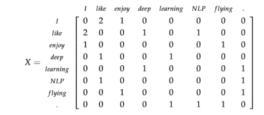
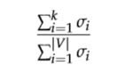
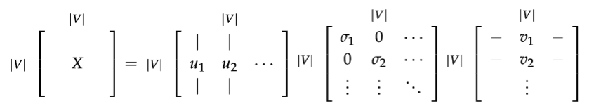
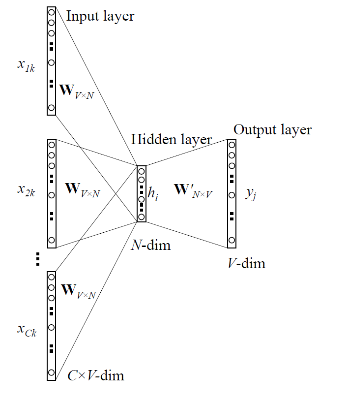
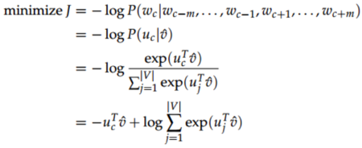
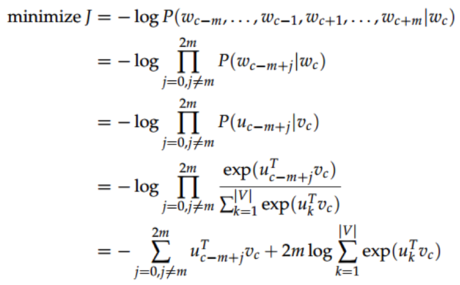
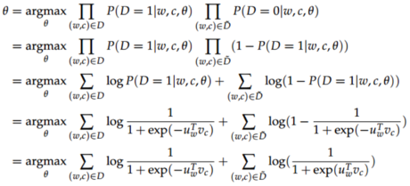

# 深度学习与自然语言处理(1)_ 斯坦福 cs224d Lecture 1

作者：[寒小阳](http://blog.csdn.net/han_xiaoyang) && [龙心尘](http://blog.csdn.net/longxinchen_ml)
时间：2016 年 6 月
出处：[`blog.csdn.net/han_xiaoyang/article/details/51567822`](http://blog.csdn.net/han_xiaoyang/article/details/51567822)
[`blog.csdn.net/longxinchen_ml/article/details/51567960`](http://blog.csdn.net/longxinchen_ml/article/details/51567960)
声明：版权所有，转载请联系作者并注明出处

说明：本文为斯坦福大学 CS224d 课程的中文版内容笔记，已得到斯坦福大学课程@Richard Socher 教授的授权翻译与发表

特别鸣谢：@Fantzy 同学对部分内容翻译的帮助
课堂笔记：第一部分

春季 2016

关键词：自然语言处理（NLP）.词向量（Word Vectors）.奇异值分解(Singular Value Decomposition). Skip-gram. 连续词袋（CBOW）,负采样样本（Negative Sampling）

这是本课程的第一节，我们会先介绍自然语言处理（NLP）的概念和 NLP 现在所面对问题；然后开始讨论用数学向量代表自然语言词组的设想。最后我们会讨论现行的词向量构造方法。

### 1\. 自然语言处理简介

在最开始咱们先说说什么是 NLP。NLP 的目的是设计出算法，让计算机“懂得”人类的自然语言，从而为人类执行任务。这些任务分为几个难度等级，例如

**容易的任务**：

*   语法检查
*   关键词搜索
*   查找同义词

**中等难度的任务**：

*   从网站，文件或其他来源中提取信息

**比较有挑战的任务**：

*   机器翻译（例如：中译英）
*   语意分析（提问者说的意思是什么）
*   指代分析（例如. “他”或“它”在一个特定文件中指的是什么）
*   回答问题（例如.回答“Jeopardy Questions”一种涉及人类社会各个方面的综艺问答）

在处理所有 NLP 任务的时候，我们首先需要解决非常重要的一个问题(可能是最重要的)：用什么方式将词组输入到模型中去。简单的 NLP 问题可能并不需要将词组作为独立个体对待（atomic symbols），但现在的问题绝大多数需要这样一个预处理，来体现词组之间关联/相似性和区别。所以我们引入词向量的概念，如果把词编码成词向量，我们很容易从向量的角度去衡量不同的词之间的关联与差异（常用的距离测度法，包括 Jaccard, Cosine, Euclidean 等等，注：距离测度法，即用一个可观测度量的量来描述一个不能直接观测度量的量）。

### 2.词向量

我们拿英文举例。

英语中大约有 1300 万个词组（token，自定义字符串，译作词组），不过他们全部是独立的吗？并不是哦，比如有一些词组，“Feline 猫科动物”和“Cat 猫”，“Hotel 宾馆“和”Motel 汽车旅馆”，其实有一定的关联或者相似性在。因此，我们希望用词向量编码词组，使它代表在词组的 N 维空间中的一个点（而点与点之间有距离的远近等关系，可以体现深层一点的信息）。每一个词向量的维度都可能会表征一些意义（物理含义），这些意义我们用“声明 speech”来定义。例如，语义维度可以用来表明时态（过去与现在与未来），计数（单数与复数），和性别（男性与女性）。

说起来，词向量的编码方式其实挺有讲究的。咱们从最简单的看起，最简单的编码方式叫做 one-hot vector：假设我们的词库总共有 n 个词，那我们开一个 1*n 的高维向量，而每个词都会在某个索引 index 下取到 1，其余位置全部都取值为 0.词向量在这种类型的编码中如下图所示：

这种词向量编码方式简单粗暴，我们将每一个词作为一个完全独立的个体来表达。遗憾的是，这种方式下，我们的词向量没办法给我们任何形式的词组相似性权衡。例如:

（注：这里 是 的逆矩阵，它们有关系： ，注意到 hotel 和 motel 是近义词）

究其根本你会发现，是你开了一个极高维度的空间，然后每个词语都会占据一个维度，因此没有办法在空间中关联起来。因此我们可能可以把词向量的维度降低一些，在这样一个子空间中，可能原本没有关联的词就关联起来了。

### 3.基于 SVD 的方法

这是一种构造词嵌入（即词向量）的方法，我们首先会遍历所有的文本数据集，然后统计词出现的次数，接着用一个矩阵来表示所有的次数情况，紧接着对 X 进行奇异值分解得到一个的分解。然后用的行（rows）作为所有词表中词的词向量。对于矩阵，我们有几种选择，咱们一起来比较一下。

#### 3.1 词-文档矩阵

最初的想法是，我们猜测相互关联的词组同时出现在相同的文件中的概率很高。例如，“银行”、“债券”、“股票”、“钱”等都可能出现在一起。但是，“银行”、“章鱼”、“香蕉”和“曲棍球”可能不会一直一起出现。基于这个想法，我们建立一个词组文档矩阵，具体是这么做的：遍历海量的文件，每次词组 i 出现在文件 j 中时，将的值加 1。不过大家可想而知，这会是个很大的矩阵，而且矩阵大小还和文档个数 M 有关系。所以咱们最好想办法处理和优化一下。

#### 3.2 基于窗口的共现矩阵 X

我们还是用一样的逻辑，不过换一种统计方式，把矩阵记录的词频变成一个相关性矩阵。我们先规定一个固定大小的窗口，然后统计每个词出现在窗口中次数，这个计数是针对整个语料集做的。可能说得有点含糊，咱们一起来看个例子，假定我们有如下的 3 个句子，同时我们的窗口大小设定为 1（把原始的句子分拆成一个一个的词）：
1\. I enjoy flying.
2\. I like NLP.
3\. I like deep learning.
由此产生的计数矩阵如下：



然后我们对 X 做奇异值分解，观察观察奇异值（矩阵的对角元素），并根据我们期待保留的百分比来进行阶段（只保留前 k 个维度）：



然后我们把子矩阵视作我们的词嵌入矩阵。也就是说，对于词表中的每一个词，我们都用一个 k 维的向量来表达了。

对 X 采用奇异值分解



通过选择前 K 个奇异向量来进行降维：


这两种方法都能产生词向量，它们能够充分地编码语义和句法的信息，但同时也带来了其他的问题：

*   矩阵的维度会经常变化（新的词语经常会增加，语料库的大小也会随时变化）。
*   矩阵是非常稀疏的，因为大多数词并不同时出现。
*   矩阵的维度通常非常高（）
*   训练需要的复杂度（比如 SVD）
*   需要专门对矩阵 X 进行特殊处理，以应对词组频率的极度不平衡的状况

当然，有一些办法可以缓解一下上述提到的问题：

*   忽视诸如“he”、“the” 、“has”等功能词。
*   应用“倾斜窗口”（ramp window），即:根据文件中词组之间的距离给它们的共现次数增加相应的权重。
*   使用皮尔森的相关性（Pearson correlation），将 0 记为负数，而不是它原来的数值。

不过缓解终归只是缓解，咱们需要更合理地解决这些问题，这也就是我们马上要提到的基于迭代的方法。

### 4.基于迭代的方法

现在我们退后一步，来尝试一种新的方法。在这里我们并不计算和存储全局信息，因为这会包含太多大型数据集和数十亿句子。我们尝试创建一个模型，它能够一步步迭代地进行学习，并最终得出每个单词基于其上下文的条件概率。

```
词语的上下文：
一个词语的上下文是它周围 C 个词以内的词。如果 C=2，句子"The quick brown fox jumped over the lazy dog"中单词"fox"的上下文为 {"quick", "brown", "jumped", "over"}.
```

我们想建立一个概率模型，它包含已知和未知参数。每增加一个训练样本，它就能从模型的输入、输出和期望输出（标签），多学到一点点未知参数的信息。

在每次迭代过程中，这个模型都能够评估其误差，并按照一定的更新规则，惩罚那些导致误差的参数。这种想法可以追溯到 1986 年（Learning representations by back-propagating errors. David E. Rumelhart, Geoffrey E. Hinton, and Ronald J.Williams (1988)），我们称之为误差“反向传播”法。

#### 4.1 语言模型（1-gram,2-gram 等等）

首先，我们需要建立一个能给“分词序列”分配概率的模型。我们从一个例子开始：

`"The cat jumped over the puddle."（猫 跳 过 水坑）`

一个好的语言模型会给这句话以很高的概率，因为这是一个在语法和语义上完全有效的句子。同样地，这句”stock boil fish is toy”（股票 煮 鱼 是 玩具）就应该有一个非常低的概率 ，因为它是没有任何意义的。在数学上，我们可以令任意给定的 n 个有序的分词序列的概率为：

我们可以采用一元语言模型。它假定词语的出现是完全独立的，于是可以将整个概率拆开相乘：

看到这里，肯定很多同学就要喷了，这不对，词和词之间没有关联吗？确实，我们知道一句话中每一个词语都跟它前面的词语有很强的依赖关系，忽略这一点的话，一些完全无意义的句子，可能会有很高的概率。咱们稍微改一改，让一个词语的概率依赖于它前面一个词语。我们将这种模型称作 bigram（2-gram，二元语言模型），表示为：

看起来还是有点简单？恩，也对，我们只考虑一个词语依赖于其相邻的一个词语的关系，而不是考虑其依赖整个句子的情况。别着急，接下来将会看到，这种方法能让我们有非常显著的进步。考虑到前面 “词-词”矩阵的情况，我们至少可以算出两个词语共同出现的概率。但是，旧话重提，这仍然要求储存和计算一个非常的大数据集里面的全部信息。
现在我们理解了“分词序列”的概率（其实就是 N-gram 语言模型啦），让我们观察一些能够学习到这些概率的例子。

#### 4.2 连续词袋模型（CBOM）

有种模型是以{“The”, “cat”, ’over”, “the’, “puddle”}为上下文，能够预测或产生它们中心的词语”jumped”，叫做连续词袋模型。

上面是最粗粒度的描述，咱们来深入一点点，看点细节。

首先，我们要建立模型的一些已知参数。它们就是将句子表示为一些 one-hot 向量，作为模型的输入，咱们记为 x(c)吧。模型的输出记为 y(c)吧。因为连续词袋模型只有一个输出，所以其实我们只需记录它为 y。在我们上面举的例子中，y 就是我们已经知道的（有标签的）中心词（如本例中的”jumped”）。

好了，已知参数有了，现在我们一起来定义模型中的未知参数。我们建立两矩阵，和 。其中的 n 是可以任意指定的，它用来定义我们“嵌入空间”（embedding space）的维度。V 是输入词矩阵。当词语（译注：是只有第 i 维是 1 其他维是 0 的 one-hot 向量）作为模型的一个输入的时候，V 的第 i 列就是它的 n 维“嵌入向量”（embedded vector）。我们将 V 的这一列表示为。类似的，U 是输出矩阵。当作为模型输出的时候，U 的第 j 行就是它的 n 维“嵌入向量”。我们将 U 的这一行表示为。要注意我们实际上对于每个词语学习了两个向量。（作为输入词的向量，和作为输出词的向量）。

连续词袋模型（CBOM）中的各个记号：

*   :单词表 V 中的第 i 个单词
*   ：输入词矩阵
*   ：V 的第 i 列，单词的输入向量
*   ：输出词矩阵
*   ：U 的第 i 行，单词的输出向量

那这个模型是如何运作的呢？我们把整个过程拆分成以下几步：

1.  对于 m 个词长度的输入上下文，我们产生它们的 one-hot 向量（）。
2.  我们得到上下文的嵌入词向量（）
3.  将这些向量取平均
4.  产生一个得分向量 
5.  将得分向量转换成概率分布形式
6.  我们希望我们产生的概率分布 ,与真实概率分布相匹配。而刚好也就是我们期望的真实词语的 one-hot 向量。

用一幅图来表示就是下面这个样子：



通过上面说的种种步骤，我们知道有了矩阵 U、V 整个过程是如何运作的，那我们怎样找到 U 和 V 呢？——我们需要有一个目标函数。通常来说，当我们试图从已知概率学习一个新的概率时，最常见的是从信息论的角度寻找方法来评估两个概率分布的差距。其中广受好评又广泛应用的一个评估差异/损失的函数是交叉熵：

结合我们当下的例子，y 只是一个 one-hot 向量，于是上面的损失函数就可以简化为：

我们用 c 表示 y 这个 one-hot 向量取值为 1 的那个维度的下标。所以在我们预测为准确值的情况下。于是损失为 ?1 log(1) = 0。所以对于一个理想的预测值，因为预测得到的概率分布和真实概率分布完全一样，因此损失为 0。现在让我们看一个相反的情况，也就是我们的预测结果非常不理想，此时。计算得到的损失为?1 log(0.01) ≈ 4.605，损失非常大，原本这才是标准结果，可是你给了一个非常低的概率，因此会拿到一个非常大的 loss 。可见交叉熵为我们提供了一个很好的衡量两个概率分布的差异的方法。于是我们最终的优化函数为：



我们用梯度下降法去更新每一个相关的词向量 和 。

#### 4.3 Skip-Gram 模型

很上面提到的模型对应的另一种思路，是以中心的词语”jumped”为输入，能够预测或产生它周围的词语”The”, “cat”, ’over”, “the”, “puddle”等。这里我们叫”jumped”为上下文。我们把它叫做 Skip-Gram 模型。
这个模型的建立与连续词袋模型（CBOM）非常相似，但本质上是交换了输入和输出的位置。我们令输入的 one-hot 向量（中心词）为 x（因为它只有一个），输出向量为 y(j)。U 和 V 的定义与连续词袋模型一样。

Skip-Gram 模型中的各个记号：

*   :单词表 V 中的第 i 个单词
*   ：输入词矩阵
*   ：V 的第 i 列，单词的输入向量
*   ：输出词矩阵
*   ：U 的第 i 行，单词的输出向量

对应到上面部分，我们可以把 Skip-Gram 模型的运作方式拆分成以下几步：

1.  生成 one-hot 输入向量 x。
2.  得到上下文的嵌入词向量。
3.  因为这里不需要取平均值的操作，所以直接是。
4.  通过产生 2m 个得分向量。
5.  将得分向量转换成概率分布形式。
6.  我们希望我们产生的概率分布与真实概率分布 相匹配，也就是我们真实输出结果的 one-hot 向量。

用一幅图来表示这个过程如下：


像连续词袋模型一样，我们需要为模型设定一个目标/损失函数。不过不同的地方是我们这里需要引入朴素贝叶斯假设来将联合概率拆分成独立概率相乘。如果你之前不了解它，可以先跳过。这是一个非常强的条件独立性假设。也就是说只要给出了中心词，所有的输出词是完全独立的。



我们可以用随机梯度下降法去更新未知参数的梯度。

#### 4.4 负面抽样（Negative Sampling）

我们再次观察一下目标函数，注意到对整个单词表|V|求和的计算量是非常巨大的，任何一个对目标函数的更新和求值操作都会有 O(|V|)的时间复杂度。我们需要一个思路去简化一下，我们想办法去求它的近似。
对于每一步训练，我们不去循环整个单词表，而只是抽象一些负面例子就够了！我们可以从一个噪声分布中抽样，其概率分布与单词表中的频率相匹配。为了将描述问题的公式与负面抽样相结合，我们只需要更新我们的：

*   目标函数
*   梯度
*   更新规则

Mikolov ET AL.在他的《Distributed Representations of Words and Phrases and their Compositionality》中提出了负面抽样。虽然负面抽样是基于 Skip-Gram 模型，它实际上是对一个不同的目标函数进行最优化。考虑一个“词-上下文”对（w,c），令 P(D = 1|w, c)为(w, c)来自于语料库的概率。相应的，P(D = 0|w, c) 则是不来自于语料库的概率。我们首先对 P(D = 1|w, c)用 sigmoid 函数建模：

现在我们需要建立一个新的目标函数。如果(w, c)真是来自于语料库，目标函数能够最大化 P(D = 1|w, c)。反之亦然。我们对这两个概率采用一个简单的最大似然法。（这里令θ为模型的参数，在我们的例子中，就是对应的 U 和 V。）



注意这里的表示“错误的”或者“负面的”语料库，像句子”stock boil fish is toy”就是从这样的语料库来的。不自然的句子应该有比较低的发生概率，我们可以从词库中随机采样来产生这样的“负面的”语料库。我们的新目标函数就变成了：

在这里是从(Pn(w))中抽样取到的。需要多说一句的是，虽然关于怎么样最好地近似有许多讨论和研究，但是工作效果最好的似乎是指数为 3/4 的一元语言模型。至于为什么是 3/4，下面有几个例子来帮助大家感性地理解一下：

你看，经过 3/4 这样一个指数处理，”Bombastic”(少见)被采样的概率是之前的 3 倍，而“is”这个词(多见)被采样的概率只是稍微增长了一点点。