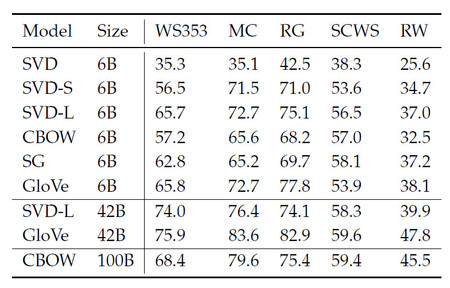
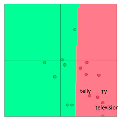
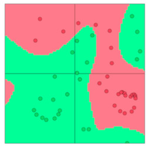

# 深度学习与自然语言处理(2)_ 斯坦福 cs224d Lecture 2

原文作者：Rohit Mundra, Richard Socher
原文翻译：@熊杰(jie.xiong.cs@gmail.com) && @王昱森
内容调整与校对：[寒小阳](http://blog.csdn.net/han_xiaoyang) && [龙心尘](http://blog.csdn.net/longxinchen_ml)
特别鸣谢：[@面包包包包包](http://blog.csdn.net/breada)同学的帮助
时间：2016 年 6 月
出处：[`blog.csdn.net/han_xiaoyang/article/details/51648483`](http://blog.csdn.net/han_xiaoyang/article/details/51648483)
[`blog.csdn.net/longxinchen_ml/article/details/51648532`](http://blog.csdn.net/longxinchen_ml/article/details/51648532)
声明：版权所有，转载请联系作者并注明出处

说明：本文为斯坦福大学 CS224d 课程的中文版内容笔记，已得到斯坦福大学课程@Richard Socher 教授的授权翻译与发表

课堂笔记：第 2 部分

**——————————————————————————————————–**

关键词：内部任务评价（Intrinsic Evaluation）和 外部任务评价（extrinsic evaluations）。超参数影响下的类比评价任务。人类决策和词向量距离的相关性。结合上下文处理歧义。窗口分类。

这个课堂笔记我们将会对词向量（也就是词嵌入）的内部任务评价和外部任务评价方法进行讨论。主要的内容是单词类比(word analogies)技术,我们会把它当做内部任务评价的技术并展示其相关示例，它会在词向量的调谐（tune）中发挥重要作用。我们还会讨论如何训练模型的权重／参数，并关注用来进行外部任务评价的词向量。最后，我们会简单地提到人工神经网络，它在自然语言处理中表现极好。

## 1、词向量的评价

在前面的 Lecture1 中，我们讨论了 Word2Vec 和 GloVe 等词嵌入的方法。它们用来训练和发现词汇在语义空间中的向量表示。今天我们来探讨如何对词向量的效果进行评价。

### 1.1 内部任务评价

内部任务评价是对在特定子任务（如完成单词类比）中生成的词向量进行的评价，这些词向量可以由词嵌入技术（如 Word2Vec 和 GloVe）生成。这些子任务往往很简单，计算速度很快，可以帮助我们理解生成这些词向量的系统。一个内部任务评价往往返回一个数值，来表示这些词向量在子任务上的表现。

图 1：左侧子系统（红）训练消耗较大，通过替换为一个简单的内部任务评价子系统（绿）来优化。

**内部任务评价的特点如下**：

*   一般是在一个特定的子任务中进行评测
*   计算很快
*   有助于理解相关的系统
*   在实际的 NLP 任务中表现好坏，可能需要外部关联实际应用

咱们考虑一个例子，比如我们的目标是要建立一个以词向量为输入，能够回答问题的系统。一种方法是训练一个[机器学习](http://lib.csdn.net/base/2 "undefined")的模型，主要步骤如下:

1.  输入词语
2.  将词语转换成词向量
3.  将词向量作为一个复杂的机器学习系统的输入
4.  把系统的输出映射到自然语言词汇
5.  生成词语组成答案

显然，为了训练这样一个问答系统，我们需要为下游机器学习系统（比如深度神经网络）建立一个最优的词向量表示。这在实际操作中，就需要我们调节 Word2Vec 子系统中的许多超参数(如向量维度)。 尽管最理想的方法是每次调整参数后重新训练整个系统，但这在工程上是不现实的。因为这里的机器学习系统(第 3 步)一般都是一个含有几百万参数的深度神经网络，需要极长时间去训练。等得花儿都谢了。 所以，我们希望有一个简单的内部任务评价方法来评价词向量生成系统的好坏。显然，其中一个要求是内部任务评价结果和整个系统的最终精度是正相关的。

### 　1.2 外部任务评价

外部任务评价是对在实际任务中产生的词向量进行的评价。这些任务通常是很复杂的，且它们的计算过程比较缓慢。在我们前面使用的例子中，允许基于问题对答案进行评估的系统是一种外部任务评价系统。一般来讲， 优化外部评价系统的时候我们无从知晓是哪个子系统除了问题，所以需要进一步进行内部任务评价。

**外部任务评价的特点如下**：

*   在一个实际任务中进行评测
*   需要花很长的时间来计算精度
*   不太清楚是否是某个子系统或者其他子系统，又或是几个子系统互相作用引起的问题
*   如果替换原有的子系统后获得精度提升，则说明替换很可能是有效的

### 1.3 内部任务评价示例: 词向量类比

一个比较流行的内部任务评价是词向量类比的。 在词向量类比中，我们先输入一组不完整的类比:

内部任务评价系统找出最大化余弦相似度的词向量

我们可以直观地解释这个衡量指标。理想情况下，我们想得到(例如，王后–国王 = 女演员 – 男演员)。于是, 所以我们只需要找出一个与的标准化内积（比如余弦相似度）取最大值的词向量就可以了 。
使用内部任务评价的时候需要比较谨慎，要考虑到训练文集的各个方面。例如，如下形式的类比

城市 1 : 城市 1 所属州 : : 城市 2 : 城市 2 所属州

表 1：语义词向量类比(内部评价)会因为同名城市而产生问题

美国有许多同名村镇，所以很多州都符合正确答案。比如在美国至少有十个地方叫 Phonix，所以 Arizona 不一定是唯一的正确答案。 再看以下类比形式:

首都城市 1 : 国家 1 : : 首都城市 2 : 国家 2

表 2: 这些是语义词向量类比(内部任务评价)，此类比存在的问题在于国家在不同时期会有不同的首都

上面这个例子中的城市只是近期的国家首都。比如，1997 年之前 Kazakhstan 的首都是 Almaty。如果我们用来训练的文集比较旧，就很容易出现问题。
之前的两个例子说明了如何使用词向量进行语义测试。我们还可以使用词向量类比进行语法测试。下面的内部任务评价能够评估词向量获取形容词最高级的能力。

表 3：语法词向量类比(内部评价)在形容词最高级上的测试

类似的，下面的内部任务评价能够测试词向量捕捉过去式的能力

表 4: 这些是语法词向量类比(内部任务评价)，此类比可评估获取过去式的能力

### 1.4 内部任务评价调节示例: 类比评测

我们在内部任务评价任务中调整(tuning)一个词嵌入技术时，可能会考虑一些参数：

• 词向量的维度
• 资料库的大小
• 资料源/类型
• 上下文窗口的大小
• 上下文的对称性

大家还能想到其他在这个阶段可以调整的超参数吗?
我们现在探索一些词向量生成技术(如 Word2Vec 和 GloVe)中可以用内部任务评价调节的参数。我们先看一下在超参数相同的情况下，词向量生成方法在类比评测中的表现。

表 5:比较不同参数和数据集情况下各种模型的性能

我们从上表中主要可以看到 3 点：

*   精度和使用的模型高度相关:
    这一点并不意外，因为这些生成词向量的方法所依据的特性是完全不同的(如同时出现的次数，奇异向量等。)
*   文集量越大，精度越高:
    这是因为，例子越多，生成的系统学习到的经验就更丰富。比如在完成词汇类比的例子中，系统如果之前没有接触测试词，就可能会生成错误的结果。
*   如果维度特别低或特别高，精度就会比较低
    低维度词向量无法捕捉文集中不同词语的不同意义。这可以视为我们模型复杂度过低而导致的高偏差。比如 “king”, “queen”, “man”, “woman” 这几个词，我们需要至少 2 个维度像”gender” 如 “leadership” 来把它们编译成 2-字节 词向量。 过低的维度将无法捕捉四个词之间的语义差别，而过高的维度将捕捉到一些对泛化能力没有用的噪音– 即高方差的问题。

tip3: GloVe 一般在使用中间词的两侧大小为 8 的窗口时表现较好

图 2：图中能看出训练时间对训练精度的帮助

图 3：我们可以看到随着文集增大精度的改善

图 4：我们可以看到 GloVe 的精度随着向量维度及上下文窗口大小的改变而改变

### 1.5 内在评价的例子：相关性评价

另外一个评测词向量质量的简单方法是人为对两个词的相似度在一个固定区间内打分(比如说 0-10)，再跟对应向量的余弦相适度进行对比。这个方法曾在多个包含人为评价的数据集上实施过。

*表 6：这里我们看到不同生成方法产生的词向量的相似度，与人为评价的相关性。*

### 1.6 延伸阅读：处理多义性

可能有些同学也想到了，有时候我们会遇到一些特殊的情况：在我们生活中，有时候同一个单词在它的不同上下文和语境下，有着不同的含义/用法，这时候我们希望我们希望用不同的词向量来捕捉到这个单词的不同用法。举个例子说，“跑（run）”既是一个名词又是一个动词，在不同语境中，它可能是不同的词性。Huang 等人（2012）在论文《Improving Word Representations Via Global Context And Multiple Word Prototypes》中描述了如何在自然语言处理中解决上面提到的问题。他们提出的方法本质在于以下几点：

1.  针对目标单词出现的所有位置，收集固定大小的语境窗口（例如，此单词之前的 5 个单词至此单词之后的 5 个单词）
2.  用上下文中词向量的加权平均(用 idf-weighting)来表示每段上下文(当前语境) 。
3.  应用球面 k 均值算法对第二步中的结果进行聚类。
4.  最后，每一次的单词出现都被重新标签成它所属的类，并且针对这个类，来训练相对应的词向量

## 2 对外在性任务进行训练

前面我们着重讨论了内在性任务，并且强调了它们在生成`优质词嵌入技术(词向量)`中的重要性。当然，最终目的是利用词向量解决外部的实际问题。 这里我们讨论处理外部任务的一般方法。

### 2.1 问题描述

大多数的 NLP 外部任务都可以被描述成分类任务。比如说，我们可以对句子做情感分类，判断其指代的情况是褒义，贬义还是中性的。 类似的，在命名实体识别(NER)中，我们需要找出上下文中的中心词所属的类别。例如输入为“Jim bought 300 shares of Acme Corp. in 2006”， 我们期望分类完成后的输出是， “”[Jim]人名 bought 300 shares of [Acme Corp.]机构名 in [2006]时间.”

图 5：针对词向量的分类问题，上图是一个二维词向量分类问题，用简单的线性分类器，比如逻辑回归和支持向量机完成分类

对于这样的问题，我们一般有以下形式的训练集：

其中是用某种方法生成的 d 纬词向量。 是一个 C 维 one-hot 编码向量（译者注：one-hot，“独热”，意为只有一个元素为 1，其余元素均为 0），用来表示我们最终要预测的标签(感情色彩, 其他词, 专名, 买/卖决策, 等)。在一般的机器学习任务中， 我们通常固定输入数据和目标标签，然后用最优化技术（诸如梯度下降法，L-BFGS 法，牛顿法等）训练权重。在自然语言处理中，我们引入了重训练的想法，也就是针对外在性任务时，重新训练输入的词向量。接下来我们讨论何时需要进行这样的操作，以及为什么考虑这么做。

### 2.2 重训练词向量

应用贴士：在训练集比较大的时候，才需要进行词向量重训练，否则反而会影响精度。

我们一般先用一个简单的内部任务评价来初始化用于外部任务评价的词向量。在很多情况下，这些预训练的词向量的在外部任务中的表现已经非常好了。 然而，一些情况下，这些词向量在外部任务中的表现仍然有提升空间。不过，重训练词向量是由风险的。

图 6：我们看到”Telly”, “TV”, 和 “Television” 在重训练之前的分类是准确的。”Telly” 和 “TV” 在外部任务训练集中，而”Television”只出现在测试集中。

如果要在外部任务上重新训练词向量，我们需要保证训练集的大小足够覆盖词库中的大多数单词。因为 Word2Vec 或 GloVe 生成的语义相关的词会在词空间中落在同一部分位置。如果我们用一个比较小的训练集去重训练，这些词在词空间中的位置就会发生变化，在最终任务上的精确度反而可能降低。我们看一个例子。图 6 中预训练的 2 维词向量在某个外部分类任务重被正确分类了。 我们如果只重新训练其中两个词向量，因为训练集较小，从图 7 中我们可以看到，由于词向量的更新，分类边界的变化，其中一个单词被错误的分类了。

因此，如果训练集较小，则最好不好重训练词向量。如果训练集很大，重训练也许能够提升精度。

图 7：我们看到”Telly”和”TV”在重训练之后的分类是准确的。而”Television”的分类错了，因为它只出现在测试集中，训练集中没见着。

### 2.3 Softmax 分类与正则化

我们知道 Softmax 分类函数形式大概是下面这个样子：

上面我们计算了词向量 x 属于类别 j 的概率。然后根据互熵损失函数，一个单词在模型中的损失如下：

因为上式中的只有在 x 属于正确的类时才等于 1，其他均为 0。如果我们假设 k 是那个正确的类，那上式可以简化为：

当然，我们数据集内不止这一个单词，假设我们的训练集是有 N 个数据点的数据集，那总损失应该有如下的形式：

这个公式有一点点不同，注意到其实这里的现在是个函数，返回每个所对应的正确的类。

咱们来估一估，如果我们同时要训练模型中的权重参数(W)和词向量(x)， 需要训练多少个参数呢? 一个以 d-维词向量为输入，输出一个其在 C 个类上的分布的简单的线性模型需要 C·d 个参数。如果我们训练时更新词库中每个单词的词向量，则需要更新|V|个词向量，而每一个都是 d 维。综合一下，我们知道，一个简单的线性分类模型需要更新个参数。

对于一个简单的线性模型来说，这个参数量就显得非常大了，带来的问题是模型很容易在数据集上过拟合。为了缓解过拟合，我们需要引入一个正则项，用贝耶斯的角度来讲，这个正则项其实就是一个给模型的参数加上了一个先验分布，从而希望他们的值更接近 0。

$$

如果咱们找到合适的正则项权重λ，那最小化上面的损失函数得到的模型，不会出现某些权重特别大的情况，同时模型的泛化能力也很不错。需要多说一句的是，正则化这个操作，在我们接触到神经网络这种复杂的模型的时候，更加重要，咱们更应该约束一下，不让模型那么容易过拟合。

### 2.4 词窗分类

图 8：我们这里看到的是一个中心词，和长度为 2 的左右窗口内的词。 这种上下文可以帮助我们分辨 Paris 是一个地点，还是一个人名

我们前面提到的外部任务都是以单个单词为输入的。实际上，由于自然语言的特性，这种情况很少会出现。在自然语言中，有很多一词多义的情况，这时候我们一般会参考上下文来判断。 比如说，如果你要给别人解释”真有你的”是什么意思。你马上就知道根据上下文的不同，”真有你的” 可以是称赞，也可以是生气。 所以在大多数的情况下，我们给模型输入的是一个词序列。这个词序列由一个中心词向量和它上下文的词向量组成。上下文中词的数量又叫词窗大小，任务不同这个参数的取值也不同。一般来讲，小窗口在句法上的精度较高，大窗口在语义上的表现较好。如果我们要把词窗作为 Softmax 模型的输入，我们只要把换成以下形式的 

那相应的，我们计算损失函数梯度的时候，得到的就是如下形式的向量了：

多说一句的是，这个过程中的每一项其实都是独立的，因此在现在工业界的实际操作中，这一步是可以进行分布式计算的。

### 2.5 非线性分类器

|  |  |
| --- | --- |
| 图 9 | 图 10 |

最后我们简单提一下非线性的分类模型，如神经网络。在图 9 中我们可以看到很多点被错误的分类了。在图 10 中，如果使用非线性的决策边界，我们发现训练集中的样本就可以被分对了(因为分界线可以弯曲了嘛)。这是一个简化的例子，但是已经足以说明，为什么实际应用中很多时候需要非线性的决策边界。接下来的课程里，我们会逐步讲到神经网络，这个在深度学习中表现尤为出色的非线性模型。