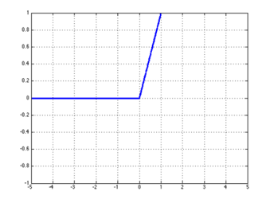

# 深度学习与自然语言处理(3)_ 斯坦福 cs224d Lecture 3

原文作者：Rohit Mundra, Richard Socher
原文翻译：@熊杰(jie.xiong.cs@gmail.com) && @王昱森(ethanwang92@outlook.com) && @范筑军老师( fanzhj@mail.sysu.edu.cn) && @OWEN(owenj1989@126.com)
内容校正：[寒小阳](http://blog.csdn.net/han_xiaoyang) && [龙心尘](http://blog.csdn.net/longxinchen_ml)
时间：2016 年 6 月
出处：[`blog.csdn.net/han_xiaoyang/article/details/51711134`](http://blog.csdn.net/han_xiaoyang/article/details/51711134)
[`blog.csdn.net/longxinchen_ml/article/details/51711172`](http://blog.csdn.net/longxinchen_ml/article/details/51711172)

说明：本文为斯坦福大学 CS224d 课程的中文版内容笔记，已得到斯坦福大学课程@Richard Socher 教授的授权翻译与发表

课堂笔记：第 3 课

* * *

**关键词：神经网络，正向计算，反向传播，神经元，最大化间隔损失，梯度检验， 参数的哈维初始化， 学习速率， ADAGRAD（自适应梯度法）**

这是斯坦福 CS224d 深度学习与自然语言处理的第 3 课，这节课先会介绍单层和多层神经网络和它们在[机器学习](http://lib.csdn.net/base/2 "undefined")分类任务中的应用， 接着介绍如何利用反向传播算法来训练这些神经网络模型（在这个方法中，我们将利用偏导数的链式法则来层层更新神经元参数）。在给出神经网络以及这些算法严谨的数学定义后，介绍了训练神经网络的一些实用的技巧和窍门，比如，神经元（非线性激励），梯度检验，参数的 Xavier 初始化方法，学习速率，ADAGRAD（自适应梯度法）等。最后，我们在神经网络模型的基础上来建立**语言模型**

> **我们发现 notes 最后语言模型这个部分被略去了，回头 ppt 里面扒出来补充给大家**

## 1 神经网络：基础

我们在前面的课程中提到，由于大部分数据并非线性可分，线性分类模型在这些数据上的分类效果略显尴尬，而非线性的分类模型通常能取得更好的效果。 如下图 1 所示，神经网络模型就是这样一类具备非线性决策边界的分类器。 从图上我们可以看到神经网络生成了非线性判定边界，来对 2 类样本做分类，那咱们一起来看看，它是怎么做到的呢。


*图 1 ︰ 在图上可以看到神经网络产生的非线性判定边界，更好地把 2 类样本点分隔开了。这就是神经网络的强大之处（不纠结原始样本的分布状况）。*

***一点小历史 ︰ 神经网络是受生物学启发的分类器，因此它也常被称为人工神经网络（ANN），以区别于生物学上的神经网络。事实上，人类的神经网络复杂性高很多，也比 ANN 具有更强大的能力，所以即使名字很接近，两者之间倒没有那么多的相似之处。***

### 1.1 神经元

简单说来，神经元其实就是一个取个输入，并产生单一输出的通用计算单元。每层神经元通过不同的参数(也称权重)产生不同的输出结果（通常情况下同一层神经元的输入值是相同的，只是权重不同）。比较常见的神经元(激励函数)是”Sigmoid 函数”，也叫作”二项逻辑回归”单元。这种神经元，对于输入的 维向量，通过与维的权重向量 和一个偏差标量做组合运算，输出一个标量（咱们也把它叫做标量激活结果），具体的运算过程如下公式所示：

*其中是权重，是偏移量，是输入*

为了运算的一致性和精简性，我们也可以把权重向量和偏差变量写到一个维的向量里，得到上式的一个等价形式：

*你们看出来了，就是把偏移量放作权重的一部分*

下图 2 是这种神经元的一个直观一点的解释：


*图 2 ︰ 这就是所谓的”二元逻辑回归”神经元，输入向量  的各个元素被  中对应的权重缩放后求和，加上偏移量(数学上可以看做对对输入 x 做线性的变换)之后放进”Sigmond 函数”。*

***一点小总结：神经元呢，可以看做神经网络的基本组成功能单元，有多种多样功能(就是对输入做不同非线性变换)的神经元，它们共同去帮助整个神经网络形成非线性切分的能力。***

### 1.2 单层神经元

刚才看完 1 个神经元的情况了，也知道它在做的非线性变换(输入到输出的运算)是什么，现在咱们拓展一下，看看对于一组输入，一层神经元（其实就是多个神经元）的变换和处理情况，基本的结构，就如下图 3 所示。


*图 3 ︰ 传说中神经网络的一层（多个”二元逻辑回归”神经元），它们的输入是一致的，都是 x。*

我们分别用 ， 和  来表示个神经元的权重向量，偏移量以及激励输出，则有一下的结果：

式子多了看着有点乱，咱们设定一下以下的数学标记，简化简化在神经网络中的公式：

其中，

这样咱们的二元逻辑回归的激励输出就可以写成：

那这些激励输出到底是干嘛的呢，有什么物理含义？ 一种理解方式是， 每个神经元都是对输入向量一个不同角度的处理加工， 提取输入向量的某一部分信息(比如图像数据中的纹理、颜色、轮廓，或者文本信息中的词性、时态等等)。然后这些信息会被用到分类任务中去，为决策提供依据。

### 1.3 前向计算

上一节咱们讨论了如何将一个向量 输给神经网络中的一层（一组(个)二元回归神经元）进而得到他们的激励输出  。 也简单提了一下这么做的意义，为了加深理解，咱们还是用命名实体识别（NER）的例子来直观解释一下这个过程吧。看这样一个例子：

“Museums in Paris are amazing”

我们要来判断这里的中心词”Paris”是不是个命名实体。在这种情况下， 我们不止要知道这个词窗内哪些词向量出现过，可能也需要知道他们之间的相互作用。 比如说，可能只有在”Museums”出现在第 1 个位置，”in”出现在第二个位置的时候，Paris 才是命名实体。如果你直接把词向量丢给 Softmax 函数， 这种非线性的决策是很难做到的。所以我们需要用 1.2 中讨论的方法对输入的变量进行非线性的处理加工(神经元产出非线性激励输出)，再把这些中间层的产物输入到 Softmax 函数中去。 这样我们可以用另一个矩阵 ，与激励输出结果运算生成得分（当然，这里是未归一化的），从而进一步用于分类任务：

公式中的 是前面提到的做非线性变化的激励函数(激活函数)。

**维度分析：** 如果我们用 4 维词向量表示这些词，且用一个词窗口作为输入（就像上面这个例子），那输入的变量就是 . 如果在隐藏层中使用 8 个 sigmoid 神经元，并且由其激励输出生成 1 个得分，我们就有 。

整个运算的过程（逐级的）大概是如下这个样子：


*图 4: 这张图描述了一个前向计算网络如何运算得到输出值*

### 1.4 最大化间隔目标函数

跟大多数机器学习模型一样，神经网络也需要一个优化目标，一个用来衡量模型好坏的度量。优化算法在做的事情呢，通常说来就是找到一组权重，来最优化目标或者最小化误差。这里我们讨论一个比较流行的度量，叫做最大化间隔目标函数。直观的理解就是我们要保证被正确分类的样本分数要高于错误分类的样本得分。

继续用之前的例子，如果我们把一个正确标记的词窗 *“Museums in Paris are amazing”*(这里 Paris 是命名实体)的得分记做 ， 而错误标记的词窗*“Not all Museums in Paris”*(这里 Paris 不是命名实体)的得分记作 (c 表示这个词窗”corrupt”了)

于是，我们的目标函数就是要最大化  或者最小化。 但是，我们要对这个目标函数稍作修改，让他只有在  的时候才计算这个函数的值。因为当正确标记的词窗得分比错误标记的词窗得分高的时候，我们认为是满足要求的，并没有误差，我们只关心错误标记的词窗比正确标记的词窗得分高了多少，它代表了误差的程度。 于是，我们的目标函数在 的时候取值，其余时候取值为现在，优化目标变成：

但是这个优化函数还不稳妥，因为它缺乏一个用来保证安全划分的间隔。我们希望那些被正确标记的词窗得分不仅要比错误标记的词窗得分高，还希望至少高出一个取值为正的间隔 。 换句话说， 我们希望在
 的时候就开始计算误差值，而不是等到 。

因此，我们修改优化目标为 ︰

我们可以把这个的取值定为 1，在学习的过程中，模型其他的权重参数自动会进行相应的缩放，而并不会影响最终分类模型的精度。如果你想了解更多细节的话，可以去读一下支持向量机中关于函数间隔和几何间隔(functional and geometric margins)的内容。所以最后我们定义了以下形式的目标函数，作为在训练集中所有词窗上求最优化的目标：

### 1.5 反向传播训练法（未向量化的逐元素形式）

在这一节中我们来讨论一下，当 1.4 节中的目标函数取值为正的时候， 怎么来训练模型中的各个参数。 如果这个目标函数的取值是 0， 那我们已经不再需要更新参数的取值了。 一般来讲，我们通过可以通过梯度下降法来更新参数（或者一些变种，像随机梯度下降/SGD）。这样就需要每个参数的梯度的信息来实现下面的更新过程：

反向传播这种方法利用导数的链式法则来计算损失函数（正向计算求得）在每个模型参数上的梯度。为了进一步理解上述内容， 我们来看下图 5 所示的这样一个简单的网络：


*图 5:这是一个 4-2-1 的神经网络，第层神经网络上的第个神经元上的输入值是，输出的激励输出值为*

这里我们讨论的是一个只有 1 个隐藏层，1 个单独的输出单元的神经网络。 我们先来统一以下标记：

> *   是神经网络的输入。
> *   是神经网络的输出。
> *   神经网络的每一层（包括输入层和输出层）都有神经元来进行输入和输出。 第层神经网络上的第个神经元上的输入值是，输出的激励输出值为。
> *   我们把反向传播到上的误差记为。
> *   第 1 层指的是输入层而不是第一个隐藏层。对于输入层，我们有。
> *   是把层的激活子输出值映射到层输入值的转换矩阵。于是，把这个一般化的标记用在 1.3 节例子中就有了  以及  。

**一起来看看反向传播吧：** 假设目标函数  取正值，我们希望更新权重参数(如图 5 及图 6 所示)，我们注意到这里只在计算 和 时出现。这一点对于理解反向传播很重要-参数的反向传播梯度只被那些在正向计算中用到过这个参数的值所影响。 在之后的正向计算中和 相乘进而参与到分类得分的计算中。我们从最大化边界损失的形式看到：

于是，为了简化计算， 我们这里可以只考虑 。于是

这样， 我们可以对 化简如下：

我们可以看到这个梯度最终可以简化为 这样一个形式。 这里 就是反向逆推到第层上第个神经元的误差。 则与相乘后输入到第层上第个神经元的计算中。

> 译者注：这里所谓的反向传播误差其实就是最终的目标函数对于第层上第个激励输出值 的导数。当我们要求目标函数关于的导数时， 因为第层上只有 的计算涉及到， 所以可以把 写成关于的函数，接着利用导数的链式法则，得到目标函数关于的导数。误差从层传播到层的过程就等价于求目标函数高阶的导数，这一步同样可以由偏导数的链式法则得到。


*图 6:这个子网络描述的是当我们更新 时所用到的神经网络的有关部分*

我们以图 6 为例子，从”误差分配/分散”的角度来诠释一下反向传播。比如说我们如果要更新 ：

1.  我们从 上的误差信息开始进行逆向传播。
2.  我们把这个误差乘以把 映射到 的神经元的局部梯度上。在这里这个梯度恰好也等于 1 (有兴趣可以自己去算一下)。所以我们得到 。
3.  于是，这个误差信息 已经传到了 上。 我们需要把这个误差分配到上一层 上去。(这里我们不关心 层上的其他激励输出，因为他们的计算不涉及到)
4.  分配到 上的误差为 上的误差 。 于是传播到 上的误差为。***这里记作比较合适***
5.  像第 2 步一样，我们通过把 上的误差乘以把 映射到 的神经元的局部梯度上，来把误差传播到 上。这里这个梯度是 。
6.  于是 上的误差就等于 。记作  。
7.  最后，我们要把这个误差乘以参与前向计算的  从而把误差信息分配到 上。
8.  于是，目标函数关于的导数就有了 这样的形式。

我们可以看到，我们从哪个角度出发，最后得到的结果都是一样的。所以对于反向传播我们既可以从链式法则的角度来理解，也可以从误差分配/分散的角度来理解。

**偏移量的更新** 偏移量（如 ）在计算下一层神经元输入值  时，与其他权重参数在数学形式上是等价的，只不过更他相乘的是常量 1。所以，对于第层上第个神经元偏移量的梯度就是  。比方说，如果我们在上面的例子中，要更新的是  而不是， 那它的梯度就是 。

**从 到 反向传播的一般化步骤：**

1.  我们从  上的误差信息 （即第 层的第 个神经元）开始，见图 7。
2.  我们通过把 乘以路径上的权重 来把这个误差反向传播到上一层的激励输出 上。
3.  于是，激励输出 收到了误差信息 。
4.  不过 在前向计算中，参与到下一层中多个神经元的计算中。比如层上第个神经元上的误差信息也将通过类似第 3 步中的方式传递到 上。
5.  这样， 收到的误差信息就会变成 。
6.  因为第层上有很多个神经元，收到的误差信息可以写成一般化的形式
7.  这样 就收到关于它的所有误差信息了，于是我们通过乘以这个神经元上的局部梯度 来把误差信息传播 到 上。
8.  最终，到达 上的误差信息就是  ,记作  。


*图 7:从 到反向传播*

### 1.6 反向传播训练（向量化的形式）

我们前面介绍了如何计算模型中每个参数的梯度。这里我们要讨论如何把这些计算向量化及矩阵化(高效很多)。
对于权重参数 ，我们知道它的误差梯度为  ，这里 即为把 映射到 上的矩阵。 于是我们可以把误差信息对于整个矩阵 的梯度表示成以下形式:

于是，我们可以把这个矩阵形式的梯度写成(从下一层)反向传播过来的误差和（从这一层）参与到前向计算中的激励输出的外积。


*图 8︰从 到的误差传播*

咱们接着看如何向量化的计算 。参考上面的图 8，。
这可以很容易推广到矩阵形式

在上式中  表示元素对应位相乘（即 Hadamard 积  ）

**计算效率:** 我们知道，在很多科学计算软件中，像 Matlab，[Python](http://lib.csdn.net/base/11 "undefined")（用 NumPy/SciPy 包），向量化计算的效率远高于对每个元素逐个进行计算。所以，才实际操作中，我们尽可能的采用向量化的方式来训练参数。同时，我们在反向传播中应该尽量避免不必要的重复计算。比如说 的计算直接和 相关。 于是我们要保证在我们用 更新 的时候， 我们存下 的值用来下一步计算 。以此类推，我们在 上 我们重复这样的步骤，这种递归过程将使整个反向传播更加有效。

## 2 神经网络：技巧和窍门

前面的部分讨论了神经网络的技术原理，理论和实践结合起来才能发挥大作用，现在咱们介绍一些神经网络在实际应用中常见的技巧和窍门。

### 2.1 梯度检验

我们已经介绍了如何用微积分计算神经网络模型中参数的误差梯度。现在我们介绍另一种不使用误差反向传播，而近似估计梯度的方法：

其中，

从微分的定义来看，上述公式显然是正确的，但是怎么将其应用到求解误差梯度呢？对于一个给定的数据集，当我们正向扰动参数的第 i 个元素时(可以简单理解成加上一个极小的正数)，咱们基于前向传导可以计算出误差项。同理，当我们负向扰动参数的第 i 个元素时，咱们基于前向传导可以计算出新的误差项。因此，其实通过做两次前向运算，我们就可以根据上面的公式估计出任何给定参数的梯度。当然了，其实只做一次前向传导所需要的运算量也不小了，所以在估计梯度时，这种方法比较耗时，但是，在用于验证反向传播的实现时，这种方法很赞，也用得很多。

梯度检验的简单实现可以参照下述方式：

```
def eval_numerical_gradient(f, x):
  """
  a naive implementation of numerical gradient of f at x
  - f should be a function that takes a single argument
  - x is the point (numpy array) to evaluate the gradient
  at
  """
  fx = f(x) # evaluate function value at original point
  grad = np.zeros(x.shape)
  h = 0.00001
  # iterate over all indexes in x
  it = np.nditer(x, flags=[’multi_index’],
                   op_flags=[’readwrite’])
  while not it.finished:
    # evaluate function at x+h
    ix = it.multi_index
    old_value = x[ix]
    x[ix] = old_value + h # increment by h
    fxh = f(x) # evaluate f(x + h)
    x[ix] = old_value # restore to previous value (very important!)
  # compute the partial derivative
  grad[ix] = (fxh - fx) / h # the slope
  it.iternext() # step to next dimension
return grad
```

> 以下为页边注

**梯度检验**：其实一般情况下，解析梯度是一个更快的梯度求解方法，不过容易出错，而梯度检验是个很好的比较解析梯度和数值型梯度的方法。数值型梯度可以用下述公式去计算：

其中，和可以通过正向和负向微调后两次前向传导来计算得到，这种方法的代码实现可以参阅 Snippet 2.1。

> 以上为页边注

### 2.2 正则化

像大多数分类器一样，神经网络也容易产生过拟合，这会导致其在验证集和测试集上的结果并不一定那么理想。为了解决这个问题，简单一点咱们可以应用 L2 正则化，加上正则化项的损失函数可以通过下述公式来计算：

在上述公式中，是矩阵的 F 范数（frobenius norm），是用于在加权和目标函数中进行正则化的相对权重。加上这个正则化项，意在通过作用到损失的平方来惩罚那些在数值上特别大的权重`（译者注：也就是让权重的分配更均匀一些）`。这样一来，目标函数（也就是分类器）的随意度`(译者注：也就是可用于拟合的复杂度)`就被降低了，约束了拟合函数的假设空间，因此减少了发生过拟合的可能性。施加这样一种约束条件可以用先验贝叶斯思想来理解，即最优的权重分配是所有权重都接近 0。你想知道有多接近？对啦，这正是所控制的——大的会倾向于使所有权重都趋于 0。值得注意的是，偏移量不会被正则化，也不会被计算入上述的损失项（试着想想为什么？）。

### 2.3 神经单元

前面的内容里，我们已经讨论过了包含 sigmoid 神经元（sigmoidal neurons）来实现非线性分类的神经网络算法，然而在许多应用中，使用其他激励(激活)函数（activation functions）可以设计出更好的神经网络。这里列举了一些常用选择的函数表达式和梯度定义，它们是可以和上文讨论过的 sigmoid 函数（sigmoidal functions）互相替代的。

**Sigmoid**：这是通常拿来做例子的函数，我们已经讨论过它，其激励(激活)函数为：

其中， 

的梯度为：

> 以下为页边注
> 
> 
> *图 9：Sigmoid 非线性的响应*
> 
> 以上为页边注

**Tanh**：tanh 函数是除了 sigmoid 函数之外的另一种选择，在实际中，它的收敛速度更快。tanh 函数与 sigmoid 函数最主要的不同是 tanh 函数的输出结果在-1 和 1 之间，而 sigmoid 函数的输出结果在 0 和 1 之间。

其中， 
的梯度为：

> 以下为页边注
> 
> 
> *图 10：非线性的响应*
> 
> 以上为页边注

**Hard Tanh**：hard tanh(硬双曲余弦正切)函数在有些时候要优于 tanh 函数，因为它在计算上更为简便。然而当 z 大于 1 时，hard tanh 函数会在数值上形成饱和（译者注：即恒等于 1）。hard tanh 的激活函数为：

其微分也可以用分段函数来表达：

> 以下为页边注
> 
> 
> *图 11：hard tanh 非线性的响应*
> 
> 以上为页边注

**Soft Sign**：Soft Sign 函数是另一个可以被用来替代 Tanh 函数的非线性函数，因为它也不会像硬限幅函数（hard clipped functions）那样过早饱和。其函数表达式为：

其微分表达式为：

其中是符号函数，即根据的符号返回或。

> 以下为页边注
> 
> 
> *图 12：soft sign 非线性的响应*
> 
> 以上为页边注

**ReLU**：ReLU（修正线性单元，Recti?ed Linear Unit）函数是激活函数的一个流行选择，因为即使对特别大的，它也不会饱和，并且已经发现它在计算机视觉应用中非常好用。其函数表达式为：

其微分表达式为：

> 以下为页边注
> 
> 
> *图 13：ReLU 非线性的响应*
> 
> 以上为页边注

**Leaky ReLU**：对于非正数的，传统设计上的 ReLU 单元不会回传误差——而 leaky ReLU 修正了这一点，使得是负数时，很小的误差也会反向传播回传回去。其函数表达式为：

其中，
因此其微分表达式可以被表示为：

> 以下为页边注
> 
> 
> *图 14：leaky ReLU 非线性的响应*
> 
> 以上为页边注

## 2.4 Xavier 参数初始化

在《理解训练深层前馈神经网络的困难（Understanding the Difficulty of Training Deep Feedforward Neural Networks）》(2010)一文中，Xavier 等人研究了不同权重和偏差的初始化方案对训练动力（training dynamics）的影响。实证研究结果表明，对于 sigmoid 和 tanh 激活单元，当矩阵的权重以均匀分布在以下值域范围内被随机初始化时，有着更低的错误率和更快的收敛速度：

其中，是关联的输入单元的数量（fan-in），是关联的输出单元的数量（fan-out）。

在这种参数初始化方案里，偏差项()被初始化为 0。这种方法的目的是维持跨层的激活方差和反向传播梯度方差。如果不初始化，梯度方差（包含大量修正信息）一般会随层间反向传播而很快衰减。

### 2.5 学习速率

模型最优化的过程中，参数更新的速度可以通过学习速率来控制。比如下面的梯度下降公式中，是学习速率：

看到公式以后你可能会认为越大收敛速度会越快，事实上并不是这样哦。学习速率过大甚至可能会导致损失函数的不收敛，因为有时候因为太激进，参数的迭代步伐太大，一不小心跨过了凸优化的极小值，如图 15 所示。在非凸模型中（我们大多数时候遇到的），大学习速率的结果是不可预测的，但出现损失函数不收敛的可能性是非常高的。所以一定要慎重哦。

> 以下为页边注
> 
> 
> *图 15：从上图可以看出，有时候学习率太大，更新的参数反倒跨过了最低点，朝着误差增大的方向挪动了。*
> 
> 以上为页边注

那怎么办呢？一个简单的方案就是，初始化一个比较小的学习速率，谨慎地在参数空间内迭代和调整以避免模型不收敛。同时，我们还可以固定模型中所有参数的学习速率，而不是为模型中所有参数设定不同的学习速率。

深度学习系统训练阶段通常最耗时耗资源，一些研究也试图应用一些新的方法来设置学习速率。例如，Ronan Collobert 通过取神经元输入单元数的平方根的倒数来把权重（）的学习速率进行标准化。另一种方法是允许学习速率随着时间而减小，如：

在上述方案中，是一个可调参数，代表起始学习速率。也是一个可调参数，代表学习速率应该开始降低的时间。实践中，这种方法相当有效。下个部分，我们会讨论另一种方法，即不需要手动调节学习速率的自适应梯度下降法。

### 2.6 使用 AdaGrad 进行次梯度优化

AdaGrad 是标准随机梯度下降法（SGD）的一种实现，但是有一个关键的区别：每个参数的学习速率是不同的。参数的学习速率取决于该参数梯度更新的历史情况，更新的历史越稀疏，就应该使用更大的学习速率加快更新。换句话说，那些在过去未被更新的参数更有可能在现在获得更高的学习速率。其形式如下：

其中，

对应上述公式我们可以看到，在这种算法中，如果梯度历史的方均根（RMS）非常低，学习速率会比较高。算法的实现如下：

```
# Assume the gradient dx and parameter vector x cache += dx**2
x += - learning_rate * dx / np.sqrt(cache + 1e-8)
```